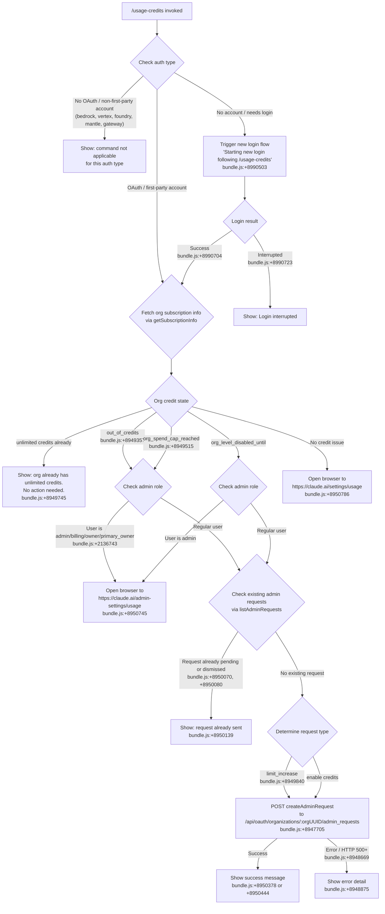

# `/usage-credits`

> Analysis basis: CC v2.1.190 bundle.js (AST extraction + Claude interpretation)
> Minimum version: v2.1.190

---

## Overview

`/usage-credits` is an interactive slash command that helps users remain productive when they hit organizational usage credit limits. It inspects the current account and organization state, then—depending on the credit situation—either sends an admin request for more credits, opens a browser to the relevant settings page, or triggers a fresh login flow. The command renders a JSX UI component (type `local-jsx`) and communicates with the Anthropic API over OAuth.

---

## Registration

| Field | Value |
|---|---|
| type | `local-jsx` |
| name | `usage-credits` |
| description | `Configure usage credits to keep working when you hit a limit` |
| module_id | `kpo` |
| load_inline | `true` |
| loc_byte | `8991849` |
| loc_byte_end | `8992059` |
| loc_line | `3473` |
| arbor_handler.name | `K9t` |
| arbor_handler.fqn | `claude-2.1.190::K9t` |
| arbor_handler.kind | `AsyncFunction` |
| arbor_handler.resolution_path | `module_id` |
| arbor_handler.n_hits | `0` |

Analysis basis: CC v2.1.190 bundle.js:+8991849

---

## Input Branching

The command has 5+ distinct branches based on the organization's credit state, subscription tier, and existing admin requests. A Mermaid flowchart is used.



---

## Behavioral Spec

### Top-Level Handler: usageCreditsHandler (`K9t`)

Analysis basis: CC v2.1.190 bundle.js:+8990075

```
async function usageCreditsHandler(context):
    // Render the local-jsx component via Lpo.jsx (bundle.js:+8990088)
    render usageCreditsComponent

    // Check current authentication state
    authState = getAuthState(context)  // via Ci (bundle.js:+8990181)

    if authState is not first-party OAuth:
        // Non-applicable auth types include: bedrock, foundry, anthropicAws,
        // mantle, vertex, gateway (bundle.js:+2131018..2131226, +8944533)
        display "command not applicable" message
        return

    if no active account:
        // Initiate login before proceeding
        displayMessage("Starting new login following /usage-credits. " +
                        "Exit with Ctrl-C to use existing account.")
        // bundle.js:+8990503
        loginResult = await triggerLoginFlow()
        if loginResult == "Login interrupted":   // bundle.js:+8990723
            display "Login interrupted"
            return
        // "Login successful" (bundle.js:+8990704) → continue
    
    // Fetch subscription / org info
    subscriptionInfo = await getSubscriptionInfo(context)
    // Uses hc (bundle.js:+8990393) and OIe/Ao (bundle.js:+8949055)
    // Subscription types checked: stripe_subscription, stripe_subscription_contracted,
    // apple_subscription, google_play_subscription (bundle.js:+3076354..3076445)
    // Plan tiers checked: pro, max (bundle.js:+8949036, +8949047)
    //                     team, enterprise (bundle.js:+8949147, +8949159)

    creditState = determineCreditState(subscriptionInfo)
    // bundle.js:+8949357, +8949515, +8949484

    switch creditState:
        case "unlimited":
            // bundle.js:+8949745
            display "Your organization already has unlimited usage credits. No request needed."
            return

        case "out_of_credits":
            // bundle.js:+8949402
            display "Your organization is out of usage credits. Contact your admin to add more."
            handleCreditIssue(context, "out_of_credits")

        case "org_spend_cap_reached":
            // bundle.js:+8949567
            display "Your organization's usage credit cap is reached for this period."
            handleCreditIssue(context, "org_spend_cap_reached")

        case "org_level_disabled_until":
            // bundle.js:+8949484
            handleCreditIssue(context, "org_level_disabled_until")

        default:
            // No credit issue — open general usage settings
            openBrowser("https://claude.ai/settings/usage")
            // bundle.js:+8950786
```

### Admin Role Check and Action Dispatch: handleCreditIssue (`bdt`)

Analysis basis: CC v2.1.190 bundle.js:+8949136

```
async function handleCreditIssue(context, issueType):
    userRole = getUserRole(context)
    // Roles: admin, billing, owner, primary_owner (bundle.js:+2136743..2136769)
    // via oA → Ao → Ci → Dt chain

    isAdmin = userRole in ["admin", "billing", "owner", "primary_owner"]

    if isAdmin:
        // Admins go directly to the admin settings URL
        openBrowser("https://claude.ai/admin-settings/usage")
        // bundle.js:+8950745
        return

    // Regular user path — check existing requests
    existingRequests = await listAdminRequests(context)
    // via h9a → Vs.get to "api_admin_request_list" endpoint
    // bundle.js:+8947913, statuses field: bundle.js:+8948016

    alreadyPending = existingRequests contains request where
                     status in ["pending", "dismissed"]
                     // bundle.js:+8950070, +8950080

    if alreadyPending:
        display "You've already sent a usage credit request to your admin."
        // bundle.js:+8950139
        return

    // Determine what type of request to send
    requestType = determineRequestType(issueType)
    // "limit_increase" (bundle.js:+8949840) or enable credits

    if requestType == "limit_increase":
        successMessage = "Request sent to your admin to increase your usage credit limit."
        // bundle.js:+8950378
    else:
        successMessage = "Request sent to your admin to turn on usage credits."
        // bundle.js:+8950444

    result = await createAdminRequest(context, requestType)
    // via m9a → Vs.post to "/api/oauth/organizations/:orgUUID/admin_requests"
    // bundle.js:+8947648, +8947705

    if result.success:
        display successMessage
    else:
        display "Contact your admin to manage usage credit settings."
        // bundle.js:+8949904
        // Error detail extracted from result.detail (bundle.js:+8948875)
```

### Admin Request Eligibility Check (`g9a`)

Analysis basis: CC v2.1.190 bundle.js:+8948261

```
async function checkAdminRequestEligibility(context):
    // Calls "api_admin_request_eligibility" endpoint (bundle.js:+8948264)
    // via g9a → yl → Vs.get
    // Checks for "teleport-org" special case (bundle.js:+8948412)
    response = await apiGet("api_admin_request_eligibility", context)
    return response
```

### API Usage Fetch (`Sae`)

Analysis basis: CC v2.1.190 bundle.js:+5135429

```
async function fetchApiUsage(context):
    // Endpoint: GET /api/oauth/usage (bundle.js:+5135596)
    // Timeout: 5000ms (bundle.js:+5135624)
    // Headers: Content-Type: application/json (bundle.js:+5135638, +5135653)
    // Auth mode: "no-auth" falls back to OAuth (bundle.js:+5135738)
    // On HTTP 401: refresh token and retry
    //   " (401→refresh→retry succeeded)" message (bundle.js:+5135839)
    // On HTTP 401/403 after retry: check if "OAuth token has been revoked"
    //   (bundle.js:+3094228) → trigger re-login
    // Telemetry: "api_usage_fetch" event (bundle.js:+5135432)
    
    response = await httpGet("/api/oauth/usage", {
        timeout: 5000,
        headers: { "Content-Type": "application/json" }
    })
    
    if response.status == 401:
        refreshToken()
        retry request
    elif response.status in [401, 403]:
        if response.body contains "OAuth token has been revoked":
            triggerReLogin()
    
    return response
```

### Error Classification (`_9a`)

Analysis basis: CC v2.1.190 bundle.js:+8948586

```
function classifyApiError(error):
    // Uses ho.isAxiosError check (bundle.js:+8948586)
    // HTTP 500+ treated as server error (bundle.js:+8948669)
    // isAxiosError literal: bundle.js:+183833
    // 429 rate limit handling: bundle.js:+183945
    
    if isAxiosError(error):
        if error.status >= 500:
            return { type: "server_error", detail: error.response.detail }
        elif error.status == 429:
            return { type: "rate_limited" }
    return { type: "unknown_error" }
```

### Browser Open (`Zl` / `vli`)

Analysis basis: CC v2.1.190 bundle.js:+8950903

```
function openBrowserUrl(url):
    // Validates URL scheme: "http:" or "https:" only
    // bundle.js:+3116144, +3116166
    
    if url.scheme not in ["http:", "https:"]:
        raise Error("invalid URL scheme")
    
    // Platform check for darwin → uses "open" command
    // bundle.js:+3116832, +3116851
    if platform == "darwin":
        exec("open", url)
    else:
        exec(platformOpenCommand, url)
    
    // Emits "browser-opened" signal (bundle.js:+8950853)
    emit("browser-opened", url)
```

### Login Flow Trigger (`pRe`)

Analysis basis: CC v2.1.190 bundle.js:+8944419

```
async function triggerLoginFlow(context):
    // Calls e.onChangeAPIKey and e.applyMessageOp (bundle.js:+8944419, +8944438)
    // Updates app state message type to "update" (bundle.js:+8944461)
    // Timestamps via MKe → Date.now (bundle.js:+51557)
    // Sets up X9e remote settings refresh (bundle.js:+8944554)
    // Invokes re-launch via f.execRelaunch (bundle.js:+8944660)
    //   "Starting new login following /usage-credits. Exit with Ctrl-C..." (bundle.js:+8990503)
    
    context.onChangeAPIKey()
    context.applyMessageOp({ type: "update", timestamp: Date.now() })
    
    await remoteSettingsRefresh(context)  // X9e
    
    result = await loginSequence()
    // "Login successful" or "Login interrupted"
    return result
```

---

## State & Side Effects

| Item | Detail |
|---|---|
| Telemetry | `tengu_config_parse_error` (bundle.js:+13754586), `tengu_ember_latch` (bundle.js:+8948999), `tengu_feature_ok` (bundle.js:+1025122), `tengu_feature_bad` (bundle.js:+1025189), `tengu_managed_settings_security_dialog_shown` (bundle.js:+7263713), `tengu_managed_settings_security_dialog_accepted` (bundle.js:+7264050), `tengu_managed_settings_security_dialog_rejected` (bundle.js:+7264209), `tengu_bg_dispatch_sigkill_escalate` (bundle.js:+17198228), `tengu_daemon_config_reload` (bundle.js:+17214348), `tengu_bg_low_mem_mb` (bundle.js:+13054968), `tengu_bg_dispatch_low_mem` (bundle.js:+17198829), `tengu_daemon_idle_exit` (bundle.js:+17219790), `tengu_bg_spare_enable` (bundle.js:+17199526), `tengu_bg_sendclaim_failed` (bundle.js:+17174488), `tengu_bg_state_read_transient` (bundle.js:+4300026), `tengu_bg_spare_claim` (bundle.js:+17199654), `tengu_daemon_control` (bundle.js:+17235957), `tengu_bg_spare_claim_fail` (bundle.js:+17199920), `tengu_policy_limits_fetch` (bundle.js:+13731908), `tengu_disable_bypass_permissions_mode` (bundle.js:+13614401), `tengu_auto_mode_config` (bundle.js:+13612192) |
| API calls | GET `/api/oauth/usage` (bundle.js:+5135596); POST `/api/oauth/organizations/:orgUUID/admin_requests` (bundle.js:+8947705); GET `api_admin_request_list` (bundle.js:+8947913); GET `api_admin_request_eligibility` (bundle.js:+8948264) |
| Browser launch | `openUrl` emits `"browser-opened"` (bundle.js:+8950853); admin URL: `https://claude.ai/admin-settings/usage` (bundle.js:+8950745); user URL: `https://claude.ai/settings/usage` (bundle.js:+8950786) |
| appState changes | `e.setAppState` called during login flow (bundle.js:+8945164); `e.getAppState` read (bundle.js:+8944991); login triggers `e.onChangeAPIKey` (bundle.js:+8944419) and `e.applyMessageOp` (bundle.js:+8944438) |
| Remote settings refresh | `X9e` fires after auth change: `"Remote settings: Refreshed after auth change"` (bundle.js:+7270651) |
| Feature flags | Evaluated via `it` / `gSn` / `LEi` / `kEi` chain (bundle.js:+8948996 etc.); GrowthBook experiment events emitted `"growthbook_experiment"` (bundle.js:+3325527) |
| Token refresh | On 401, OAuth token refresh attempted; `"OAuth token has been revoked"` triggers re-login (bundle.js:+3094228) |
| Process relaunch | `f.execRelaunch` called when login needed (bundle.js:+8944660) |
| Sound | <!-- TODO: not found in depth-2 traversal; needs --depth 4 --> |

---

## Version History

| Version | Change |
|---|---|
| v2.1.190 | Initial analysis |

---

## Common Mistakes

1. **Running on non-OAuth auth types**: The command only works with first-party Anthropic OAuth accounts. Users on AWS Bedrock, Google Vertex, Foundry, Mantle, or gateway configurations will not be able to use this command to request credits.
2. **Expecting immediate effect**: After an admin request is sent successfully, the credit limit is not increased instantly. The request must be approved by an admin through the Claude web interface.
3. **Duplicate request attempts**: If a request is already in `"pending"` or `"dismissed"` state, the command will inform the user rather than sending another. Users should wait for admin action or contact their admin directly.
4. **Using the command as an admin**: Admins are redirected directly to `https://claude.ai/admin-settings/usage` in a browser rather than the command sending an API request on their behalf — the action must be completed in the browser.
5. **Interrupted login**: If Ctrl-C is pressed during the login flow triggered by `/usage-credits`, the login is interrupted and the credits workflow does not proceed. Re-run the command after a successful login.
6. **Teleport-org restriction**: Organizations using the `"teleport-org"` configuration (bundle.js:+8948412) may have different eligibility behavior for admin requests.

---

## Appendix — Identifier Mapping

> For bundle debugging only. Identifiers change across versions.

| Identifier | Role |
|---|---|
| `K9t` | Main handler for `/usage-credits` (AsyncFunction, Arbor-resolved) |
| `W9t` | Inner setup / context wiring for the command |
| `Ci` | Auth state reader / credential type resolver |
| `YLr` | Auth type branch helper A |
| `jLr` | Auth type branch helper B |
| `ay` | Credential/account state aggregator |
| `Ad` | Account data accessor |
| `dA` | OAuth account detail extractor |
| `Nl` | Notification / listener registrar |
| `Yg` | Auth requirement checker (env var / key guard) |
| `eRt` | Environment key resolver helper |
| `mZe` | Auth token normalizer |
| `i0` | Initialization helper for command context |
| `it` | Feature flag evaluator (main entry) |
| `txt` | Feature flag true-value resolver |
| `nxt` | Feature flag false-value resolver |
| `V9` | Feature flag value lookup |
| `q9` | Feature registry getter |
| `gSn` | Feature flag cache/fetch orchestrator |
| `lBr` | Feature flag loader (fetches from remote, emits GrowthBook events) |
| `mBr` | Feature flag background poller |
| `Dt` | Config read/write utility |
| `Wt` | Config state accessor |
| `OOo` | Config object builder |
| `SEe` | Config file sync reader/writer (with backup) |
| `BRf` | Config file watcher/reloader |
| `OIe` | Subscription info fetcher (outer) |
| `hc` | Auth + config composite reader |
| `Ao` | Subscription plan type checker |
| `H2` | Array inclusion utility |
| `Vi` | Telemetry / network traffic mode checker |
| `Jns` | Network traffic mode resolver |
| `nt` | String normalizer / coercer |
| `bdt` | Admin request orchestrator (list / create / classify) |
| `oA` | Role + credential composite checker |
| `Sae` | API usage fetcher (GET /api/oauth/usage, 401 retry) |
| `yl` | HTTP client wrapper (base request) |
| `Le` | HTTP GET helper |
| `Re` | HTTP POST helper |
| `VC` | Subscription type / plan membership checker |
| `Nk` | OAuth error classifier (401/403 + revocation check) |
| `cU` | Token refresh cache manager |
| `T` | Logger / structured log emitter |
| `nLc` | Log level / queue manager |
| `Me` | JSON serializer helper |
| `wc` | Log message formatter / redactor |
| `hze` | Log entry builder |
| `iLc` | Log file writer (with size cap) |
| `g9a` | Admin request eligibility checker |
| `h9a` | Admin request list fetcher |
| `m9a` | Admin request creator (POST) |
| `_9a` | Axios error classifier |
| `jH` | Credit state message selector |
| `be` | String error extractor |
| `ke` | Error handler / logger |
| `fo` | Error string formatter |
| `oou` | Error queue manager |
| `Zl` | Browser open dispatcher |
| `ktd` | URL scheme validator |
| `vli` | Platform-specific open command selector |
| `A_` | Platform process spawner |
| `Un` | Child process wrapper |
| `pRe` | Login / re-auth flow handler |
| `MKe` | Timestamp generator wrapper |
| `Ir` | Auth token reader |
| `X9e` | Remote settings refresh orchestrator |
| `XHa` | Remote settings init helper |
| `r$t` | Remote settings cache reader |
| `B7` | Remote settings fetcher (HTTP) |
| `Gpe` | Remote settings GET helper |
| `Hoe` | Remote settings hash checker |
| `QPe` | Remote settings parse helper |
| `zH` | Remote settings storage writer |
| `Eu` | Remote settings notification dispatcher |
| `pA` | Remote settings plan filter |
| `oRt` | Remote settings org filter |
| `APn` | Remote settings apply-and-notify |
| `vas` | Settings change notifier |
| `bno` | Remote settings load-with-timeout |
| `VHa` | Remote settings consent dialog trigger |
| `UHa` | Remote settings timeout deferred handler |
| `Cno` | Remote settings HTTP fetch + cache update |
| `Wpe` | Remote settings GET request builder |
| `oHa` | Remote settings hash computer (SHA-256) |
| `Stp` | Remote settings response processor |
| `j7e` | Remote settings binary helper |
| `WHa` | Remote settings cache-write helper |
| `FHa` | Remote settings security check dialog |
| `$Ha` | Remote settings approval handler |
| `qHa` | Remote settings file writer (atomic) |
| `jHa` | Remote settings background poll timer |
| `YHa` | Remote settings poll orchestrator |
| `LSn` | Interval-based poller utility |
| `btp` | Remote settings background poll step |
| `Ei` | Hook registrar (C6o.register) |
| `t9n` | State deep-equality watcher |
| `Tn` | State subscription manager |
| `gsn` | State store bootstrap |
| `l2` | State store slice registry |
| `f` | Daemon process manager (exec relaunch, session control) |
| `D` | Daemon instance controller |
| `VEc` | Daemon real-path resolver |
| `sp` | Daemon spawn helper |
| `XJf` | Daemon IPC frame builder |
| `d` | Daemon write/stream handler |
| `Kn` | Subprocess runner with timeout |
| `GXn` | Memory monitor (macOS) |
| `B2e` | Pins file reader |
| `MDt` | Pins path builder |
| `Gt` | JSON parse helper |
| `kn` | Error code normalizer |
| `ECd` | Directory file scanner |
| `U` | Session retire-if-settled handler |
| `N` | Session state checker |
| `M` | Session idle timeout |
| `L3o` | Daemon socket claim sender |
| `n1o` | Daemon state file writer |
| `EJf` | Claim-send timeout enforcer |
| `yJf` | Claim frame builder |
| `Jd` | JSON string helper |
| `gR` | Binary frame encoder |
| `P3o` | Session lifecycle manager (spawn, retire, clean up) |
| `ec` | Session path builder |
| `Di` | Session file reader/watcher |
| `yg` | Session state classifier |
| `cn` | Error constructor |
| `Eve` | Gitignore / file exclusion parser |
| `kd` | Session metadata writer |
| `cht` | Session heartbeat checker |
| `i8t` | Session lock file path builder |
| `bye` | Session roster file path builder |
| `yR` | Session late-roster handler |
| `uN` | Session lock writer |
| `lM` | Session late-lock handler |
| `s8t` | Session socket path builder |
| `p` | Forced-shutdown handler |
| `jb` | Shutdown reason logger |
| `u` | Background session manager |
| `Pe` | Platform capability checker |
| `aKe` | Platform detection helper |
| `F` | Poll interval cleaner |
| `o9n` | Feature refresh orchestrator |
| `uXt` | Feature refresh lock |
| `VQ` | Feature refresh debouncer |
| `i9a` | Feature payload cache clearer |
| `vse` | Feature version setter |
| `PIe` | Feature init flag |
| `o9a` | Feature org context setter |
| `Hpo` | Feature user context setter |
| `_Sn` | Feature refresh executor |
| `LEi` | Feature payload applier |
| `kEi` | Feature snapshot builder |
| `K5` | Global config loader / cache warmer |
| `a9a` | Global config raw reader |
| `RK` | Config key allow-list checker |
| `Sdt` | Config merge processor |
| `Ukp` | Config user-level reader |
| `Nkp` | Config org-level merger |
| `Okp` | Config policy reader |
| `Dkp` | Config defaults applier |
| `ex` | Flag settings updater |
| `CEt` | CA certificate cache clearer |
| `qSn` | Feature flag sync helper |
| `Ecs` | CA cert cache clear action |
| `Tcs` | mTLS config cache clear action |
| `ECr` | Proxy agent cache clear action |
| `mvt` | Proxy agent builder |
| `rU` | Proxy config reader |
| `Qvs` | Proxy URL resolver |
| `iz` | Proxy URL parser |
| `G9t` | Policy limits loader |
| `bOo` | Policy limits init (watch + clear) |
| `IOo` | Policy limits watcher |
| `Wme` | Policy model/tool inclusion checker |
| `xQn` | Policy limits load-with-timeout |
| `K9` | Policy limits cache accessor |
| `eCe` | Policy limits file path builder |
| `DQn` | Policy limits poll orchestrator |
| `HGl` | Policy limits HTTP fetch + cache update |
| `_Gl` | Policy limits background poller |
| `UIe` | UI notification registry |
| `Kse` | Feature flag session cleanup |
| `iet` | Feature flag teardown (clear all caches) |
| `gBr` | Interval/process-listener cleaner |
| `KMt` | Trusted device token checker |
| `Oto` | Credential storage reader |
| `oo` | Secure storage backend |
| `cYt` | Secure storage bind helper |
| `A0e` | Credential lookup helper |
| `Gl` | Credential store manager |
| `vWs` | Credential CRUD operations |
| `$Ft` | Trusted device enrollment handler |
| `vU` | Feature-gated value reader |
| `xEi` | Feature-gated value resolver |
| `Kep` | Trusted device HF flag checker |
| `Rto` | Trusted device Fu flag checker |
| `Ls` | OAuth base URL builder |
| `MXo` | Environment name detector |
| `HGc` | Stage URL selector |
| `Nrn` | Enrollment error classifier |
| `l9a` | Usage credits UI sub-component |
| `U9t` | Permission mode handler |
| `i9n` | Permission bypass mode reader |
| `hBr` | Permission feature flag evaluator |
| `e$t` | Permission update dispatcher |
| `iH` | Permission rule updater |
| `Or` | App state introspector (working dir, tools, permission mode) |
| `G8n` | App state field reader A |
| `os` | App state field accessor |
| `W8n` | App state field reader B |
| `N2` | Feature flag + Bo query helper |
| `Epo` | Usage credits additional context provider |
| `F9t` | Auto-mode config handler |
| `$9t` | Auto-mode eligibility checker |
| `zz` | HSn history state reader |
| `XPo` | Auto-mode feature flag reader |
| `YPo` | Auto-mode plan check |
| `gs` | Auto-mode state builder |
| `Sme` | Model compatibility checker (claude-3/4 families) |
| `Qxe` | Auto-mode H9 resolver |
| `cZe` | Model name normalizer |
| `DX` | Auto-mode circuit breaker reader |
| `O$` | Auto-mode gate-denied handler |
| `Fhe` | Permission mode changed event emitter |
| `EEe` | Object-entries-to-iH batch applier |

---

Note: index built via Arbor fallback; some signals (telemetry, literals) may be missing — see arbor-fallback.js.