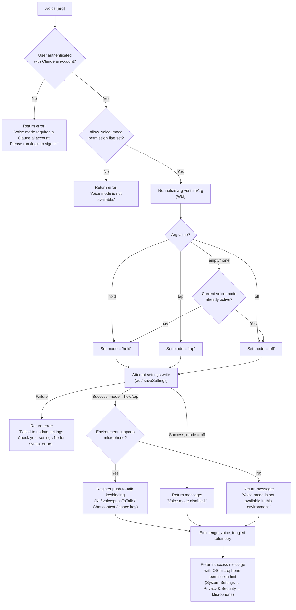

# `/voice`

> Analysis basis: CC v2.1.190 bundle.js (AST extraction + Claude interpretation)
> Minimum version: v2.1.190

---

## Overview

The `/voice` command toggles voice mode in Claude Code, allowing users to enable or disable voice input via three sub-modes: `hold` (push-to-talk), `tap` (tap-to-toggle), and `off` (disable). It enforces authentication and environment-capability checks before persisting the chosen mode to settings, and emits a telemetry event on every successful toggle.

---

## Registration

| Field | Value |
|---|---|
| type | `local` |
| name | `voice` |
| description | `Toggle voice mode` |
| argumentHint | `[hold\|tap\|off]` |
| supportsNonInteractive | `false` |
| isHidden | `null` |
| module_id | `j$l` |
| load_inline | `true` |
| loc_byte | `12997077` |
| loc_byte_end | `12997319` |
| loc_line | `8829` |
| arbor_handler.name | `qbf` |
| arbor_handler.fqn | `claude-2.1.190::qbf` |
| arbor_handler.kind | `AsyncFunction` |
| arbor_handler.resolution_path | `module_id` |
| arbor_handler.n_hits | `1` |

Analysis basis: CC v2.1.190 bundle.js:+12997077

---

## Input Branching

The command has 5+ distinct branches depending on authentication state, environment capability, argument value, and settings-write outcome, so a Mermaid flowchart is used.



Analysis basis: CC v2.1.190 bundle.js:+12994562 (handler entry `qbf`), +12994573, +12994603, +12994702, +12994740, +12994747, +12994756, +12994823, +12994892, +12994990, +12995071, +12995128, +12995188, +12995218, +12995297, +12995317, +12995372, +12995859, +12996338, +12996472, +12996490, +12996799

---

## Behavioral Spec

### 1. Handler Entry (`voiceCommandHandler` / `qbf`)

The handler is an `AsyncFunction` resolved via the `module_id` path (`j$l`).

```
async function voiceCommandHandler(args, context):
    // Step 1: Auth check
    accountInfo = getAccountInfo(context)       // ay → dA chain
    if not accountInfo or not isClaudeAiAccount(accountInfo):
        return errorMessage("Voice mode requires a Claude.ai account. Please run /login to sign in.")

    // Step 2: Permission/capability check
    voiceAllowed = checkPermissionFlag("allow_voice_mode", context)  // wXn → Js
    if not voiceAllowed:
        return errorMessage("Voice mode is not available.")

    // Step 3: Normalize the argument
    rawArg = trimArg(args)                     // Wbf, e.trim
    mode = parseVoiceMode(rawArg)              // → "hold" | "tap" | "off" | inferred

    // Step 4: Infer toggle if no explicit arg
    if mode is null or empty:
        currentMode = getCurrentVoiceMode(context)
        mode = (currentMode is active) ? "off" : "hold"

    // Step 5: Persist to settings
    writeResult = await saveSettings({ voiceMode: mode }, context)  // ao
    if writeResult.error:
        return errorMessage("Failed to update settings. Check your settings file for syntax errors.")

    // Step 6: Mode-specific response
    if mode == "off":
        emitTelemetry("tengu_voice_toggled", { mode: "off" })   // W → tengu_voice_toggled
        return "Voice mode disabled."

    // Step 7: Environment capability check
    envSupported = checkEnvironmentSupport(context)              // $xo / vVt
    if not envSupported:
        emitTelemetry("tengu_voice_toggled", { mode: mode, env: "unsupported" })
        return "Voice mode is not available in this environment."

    // Step 8: Register keybinding
    registerKeybinding({                        // KI
        action: "voice:pushToTalk",
        context: "Chat",
        key: "space"
    })

    // Step 9: Emit telemetry and return
    emitTelemetry("tengu_voice_toggled", { mode: mode })
    return successMessage(mode, microphoneHint)
```

Analysis basis: CC v2.1.190 bundle.js:+12994562, +12994573, +12994603, +12994702, +12994740, +12994747, +12994756, +12994823, +12994892, +12995071, +12995128, +12995188, +12995218, +12995297, +12995317, +12995372, +12995859, +12996338, +12996341, +12996367

### 2. Auth / Account Resolution (`getAccountAndApiAuth` / `tHt` + `ay`)

```
function resolveAuthContext(context):
    apiAuth = loadApiAuth(context)             // ay → Yg
    if not apiAuth.hasKey("ANTHROPIC_API_KEY") and
       not apiAuth.hasKey("ANTHROPIC_AUTH_TOKEN") and
       not apiAuth.hasKey("CLAUDE_CODE_OAUTH_TOKEN") and
       not apiAuth.hasWifVars():
        raise Error("ANTHROPIC_API_KEY, ANTHROPIC_AUTH_TOKEN, … required")

    profile = resolveProfile(context)          // ay → dA
    if profile.type == "user_oauth":
        return { accountType: "claude_ai", profile }
    elif profile.type == "profile-implicit":
        return { accountType: "implicit", profile }
    return { accountType: "api_key", profile }
```

Analysis basis: CC v2.1.190 bundle.js:+12983845, +12983852, +3053251, +3053324, +3057194

### 3. Permission Flag Check (`checkVoicePermission` / `wXn` → `Js`)

```
function checkVoicePermission(context):
    flags = loadSettingsFlags(context)         // Js → Wad.has, qad.has
    if flags.has("allow_voice_mode"):
        return flags.get("allow_voice_mode")
    // Falls back to network-traffic classification
    if networkClassification == "essential-traffic":
        return false
    return flags.get("allow_product_feedback") ?? false
```

Analysis basis: CC v2.1.190 bundle.js:+12983800, +12983803, +3352351, +3352383, +3352407, +1054436

### 4. Voice Mode Argument Parser (`parseVoiceMode` / `Wbf`)

```
function parseVoiceMode(rawArg):
    trimmed = rawArg.trim()
    switch trimmed:
        case "hold"    → return "hold"
        case "tap"     → return "tap"
        case "off"     → return "off"
        case ""        → return null          // triggers toggle inference
        default        → return "invalid"     // signals parse failure
```

The constants `"hold"`, `"tap"`, `"off"`, and `"invalid"` appear directly in the bundle.

Analysis basis: CC v2.1.190 bundle.js:+12994432, +12994479, +12994491, +12994502, +12994523

### 5. Settings Write (`saveSettings` / `ao`)

The settings-save path (`ao`) touches:
- Settings file path construction: `~/.claude/settings.json` and `settings.local.json`
- File integrity via atomic write (temp file → rename): `sIt` calls `uf.openSync`, `uf.writeFileSync`, `uf.fchmodSync`, `uf.fsyncSync`, then `r.renameSync`
- Git-ignore protection check (`Gis`): inspects global gitignore and `core.excludesfile`
- Cache invalidation (`bH`): clears two in-memory caches (`XYt.clear`, `xsr.clear`)
- Event emission: `uYe.emit` after write

Analysis basis: CC v2.1.190 bundle.js:+1337016, +1337068, +1337678, +1337682, +1337702, +1337755, +1337820, +1337862, +1338040, +1338064, +1317356, +1317366, +1317428

### 6. Keybinding Registration (`registerVoiceKeybinding` / `KI`)

```
function registerVoiceKeybinding():
    if alreadyRegistered("voice:pushToTalk"):   // hxi.has
        return
    markRegistered("voice:pushToTalk")           // hxi.add
    loadKeybindingConfig()                       // JTn → jMt
    binding = {
        action: "voice:pushToTalk",
        context: "Chat",
        key: "space"
    }
    applyBinding(binding)                        // QTn
    emitTelemetry("tengu_keybinding_fallback_used")
    // or tengu_custom_keybindings_loaded if user config overrides
```

Analysis basis: CC v2.1.190 bundle.js:+12996338, +12996341, +12996360, +12996367, +3996610, +3996668, +3996679, +3996690, +3996743, +3996767, +3996770

### 7. Operating System Microphone Permission Hint

When voice mode is successfully enabled, the handler returns a hint string referencing:
- `"System Settings → Privacy & Security → Microphone"` — macOS permission path

Analysis basis: CC v2.1.190 bundle.js:+12995879

### 8. Settings Load Infrastructure (`loadSettingsFromDisk` / `PG` → `eSr`)

On every invocation the handler loads current settings to check the existing voice state:

```
function loadSettingsFromDisk():
    mark("loadSettingsFromDisk_start")
    log("info", "settings_load_started")
    flagSettings    = readFlagLayer()
    policySettings  = readPolicyLayer()
    userSettings    = readUserLayer()       // ~/.claude/settings.json
    projectSettings = readProjectLayer()
    localSettings   = readLocalLayer()      // settings.local.json
    sdkInline       = readSdkInlineLayer()  // "SDK inline settings"
    mark("loadSettingsFromDisk_end")
    log("info", "settings_load_completed")
    return mergedSettings
```

Analysis basis: CC v2.1.190 bundle.js:+1334391, +1334417, +1334420, +1334456, +1334460, +1334476, +1334504, +1322104, +1322125, +1313523, +1313545, +1317102, +1317153, +1317175, +1315751

---

## State & Side Effects

| Item | Detail |
|---|---|
| Telemetry: `tengu_voice_toggled` | Emitted on every successful invocation path (enable or disable). Analysis basis: CC v2.1.190 bundle.js:+12995073 |
| Telemetry: `tengu_keybinding_fallback_used` | Emitted when push-to-talk keybinding is registered with a default (not user-customized) binding. Analysis basis: CC v2.1.190 bundle.js:+3996692 |
| Telemetry: `tengu_custom_keybindings_loaded` | Emitted when the user's `keybindings.json` is loaded and applied. Analysis basis: CC v2.1.190 bundle.js:+3987594 |
| Telemetry: `tengu_feature_ok` / `tengu_feature_bad` / `tengu_feature_sad` | Emitted by the shared feature-flag / capability check wrapper. Analysis basis: CC v2.1.190 bundle.js:+1025122, +1025189, +1025270 |
| Settings write | Mutates `~/.claude/settings.json` (or project-local equivalent) via atomic temp-file rename. Clears in-memory settings caches `XYt` and `xsr`. Analysis basis: CC v2.1.190 bundle.js:+29197, +29209 |
| Keybinding registration | Registers action `"voice:pushToTalk"` in the `"Chat"` context bound to `"space"`, stored in the keybinding registry set `hxi`. Analysis basis: CC v2.1.190 bundle.js:+12996341, +12996360, +12996367, +3996668, +3996679 |
| appState changes | Voice mode value written to persistent settings layer; in-memory caches invalidated. |
| Event bus | `uYe.emit` called after settings save completes. Analysis basis: CC v2.1.190 bundle.js:+1338064 |
| Sound | None observed in depth-2 traversal. |

---

## Version History

| Version | Change |
|---|---|
| v2.1.190 | Initial analysis |

---

## Common Mistakes

1. **Running `/voice` without a Claude.ai account**: API-key-only sessions receive the error `"Voice mode requires a Claude.ai account. Please run /login to sign in."` — authenticate via `/login` first.
2. **Omitting the argument expecting a simple on/off toggle**: Without an argument, the command infers the opposite of the current state (active → `off`, inactive → `hold`). If you want `tap` mode, you must pass it explicitly: `/voice tap`.
3. **Using `/voice` in non-interactive pipelines**: `supportsNonInteractive` is `false`; the command will not execute in headless/piped sessions.
4. **Ignoring the settings-file syntax error message**: If `settings.json` has invalid JSON, the write will fail silently from the user's perspective except for the error message. Fix the JSON syntax before re-running.
5. **Expecting microphone access to be granted automatically**: The command only sets the mode flag and registers the keybinding. Actual microphone permission on macOS must be granted separately via System Settings → Privacy & Security → Microphone.
6. **Assuming `/voice off` unregisters the keybinding**: The `"voice:pushToTalk"` keybinding registration is guarded by a one-time `hxi.has` check and is not removed when voice mode is disabled.

---

## Appendix — Identifier Mapping

> For bundle debugging only. Identifiers change across versions.

| Identifier | Role |
|---|---|
| `qbf` | Main async handler for `/voice` command (arbor_handler) |
| `tHt` | Auth context resolution — combines account + API auth |
| `vXn` | Voice permission flag check sub-routine |
| `ay` | API auth / account loader (resolves profile type) |
| `Ad` | Settings merge / apply helper |
| `dA` | Profile resolution (returns `profile-implicit`, `user_oauth`, etc.) |
| `Nl` | First-party account classification (`"firstParty"` check) |
| `rT` | Runtime token / credential retriever |
| `Yg` | API key validator (checks env vars, raises missing-auth error) |
| `eRt` | Error normaliser used in auth chain |
| `mZe` | Notification / status emitter in auth chain |
| `pA` | Voice-mode availability sub-check |
| `AVt` | Account type accessor |
| `wXn` | Outer voice-permission gating function (calls `Js`) |
| `Js` | Settings flag lookup — checks `allow_voice_mode` and `allow_product_feedback` |
| `sSi` | Settings initialisation |
| `K9` | Flag-set constructor |
| `Vi` | Network-class check (`"essential-traffic"`) |
| `Rme` | Notification emitter inside flag checks |
| `Jz` | Keybinding / flag cache accessor |
| `Ur` | Settings load dispatcher |
| `PG` | `loadSettingsFromDisk` orchestrator |
| `qL` | Performance mark emitter |
| `ta` | Memory-usage sampler (called during settings load) |
| `K3` | Node `require` wrapper (loads `perf_hooks`) |
| `eSr` | Settings-load core implementation |
| `vn` | File logger (appendFileSync) |
| `QYt` | Telemetry sink for settings-load |
| `rCt` | Flag-layer reader |
| `$ls` | Object-key enumerator for settings layers |
| `dbe` | User-settings file path builder (`~/.claude/settings.json`) |
| `DG` | Settings diff / change-detector |
| `Uls` | SDK inline settings reader |
| `l2` | Merged-settings builder |
| `gr` | Environment variable reader |
| `oCt` | WSL detection helper |
| `JYt` | Post-load hook dispatcher |
| `bVt` | Current voice-mode state reader |
| `Wbf` | Voice mode argument parser (`hold`/`tap`/`off`/`invalid`) |
| `ao` | Settings save (write) implementation |
| `Jm` | Settings path resolver (combines `dbe` + `l2`) |
| `Wt` | Logging utility |
| `ZEr` | Settings reload helper |
| `DC` | Config directory resolver |
| `JJ` | File reader with BOM/encoding detection |
| `Nd` | Path normaliser (realpath) |
| `T` | OS/platform detector |
| `Drn` | Directory existence checker |
| `kn` | `cn`-based error-code helper |
| `cn` | Error code extractor |
| `cEr` | Cache-timestamp setter (`Con.set`) |
| `nNe` | Settings file path + metadata resolver |
| `msn` | Home-directory path builder |
| `sIt` | Atomic file writer (open → write → fchmod → fsync → rename) |
| `T7e` | Fchmod error-code filter (`EINVAL`/`ENOTSUP`/`EPERM`/`ENOSYS`) |
| `Me` | JSON stringifier wrapper |
| `bH` | In-memory settings cache invalidator (clears `XYt` and `xsr`) |
| `Gis` | Git-ignore check for settings path |
| `Pt` | Async-local-storage store accessor |
| `Mrn` | Store getter (`xrn.getStore`) |
| `Vyr` | User config path resolver (`cu`) |
| `Son` | Git `check-ignore` executor |
| `Wr` | Child-process spawner |
| `mau` | Path expander (handles `~/` prefix) |
| `$is` | Git `ls-files --error-unmatch` checker |
| `Bis` | Git global-config `core.excludesfile` reader |
| `g9` | `.claude` directory path builder |
| `Mt` | Feature-flag `ok` emitter |
| `W` | Feature-flag wrapper / gate |
| `Pe` | Feature-flag `bad`/`sad` emitter |
| `aKe` | Feature event payload builder |
| `ke` | Telemetry event dispatcher |
| `fo` | Error serialiser |
| `nt` | String coercer |
| `oou` | Telemetry ring-buffer manager |
| `a` | MCP server-manager orchestrator |
| `d9e` | MCP connection initialiser |
| `RB` | MCP registry builder |
| `Ust` | MCP server-slot constructor |
| `E7` | MCP server-entry processor |
| `K4` | SDK MCP entry mapper |
| `CRn` | MCP config-error renderer |
| `Pst` | MCP transport-type classifier (sse/http/stdio) |
| `aF` | MCP namespace object creator |
| `Qw` | MCP state broadcaster |
| `eh` | MCP UI-state updater |
| `zn` | Type resolver |
| `FUt` | MCP filter predicate |
| `Hua` | MCP connection executor |
| `dZr` | MCP auth-cache loader |
| `PLe` | MCP hash/fingerprint generator |
| `myn` | MCP metadata hasher |
| `hyn` | MCP config hasher |
| `wT` | Hash utility (Nli.createHash) |
| `fyn` | `Gl`-based hash helper |
| `Gl` | vWs hash constructor |
| `ln` | MCP debug logger |
| `zRn` | MCP connection dispatcher |
| `wr` | MCP connection base |
| `aKd` | MCP stdio/SSE connector |
| `lKd` | MCP OAuth connector |
| `BUt` | MCP auth-cache saver |
| `Xs` | Async-local-store reader (`KFu.getStore`) |
| `tMn` | MCP needs-auth-cache path builder |
| `gJr` | MCP tool-schema loader |
| `be` | String coercer variant |
| `eL` | MCP skills emitter (`tengu_mcp_skills`) |
| `it` | MCP tool-registration tracker |
| `tJr` | MCP server-type classifier |
| `hn` | Global-config saver (with auth-loss guard) |
| `w` | Background-worker record |
| `ij` | Worker blur/focus state |
| `L` | Background-worker sweep loop |
| `v` | Worker state machine |
| `ycc` | Away-summary context reader |
| `Ecc` | xnr-based context extractor |
| `Vc` | MCP error logger |
| `Aua` | MCP SDK event router (ZW) |
| `ZW` | Event-target / addEventListener router |
| `yit` | Integer parser (fast path) |
| `nMn` | Integer parser (safe path, limit 20) |
| `brr` | MCP update applier |
| `u9e` | MCP fingerprint checker |
| `zT` | MCP cleanup dispatcher |
| `Hit` | MCP connection disposer |
| `_la` | rQr-based MCP state lookup |
| `rQr` | MCP state map reader |
| `rUl` | Daemon status file reader (`daemon.status.json`) |
| `AQ` | Ofe-based daemon accessor |
| `nVt` | Daemon status path builder (`nUl.join`) |
| `fBo` | MCP full-update orchestrator |
| `xRn` | MCP capability filter (`kVd`/`cJr` sets) |
| `Kn` | Timeout-with-abort helper |
| `c` | En-based process wrapper |
| `KI` | Push-to-talk keybinding registrar |
| `JTn` | Keybinding config loader |
| `jMt` | Keybinding file reader + parser |
| `w6r` | `VTn`-based keybinding entry builder |
| `KW` | `it`-based keybinding registry accessor |
| `Vl` | Keybinding validator |
| `Ehe` | Keybinding config path builder (`keybindings.json`) |
| `Gt` | JSON parser wrapper |
| `jTn` | Array-type assertion for bindings |
| `VTn` | Keybinding entry mapper |
| `ixi` | Keybinding initialiser (`W`-gated) |
| `C6r` | Duplicate-key detector in keybinding config |
| `v6r` | Keybinding structure validator |
| `QTn` | Keybinding block applier |
| `M6r` | Keybinding action dispatcher |
| `x6r` | `Jtt`-based action resolver |
| `QRi` | Platform-keybinding formatter |
| `A6r` | Key-combo builder (ctrl/opt/shift/cmd/super) |
| `Ve` | `aKe`-based feature-gate for keybindings |
| `LKe` | Locale / language code resolver |
| `Dt` | Config-system initialiser / watcher |
| `OOo` | Config directory accessor |
| `SEe` | Global config file reader with backup |
| `u9` | String prefix stripper |
| `bGl` | Backup directory scanner |
| `$Oo` | Config path joiner |
| `f` | Background-daemon session manager |
| `D` | Daemon worker process wrapper |
| `GXn` | Low-memory detector for bg workers |
| `B2e` | Session state file cleanup |
| `U` | Daemon idle-exit timer |
| `L3o` | Unix-socket claim/connect helper |
| `P3o` | Daemon process lifecycle manager |
| `p` | Forced-shutdown handler |
| `F` | Background interval disposer |
| `BRf` | Config file watcher (`mIt` / `His.watchFile`) |
| `mIt` | File-watch registration helper |
| `cV` | Config version accessor |
| `Ei` | Signal handler registrar (`C6o.register`) |