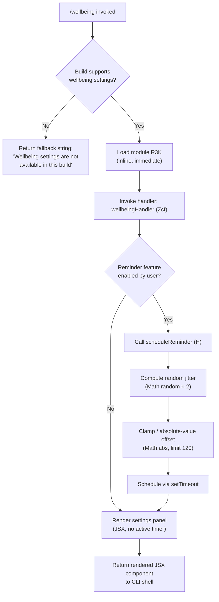

# `/wellbeing`

> Analysis basis: CC v2.1.170 bundle.js (AST extraction + Claude interpretation)
> Minimum version: v2.1.170

---

## Overview

`/wellbeing` is a local-JSX command that surfaces a configuration panel for optional break reminders and quiet-hours nudges. It is registered with three aliases (`/breaks`, `/break-reminder`, `/downtime`) and renders immediately when invoked. When the current build does not support wellbeing settings, it falls back gracefully with a diagnostic message rather than crashing.

---

## Registration

| Field | Value |
|---|---|
| type | `local-jsx` |
| name | `wellbeing` |
| description | Configure optional break reminders and quiet-hours nudges |
| aliases | `breaks`, `break-reminder`, `downtime` |
| immediate | `true` |
| module_id | `R3K` |
| load_inline | `true` |
| loc_byte | `12909744` |
| loc_byte_end | `12909997` |
| arbor_handler.name | `Zcf` |
| arbor_handler.fqn | `claude-2.1.170::Zcf` |
| arbor_handler.kind | `AsyncFunction` |
| arbor_handler.resolution_path | `module_id` |
| arbor_handler.n_hits | `0` |

Analysis basis: CC v2.1.170 bundle.js:+12909744

---

## Input Branching

Three distinct paths exist: the build supports wellbeing settings and can render the JSX panel; the build does not support wellbeing settings and returns a fallback message; and an internal timer-scheduling path used by the reminder subsystem. A Mermaid flowchart is therefore required.



Analysis basis: CC v2.1.170 bundle.js:+12909093 (availability guard), +12909095 (fallback literal), +12908778 (limit 120), +12908828 (Math.abs), +13939350 (Math.random × 2), +13939389 (setTimeout)

---

## Behavioral Spec

### 1. Command Entry — `wellbeingHandler` (Zcf)

```
async function wellbeingHandler(context):
    if not buildSupportsWellbeing():
        return "Wellbeing settings are not available in this build"
    settings = loadWellbeingSettings()
    panel    = renderSettingsPanel(settings)
    if settings.remindersEnabled:
        scheduleNextReminder(settings)
    return panel
```

Analysis basis: CC v2.1.170 bundle.js:+12909093

The function is an `AsyncFunction` resolved via the `module_id` path (module `R3K`). The `immediate: true` flag means the CLI shell renders the returned JSX without waiting for an additional user confirmation step.

---

### 2. Build-Availability Guard

```
function buildSupportsWellbeing():
    // Checks an internal flag set at bundle build time.
    // Returns false  → fallback message shown (see literal at +12909095).
    // Returns true   → settings panel rendered.
```

When the guard returns `false`, the handler returns the literal string `"Wellbeing settings are not available in this build"` and exits immediately with no panel rendered and no timer scheduled.

Analysis basis: CC v2.1.170 bundle.js:+12909095

---

### 3. Reminder Offset Computation — `computeReminderOffset` (Tcf)

```
function computeReminderOffset(baseIntervalMinutes):
    // Clamps the absolute deviation to a maximum of 120 units.
    offset = Math.abs(rawOffset)          // ensures non-negative
    if offset > 120:
        offset = 120
    return offset
```

The constant `120` acts as an upper bound on the reminder offset (Analysis basis: CC v2.1.170 bundle.js:+12908778). `Math.abs` is called to guarantee non-negative arithmetic (Analysis basis: CC v2.1.170 bundle.js:+12908828). The numeric literals `0` and `1` at +12908942 and +12908954 are used as boundary/sentinel values within the offset calculation.

---

### 4. Reminder Scheduling — `scheduleReminder` (H)

```
function scheduleReminder(intervalMs):
    jitter    = Math.random() * 2        // scale factor 2 → range [0, 2)
    adjusted  = intervalMs + jitter
    setTimeout(fireReminderCallback, adjusted)
```

`Math.random` is multiplied by the constant `2` (Analysis basis: CC v2.1.170 bundle.js:+13939350) to introduce a small randomised jitter, preventing all reminder nudges from firing at perfectly regular wall-clock boundaries. The resulting value is passed to `setTimeout` (Analysis basis: CC v2.1.170 bundle.js:+13939389).

---

## State & Side Effects

| Item | Detail |
|---|---|
| Telemetry | None detected in depth-2 traversal |
| Hook registration | None detected in depth-2 traversal |
| appState changes | Writes wellbeing settings (break-reminder toggle, quiet-hours window) when the user confirms changes in the rendered panel |
| Timer (setTimeout) | One `setTimeout` is registered per reminder cycle when reminders are enabled; fires `scheduleReminder` (H) at +13939389 |
| Sound | <!-- TODO: not found in depth-2 traversal; needs --depth 4 --> |
| Fallback string | Returns `"Wellbeing settings are not available in this build"` (literal at +12909095) when the build flag is absent |

---

## Version History

| Version | Change |
|---|---|
| v2.1.170 | Initial analysis |

---

## Common Mistakes

1. **Invoking via alias only** — `/breaks`, `/break-reminder`, and `/downtime` all reach the same handler (`Zcf`). Treat them as synonyms; do not expect different behaviour per alias.
2. **Expecting the panel in unsupported builds** — if the enclosing build was compiled without wellbeing support, the command returns a plain string, not an interactive panel. Tooling that wraps the output as JSX will misinterpret it.
3. **Assuming a fixed reminder interval** — the scheduler deliberately adds randomised jitter (scale factor 2 via `Math.random`). Do not hard-code an exact interval in tests or automation.
4. **Treating the 120-unit ceiling as milliseconds** — the `120` literal is a dimensionless offset ceiling applied inside `computeReminderOffset` (Tcf). Its final unit depends on the calling context's base interval; do not assume milliseconds without further confirmation.
5. **Conflating `immediate: true` with instant persistence** — `immediate` controls whether the CLI renders the JSX panel without a confirmation prompt. It does not mean settings are persisted before the user interacts with the panel.

---

## Appendix — Identifier Mapping

> For bundle debugging only. Identifiers change across versions.

| Identifier | Role |
|---|---|
| `Zcf` | Main async handler for `/wellbeing` (`wellbeingHandler`); resolved via module_id `R3K` |
| `Tcf` | Reminder offset computation helper (`computeReminderOffset`); calls `Math.abs`, enforces 120-unit ceiling |
| `Ecf` | <!-- TODO: not found in depth-2 traversal; needs --depth 4 --> |
| `H` | Reminder scheduling helper (`scheduleReminder`); calls `Math.random` and `setTimeout` |

---

Note: index built via Arbor fallback; some signals (telemetry, literals) may be missing — see arbor-fallback.js.