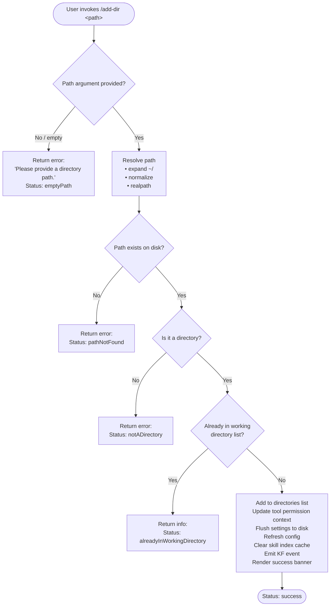

# `/add-dir`

> Analysis basis: CC v2.1.191 bundle.js (AST extraction + Claude interpretation)
> Minimum version: v2.1.191

---

## Overview

`/add-dir` registers an additional filesystem directory as a working directory for the current Claude Code session. It validates the given path (resolving home-directory shortcuts, checking filesystem existence and type), updates session and local settings to persist the new directory, refreshes tool permission context, and renders a JSX confirmation or error banner in the REPL.

---

## Registration

| Field | Value |
|---|---|
| type | `local-jsx` |
| name | `add-dir` |
| description | `Add a new working directory` |
| argumentHint | `<path>` |
| module_id | `dEl` |
| load_inline | `true` |
| loc_byte | `11207150` |
| loc_byte_end | `11207298` |
| loc_line | `6900` |
| arbor_handler.name | `Qaf` |
| arbor_handler.fqn | `claude-2.1.191::Qaf` |
| arbor_handler.kind | `AsyncFunction` |
| arbor_handler.resolution_path | `module_id` |
| arbor_handler.n_hits | `0` |

Analysis basis: CC v2.1.191 bundle.js:+11207150

---

## Input Branching

The handler produces six distinct outcomes depending on path validation and filesystem state, warranting a Mermaid flowchart.



Analysis basis: CC v2.1.191 bundle.js:+3945940 (emptyPath), +3946038 (notADirectory), +3946183 (pathNotFound), +3946308 (alreadyInWorkingDirectory), +3946384 (success)

---

## Behavioral Spec

### 1. Handler Entry (`Qaf`)

```
async function addDirHandler(context):
    rawArg = context.argument         # <path> token supplied by user
    appState = getAppState(context)   # calls Ur → e.getAppState

    resolvedPath = resolveUserPath(rawArg)   # calls Ort → ys
    if resolvedPath is error:
        return renderErrorBanner(resolvedPath.reason)

    existingDirs = appState.addDirectories   # literal: "addDirectories" +11205974

    if resolvedPath in existingDirs:
        return renderBanner("alreadyInWorkingDirectory")

    # Persist to localSettings (+11206021)
    updateLocalSettings(appState, resolvedPath)

    # Update permission context for newly reachable directory
    context.setToolPermissionContext(...)    # +11206048

    # Apply permission rules to session via HH
    applyPermissionRules(appState)           # +11206080

    # Check that path is reachable (not a plain file, ENOENT handled)
    validateDirectoryAccess(resolvedPath, appState)   # calls dx / d.includes +11206095..11206104

    # Notify subsystems
    refreshSkillIndexCache(appState)         # mfe  +11206118
    refreshMcpIfNeeded(appState)             # IR   +11206132
    reloadIgnoreRules(appState)              # ire  +11206137
    clearConversationCache()                 # L5   +11206143
    emitDirectoryChangeEvent()               # KF.emit +11206148
    xo.refreshConfig()                       # +11206158

    # Persist --add-dir flag to settings
    persistAddDirFlag(resolvedPath)          # jwo  +11206177  literal "--add-dir" +11206188

    # Update gitignore / file-tracking state
    updateFileTrackingState(resolvedPath)    # s3i  +11206184

    # Render output
    return renderSuccessBanner(resolvedPath) # JSX via YEe.jsx +11206581
```

Analysis basis: CC v2.1.191 bundle.js:+11205938 (Qaf start)

---

### 2. Path Resolution (`Ort` / `ys`)

```
function resolveUserPath(rawArg):
    if rawArg is null or empty:
        return {error: "emptyPath",
                message: "Please provide a directory path."}   # +3946469

    path = rawArg.trim()
    path = normalizeUnicode(path)             # MH  +1095993 (NFC, +66199)

    if path contains null bytes:
        return {error: "invalidPath",
                message: "Path contains null bytes"}           # +1095937

    if path starts with "~/":
        path = join(os.homedir(), path.slice(2))              # +1096034..1096081

    if platform is "windows":
        path = applyWindowsPathNormalization(path)            # +1096134

    path = posixPath.resolve(path)            # GO.resolve  +1096248
    path = posixPath.normalize(path)          # GO.normalize +1095996

    stat = await fs.stat(path)                # Z1i.stat +3945993
    if stat fails (ENOENT):
        return {error: "pathNotFound"}        # +3946183 / dn ENOENT +184080

    if not stat.isDirectory():
        return {error: "notADirectory"}       # +3946038

    return {ok: true, path: path}
```

Analysis basis: CC v2.1.191 bundle.js:+3945959 (Ort entry), +1095684 (ys entry)

---

### 3. App-State Working Directory Lookup (`Ur`)

```
function getWorkingDirectoryContext(appState):
    # Scan conversation history for most-recent working_directory hint
    lastHint = appState.messages.findLast(
        m => m.type == "working_directory"       # literal +10899808
    )

    # Build allowed / disallowed tool lists from settings layers
    allowedTools    = deriveToolList("allowed_tools",    appState)  # +10899863
    disallowedTools = deriveToolList("disallowed_tools", appState)  # +10899918
    avoidPrompts    = deriveToolList("avoid_prompts",    appState)  # +10899979

    permissionMode  = resolvePermissionMode(appState)   # "bypassPermissions" +10900112
    sessionMeta     = buildSessionMeta(appState)        # "session" +10900411
    effortLevel     = appState.effort                   # +10900436
    modelName       = appState.model                    # +10900449
    maxThinkTokens  = appState.max_thinking_tokens      # +10900461
    flagSettings    = appState.flag_settings            # +10900487

    return {lastHint, allowedTools, disallowedTools, permissionMode, ...}
```

Analysis basis: CC v2.1.191 bundle.js:+10899703 (Ur → e.getAppState), +10899783 (findLast)

---

### 4. Permission Context Update (`HH`)

```
function applyPermissionRules(appState):
    # HH merges rule-sets from multiple settings tiers
    for tier in [userSettings, projectSettings, localSettings]:  # +5372710..5372730
        rules = tier.permissionRules

        addRules(rules.allow,     appState)    # "allow"/"alwaysAllowRules"  +5371097..5371105
        addRules(rules.deny,      appState)    # "deny"/"alwaysDenyRules"   +5371137..5371144
        addRules(rules.alwaysAsk, appState)    # "alwaysAskRules"           +5371162

    # replaceRules / removeRules also evaluated  +5371260 / +5371917
    # removeDirectories evaluated                +5372301

    if setMode == "bypassPermissions" and mode not available:
        log("Ignoring permission update: setMode 'bypassPermissions' rejected …")
        # literal at +5370636
```

Analysis basis: CC v2.1.191 bundle.js:+11206080 (HH call), +5370634 (HH body)

---

### 5. Settings Persistence (`jwo`)

```
async function persistNewDirectory(resolvedPath):
    # Determine project settings file location
    settingsDir  = path.join(projectRoot, ".claude")     # literal ".claude" +1320221
    settingsFile = path.join(settingsDir, "settings.local.json")  # +1320293

    # jwo: read → mutate → write atomically
    existing = await fs.readFile(settingsFile, "utf8")   # +13335270 / "utf8" +13335284
    config   = JSON.parse(existing)                      # via $t

    if "--add-dir" not in config.addDirectories:
        config.addDirectories.push(resolvedPath)         # literal "--add-dir" +11206188

    await fs.mkdir(settingsDir, {recursive:true})        # +13335435
    await fs.appendFile / writeFile(settingsFile, ...)   # +13335586 / +13335614

    # Normalise path separators (NFC, realpath)
    normalise(resolvedPath)                              # MH +13335074
```

Analysis basis: CC v2.1.191 bundle.js:+11206177 (jwo call), +13335048 (X3 → jwo body)

---

### 6. File-Tracking State Update (`s3i` / `Bi`)

```
async function updateFileTracking(resolvedPath):
    # by: invalidate any cached snapshot for this path
    clearPathCache(resolvedPath)                    # by → $ee.delete +4282014

    # Bi: rebuild lstat/readFile index for the new directory
    entries = await Promise.all(
        listFiles(resolvedPath).map(f => fs.lstat(f)) # wb.lstat +4282155
    )
    for entry in entries:
        if entry.isFile():
            content = await fs.readFile(entry.path, "utf-8")  # +4283093
            cacheEntry(entry, content)               # $ee.set +4282474

    # Od: write atomically (random temp name, rename)
    atomicWrite(trackingStore, serialized)          # Rm → xK.writeFile / xK.rename

    # Mf: validate final state, log errors if any
    validateTrackingState()                         # Mf → Ae / Le
```

Analysis basis: CC v2.1.191 bundle.js:+11206184 (s3i call), +4286802 (s3i body)

---

### 7. Output Rendering (JSX)

```
function renderResult(status, resolvedPath):
    match status:
        "success":
            return JSX(
                bold(resolvedPath),                  # St.bold +11206236
                dim("· /permissions to manage"),     # St.dim  +11206529  literal +11206529
                successIcon
            )
        "alreadyInWorkingDirectory":
            return JSX(warn: resolvedPath + " already in list")
        "notADirectory" | "pathNotFound" | "emptyPath":
            return JSX(
                errorText,
                dim("Did not add a working directory.")  # literal +11206647
            )
        default:
            return JSX(dim("Unknown error"))         # literal +11206421

    # Nrt sub-component renders parent directory path using ewn.dirname +3946605
    # and applies bold styling St.bold +3946537
```

Analysis basis: CC v2.1.191 bundle.js:+11206581 (YEe.jsx), +11206698 (Ort render call), +11206742 (Nrt)

---

## State & Side Effects

| Item | Detail |
|---|---|
| Telemetry | `tengu_api_success` (+8938998), `tengu_context_tip_classifier_outcome` (+16672225), `tengu_feature_ok` (+1025725), `tengu_feature_bad` (+1025792), `tengu_feature_sad` (+1025873), `tengu_disable_bypass_permissions_mode` (+3399953), `tengu_daemon_config_reload` (+17386661), `tengu_bg_state_read_transient` (+4282879), `tengu_lone_surrogate_sanitized` (+8938694), `tengu_prompt_cache_1h_config` (+13616098), `tengu_bg_retire_pinned_low_mem` (+17375231), `tengu_bg_prewarm_per_sweep` (+17375352), `tengu_daemon_yield` (+17391071), `tengu_daemon_control` (+17408260) |
| `appState.addDirectories` | Mutated: the resolved absolute path is appended to the list (+11205974) |
| `localSettings` | Written to `.claude/settings.local.json` with the new directory path (+11206021) |
| Tool permission context | Re-evaluated via `setToolPermissionContext` (+11206048) and `HH` rule merge (+11206080) |
| Skill index cache | Cleared via `L5` → `M8t.clear` (+11022641) |
| MCP server state | `IR` triggers skill-index cache flush and potential MCP reconnect (+13319576) |
| Ignore rules | Reloaded via `ire` → `Gzn` (+11198829) |
| Config | `xo.refreshConfig()` called (+11206158) |
| Event bus | `KF.emit` fires a directory-change notification (+11206148) |
| File-tracking cache | `$ee` Map cleared/repopulated for new directory (+4282014 / +4282474) |
| Sound | None detected |

---

## Version History

| Version | Change |
|---|---|
| v2.1.191 | Initial analysis |

---

## Common Mistakes

1. **Omitting the path argument** — `/add-dir` with no argument returns `"Please provide a directory path."` immediately; the `<path>` argument is mandatory.
2. **Passing a file path instead of a directory** — the handler stat-checks the path and rejects it with `notADirectory` if `stat.isDirectory()` is false.
3. **Passing a non-existent path** — the path must exist at invocation time; `ENOENT` from `fs.stat` produces the `pathNotFound` error rather than creating the directory.
4. **Expecting immediate git-ignore re-evaluation** — ignore rules are reloaded asynchronously via `ire`; file-tracking state may lag by one event loop turn.
5. **Assuming the directory is added globally** — the path is written to `settings.local.json` (project-local), not `settings.json` (user-global), so it only persists for the current project.

---

## Appendix — Identifier Mapping

> For bundle debugging only. Identifiers change across versions.

| Identifier | Role |
|---|---|
| `Qaf` | Main handler — async function for `/add-dir` command |
| `Ur` | App-state working-directory context builder |
| `L6o` | Conversation history summarisation / context window helper |
| `gsm` | Context window item setter |
| `har` | History append / record helper |
| `msm` | Auto-classifier input builder |
| `wN` | Core API call dispatcher (side-query orchestrator) |
| `xf` | Thread / execution context initialiser |
| `oW` | HTTP API request builder (headers, auth, routing) |
| `b2e` | Model capability checker (Claude-3 prefix, opus/sonnet detection) |
| `lie` | Structured-output capability resolver |
| `CBp` | Tool-use block finder |
| `SHo` | SHA-256 hash helper |
| `Ghn` | Session-header builder (cch, subagent flags) |
| `aIn` | Internal logger / reporter helper |
| `aje` | Prompt-cache config evaluator (`1h`, `repl_main_thread*`) |
| `wD` | Cache-control header builder |
| `L` | Background-worker lifecycle manager (sweep, respawn, retire) |
| `ZVa` | <!-- TODO: not found in depth-2 traversal; needs --depth 4 --> |
| `sp` | Path/string sanitiser (`e.replace`) |
| `XSn` | Temperature / sampling param injector |
| `av` | Message array mapper |
| `Txe` | Tool-result schema validator |
| `etn` | Conversation tree node mutator (pop/push) |
| `iD` | Deep clone via `structuredClone` |
| `u7e` | Conversation tree leaf mutator |
| `Ve` | React/Ink component renderer helper |
| `LOr` | Log-record writer |
| `wOr` | Structured-output cache key manager |
| `mbe` | <!-- TODO: not found in depth-2 traversal; needs --depth 4 --> |
| `Tr` | UI tick / render scheduler |
| `Oo` | Ink output component |
| `H1t` | Notification / sound trigger |
| `NF` | Sub-agent node factory |
| `kAt` | <!-- TODO: not found in depth-2 traversal; needs --depth 4 --> |
| `S4` | Event emitter / state broadcaster |
| `ev` | Event record constructor |
| `PPr` | Permission-probe helper |
| `usm` | Context-summary builder (wraps `csm`) |
| `csm` | Conversation message mapper |
| `hsm` | Header / section string builder (push + join) |
| `M6n` | Tool-use-block finder for context tips |
| `T` | Message formatter / role normaliser |
| `wNc` | Context-file loader and path builder |
| `ke` | JSON serialiser (`JSON.stringify`) |
| `Dc` | Path display formatter (redact, slice) |
| `a7e` | S7o-based string util |
| `kNc` | Context-file content loader (stat, byteLength, read) |
| `cSt` | State-change renderer component |
| `Pe` | Ink primitive renderer |
| `Re` | Result renderer component |
| `D6n` | Zod schema safe-parse wrapper |
| `we` | Success renderer component |
| `Ae` | String coercer (`String(...)`) |
| `zKn` | Tool-list resolver (allowed) |
| `ns` | Settings namespace reader |
| `YKn` | Tool-list resolver (disallowed) |
| `AB` | Bypass-permissions mode guard |
| `nt` | Permission-dispatch router |
| `IDt` | Permission identity resolver |
| `CDt` | Permission condition evaluator |
| `B4` | Permission rule compiler |
| `RTn` | Permission cache set/get |
| `kt` | Permission decision logger |
| `HH` | Permission-rule merge engine |
| `qp` | Shell escape helper (`X_u`) |
| `X_u` | `replaceAll` based escape for special chars |
| `dx` | Directory-access validator |
| `d` | MCP / daemon supervisor state machine |
| `YVe` | File stat + access checker (ENOENT, isFile, 1 MB limit) |
| `dn` | Error code classifier |
| `qs` | AsyncLocalStorage store reader |
| `_No` | Directory permission helper |
| `yWl` | Directory listing formatter |
| `E` | MCP server instance (http/sse) |
| `vSt` | MCP server state snapshot |
| `BLc` | MCP server key enumerator |
| `Le` | Log/error reporter |
| `fo` | Error string formatter |
| `rt` | String coercer for log lines |
| `Yi` | Network retry classifier |
| `Rmu` | Rolling log-ring buffer writer |
| `A` | MCP server instance (stdio) |
| `U2t` | MCP update applier |
| `h0c` | Heartbeat / watchdog ticker |
| `tae` | Heartbeat interval config |
| `I` | Terminal input handler |
| `k` | Terminal write helper |
| `mfe` | Skill-index cache refresher |
| `IR` | Skill-index + MCP reload orchestrator |
| `s6` | Skill-index cache flusher (`clearSkillIndexCache`) |
| `Nzn` | <!-- TODO: not found in depth-2 traversal; needs --depth 4 --> |
| `D_l` | <!-- TODO: not found in depth-2 traversal; needs --depth 4 --> |
| `VWe` | MCP watch-session manager |
| `wWt` | MCP session-cache getter |
| `CWt` | MCP session config reader |
| `ire` | Ignore-rules reload trigger |
| `Gzn` | Ignore-rules parser |
| `L5` | Conversation / skill cache clearer (`M8t.clear`) |
| `jwo` | Settings file read-modify-write (atomic) |
| `X3` | Settings file path resolver |
| `Wql` | <!-- TODO: not found in depth-2 traversal; needs --depth 4 --> |
| `R9` | <!-- TODO: not found in depth-2 traversal; needs --depth 4 --> |
| `WFe` | Atomic file writer |
| `Aw` | <!-- TODO: not found in depth-2 traversal; needs --depth 4 --> |
| `pf` | Temp-file path builder |
| `dKu` | File-write finaliser |
| `MH` | Unicode NFC normaliser |
| `vn` | Error type guard |
| `A2` | <!-- TODO: not found in depth-2 traversal; needs --depth 4 --> |
| `Hr` | Home-directory resolver |
| `zo` | Permission-error classifier (EACCES, EPERM, ENOTDIR …) |
| `s3i` | File-tracking state updater |
| `by` | Path-cache invalidator (`$ee.delete`) |
| `Bi` | File-index builder (lstat, readFile, $ee map) |
| `a` | MCP connection lifecycle manager |
| `s5e` | MCP server connector (sse-ide, ws-ide, claudeai-proxy) |
| `Gar` | MCP connection result applier |
| `w_a` | MCP fallback resolver |
| `l` | rGl-based helper |
| `hGo` | MCP server-set updater (filter, getClients, s5e, Gar) |
| `u` | Daemon client manager (we, Re, pF, BG) |
| `pF` | Daemon command queue |
| `BG` | Daemon process race/exit handler |
| `Gd` | Error normaliser |
| `$t` | JSON parse wrapper |
| `Od` | File-cache write orchestrator (Rm + path join) |
| `Rm` | Atomic file write with random-bytes temp name |
| `Mf` | File-tracking validator (Ife.has, Ae, Le) |
| `Nle` | Tool-list/permission diff renderer (JSX) |
| `sZr` | Permission-set serialiser |
| `DJi` | Tool-diff calculator (new vs removed tools) |
| `z9e` | Policy-settings reader |
| `In` | Inline tool-name formatter |
| `T8d` | Tool-schema normaliser (trim, Ca) |
| `sg` | VTe-based tool renderer |
| `jd` | Symlink / realpath resolver |
| `Gt` | Path utility (join / resolve) |
| `VC` | WQ-based tool validator |
| `v8d` | <!-- TODO: not found in depth-2 traversal; needs --depth 4 --> |
| `og` | Tool-name escape/format helper |
| `Q_u` | <!-- TODO: not found in depth-2 traversal; needs --depth 4 --> |
| `wk` | `Object.hasOwn` wrapper |
| `Z_u` | <!-- TODO: not found in depth-2 traversal; needs --depth 4 --> |
| `J_u` | `replaceAll`-based string cleaner |
| `uo` | Settings-layer merger and file writer |
| `EIr` | Settings inheritance resolver |
| `z2` | Settings schema validator |
| `wTr` | Settings write timestamp recorder |
| `GUe` | Settings union builder |
| `Rvt` | Atomic sync file writer (rename, fsync, chmod) |
| `kH` | Settings cache clearer (`sZt.clear`, `Zcr.clear`) |
| `Yps` | Git-ignore file updater (mkdir, readFile, appendFile, writeFile) |
| `c4` | `.claude/settings.json` path builder |
| `Lt` | Warning renderer component |
| `vj` | Settings load orchestrator (`loadSettingsFromDisk_start/end`) |
| `Ort` | Path resolution + stat entry point |
| `ys` | Path normalisation and validation (homedir, resolve, stat) |
| `Dt` | Async-storage context reader |
| `Gin` | Bin-store reader |
| `xB` | Home-path replacer |
| `_R` | `/var/`→`/tmp` path alias resolver |
| `T8e` | Wt/Ik-based path matcher |
| `Bm` | toLowerCase path canonicaliser |
| `Hse` | <!-- TODO: not found in depth-2 traversal; needs --depth 4 --> |
| `Nrt` | Success banner sub-component (bold path + dirname) |

---

Note: index built via Arbor fallback; some signals (telemetry, literals) may be missing — see arbor-fallback.js.