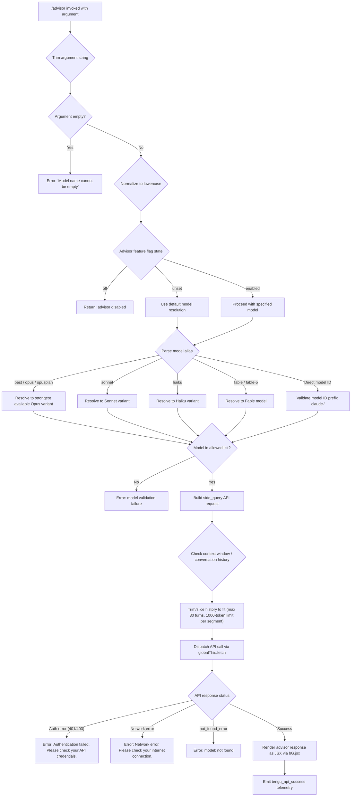

# `/advisor`

> Analysis basis: CC v2.1.191 bundle.js (AST extraction + Claude interpretation)
> Minimum version: v2.1.191

---

## Overview

The `/advisor` command enables the current Claude session to consult a stronger or more capable model at key decision points during a conversation. It acts as a side-channel query mechanism (`side_query`) that dispatches the current context to a separate, potentially higher-capability model and returns guidance inline. The command is implemented as a local JSX handler resolved via module `w4l` and executed by the async function `kRf`.

---

## Registration

| Field | Value |
|---|---|
| type | `local-jsx` |
| name | `advisor` |
| description | `Let Claude consult a stronger model at key moments` |
| argumentHint | `[ ... ]` |
| isHidden | `null` (not hidden) |
| module_id | `w4l` |
| load_inline | `true` |
| loc_byte | `12775963` |
| loc_byte_end | `12776219` |
| arbor_handler.name | `kRf` |
| arbor_handler.fqn | `claude-2.1.191::kRf` |
| arbor_handler.kind | `AsyncFunction` |
| arbor_handler.resolution_path | `module_id` |
| arbor_handler.n_hits | `2` |

Analysis basis: CC v2.1.191 bundle.js:+12775963

---

## Input Branching

The command handler involves multiple distinct branches: model name validation (empty, invalid, recognized alias), advisor state checks (off/unset/enabled), model resolution paths (alias expansion vs. direct model ID), and API error categories (auth failure, network error, not-found). This warrants a Mermaid flowchart.



---

## Behavioral Spec

### Handler Entry (`kRf`)

The main async handler is `kRf`, resolved via module `w4l` using the `module_id` path. Upon invocation it:

1. Trims the raw argument string (Analysis basis: CC v2.1.191 bundle.js:+12775441)
2. Renders initial JSX output via the JSX factory (Analysis basis: CC v2.1.191 bundle.js:+12775477)
3. Delegates to model resolution (`resolveModelForQuery`, i.e., `Qo`) (Analysis basis: CC v2.1.191 bundle.js:+12775575)
4. Delegates to model validation (`validateAndNormalizeModel`, i.e., `U6t`) (Analysis basis: CC v2.1.191 bundle.js:+12775589)
5. Invokes the side-query dispatcher (`dispatchSideQuery`, i.e., `e`) (Analysis basis: CC v2.1.191 bundle.js:+12775615)
6. Optionally triggers context filtering (`filterContextForAdvisor`, i.e., `Cke`) (Analysis basis: CC v2.1.191 bundle.js:+12775663)
7. Applies conversation serialization (`serializeConversation`, i.e., `zpt`) (Analysis basis: CC v2.1.191 bundle.js:+12775736)

```
async function advisorHandler(rawArgument):
    argument = rawArgument.trim()

    if advisorFlag is "off" or "unset":
        return renderDisabledMessage()

    resolvedModel = resolveModelForQuery(argument)
    validatedModel = validateAndNormalizeModel(resolvedModel)

    contextMessages = serializeConversation(currentConversation)
    filteredContext = filterContextForAdvisor(contextMessages)

    response = await dispatchSideQuery(validatedModel, filteredContext)
    return renderJSX(response)
```

Analysis basis: CC v2.1.191 bundle.js:+12775441

---

### Model Alias Resolution (`Qo`)

The model resolution function normalizes alias strings to concrete model identifiers. It processes the trimmed, lowercased argument and maps well-known aliases to specific model IDs.

```
function resolveModelForQuery(rawName):
    name = rawName.trim()
    lower = name.toLowerCase()

    if lower contains "[1m]" or lower equals "opusplan":
        return resolveOpusPlanModel()

    if lower equals "fable":
        return "claude-fable-5"

    if lower equals "best" or lower equals "opus":
        return resolveStrongestOpus()

    if lower equals "sonnet":
        return resolveSonnetVariant()

    if lower equals "haiku":
        return resolveHaikuVariant()

    # Apply prefix normalization
    name = applyPrefixNormalization(name)
    name = sanitizeSeparators(name)   # e.g. underscores → hyphens

    return name
```

Alias mappings observed in literals (Analysis basis: CC v2.1.191 bundle.js:+2301667 through +2301902):
- `"fable"` → `"claude-fable-5"` (bundle.js:+2285593)
- `"opus"` → strongest available Opus (e.g. `"claude-opus-4-8"`, `"claude-opus-4-7"`, etc.)
- `"best"` → same resolution as `"opus"` (bundle.js:+2301902)
- `"opusplan"` / `"[1m]"` → special Opus planning model path
- `"sonnet"` → Sonnet variant (bundle.js:+2301779)
- `"haiku"` → Haiku variant (bundle.js:+2301822)

Analysis basis: CC v2.1.191 bundle.js:+2301590

---

### Model Validation and Normalization (`U6t`)

After alias resolution, the model identifier is validated against a known set of model strings and policy settings.

```
function validateAndNormalizeModel(modelName):
    modelName = modelName.trim()

    if modelName is empty:
        raise Error("Model name cannot be empty")

    lower = modelName.toLowerCase()

    # Check against policy-blocked models
    if lower in policyBlockedModels:
        raise Error("model_validation failure")

    # Check if already seen (cache via o_o Map)
    if modelCache.has(lower):
        return modelCache.get(lower)

    # Check alias normalization table (hyphens/underscores)
    # e.g. "fable_5" → "fable-5", "opus_4_8" → "opus-4-8"
    normalized = normalizeAliasVariants(lower)

    # Validate model prefix
    if not normalized.startsWith("claude-"):
        raise Error("model_validation: must start with 'claude-'")

    modelCache.set(lower, normalized)
    return normalized
```

Known normalized alias pairs found in literals (Analysis basis: CC v2.1.191 bundle.js:+9056162 onward):
- `"fable-5"` / `"fable_5"` → `"claude-fable-5"`
- `"opus-4-8"` / `"opus_4_8"` → `"claude-opus-4-8"`
- `"opus-4-7"` / `"opus_4_7"` → `"claude-opus-4-7"`
- `"opus-4-6"` / `"opus_4_6"` → `"claude-opus-4-6"`
- `"opus-4-5"` / `"opus_4_5"` → `"claude-opus-4-5"`
- `"sonnet-4-6"` / `"sonnet_4_6"` → `"claude-sonnet-4-6"`
- `"sonnet-4-5"` / `"sonnet_4_5"` → `"claude-sonnet-4-5"`

Error literal: `"Model name cannot be empty"` (bundle.js:+9054892)
Error literal: `"model_validation"` (bundle.js:+9055256)

Analysis basis: CC v2.1.191 bundle.js:+12775589

---

### Side-Query Dispatch (`wN`)

This is the core API call sub-system invoked to run the advisor query against the target model. It is classified as a `"side_query"` call type, distinct from main-thread agent requests.

```
async function dispatchSideQuery(model, contextMessages):
    requestPayload = buildRequestPayload(model, contextMessages)

    # Apply cache-control headers where supported (1h prompt cache)
    if cacheEnabled:
        requestPayload.headers["cache_control"] = "ephemeral"

    # Check model compatibility (claude-3-* vs newer models)
    if model.includes("claude-3-"):
        applyLegacyCompat(requestPayload)

    # Attach structured_outputs feature flag if model supports it
    if modelSupportsStructuredOutputs(model):
        requestPayload.features.push("structured_outputs")

    # Gather auth token
    token = getAuthToken()

    startTime = performance.now()
    rawResponse = await globalThis.fetch(apiEndpoint, requestPayload)
    elapsed = performance.now() - startTime

    if not rawResponse.ok:
        handleApiError(rawResponse)

    emit("tengu_api_success", { model, elapsed })
    return parseResponse(rawResponse)
```

Side query type string: `"side_query"` (bundle.js:+8937327)
Lone surrogate sanitization is applied to response text (bundle.js:+8938694, telemetry: `tengu_lone_surrogate_sanitized`)

Model capability check for `claude-3-` prefix (Analysis basis: CC v2.1.191 bundle.js:+3047495)

Analysis basis: CC v2.1.191 bundle.js:+9055206

---

### API Error Handling

Three distinct error categories are handled inside the side-query path:

| Condition | Error Message | loc_byte |
|---|---|---|
| Auth failure (401/403) | `"Authentication failed. Please check your API credentials."` | +9055628 |
| Network unreachable | `"Network error. Please check your internet connection."` | +9055730 |
| Model not found | `"not_found_error"` → display `"model: <id>"` | +9055849, +9055931 |

Analysis basis: CC v2.1.191 bundle.js:+9055628

---

### Context Serialization for Advisor (`zpt` / `N5n` / `Cke`)

Before dispatch, the conversation history is serialized and filtered to fit within the model's context budget.

```
function serializeConversation(conversation):
    # Filter to relevant message types
    filtered = conversation.filter(isEligibleMessage)

    # Normalize each message via messageNormalizer
    serialized = filtered.map(msg => normalizeMessage(msg))
    return serialized

function normalizeMessage(msg):
    result = applyStringReplacer(msg)
    result = applyModelAliasResolver(result)
    result = applyTokenizer(result)
    return result
```

Context slicing: up to 30 recent turns retained (literal `30` at bundle.js:+16668949).
Tool result messages are labeled; error tool results are annotated with `" (error)"` (bundle.js:+16669486).
Maximum segment count before truncation: 1000 items (bundle.js:+16669144).
Column pad width for display: 40 characters (bundle.js:+17399136).

Analysis basis: CC v2.1.191 bundle.js:+12775736

---

### Context Tip Classification (`e` / `usm` / `hsm` / `M6n`)

As a side effect of the advisor invocation, a context-tip classifier runs on the conversation to identify whether a tip should be surfaced to the user.

```
function classifyContextTips(conversationContext):
    # Build classifier input
    classifierInput = buildClassifierInput(conversationContext)
    classifierInput.maxTokens = 512

    response = callClassifierModel("context_tip_classifier", classifierInput)

    if response has no tool_use block:
        log("[context-tips] no tool_use block in response")
        emit("tips_context_classify_no_tool_use")
        return null

    parsed = schema.safeParse(response.tool_use)

    if parse failed:
        log("[context-tips] response failed schema parse")
        emit("tips_context_classify_parse_failed")
        return null

    outcome = parsed.result  # one of: "tip", "tip_ineligible", "no_tip", "none"
    emit("tengu_context_tip_classifier_outcome", { outcome })
    return outcome
```

Possible outcome values (Analysis basis: CC v2.1.191 bundle.js:+16671782):
- `"tip"` — a contextual tip is available
- `"tip_ineligible"` — tip exists but user is not eligible
- `"no_tip"` — no tip to display
- `"none"` — classifier returned no usable result

Classifier max tokens: `512` (bundle.js:+16671099)
Classifier model type string: `"context_tip_classifier"` (bundle.js:+16671138)
Cache setting for classifier messages: `"ephemeral"` (bundle.js:+16670866)

Analysis basis: CC v2.1.191 bundle.js:+16670837

---

## State & Side Effects

| Item | Detail |
|---|---|
| Telemetry: `tengu_api_success` | Fired on successful side-query API call (bundle.js:+8938998) |
| Telemetry: `tengu_lone_surrogate_sanitized` | Fired when lone Unicode surrogates are found and cleaned in the response (bundle.js:+8938694) |
| Telemetry: `tengu_context_tip_classifier_outcome` | Fired with the outcome string from the context-tip classifier (bundle.js:+16672225) |
| Telemetry: `tengu_feature_ok` | Fired when an advisor feature check passes (bundle.js:+1025725) |
| Telemetry: `tengu_feature_bad` | Fired when an advisor feature check fails (bundle.js:+1025792) |
| Telemetry: `tengu_prompt_cache_1h_config` | Fired when 1-hour prompt-cache configuration is applied to the side-query (bundle.js:+13616098) |
| Telemetry: `tengu_bg_retire_pinned_low_mem` | Fired when pinned background workers are retired due to low memory during the dispatch sweep (bundle.js:+17375231) |
| Telemetry: `tengu_bg_prewarm_per_sweep` | Fired per background worker prewarm sweep cycle (bundle.js:+17375352) |
| Model cache (`o_o` Map) | Normalized model names are cached to avoid repeated alias lookups (bundle.js:+9055161, +9055369) |
| Feature flag check | Reads `"off"` / `"unset"` values from advisor feature flag (bundle.js:+12775507, +12775518) |
| JSX render | Handler renders its output as a JSX component via `bG.jsx` (bundle.js:+12775477) |
| Side-query type tag | All API calls are tagged `"side_query"` in request metadata (bundle.js:+8937327) |
| `structured_outputs` feature | Appended to capability list for supported models (bundle.js:+8937455) |
| Background worker lifecycle | Respawns idle/stale workers; retires settled workers via sweep (bundle.js:+17374847, +17374938) |

---

## Version History

| Version | Change |
|---|---|
| v2.1.191 | Initial analysis |

---

## Common Mistakes

1. **Providing an empty model name**: The command will immediately reject the input with `"Model name cannot be empty"`. Always supply a model alias or a full `claude-*` model ID.
2. **Using underscore separators**: While the handler normalizes e.g. `"opus_4_8"` to `"opus-4-8"`, relying on this is fragile — prefer the canonical hyphenated form.
3. **Invoking when advisor flag is `"off"`**: The command silently returns a disabled message rather than querying. Check session/policy settings if the command produces no advisor output.
4. **Expecting main-thread model behavior**: The advisor runs as a `"side_query"`, not as the primary agent call. Its response is displayed inline but does not replace the main agent's context.
5. **Assuming all Opus versions are available**: The handler checks a policy-allowed model list. Older `claude-3-*` models go through a legacy compatibility path and may behave differently from newer Opus/Sonnet variants.
6. **Forgetting context truncation**: Only approximately 30 recent conversation turns are sent to the advisor model. Very long sessions will have their early context silently dropped.

---

## Appendix — Identifier Mapping

> For bundle debugging only. Identifiers change across versions.

| Identifier | Role |
|---|---|
| `kRf` | Main async handler for `/advisor` (Arbor: `claude-2.1.191::kRf`) |
| `Qo` | Model alias resolution function |
| `U6t` | Model validation and normalization function |
| `wN` | Side-query API dispatch function |
| `e` | Side-query context builder / dispatcher wrapper |
| `Cke` | Context filtering for advisor (message eligibility filter) |
| `zpt` | Conversation serialization entry point |
| `N5n` | Per-message normalizer within serialization |
| `L6o` | History slicing and segment assembly |
| `gsm` | Token-set caching helper |
| `msm` | Auto-classifier input builder |
| `har` | Hashing/fingerprinting helper |
| `oW` | HTTP request builder (sets headers, auth, agent IDs) |
| `xf` | API endpoint resolver |
| `b2e` | Model compatibility checker (claude-3-* legacy path) |
| `lie` | Auth token retrieval wrapper |
| `CBp` | Model lookup helper (find in allowed list) |
| `SHo` | SHA-256 hash utility (JVa.createHash) |
| `Ghn` | Request header assembly helper |
| `aIn` | Additional request parameter injector |
| `aje` | Thread/mode classifier (repl_main_thread, sdk, auto_mode, memdir_relevance) |
| `wD` | Structured-output schema builder |
| `ZVa` | Response parser helper |
| `sp` | String replacement sanitizer |
| `XSn` | Temperature / sampling parameter injector |
| `av` | Array-map transformation helper |
| `Txe` | Tool-call result handler |
| `etn` | Tool-call array mutation (pop/push) |
| `iD` | Deep clone utility (structuredClone wrapper) |
| `u7e` | Alternative tool-call array mutation |
| `Ve` | Feature flag reader |
| `LOr` | Logging / observability helper |
| `wOr` | Cache-hit tracker / deduplication map |
| `mbe` | Metric / timing accumulator |
| `Tr` | Telemetry emit wrapper |
| `Oo` | Error object factory |
| `H1t` | Background worker health check |
| `NF` | Subagent / background worker spawner |
| `kAt` | Prompt cache annotator |
| `S4` | Schema event emitter |
| `ev` | Environment variable reader |
| `PPr` | Config path resolver |
| `usm` | Context-tip classifier orchestrator |
| `csm` | Classifier input formatter |
| `hsm` | Classifier prompt assembler (push/join) |
| `T` | Message-type dispatcher |
| `wNc` | Tool-result text formatter |
| `ke` | JSON serializer wrapper |
| `Dc` | Redaction / sanitization helper ("[REDACTED]") |
| `a7e` | Content block normalizer |
| `kNc` | File content reader with byte-length check |
| `cSt` | Tip display renderer |
| `Re` | Feature-ok telemetry emitter |
| `D6n` | Schema safe-parse wrapper |
| `we` | Feature-ok path handler |
| `Ae` | String coercion utility |
| `nH` | Model token estimator |
| `ege` | Runtime string type helper |
| `rt` | String primitive coercer |
| `il` | String escape / replacement helper |
| `Dk` | Model-family inclusion checker |
| `UFe` | Model ID builder / formatter |
| `DPr` | Display name formatter |
| `zp` | Core config/settings reader |
| `oz` | Logger instance |
| `d0t` | Path/string sanitizer |
| `$w` | Alternate model-name builder |
| `khn` | Model prefix handler |
| `ed` | Environment config accessor |
| `$j` | String replacement (model name cleanup) |
| `c_` | Model-string canonical form builder |
| `fCe` | Final model ID assembler |
| `_r` | Internal logger / debug writer |
| `WKs` | Model metadata lookup |
| `iie` | Model capability set resolver |
| `uu` | Capability flag checker |
| `Qme` | Model tier checker |
| `Jme` | String includes check helper |
| `Na` | Full model name resolution pipeline |
| `Nwt` | Model registry loader |
| `Uwt` | Model registry entry accessor |
| `NFe` | Model name normalizer (trim + lowercase + alias) |
| `Xme` | Vision/multimodal capability checker |
| `OFe` | Model family inclusion list checker |
| `xhn` | Recursive model alias resolver |
| `GKs` | Object-entries model property mapper |
| `In` | Policy settings reader |
| `PQe` | Config entry enumerator |
| `BKs` | Model index searcher |
| `qqu` | Query model selector |
| `r0t` | Model ID string parser |
| `Kqu` | Model prefix validator |
| `tie` | Known-model-name inclusion checker |
| `FFe` | Model fallback string builder |
| `Yqu` | Lowercase comparison helper |
| `QU` | Model canonicalization (mythos-preview path) |
| `ao` | Application-inference-profile resolver |
| `l_` | Lowercase / include / replace string helper |
| `ubt` | URL builder helper |
| `PH` | Model string parser (anthropic. prefix handler) |
| `Sxt` | Internal string type assertion |
| `lWu` | String startsWith check helper |
| `IFe` | Case-insensitive model value matcher |
| `U6t` | Model validation and normalization entry (also listed above) |
| `O3p` | String-to-model-ID coercer |
| `N3p` | Model ID lowercasing and alias table lookup |
| `Cke` | Conversation context filter for advisor |
| `iho` | Individual message filter predicate |
| `lho` | Message type routing (user/assistant/tool) |
| `xr` | Cross-reference / message-ID resolver |
| `dZe` | String includes predicate |
| `Mhn` | Multipart message handler |
| `Cs` | Process exit orchestrator (cli_error path) |
| `nqe` | CLI error reporter |
| `fT` | Final cleanup handler before exit |
| `L` | Background worker sweep loop |
| `Gn` | Graceful shutdown helper |
| `Xer` | Worker expiry checker |
| `M6n` | Tool-use block finder in response |
| `dsm` | Classifier outcome dispatcher |