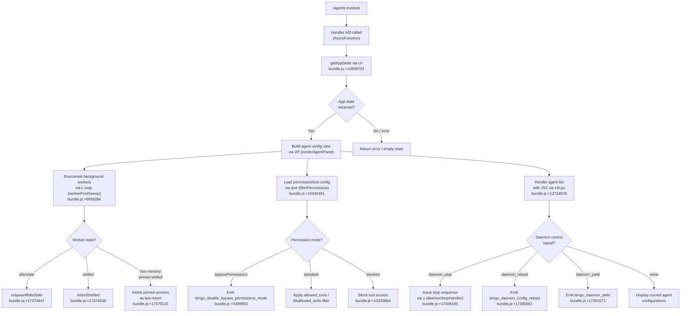

# `/agents`

> Analysis basis: CC v2.1.191 bundle.js (AST extraction + Claude interpretation)
> Minimum version: v2.1.191

---

## Overview

The `/agents` command opens a management interface for agent configurations within a Claude Code session. It renders a JSX-based UI component (type `local-jsx`) that allows users to inspect and interact with background agent workers, including their lifecycle states, tool permissions, and session settings. The command bridges the foreground REPL session to the daemon-managed pool of background agent processes.

---

## Registration

| Field | Value |
|---|---|
| type | `local-jsx` |
| name | `agents` |
| description | `Manage agent configurations` |
| module_id | `o9l` |
| load_inline | `true` |
| loc_byte | `12724696` |
| loc_byte_end | `12724821` |
| loc_line | `8610` |
| arbor_handler.name | `A0f` |
| arbor_handler.fqn | `claude-2.1.191::A0f` |
| arbor_handler.kind | `AsyncFunction` |
| arbor_handler.resolution_path | `module_id` |
| arbor_handler.n_hits | `0` |

Analysis basis: CC v2.1.191 bundle.js:+12724696

---

## Input Branching

The command involves 3+ distinct branches based on agent lifecycle state, permission mode, and daemon control signals found in the call graph and literals.



---

## Behavioral Spec

### 1. Main Handler — `A0f` (agentsCommandHandler)

Analysis basis: CC v2.1.191 bundle.js:+12724557

```
async function agentsCommandHandler(context):
    appState = getAppState(context)              // via Ur → e.getAppState
    agentPanelResult = renderAgentPanel(appState) // via VP
    jsxElement = renderJSX(agentPanelResult)      // via s9l.jsx at +12724578
    return jsxElement
```

The handler is an `AsyncFunction` resolved by Arbor via `module_id` path (`o9l`). It calls two primary callees: `Ur` (app state accessor) and `VP` (agent panel renderer), then emits a JSX element.

---

### 2. App State Access — `Ur` (appStateReader)

Analysis basis: CC v2.1.191 bundle.js:+10899703

```
function appStateReader(context):
    state = context.getAppState()
    lastEntry = state.findLast(predicate)       // n.findLast at +10899783

    // Extract agent config fields from state:
    workingDirectory = state.get("working_directory")  // +10899808
    allowedTools     = state.get("allowed_tools")       // +10899863
    disallowedTools  = state.get("disallowed_tools")    // +10899918
    avoidPrompts     = state.get("avoid_prompts")       // +10899979
    permissionMode   = state.get("permission_mode")     // +10900081
    bypassPermissions= state.get("bypassPermissions")   // +10900112
    session          = state.get("session")             // +10900411
    effort           = state.get("effort")              // +10900436
    model            = state.get("model")               // +10900449
    maxThinkingTokens= state.get("max_thinking_tokens") // +10900461
    flagSettings     = state.get("flag_settings")       // +10900487

    dispatchPermissionGuard(permissionMode, bypassPermissions)  // via AB at +10900134
    return configuredState
```

---

### 3. Agent Panel Renderer — `VP` (renderAgentPanel)

Analysis basis: CC v2.1.191 bundle.js:+10340368

```
function renderAgentPanel(appState):
    // Render core session component
    sessionView = renderSessionView()      // via vv at +10340368

    // Push display rows
    rows = []
    rows.push(fileStatRow)                // via d → YVe at +10340440
    rows.push(agentConfigToRow)           // via cTo at +10340455

    // Load permission/capability settings
    permSettings = loadPermissions(appState) // via uE at +10340469
    filteredPerms = filterPermissions(rows)  // via qne at +10340491
    agentDisplay  = buildAgentDisplay()      // via uTo at +10340506

    // Enumerate agent worker pool
    workerList = workerPoolSweep()           // via L.map at +8938284

    // Check enabled features
    isEnabled = checkFeatureFlag()           // via dl.isEnabled at +10340754
    filteredAgents = rows.filter(predicate)  // via o.filter at +10340830
    hasQst = Qst.has(agentId)               // via Qst.has at +10340845
    mappedAgents = filteredAgents.map(...)   // via o.map at +10340873

    // Render local agent entries
    localAgentView = renderLocalAgent()      // via mC at +10340926

    // Check inclusion list
    isIncluded = agentList.includes(entry)   // via l.includes at +10340971

    return agentPanelElement
```

---

### 4. Worker Pool Sweep — `L` (workerPoolSweep)

Analysis basis: CC v2.1.191 bundle.js:+17374617

```
function workerPoolSweep(workerPool, pinnedSet):
    now = Date.now()                              // +17374617
    workers = workerPool.values()                 // +17374665
    workerPool.shiftGraceClocksForward()          // +17374676

    results = []
    for each worker in workers:
        if workerPool.has(worker.id):
            worker.respawnIfIdleStale()           // +17374847
        
        settled = await Promise.all([...])        // +17374901
        worker.retireIfSettled(settled)           // +17374938

    // Low-memory fallback: retire pinned workers
    if lowMemoryPersists:
        // "bg: low memory persists after shedding non-pinned
        //  — retiring pinned settled workers as a last resort"
        // bundle.js:+17375120
        emit("tengu_bg_retire_pinned_low_mem")    // +17375231
        pinnedSettledWorkers.retireIfSettled()

    // Prewarm sweep
    emit("tengu_bg_prewarm_per_sweep")            // +17375352
    // Prewarm budget: 12 workers maximum          // +17375386
    pendingPrewarm = workerPool.find("prewarm")   // +17375956

    q.respawnIfIdleStale()                        // +17375928
    return results
```

Maximum concurrent prewarm workers: **12** (bundle.js:+17375386)

---

### 5. API Call Dispatch — `wN` (apiCallDispatcher)

Analysis basis: CC v2.1.191 bundle.js:+8937282

```
async function apiCallDispatcher(request, options):
    // Validate request format
    client = buildApiClient()          // via xf at +8937282
    transport = buildTransport()       // via oW at +8937295

    // Check model compatibility
    modelSupported = checkModelSupport(request.model)  // via b2e at +8937441
    // Models checked: "claude-3-*", "claude-opus-4-0",
    // "claude-sonnet-4-0", etc.  (+3047495..+3047536)

    // Build auth headers
    authHeaders = buildAuthHeaders()   // via lie at +8937449
    // structured_outputs feature flag: +8937455

    // Deduplicate requests
    requestHash = computeRequestHash() // via SHo → JVa.createHash("sha256") at +8936332
    // Hash truncated to 3 chars       // +8936374

    // Collect known agent identifiers
    agentIds = collectAgentIds()       // via CBp at +8937516
    // Report URL: https://github.com/anthropics/claude-code/issues
    //             bundle.js:+8937749

    // Execute request
    response = await globalThis.fetch(url, headers) // +8937388
    
    // Post-process
    cleanedResponse = sanitizeSurrogates(response)  // via lone-surrogate sanitization
    emit("tengu_lone_surrogate_sanitized")           // +8938694
    
    // Side queries
    sideQueryResult = runSideQuery(response)        // "side_query" at +8937327
    
    // Apply cache control
    cacheTag = applyCacheControl(response)          // "cache_control" at +8939497
    // Cache duration: "1h"                          // +8938216
    
    emit("tengu_api_success")                        // +8938998
    return processedResponse
```

---

### 6. Conversation Context Builder — `L6o` (conversationContextBuilder)

Analysis basis: CC v2.1.191 bundle.js:+16668916

```
function conversationContextBuilder(messages, options):
    // Slice to last 30 messages maximum
    slicedMessages = messages.slice(-30)        // value 30 at +16668949

    result = []
    for each message in slicedMessages:
        role = message.role                     // "user" | "assistant" at +16668982/+16668999
        
        if message is Array:                    // Array.isArray at +16669161
            // Truncate content items to 1000 chars each
            // limit: 1000 at +16669144
            for each item in message:
                if item.type == "text":          // +16669206
                    result.push(truncated text)
                elif item.type == "tool_result": // +16669266
                    // Process tool result content
                    
        // Map column display
        colMap = columnMapper.get(0)            // value 0 at +16669414
        // Pad column to 2-space indent          // "  " at +17397162
        
        if item.type == "tool":                 // +16669446
            label = item.name + " (error)"     // " (error)" at +16669486 if error
        
        // Truncate tool content to 300 chars    // 300 at +16669651
        if item.type == "tool_use":             // +16669676
            toolUseBlock = buildToolUseBlock(item)
        
        // Run auto-classifier
        classifierInput = message.toAutoClassifierInput()  // via msm → n.toAutoClassifierInput +16669905
        result.push(row)
    
    return result.join(separator)              // r.join at +16669769
```

Message history window: **30 messages** (bundle.js:+16668949)  
Per-item content truncation limit: **1000 characters** (bundle.js:+16669144)  
Tool content truncation limit: **300 characters** (bundle.js:+16669651)

---

### 7. Context-Tip Classifier — `e` (contextTipClassifier)

Analysis basis: CC v2.1.191 bundle.js:+16670698

```
async function contextTipClassifier(appState, messages):
    // Build classifier query
    contextQuery = buildContextQuery(messages)   // via L6o at +16670698
    timestamp = Date.now()                       // +16670769
    
    // Dispatch API call
    classifierResponse = await apiCallDispatcher(contextQuery)  // via wN at +16670796
    
    // Build ephemeral cache marker                // "ephemeral" at +16670866
    cacheMarker = buildCacheMarker()               // via S4 at +16670806
    
    // Collect usage data
    usageData = collectUsage()                     // via usm at +16670837
    
    // Build display summary
    summary = buildSummary()                       // via hsm at +16670960
    // Max tokens for classifier: 512              // +16671099
    // Classifier feature name: "context_tip_classifier"  // +16671138

    // Parse tool_use from response
    toolUseBlock = findToolUseBlock(response)      // via M6n → e.find at +16671182
    if not toolUseBlock:
        log("[context-tips] no tool_use block in response")  // +16671216
        emit("tengu_context_tip_classifier_outcome",
             {outcome: "tips_context_classify_no_tool_use"}) // +16671363
        return null

    // Validate schema
    parseResult = schemaValidator.safeParse(toolUseBlock)  // via D6n at +16671410
    if parseResult.failed:
        log("[context-tips] response failed schema parse")   // +16671438
        emit("tengu_context_tip_classifier_outcome",
             {outcome: "tips_context_classify_parse_failed"}) // +16671584
        return null

    // Evaluate outcome
    outcome = parseResult.data                  // "tip" | "tip_ineligible" | "no_tip" | "none"
    // Values at +16671782, +16671788, +16671805, +16671838
    emit("tengu_context_tip_classifier_outcome",
         {outcome: "tips_context_classify"})    // +16671339

    if request_failed:
        emit("tengu_context_tip_classifier_outcome",
             {outcome: "tips_context_classify_request_failed"})  // +16672143
    
    return outcome
```

Classifier max tokens: **512** (bundle.js:+16671099)

---

### 8. Permission Guard — `AB` (permissionGuard)

Analysis basis: CC v2.1.191 bundle.js:+3399950

```
function permissionGuard(permissionMode, bypassPermissions):
    // Disable bypass if active
    notificationSystem = initNotifications()   // via nt at +3399950
    if bypassPermissions == "disable":          // "disable" at +3400054
        emit("tengu_disable_bypass_permissions_mode")  // +3399953
    
    journalEntry = createJournalEntry()         // via jo at +3400000
    return permissionState
```

---

### 9. Daemon Control Handler — `u` (daemonControlHandler)

Analysis basis: CC v2.1.191 bundle.js:+17408182

```
async function daemonControlHandler(signal):
    if signal == "daemon_stop":               // +17408185
        result = await stopDaemon()           // via we/Re at +17408182/+17408205
        if result.failed:
            emit("tengu_daemon_control",
                 {event: "daemon_stop_failed"})  // +17408222
        else:
            emit("tengu_daemon_control",
                 {event: "daemon_stop"})
    
    // Background session label               // "background session" at +17408137
    if worker.state == "stopped":             // +17408094
        cleanupWorker(worker)                 // via An at +17408132
    
    emit("tengu_daemon_control")              // +17408260
```

---

### 10. Config Reload — `d` (daemonConfigReloader)

Analysis basis: CC v2.1.191 bundle.js:+17386385

```
async function daemonConfigReloader(agentId, newConfig):
    // Validate file exists
    fileStat = await fileStatCheck(agentId)   // via YVe → _Wl.stat at +17385843
    // Max file size: 1 MB (1048576 bytes)     // +13068033
    
    writer = getWriter(agentId)               // r.write at +17385860
    
    // Stop existing agent transport
    transport.stop()                          // E.stop at +17386136
    agentEntry.delete(agentId)               // i.delete at +17386145

    // Reconfigure and restart
    agent.stop()                             // A.stop at +17386256
    agent.updateConfig(newConfig)            // A.updateConfig at +17386265
    agent.start()                            // A.start at +17386283

    // Heartbeat setup
    heartbeat = setupHeartbeat()             // via h0c → tae at +17386385
    // "heartbeat" label at +17385089

    agentMap.set(agentId, agent)             // i.set at +17386430
    transport.start(agent)                   // I.start at +17386441

    emit("tengu_daemon_config_reload")        // +17386661
    return agentMap                          // W at +17386659
```

Maximum agent file size: **1,048,576 bytes (1 MB)** (bundle.js:+13068033)

---

## State & Side Effects

| Item | Detail |
|---|---|
| Telemetry: `tengu_prompt_cache_1h_config` | Emitted when 1-hour prompt cache is configured (bundle.js:+13616098) |
| Telemetry: `tengu_bg_retire_pinned_low_mem` | Emitted when low memory forces retirement of pinned settled workers (bundle.js:+17375231) |
| Telemetry: `tengu_bg_prewarm_per_sweep` | Emitted on each worker pool prewarm sweep (bundle.js:+17375352) |
| Telemetry: `tengu_lone_surrogate_sanitized` | Emitted when lone Unicode surrogates are sanitized from API response (bundle.js:+8938694) |
| Telemetry: `tengu_api_success` | Emitted on successful API call completion (bundle.js:+8938998) |
| Telemetry: `tengu_context_tip_classifier_outcome` | Emitted with outcome string after classifier run (bundle.js:+16672225) |
| Telemetry: `tengu_feature_bad` | Emitted on feature flag failure (bundle.js:+1025792) |
| Telemetry: `tengu_feature_ok` | Emitted on feature flag success (bundle.js:+1025725) |
| Telemetry: `tengu_disable_bypass_permissions_mode` | Emitted when bypass-permissions mode is disabled (bundle.js:+3399953) |
| Telemetry: `tengu_slate_harbor` | Emitted during remote slate/harbor agent init (bundle.js:+5076881) |
| Telemetry: `tengu_daemon_yield` | Emitted when daemon yields to foreground session (bundle.js:+17391071) |
| Telemetry: `tengu_daemon_config_reload` | Emitted after agent config is reloaded (bundle.js:+17386661) |
| Telemetry: `tengu_workflows_enabled` | Emitted when workflows are enabled (bundle.js:+3377310) |
| Telemetry: `tengu_cobalt_ridge` | Emitted during cobalt ridge platform init (bundle.js:+5074176) |
| Telemetry: `tengu_daemon_control` | Emitted on daemon stop/control events (bundle.js:+17408260) |
| appState changes | Reads and may update `working_directory`, `allowed_tools`, `disallowed_tools`, `avoid_prompts`, `permission_mode`, `bypassPermissions`, `session`, `effort`, `model`, `max_thinking_tokens`, `flag_settings` (bundle.js:+10899808–+10900487) |
| Worker pool | May call `respawnIfIdleStale`, `retireIfSettled`, `shiftGraceClocksForward` on background agent workers (bundle.js:+17374847, +17374938, +17374676) |
| Daemon file | Reads/writes `daemon.status.json` (bundle.js:+12894435) |
| Hook registration | Registers/deregisters `lWo` map entries for agent lifecycle (bundle.js:+1692) |
| Sound | <!-- TODO: not found in depth-2 traversal; needs --depth 4 --> |

---

## Version History

| Version | Change |
|---|---|
| v2.1.191 | Initial analysis |

---

## Common Mistakes

1. **Assuming `/agents` is a simple list command** — the command actually manages a live pool of background daemon workers with lifecycle operations (spawn, retire, respawn), not just a static display.
2. **Ignoring permission mode state** — the `bypassPermissions` flag is actively guarded; attempting to use `/agents` to re-enable bypass after it has been set to `"disable"` will trigger the `tengu_disable_bypass_permissions_mode` telemetry event and the guard will refuse.
3. **Misidentifying the handler** — the Arbor-resolved handler is `A0f` (via `module_id` resolution path `o9l`). The synthetic BFS entry `__handler_agents` is bookkeeping only and does not correspond to a real bundle symbol.
4. **Overlooking the 30-message window** — the context builder used for agent queries truncates conversation history to the last 30 messages; older context is not passed to agents (bundle.js:+16668949).
5. **Expecting synchronous rendering** — the handler is an `AsyncFunction`; the JSX element is returned after async API and file-stat operations complete.

---

## Appendix — Identifier Mapping

> For bundle debugging only. Identifiers change across versions.

| Identifier | Role |
|---|---|
| `A0f` | Main async handler for `/agents` command (agentsCommandHandler) |
| `Ur` | App state reader; extracts agent config fields from session state |
| `L6o` | Conversation context builder; slices/truncates message history |
| `gsm` | Context map setter helper |
| `har` | Conversation history accumulator |
| `msm` | Auto-classifier input builder |
| `wN` | API call dispatcher; handles auth, hashing, fetch, caching |
| `xf` | API client builder |
| `oW` | HTTP transport builder; sets auth headers and session IDs |
| `b2e` | Model compatibility checker |
| `lie` | Auth header builder |
| `CBp` | Agent ID collector / deduplicator |
| `SHo` | Request hash generator (SHA-256) |
| `Ghn` | Session annotation builder |
| `aIn` | Logger path resolver |
| `aje` | Prompt cache config builder |
| `wD` | API result decoder |
| `ZVa` | Response validation helper |
| `sp` | String sanitizer / replacer |
| `XSn` | Temperature/sampling config applicator |
| `av` | Array mapper utility |
| `Txe` | Tool call executor |
| `etn` | Message stack pop/push manager |
| `iD` | Structured clone wrapper |
| `u7e` | Alternate message stack manager |
| `Ve` | UI event emitter helper |
| `LOr` | Log output router |
| `wOr` | OAuth token validator |
| `mbe` | Memory budget estimator |
| `Tr` | Telemetry recorder |
| `Oo` | Output object builder |
| `H1t` | Health tracker |
| `NF` | Node/subagent feature flag checker |
| `kAt` | Cache tag applicator |
| `S4` | Ephemeral cache marker builder |
| `ev` | Event emitter base |
| `PPr` | Prompt post-processor |
| `usm` | Usage metrics collector |
| `csm` | Content summary mapper |
| `hsm` | Human-readable summary builder |
| `M6n` | Tool-use block finder |
| `T` | Message formatter / type dispatcher |
| `wNc` | Message normalization compositor |
| `ke` | JSON serializer wrapper |
| `Dc` | Content redactor |
| `a7e` | Argument expansion helper |
| `kNc` | File-based context loader |
| `cSt` | Component state manager |
| `Pe` | UI primitive element builder |
| `Re` | UI element renderer |
| `D6n` | Schema validator (safeParse) |
| `we` | Widget event emitter |
| `Ae` | String coercion utility |
| `zKn` | Namespace resolver A |
| `ns` | Namespace registry |
| `YKn` | Namespace resolver B |
| `AB` | Permission guard / bypass controller |
| `nt` | Notification system initializer |
| `IDt` | Notification ID tracker |
| `CDt` | Notification content dispatcher |
| `B4` | Base notification builder |
| `RTn` | Notification dedup registry |
| `kt` | Notification timer |
| `VP` | Agent panel renderer |
| `vv` | Session view renderer |
| `K9` | Key/value store accessor |
| `ol` | Output line formatter |
| `rt` | Runtime descriptor |
| `d` | Daemon config reloader / agent lifecycle manager |
| `YVe` | File stat checker for agent entries |
| `dn` | Directory node resolver |
| `qs` | Async storage getter |
| `_No` | Node path resolver |
| `yWl` | Column width calculator |
| `E` | Transport/connection manager |
| `vSt` | Connection status tracker |
| `Le` | Log error handler |
| `fo` | Error formatter |
| `A` | Agent instance controller |
| `U2t` | Agent update tracker |
| `h0c` | Heartbeat setup helper |
| `tae` | Heartbeat tick action |
| `I` | Input event controller |
| `k` | Keyboard event handler |
| `cTo` | Agent config row builder |
| `io` | IO channel initializer |
| `_Qt` | IO channel bind target |
| `uE` | Permission/capability settings loader |
| `YTn` | Capability token builder |
| `cx` | Capability extension helper |
| `vvi` | Verbose capability inspector |
| `vs` | Visibility/scope checker |
| `o6r` | Override rule applicator |
| `D_d` | Default capability descriptor |
| `M_d` | Merged capability descriptor |
| `qne` | Permission filter |
| `cWt` | Capability/tool whitelist builder |
| `CV` | Capability validator |
| `C$o` | Capability schema object |
| `w$o` | Wildcard capability matcher |
| `uTo` | Agent display builder |
| `J1` | Display list item |
| `fu` | Format utility |
| `u` | Daemon control handler |
| `pF` | Process fork wrapper |
| `$4` | Process base builder |
| `eBe` | Event bus emitter |
| `v5r` | UUID-tagged process spawner |
| `BG` | Background process group manager |
| `ohe` | Graceful shutdown initiator |
| `fhe` | Timeout clearer on shutdown |
| `jn` | Abort/timeout controller |
| `Y3` | Agent list compositor |
| `Jlt` | Local agent type handler |
| `mC` | Local agent renderer |
| `DA` | Display adaptor |
| `ygt` | Agent group tracker |
| `lP` | Tool search / prompt cache configurator |
| `uUt` | Tool search utility |
| `_r` | Resource tracker |
| `uu` | URI/module resolver |
| `Jl` | Agent capability check |
| `c` | Feature flag checker |
| `An` | Agent cleanup handler |
| `l` | Agent inclusion list |
| `rGl` | Daemon status file reader |
| `HZ` | Hash/status key builder |
| `ozt` | Status file path joiner |

---

Note: index built via Arbor fallback; some signals (telemetry, literals) may be missing — see arbor-fallback.js.