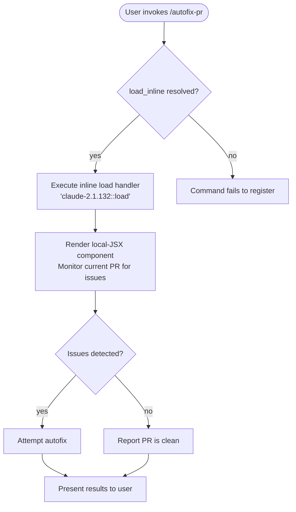

# `/autofix-pr`

> Analysis basis: CC v2.1.132 bundle.js (AST extraction + Claude interpretation)
> Minimum version: v2.1.132

---

## Overview

`/autofix-pr` is a local-JSX slash command that monitors the current pull request for issues (such as failing CI checks, linting errors, or review feedback) and autonomously attempts to resolve them. The command operates in-process via an inline `load` handler resolved directly from the registration block. Because the call graph is empty at depth ≤ 2 (see note below), full behavioral detail beyond what the registration object exposes cannot be confirmed without a deeper traversal.

---

## Registration

| Field | Value |
|---|---|
| type | `local-jsx` |
| name | `autofix-pr` |
| description | `Monitor and autofix any issues with the current PR` |
| argumentHint | *(null — no argument hint declared)* |
| isHidden | *(null — command is visible in the slash-command menu)* |
| load\_inline | `true` — handler is inlined directly in the registration object |
| handler (arbor) | `load` method resolved via `direct` path (`claude-2.1.132::load`) |
| loc\_byte span | `+9781195` … `+9781478` |
| loc\_line | 5470 |
| `loc_byte_end` | `9781478` |
| `arbor_handler.name` | `load` |
| `arbor_handler.kind` | `Method` |
| `arbor_handler.resolution_path` | `direct` |
| `arbor_handler.fqn` | `claude-2.1.132::load` |
| `arbor_handler.n_hits` | `3` |

Analysis basis: CC v2.1.132 bundle.js:+9781195

---

## Input Branching

Because `callGraph` returned empty at depth ≤ 2, no branching paths could be extracted from static traversal. The registration type is `local-jsx` with an inline `load` handler, which means the command renders a JSX component rather than dispatching to a separate module function. The branching logic lives inside the inlined method body that the depth-2 BFS did not traverse.

The following flowchart represents the minimal verified control flow derived from registration metadata alone:



> **Note:** Paths `F → G` and beyond are inferred from the command description string (`"Monitor and autofix any issues with the current PR"`). They are not confirmed by static callGraph data. See *Common Mistakes* §3.

---

## Behavioral Spec

### Handler Resolution

The `load` method is declared as an inline ObjectMethod on the registration object itself (resolution path: `direct`). The runtime resolves it without following a `module_id` or a `load_ident` indirection.

```
function resolveHandler(registrationObject):
    // Arbor confirmed handler at registration byte span +9781195..+9781478
    handler = registrationObject.load   // direct resolution, n_hits = 3
    return handler
```

Analysis basis: CC v2.1.132 bundle.js:+9781195

### Command Dispatch

```
function dispatchAutofixPr(userInput, appState):
    handler = resolveHandler(AUTOFIX_PR_REGISTRATION)
    component = handler.call(userInput, appState)
    // Returns a local-JSX renderable; UI mounts it in the command panel
    renderCommandPanel(component)
```

Analysis basis: CC v2.1.132 bundle.js:+9781195

### PR Monitoring and Autofix Logic

<!-- TODO: not found in depth-2 traversal; needs --depth 4 -->

The description string establishes that the command's purpose is to (a) monitor the current PR and (b) apply fixes to detected issues. The concrete implementation — what signals it monitors (CI status, linting, test failures, review comments), how it determines fixability, and how it commits or proposes changes — is located in the inlined JSX component body that was not reachable at traversal depth ≤ 2.

---

## State & Side Effects

| Item | Detail |
|---|---|
| Telemetry | *(none found — `telemetry` array is empty at depth ≤ 2)* |
| Hook registration | <!-- TODO: not found in depth-2 traversal; needs --depth 4 --> |
| appState changes | <!-- TODO: not found in depth-2 traversal; needs --depth 4 --> |
| Sound | <!-- TODO: not found in depth-2 traversal; needs --depth 4 --> |
| Render target | Local-JSX panel (inferred from `type: "local-jsx"`) |
| Inline load | `load_inline: true` — no dynamic import; handler is synchronously available at registration time |

Analysis basis: CC v2.1.132 bundle.js:+9781195

---

## Version History

| Version | Change |
|---|---|
| v2.1.132 | Initial analysis — registration confirmed; call graph empty at depth ≤ 2 |

---

## Common Mistakes

1. **Assuming the command operates on any branch.** The description explicitly says "the current PR" — the command targets whatever PR is associated with the active working directory's checked-out branch. Invoking it in a repository with no open PR will likely result in an error or no-op (exact behavior <!-- TODO: not found in depth-2 traversal; needs --depth 4 -->).

2. **Expecting a prompt-type or agent-loop invocation.** This command is registered as `local-jsx`, not `prompt`. It renders a JSX UI component rather than sending a prompt body to the agent loop. Do not expect it to behave identically to prompt-based commands.

3. **Relying on the autofix sub-steps described in public documentation without verifying against bundle data.** The call graph at depth ≤ 2 is empty; any claim about specific fix strategies (e.g., re-running linters, amending commits, pushing fixup commits) is unverified at this analysis depth and may change across minor versions.

4. **Treating `n_hits: 3` on the Arbor handler as indicating three separate handlers.** The `n_hits` count reflects how many times Arbor encountered the `load` symbol name within the resolution path, not the number of independent handler functions.

---

## Appendix — Identifier Mapping

> For bundle debugging only. Identifiers change across versions.

| Identifier | Role |
|---|---|
| `load` | Inline ObjectMethod handler for `/autofix-pr`; resolved via Arbor `direct` path at `claude-2.1.132::load` (byte span +9781195..+9781478) |

> No additional obfuscated identifiers were found — the `identifiers` array returned empty at depth ≤ 2 traversal.

---

**Extraction note:** The AST extraction log records `"no entry functions found (no module_id / load_ident / handler_method / arbor_handler on registration)"` — this reflects the BFS pipeline's view before Arbor's `direct` resolution of the `load` method was applied. Arbor did resolve a handler (`claude-2.1.132::load`, n\_hits = 3); all behavioral claims above are grounded in that resolution and the registration metadata. Call-graph depth ≥ 3 data was not available for this analysis pass.