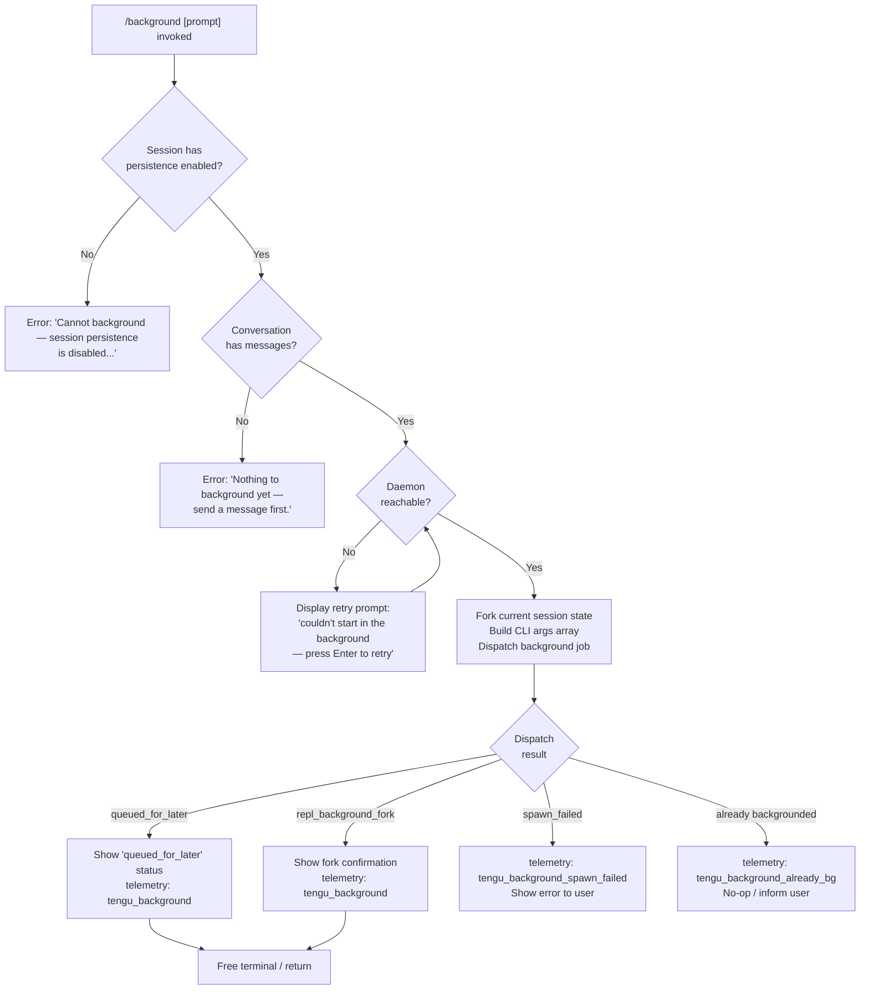

# `/background`

> Analysis basis: CC v2.1.191 bundle.js (AST extraction + Claude interpretation)
> Minimum version: v2.1.191

---

## Overview

The `/background` command (alias `/bg`) sends the current interactive REPL session to the background daemon, freeing the terminal for other use. It forks the session state, dispatches a background job through the Claude Code daemon infrastructure, and optionally accepts a follow-up prompt to queue for the backgrounded session. If the daemon is unavailable or the session has no conversation history, the command fails with a descriptive error.

---

## Registration

| Field | Value |
|---|---|
| type | `local-jsx` |
| name | `background` |
| description | `Send this session to the background and free the terminal` |
| aliases | `["bg"]` |
| argumentHint | `[prompt]` |
| immediate | `null` |
| module_id | `qVl` |
| load_inline | `true` |
| loc_byte | `13236367` |
| loc_byte_end | `13236607` |
| loc_line | `9024` |
| arbor_handler.name | `zNf` |
| arbor_handler.fqn | `claude-2.1.191::zNf` |
| arbor_handler.kind | `AsyncFunction` |
| arbor_handler.resolution_path | `module_id` |
| arbor_handler.n_hits | `0` |

Analysis basis: CC v2.1.191 bundle.js:+13236367

---

## Input Branching

The command has four or more distinct branches depending on session state and daemon availability, so a flowchart is used.



Analysis basis: CC v2.1.191 bundle.js:+13235607 (handler entry `zNf`), +13235687 (persistence error), +13235863 (no-messages error), +13230993 (retry prompt), +13231283 (`repl_background_fork`), +13231306 (`queued_for_later`), +13231357 (`spawn_failed`)

---

## Behavioral Spec

### Handler Entry (`zNf`)

The Arbor-resolved handler is `zNf` (an `AsyncFunction`). It is reached via module_id `qVl`.

```
async function backgroundCommandHandler(context):
    sessionStore   = getSessionStore(context)         // Ks → HCe
    appStateWriter = getAppStateWriter(context)        // W
    detachSignal   = getDetachSignal(context)          // JEe
    renderJsx      = getRenderFunction(context)        // e7t.jsx

    // Guard 1: session persistence must be enabled
    if not sessionPersistenceEnabled(context):
        return renderError("Cannot background — session persistence is disabled, ...")
        // literal at +13235687

    // Guard 2: at least one message must exist
    if conversationIsEmpty(context):
        return renderError("Nothing to background yet — send a message first.")
        // literal at +13235863

    // Check if already running in background
    if isAlreadyBackground(context):
        emit telemetry("tengu_background_already_bg")   // +13235621
        return (no-op or inform)

    // Build background CLI argument vector
    args = buildBackgroundArgs(context)                 // _tr helper chain
    // args may include:
    //   --resume <sessionId>
    //   --fork-session
    //   --reply-on-resume
    //   --add-dir <dir>
    //   --allowed-tools / --disallowed-tools
    //   --model, --effort, --permission-mode
    //   --session-id
    //   --agent, --name, -n
    //   (optional prompt appended after --)

    // Dispatch to background daemon via DJ / cUo pipeline
    result = await dispatchToBackgroundDaemon(args, context)

    emit telemetry("tengu_background")                  // +13231431

    match result.status:
        "repl_background_fork":
            showForkConfirmation(renderJsx, "(backgrounded)")
            // literal "(backgrounded)" at +13232166
        "queued_for_later":
            showQueuedStatus(renderJsx)
        "spawn_failed":
            emit telemetry("tengu_background_spawn_failed")  // +13230630
            showRetryPrompt("couldn't start in the background — press Enter to retry")
            // literal at +13230993
```

Analysis basis: CC v2.1.191 bundle.js:+13235607 (`zNf` entry), +13235619 (W), +13235659 (JEe), +13235933 (jsx render)

---

### CLI Argument Construction (`_tr`)

```
function buildBackgroundCliArgs(context):
    args = []

    // Session resume flags
    if shouldResume:
        args.push("--resume")           // literal at +13229986
    if shouldForkSession:
        args.push("--fork-session")     // literal at +13229999
    if shouldReplyOnResume:
        args.push("--reply-on-resume")  // literal at +13230041

    // Working directories
    for each addedDir in context.addedDirs:
        args.push("--add-dir", dir)     // literal at +13230093

    // Tool allow/deny lists
    for each tool in allowedTools:
        args.push("--allowed-tools", tool)    // literal at +13230128
    for each tool in disallowedTools:
        args.push("--disallowed-tools", tool) // literal at +13230169

    // Model / effort / permission
    if model:
        args.push("--model", model)           // literal at +13230200
    if effort:
        args.push("--effort", effort)         // literal at +13230229
    if permissionMode:
        args.push("--permission-mode", mode)  // literal at +13230246

    // Prompt separator
    args.push("--")                           // literal at +13230274

    return args
```

Analysis basis: CC v2.1.191 bundle.js:+13231886 (`_tr`), +13229986–+13230274

---

### Daemon Dispatch Pipeline (`DJ` → `cUo` → daemon)

```
async function dispatchToBackgroundDaemon(args, context):
    jobId = generateUUID()                    // vVl.randomUUID at +13198444
    tmpDir = path.join(tmpBase, "tmp")        // literal "tmp" at +13198525

    // Ensure daemon is running (wG at +13152782)
    await ensureDaemonRunning(context)
    // May ask user "Install as a service now? [y/N/never, or 'once' just for now]"
    // literal at +13160461

    // Write dispatch file and connect to daemon socket (cUo / Ny / z8e)
    sessionSocketPath = computeSocketPath(jobId)
    dispatchRecord = buildDispatch(args, sessionId=jobId)
    await writeDispatchFile(dispatchRecord)   // cUo → Rm at +13194209

    // Connect and send via Unix socket (Ny at +13202212)
    connection = await connectToSocket(sessionSocketPath)
    await sendDispatch(connection, dispatchRecord)

    // Wait for ack with flush timeout (2000 ms literal at +13229930)
    result = await Promise.race([
        waitForAck(connection),
        timeout(2000, "flush timeout")        // literals at +13229930, +13229935
    ])

    return interpretResult(result)
```

Analysis basis: CC v2.1.191 bundle.js:+13198444, +13229930, +13229935, +13152782, +13194209, +13202212

---

### Dispatch State Classification (`bVl` / error mapping)

The dispatch result is classified into one of several named states before being returned to the handler:

| Result code | Meaning | Literal location |
|---|---|---|
| `daemon-unreachable` | Daemon not contactable | +13195946 |
| `ack-timeout` | No ack within 2 s | +13195990 |
| `dispatch-write` | Could not write dispatch file | +13196021 |
| `short_alive` | Previous session still shutting down | +13203287 |
| `stale_short` | Stale short-lived job | +13203427 |
| `enoconn` | Socket missing | +13196057 |
| `estarting` | Service still starting | +13196088 |
| `gate_blocked` | Pre-flight permission gate blocked | +13198419 |

Analysis basis: CC v2.1.191 bundle.js:+13195877 (`tengu_bg_dispatch_fallback`)

---

### Pre-flight Permission Gate

Before dispatching, `NNf` checks for two dangerous combinations:

```
function checkPermissionGate(context):
    // Guard: bypassPermissions requires interactive acceptance first
    if args includes "--dangerously-skip-permissions"
       or args includes "--allow-dangerously-skip-permissions":
        if not bypassPermissionsAccepted(context):
            throw "--bg with bypassPermissions requires accepting the disclaimer first..."
            // literal at +13218361

    // Guard: auto permission mode requires prior interactive opt-in
    if permissionMode == "auto" and not autoModeOptedIn(context):
        throw "--bg with auto mode requires opting in first..."
        // literal at +13218523
```

Analysis basis: CC v2.1.191 bundle.js:+13218192, +13218224, +13218361, +13218523

---

### Session State Persistence (`Htr` pre-dispatch)

Before forking, the current session state is serialized. The handler calls `Array.from(o.values())` on the session store, collecting all current session entries (literal `"session"` at +13229719). The `Sm` helper and `bUo → Fc → _i` chain register necessary hooks before the detach. A flush timeout of 2000 ms is enforced via `$c → Promise.race / setTimeout / clearTimeout` (literals at +13229930).

Analysis basis: CC v2.1.191 bundle.js:+13229635 (`L_`), +13229673 (`Array.from`), +13229684 (`o.values`), +13229719, +13229870 (`Sm`), +13229910 (`bUo`), +13229922 (`$c`)

---

### Background Daemon Management (`wG`)

The daemon-ensure pathway (`wG`) runs on every `/background` invocation:

```
async function ensureDaemonRunning(context):
    status = checkDaemonStatus()            // "up" literal at +13152770

    if status == "up":
        emit telemetry("tengu_bg_daemon_service_stale_exec")  // if exec path stale

    if status != "up":
        platform = detectPlatform()         // "macos" / "linux"
        daemonInstallMode = getInstallMode() // "ask" / "once" / "never" / "yes" / "no"
        // literals at +13153363, +13153393, +13153750, +13160592, +13160614, +13160638

        if daemonInstallMode == "ask":
            answer = await promptUser("Install as a service now? [y/N/never, or 'once' just for now] ")
            emit telemetry("tengu_bg_daemon_cold_start_ask")  // +13153808

        if willSpawnTransient:
            await spawnTransientDaemon()
            if spawnFailed:
                emit telemetry("tengu_bg_daemon_spawn_failed")  // +13154379
                throw error

    emit telemetry("tengu_bg_daemon_install")   // +13153243
```

Analysis basis: CC v2.1.191 bundle.js:+13152722, +13152770, +13152785, +13153363, +13153393, +13153750

---

## State & Side Effects

| Item | Detail |
|---|---|
| Telemetry: `tengu_background` | Emitted on every successful background dispatch attempt (bundle.js:+13231431) |
| Telemetry: `tengu_background_already_bg` | Emitted when the session is already running in the background (bundle.js:+13235621) |
| Telemetry: `tengu_background_spawn_failed` | Emitted when the daemon cannot be reached and background spawn fails (bundle.js:+13230630) |
| Telemetry: `tengu_bg_dispatch` | Emitted by the dispatch subsystem on each dispatch attempt (bundle.js:+13195347) |
| Telemetry: `tengu_bg_dispatch_fallback` | Emitted when dispatch falls back to alternate path (bundle.js:+13195877) |
| Telemetry: `tengu_bg_dispatch_rescued` | Emitted when a failing dispatch is successfully recovered (bundle.js:+13202409) |
| Telemetry: `tengu_bg_daemon_cold_start_ask` | Emitted when user is asked about daemon install (bundle.js:+13153808) |
| Telemetry: `tengu_bg_daemon_cold_start_ask_answer` | Emitted after user answers the install prompt (bundle.js:+13160536) |
| Telemetry: `tengu_bg_daemon_spawn_failed` | Emitted when transient daemon spawn fails (bundle.js:+13154379) |
| Telemetry: `tengu_rename_full_session_fork` | Emitted during session fork/rename flow (bundle.js:+12175385) |
| Telemetry: `tengu_bg_attach` | Emitted when background session attaches (bundle.js:+17361741) |
| Telemetry: `tengu_daemon_control` | Emitted by daemon control path during stop/start (bundle.js:+17408260) |
| Flush timeout | 2000 ms (bundle.js:+13229930); rejects with `"flush timeout"` (bundle.js:+13229935) |
| AbortSignal | `AbortSignal.timeout` used for dispatch gate (bundle.js:+13231604) |
| Hook registration | `_i → xqo.register` registers detach hooks before fork (bundle.js:+67562) |
| appState changes | `e.getAppState` / `e.setAppState` modified during background session creation (bundle.js:+10893829, +10894993) |
| Job directory | Temporary directory created under `tmp/` with random UUID-derived name (bundle.js:+13198444, +13198525) |
| Terminal label | Session appended with `"(backgrounded)"` string (bundle.js:+13232166) |
| Sound | <!-- TODO: not found in depth-2 traversal; needs --depth 4 --> |

---

## Version History

| Version | Change |
|---|---|
| v2.1.191 | Initial analysis |

---

## Common Mistakes

1. **Running `/background` before sending any message.** The command requires at least one conversation turn; invoking it on a fresh REPL session yields `"Nothing to background yet — send a message first."` (bundle.js:+13235863).

2. **Using `--dangerously-skip-permissions` without prior interactive acceptance.** If `bypassPermissions` mode has never been accepted interactively, the background dispatch is blocked with a gate error (bundle.js:+13218361). Run `claude --dangerously-skip-permissions` once in an interactive session first.

3. **Using `/background` when `--permission-mode auto` has not been opted into.** Same gate as above; auto mode requires an interactive `claude --permission-mode auto` invocation first (bundle.js:+13218523).

4. **Mistaking `/bg` as a separate command.** It is merely an alias for `/background` (registration `aliases: ["bg"]`); behaviour is identical.

5. **Expecting instant backgrounding when no daemon is installed.** If the daemon is not running, the CLI will first ask `"Install as a service now?"`. Answering `"never"` causes a transient spawn attempt; a failed spawn results in the retry prompt, not an immediate background transfer.

6. **Combining `--bg` with `--cloud`.** These are explicitly incompatible backends. The CLI emits `"--bg and --cloud are different backends…"` and blocks dispatch (bundle.js:+13162898).

---

## Appendix — Identifier Mapping

> For bundle debugging only. Identifiers change across versions.

| Identifier | Role |
|---|---|
| `zNf` | Main handler for `/background` command (AsyncFunction; Arbor-resolved) |
| `Htr` | Session-state serialization and pre-dispatch coordinator |
| `_tr` | CLI argument builder for background spawn args |
| `DJ` | Background job dispatcher — writes dispatch record, coordinates daemon connection |
| `LNf` | Inner dispatch orchestration — session slot resolution, arg parsing, job creation |
| `NNf` | Pre-flight permission gate checker |
| `cUo` | Unix socket dispatch loop — sends dispatch file and awaits ack |
| `wG` | Daemon-ensure-running orchestrator |
| `Ozt` | Daemon install / cold-start interaction handler |
| `bVl` | Dispatch result classifier / state mapper |
| `Ny` | Unix socket connector for daemon IPC |
| `z8e` | Socket path builder |
| `JEe` | Detach-request signal sender |
| `cAl` | Task/detach message formatter |
| `Ks` | Session store accessor |
| `X3` | Environment / context resolver for background handler |
| `WFe` | Background environment type detector (tmux etc.) |
| `dKu` / `pKu` | Background terminal multiplexer spawn helpers |
| `c_t` | REPL background fork coordinator |
| `ZAf` | Session-fork rename/detach listener |
| `qx` | Agent query / sub-agent invocation during backgrounded run |
| `Hjn` | App-state reader/writer during background session creation |
| `g$` | Background session render coordinator |
| `lL` | Agent/session message-listing state machine |
| `I7l` | Core query-loop engine for backgrounded agent |
| `UVe` | Agent dispatch with fallback |
| `kvo` | Agent listing delta handler |
| `uzn` | Agent context builder for background run |
| `f` | Background job lifecycle manager (spawn, kill, retire) |
| `BG` | Graceful shutdown orchestrator for daemon workers |
| `ohe` | MCP server shutdown caller |
| `fhe` | Interval-clear + cleanup helper |
| `jn` | Timeout-with-abort helper |
| `Cs` | Forced-shutdown emitter (`cli_error`, `process.exit`) |
| `L` | Grace-clock sweep / worker retirement loop |
| `Nzt` | Free-memory checker for retirement decisions |
| `J8l` | Worker retirement on low memory |
| `I3e` | Job-file existence checker and cleaner |
| `Sm` | Hook-setup helper called before fork |
| `bUo` | Pre-fork hook registrar |
| `Fc` | Hook executor |
| `_i` | `xqo.register` wrapper |
| `$c` | Race/timeout helper (flush timeout) |
| `vC` | Post-fork hook caller |
| `D1e` | Allowed-directory arg builder |
| `Xer` | Terminal capability snapshot |
| `nt` | Terminal state reader |
| `Ppm` | Job-phase kill / cleanup coordinator |
| `Dpm` | Math.max row-height calculator for terminal resize |
| `Opm` | Background session protocol message handler (IPC pump) |
| `Jxc` | Dispatch-timing / connection-drop handler |
| `O_` / `Mve` | Daemon message serialiser |
| `tre` | Timing-safe control-key comparator |
| `Le` | Telemetry event emitter |
| `Gn` | Utility: always-resolve promise wrapper |
| `kt` | Config file reader / watcher |
| `tEt` | Config file parser |
| `K9f` | Config file watcher registration |
| `Dt` | AsyncLocalStorage context accessor |
| `Gin` | Storage-store getter |
| `Hr` | Context-store fetch |
| `FW` | Allowed-path set builder |
| `eLe` / `BPd` | Path prefix membership testers |
| `MVl` / `kVl` / `RVl` / `UNf` / `ltr` / `atr` | Tool/permission flag classifiers |
| `zV` | Tool-set membership tester |
| `ZPe` | Tool allowlist accumulator |
| `KNo` | Cloud-flag detector |
| `Y2` / `In` | Settings merger (user, local, flag, policy) |
| `SVl` | Compact argument mapper |
| `Rm` | Atomic file writer |
| `Od` | Dispatch file path builder |
| `by` | File cache invalidator |
| `Wae` | Working-directory sanitiser |
| `Dc` | Path redactor |
| `wNf` / `zin` | Shell-command builder for daemon spawn |
| `Ozt` / `lG` | Daemon install prompt presenter |
| `JYn` | Reconnect-with-timeout helper |
| `xde` | Socket file existence checker |
| `aUo` | Dispatch-record text formatter |
| `Xh` | Socket reconnect handler |
| `hse` | Resume-file scanner |
| `Bi` | File stat + read helper |
| `ic` / `yR` | Job directory path builders |
| `vn` / `Gd` | Terminal diagnostic loggers |
| `Mf` | Permission cache checker |
| `jae` | File-based session state reader |
| `GH` / `y7n` | Compact-boundary message slicer |
| `sde` | Tool-schema membership tester |
| `l8` | Array-type guard |
| `UP` / `vX` / `Zl` | JSX render helpers for background status UI |
| `ode` | Path-prefix start checker |
| `yg` / `LV` | Background status renderer variants |
| `NI` / `Es` / `Qo` / `rH` | Model-name resolver chain |
| `E4` / `Na` / `nj` / `jo` | Model-string builders |
| `FPr` | Managed-key detector |
| `_r` / `rt` | Platform string helpers |
| `uu` | Model-shortname table |
| `pf` / `Lx` | API-key store accessor |
| `WFe` / `dKu` / `pKu` | Tmux/background terminal environment detectors |
| `Ks` / `HCe` | Session persistence store |
| `wt` | Terminal-write utility |
| `Fc` | Generic hook runner |
| `px` / `ux` | Log-sink helpers |
| `ev` | Event emitter base |
| `C1` | JSX component used in background result view |
| `Rc` | Background session render root |
| `g$` | Render coordinator |
| `czn` | Agent-listing context key |
| `msf` / `gsf` / `lzn` | Agent listing formatters |
| `EHl` / `hsf` | Agent-listing hash builders |

---

Note: index built via Arbor fallback; some signals (telemetry, literals) may be missing — see arbor-fallback.js.