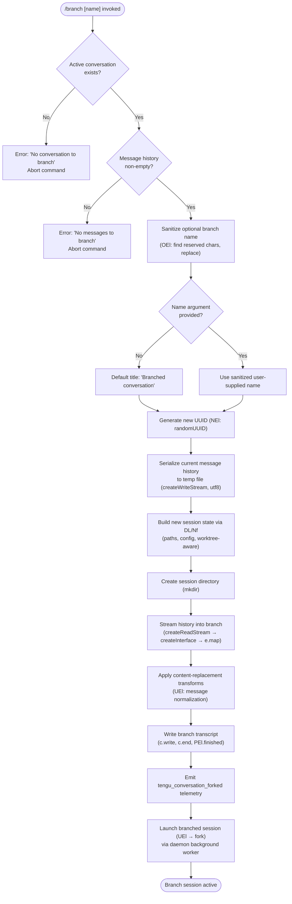

# `/branch`

> Analysis basis: CC v2.1.191 bundle.js (AST extraction + Claude interpretation)
> Minimum version: v2.1.191

---

## Overview

The `/branch` command creates a divergent copy ("branch") of the current conversation at the point it is invoked, preserving all messages up to that moment. It serializes the existing message history to a temporary file, generates a fresh session UUID, initializes a new conversation state rooted at those messages, and launches the branched session — all without disturbing the parent conversation.

---

## Registration

| Field | Value |
|---|---|
| type | `local-jsx` |
| name | `branch` |
| description | `Create a branch of the current conversation at this point` |
| argumentHint | `[name]` |
| module_id | `Xwo` |
| load_inline | `true` |
| loc_byte | `12639196` |
| loc_byte_end | `12639373` |
| loc_line | `8497` |
| arbor_handler.name | `glf` |
| arbor_handler.fqn | `claude-2.1.191::glf` |
| arbor_handler.kind | `AsyncFunction` |
| arbor_handler.resolution_path | `module_id` |
| arbor_handler.n_hits | `0` |

Analysis basis: CC v2.1.191 bundle.js:+12639196

---

## Input Branching

The `/branch` command has four distinct execution paths depending on the state of the current conversation and the presence of an optional name argument.



---

## Behavioral Spec

### 1. Entry Point and Argument Normalization

The async handler `glf` is the command's main entry function (Arbor resolution: `module_id` path, `claude-2.1.191::glf`).

```
async function branchCommandHandler(args, appContext):
    rawName = args[0] or null

    # Validate that a conversation is active
    if not appContext.hasActiveConversation():
        raise UserFacingError("No conversation to branch")   # bundle.js:+11226840

    # Sanitize the optional branch name by stripping reserved path characters
    sanitizedName = sanitizeBranchName(rawName)             # OEl called here

    title = sanitizedName if sanitizedName else "Branched conversation"  # bundle.js:+11226393

    return forkConversation(title, appContext)
```

Analysis basis: CC v2.1.191 bundle.js:+11226840, +11226393

### 2. Branch Name Sanitization (`OEl`)

`OEl` is a small utility that locates reserved or illegal filename characters and replaces them with safe alternatives.

```
function sanitizeBranchName(input):
    if input is null or empty:
        return null
    reserved = findReservedChars(input)       # t.find — bundle.js:+11226445
    return input.replace(reserved, safeChar)  # n.replace — bundle.js:+11226523
```

Analysis basis: CC v2.1.191 bundle.js:+11226445, +11226523

### 3. Message-History Validation (`NEl` — fork writer)

Before writing, the implementation verifies the history is non-empty.

```
function forkConversation(title, appContext):
    messages = appContext.getMessages()

    if messages is empty:
        raise UserFacingError("No messages to branch")   # bundle.js:+11227959

    branchId  = crypto.randomUUID()                      # bundle.js:+11226632
    branchDir = buildBranchPath(branchId, appContext)    # wt, wh, Hr, DL, Nf

    mkdir(branchDir, recursive=true)                     # bundle.js:+11226694
    ...
```

Analysis basis: CC v2.1.191 bundle.js:+11227959, +11226632, +11226694

### 4. History Serialization (`NEl` — stream pipeline)

The message history is piped through a streaming copy pipeline with a buffer size of 448 bytes for reads and 384 bytes for writes.

```
function serializeHistory(messages, branchDir):
    tmpPath  = resolveTempPath()
    readStream  = fs.createReadStream(tmpPath, {encoding:"utf8"})  # bundle.js:+11226743
    rl          = readline.createInterface(readStream)              # bundle.js:+11226983

    writeStream = fs.createWriteStream(branchTranscriptPath, ...)  # bundle.js:+11226889
    # Read buffer hint: 448 bytes  (bundle.js:+11226725)
    # Write buffer hint: 384 bytes (bundle.js:+11226935)

    for each line in rl:
        record = parseRecord(line)            # $t → JSON.parse
        transformed = applyContentReplacement(record)   # "content-replacement" bundle.js:+11227320
        writeStream.write(transformed)

    await stream.finished(writeStream)        # PEl.finished — bundle.js:+11228369
    fs.unlink(tmpPath)                        # cleanup temp file
```

Analysis basis: CC v2.1.191 bundle.js:+11226743, +11226983, +11226889, +11226725, +11226935, +11228369

### 5. Session Path Construction (`DL` / `Nf`)

Branch paths are composed from the current working directory, session home, and the new UUID. The path builder is worktree-aware (calls `wh`, `Hr`, and `Nf.join`).

```
function buildBranchPath(branchId, context):
    base    = getSessionHome(context)     # wt → ux (bundle.js:+45356)
    sub     = getSubdir(context)          # Hr → ux (bundle.js:+46603)
    parts   = [base, sub, branchId]
    return path.join(...parts)            # rh.join  (bundle.js:+13332636)
```

Analysis basis: CC v2.1.191 bundle.js:+13332591, +13332603, +13332609, +13332636

### 6. Content Normalization During Copy (`UEl` orchestrator + `mlf` / `eJ`)

`UEl` is the orchestrating fork function. It invokes `mlf` to iterate over the source message list, applying `eJ`-based normalization (deduplication by seen set, model-refusal fallback tagging at `bundle.js:+11227634`, and "progress" sentinel messages at `bundle.js:+11227877`).

```
function normalizeBranchMessages(rawMessages):
    seenIds = new Set()
    result  = []

    for msg in rawMessages:
        normalized = eJ(msg)                      # full normalization pass
        if isProgress(msg):                       # "progress" literal
            skip
        if seenIds.has(normalized.id):
            handleDuplicate(normalized)
        else:
            seenIds.add(normalized.id)
            result.push(normalized)

    return result
```

Analysis basis: CC v2.1.191 bundle.js:+11229124, +11228561, +11228756, +11228809, +11227877, +11227634

### 7. Conversation Launch (`UEl` tail — fork via daemon)

After writing the branch transcript, `UEl` triggers a daemon-mediated fork. A "fork" literal tag (`bundle.js:+11229709`) is attached to the new session startup record. The session title is stored as a `custom-title` annotation (`bundle.js:+13372175`). The auto-naming mode is set to `"auto"` (`bundle.js:+11229142`).

```
function launchBranchedSession(branchDir, title, context):
    sessionRecord = {
        id        : branchId,
        title     : title,            # "Branched conversation" or user name
        type      : "fork",           # bundle.js:+11229709
        autoTitle : "auto",           # bundle.js:+11229142
        startedAt : new Date().toISOString()   # bundle.js:+11229278
    }

    Q6(sessionRecord, context)   # emits session-renamed event
    s8e(sessionRecord, context)  # writes agent-name annotation

    # Hand off to background daemon worker
    daemonForkWorker(branchDir, sessionRecord)

    emitTelemetry("tengu_conversation_forked")   # bundle.js:+11229188
```

Analysis basis: CC v2.1.191 bundle.js:+11229709, +11229142, +11229278, +11229188, +13372175

### 8. Error Handling

| Condition | Error string | Exit behaviour |
|---|---|---|
| No active conversation | `"No conversation to branch"` | Command aborts, no side effects |
| Empty message list | `"No messages to branch"` | Command aborts, temp file never created |
| Temp file missing | `ENOENT` (`bundle.js:+183598`) caught via `Le`/`fo` | Logged; branch aborted |
| Unknown runtime error | `"Unknown error occurred"` (`bundle.js:+11229876`) | Surfaced to UI |

Analysis basis: CC v2.1.191 bundle.js:+11226840, +11227959, +183598, +11229876

---

## State & Side Effects

| Item | Detail |
|---|---|
| Telemetry | `tengu_conversation_forked` (bundle.js:+11229188) — fired once per successful branch; `tengu_session_renamed` (bundle.js:+13372267) — fired when branch title is persisted; `tengu_agent_name_set` (bundle.js:+13376724) — fired when agent-name annotation written |
| Filesystem | Creates a new session directory under the session home; writes a branch transcript file; creates then unlinks a temporary pipe file |
| New session UUID | Generated via `crypto.randomUUID()` (bundle.js:+11226632) |
| appState changes | A new conversation entry is added to the session roster; the parent session is not modified |
| Daemon interaction | Background worker (`Fjo`/`Mjo` path) is invoked to host the new branch session |
| Parent conversation | Unchanged — the branch is a copy, not a continuation |
| Hook registration | `_i` → `xqo.register` (bundle.js:+67562) — standard command-lifecycle hook wired during module init |
| Sound | None detected in depth-2 traversal |

---

## Version History

| Version | Change |
|---|---|
| v2.1.191 | Initial analysis |

---

## Common Mistakes

1. **Running `/branch` with no active conversation**: The command requires at least one message to be present in the current conversation. Invoking it in a fresh, empty session will produce the error `"No messages to branch"`.
2. **Expecting the parent session to be closed**: `/branch` is non-destructive; the parent conversation continues unaffected. Users expecting a "split" that replaces the parent will be surprised.
3. **Using characters reserved by the filesystem in the branch name**: The name argument is sanitized (`OEl`), but passing an empty string or only reserved characters will cause the title to fall back to `"Branched conversation"`.
4. **Assuming the branch is immediately interactive**: The fork is dispatched to a background daemon worker; there may be a brief startup delay before the branched session is ready to accept input.
5. **Relying on branch ordering within the session roster**: Branch entries are ordered by insertion time (`Date.toISOString()` at `bundle.js:+11229278`), not by any user-defined sort key.

---

## Appendix — Identifier Mapping

> For bundle debugging only. Identifiers change across versions.

| Identifier | Role |
|---|---|
| `glf` | Main async handler for `/branch` command (Arbor-resolved entry point) |
| `UEl` | Branch orchestrator — sequences validation, serialization, and session launch |
| `NEl` | Fork writer — creates temp file, streams history, writes branch transcript |
| `OEl` | Branch-name sanitizer — finds and replaces reserved characters |
| `mlf` | Message iterator — applies normalization to each message during copy |
| `eJ` | Single-message normalizer — deduplication, model-refusal tagging, sort |
| `Q6` | Session title persister — writes `custom-title` annotation, emits rename event |
| `s8e` | Agent-name annotator — writes `agent-name`, emits `tengu_agent_name_set` |
| `DL` | Branch path builder (top-level) — composes directory path components |
| `Nf` | Sub-path resolver — joins session home sub-directory segments |
| `wt` | Session home accessor (shared utility) |
| `Hr` | Sub-directory resolver (shared utility) |
| `wh` | Worktree-awareness helper |
| `aKl` | Directory listing / filesystem walker (used during transcript reading) |
| `Mye` | Git worktree list parser — feeds worktree-aware path selection |
| `Fjo` | Background worker lifecycle manager (fork/retire) |
| `Mjo` | Daemon claim sender — dispatches new session to daemon socket |
| `K2o` | Session state writer — serializes roster entry to `state.json` |
| `Ipm` | Claim timeout handler |
| `jae` | File watcher setup for branched session |
| `lS` | Basename resolver for branch file path |
| `yi` | Utility: index-based string slicer |
| `Le` | Error-surfacing / logging wrapper |
| `fo` | Low-level error converter (code → ENOENT detection) |
| `rt` | String coercion utility |
| `ke` | JSON serializer wrapper |
| `Cs` | CLI error handler (emits `cli_error`, calls `process.exit(1)`) |
| `nqe` | Pre-exit flush utility |
| `fT` | Final teardown helper |
| `VR` | Binary frame encoder (buffer pack for daemon socket writes) |
| `rGl` | Daemon status file reader (`daemon.status.json`) |
| `ozt` | Status file path resolver |
| `qs` | Async-local-storage store accessor |
| `HZ` | Daemon socket path resolver |
| `rge` | Socket path string trimmer |
| `Sg` | Message schema validator |
| `Cw` | String escape utility (used in message normalization) |
| `Qen` | Token boundary checker |
| `Zen` | Surrogate-pair string replacer |
| `iD` | Deep-clone utility (`structuredClone` wrapper) |
| `etn` | Message array tail-pop transformer |
| `u7e` | Message array normalizer (pop/push variant) |
| `lqe` | Buffer allocation helper for content chunks |
| `bHt` | Async write-completion tracker |
| `eLe` | File-path allowlist filter |
| `Od` | File metadata compositor |
| `Bi` | File state tracker (lstat, cache get/set) |
| `ic` | Path join helper for session files |
| `by` | Cache-entry deleter |
| `bh` | Active-state marker |
| `zR` | Socket write error handler (`err` / `late` states) |
| `zN` | Session state updater (writes `state.json` transitions) |
| `PM` | Late-write guard |
| `oSe` | Session entry writer |
| `lqt` | Roster entry appender |
| `aqt` | Roster path resolver |
| `Wt` | File write utility (shared) |
| `iqt` | Roster file path helper |
| `yg` | Logger initializer |
| `Fc` | Log formatter |
| `_i` | Command hook registrar |
| `YSe` | Log file appender (appendFileSync path) |
| `X3` | Log entry builder |
| `Gt` | Timestamp formatter for log entries |
| `hz` | Config file read/write helper |
| `_0t` | Atomic config file updater |

---

Note: index built via Arbor fallback; some signals (telemetry, literals) may be missing — see arbor-fallback.js.