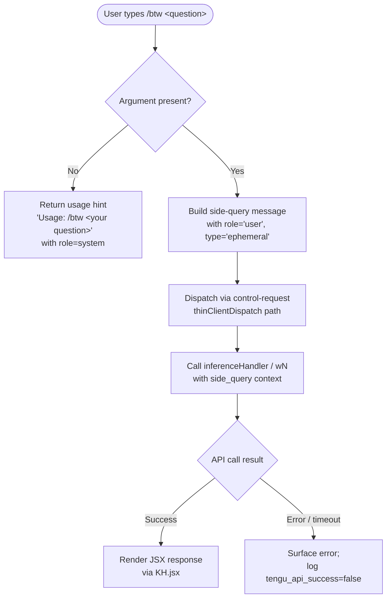

# `/btw`

> Analysis basis: CC v2.1.191 bundle.js (AST extraction + Claude interpretation)
> Minimum version: v2.1.191

---

## Overview

`/btw` ("by the way") allows the user to pose a quick side question to the model without interrupting or polluting the main conversation thread. The command fires immediately (`immediate: true`) and dispatches via the `control-request` thin-client path, so the side query runs in an isolated inference call that does not affect the ongoing primary conversation state.

---

## Registration

| Field | Value |
|---|---|
| type | `local-jsx` |
| name | `btw` |
| description | Ask a quick side question without interrupting the main conversation |
| argumentHint | `<question>` |
| immediate | `true` |
| thinClientDispatch | `control-request` |
| module_id | `GEl` |
| load_inline | `true` |
| loc_byte | `11236922` |
| loc_byte_end | `11237161` |
| loc_line | `6932` |
| arbor_handler.name | `blf` |
| arbor_handler.fqn | `claude-2.1.191::blf` |
| arbor_handler.kind | `AsyncFunction` |
| arbor_handler.resolution_path | `module_id` |
| arbor_handler.n_hits | `0` |

Analysis basis: CC v2.1.191 bundle.js:+11236922

---

## Input Branching

Three distinct paths exist depending on whether the user supplied an argument, and how the side-query inference call resolves.



Analysis basis: CC v2.1.191 bundle.js:+11236523 (handler entry), +11236525 (usage literal), +11236564 (system role literal), +16670866 (ephemeral literal)

---

## Behavioral Spec

### Argument Validation

```
async function btwHandler(context):
    question = context.args.trim()
    if question is empty:
        return systemMessage("Usage: /btw <your question>")
    proceed to sideQueryDispatch(question, context)
```

If no argument is provided, the handler emits a `system`-role message with the text "Usage: /btw \<your question\>" and returns early.

Analysis basis: CC v2.1.191 bundle.js:+11236525 (usage string literal), +11236564 (role "system" literal)

---

### Side-Query Message Construction

```
function buildSideQueryMessages(question, conversationHistory):
    trimmedHistory = truncateHistory(conversationHistory, limit=30)
    // history entries with role "user" and "assistant" are included
    // entries older than the trailing 30 are dropped
    ephemeralMessage = {
        role: "user",
        type: "ephemeral",       // not persisted to main thread
        content: question
    }
    return append(trimmedHistory, ephemeralMessage)
```

The conversation-history helper (`L6o`) slices the existing message list to the trailing **30** entries (Analysis basis: CC v2.1.191 bundle.js:+16668949) and recognises `"user"` and `"assistant"` roles (Analysis basis: CC v2.1.191 bundle.js:+16668982, +16668999). Entries of type `"text"`, `"tool_result"`, and `"tool_use"` are all handled by the history builder; tool-use blocks accumulate up to **1000** characters before truncation (Analysis basis: CC v2.1.191 bundle.js:+16669144). The final user turn is tagged `"ephemeral"` so it is not written back to the main conversation store (Analysis basis: CC v2.1.191 bundle.js:+16670866).

---

### Inference Dispatch (`wN` / Side-Query Inference Handler)

```
async function sideQueryInferenceHandler(messages, config):
    // Annotates the request with context label "side_query"
    requestContext = { label: "side_query" }

    // Applies context-window limits
    maxTokens = min(requestedTokens, configuredMax)   // Math.min at +8938174

    // Constructs API payload; injects structured_outputs flag if applicable
    payload = buildPayload(messages, config, requestContext)

    // Selects model; checks for cross-version model compat
    // (checks claude-3-*, claude-opus-4-0, claude-sonnet-4-0, etc.)
    model = resolveModel(config)

    // Makes HTTP call; uses AbortSignal.timeout(10000) for auth
    response = await fetch(apiEndpoint, payload)

    // On success, emits tengu_api_success telemetry
    // Returns structured response for JSX rendering
    return parseStreamedResponse(response)
```

Key observed literals in this path:
- Context label: `"side_query"` (Analysis basis: CC v2.1.191 bundle.js:+8937327)
- Structured outputs flag: `"structured_outputs"` (Analysis basis: CC v2.1.191 bundle.js:+8937455)
- Model compatibility list includes `"claude-3-"`, `"claude-opus-4-0"`, `"claude-sonnet-4-0"` and later variants (Analysis basis: CC v2.1.191 bundle.js:+3047495, +3047513, +3047536)
- Maximum token budget enforced via `Math.min` (Analysis basis: CC v2.1.191 bundle.js:+8938174)
- `performance.now()` used for latency measurement (Analysis basis: CC v2.1.191 bundle.js:+8938785)
- Response hash computed with SHA-256 (Analysis basis: CC v2.1.191 bundle.js:+8936332)

---

### Response Rendering

```
function renderBtwResponse(inferenceResult):
    // Handler calls KH.jsx to produce a JSX element
    // The JSX element is surfaced in the UI outside the main conversation
    return KH.jsx(BtwResponseComponent, { result: inferenceResult })
```

The final step in `blf` calls `KH.jsx` (Analysis basis: CC v2.1.191 bundle.js:+11236633), confirming the response is rendered as a React/JSX component in the CLI UI layer rather than being injected into the message history.

---

### Context-Tip Classifier Integration

The inference path shared by `/btw` integrates a lightweight context-tip classifier (`context_tip_classifier`) that runs a secondary classification pass capped at **512** tokens (Analysis basis: CC v2.1.191 bundle.js:+16671099). Outcomes logged to telemetry include: `tips_context_classify`, `tips_context_classify_no_tool_use`, `tips_context_classify_parse_failed`, and `tips_context_classify_request_failed` (Analysis basis: CC v2.1.191 bundle.js:+16671339, +16671363, +16671584, +16672143). This classifier does not alter the side-query response presented to the user.

---

### Configuration Persistence (side-effect path via `gn`)

The handler also reaches the global config layer (`gn` → `U7t`) for reading session configuration. Config writes use a file-locking mechanism; lock-acquisition delay exceeding **100 ms** emits `tengu_config_lock_contention` (Analysis basis: CC v2.1.191 bundle.js:+13865455, +13865550). The config subsystem auto-repairs parse errors and refuses writes that would erase auth tokens (Analysis basis: CC v2.1.191 bundle.js:+13865935, +13866241).

---

## State & Side Effects

| Item | Detail |
|---|---|
| Telemetry — `tengu_api_success` | Emitted after each inference call; present in the side-query dispatch path (bundle.js:+8938998) |
| Telemetry — `tengu_context_tip_classifier_outcome` | Emitted by the classifier sub-call that runs alongside the main inference (bundle.js:+16672225) |
| Telemetry — `tengu_prompt_cache_1h_config` | Emitted when 1-hour prompt-cache configuration is applied (bundle.js:+13616098) |
| Telemetry — `tengu_lone_surrogate_sanitized` | Emitted if lone Unicode surrogates are stripped from the response stream (bundle.js:+8938694) |
| Telemetry — `tengu_config_lock_contention` | Emitted if config file lock takes longer than expected (bundle.js:+13865550) |
| Telemetry — `tengu_config_stale_write` | Emitted on stale config write detection (bundle.js:+13865686) |
| Telemetry — `tengu_config_parse_error` | Emitted when config JSON cannot be parsed (bundle.js:+13869283) |
| Telemetry — `tengu_config_auto_repaired` | Emitted after auto-repair of a corrupt config (bundle.js:+13866063) |
| Telemetry — `tengu_config_auth_loss_prevented` | Emitted when a write that would erase auth is blocked (bundle.js:+13866393) |
| Telemetry — `tengu_config_fallback_write` | Emitted when the fallback write path is used (bundle.js:+13865166) |
| Telemetry — `tengu_bg_retire_pinned_low_mem` | Emitted by background worker lifecycle; may fire during long side queries (bundle.js:+17375231) |
| Telemetry — `tengu_bg_prewarm_per_sweep` | Emitted by background worker pre-warm sweep (bundle.js:+17375352) |
| Telemetry — `tengu_bg_attach_upgrade` | Emitted when a background worker is upgraded (bundle.js:+13163664) |
| Telemetry — `tengu_feature_ok` / `tengu_feature_bad` | Emitted by feature-flag evaluation in the inference path (bundle.js:+1025725, +1025792) |
| Telemetry — `tengu_daemon_control` | Emitted on daemon lifecycle events (bundle.js:+17408260) |
| Hook registration | None observed in depth-2 traversal |
| appState changes | The side-query result is rendered as an ephemeral JSX component; no permanent appState mutation observed |
| Conversation history | **Not modified** — the `ephemeral` message type prevents write-back to the main thread |
| Sound | <!-- TODO: not found in depth-2 traversal; needs --depth 4 --> |
| thinClientDispatch | Routes through `control-request` path, bypassing normal message-queue |

---

## Version History

| Version | Change |
|---|---|
| v2.1.191 | Initial analysis |

---

## Common Mistakes

1. **Omitting the question argument** — running `/btw` with no text returns only a usage hint (`"Usage: /btw <your question>"`); no inference call is made.
2. **Expecting the answer in the main conversation** — the response is rendered as a separate ephemeral JSX component and does not appear in the scrollback history of the primary session.
3. **Assuming full conversation context is sent** — only the trailing **30** messages from the current session are included in the side-query payload; very long conversations will have their earlier context stripped.
4. **Conflating `/btw` with subagent invocations** — `/btw` uses `control-request` dispatch, not the subagent (`subagent`) path; it does not spawn a new agent and does not consume subagent quota.
5. **Expecting streaming output** — while the underlying API call uses SSE (`text/event-stream`), the thin-client `control-request` path may buffer and present the result as a single rendered block rather than a streaming token-by-token update.

---

## Appendix — Identifier Mapping

> For bundle debugging only. Identifiers change across versions.

| Identifier | Role |
|---|---|
| `blf` | Main `/btw` async handler (Arbor-resolved entry point) |
| `e` | Side-query inference orchestrator (called by `blf`) |
| `L6o` | Conversation-history builder / truncator (trailing-30 slice) |
| `gsm` | History entry setter (Map.set wrapper) |
| `har` | Text-encoding helper (char-code / slice operations) |
| `hx` | Unicode surrogate-pair splitter |
| `Cs` | CLI error reporter (calls `process.exit`) |
| `msm` | Auto-classifier input formatter |
| `ke` | JSON serialiser wrapper (`JSON.stringify`) |
| `wN` | Inference dispatch handler ("side_query" labelled API call) |
| `oW` | Anthropic API client constructor / request builder |
| `mz` | Base API URL resolver |
| `p3r` | Request path parser (split/trim/indexOf/slice) |
| `Ks` | Background-mode detector |
| `Mz` | User-agent string builder |
| `GPr` | URL encoder (replace + encodeURIComponent) |
| `T` | HTTP header assembler |
| `rt` | String coercion utility |
| `Ng` | OAuth token refresher |
| `XKs` | Boolean coercion wrapper |
| `_y` | API key / auth-helper resolver |
| `_ud` | Auth-token retriever with timeout |
| `Kdn` | Proxy-auth helper coordinator |
| `Iud` | Request-ID generator and tracker |
| `PH` | Mantle (thin-client) session handler |
| `G2` | Duplicate-request deduplicator |
| `fy` | Retry / backoff controller |
| `Tud` | Stream response finaliser |
| `yud` | Provider selection / routing |
| `SCe` | Cached-response resolver |
| `Rdr` | Request-duration recorder (`Date.now`) |
| `pMt` | Header normaliser (toLowerCase) |
| `dve` | SDK error logger |
| `BSn` | Model-name resolver |
| `D` | Output stream writer |
| `x` | Active-request cache (get/set/delete with 60 s TTL) |
| `v` | Focus/blur state tracker (3 600 000 ms threshold) |
| `Ooe` | Provider prefix matcher (`e.startsWith`) |
| `nv` | Notification / in-process hook |
| `yA` | UI context-state manager |
| `ACe` | WIF token-exchange handler |
| `TZe` | WIF credentials resolver (fetch-based) |
| `I` | Token-bucket / rate-limiter |
| `b2e` | Application-inference-profile checker |
| `ao` | Model capability checker |
| `o1` | Request-header builder variant |
| `lie` | Foundry resource resolver |
| `vOr` | Foundry URL rewriter |
| `_` | Active-tool-set holder |
| `a` | Tool registry accessor |
| `CBp` | Tool-definition finder (e.find / n.find) |
| `SHo` | SHA-256 request hasher |
| `Ghn` | User-agent / session-header composer |
| `ol` | String coercion helper |
| `_r` | React-element / JSX helper |
| `uu` | Async generator wrapper |
| `$hn` | AsyncLocalStorage store accessor |
| `hCe` | Cache-control header builder |
| `aIn` | In-flight request tracker |
| `aje` | Main-thread context builder |
| `To` | Context-window configuration accessor |
| `dpr` | Context-window deprecation logger |
| `nt` | Worker-thread / background-task scheduler |
| `ppr` | Prompt-cache 1h config applicator |
| `wD` | Request-dedup wrapper |
| `C3r` | Dedup key builder |
| `A2e` | Dedup response replayer |
| `L` | Background-worker lifecycle manager (sweep loop) |
| `Nzt` | Memory-pressure probe (`os.freemem`) |
| `J8l` | Background-worker retire-grace bridge |
| `I3e` | Stale-cache file pruner |
| `Le` | Log-error emitter |
| `Gn` | Background-context holder |
| `W` | Promise / async utilities |
| `Xer` | Worker upgrade coordinator |
| `q` | Keyboard-event-aware background worker |
| `ZVa` | Response validator |
| `sp` | Special-character replacer |
| `XSn` | Temperature-config applicator |
| `av` | Content-array mapper |
| `Txe` | Tool-call response builder |
| `P4` | Tool-call ID generator (`randomBytes`) |
| `Sc` | Tool-state / appState accessor |
| `etn` | Conversation-message transformer (tool-use direction) |
| `Qen` | Message-content validator |
| `iD` | Structured-clone deep-copier |
| `u7e` | Conversation-message transformer (tool-result direction) |
| `Zen` | Tool-result text replacer |
| `Ve` | React reconciler / render helper |
| `eze` | React createElement |
| `LOr` | Tool-permission checker |
| `l7s` | Permission rule parser |
| `wOr` | Permission cache manager |
| `mbe` | Mid-stream error handler |
| `Tr` | UI render trigger |
| `lh` | Layout helper |
| `Oo` | Output formatter |
| `H1t` | Prompt-cache builder |
| `v3i` | Cache-tier selector |
| `Rot` | Cache layout composer |
| `h1t` | Prompt-cache entry builder |
| `NF` | Agent-name resolver |
| `nOd` | Built-in / custom agent prefix parser |
| `xD` | Agent thread-type checker (`repl_main_thread`) |
| `kAt` | Cache-control block appender |
| `S4` | Side-query message wrapper |
| `ev` | Event-stream result type |
| `PPr` | Provider payload builder |
| `zp` | Request body assembler |
| `usm` | Message pre-processor |
| `csm` | Message content mapper |
| `hsm` | System-prompt assembler (push/join) |
| `M6n` | Tool-definition finder for side-query |
| `cSt` | Context-tip classifier caller |
| `Pe` | React component (context tip) |
| `Re` | React component (feature renderer ok-branch) |
| `D6n` | Schema safe-parser |
| `we` | React component (feature renderer default) |
| `Ae` | String coercion (String constructor) |
| `gn` | Config read/write coordinator |
| `U7t` | Config file manager with lock + backup |
| `Gt` | File-path resolver |
| `kzs` | Config serialiser |
| `hOr` | Config diff helper |
| `dn` | Debug logger |
| `tEt` | Config file reader with migration |
| `$t` | JSON.parse wrapper |
| `n4` | Config prefix stripper |
| `L2o` | Config directory enumerator |
| `R2o` | Config path joiner |
| `nEt` | Config defaults applicator |
| `y` | Session-state accessor |
| `PGe` | Teammate-mailbox message marker |
| `Rvt` | Atomic file writer (fsync + rename) |
| `jd` | Realpath resolver |
| `u` | Daemon stop coordinator |
| `vn` | Error logger (debug) |
| `hXe` | fsync error classifier |
| `ius` | Property-descriptor definer |
| `dOe` | Config schema validator |
| `v2o` | Config-entry enumerator (`Object.entries`) |
| `O7t` | Config-operation timer |
| `P7t` | Config load entry point |
| `Xnr` | Global-config save coordinator |

---

Note: index built via Arbor fallback; some signals (telemetry, literals) may be missing — see arbor-fallback.js.