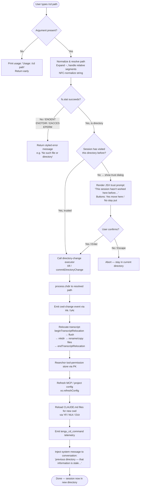

# `/cd`

> Analysis basis: CC v2.1.191 bundle.js (AST extraction + Claude interpretation)
> Minimum version: v2.1.191

---

## Overview

The `/cd` command changes the active working directory of the current Claude Code session to a user-supplied path. It validates the target path (resolving `~`, relative paths, and symbolic links), optionally prompts the user for trust confirmation if the destination has never been visited in this session, then atomically relocates the session's transcript storage, reanchors tool permissions, and refreshes configuration — all without restarting the process.

---

## Registration

| Field | Value |
|---|---|
| type | `local-jsx` |
| name | `cd` |
| description | Move this session to a new working directory |
| argumentHint | `<path>` |
| module_id | `_Sl` |
| load_inline | `true` |
| loc_byte | `11270730` |
| loc_byte_end | `11270890` |
| loc_line | `6953` |
| arbor_handler.name | `Qlf` |
| arbor_handler.fqn | `claude-2.1.191::Qlf` |
| arbor_handler.kind | `AsyncFunction` |
| arbor_handler.resolution_path | `module_id` |
| arbor_handler.n_hits | `0` |

Analysis basis: CC v2.1.191 bundle.js:+11270730

---

## Input Branching

The command has more than three distinct branches (no argument supplied, path validation failures, trust gate, successful move), so a Mermaid flowchart is used.



Analysis basis: CC v2.1.191 bundle.js:+11269233 (handler entry), +11269253 (usage literal), +11269344 (stat call), +11269525 (error-code branch), +11267806 (process.chdir), +11268183 (telemetry), +11268377 (stale-directory system message)

---

## Behavioral Spec

### 1. Argument Parsing and Early Exit

```
async function cdCommandHandler(userInput, sessionContext):
    rawArg = userInput.trim()
    if rawArg is empty:
        return renderError("Usage: /cd <path>")   // literal at +11269253

    resolvedPath = resolvePath(rawArg, sessionContext)
    // resolvePath (ys / pathNormalizer):
    //   - rejects paths containing null bytes  (+1095937)
    //   - NFC-normalizes the string            (+66199)
    //   - expands leading "~/" using os.homedir (+1096034)
    //   - calls GO.normalize then GO.resolve    (+1095996, +1096248)
    //   - on Windows, accepts "~\" prefix       (+13420775)
```

Analysis basis: CC v2.1.191 bundle.js:+11269233, +11269253, +1095886

### 2. Filesystem Validation

```
    try:
        stats = await fs.stat(resolvedPath)           // A7n.stat  +11269344
    catch fsError:
        errorCode = fsError.code
        // Handled codes: ENOENT, ENOTDIR, EACCES, EPERM
        //                +11269538  +11269552  +11269567  +11269581
        return renderStyledError(errorCode, resolvedPath)

    realResolvedPath = await fs.realpath(resolvedPath) // A7n.realpath +11269724
    // Resolves any symlinks before further checks
```

Analysis basis: CC v2.1.191 bundle.js:+11269344, +11269538–11269581, +11269724

### 3. Trust Gate (JSX Confirmation Dialog)

```
    alreadyTrusted = sessionHasVisitedDirectory(realResolvedPath, sessionContext)
    // Checks internal visited-directory set maintained by Ur / getAppState

    if not alreadyTrusted:
        confirmed = await showTrustDialog(realResolvedPath)
        // Dialog text (literals at +11266445, +11266469):
        //   "This session hasn't worked here before. Is this a directory
        //    you created or one you trust?"
        // Buttons: "Yes, move here" (+11266925) / "No, stay put" (+11266954)
        // Keyboard: Enter = confirm (+11267155), Escape = cancel (+11267199)
        // Styled as "warning" level (+11267298)

        if not confirmed:
            return   // User cancelled — no state change
```

Analysis basis: CC v2.1.191 bundle.js:+11266445, +11266925, +11266954, +11267155, +11267199

### 4. Directory Change Executor (`commitDirectoryChange` / `Xlf`)

```
function commitDirectoryChange(resolvedPath, sessionContext):
    // Step 1 — process working directory
    process.chdir(resolvedPath)                    // +11267806

    // Step 2 — emit cwd-change event
    normalizedPath = bAt.normalize(resolvedPath)   // +46715
    emit cwd-change event via sur.emit             // +46771
    // Also calls jH to update the internal path state (+11267823)

    // Step 3 — transcript relocation (yLo)
    session.beginTranscriptRelocation(newPath)     // +13352968
    await session.flush()                          // +13353008
    await fs.mkdir(newTranscriptDir, mode: 448)    // +13353024  (octal 0o700)
    await relocateFiles(oldDir, newTranscriptDir)  // Rql: rename/copy/rm +13353349
    session.endTranscriptRelocation()              // +13353286

    // Step 4 — reanchor tool permissions
    permissionStore.reanchor(newPath)              // PK → Sse.reanchor +1152940

    // Step 5 — refresh config and CLAUDE.md hierarchy
    xo.refreshConfig()                             // +11268162
    newMemoryFiles = collectMemoryFiles(newPath)   // Ylf → NUt → OUt
    // Searches upward from newPath for CLAUDE.md, .claude/CLAUDE.local.md, etc.

    // Step 6 — telemetry
    emit("tengu_cd_command")                       // +11268183

    // Step 7 — inject stale-directory system message into conversation
    // Message fragment: "previous directory — that information is stale.
    //                    All tool calls and …"   (+11268377)
    // Role: "system"                              (+11270071)
    injectSystemMessage(staleDirectoryNotice)
```

Analysis basis: CC v2.1.191 bundle.js:+11267806, +11267823, +11267829, +11267857, +11268101, +11268111, +11268162, +11268183, +11268218, +11268377, +13352968, +1152940

### 5. Path Display Normalization (`Jlf` / `displayPath`)

```
function buildDisplayPath(rawPath):
    // Converts absolute path to display form for UI
    // Collapses home directory prefix to "~/"
    // Uses St.bold for terminal styling
    // Called before and after the move for the "Moving to a new directory:" banner
    //   (+11267335) with "column" layout (+11267398)
    return formattedPath
```

Analysis basis: CC v2.1.191 bundle.js:+11268595, +11268678, +11267335, +11267398

### 6. Trust State Persistence (`Ur` / `sessionTrustManager`)

```
function sessionHasVisitedDirectory(absPath, appState):
    // Reads the session's appState via e.getAppState()   +10899703
    // Searches conversation history for a prior working_directory
    //   entry matching absPath                           +10899808
    // Also checks bypassPermissions flag                +10900112
    // Returns boolean — true means skip the trust dialog
```

Analysis basis: CC v2.1.191 bundle.js:+10899703, +10899808, +10900112

---

## State & Side Effects

| Item | Detail |
|---|---|
| Telemetry | `tengu_cd_command` (bundle.js:+11268183) — fired on every successful directory change |
| Telemetry (indirect) | `tengu_shell_set_cwd` (+7170746) fired inside `jH` when the internal shell cwd state is updated |
| `process.chdir` | Called synchronously inside `commitDirectoryChange` (+11267806); changes the OS-level working directory of the Claude Code process |
| `sur.emit` cwd-change event | Fired via `Hk` / `bAt` (+46771) to notify internal subscribers of the directory change |
| Transcript relocation | Session transcript files are physically moved/copied to a subdirectory under the new path; involves `fl.mkdir`, `fl.rename`, `fl.rm`, `fl.copyFile` (+13353024–13353647) |
| Tool-permission reanchor | `Sse.reanchor` (+1152940) is called via `PK` — permission allow-lists are rebased on the new directory |
| Config refresh | `xo.refreshConfig()` (+11268162) reloads project and MCP server settings for the new location |
| CLAUDE.md reload | `Ylf` / `NUt` / `OUt` walk the new directory tree upward collecting `CLAUDE.md`, `CLAUDE.local.md`, and `.claude/*.md` files (+5184226, +5184394) |
| System message injection | A `"system"` role message is appended to the conversation noting that tool-call context from the previous directory is stale (+11268377, +11270071) |
| Trust set update | The visited-directory set in appState is updated so the trust dialog is not shown again for this path in the current session |
| Sound | None observed in depth-2 traversal |

---

## Version History

| Version | Change |
|---|---|
| v2.1.191 | Initial analysis |

---

## Common Mistakes

1. **Supplying a file path instead of a directory path** — `fs.stat` succeeds but the subsequent `process.chdir` will throw because the target is not a directory; the error is surfaced as an `ENOTDIR`-class message.
2. **Expecting instant tool-context continuity** — after `/cd`, the session injects a system message explicitly warning that all prior tool-call results referencing the old directory are stale. Re-running tools after a `/cd` is required.
3. **Omitting the path argument** — `/cd` with no argument prints `Usage: /cd <path>` and does nothing; it does not default to the home directory.
4. **Cancelling the trust dialog and assuming a fallback move occurred** — choosing "No, stay put" is a hard abort; no partial state change takes place.
5. **Assuming symlinks are followed transparently** — the command calls `fs.realpath` to resolve symlinks before trust-checking, so the canonical real path (not the symlink path) is what gets registered in the trust set.
6. **Using `..` or `../` path segments carelessly** — the path normalizer resolves these relative to the current working directory, which may not match user expectations when running inside a deeply nested project.

---

## Appendix — Identifier Mapping

> For bundle debugging only. Identifiers change across versions.

| Identifier | Role |
|---|---|
| `Qlf` | Main async handler for `/cd` command (arbor_handler) |
| `ys` | Path normalizer / resolver (expands `~`, NFC-normalizes, calls `GO.resolve`) |
| `Xlf` | Directory-change executor — orchestrates chdir, transcript relocation, reanchor, config refresh |
| `Jlf` | Display-path builder — formats the path for terminal output with bold styling |
| `gSl` | Path-access permission checker (checks allow-list patterns, returns `allowed`/`blockedByRule`/`outsideAllowedPatterns`) |
| `Klf` | Allow-list pattern matcher (evaluates glob-like patterns against candidate path) |
| `Ur` | Session trust manager — reads appState to determine if a directory has been visited |
| `jH` | Internal cwd-state updater — calls `oNn.resolve`, updates state store, emits `tengu_shell_set_cwd` |
| `Hk` | cwd-change event emitter (wraps `bAt` + `sur.emit`) |
| `bAt` | Path normalizer used for event payloads |
| `yLo` | Transcript relocation coordinator (flush → mkdir → rename → endRelocation) |
| `Rql` | Low-level file relocator (rename / copy / rm with EXDEV cross-device fallback) |
| `Xql` | Recursive directory copy helper used by `Rql` |
| `r3i` | File-cache invalidator called after directory change |
| `Bi` | Per-file cache entry updater/remover |
| `PK` | Permission-store reanchor caller (`Sse.reanchor`) |
| `Ylf` | CLAUDE.md / memory-file loader for new working directory |
| `NUt` | Recursive CLAUDE.md searcher (walks directory tree upward) |
| `OUt` | Memory-file list formatter / deduplicator |
| `HSl` | JSX trust-confirmation dialog component |
| `Vht` | Config watcher / file-watch registrar for new directory |
| `uVt` | Config path resolver for new working directory |
| `gn` | Global config save coordinator |
| `U7t` | Config file writer with lock and backup |
| `Dt` | App-state accessor utility |
| `Hr` | Logger / diagnostic output helper |
| `Gt` | Internal assertion / guard utility |
| `MH` | String NFC normalizer wrapper |
| `dn` | Debug/trace logger |
| `wN` | API-request builder / side-query orchestrator |
| `oW` | Anthropic SDK client constructor |
| `L6o` | Conversation-history compressor / token-budget manager |
| `e` | Top-level session-loop handler (calls `L6o`, `wN`, etc.) |
| `Cs` | CLI error handler (calls `process.exit(1)`) |
| `T` | HTTP header builder utility |
| `ke` | `JSON.stringify` thin wrapper |
| `_r` | React renderer / JSX host utility |
| `rt` | String conversion utility |
| `ol` | String coercion utility |
| `uu` | Unicode / encoding helper |
| `sp` | URL-encoding / path-sanitization helper |
| `vn` | Path-validation guard |
| `kt` | Config lock / file-watch entry point |
| `tEt` | Config file reader with backup handling |
| `K9f` | Config file-watcher registration helper |
| `Rvt` | Atomic file-write helper (temp file + rename + fsync) |
| `AB` | Background-agent permission-mode controller |
| `F0` | Allowed-path set builder (home-dir aware) |
| `Gfr` | Symlink-resolving path walker |
| `Foe` | Real-path resolver with symlink expansion |
| `jd` | Canonical path computation helper |
| `iVt` | Path pattern expander (handles `~\`, `~/`, absolute, relative) |
| `t$f` | Working-directory initializer for sub-sessions |
| `aVt` | Path prefix matcher for permission checks |
| `CV` | Permission-rule evaluator |
| `I$o` | Deny-rule applicator |
| `og` | Glob-pattern compiler |
| `XEe` | Allow-rule evaluator |
| `Qje` | Shell-command classifier (PowerShell / wsl detection) |
| `zAr` | Shell cwd state writer |
| `Loe` | Shell state persistence helper |
| `VS` | Event-emitter wrapper for cwd change |
| `Hqo` | EventEmitter `lZt.emit` caller |
| `Fc` | Hook registration dispatcher |
| `_i` | Hook-system register caller (`xqo.register`) |
| `X3` | Render-context builder for JSX dialogs |
| `WFe` | Ink/terminal render helper |
| `ST` | Path string normalizer for display (replaces separators) |
| `kK` | Config-path normalizer (GO.normalize + replaceAll) |
| `Og` | Config-key lookup helper |
| `v5` | Recursive CLAUDE.md file discoverer |
| `axe` | Directory-tree walker for memory files |
| `MUt` | Gitignore-aware memory-file filter |
| `b7n` | HTML entity encoder (for transcript XML escaping) |
| `Qv` | Post-move cleanup / state finalizer |
| `HSl` | Trust-dialog JSX component (renders confirmation UI) |
| `zKn` | `working_directory` field extractor from appState messages |
| `YKn` | `allowed_tools` / `disallowed_tools` field extractor |

---

Note: index built via Arbor fallback; some signals (telemetry, literals) may be missing — see arbor-fallback.js.