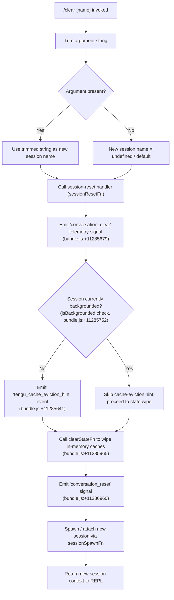

# `/clear`

> Analysis basis: CC v2.1.191 bundle.js (AST extraction + Claude interpretation)
> Minimum version: v2.1.191

---

## Overview

`/clear` starts a fresh conversation session with an empty context window, discarding the current in-memory message history while leaving the previous session file intact on disk so it can be resumed later with `/resume`. It is aliased as `/reset` and `/new`, accepts an optional session name argument, and is fully usable in non-interactive (scripted) environments.

---

## Registration

| Field | Value |
|---|---|
| type | `local` |
| name | `clear` |
| description | Start a new session with empty context; previous session stays on disk (resumable with /resume) |
| argumentHint | `[name]` |
| aliases | `reset`, `new` |
| supportsNonInteractive | `true` |
| thinClientDispatch | `post-text` |
| module_id | `OSl` |
| load_inline | `true` |
| loc_byte | 11287881 |
| loc_byte_end | 11288172 |
| loc_line | 6955 |
| arbor_handler.name | `Hcf` |
| arbor_handler.fqn | `claude-2.1.191::Hcf` |
| arbor_handler.kind | `AsyncFunction` |
| arbor_handler.resolution_path | `module_id` |
| arbor_handler.n_hits | 0 |

Analysis basis: CC v2.1.191 bundle.js:+11287881

---

## Input Branching

Four distinct paths exist based on: (a) whether an optional session name argument is provided, (b) whether the session is currently backgrounded, and (c) internal state reset outcomes. A Mermaid flowchart is used.



Analysis basis: CC v2.1.191 bundle.js:+11287707 (handler entry trim), +11285679 (conversation_clear literal), +11285752 (isBackgrounded literal), +11285641 (tengu_cache_eviction_hint), +11285965 (t.clear call), +11286960 (conversation_reset literal)

---

## Behavioral Spec

### 1. Argument Parsing

The handler (`Hcf`) trims the raw argument string before any further processing. If the result is non-empty it is treated as the desired name for the new session; otherwise the new session is unnamed.

```
function parseSessionName(rawArg):
    trimmed = rawArg.trim()
    return trimmed if trimmed != "" else null
```

Analysis basis: CC v2.1.191 bundle.js:+11287707

### 2. Message-History Compression (context summarisation before clear)

Before the in-memory history is wiped, the handler calls the context-summarisation path (`contextSummariseHelper`, mapped from `L6o`) that:

1. Slices the last up to **30** messages (number literal at bundle.js:+16668949).
2. Filters to only `"user"` and `"assistant"` roles (literals at bundle.js:+16668982, +16668999).
3. Truncates each text block to a maximum of **1 000** characters (literal at bundle.js:+16669144).
4. Renders `tool_result`, `text`, `tool_use` content types (literals at bundle.js:+16669266, +16669206, +16669676) with tool errors suffixed by `" (error)"` (literal at bundle.js:+16669486).
5. Joins the compressed segments and stores the result so it can be written to the on-disk session file before the in-memory state is cleared.

```
function buildCompressedHistory(messages):
    recent = messages.slice(-30)                  // bundle.js:+16668949
    filtered = recent.filter(m => m.role in {"user","assistant"})
    segments = []
    for msg in filtered:
        for block in msg.content:
            if block.type == "text":
                segments.push(block.text[:1000])
            elif block.type == "tool_result":
                label = block.isError ? " (error)" : ""
                segments.push("tool" + label + ": " + block.content[:300])
            elif block.type == "tool_use":
                segments.push("tool_use: " + block.name)
    return segments.join("\n")
```

Analysis basis: CC v2.1.191 bundle.js:+16668916 (gsm/contextSummariseHelper), +16668940, +16668949, +16669122, +16669206, +16669266, +16669446, +16669486, +16669651, +16669676, +16669769

### 3. In-Memory State Wipe

After the session file is written, `clearStateFn` (mapped from the `t.clear` call) flushes in-memory conversation state. The call graph shows numerous `.clear()` calls fanning out across subsystems:

```
function clearAllInMemoryState(appState):
    appState.messageHistory.clear()
    appState.abortControllers.clear()    // "abortController" literal, +11286301
    appState.runningTasks.clear()        // "running" literal, +11286173
    clearSkillIndexCache()               // s6 → e.clearSkillIndexCache, +13319529
    clearMcpSessionCache()              // Jqn path, +10728828
    clearContextTipCache()              // eGa → EGe.clear + ngo.clear, +8670060
    clearPromptCaches()                 // Vnl → Qmt.clear + mjt.clear, +9917588
    clearVteTe()                        // sTr → vTe.clear, +1154311
    clearAutonomousLoopState()          // xnf.resetAutonomousLoopDelivered, +10729328
    // ... (additional subsystem caches cleared in Zne fan-out)
```

Analysis basis: CC v2.1.191 bundle.js:+11285965 (t.clear), +11284496–+11284860 (wLo / clearStateFn fan-out), +13319529, +10728828, +8670060, +9917588, +1154311, +10729328

### 4. Session Name Assignment and New Session Initialisation

After the wipe, the optional session name (from step 1) is applied and a fresh session UUID is generated:

```
function initNewSession(name, appState):
    newUUID = crypto.randomUUID()            // MSl.randomUUID, +11286999
    appState.sessionId = newUUID
    if name != null:
        appState.sessionName = name
    emitConversationReset(appState)          // "conversation_reset" literal, +11286960
    spawnBackgroundWorker(appState)          // hVt fan-out to f / Fjo
```

Analysis basis: CC v2.1.191 bundle.js:+11286999 (MSl.randomUUID), +11286960 (conversation_reset)

### 5. Background-Worker Lifecycle on Clear

The call graph shows that `clearStateHelper` (`hVt`) also manages the lifecycle of background workers. On clear:

- Running background workers are asked to retire via `retireIfSettled` (multiple call sites in the `L` / `f` path).
- A fresh background worker may be spawned (`eq.spawn`, bundle.js:+17372296).
- The previous session's roster entry is preserved on disk for `/resume`.

```
function manageBackgroundWorkers(appState):
    for worker in appState.bgWorkers.values():
        worker.retireIfSettled()
    newWorker = spawnWorker(appState.sessionId)
    appState.bgWorkers.set(appState.sessionId, newWorker)
```

Analysis basis: CC v2.1.191 bundle.js:+17374938, +17375283, +17372296, +17378395 (t.rosterEntry)

### 6. Non-Interactive Mode

`supportsNonInteractive: true` means `/clear` may be invoked from a piped or scripted input stream. In this mode the `thinClientDispatch: "post-text"` value causes the response to be delivered as plain text rather than through the interactive REPL renderer.

Analysis basis: CC v2.1.191 bundle.js:+11287881 (registration object)

---

## State & Side Effects

| Item | Detail |
|---|---|
| Telemetry — `tengu_cache_eviction_hint` | Fired when clearing a non-backgrounded session (bundle.js:+11285641) |
| Literal — `"conversation_clear"` | Internal signal emitted at the start of the clear sequence (bundle.js:+11285679) |
| Literal — `"conversation_reset"` | Internal signal emitted after in-memory state wipe (bundle.js:+11286960) |
| Telemetry — `tengu_repl_hook_finished` | Hook-lifecycle event potentially emitted if hooks are registered (bundle.js:+13505385) |
| Telemetry — `tengu_shell_set_cwd` | Emitted when working-directory context is re-established for the new session (bundle.js:+7170746) |
| In-memory caches cleared | Message history, skill-index cache, MCP session cache, context-tip cache, prompt caches, vTe cache, autonomous-loop state, and others — see step 3 above |
| Disk state preserved | Previous session file remains on disk; roster entry is kept (`t.rosterEntry`, bundle.js:+17378395) |
| New session UUID | Generated via `crypto.randomUUID()` (bundle.js:+11286999) |
| Background workers | Existing workers asked to retire; a fresh worker may be spawned |
| Hook registration | Hook subsystem is re-initialised as part of the new session setup (`hVt` → `a8` path, bundle.js:+11287466) |
| appState changes | `sessionId` replaced; `messageHistory` cleared; all running-task and abort-controller sets emptied |
| Sound | No sound effects detected in depth-2 traversal |

---

## Version History

| Version | Change |
|---|---|
| v2.1.191 | Initial analysis |

---

## Common Mistakes

1. **Expecting the previous session to be gone** — `/clear` does *not* delete the on-disk session. Use `/resume` afterwards to return to it; the file is preserved intentionally.
2. **Confusion with aliases** — `/reset` and `/new` are exact aliases for `/clear`; they execute the identical handler (`Hcf`). There is no behavioural difference.
3. **Assuming the optional name argument is a file path** — the `[name]` argument sets the *display name* of the new session, not a filesystem path. It is trimmed but otherwise used as-is.
4. **Using `/clear` to switch models** — clearing the context does not change the active model or authentication. Those are separate concerns.
5. **Expecting an immediate terminal repaint in non-interactive mode** — with `thinClientDispatch: "post-text"` the command response is plain text; callers must not expect ANSI/interactive output.
6. **Backgrounded sessions and cache hints** — if the session is currently backgrounded, the `tengu_cache_eviction_hint` event is intentionally *skipped* (the `isBackgrounded` guard at bundle.js:+11285752). Do not treat its absence in logs as an error.

---

## Appendix — Identifier Mapping

> For bundle debugging only. Identifiers change across versions.

| Identifier | Role |
|---|---|
| `Hcf` | Main `/clear` command handler (AsyncFunction, Arbor-resolved) |
| `hVt` | Clear-state orchestrator; called by `Hcf`; fans out to all subsystem resets |
| `_Vt` | Session-option parser (parseInt / Number.isFinite guard for numeric args) |
| `v8e` | Session initialisation helper; sets up new session context post-clear |
| `qL` | Core REPL loop / agent runner invoked for the new session |
| `L6o` | Context-summarisation helper; compresses message history before wipe |
| `gsm` | Map setter used during context summarisation (`t.set`) |
| `msm` | Auto-classifier input builder (calls `toAutoClassifierInput`) |
| `wN` | API call orchestrator reached via the new session startup path |
| `oW` | HTTP client / request-builder called from `wN` |
| `Zne` | Subsystem-cache reset fan-out (MCP sessions, context tips, prompt caches, etc.) |
| `wLo` | In-memory state wipe fan-out (skill cache, MCP session cache, misc caches) |
| `Fjo` | Background-worker lifecycle manager (retire, spawn, roster entry write) |
| `Mjo` | Daemon-socket claim helper used during background worker handoff |
| `AC` | Agent-execution controller for new session |
| `mFt` | Model-and-flags setup helper called during new session initialisation |
| `a8` | Hook-subsystem initialiser called during new session startup |
| `Cs` | CLI error reporter (`cli_error` literal, `process.exit`) |
| `har` | Unicode surrogate-pair handler (`charCodeAt` / surrogate range checks) |
| `hx` | Surrogate character slicer used by `har` |
| `EF` | Cache-clear dispatcher (calls `kH` to clear `sZt` and `Zcr` maps) |
| `kH` | Low-level dual-map clear (`sZt.clear`, `Zcr.clear`) |
| `IR` | Skill-index cache invalidation (`e.clearSkillIndexCache`) |
| `Jqn` | MCP session state cleaner (deletes from `J6`, `iCo`, `VWt`, `e8e` maps) |
| `eGa` | Context-tip cache cleaner (`EGe.clear`, `ngo.clear`) |
| `Vnl` | Prompt-cache cleaner (`Qmt.clear`, `mjt.clear`) |
| `sTr` | vTe cache cleaner (`vTe.clear`) |
| `IHa` | Additional cache cleaner (`r2t.clear`, `Ero.clear`) |
| `qqn` | Mml cache cleaner (`Mml.clear`) |
| `our` | New session UUID emitter (`rfe.randomUUID`, emits to `lZt`) |
| `Hqo` | Session-start event emitter (`lZt.emit`) |
| `Q6` | Session-rename / log-setup helper called during new session init |
| `YSe` | Append-to-log helper (used for session log file during init) |
| `bH` | Telemetry flush helper (`Qtr`, `Xtr.delete`) |
| `nt` | Worker-pool task scheduler |
| `Le` | Logging helper (calls `fo`, `rt`, `Yi`, `Rmu`, `sXe.push`, `GQ.logError`) |
| `ke` | JSON-stringify wrapper |
| `rt` | String coercion helper |
| `T` | Header / option builder (used in HTTP layer) |
| `Fc` | Feature-flag evaluator |
| `vn` | Directory-normalisation helper |
| `jH` | Working-directory setter (emits `tengu_shell_set_cwd`) |
| `zAr` | AsyncLocalStorage getter for session context |
| `MH` | Path normaliser (`e.normalize`) |
| `tI` | MCP skill cleanup helper |
| `hL` | MCP worker task emitter |
| `xEe` | Symlink / log-directory setup for new session |
| `bFo` | Log directory creator (`Wre.mkdir`) |
| `Em` | Session log-path builder |
| `Qlt` | Session log-file initialiser (`cqe`, `wt`) |
| `o3i` | File-tracker reset (calls `by`, `Bi`, `Od`) |
| `Bi` | File-cache updater / cleaner (`$ee`, `tLe` maps) |
| `by` | File-cache entry deleter (`$ee.delete`) |
| `Od` | File-state getter/setter used during reset |
| `Mf` | File-watch helper (`Ife.has` check) |
| `ic` | File-path joiner (`Ay.join`) |
| `PSl` | Policy-settings loader (`_be`) |
| `yg` | Worker-state writer (`Fc`, log appender) |
| `gde` | Worktree-isolation latch writer |
| `PVn` | Worktree log appender (`fl.appendFile`, `fl.mkdir`) |
| `W6` | Worktree-state emitter (`NKn.emit`) |
| `ipr` | Safe-mode check helper (`e.has`) |
| `Gdl` | Worker-watch config writer (`wWt`) |
| `wWt` | Worker config applier (`hqn.get`, `CWt`) |
| `nJi` | i8 cache cleaner (`i8.clear`, then `W9e`) |
| `W9e` | Session-file writer (`uMn.writeFile`) |
| `L5` | M8t cache cleaner (`M8t.clear`) |
| `OVa` | v6n cache cleaner (`v6n.clear`) |
| `Ybr` | wXe cache cleaner (`wXe.clear`) |
| `eSa` | Ute / k0e cache cleaner |
| `DUt` | aL helper called during session start |
| `dbt` | ux / voe dual-call helper |
| `_Ya` | Internal state resetter (calls `e` path) |
| `oMe` | Additional state resetter (calls `e`, `t`) |
| `iy` | Eze / Object.values helper |
| `mCo` | Miscellaneous post-compact cleanup helper |
| `cbt` | Compact-related helper called during session reset |
| `lbt` | Compact cleanup finaliser |
| `J2e` | xD path normaliser called by `Zne` |
| `VWe` | wWt-based worker-watch re-registrar |
| `D_l` | Session-data loader called by `IR` |
| `Nzn` | Node event emitter helper |
| `s6` | Skill-index cache-clear orchestrator |
| `kSl` | Additional state-clear helper (no deeper calls in depth-2) |
| `El` | Unused/UI element helper reached via `hVt` |
| `AE` | Additional UI helper reached via `hVt` |
| `Sm` | Compact/summarisation helper reached via `hVt` |
| `Pu` | Probe/status helper reached via `hVt` |
| `ma` | Misc helper reached via `hVt` |
| `dP` | Display/print helper reached via `hVt` |
| `rI` | Reconnect/reinit helper called by `hVt` |
| `ict` | YTa-backed initialiser |
| `cva` | Session-value accessor |
| `tJ` | Fc-based toggle helper |
| `HVt` | Secondary Fc-based feature helper |
| `Iyo` | Renderer helper called during new session display |
| `xAt` | Abort-signal factory helper |
| `$9e` | Object-key enumeration helper reached via `hVt` |
| `dsm` | Misc session-data helper reached via `e` |
| `usm` | Session-update helper (calls `csm`) |
| `csm` | Message-map helper (`e.map`) |
| `hsm` | History-segment builder (`t.push`, `t.join`) |
| `M6n` | Model-finder helper (`e.find`) |
| `cSt` | Context-state helper (calls `W`, `Pe`) |
| `D6n` | Data-schema validator (`t.safeParse`) |