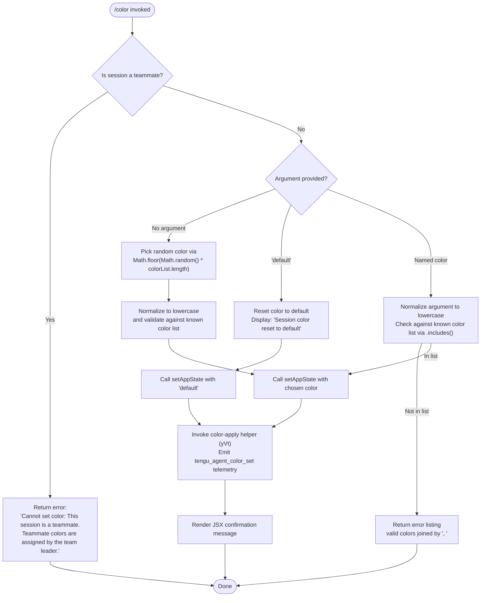

# `/color`

> Analysis basis: CC v2.1.191 bundle.js (AST extraction + Claude interpretation)
> Minimum version: v2.1.191

---

## Overview

The `/color` command allows the user to set or reset the prompt bar color for the current interactive session. It resolves a color name (or the special token `"default"`) against a known color list, validates teammate-session constraints, updates application state, and then renders a JSX confirmation message. The command takes effect immediately without requiring an agent turn.

---

## Registration

| Field | Value |
|---|---|
| type | `local-jsx` |
| name | `color` |
| description | `Set the prompt bar color for this session` |
| argumentHint | `null` |
| immediate | `true` |
| module_id | `$Sl` |
| load_inline | `true` |
| loc_byte | `11289763` |
| loc_byte_end | `11289980` |
| loc_line | `6955` |
| arbor_handler.name | `Ecf` |
| arbor_handler.fqn | `claude-2.1.191::Ecf` |
| arbor_handler.kind | `AsyncFunction` |
| arbor_handler.resolution_path | `module_id` |
| arbor_handler.n_hits | `0` |

Analysis basis: CC v2.1.191 bundle.js:+11289763

---

## Input Branching

Four distinct execution paths exist: teammate-session guard, random color selection, explicit color argument validation, and default/reset. A Mermaid flowchart is used.



Analysis basis: CC v2.1.191 bundle.js:+11288601

---

## Behavioral Spec

### Top-level handler (`Ecf`)

`Ecf` is the Arbor-resolved async handler for `/color`. It calls two functions in sequence: an argument-parser/validator (`k7n`) and a JSX renderer (`Scf`).

Analysis basis: CC v2.1.191 bundle.js:+11288532

```
async function colorCommandHandler(context):
    result = await validateAndApplyColor(context)
    return renderColorConfirmation(result)
```

---

### Teammate guard

The first check inside the argument-processor tests whether the current session is operating as a teammate agent. If it is, color assignment is blocked with a fixed error string.

```
function validateAndApplyColor(context):
    // Teammate check
    sessionRole = getSessionRole(context)
    if sessionRole == "teammate":
        return errorResult(
            "Cannot set color: This session is a teammate. " +
            "Teammate colors are assigned by the team leader."
        )
    // … continues below
```

Error literal: `"Cannot set color: This session is a teammate. Teammate colors are assigned by the team leader."` — Analysis basis: CC v2.1.191 bundle.js:+11288612

---

### Color resolution

After the teammate guard, the handler resolves which color to apply. The known color set is stored in two module-level arrays (`ycf` — the full color list, `wH` — display/valid names).

```
function resolveColor(rawArgument, colorList, displayList):
    if rawArgument is absent or empty:
        // Random selection
        index = Math.floor(Math.random() * colorList.length)
        chosenColor = colorList[index].toLowerCase()
        return { color: chosenColor, isRandom: true }

    normalized = rawArgument.toLowerCase()

    if normalized == "default":
        return { color: "default", isReset: true }

    if colorList.includes(normalized):
        return { color: normalized }
    else:
        validList = displayList.join(", ")
        return errorResult("Unknown color. Valid colors: " + validList)
```

- Random selection uses `Math.floor` + `Math.random`: Analysis basis: CC v2.1.191 bundle.js:+11288741 and :+11288752
- Lowercase normalization via `.toLowerCase()`: Analysis basis: CC v2.1.191 bundle.js:+11288778
- Membership check against full color array: Analysis basis: CC v2.1.191 bundle.js:+11288796
- Fallback error uses `wH.join(", ")` to enumerate valid colors: Analysis basis: CC v2.1.191 bundle.js:+11288842
- Join separator literal: `", "` — Analysis basis: CC v2.1.191 bundle.js:+11288850
- `"default"` special token literal: Analysis basis: CC v2.1.191 bundle.js:+11288940

---

### App state update

Once a color (or `"default"`) is resolved, the command writes it into the application state store using `t.setAppState`, then reads it back with `t.getAppState` to build the confirmation payload.

```
function applyColorToState(appContext, resolvedColor):
    appContext.setAppState({ promptBarColor: resolvedColor.color })
    currentState = appContext.getAppState()
    return currentState
```

- `t.setAppState` call: Analysis basis: CC v2.1.191 bundle.js:+11288982
- `t.getAppState` call: Analysis basis: CC v2.1.191 bundle.js:+11289025

---

### Agent-color propagation (`yVt`)

After the local state is updated, `yVt` is called to propagate the color to the daemon/agent layer. Internally it calls `DL` (agent display update), `YSe` (session event logging), and emits the `tengu_agent_color_set` telemetry event. The event key `"agent-color"` is used as the propagation topic.

```
async function propagateAgentColor(color, context):
    await updateAgentDisplay(color)          // DL
    await logSessionEvent("agent-color", color)   // YSe
    emitTelemetry("tengu_agent_color_set", { color })
    await registerWithDaemon(context)        // Fc / W
```

- `yVt` invocation: Analysis basis: CC v2.1.191 bundle.js:+11288971
- `"agent-color"` topic literal: Analysis basis: CC v2.1.191 bundle.js:+13376819
- `tengu_agent_color_set` telemetry emission: Analysis basis: CC v2.1.191 bundle.js:+13376903

---

### Color-name registry helpers (`x7n`)

`x7n` enumerates the keys of the internal color-map object using `Object.keys`. This produces the canonical list of color names used in the membership check and error message.

```
function getColorNames(colorMap):
    return Object.keys(colorMap)
```

Analysis basis: CC v2.1.191 bundle.js:+11288305

---

### Reset path

When the argument normalizes to `"default"`, the state is cleared and a fixed confirmation string is displayed.

```
function resetColor(appContext):
    appContext.setAppState({ promptBarColor: "default" })
    return confirmationMessage("Session color reset to default")
```

Reset confirmation literal: `"Session color reset to default"` — Analysis basis: CC v2.1.191 bundle.js:+11289201

---

### JSX renderer (`Scf`)

`Scf` constructs and returns the JSX element shown to the user after color application. It may branch on whether the result is a success or an error, resolving to the appropriate rendered component.

```
function renderColorConfirmation(result):
    if result.isError:
        return renderErrorComponent(result.message)   // vE path
    colorValue = result.color
    return renderSuccessComponent(colorValue)          // Kue / cDe / zue paths
```

- `Scf` entry: Analysis basis: CC v2.1.191 bundle.js:+11289192
- `vE` branch (error render): Analysis basis: CC v2.1.191 bundle.js:+11289285
- `Kue` branch (success render): Analysis basis: CC v2.1.191 bundle.js:+11289326
- `cDe` path: Analysis basis: CC v2.1.191 bundle.js:+11289362
- `zue` path: Analysis basis: CC v2.1.191 bundle.js:+11289432

---

### Store access helper (`pf` / `Lx`)

`pf` retrieves the current async-storage context; `Lx` calls `KPr.getStore()` internally. These are utility functions shared across multiple commands and are not color-specific.

```
function getContextStore():
    store = Lx()            // calls KPr.getStore()
    return store ?? defaultContext
```

- `pf` call: Analysis basis: CC v2.1.191 bundle.js:+11288601
- `Lx` → `KPr.getStore`: Analysis basis: CC v2.1.191 bundle.js:+2309468

---

### Config-file helpers (`KLn`, `lS`, `ppt`)

`KLn` manages reading and writing the per-session configuration that persists the color choice across daemon restarts. `lS` resolves the config file basename; `ppt` is a path-construction helper.

```
async function persistColorConfig(color, configDir):
    configPath = buildPath(configDir, getConfigBasename())  // lS, ppt
    await writeColorToConfig(configPath, color)             // KLn → Bi → Od → Rm
```

- `KLn` invocation: Analysis basis: CC v2.1.191 bundle.js:+11289130
- `lS` invocation: Analysis basis: CC v2.1.191 bundle.js:+11289134
- `ppt` invocation: Analysis basis: CC v2.1.191 bundle.js:+11289139

---

## State & Side Effects

| Item | Detail |
|---|---|
| Telemetry | `tengu_agent_color_set` (emitted on every successful color set, including random; loc_byte:+13376903) |
| Telemetry (transitive) | `tengu_daemon_config_reload` (+17386661), `tengu_feature_ok` (+1025725), `tengu_feature_bad` (+1025792), `tengu_daemon_control` (+17408260), `tengu_bg_state_read_transient` (+4282879), `tengu_api_success` (+8938998), `tengu_lone_surrogate_sanitized` (+8938694) — these are from shared subsystems traversed at depth 2 and are not color-specific |
| appState changes | `promptBarColor` key written via `t.setAppState` (+11288982); takes effect immediately for the current session's prompt bar rendering |
| Hook registration | `_i` calls `xqo.register` — this is a shared daemon hook registration invoked during color propagation via `YSe → Fc → _i` (+67562) |
| File I/O | `KLn` → `Bi` may read/write session config files (utf-8, max cache entries ~1000); uses atomic rename pattern via `Rm` → `xK.writeFile` + `xK.rename` |
| Sound | None detected |
| Teammate restriction | Blocked entirely; error message returned without any state mutation |

---

## Version History

| Version | Change |
|---|---|
| v2.1.191 | Initial analysis |

---

## Common Mistakes

1. **Passing a color name with mixed case** — the command normalizes input via `.toLowerCase()`, so `"Red"` and `"RED"` are both accepted, but the stored value will always be the lowercase canonical form.
2. **Using `/color` in a teammate session** — the command is blocked in teammate sessions. The error message is explicit, but users may not realize their session role until they attempt the command.
3. **Expecting the color to persist across completely new sessions** — color is stored per-session in app state and config. Starting a brand-new session without inheriting the config will reset to the default.
4. **Omitting the argument to get a specific color** — calling `/color` with no argument picks a **random** color, not an interactive picker. Users who want a specific color must name it explicitly.
5. **Misspelling a color name** — if the normalized argument is not in the known color list, the command returns an error listing valid options (joined by `", "`). There is no fuzzy matching.

---

## Appendix — Identifier Mapping

> For bundle debugging only. Identifiers change across versions.

| Identifier | Role |
|---|---|
| `Ecf` | Top-level async handler for `/color` command (Arbor-resolved) |
| `k7n` | Argument parser, teammate guard, color resolver, and state updater |
| `Scf` | JSX confirmation renderer (success and error branches) |
| `x7n` | Color-name registry enumerator (`Object.keys` on color map) |
| `yVt` | Agent-color propagation coordinator (daemon + telemetry) |
| `KLn` | Session config persistence manager |
| `lS` | Config file basename resolver |
| `ppt` | Config path constructor |
| `pf` | Async context store accessor |
| `Lx` | Inner store getter (`KPr.getStore` wrapper) |
| `DL` | Agent display update helper (called by `yVt`) |
| `GR` | Display render sub-helper (called by `DL`) |
| `Nf` | Output formatting helper (called by `DL`) |
| `YSe` | Session event logger (file append + mkdir, called by `yVt`) |
| `X3` | Session event record builder |
| `rt` | String coercion utility |
| `WFe` | Context/session accessor (reads `pf`, `Aw`, `dKu`) |
| `Fc` | Daemon hook registration trigger |
| `_i` | Registers hooks with `xqo.register` |
| `wt` | Terminal output renderer |
| `ux` | Low-level terminal write primitive |
| `A2` | Output color helper (calls `ux`) |
| `Hr` | Output style helper (calls `ux`) |
| `Mf` | Config entry validator/formatter |
| `Ae` | String coercion wrapper |
| `Le` | Logging/error sink (writes to `sXe`, `GQ.logError`) |
| `fo` | Error stringifier |
| `Yi` | Essential-traffic queue manager |
| `Rmu` | Queue shift/push coordinator |
| `ic` | Config directory path builder |
| `yR` | Config path join helper |
| `Bi` | Config file read/write/cache manager |
| `Od` | Config atomic write coordinator |
| `Rm` | Atomic file writer (randomBytes + writeFile + rename) |
| `by` | Config cache entry deleter |
| `vn` | No-op / sentinel helper (`dn` wrapper) |
| `Gd` | Debug log helper (`dn` wrapper) |
| `$t` | Safe JSON parser |
| `vE` | Error JSX component (rendered by `Scf` on failure) |
| `Kue` | Success JSX component (rendered by `Scf` on success) |
| `zue` | Alternate success JSX sub-component |
| `cDe` | Intermediate JSX layout component |
| `wN` | API request orchestrator (reached transitively; not color-specific) |
| `oW` | Main API call dispatcher (transitive) |
| `Ghn` | User-agent / header builder (transitive) |
| `fy` | Proxy auth helper (transitive) |
| `Kdn` | Proxy auth resolver (transitive) |
| `Iud` | Request-ID and content-type handler (transitive) |
| `PH` | Mantle transport layer (transitive) |
| `TZe` | WIF credentials resolver (transitive) |
| `ACe` | Provider credential accessor (transitive) |
| `SCe` | Request scheduler/timeout wrapper (transitive) |
| `Rdr` | Rate-limit/date utility (transitive) |
| `BSn` | Provider-mode selector (transitive) |
| `aje` | Model context / cache-control helper (transitive) |
| `etn` | Message object builder (transitive) |
| `u7e` | Message object mutator (transitive) |
| `Txe` | Tool-use block builder (transitive) |
| `L6o` | Conversation context compressor (transitive) |
| `msm` | Auto-classifier input builder (transitive) |
| `gsm` | Context map setter (transitive) |
| `har` | Token/char-split helper (transitive) |
| `hx` | Unicode surrogate splitter (transitive) |
| `S4` | Side-query / context-tip orchestrator (transitive) |
| `e` | Inner async pipeline runner (handler body, reached from `Ecf`) |
| `D` | Stream-write / file-monitor handler (transitive) |
| `L` | Background-worker sweep loop (transitive) |
| `Bi` | (see above — config file cache manager) |
| `s5e` | MCP server connection setup (transitive) |
| `Gar` | MCP connection result applicator (transitive) |
| `hGo` | MCP remote-server orchestrator (transitive) |
| `w_a` | MCP Fro initializer (transitive) |
| `dn` | No-op / null sentinel |
| `W` | Shared async utility / promise coordinator |
| `wt` | (see above — terminal renderer) |