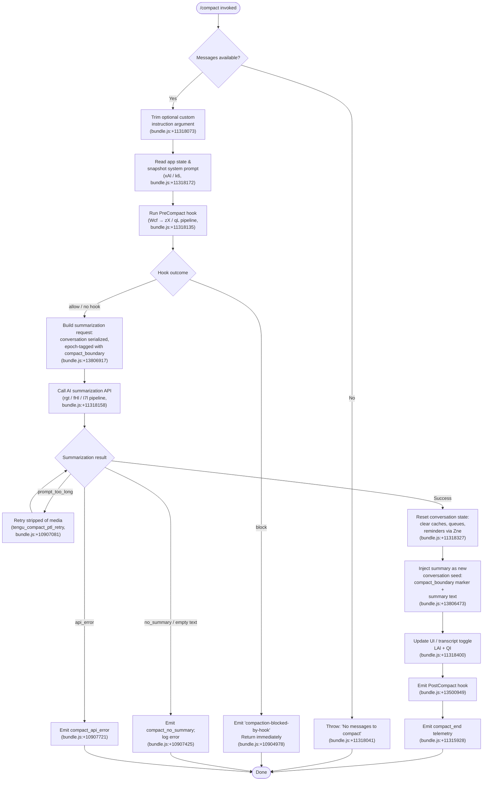

# `/compact`

> Analysis basis: CC v2.1.191 bundle.js (AST extraction + Claude interpretation)
> Minimum version: v2.1.191

---

## Overview

The `/compact` command summarizes the current conversation history and replaces it with a condensed representation, freeing up context-window tokens. It invokes a multi-phase pipeline: optional `PreCompact` hook execution, system-prompt snapshot collection, an AI-driven summarization request, a post-compact state reset, and a `PostCompact` hook notification. An optional custom summarization instruction may be passed as an argument to guide the summary style.

---

## Registration

| Field | Value |
|---|---|
| type | `local` |
| name | `compact` |
| description | `Free up context by summarizing the conversation so far` |
| argumentHint | `<optional custom summarization instructions>` |
| supportsNonInteractive | `true` |
| thinClientDispatch | `post-text` |
| module_id | `RAl` |
| load_inline | `true` |
| loc_byte | `11319042` |
| loc_byte_end | `11319342` |
| loc_line | `7043` |
| arbor_handler.name | `jcf` |
| arbor_handler.fqn | `claude-2.1.191::jcf` |
| arbor_handler.kind | `AsyncFunction` |
| arbor_handler.resolution_path | `module_id` |
| arbor_handler.n_hits | `0` |

Analysis basis: CC v2.1.191 bundle.js:+11319042

---

## Input Branching

The handler exhibits 4+ distinct branches based on message availability, hook outcome, summarization success/failure, and error category. A Mermaid flowchart is required.



---

## Behavioral Spec

### 1. Guard — Message Availability Check

```
async function compactCommandHandler(context, rawArgument):
    if context.messages is empty:
        throw Error("No messages to compact")   // bundle.js:+11318041
    customInstructions = rawArgument.trim()     // bundle.js:+11318073
```

Analysis basis: CC v2.1.191 bundle.js:+11318035

---

### 2. App-State Snapshot

```
function snapshotAppState(context):
    appState   = context.getAppState()          // bundle.js:+11317497
    systemPrompt = context.getSystemPrompt()    // bundle.js:+8751946
    workerList = Array.from(currentWorkers)     // bundle.js:+11317564
    return { appState, systemPrompt, workerList }
```

The implementation collects the full system prompt, any running worker handles, and active flag-settings from `appState`. It uses helpers `Ur` (last-message finder) and `AB` (state normalizer).

Analysis basis: CC v2.1.191 bundle.js:+11318172

---

### 3. PreCompact Hook Execution

```
async function runPreCompactHooks(context, snapshot):
    startTime = performance.now()              // bundle.js:+11314099
    hookPayload = buildPreCompactPayload(snapshot)
    results = await Promise.all(
        enumerateHooks("PreCompact")           // bundle.js:+13467176
            .map(hook => executeHook(hook, hookPayload))
    )
    for result in results:
        if result.decision == "block":
            emitStatus("compaction-blocked-by-hook")  // bundle.js:+10904978
            notify("compaction blocked by PreCompact hook")
            return BLOCKED
    return ALLOWED
```

The hook runner (`zX → qL`) supports command, prompt, agent, HTTP, and MCP tool hook types. A hook returning a block decision (exit code non-zero or explicit block field) prevents compaction and produces a warning-level system notification (literal `"warning"` at bundle.js:+10905079).

Analysis basis: CC v2.1.191 bundle.js:+11314163

---

### 4. Conversation Serialization

The serialization helper (`L6o`, called from `e` at bundle.js:+16670698) converts the in-memory message list to a flat text representation subject to the following constraints:

- Messages of role `"user"` and `"assistant"` are included (bundle.js:+16668982, +16668999).
- `tool_result`, `tool_use`, and `tool` blocks are each truncated to a maximum of **1 000 characters** (bundle.js:+16669144).
- Content blocks of type `"text"` are included verbatim (bundle.js:+16669206).
- A sliding window of the **most recent 30 messages** is kept when the total exceeds limits (bundle.js:+16668949).
- `tool_use` blocks are padded to **300 characters** minimum with spaces (bundle.js:+16669651) using `padEnd` (bundle.js:+17397141).

The resulting text is joined and tagged with the special `"compact_boundary"` system marker (bundle.js:+13806917) so the post-compact injected summary can be identified.

Analysis basis: CC v2.1.191 bundle.js:+16670698

---

### 5. Summarization Request

```
async function requestSummary(serializedHistory, customInstructions, snapshot):
    systemPrompt = "You are a helpful AI assistant tasked with summarizing conversations."
                   // bundle.js:+10919583
    messages = buildSummarizationMessages(serializedHistory, customInstructions)
    
    attemptCount = 0
    loop:
        response = await callAPI(systemPrompt, messages, model=compactionModel)
        if response.error == "prompt_too_long":
            if attemptCount == 0:
                emit("tengu_compact_ptl_retry")  // bundle.js:+10907081
                messages = stripMediaBlocks(messages)
                attemptCount++
                continue
            else:
                emit("compact_prompt_too_long")  // bundle.js:+10907041
                return FAILURE("prompt_too_long")
        if response.summaryText is empty:
            emit("compact_no_summary")           // bundle.js:+10907425
            return FAILURE("no_summary")
        if response.apiError:
            emit("compact_api_error")            // bundle.js:+10907721
            return FAILURE("api_error")
        return SUCCESS(response.summaryText)
```

The system prompt used for summarization (bundle.js:+10919583) is an internal constant separate from the user's active system prompt. Tool-use is explicitly blocked during compaction: any tool request from the summarizer yields a deny with message "Tool use is not allowed during compaction" (bundle.js:+10916701).

The compaction agent is identified by the literal `"compact_reactive"` or `"compact_full"` depending on trigger path (bundle.js:+10908180).

Analysis basis: CC v2.1.191 bundle.js:+11318158

---

### 6. Model Selection & Fallback

```
function selectCompactionModel(context):
    if context.isModelFable5Only():
        emit("compact_no_allowed_fallback")     // bundle.js:+10919152
        // Error: "Compaction unavailable: your model policy only allows Fable 5…"
        // bundle.js:+10919195
        return null
    if primaryModel is blocked:
        substituteModel = findAllowedFallback()
        emit("compact_substituted")             // bundle.js:+10919345
        return substituteModel
    return primaryModel
```

Analysis basis: CC v2.1.191 bundle.js:+10919130

---

### 7. Post-Compact State Reset

```
async function resetAfterCompact(context, summaryText):
    // Clear pending items
    clearPrecomputedCompact()     // Jqn, bundle.js:+10729195
    clearMemoryCache()            // IHa, bundle.js:+10729296
    clearInMemoryFileLookup()     // _Ya / oMe, bundle.js:+10729302
    resetAutonomousLoopDelivered()// bundle.js:+10729328
    resetOutputTokenCounter()     // iy, bundle.js:+10729378

    // Inject summary as new conversation seed
    newMessages = [
        { role: "system",    type: "compact_boundary",
          content: "<summary>" + summaryText + "</summary>" }
        // bundle.js:+13806917, +5348230
    ]
    context.setMessages(newMessages)
    setState(B9e, "compact_end")   // bundle.js:+11315928
```

The `<summary>` XML tag (bundle.js:+5348230) wraps the generated text. The `compact_boundary` system block (bundle.js:+13806917) serves as a sentinel that downstream code uses to identify where summarization occurred.

Analysis basis: CC v2.1.191 bundle.js:+11318327

---

### 8. UI Update

```
function updateUIAfterCompact(context, summaryText, messageCount):
    registerKeybinding("app:toggleTranscript", "ctrl+o", scope="Global")
                                             // bundle.js:+11317302
    displayMessage = "Compacted " + messageCount + " messages"
                                             // bundle.js:+11317441
    context.displaySystemMessage(displayMessage)
    context.setStatus("Conversation compacted") // bundle.js:+13806473
```

Analysis basis: CC v2.1.191 bundle.js:+11318400

---

### 9. PostCompact Hook Notification

After the state reset, the runner emits a `PostCompact` hook event (bundle.js:+13500949) to all registered hooks. This is fire-and-notify; hook failures do not roll back the compaction.

Analysis basis: CC v2.1.191 bundle.js:+11318135 (Wcf pipeline)

---

### 10. Reactive (Automatic) Compaction Sub-Path

When context usage reaches the threshold, automatic compaction runs through the same core pipeline but is identified by the literal `"reactive_compact"` (bundle.js:+10737254) and emits `tengu_reactive_compact_attempt` (bundle.js:+5366320). Reactive compaction additionally checks:

- Minimum of **2 compactable groups** required (literal `"too_few_groups"`, bundle.js:+5365601).
- At least one assistant message in the summarize set (bundle.js:+5366075).
- Media-size errors trigger a stripped retry (bundle.js:+5367202); if stripping is impossible, `"media_unstrippable"` is recorded (bundle.js:+5367317).

Success emits `tengu_reactive_compact_succeeded` (bundle.js:+10735704); failure emits `tengu_reactive_compact_failed` (bundle.js:+10733235).

Analysis basis: CC v2.1.191 bundle.js:+10737254

---

## State & Side Effects

| Item | Detail |
|---|---|
| Telemetry — compact lifecycle | `tengu_compact` (bundle.js:+10909019), `tengu_compact_failed` (bundle.js:+10920920) |
| Telemetry — reactive | `tengu_reactive_compact_attempt` (+5366320), `tengu_reactive_compact_succeeded` (+10735704), `tengu_reactive_compact_failed` (+10733235) |
| Telemetry — hook | `tengu_run_hook` (+13521650), `tengu_hook_plugin_metrics` (+13499723) |
| Telemetry — cache sharing | `tengu_compact_cache_prefix` (+10906605), `tengu_compact_cache_sharing_success` (+10917645), `tengu_compact_cache_sharing_fallback` (+10918275) |
| Telemetry — prompt-too-long retry | `tengu_compact_ptl_retry` (+10907081) |
| Telemetry — precomputed compact | `tengu_precomputed_compact_consumed` (+10727794), `tengu_precomputed_compact_discarded` (+10728433) |
| Telemetry — model fallback | `tengu_model_fallback_triggered` (+10921260) |
| Telemetry — post-compact file restore | `tengu_post_compact_file_restore_success` (+10922173), `tengu_post_compact_file_restore_error` (+10922215) |
| Telemetry — context tip classifier | `tengu_context_tip_classifier_outcome` (+16672225) |
| Hook registration | Fires `PreCompact` hook before summarization; fires `PostCompact` hook after reset |
| appState changes | Conversation messages replaced with a single `compact_boundary` system block + summary; in-memory file cache cleared; autonomous loop counter reset; pre-computed compact cache invalidated |
| UI side effect | System message "Compacted N messages" displayed; `ctrl+o` keybinding registered for transcript toggle |
| Sound | <!-- TODO: not found in depth-2 traversal; needs --depth 4 --> |

---

## Version History

| Version | Change |
|---|---|
| v2.1.191 | Initial analysis |

---

## Common Mistakes

1. **Invoking `/compact` on an empty session.** The command throws immediately with "No messages to compact" (bundle.js:+11318041) if there are no conversation messages. Start a conversation before compacting.
2. **Expecting tool use during compaction.** The summarization agent explicitly denies tool calls with "Tool use is not allowed during compaction" (bundle.js:+10916701). Custom hooks that expect tool execution will not run during the summarization turn.
3. **Assuming PreCompact hooks cannot block.** A hook returning a block decision silently prevents compaction and produces only a warning notification (bundle.js:+10905079). Check hook exit codes if compaction appears to do nothing.
4. **Passing very long custom instructions.** Custom instructions are appended to the summarization request; extremely long arguments may contribute to a `prompt_too_long` condition, triggering a media-stripped retry (bundle.js:+10907081).
5. **Expecting `/compact` to work when model policy is Fable 5 only.** In that configuration, compaction is entirely blocked and reports "Compaction unavailable: your model policy only allows Fable 5…" (bundle.js:+10919195).

---

## Appendix — Identifier Mapping

> For bundle debugging only. Identifiers change across versions.

| Identifier | Role |
|---|---|
| `jcf` | Main `/compact` command handler (AsyncFunction) |
| `GH` | Conversation message-list accessor |
| `y7n` | Message count helper |
| `GA` | Message count sub-utility |
| `L6o` | Conversation serializer (converts messages to summarization text) |
| `gsm` | Serializer token-set helper |
| `har` | Serializer tool-block handler |
| `msm` | Auto-classifier input builder |
| `wN` | Core API request / side-query executor |
| `xf` | API request builder (main thread path) |
| `oW` | HTTP client / OAuth token layer |
| `b2e` | Model compatibility checker |
| `lie` | Locale / response-format helper |
| `CBp` | Cache-key finder |
| `SHo` | SHA-256 hasher for cache keys |
| `Ghn` | First-party auth helper |
| `aIn` | Token refresh utility |
| `aje` | Thread-label / agent-type resolver |
| `wD` | Worker dispatch helper |
| `ZVa` | Model map builder |
| `sp` | String sanitizer / replacer |
| `XSn` | Side-query temperature setter |
| `av` | Tool-array mapper |
| `Txe` | Tool schema builder |
| `etn` | Message content mutator |
| `iD` | Structured-clone wrapper |
| `u7e` | Message content pop/push helper |
| `Ve` | Render/display helper |
| `LOr` | Log/response-parser helper |
| `wOr` | Cache-hit tracker |
| `mbe` | Metrics batch emitter |
| `Tr` | Telemetry reporter |
| `Oo` | Output observer / token counter |
| `H1t` | Hint-display helper |
| `NF` | Notification formatter |
| `S4` | Event emitter wrapper |
| `PPr` | Post-processing reducer |
| `usm` | User-side message assembler |
| `csm` | Content-block stream mapper |
| `hsm` | Header-string builder |
| `M6n` | Model-for-context finder |
| `T` | Tool-call normalizer |
| `wNc` | Tool dispatcher |
| `ke` | JSON serializer shim |
| `Dc` | Display content formatter |
| `a7e` | String S7o adapter |
| `kNc` | File-read/memory-load helper |
| `cSt` | State transition manager |
| `Pe` | Performance metric emitter |
| `Re` | Result emitter |
| `D6n` | Schema-safe-parse wrapper |
| `we` | Warning emitter |
| `Ae` | String coercion helper |
| `eY` | Session/context initializer |
| `xr` | Cross-request state accessor |
| `$Ut` | Turn-tracker utility |
| `nt` | Notification dispatcher |
| `IDt` | Immediate-delivery tracker |
| `CDt` | Conditional-delivery tracker |
| `B4` | Batch emitter helper |
| `RTn` | Round-trip notification tracker |
| `kt` | Key-time recorder |
| `ao` | Auth orchestrator |
| `PQe` | Permission query engine |
| `Rr` | Response renderer |
| `vj` | Settings loader (loadSettingsFromDisk) |
| `l_` | Locale normalizer |
| `ubt` | URL builder/truncator |
| `Wcf` | Compact pipeline coordinator |
| `JT` | Job/task tracker |
| `ysf` | System-prompt fetcher |
| `KLe` | KV-store loader |
| `dzn` | Diagnostic zone formatter |
| `zX` | Hook execution runner |
| `md` | Message dispatcher |
| `wt` | Write-text helper |
| `xO` | Output extractor |
| `VI` | Version inspector |
| `kD` | Key dispatcher |
| `DL` | Display-line helper |
| `Dt` | Diagnostic tracker |
| `qL` | Query lifecycle manager |
| `TB` | Tool-block builder |
| `JSe` | Job-state enqueuer |
| `NFo` | Named-function orchestrator |
| `Azl` | Append-zero-length helper |
| `OFo` | Output filter orchestrator |
| `Izl` | Invocation-zero-length helper |
| `Gn` | Generic notifier |
| `Le` | Log emitter |
| `aUe` | Async update emitter |
| `EM` | Event manager (abort/timeout) |
| `gpe` | Gate/permission evaluator |
| `iO` | I/O orchestrator |
| `lnr` | Loop-notify router |
| `kFo` | Key-function orchestrator |
| `dnr` | Data normalizer router |
| `cde` | Command-data extractor |
| `RFo` | Remote-function orchestrator (HTTP hooks) |
| `Szl` | Schema-zero-length validator |
| `xSe` | Cross-session extractor |
| `pnr` | Process-notify router (spawn hooks) |
| `g5e` | Gate-5 evaluator |
| `$B` | State broadcaster |
| `s5e` | Server-state-5 evaluator |
| `Gar` | MCP apply-update handler |
| `w_a` | Worker adopt helper |
| `hGo` | Hook-group orchestrator |
| `xAl` | App-state loader / system-prompt snapshoter |
| `$R` | System-prompt builder |
| `e$o` | Environment-state object |
| `Dzn` | Diagnostic zone notifier |
| `fve` | Feature-variant evaluator |
| `J$f` | Job-state-file helper |
| `Q$f` | Query-state-file helper |
| `Z$f` | Zone-state-file helper |
| `qSn` | Query-start notifier |
| `Gj` | Gateway-junction router |
| `uvi` | User-variable inspector |
| `FZ` | Flag-zone evaluator |
| `o$o` | Output-state object |
| `x2f` | Cross-2-file helper |
| `oV` | Output validator |
| `f2f` | File-to-file router |
| `oPt` | Options/permissions transformer |
| `A2f` | Append-2-file helper |
| `S2f` | State-2-file helper |
| `s2f` | Status-2-file helper |
| `i2f` | Index-2-file helper |
| `T2f` | Telemetry-2-file helper |
| `Ejn` | Emit-join notifier |
| `C2f` | Cache-2-file helper |
| `L2f` | Log-2-file helper |
| `h2f` | Header-2-file helper |
| `r2f` | Record-2-file helper |
| `o2f` | Output-2-file helper |
| `uil` | User-interaction logger |
| `g2f` | Gate-2-file helper |
| `a2f` | Append-2-flag helper |
| `l2f` | List-2-file helper |
| `c2f` | Cache-2-filter helper |
| `u2f` | Update-2-file helper |
| `d2f` | Diff-2-file helper |
| `m2f` | Map-2-file helper |
| `Vwi` | Variant-widget integrator |
| `mve` | Model-variant evaluator |
| `Gzl` | Gate-zero-length helper |
| `Ur` | Last-message finder / state reader |
| `zKn` | Zone-key notifier |
| `YKn` | Yield-key notifier |
| `AB` | State normalizer |
| `k6` | Worker-key mapper (main-thread) |
| `Rc` | Rate-cap inspector |
| `Lv` | Log verbosity helper |
| `io` | I/O initializer (worker spawn) |
| `Xg` | Cross-gate evaluator |
| `ZKn` | Zone-key mapper |
| `yvo` | Yield-value observer |
| `Vcf` | Variant compact filter |
| `uCo` | Update-context observer |
| `qWt` | Query-wait tracker |
| `nht` | Notification handler tracker |
| `zqn` | Zone-query notifier |
| `lH` | Log-header helper |
| `pCo` | Partial-context observer |
| `Xqn` | Cross-query notifier |
| `eKn` | Event-key notifier (main agentic loop) |
| `J2e` | Job-2-event helper |
| `xD` | Cross-dispatch helper |
| `fS` | File-state helper |
| `H7i` | Header-7-inspector |
| `pte` | Post-turn evaluator |
| `kUt` | Key-update transformer |
| `$9e` | State-9-evaluator |
| `cY` | Cache-yield helper |
| `zXi` | Zone-cross inspector |
| `lFt` | Log-filter transformer |
| `dMn` | Data-mutation notifier |
| `W9e` | Write-9-evaluator |
| `bze` | Byte-zero evaluator |
| `oht` | Output-header transformer |
| `Fc` | File-cache manager |
| `KWt` | Key-wait tracker |
| `qX` | Query executor (main turn loop) |
| `usf` | User-state filter |
| `csf` | Cache-state filter |
| `Rnf` | Round-notify filter |
| `nKn` | Node-key notifier |
| `iKn` | Index-key notifier |
| `rKn` | Record-key notifier |
| `sKn` | State-key notifier |
| `oKn` | Output-key notifier |
| `gEe` | Gate-event evaluator |
| `iDe` | Index-data extractor |
| `t8e` | Turn-8-evaluator |
| `ti` | Turn initializer |
| `a8` | Append-8 helper |
| `aDe` | Append-data extractor |
| `_Co` | Underscore-context observer |
| `m8e` | Map-8-evaluator |
| `fEe` | File-event evaluator |
| `sMn` | State-map notifier |
| `oMn` | Output-map notifier |
| `lL` | Low-level logger |
| `mf` | Metric formatter |
| `HWd` | Header-write descriptor |
| `mR` | Model resolver |
| `Km` | Key mapper (app-state getter) |
| `HCo` | Header-context observer (agent sub-loop) |
| `IMn` | Index-map notifier (reactive compact) |
| `hFt` | Header-filter transformer |
| `IJi` | Index-join inspector |
| `f` | Worker process instance |
| `E8d` | Event-8-dispatcher |
| `m` | Worker map |
| `S8d` | State-8-dispatcher |
| `VUt` | Version-update transformer |
| `jUt` | Job-update transformer |
| `c3` | Content-3 scrubber |
| `g8d` | Gate-8-dispatcher |
| `l8d` | Log-8-dispatcher |
| `u8d` | Update-8-dispatcher |
| `o8d` | Output-8-dispatcher |
| `e8d` | Event-8-dispatcher |
| `QWd` | Query-write descriptor |
| `p8d` | Path-8-dispatcher |
| `d8d` | Data-8-dispatcher |
| `m8d` | Map-8-dispatcher |
| `m7i` | Map-7-inspector |
| `Lt` | Log transformer |
| `Zne` | Zone notifier / post-compact state reset |
| `Jqn` | Job-query notifier (pre-computed compact clear) |
| `DUt` | Data-update transformer |
| `aL` | Append-log helper |
| `lbt` | Log-batch tracker |
| `dbt` | Data-batch tracker |
| `ux` | Universal cross-helper |
| `voe` | Value-observer emitter |
| `qqn` | Queue-query notifier |
| `IHa` | Index-header accessor (memory cache clear) |
| `_Ya` | Underscore-yield accessor |
| `oMe` | Output-memory evaluator |
| `iy` | Index-yield (output token counter reset) |
| `mCo` | Map-context observer |
| `B9e` | Batch-9-evaluator (setState) |
| `LAl` | Log-append logger (UI update) |
| `Sje` | State-job emitter |
| `M3p` | Map-3-path helper |
| `QI` | Query inspector (keybinding) |
| `pwn` | Path-write notifier |
| `fwn` | File-write notifier |
| `uLe` | Update-log evaluator (OTEL metrics) |
| `eu` | Event updater (OTEL emitter) |
| `x3e` | Cross-3-evaluator |
| `pbt` | Path-batch tracker |
| `Zur` | Zone-update router |
| `edr` | Event-data recorder |
| `rgt` | Reactive/full compact main executor |
| `c2t` | Cache-2-tracker (OTEL tracing) |
| `ece` | Event-cache evaluator |
| `yP` | Yield-path helper |
| `ZF` | Zone-flag helper |
| `Nit` | Node-index tracker |
| `TMn` | Token-map notifier |
| `Dn` | Data notifier (UUID generator) |
| `y` | Yield evaluator |
| `PGe` | Path-gate evaluator |
| `fHl` | Full-compact handler (core summarization loop) |
| `Jcl` | Job-cache logger |
| `uWt` | Update-wait tracker |
| `Xcl` | Cross-cache logger |
| `rt` | Runtime tracker |
| `qx` | Query executor (turn-level) |
| `Hjn` | Header-join notifier |
| `_jn` | Underscore-join notifier |
| `sD` | Status dispatcher |
| `Mue` | Map-update evaluator |
| `$6` | State-6 manager |
| `O0` | Output-zero helper |
| `ije` | Index-job evaluator |
| `nre` | Node-result evaluator |
| `XKn` | Cross-key notifier |
| `BVa` | Batch-variant accessor |
| `Aue` | Append-update evaluator |
| `kof` | Key-output filter |
| `rZr` | Round-zero reducer |
| `CMn` | Content-map notifier |
| `mCe` | Map-cache evaluator |
| `zHe` | Zone-header evaluator (max-output-tokens) |
| `pve` | Path-value evaluator |
| `xle` | Cross-log evaluator (token parser) |
| `Kx` | Key-cross evaluator |
| `bMn` | Batch-map notifier |
| `AMn` | Append-map notifier |
| `I` | Index state |
| `k` | Key state |
| `A` | Append state |
| `$of` | State-output-filter |
| `gQ` | Gate-query helper |
| `I8t` | Index-8-tracker |
| `dbe` | Data-batch evaluator |
| `V7` | Version-7 inspector |
| `YMe` | Yield-map evaluator |
| `uUt` | Update-util transformer |
| `dsf` | Data-state filter |
| `nZr` | Node-zero reducer |
| `Nof` | Node-output filter |
| `Uof` | Update-output filter |
| `Fof` | File-output filter |
| `T8t` | Token-8-tracker |
| `_vo` | Underscore-value observer |
| `lHl` | Log-header logger |
| `Cit` | Context-index tracker |
| `fA` | File accessor |
| `I7i` | Index-7-inspector |
| `KUt` | Key-update transformer |
| `fXi` | File-cross inspector |
| `Zme` | Zone-map evaluator |
| `rH` | Record header |
| `c_` | Cache underscore |
| `$w` | State-write helper |
| `JU` | Job updater |
| `Na` | Node accessor |
| `H` | Header process handler |
| `yp` | Yield-path helper |
| `Opm` | Output-path manager (daemon/PTY protocol) |
| `mgt` | Map-gate tracker |
| `kvo` | Key-value observer |
| `I7l` | Index-7-logger (main agent query loop) |
| `C6n` | Context-6-notifier |
| `kx` | Key-cross evaluator |
| `px` | Path-cross helper |
| `Pm` | Path mapper |
| `lh` | Log header |
| `bp` | Batch processor |
| `IFe` | Index-file evaluator |
| `whn` | Write-header notifier |
| `Qme` | Query-map evaluator |
| `pz` | Path-zone helper |
| `l8` | Log-8 helper |
| `uHl` | Update-header logger |
| `Uit` | Update-index tracker |
| `Sit` | State-index tracker |
| `t_e` | Token-underscore evaluator |
| `tFt` | Token-file transformer |
| `tN` | Token notifier |
| `P` | Process state |
| `fFl` | File-flag logger |
| `WU` | Write updater |
| `Sc` | State checker |
| `x` | Cross state |
| `eR` | Event recorder |
| `v` | Value state |
| `rge` | Record-gate evaluator |
| `Nf` | Node formatter |
| `A2` | Append-2 helper |
| `Hr` | Header recorder |
| `vv` | Value validator |
| `K9` | Key-9 helper |
| `ol` | Output logger |
| `fUt` | File-update transformer |
| `HFt` | Header-file transformer |
| `y8d` | Yield-8-dispatcher |
| `nY` | Node-yield helper |
| `dte` | Data-token evaluator |
| `pHl` | Path-header logger |
| `ZT` | Zone tracker |
| `fx` | File-cross helper |
| `N8d` | Node-8-dispatcher |
| `a2t` | Append-2-tracker |
| `q4e` | Query-4-evaluator (setStatus) |
| `Avo` | Append-value observer |