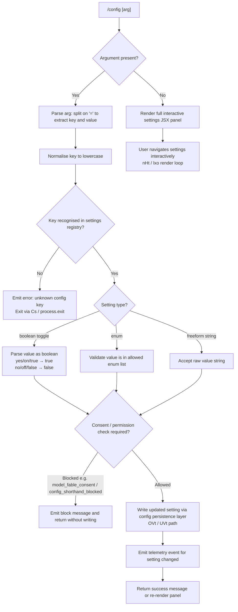

# `/config`

> Analysis basis: CC v2.1.191 bundle.js (AST extraction + Claude interpretation)
> Minimum version: v2.1.191

---

## Overview

The `/config` command (also aliased as `/settings`) opens an interactive settings panel rendered as a JSX UI component. It accepts an optional `key=value` argument to set a specific configuration value directly from the command line, or with no argument it renders the full interactive settings panel. When a `key=value` shorthand is provided, the handler normalises the key, validates the requested setting, and applies the change to the appropriate config layer (user, project, or local settings).

---

## Registration

| Field | Value |
|---|---|
| type | `local-jsx` |
| name | `config` |
| description | `Open settings` |
| argumentHint | `[key=value]` |
| aliases | `["settings"]` |
| module_id | `PIl` |
| load_inline | `true` |
| loc_byte | `11554802` |
| loc_byte_end | `11555080` |
| loc_line | `7137` |
| arbor_handler.name | `Lff` |
| arbor_handler.fqn | `claude-2.1.191::Lff` |
| arbor_handler.kind | `AsyncFunction` |
| arbor_handler.resolution_path | `module_id` |
| arbor_handler.n_hits | `0` |

Analysis basis: CC v2.1.191 bundle.js:+11554802

---

## Input Branching

The handler has more than three distinct branches depending on whether arguments are present, whether a known key is matched, whether the key refers to a toggle vs. an enum vs. a freeform value, and whether the user has the necessary permissions or consent for a given setting. A Mermaid flowchart is used below.



Analysis basis: CC v2.1.191 bundle.js:+11553874, +11553935, +11553954, +11554064, +11554106

---

## Behavioral Spec

### 1. Handler Entry — Argument Parsing

The main handler (`Lff`, an `AsyncFunction`) is entered when the command is invoked.

```
async function configCommandHandler(userArgString, context):
    renderJsxComponent(configUiModule)          # always mount the JSX panel
    normalised = userArgString.toLowerCase()    # bundle.js:+11553935

    if normalised is not in knownSettingKeys     # bundle.js:+11553954
       and normalised is not in shorthandKeys:   # bundle.js:+11553970
        reportError(normalised)                  # Cs path → nqe, then process.exit(1)
        return

    applyConfigShorthand(normalised, context)    # e path → OVt / UVt
```

Analysis basis: CC v2.1.191 bundle.js:+11553874, +11553935, +11553954, +11553970, +11553987

---

### 2. Error Reporting Path

When a key is unrecognised, the error reporter (`Cs`) formats a red-coloured error message and terminates the process.

```
function reportConfigError(key):
    message = formatRed("cli_error: unknown config key: " + key)  # nqe + St.red
    console.error(message)                                          # bundle.js:+13196517
    writeErrorLog(message)                                          # fT → $oe.writeFileSync
    process.exit(1)                                                 # bundle.js:+13196585
```

Analysis basis: CC v2.1.191 bundle.js:+13196562, +13196517, +13196531, +13196585

---

### 3. Shorthand Key Application (`OVt`)

`OVt` is the function that interprets a `key=value` string and routes it to the appropriate config writer.

```
function applyConfigShorthand(rawArg, context):
    rawArg = rawArg.trim()                          # bundle.js:+11355327
    if '=' not in rawArg:
        # treat as key-only shorthand (toggle)
        key   = rawArg
        value = null
    else:
        idx   = rawArg.indexOf('=')                 # bundle.js:+11355434
        key   = rawArg.slice(0, idx)                # bundle.js:+11355451
        value = rawArg.slice(idx + 1)

    candidates = buildCandidateList(key)            # Gn, o.includes checks
    if candidates is empty:
        # no match — fall through to error path
        return

    chosen = candidates[0]
    if chosen.blocked:                              # config_shorthand_blocked check
        emitMessage("needs usage-credits consent …")  # bundle.js:+11350600
        return

    writeSettingValue(chosen.configKey, value, context)  # UVt → lxo → e.setAppState
```

Analysis basis: CC v2.1.191 bundle.js:+11355327, +11355344, +11355378, +11355396, +11355434, +11355451, +11355560, +11355595, +11355607

---

### 4. Interactive Settings Panel (`nHt` / `lxo`)

When no argument is given (or after a shorthand write), the JSX settings panel is rendered. The panel is built by `nHt` (settings panel component) and displayed via `lxo` (settings screen renderer). The panel reads current app state with `e.getAppState` and writes changes with `e.setAppState`.

```
function renderSettingsPanel(context):
    appState = context.getAppState()               # bundle.js:+11358468
    sections = buildSettingsSections(appState)     # nHt constructs section list
    display(sections)                              # JSX render via s0o.jsx

    onUserChange(key, newValue):
        context.setAppState({ [key]: newValue })   # bundle.js:+11359381
        emitTelemetry(changeEvent(key))
        persistConfig(newValue)                    # pv → uo → config write chain
```

Analysis basis: CC v2.1.191 bundle.js:+11357166, +11358468, +11358486, +11359381, +11359426

---

### 5. Settings Sections and Known Keys

The settings panel exposes the following named settings (derived from string literals in the implementation). Each entry has a display label, a config key, and a type (boolean, enum, or freeform string).

| Config Key | Display Label | Type | Allowed Values / Notes |
|---|---|---|---|
| `model` | Model | enum | `default`, shorthand aliases, `/model` for full ID |
| `thinking` | Thinking mode | boolean | toggle |
| `fast` | Fast mode | boolean | ON / OFF; requires Anthropic API direct auth |
| `autoCompact` / `autoCompactEnabled` | Auto-compact | boolean | toggle |
| `tips` | Show tips | boolean | toggle |
| `reduceMotion` | Reduce motion | boolean | toggle |
| `promptSuggestionEnabled` | Prompt suggestions | boolean | toggle |
| `recap` | Session recap | boolean | toggle |
| `checkpoints` / `fileCheckpointingEnabled` | Rewind code (checkpoints) | boolean | toggle |
| `workflows` / `workflowKeywordTriggerEnabled` | Dynamic workflows / Ultracode keyword trigger | boolean | toggle |
| `progressBar` / `terminalProgressBarEnabled` | Terminal progress bar | boolean | toggle |
| `showStatusInTerminalTab` | Show status in terminal tab | boolean | toggle |
| `turnDuration` / `showTurnDuration` | Show turn duration | boolean | toggle |
| `precomputeCompactionEnabled` | Precompute compaction | boolean | toggle |
| `timestamps` / `showMessageTimestamps` | Show message timestamps | boolean | toggle |
| `permissionMode` | Default permission mode | enum | `plan`, `bypassPermissions`, `auto`, `default` |
| `worktreeBaseRef` | Worktree base ref | enum | `fresh`, `head` |
| `useAutoModeDuringPlan` | Use auto mode during plan | boolean | toggle |
| `gitignore` | Respect .gitignore in file picker | boolean | toggle |
| `copyFullResponse` | Skip the /copy picker | boolean | toggle |
| `copyOnSelect` | Copy on select | boolean | toggle |
| `autoScroll` / `autoScrollEnabled` | Auto-scroll output | boolean | toggle |
| `agentsView` / `defaultToAgentsView` | Agents view / Open agents view by default | enum/boolean | `managedEnum` |
| `leftArrowOpensAgents` | (agents navigation) | boolean | toggle |
| `autoUpdatesChannel` | Auto-update channel | enum | `rc`, `slow`, `latest` |
| `theme` | Theme | enum | preset themes; `/theme` for custom |
| `notifChannel` / `preferredNotifChannel` | Notifications | enum | `terminal_bell`, `iterm2_with_bell`, `notifications_disabled`, etc. |
| `inputNeededNotifEnabled` | (push when actions required) | boolean | toggle |
| `agentPushNotifEnabled` | (push when Claude decides) | boolean | toggle |
| `outputStyle` / `outputStyles` | Output style | enum | preset styles; `/config` for custom |
| `defaultView` | Default view | enum | `transcript`, `chat` |
| `language` | Language | freeform | ISO code or name; `default` for English |
| `editor` / `editorMode` | Editor mode | enum | `emacs`, `normal`, `vim` |
| `externalEditorContext` | Show last response in external editor / Show responses in IDE | boolean | toggle |
| `prStatus` | Show PR status footer | boolean | toggle |
| `diffTool` | Diff tool | enum | `terminal`, custom |
| `autoConnectIde` | Auto-connect to IDE (external terminal) | boolean | toggle |
| `autoInstallIdeExtension` | Auto-install IDE extension | boolean | toggle |
| `chrome` | Claude in Chrome | boolean | toggle |
| `teammateMode` | Teammate mode | enum | `tmux`, `iterm2`, `in-process` |
| `teammateDefaultModel` | Default teammate model | freeform | model ID or `default` |
| `remoteControl` / `remoteControlAtStartup` | Enable Remote Control for all sessions | boolean | toggle |
| `showExternalIncludesDialog` | External CLAUDE.md includes / files | boolean | toggle |
| `apiKey` | Use custom API key | freeform | API key string |
| `switchModelsOnFlag` | (refusal fallback model switch) | boolean | toggle |

Analysis basis: CC v2.1.191 bundle.js:+11338982 through +11353650 (nHt section literals)

---

### 6. Config Persistence Layer

Settings changes flow through a multi-layer persistence chain. The key steps are:

```
function persistSettingChange(key, value, layer):
    # layer: "userSettings" | "projectSettings" | "localSettings"
    acquireLockWithTimeout(100ms)              # U7t → kt; contention → tengu_config_lock_contention
    currentConfig = reReadConfigFromDisk()
    if currentConfig has parse error:
        autoRepairFromCache()                  # tengu_config_auto_repaired
    if currentConfig is missing auth that cache has:
        refuseWrite()                          # tengu_config_auth_loss_prevented
        return
    mergedConfig = applyPatch(currentConfig, key, value)
    atomicWrite(mergedConfig)                  # Rvt → writeFileSync + fsyncSync + renameSync
    invalidateCaches()                         # kH → sZt.clear, Zcr.clear
```

Analysis basis: CC v2.1.191 bundle.js:+13865461, +13865550, +13865686, +13865935, +13866063, +13866241, +13866393

---

### 7. Boolean Parsing

Boolean values passed on the command line are normalised via string constants found in the literals:

```
function parseBooleanArg(raw):
    if raw in ["yes", "on", "true", "1"]:   # bundle.js:+29726, +29732
        return true
    if raw in ["no", "off", "false", "0"]:  # bundle.js:+29877, +29882
        return false
    return error("expected true/false")
```

Analysis basis: CC v2.1.191 bundle.js:+29726, +29732, +29877, +29882

---

### 8. Shorthand Format Examples

The `argumentHint` is `[key=value]`. Accepted shorthand forms derived from literals:

- `true|false` — boolean shorthand format (bundle.js:+11357253)
- `<value>` — freeform/enum shorthand format (bundle.js:+11357329)
- System-level writes use the `"system"` layer constant (bundle.js:+11554082)

---

## State & Side Effects

| Item | Detail |
|---|---|
| Telemetry — model changed | `tengu_config_model_changed` (bundle.js:+11338984) |
| Telemetry — push notif pref | `tengu_push_notif_pref_changed` (bundle.js:+11339760) |
| Telemetry — auto-compact | `tengu_auto_compact_setting_changed` (bundle.js:+11340198) |
| Telemetry — refusal fallback | `tengu_refusal_fallback_setting_changed` (bundle.js:+11340436) |
| Telemetry — tips | `tengu_tips_setting_changed` (bundle.js:+11340667) |
| Telemetry — reduce motion | `tengu_reduce_motion_setting_changed` (bundle.js:+11340965) |
| Telemetry — thinking toggled | `tengu_thinking_toggled` (bundle.js:+11341186) |
| Telemetry — fast mode (chomp) | `tengu_chomp_inflection` (bundle.js:+11341627) |
| Telemetry — prompt suggestions (sedge) | `tengu_sedge_lantern` (bundle.js:+11341861) |
| Telemetry — file history snapshots | `tengu_file_history_snapshots_setting_changed` (bundle.js:+11342304) |
| Telemetry — progress bar | `tengu_terminal_progress_bar_setting_changed` (bundle.js:+11343294) |
| Telemetry — terminal sidebar | `tengu_terminal_sidebar` (bundle.js:+11343361) |
| Telemetry — terminal tab status | `tengu_terminal_tab_status_setting_changed` (bundle.js:+11343609) |
| Telemetry — turn duration | `tengu_show_turn_duration_setting_changed` (bundle.js:+11343833) |
| Telemetry — precompute compaction (sepia) | `tengu_sepia_moth` (bundle.js:+11343897) + `tengu_precompute_compaction_setting_changed` (bundle.js:+11344153) |
| Telemetry — silk hinge | `tengu_silk_hinge` (bundle.js:+11344224) |
| Telemetry — message timestamps | `tengu_show_message_timestamps_setting_changed` (bundle.js:+11344468) |
| Telemetry — respect gitignore | `tengu_respect_gitignore_setting_changed` (bundle.js:+11346159) |
| Telemetry — fullscreen (amber/pewter) | `tengu_amber_creek` (bundle.js:+3537252), `tengu_pewter_brook` (bundle.js:+3537159) |
| Telemetry — default view | `tengu_default_view_setting_changed` (bundle.js:+11349054) |
| Telemetry — editor mode | `tengu_editor_mode_changed` (bundle.js:+11349643) |
| Telemetry — external editor context | `tengu_external_editor_context_changed` (bundle.js:+11349958) |
| Telemetry — PR status footer | `tengu_pr_status_footer_setting_changed` (bundle.js:+11350272) |
| Telemetry — diff tool | `tengu_diff_tool_changed` (bundle.js:+11350845) |
| Telemetry — auto-connect IDE | `tengu_auto_connect_ide_changed` (bundle.js:+11351117) |
| Telemetry — auto-install IDE extension | `tengu_auto_install_ide_extension_changed` (bundle.js:+11351421) |
| Telemetry — Claude in Chrome | `tengu_claude_in_chrome_setting_changed` (bundle.js:+11351757) |
| Telemetry — teammate mode | `tengu_teammate_mode_changed` (bundle.js:+11352153) |
| Telemetry — penguins off (fast mode unavail) | `tengu_penguins_off` (bundle.js:+2268722) |
| Telemetry — config lock contention | `tengu_config_lock_contention` (bundle.js:+13865550) |
| Telemetry — config stale write | `tengu_config_stale_write` (bundle.js:+13865686) |
| Telemetry — config auto repaired | `tengu_config_auto_repaired` (bundle.js:+13866063) |
| Telemetry — config auth loss prevented | `tengu_config_auth_loss_prevented` (bundle.js:+13866393) |
| Telemetry — config fallback write | `tengu_config_fallback_write` (bundle.js:+13865166) |
| Telemetry — maple sundial | `tengu_maple_sundial` (bundle.js:+11336851) |
| Telemetry — amber flint (agent teams) | `tengu_amber_flint` (bundle.js:+7188747) |
| Telemetry — context tip classifier | `tengu_context_tip_classifier_outcome` (bundle.js:+16672225) |
| Telemetry — api success | `tengu_api_success` (bundle.js:+8938998) |
| appState changes | Settings written via `e.setAppState` (bundle.js:+11359381); read via `e.getAppState` (bundle.js:+11358468) |
| Config file writes | Atomic write to `~/.claude.json` (global), `.claude/settings.json` (project), `.claude/settings.local.json` (local) via `writeFileSyncAndFlush` + `renameSync` |
| Cache invalidation | `sZt.clear` and `Zcr.clear` called after each write (bundle.js:+29197, +29209) |
| Error path | `process.exit(1)` called on unrecognised key (bundle.js:+13196585) |
| Hook registration | Emits on `tJe.emit` after config loaded (bundle.js:+1341027) |
| Sound | <!-- TODO: not found in depth-2 traversal; needs --depth 4 --> |

---

## Version History

| Version | Change |
|---|---|
| v2.1.191 | Initial analysis |

---

## Common Mistakes

1. **Omitting the `=` separator** — The argument format is `key=value`. Passing only `key` without `=value` is treated as a boolean toggle shorthand only for some settings; for enum or freeform settings it will produce an error or a no-op.
2. **Using an unrecognised key** — The handler calls `process.exit(1)` on unknown keys. Always use the exact config key string (e.g. `autoCompact`, not `auto_compact`).
3. **Trying to set `model` to a full model ID via shorthand** — The shorthand path only supports alias names (e.g. `sonnet`, `opus`). For a full model ID, use `/model` instead.
4. **Expecting `/config key=value` to work for Fable / usage-credits models without prior consent** — The `model_fable_consent` guard blocks writes and emits a message to run `/model` first (bundle.js:+11350537).
5. **Confusing `/config` with `/settings`** — Both aliases invoke the identical handler; there is no behavioral difference between them.
6. **Attempting to write `apiKey` in a non-user settings layer** — The API key setting is scoped to user settings and must not be written to project or local settings files.

---

## Appendix — Identifier Mapping

> For bundle debugging only. Identifiers change across versions.

| Identifier | Role |
|---|---|
| `Lff` | Main command handler (AsyncFunction for `/config`) |
| `Cs` | Error reporter — formats red CLI error and calls `process.exit` |
| `nqe` | Inner error formatter — calls `console.error` + `St.red` |
| `fT` | Error log file writer — calls `$oe.writeFileSync` |
| `OVt` | Shorthand key=value parser and router |
| `UVt` | Settings application layer — routes parsed key/value to writers |
| `nHt` | Interactive settings panel React component |
| `lxo` | Settings screen renderer — calls `e.getAppState` / `e.setAppState` |
| `L6o` | Conversation token truncation / context window helper |
| `gsm` | Map setter utility used in context management |
| `msm` | Auto-classifier input formatter |
| `har` | Character/token processing helper |
| `hx` | Character code inspector (surrogate pair detection) |
| `wN` | API request orchestrator / side query runner |
| `oW` | Core API client / request builder |
| `Kdn` | Proxy auth helper manager |
| `Iud` | HTTP request execution unit |
| `PH` | Mantle authentication helper |
| `TZe` | WIF credential resolver / token fetcher |
| `ACe` | Provider token exchange handler |
| `yA` | Profile-implicit auth builder |
| `_y` | API key / helper loader |
| `_ud` | Auth token cache layer |
| `SCe` | Request session cache handler |
| `Rdr` | Request duration tracker |
| `pMt` | Header key normaliser (toLowerCase) |
| `dve` | SDK error logger |
| `BSn` | Streaming response body handler |
| `fy` | Proxy-Authorization builder |
| `Tud` | Request finaliser |
| `yud` | Provider routing helper |
| `b2e` | Model capability checker |
| `ao` | Request profile resolver |
| `lie` | Foundation resource URL builder |
| `vOr` | Foundry resource name normaliser |
| `CBp` | Model finder in capability list |
| `SHo` | SHA-256 hash generator |
| `Ghn` | User-agent header assembler |
| `ol` | String coercion utility |
| `_r` | Primitive-to-string converter |
| `uu` | Version metadata reader |
| `$hn` | AsyncLocalStorage store accessor |
| `aIn` | Request annotation injector |
| `aje` | Agent thread identifier / context builder |
| `To` | Thread options assembler |
| `nt` | Config state reader |
| `wD` | Response writer pair |
| `C3r` | Response writer A |
| `A2e` | Response writer B |
| `L` | Background worker sweep manager |
| `Nzt` | Memory pressure checker |
| `J8l` | Grace clock bridge |
| `I3e` | File-based cache entry reader/cleaner |
| `Le` | Worker lifecycle manager |
| `Gn` | Candidate setting builder |
| `Xer` | Worker attach-upgrade handler |
| `ZVa` | (side query variant collector) |
| `sp` | URL encode helper |
| `XSn` | Temperature-based routing selector |
| `av` | Message array mapper |
| `Txe` | Tool call executor |
| `P4` | Random bytes token generator |
| `Sc` | Tool call state machine |
| `etn` | Message stack push handler |
| `u7e` | Message stack pop handler |
| `Qen` | Message normaliser |
| `Zen` | Message text replacer |
| `Ve` | Event emitter wrapper |
| `eze` | Base event emitter |
| `LOr` | OAuth token loader |
| `l7s` | Token file parser |
| `wOr` | OAuth scope checker |
| `Tr` | Telemetry reporter |
| `lh` | Telemetry event emitter |
| `Oo` | Metrics aggregator |
| `H1t` | File history snapshot manager |
| `v3i` | Snapshot file reader |
| `Rot` | Snapshot log writer |
| `h1t` | Snapshot rotation handler |
| `NF` | Agent name resolver |
| `nOd` | Built-in/custom agent name parser |
| `xD` | Repl-main-thread name checker |
| `S4` | Context compaction trigger |
| `PPr` | Compaction prompt builder |
| `zp` | Compaction config reader |
| `usm` | Token usage summary builder |
| `csm` | Token usage map builder |
| `hsm` | History summary assembler |
| `M6n` | Setting finder by key |
| `cSt` | Feature-ok telemetry emitter |
| `Re` | Feature reporter |
| `D6n` | Schema safe-parse invoker |
| `we` | Feature-ok signal emitter |
| `Ae` | String coercion wrapper |
| `rJ` | Model alias resolver |
| `fA` | Model ID formatter |
| `Qo` | Model shorthand lookup table |
| `KUt` | Model key validator |
| `uo` | Settings file loader (reads all layers) |
| `sg` | Settings file pair loader |
| `EIr` | Settings file path resolver |
| `z2` | Settings object merger |
| `VC` | Settings write queue |
| `vn` | ENOENT error classifier |
| `wTr` | Settings load timestamp recorder |
| `GUe` | Settings diff applier |
| `Rvt` | Atomic file writer (writeFileSync + fsyncSync + renameSync) |
| `kH` | Settings cache invalidator (clears sZt, Zcr) |
| `Yps` | gitignore file tracker |
| `c4` | .claude directory path builder |
| `Hr` | Process info helper |
| `Lt` | Feature-sad telemetry emitter |
| `vj` | Settings layered writer |
| `Roe` | App readiness checker |
| `iB` | Model display name builder |
| `Nhn` | Model option list builder |
| `rH` | Model selector helper |
| `PDe` | Settings panel section: model selection |
| `Dm` | Model display formatter |
| `Gj` | Model icon resolver |
| `WF` | Model tier/default handler |
| `XHe` | Model restriction checker |
| `kle` | Model write guard |
| `nH` | Model setting label builder |
| `_b` | Model display badge builder |
| `ege` | Display row factory |
| `nge` | Pro-tier badge renderer |
| `wi` | Settings row renderer |
| `pv` | Config persistence invoker |
| `ZLo` | Settings panel root renderer |
| `YAl` | Settings panel header |
| `Zcf` | Notification prefs patcher |
| `kkn` | Theme picker caller |
| `oY` | Theme list reader |
| `Yl` | Settings row toggle |
| `Uw` | Fast mode toggle handler |
| `Qse` | Fast mode availability checker |
| `y4` | Fast mode state reader |
| `uCe` | (context tip classification helper) |
| `DFe` | Feature display row with badge |
| `r6r` | Workflow settings writer |
| `o6r` | Workflow allow flag writer |
| `eHt` | Config panel telemetry emitter |
| `ODe` | Config panel row for bool setting |
| `gn` | Global config save orchestrator |
| `U7t` | Global config save with lock |
| `dOe` | Config parse error handler |
| `v2o` | Config entry iterator |
| `O7t` | Config save timestamp recorder |
| `P7t` | Config pre-save validator |
| `Xnr` | Config fallback writer |
| `F` | Daemon output writer with debounce |
| `N` | Daemon pending write buffer |
| `d` | Daemon render output stream |
| `M` | Daemon debounce timer |
| `zO` | Fullscreen detection helper |
| `jXe` | (settings panel extra row) |
| `yD` | Bubble-mode checker |
| `eln` | Bubble mode flag reader |
| `In` | Settings layered reader |
| `vln` | Settings layer chain resolver |
| `s3t` | Permission mode section builder |
| `kG` | Permission rule list builder |
| `j$o` | Permission rule entry formatter |
| `I2` | Permission section header |
| `tAe` | Permission rule adder section |
| `ks` | Fullscreen / copyOnSelect / autoScroll section builder |
| `U2` | Fullscreen eligibility checker |
| `Bk` | Safe-mode status checker |
| `kGr` | Fullscreen setting row builder |
| `cee` | Fullscreen description builder |
| `RGr` | Fullscreen boolean converter |
| `Rr` | Session config writer |
| `CSd` | Auto-scroll section builder |
| `qw` | Workflow enable/disable flag writer |
| `rnt` | Workflow flag persistence helper |
| `VMe` | Workflow settings section builder |
| `sa` | (workflow section sub-renderer) |
| `Ql` | Theme row builder |
| `hl` | Theme row with safe-mode check |
| `ad` | Theme selector row |
| `V4` | Output style value parser |
| `txo` | (output style section) |
| `YRn` | Push notifications section builder |
| `cfe` | (config panel closing section) |
| `ZAl` | Model section builder for config panel |
| `iie` | Model section header builder |
| `zLo` | Model row filter (sonnet variants) |
| `YLo` | Model row filter (sonnet-4-6 variants) |
| `Na` | Model option row builder |
| `qa` | Agent teams row builder |
| `$dp` | Agent teams flag reader |
| `_io` | (teammate section sub-part) |
| `yio` | Teammate model row |
| `Ajt` | (teammate mode section footer) |
| `G7n` | Teammate model default row |
| `bjt` | Teammate model config writer |
| `wC` | Remote control section builder |
| `Gnr` | Remote control status reader |
| `R7t` | Remote control connection helper |
| `F3` | Remote control row builder |
| `_je` | Remote control toggle handler |
| `yde` | External CLAUDE.md includes section builder |
| `Ynr` | Includes list reader |
| `io` | React component base class (E1e extends) |
| `axo` | (API key section sub-component) |
| `uT` | API key display formatter |
| `VU` | API key masker (slice) |
| `tHt` | Config panel footer / close button |
| `kt` | Config file lock acquirer |
| `lxo` | Settings screen renderer (getAppState/setAppState) |
| `fc` | Settings context reader |
| `vk` | Trusted paths set updater |
| `DIr` | Settings directory resolver |
| `JTn` | Workflow state reader |
| `vvi` | Workflow flag decoder |
| `NDe` | Auto-mode config section |
| `u4` | Auto-mode flag reader |
| `D8e` | Auto-mode config row |
| `F$o` | Auto-mode option formatter |
| `Ile` | Push notification eligibility checker |
| `Yi` | Essential-traffic mode checker |
| `ncs` | No-telemetry flag reader |
| `nS` | (settings scroll container) |
| `j4e` | IDE connection state checker |
| `Aye` | Auto-updater section builder |
| `oXe` | Auto-updater option reader |
| `OVt` | Shorthand key=value parser (see §3) |

Note: index built via Arbor fallback; some signals (telemetry, literals) may be missing — see arbor-fallback.js.