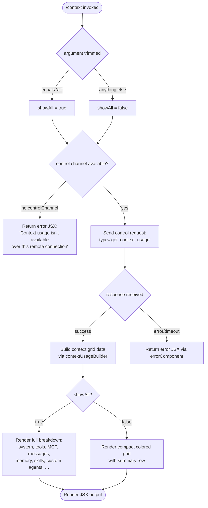

# `/context`

> Analysis basis: CC v2.1.191 bundle.js (AST extraction + Claude interpretation)
> Minimum version: v2.1.191

---

## Overview

`/context` visualizes the current session's context window usage as a colored grid, displaying token consumption across various categories (system prompt, tools, messages, memory files, etc.) and compactness metrics. When invoked with the `all` argument, it additionally renders detailed per-category breakdowns. The command dispatches a control request (`get_context_usage`) through the thin-client control channel and renders a JSX component with the returned data.

---

## Registration

| Field | Value |
|---|---|
| type | `local-jsx` |
| name | `context` |
| description | `Visualize current context usage as a colored grid` |
| argumentHint | `[all]` |
| thinClientDispatch | `control-request` |
| module_id | `oCl` |
| load_inline | `true` |
| loc_byte | `11574035` |
| loc_byte_end | `11574261` |
| loc_line | `7174` |
| arbor_handler.name | `Hmf` |
| arbor_handler.fqn | `claude-2.1.191::Hmf` |
| arbor_handler.kind | `AsyncFunction` |
| arbor_handler.resolution_path | `module_id` |
| arbor_handler.n_hits | `0` |

Analysis basis: CC v2.1.191 bundle.js:+11574035

---

## Input Branching

The command exhibits 4+ distinct branches based on argument value, channel availability, and data shape.



---

## Behavioral Spec

### Handler Entry (`Hmf`)

The primary handler is `Hmf` (an `AsyncFunction`), resolved via `module_id` → `oCl`.

```
async function contextCommandHandler(args, context):
    trimmedArg = args.trim()                          // bundle.js:+11572655
    showAll    = (trimmedArg === "all")                // bundle.js:+11572680

    channel = context.controlChannel                   // bundle.js:+11572706
    if channel is absent or falsy:
        return errorText("Context usage isn't available over this remote connection")
        // literal: bundle.js:+11572733

    response = await context.sendControlRequest({
        type: "get_context_usage"                      // bundle.js:+11572845
    })

    if response is error:
        return errorComponent(response)                // via Cdt / Idt.jsx

    usageData = buildContextDisplay(response, showAll) // QVt / nzn path
    return renderContextGrid(usageData)                // u0o.jsx
```

Analysis basis: CC v2.1.191 bundle.js:+11572649

---

### Control Request Dispatch (`controlRequestSender` / `Hmf → o.sendControlRequest`)

The command sends a `control-request` typed message over the thin-client IPC channel.

```
function sendControlRequest(requestPayload):
    // thinClientDispatch = "control-request" (registration)
    emit message of type "control-request" with:
        payload.type = "get_context_usage"
    await response from channel
    return response
```

Analysis basis: CC v2.1.191 bundle.js:+11572815

---

### Usage Data Builder (`contextUsageBuilder` / `nzn` call subtree)

The data builder assembles a structured breakdown of token counts from the session state. It orchestrates multiple sub-collectors in parallel, then normalizes results into grid rows.

```
async function contextUsageBuilder(sessionState, showAll):
    results = await Promise.all([
        collectSystemPrompt(sessionState),          // $R sub-path
        collectTools(sessionState),                 // nzn → ssf / tsf
        collectMcpTools(sessionState),              // nzn → Qof
        collectMessages(sessionState),              // nzn → Jof / esf
        collectMemoryFiles(sessionState),           // nzn → Zof
        collectSkills(sessionState),                // nzn → Xof
        collectCustomAgents(sessionState),          // nzn → Yof → ozn
        collectContextEfficiency(sessionState),     // nzn → ute
    ])

    rows = []
    for each result in results:
        rows.push(toGridRow(result))

    if showAll:
        expandedRows = includeDetailedBreakdown(rows)
        return expandedRows
    else:
        return summaryRows(rows)
```

Analysis basis: CC v2.1.191 bundle.js:+10937348 (nzn entry)

---

### Context Grid Renderer (`QVt`)

Renders the colored grid from usage data. Each row is a category; the fill level is represented as colored cells.

```
function renderContextGrid(usageData, showAll):
    freeSpaceLabel        = "Free space"           // bundle.js:+11570787
    autocompactLabel      = "Autocompact buffer"   // bundle.js:+11570810
    systemLabel           = "System prompt"        // bundle.js:+10938497
    toolsLabel            = "System tools"         // bundle.js:+10938578
    mcpToolsLabel         = "MCP tools"            // bundle.js:+10938643
    messagesLabel         = "Messages"             // bundle.js:+10939507
    memoryLabel           = "Memory files"         // bundle.js:+10938961
    skillsLabel           = "Skills"               // bundle.js:+10939023
    agentsLabel           = "Custom agents"        // bundle.js:+10938894

    rows = usageData.filter(nonEmpty)
    categoryRow = rows.find(r => r.label === "Free space" || …)

    // Percentage computation: Math.round used for display
    // Threshold "< 20" displayed when free space < 20 %   // bundle.js:+221666
    // Warning threshold: 10 %                              // bundle.js:+221699
    // compact_boundary marker                              // bundle.js:+13806917

    if showAll:
        render each category with per-source breakdown
            sources: projectSettings, userSettings,
                     localSettings, Flag, Policy,
                     Plugin, Built-in, MCP             // bundle.js:+11571736…11571929
    else:
        render compact colored grid (one row per category)

    append summary line: tokens used / total
```

Analysis basis: CC v2.1.191 bundle.js:+11570711 (sl / QVt entry)

---

### Percentage Formatter (`Voe` / `sl`)

```
function formatPercentage(value):
    rounded = Math.round(value * 100)               // bundle.js:+221686
    if rounded >= 20:
        return rounded.toString() + ".0"            // bundle.js:+221627
    else:
        return "< 20"                               // bundle.js:+221666
```

Analysis basis: CC v2.1.191 bundle.js:+221683

---

### System Prompt Token Collector (`$R` → system prompt sub-path)

Gathers token counts for all system-prompt segments including auto-compact boundary markers and injected context blocks.

```
async function collectSystemPromptTokens(session):
    segments = session.getSystemPrompt()            // bundle.js:+8751946
    counts   = await Promise.all(segments.map(countTokens))
    // Labels injected: "System prompt", "promptBorder"
    //                  "compact_boundary"
    return { label: "System prompt", tokens: sum(counts) }
```

Analysis basis: CC v2.1.191 bundle.js:+13587903 ($R → nt / system prompt path)

---

### Context Efficiency Collector (`ute`)

Computes the efficiency ratio and emits warning color when usage is high.

```
function collectContextEfficiency(data):
    capacity      = min(data.maxTokens, contextCap)  // bundle.js:+5206357 (Math.min)
    used          = data.usedTokens
    efficiencyPct = Math.round((used / capacity) * 100)
    warning       = (efficiencyPct >= 80)            // threshold: 80 bundle.js:+11573181
    return { label: "context_efficiency", pct: efficiencyPct, warning }
```

Analysis basis: CC v2.1.191 bundle.js:+5206357 (ute / Math.min entry)

---

### Error Rendering (`Cdt` / `Idt.jsx`)

When the control channel is unavailable or the request fails, a JSX error node is emitted instead of the grid.

```
function renderError(message):
    // Cdt renders an Idt.jsx component wrapping the message string
    return JSX(<ErrorBox>{message}</ErrorBox>)
```

Analysis basis: CC v2.1.191 bundle.js:+8298832 (Cdt → o.on path, Idt.jsx)

---

## State & Side Effects

| Item | Detail |
|---|---|
| Telemetry | `tengu_context_tip_classifier_outcome` (bundle.js:+16672225) — fires when context-tip classifier runs |
| Telemetry | `tengu_amber_creek` (bundle.js:+3537252) — fullscreen/render path event |
| Telemetry | `tengu_pewter_brook` (bundle.js:+3537159) — display render event |
| Telemetry | `tengu_marlin_porch` (bundle.js:+3913083) — Iwe / context display render |
| Telemetry | `tengu_native_cursor` (bundle.js:+3913434) — cursor/render event |
| Telemetry | `tengu_sparrow_ledger` (bundle.js:+13587291) — system prompt assembly event |
| Telemetry | `tengu_silent_harbor` (bundle.js:+13587906) — system context tracking |
| Telemetry | `tengu_chair_sermon` (bundle.js:+13768674) — message history normalization |
| Telemetry | `tengu_agent_memory_loaded` (bundle.js:+8752044) — memory segment loaded |
| Telemetry | `tengu_tool_pear` (bundle.js:+13602854) — tool segment event |
| Telemetry | `tengu_fgts` (bundle.js:+13603198) — tool schema serialization |
| Control request | Emits `get_context_usage` over `thinClientDispatch = "control-request"` channel |
| appState changes | None directly — read-only display command |
| Hook registration | None observed in depth-2 traversal |
| Sound | None |
| JSX output | Renders via `u0o.jsx` (bundle.js:+11572879) |

---

## Version History

| Version | Change |
|---|---|
| v2.1.191 | Initial analysis |

---

## Common Mistakes

1. **Running over a remote/SSH connection without a control channel** — The command returns the message `"Context usage isn't available over this remote connection"` (bundle.js:+11572733) instead of a grid. This is expected behavior when `thinClientDispatch` control channel is absent.
2. **Expecting `/context` to update or compact the context** — This command is read-only; it only visualizes current usage. Use `/compact` to trigger compaction.
3. **Omitting the `all` argument when detail is needed** — Without `all`, only the compact summary grid renders. Pass `/context all` to see per-source breakdowns (project settings, user settings, local settings, flag, policy, plugin, built-in, MCP).
4. **Interpreting "< 20" as an error** — The percentage formatter displays `"< 20"` (bundle.js:+221666) for any free-space category under 20%; this is normal display rounding, not an error state.
5. **Assuming token counts are exact** — Counts are estimates computed via `countTokens` sub-calls and may differ slightly from server-side accounting due to tokenizer differences.

---

## Appendix — Identifier Mapping

> For bundle debugging only. Identifiers change across versions.

| Identifier | Role |
|---|---|
| `Hmf` | Primary async handler for `/context` command |
| `ks` | Fullscreen / render environment checker |
| `U2` | Terminal capability check (`.has`) |
| `Bk` | Feature-flag enablement checker (`Smi.isEnabled`) |
| `kGr` | Terminal string formatter (calls `rt`) |
| `rt` | String conversion utility |
| `cee` | Terminal/iTerm detection utility |
| `ISd` | Terminal session type detector (iTerm, screen, tmux) |
| `TSd` | Prefix-based terminal type test |
| `pXe` | tmux control-mode probe (spawnSync) |
| `T` | Text truncation / label formatter |
| `wNc` | Display-width normalizer |
| `kqo` | Padding helper (`MPc`, `DPc`) |
| `e` | Context usage display renderer (module root) |
| `L6o` | Message slice/segment builder |
| `o` | Row mapper / padEnd formatter |
| `wN` | API call / token-count dispatcher |
| `S4` | Event emitter / promise wrapper |
| `usm` | Context summary builder (`csm`) |
| `hsm` | Grid row assembler (push/join) |
| `M6n` | Model metadata finder |
| `cSt` | JSX component: styled text wrapper |
| `Re` | JSX component: error/warning renderer |
| `D6n` | Zod schema safe-parse wrapper |
| `we` | JSX component: warning box |
| `Ae` | String coercion helper |
| `ke` | JSON stringify wrapper |
| `Dc` | Redacted-path sanitizer (`[REDACTED]`) |
| `h7o` | Path map builder |
| `a7e` | stdout write helper (`s7o`) |
| `s7o` | Low-level `e.write` wrapper |
| `kNc` | Conversation log / transcript writer |
| `Oze` | Debounce/throttle utility (clearTimeout / setTimeout / setImmediate) |
| `Rfe` | Log file path builder |
| `Gt` | Path utility / homedir resolver |
| `Noe` | Directory-name normalizer |
| `y7o` | Log file path joiner |
| `nmr` | Log file rotation manager (stat/rename/unlink) |
| `RNc` | Log file appender (mkdir / appendFile) |
| `_i` | Hook registrar (`xqo.register`) |
| `RGr` | Fullscreen boolean resolver |
| `Rr` | Telemetry event emitter |
| `vj` | Settings load orchestrator |
| `cx` | Settings merge/cascade |
| `ia` | Memory usage sampler |
| `SIr` | Settings load event logger |
| `z2` | Settings object builder |
| `iZt` | Settings load finalizer |
| `CSd` | Context-state dispatcher |
| `nt` | Conversation state tracker |
| `IDt` | Conversation ID tracker |
| `CDt` | Conversation delta tracker |
| `B4` | Message batcher |
| `RTn` | Message dedup tracker |
| `kt` | Token count reporter |
| `Vu` | Model name resolver (`W1e`) |
| `W1e` | Model name string table lookup |
| `FO` | Model display name formatter |
| `Cdt` | Control-channel response handler (o.on / i.toString) |
| `i` | IPC channel object |
| `s` | Promise add/finally/delete wrapper |
| `MW` | JSX render dispatcher (`_8r`, `x8r`) |
| `x8r` | JSX createElement wrapper |
| `wee` | Context display outer wrapper component |
| `Iwe` | Context inner display component (cee / ks / nt) |
| `y8r` | Alternate context display component |
| `QVt` | Context usage grid renderer (main JSX builder) |
| `sl` | Locale percentage formatter |
| `Kc` | Number format wrapper |
| `FNc` | Intl.NumberFormat factory |
| `NXe` | Grid color/threshold selector |
| `Voe` | Percentage cell formatter (Math.round) |
| `hmf` | Context compact boundary helper |
| `GH` | Compact boundary slice helper |
| `y7n` | Compact boundary value getter |
| `GA` | Compact boundary constant |
| `nzn` | Context usage data orchestrator (main async collector) |
| `Z0` | System prompt assembler |
| `E4` | System prompt section builder |
| `L_` | Prompt section type resolver |
| `nj` | Prompt section join helper |
| `Na` | Prompt content normalizer |
| `_b` | Prompt segment type dispatcher |
| `ege` | Prompt segment: embedded content |
| `nge` | Prompt segment: named content |
| `_r` | Provider/runtime resolver |
| `To` | Prompt type router |
| `wi` | Prompt wire format builder |
| `$j` | String replace helper |
| `c_` | Prompt cache wrapper |
| `ev` | Cache event emitter |
| `fCe` | Cache key builder |
| `JU` | Prompt content validator and dispatcher |
| `VKs` | Available models enforcer |
| `il` | Whitespace normalizer |
| `Dk` | Provider inclusion checker |
| `ed` | Provider edge-case handler |
| `tie` | Provider-ID inclusion checker |
| `xhn` | Prompt content route helper |
| `NFe` | Prompt content node filter |
| `Qo` | Model alias resolver |
| `ao` | Context accumulator |
| `Xme` | Prompt extra validator |
| `Vqu` | Token add helper |
| `kPr` | Token count checker |
| `$w` | Cache control builder |
| `khn` | Cache node builder |
| `cC` | Tool context builder |
| `fc` | Tool list builder |
| `vk` | Tool dedup tracker |
| `DIr` | Tool path resolver |
| `In` | Tool include/exclude gating |
| `l3` | Auto-compact window resolver |
| `Jy` | Process util helper |
| `ux` | Process util (child) |
| `mA` | Auto-compact capacity resolver |
| `Rfi` | Token count integer parser |
| `E3r` | Token count range resolver |
| `kfi` | Token count normalizer |
| `xle` | CLAUDE_CODE_AUTO_COMPACT_WINDOW parser |
| `IGd` | Input schema validator |
| `c7i` | Schema array validator |
| `Mfi` | Schema key mapper |
| `Dfi` | Schema type validator |
| `xJr` | Compact window joiner |
| `xr` | Context size resolver |
| `$Ut` | Context size state getter |
| `LJr` | Numeric string parser (parseFloat/parseInt/Math.round) |
| `bGd` | Schema object validator |
| `$R` | System prompt full assembler |
| `e$o` | System prompt static builder |
| `Dt` | Async store getter |
| `Gin` | Bin store accessor |
| `Hr` | Logger/tracer helper |
| `Dzn` | Deferred tool segment builder |
| `fve` | Pewter-owl tool builder |
| `S3r` | Tool segment factory |
| `ML` | Model listing helper |
| `J$f` | System prompt brief/focus section |
| `FZ` | Feature flag resolver |
| `Y$f` | Brief section builder |
| `X$f` | Brief feature gate |
| `Q$f` | Background section builder |
| `Z$f` | Fable identity section |
| `Nfi` | Fable identity constant |
| `qSn` | Provider prefix checker |
| `Gj` | Prompt indentation helper |
| `uvi` | Tool parameter JSON validator |
| `xDt` | JSON schema freeze/validate |
| `o$o` | Memory/context attachment builder |
| `ol` | String coercion (outer) |
| `x2f` | Memory attachment wrapper |
| `oV` | Tool output validator |
| `f2f` | Tool call builder/deduplicator |
| `Zq` | Tool-use dedup set |
| `mC` | Message content builder |
| `p2f` | Tool-use item builder |
| `Bwo` | Tool-use attachment |
| `J7` | Tool-use ID generator |
| `bu` | Background-session tool gate |
| `sV` | Tool content item helper |
| `SV` | Tool flat-map normalizer |
| `oPt` | Memory tool dispatcher |
| `Jc` | Memory file reader |
| `Kve` | Memory directory creator |
| `uae` | Memory file-type checker |
| `Ve` | File/error wrapper |
| `Lwi` | Memory write orchestrator |
| `Qyd` | Memory path loader |
| `f` | Background session process manager |
| `a` | Session store accessor |
| `rPt` | Memory path splitter |
| `gR` | Memory read wrapper |
| `Ib` | Memory team path builder |
| `Dwi` | Memory content joiner |
| `$wi` | Memory content serializer |
| `m` | Subprocess value iterator |
| `g` | Subprocess value bridge |
| `Fwi` | Memory index builder |
| `j6r` | Memory auto-save helper |
| `W` | JSX warning/info renderer |
| `A2f` | Env-info assembler |
| `mh` | Platform name normalizer |
| `t$o` | OS/shell info builder |
| `S2f` | Static env-info collector |
| `r$o` | OS version/type builder |
| `Sm` | Shell detector |
| `n$o` | Shell type resolver |
| `cIn` | Conda/shell context injector |
| `s2f` | Language setting builder |
| `i2f` | Output-style setting builder |
| `T2f` | Background-session info builder |
| `Rho` | Git worktree detector |
| `Ejn` | Scratchpad/plan injector |
| `PJ` | Scratchpad plan reader |
| `XSe` | Scratchpad path builder |
| `C2f` | Brief-mode gate |
| `L2f` | Focus context builder |
| `hnt` | Context reminder helper |
| `h2f` | Heading/section builder |
| `r2f` | Heron-brook experiment handler |
| `kx` | Token size checker |
| `o2f` | Amber-sextant gate |
| `uil` | Uploaded-item list collector |
| `abt` | Attachment batch helper |
| `cpr` | Compute-resource prober |
| `g2f` | ZFo feature flag gate |
| `a2f` | Autonomy-append handler |
| `l2f` | Context-management section builder |
| `n2f` | Context management content builder |
| `c2f` | Verified-vs-assumed gate |
| `u2f` | Memory attachment |
| `d2f` | Deferred-tools delta builder |
| `vv` | CLI/remote mode resolver |
| `m2f` | System section flat-mapper |
| `Vwi` | Memory write validator wrapper |
| `Wwi` | Memory write validator (Jc / gR) |
| `mve` | Provider context resolver |
| `wD` | Provider config reader |
| `uu` | Anthropic provider util |
| `Gzl` | Context sizing orchestrator |
| `wzn` | Infinite/fixed window resolver |
| `k6` | Agent context loader |
| `Rc` | Agent context root |
| `Lv` | Agent context layer |
| `Aw` | Agent config accessor |
| `sa` | Agent state accessor |
| `io` | Module entry-point initializer |
| `_Qt` | Module binding helper |
| `Xg` | Agent experience loader |
| `Pe` | JSX paragraph/block renderer |
| `eze` | Error display element |
| `ait` | Usage-stat iterator |
| `dte` | Usage literal checker |
| `Yof` | Context sub-section builder (parallel collector) |
| `zof` | Content pattern matcher |
| `ozn` | Per-MCP server context builder |
| `b2f` | Per-MCP context info builder |
| `qwi` | MCP directory memory builder |
| `XFo` | MCP section header parser |
| `Iht` | Token-count per-item helper |
| `i4e` | Count-tokens API caller |
| `Le` | Logger event emitter |
| `hHl` | Token count aggregator |
| `Xof` | Skill/built-in context collector |
| `sae` | ClaudeMD loader |
| `Ql` | ClaudeMD highlight builder |
| `dx` | ClaudeMD content accessor |
| `PUt` | AutoMem filter helper |
| `Jof` | Message context collector |
| `fDe` | Message batch token-counter |
| `szn` | Tool schema serializer |
| `u` | Daemon stop/resume orchestrator |
| `pF` | Message queue helper |
| `BG` | Process exit/race handler |
| `y` | Session history accessor |
| `PGe` | Teammate mailbox accessor |
| `h` | Event subscriber bridge |
| `esf` | Per-message token estimator |
| `mf` | Math.round wrapper |
| `c` | Message accumulator |
| `An` | Message accumulator entry |
| `p` | Process abort helper |
| `oT` | Process signal handler |
| `tsf` | Tool-result token counter |
| `Qof` | Tool-use context builder |
| `nXr` | Tool-use dedup helper |
| `Ale` | Tool-use filter |
| `gHl` | Tool context group helper |
| `cl` | Context lookup tree |
| `ssf` | Session-level token aggregator |
| `nsf` | Named-tool token helper |
| `rsf` | Role-tool token helper |
| `osf` | One-shot token helper |
| `lL` | Conversation message normalizer (large multi-branch function) |
| `a3f` | Message attachment builder |
| `W$o` | Message wrapper factory |
| `$Yl` | Message yield helper |
| `p3f` | Attachment type dispatcher |
| `F` | Output stream / timeout writer |
| `h3f` | Message dedup checker |
| `j` | Timer/stream pair |
| `V$o` | Message validation helper |
| `f3f` | Array-content type checker |
| `m3f` | MCP prefix tagger |
| `X` | Session history map |
| `sde` | Session dedup checker |
| `l` | Session list accessor |
| `U` | Session set |
| `N` | Session map |
| `R3f` | UUID generator wrapper |
| `Dn` | Message node constructor |
| `Qv` | Message version tracker |
| `wyo` | Message write-once gate |
| `knr` | Message key normalizer |
| `lP` | Standard/tool-search prompt builder |
| `d$o` | Document attachment handler |
| `l3f` | Tool-reference removal helper |
| `IYl` | Image attachment handler |
| `O` | Message outer array |
| `c3f` | System reminder detector |
| `x3f` | Tool-search usage tracker |
| `Xzl` | Message content stripper |
| `D` | Output stream dispatcher |
| `_3f` | Thinking/redacted filter |
| `GYl` | Message reorder helper |
| `dzn` | Full system-context assembler |
| `k` | Write queue |
| `k3f` | Tool-search usage reminder builder |
| `H3f` | Message header builder |
| `CGe` | Tool-use orphan filter |
| `B3f` | Trailing thinking block filter |
| `IGe` | Whitespace-only assistant filter |
| `G3f` | Empty assistant content fixer |
| `y3f` | Message yield helper |
| `FYl` | Message flat-mapper |
| `jYl` | Message join helper |
| `d3f` | Document slice helper |
| `Zof` | Memory file context collector |
| `_9e` | Memory context sub-helper |
| `gA` | Memory content accessor |
| `TWt` | Token count formatter |
| `sIo` | Token count display helper |
| `fo` | Error string builder |
| `ute` | Context efficiency calculator |
| `zHe` | Context window size resolver |
| `pve` | Context window capacity getter |
| `ne` | Session record list |
| `Z` | Voice/interaction recorder |
| `d` | Terminal output stream |
| `Jsr` | Recording timestamp pusher |
| `q` | Key event handler |
| `ae` | Audio buffer list |
| `Uuc` | Audio sample normalizer |
| `He` | Audio chunk buffer |
| `Aze` | Locale/language resolver |
| `C7o` | DateTime formatter |
| `Ner` | Voice stream WebSocket handler |
| `me` | Audio track selector |
| `UXf` | Audio capture tool finder |
| `_e` | MCP WebSocket connection |
| `K` | MCP client manager |
| `z` | MCP state updater |
| `V` | Timer reference |
| `ge` | Voice recording loop |
| `ye` | Audio frame buffer |
| `Q4o` | Audio file writer |
| `te` | Session entry builder |
| `A` | App state updater |
| `U2t` | App state shape |
| `vSt` | App state broadcaster |
| `w` | Message channel |
| `eY` | Context size initializer |
| `_7i` | Usage stat slice helper |
| `H7i` | Usage literal mapper |
| `OJr` | Usage stat lookup |
| `JT` | Usage stat dispatcher |
| `ysf` | Per-item token counter with dzn |
| `Mt` | Token count accumulator |
| `OSo` | Token key extractor |
| `he` | Main app event loop |
| `ue` | Session load/resume orchestrator |
| `xQn` | Concurrency/rate-limit helper |
| `hv` | Terminal pixel-renderer |
| `Sg` | Session ID generator |
| `Nye` | Live session lister |
| `cue` | Session context loader |
| `xe` | Tombstone/history pruner |
| `Be` | Tombstone splice helper |
| `kc` | UUID generator (randomUUID) |
| `VS` | Platform feature checker |
| `sy` | Shell env resolver |
| `nXt` | Project file renamer |
| `tJ` | Conversation file closer |
| `U5n` | OAuth token fetcher |
| `d8e` | Conversation file accessor |
| `HAe` | Session startup handler |
| `Dct` | Daemon keepalive manager |
| `iXt` | Session index writer |
| `Kqe` | Model refusal handler |
| `zqe` | Fork/restore neutralizer |
| `We` | Regex exec helper |
| `Fe` | Done-signal emitter |
| `sXt` | Session export helper |
| `hz` | Timestamp helper |
| `jre` | Conversation file join helper |
| `aXt` | Session start handler |
| `fpe` | Metadata re-appender |
| `v` | Blur/focus timer |
| `Tn` | Tool presence checker |
| `jt` | Tool availability scanner |
| `xt` | Input key tracker |
| `Ue` | Conversation state node |
| `$r` | Cleanup registry |
| `Bn` | Platform/feature flag list |
| `WEa` | MCP server connector |
| `hx` | String slice helper |
| `ln` | MCP debug logger |
| `hL` | MCP skills initializer |
| `Xc` | MCP error logger |
| `Jl` | Tool resolver |
| `ns` | Notification sender |
| `a4` | Platform URL normalizer |
| `pc` | URL prefix replacer |
| `A3` | Tool path prefix checker |
| `BJi` | VSCode integration handler |
| `k8d` | VSCode gate helper |
| `kkn` | Onboarding event helper |
| `oY` | Feedback/survey handler |
| `s1l` | Startup announcement handler |
| `r1l` | Announcement display builder |
| `Gwc` | CCD session handler |
| `vs` | Feedback survey gate |
| `FG` | Feature name formatter |
| `ojo` | Feedback survey launcher |
| `Ke` | Feature-flag key builder |

Note: index built via Arbor fallback; some signals (telemetry, literals) may be missing — see arbor-fallback.js.