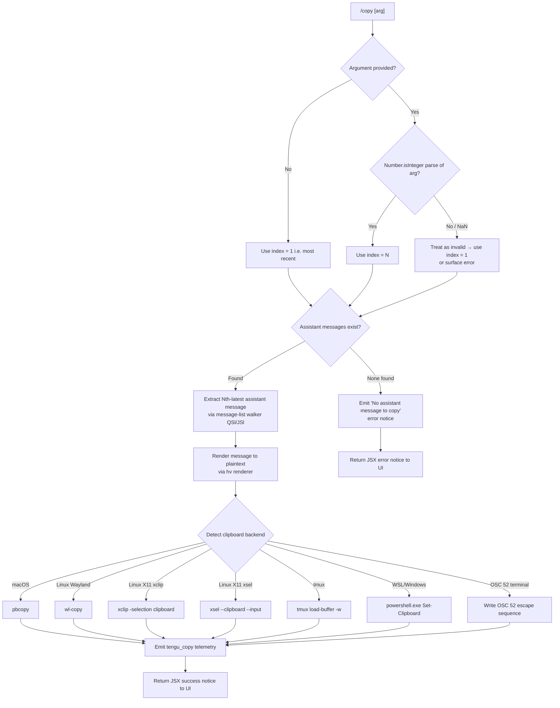

# `/copy`

> Analysis basis: CC v2.1.191 bundle.js (AST extraction + Claude interpretation)
> Minimum version: v2.1.191

---

## Overview

The `/copy` command copies Claude's most recent assistant response to the system clipboard. When invoked with an optional integer argument `N` (e.g. `/copy 2`), it copies the Nth-latest assistant message instead of the most recent one. The command supports multiple clipboard backends across macOS, Linux (Wayland and X11), Windows/WSL, and terminal-multiplexer environments (tmux, screen, OSC 52).

---

## Registration

| Field | Value |
|---|---|
| type | `local-jsx` |
| name | `copy` |
| description | `Copy Claude's last response to clipboard (or /copy N for the Nth-latest)` |
| loc_byte | `11296300` |
| loc_byte_end | `11296486` |
| loc_line | `6965` |
| module_id | `nAl` |
| load_inline | `true` |
| arbor_handler.name | `Rcf` |
| arbor_handler.fqn | `claude-2.1.191::Rcf` |
| arbor_handler.kind | `AsyncFunction` |
| arbor_handler.resolution_path | `module_id` |
| arbor_handler.n_hits | `0` |

Analysis basis: CC v2.1.191 bundle.js:+11296300

---

## Input Branching

The command has four distinct logical branches depending on argument presence/validity and message availability; a Mermaid flowchart is used.



Analysis basis: CC v2.1.191 bundle.js:+11295484 (handler entry `Rcf`), +11295525 (error string), +11295594 (Number parse), +11295608 (Number.isInteger check), +11295838 (`QSl` call), +11295903 (telemetry)

---

## Behavioral Spec

### 1. Argument Parsing

```
async function copyCommandHandler(appState, rawArg):
    # rawArg is the text typed after "/copy", trimmed

    index = 1                          # default: most-recent assistant message
    if rawArg is not empty:
        parsed = Number(rawArg)
        if Number.isInteger(parsed) and parsed >= 1:
            index = parsed
        # else: index stays 1 (invalid arg silently ignored)
```

Analysis basis: CC v2.1.191 bundle.js:+11295594, +11295608

### 2. Message-List Walking (`QSl` / `JSl`)

```
function walkAssistantMessages(conversationMessages):
    # Lex message list via markdown-aware tokenizer (jm.lexer)
    tokens = jm.lexer(conversationMessages)

    # Filter to assistant-role entries only
    assistantBlocks = tokens.filter(t => t.role == "assistant")

    # Reverse so index 1 = most recent
    return assistantBlocks.reverse()
```

The inner helper (`JSl`) formats each message block for display, applying column alignment (`Math.max`, `Math.min`), padding, and a pipe-separated table layout (separator literal `" | "`, escape `"\\|"`). Column alignment supports `"center"`, `"right"`, and `"left"` modes.

Analysis basis: CC v2.1.191 bundle.js:+11291309 (`QSl` → `JSl`), +11290641, +11290657, +11290668, +11290734, +11290843, +11290878, +11290916, +11290952

### 3. No-Message Guard

```
if assistantBlocks is empty:
    displayError("No assistant message to copy")
    return earlyExit
```

Analysis basis: CC v2.1.191 bundle.js:+11295523, +11295525 (literal `"No assistant message to copy"`)

### 4. Message Rendering to Plaintext (`hv` / `RLo`)

```
function renderMessageToPlaintext(messageBlock):
    # Convert rich content (markdown, tool_use, tool_result, text blocks)
    # to a flat plain-text string.
    # Uses hv renderer which dispatches to:
    #   - CGr  : handles "screen" / terminal-type detection
    #   - Jw   : replaceAll for escape sequence cleanup (e.g. ESC ESC pairs)
    #   - dE   : joins content fragments with Oxi (kitty-style) prefix handler
    #   - hSd  : Nn-based line wrapper
    #   - fPt  : padding and width computation (pPt, Wt)
    #   - Nxi  : recursive inline-node renderer (self-referential call)
    #   - vGr  : Wt + Cf for color/style stripping
    result = hv(messageBlock)
    return result
```

Plaintext rendering also handles the `"table"` and `"plaintext"` content-type literals; `.txt` extension handling is present for file-save paths.

Analysis basis: CC v2.1.191 bundle.js:+11291908 (`RLo` → `hv`), +11291949, +11292024, +11291255 (`"table"`), +11291696 (`"plaintext"`), +11291728 (`".txt"`)

### 5. Clipboard Write (`nCn` / `Nxi` / `vGr`)

```
function writeToClipboard(text, terminalEnv):
    platform = detectPlatform()   # inspects process environment

    if platform == "macos":
        spawn("pbcopy", stdin=text, timeout=2000ms)

    elif platform == "linux":
        if wayland available:
            spawn("wl-copy", text)
        elif xclip available:
            spawn("xclip", ["-selection", "clipboard"], stdin=text)
        elif xsel available:
            spawn("xsel", ["--clipboard", "--input"], stdin=text)

    elif platform == "windows" or env is WSL:
        spawn("powershell.exe", ["-NoProfile", "-NonInteractive",
              "-Command", "Set-Clipboard"], stdin=text)

    elif terminalMux == "tmux":
        spawn("tmux", ["load-buffer", "-w"], stdin=text)
        # Also checks w1.hasOsc52ClipboardUtf8Bug flag (nCn)

    elif terminalType in ["osc52", "tmux-buffer", "raw+dcs", "dcs", "raw"]:
        # Write OSC 52 escape sequence directly to stdout
        # Encodes text as base64; handles "kitty", "screen" terminal types
        # Escape prefix: ESC ESC for tmux pass-through
        writeOsc52EscapeSequence(text, terminalType)

    # VS Code 1.123/1.124 mojibake warning surfaced if applicable
    # Literal: "VS Code 1.123/1.124 will mojibake this paste — update to ≥1.125"
```

The `nCn` function checks `w1.hasOsc52ClipboardUtf8Bug` before selecting the OSC 52 path; if the bug flag is set, it routes to an alternative backend.

Analysis basis: CC v2.1.191 bundle.js:+11292024 (`nCn`), +3529308 (`"macos"`), +3529319 (`"pbcopy"`), +3529285 (timeout 2000), +3527998 (`"linux"`), +3528077 (`"wl-copy"`), +3528146 (`"xclip"`), +3528187 (`"xsel"`), +3529721 (`"powershell.exe"`), +3529739, +3529752, +3529770, +3529711 (`"wsl"`), +3528566 (`"tmux"`), +3528574 (`"load-buffer"`), +3527939 (`"tmux-buffer"`), +3527959 (`"osc52"`), +3527539 (`"kitty"`), +3527070 (`"screen"`), +3528900 (`"base64"`), +3528289 (OSC52 bug check), +3528346 (VS Code warning), +3528998 (`"raw+dcs"`), +3529021 (`"dcs"`), +3529027 (`"raw"`)

### 6. Temporary Directory Safety (`tAl`)

When the clipboard write requires a temporary file (e.g. for atomic writes via `ibr`), the temp directory is validated:

```
function safeTempDir():
    base = env.CLAUDE_CODE_TMPDIR ?? "/tmp"
    validate ownership and permissions (mode 511 / 448)
    if mismatch:
        emit "Set CLAUDE_CODE_TMPDIR to a directory you control..."
        emit telemetry "tempdir_owner_mismatch"
    return validated path
```

Analysis basis: CC v2.1.191 bundle.js:+11291842 (`tAl` → `ibr`), +3389394 (`"/tmp"`), +3389469 (error message), +3389788 (`"tempdir_owner_mismatch"`), +3389998 (mode 511), +3390188 (mode 448)

### 7. Telemetry Emission

```
function emitCopyTelemetry(outcome):
    fire("tengu_copy", { outcome: outcome })
```

Analysis basis: CC v2.1.191 bundle.js:+11295903

---

## State & Side Effects

| Item | Detail |
|---|---|
| Telemetry | `tengu_copy` (loc +11295903) — fired on every invocation with outcome data |
| Clipboard | System clipboard is mutated with the text of the selected assistant message |
| Temp files | May create/rename/delete temp files under `CLAUDE_CODE_TMPDIR` or `/tmp` during atomic write for some clipboard backends |
| appState changes | Reads `messages` key from conversation state (+11295789); no persistent write-back to appState |
| Sound | None detected in depth-2 traversal |
| Hook registration | None detected in depth-2 traversal |
| VS Code warning | Surfaces a terminal notice if VS Code 1.123/1.124 OSC 52 mojibake bug is detected (+3528346) |

---

## Version History

| Version | Change |
|---|---|
| v2.1.191 | Initial analysis |

---

## Common Mistakes

1. **Passing a non-integer argument** — `/copy foo` is silently treated as `/copy 1`; there is no validation error for non-numeric arguments. Always pass a positive integer.
2. **Expecting `/copy 0`** — Index is 1-based (most recent = 1). Passing `0` or a negative number may not behave as expected since the guard uses `Number.isInteger` but the lower-bound clamp is not explicitly surfaced at depth-2.
3. **Assuming the system clipboard tool is always available** — On minimal Linux environments without `wl-copy`, `xclip`, or `xsel`, the command falls back to OSC 52 which requires terminal support. If the terminal does not support OSC 52, the copy silently fails from the user's perspective.
4. **Running inside tmux with OSC 52 clipboard UTF-8 bug** — `nCn` probes `w1.hasOsc52ClipboardUtf8Bug`; on affected terminals the standard OSC 52 path is bypassed. Ensure tmux ≥ 3.3 is used for reliable Unicode clipboard content.
5. **Invoking `/copy` before any assistant message exists** — The command immediately surfaces "No assistant message to copy" and exits; it does not block or wait for an in-progress response to complete.

---

## Appendix — Identifier Mapping

> For bundle debugging only. Identifiers change across versions.

| Identifier | Role |
|---|---|
| `Rcf` | Main handler for `/copy` command (AsyncFunction, arbor_handler) |
| `QSl` | Message-list walker: lexes conversation, selects Nth-latest assistant message |
| `JSl` | Inner message block formatter: column alignment, padding, pipe-table layout |
| `Ccf` | Sub-helper called by `JSl` for message block mapping |
| `ZSl` | Assistant-message filter / array accumulator |
| `Zl` | Array filter utility used by `ZSl` |
| `eAl` | String replace helper used near message extraction |
| `Icf` | Markdown lexer wrapper (calls `jm.lexer`, `jke`) |
| `jke` | String replace helper for markdown escape normalization |
| `jm` | Markdown tokenizer module (calls `C9e.parse`) |
| `RLo` | Plaintext render pipeline dispatcher (calls `hv`, `au`, `nCn`, `tAl`) |
| `hv` | Rich-content-to-plaintext renderer; dispatches to sub-renderers |
| `pPt` | Padding/width sub-renderer (`Yh`) |
| `Nxi` | Recursive inline-node renderer (self-referential); calls `Wt`, `Nn`, `vGr` |
| `Nn` | Line-wrapping utility (`Kr`, `Dt`) |
| `vGr` | Color/style-stripping renderer (`Wt`, `Cf`) |
| `hSd` | Line-split renderer (`Nn`, `T`) |
| `CGr` | Terminal/screen-type detection renderer (`Yh`) |
| `fPt` | Padding renderer (`pPt`, `Wt`) |
| `Jw` | Escape-sequence cleanup (`CGr`, `replaceAll`) |
| `dE` | Fragment-join renderer (`Oxi`, `e.join`) |
| `Oxi` | Kitty-terminal content prefix handler (`Yh`) |
| `nCn` | Clipboard backend selector; checks OSC 52 bug flag (`w1.hasOsc52ClipboardUtf8Bug`, `gSd`) |
| `gSd` | OSC 52 escape-sequence writer |
| `tAl` | Temp-directory setup and atomic file write orchestrator (`AA`, `ibr`) |
| `AA` | Temp-directory creator and permission setter (`Kvi`, `Bve`) |
| `Kvi` | Directory ownership/permission validator |
| `ibr` | Atomic file write with symlink safety, rename, and chmod |
| `au` | String index-of utility |
| `rGl` | Daemon status reader (`HZ`, `Date.now`, `qs`, `ozt`, `ke`) |
| `HZ` | Status-file reader (calls `rge`) |
| `rge` | File-content normalizer (`yse`, `t.trim`) |
| `ozt` | Status path joiner (`nGl.join`, `Zn`) |
| `qs` | Async-local-storage store accessor (`EWu.getStore`) |
| `ke` | JSON serializer (`JSON.stringify`) |
| `JSl` | (see above — message block formatter) |
| `kt` | Config/CLAUDE-file loader (`Gt`, `Tk`, `C2o`, `tEt`, `K9f`) |
| `K9f` | Config cache and file-watcher manager |
| `tEt` | Config file reader with backup logic |
| `L2o` | Config directory resolver |
| `R2o` | Config path joiner |
| `$t` | JSON.parse wrapper |
| `n4` | Path prefix stripper |
| `Le` | File-watch error logger (`fo`, `rt`, `Yi`, `Rmu`) |
| `$vt` | File-watcher setup (`Tps.watchFile`) |
| `Hpe` | Config helper (purpose: <!-- TODO: not found in depth-2 traversal; needs --depth 4 -->) |
| `_i` | Hook/extension registrar (`xqo.register`) |
| `wN` | API call orchestrator (large fan-out; handles auth, retries, telemetry) |
| `oW` | HTTP request builder (headers, auth tokens, provider routing) |
| `Ghn` | Request-header assembler (`ol`, `_r`, `uu`, `$hn`, `hCe`) |
| `aje` | Context/thread name resolver |
| `S4` | Side-effect / event emitter (`ev`, `PPr`) |
| `usm` | Message-conversion pipeline (`csm`) |
| `csm` | Per-message converter |
| `hsm` | Text-block builder (`t.push`, `t.join`) |
| `L6o` | Conversation-context serializer (maps roles, tool blocks) |
| `msm` | Auto-classifier input builder |
| `har` | Hash accumulator (`hx`) |
| `s5e` | MCP server lifecycle manager (large; handles connect/disconnect/auth) |
| `S3` | MCP server registry updater |
| `bY` | MCP server connector (`Ql`, `XF`, `Db`, etc.) |
| `zat` | MCP server initializer (`iN`, `Hme`) |
| `Vat` | MCP server slot manager |
| `XF` | MCP server object factory (`Object.create`) |
| `kPn` | MCP server status reporter (`Mno`, `St.red`, `St.yellow`) |
| `B5` | MCP capability extractor |
| `mL` | MCP tool-list merger (`ag`, `Pno`) |
| `ag` | Tool-metadata builder (`_pe`, `kt`, `Ca`) |
| `vEa` | MCP tool-update applier (`Koo`, `y0e`, `LAn`) |
| `Koo` | MCP cache store reader |
| `y0e` | Tool-hash calculator (`ke`, `Cga.createHash`) |
| `LAn` | Tool schema validator (`Bie`, `O4`) |
| `xAn` | Tool schema extended validator |
| `PT` | Tool content hasher (`zmi.createHash`) |
| `wAn` | Tool write helper (`Wl`) |
| `Wl` | Config write helper (`Uzs`) |
| `ZPn` | MCP connection pipeline (`Cop`, `vop`) |
| `Cop` | MCP stdio/SSE connection handler |
| `vop` | MCP HTTP/WS connection handler |
| `Xno` | MCP auth-connection handler |
| `$2t` | MCP cache write helper |
| `a1n` | Cache path builder |
| `Dno` | MCP server process launcher (`gn`) |
| `gn` | Process spawn helper |
| `hL` | MCP lifecycle cleanup |
| `nt` | Tool registration manager |
| `Gar` | MCP connection result applier |
| `tI` | MCP reconnect orchestrator |
| `wlt` | MCP tool-cache updater |
| `o5e` | MCP tool-id hasher |
| `hGo` | MCP server-group manager |
| `UPn` | MCP tool permission checker |
| `jn` | Async timeout helper |
| `xlt` | Integer parser (parseInt) used for MCP config |
| `l1n` | Integer parser (parseInt) used for MCP port |
| `kEa` | Async iterable / event-stream mapper (`GW`) |
| `GW` | Observable/async-iterator factory |
| `Xc` | MCP error logger (`GQ.logMCPError`) |
| `ln` | MCP debug logger (`GQ.logMCPDebug`) |
| `w_a` | MCP Fro-proxy handler |
| `Fro` | MCP proxy transport |
| `iD` | Deep-clone utility (`structuredClone`) |
| `etn` | Message-tree builder (push/pop with Array.isArray check) |
| `u7e` | Message-tree reducer |
| `Ve` | Feature-flag reader (`eze`) |
| `Oo` | Alternate feature-flag reader (`eze`) |
| `Pe` | Feature-state emitter (`eze`) |
| `Re` | Feature OK recorder |
| `we` | Feature watch helper |
| `cSt` | Context-tip state writer |
| `D6n` | Schema safe-parse wrapper |
| `M6n` | Tool-use block finder |
| `T` | Prompt/tool builder (dispatches to `cNe`, `wNc`, `Dc`, `MO`) |
| `wNc` | Tool-name normalizer (`kO`, `Qfr`, `kqo`) |
| `Dc` | Path sanitizer / redactor (`[REDACTED]` literal) |
| `kNc` | CLAUDE-file loader (`Oze`, `Rfe`, `kO`, etc.) |
| `a7e` | String helper (`s7o`) |
| `Ae` | String coercion utility |
| `sp` | String replace (whitespace normalization) |
| `LOr` | OAuth/session logger |
| `wOr` | OAuth token store |
| `lie` | Auth token fetcher (`$At`, `vOr`) |
| `CBp` | Deduplication finder |
| `SHo` | SHA-256 hasher (`JVa.createHash`) |
| `aIn` | Async logger init |
| `wD` | Worker/daemon control (`C3r`, `A2e`) |
| `mbe` | Metrics batch emitter |
| `Tr` | Trace/log writer (`lh`, `Ve`) |
| `H1t` | Hook invocation handler (`v3i`, `Rot`, `h1t`) |
| `NF` | Notification/flag manager (`nOd`, `xD`, `Le`) |
| `kAt` | Cache-control annotator |
| `ZVa` | Async variant helper |
| `av` | Array mapper |
| `Txe` | Tool-execution context builder |
| `b2e` | Model-compatibility checker (`ao`, `PH`, `o1`) |
| `XSn` | Request-sanitizer (`sW`, `ao`) |
| `PPr` | Event publisher (`zp`) |
| `rn` | Terminal string-width calculator (`Bun.stringWidth`) |
| `Tf` | Padding string builder (`e.repeat`, `Number.isFinite`) |
| `An` | Background-session tag constant source |
| `Hyc` | Conversation-history accessor (`e.at`) |
| `_yc` | Conversation-history secondary accessor (`Vir`) |
| `dn` | Error formatting helper |
| `vn` | Error wrapping helper |
| `hXe` | Extended-attribute error suppressor |
| `ius` | Property definition helper (`Object.defineProperty`) |
| `Gt` | Global config getter |
| `C2o` | Config object constructor |
| `Le` | Logger (also: file-watch error logger) — dual role in bundle |
| `Pno` | Tool-name publisher |
| `Gn` | Async task scheduler (`t` callback) |
| `U2t` | Server deduplicator |