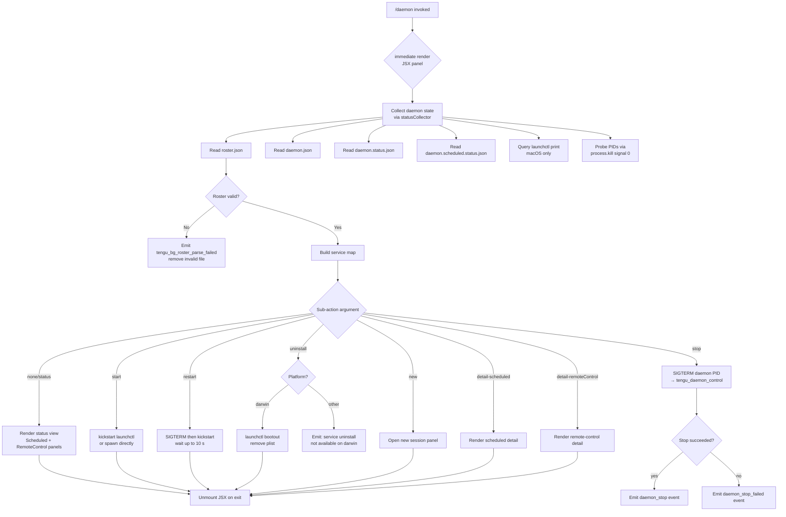

# `/daemon`

> Analysis basis: CC v2.1.191 bundle.js (AST extraction + Claude interpretation)
> Minimum version: v2.1.191

---

## Overview

The `/daemon` command provides an interactive management interface for the Claude Code background daemon process and its associated background services. It surfaces live status information for the daemon supervisor, scheduled tasks, and remote-control workers, and exposes sub-actions (start, stop, restart, uninstall, new) through a JSX-rendered terminal UI. The command resolves daemon state by reading on-disk roster and status JSON files, querying the OS service layer (launchctl on macOS), and probing running processes via `process.kill` signal checks.

---

## Registration

| Field | Value |
|---|---|
| type | `local-jsx` |
| name | `daemon` |
| description | `Manage background services and routines` |
| loc_byte | `13091871` |
| loc_byte_end | `13092039` |
| loc_line | `8767` |
| immediate | `true` |
| module_id | `bNo` |
| load_inline | `true` |
| arbor_handler.name | `lOf` |
| arbor_handler.fqn | `claude-2.1.191::lOf` |
| arbor_handler.kind | `AsyncFunction` |
| arbor_handler.resolution_path | `module_id` |
| arbor_handler.n_hits | `0` |

Analysis basis: CC v2.1.191 bundle.js:+13091871

The registration object spans bytes `(13091871, 13092039)`. The `immediate: true` flag means the command renders its JSX panel without waiting for a separate prompt submission. The handler `lOf` was resolved by the Arbor symbol graph via the `module_id` path (`bNo` → module exports → `lOf`).

---

## Input Branching

The `/daemon` command has more than three distinct execution paths based on the sub-action argument and discovered daemon state. A Mermaid flowchart is used below.



Analysis basis: CC v2.1.191 bundle.js:+13091220 (hOf dispatch), +13082095 (ANo render), +13081720 (lOf → statusCollector), +11616306 (start literal), +11616342 (stop literal), +11616382 (restart literal), +11615955 (bootout), +13082283 (uninstall literal)

---

## Behavioral Spec

### Top-level Handler (`lOf`)

`lOf` is an `AsyncFunction` that serves as the primary entry point for `/daemon`. It calls the status-collection function, creates the JSX element via React-compatible helpers, and mounts it through the `MWl` rendering subsystem.

```
async function daemonCommandHandler(context):
    statusData = await collectDaemonStatus()
    element = createJSXElement(DaemonPanel, { statusData, context })
    renderer = mountJSXPanel(element)
    return { renderer }
```

Analysis basis: CC v2.1.191 bundle.js:+13081720 (`lOf` → `SNo`), +13081733 (`lOf` → `Uc.jsx`), +13081772 (`lOf` → `MWl`)

---

### Status Collection (`SNo`)

`SNo` is the top-level status aggregator. It fires several parallel async reads, then merges results into a unified state object. It uses `Promise.all` to fan out across the sub-collectors.

```
async function collectDaemonStatus():
    [workerList, pidStatus, scheduledStatus, rosterData, serviceStatus] =
        await Promise.all([
            readWorkerDirectoryStatus(),     // vWl
            readMainDaemonPidFile(),         // p0
            readScheduledDaemonPidFile(),    // sGl + Djl
            readRosterFile(),                // MV
            queryServiceLayer(),             // cJ
        ])
    return mergeStatusObjects(
        workerList, pidStatus, scheduledStatus, rosterData, serviceStatus
    )
```

Analysis basis: CC v2.1.191 bundle.js:+13081279 (`SNo` → `tPe`), +13081307 (`SNo` → `Promise.all`), +13081320 (`SNo` → `vWl`), +13081332 (`SNo` → `p0`), +13081353 (`SNo` → `sGl`), +13081375 (`SNo` → `Djl`), +13081397 (`SNo` → `MV`), +13081415 (`SNo` → `cJ`)

---

### Worker Directory Status (`vWl`)

Reads the per-directory background worker state. For each worker directory it invokes the scheduled-task file reader (`dyt`) and a log-tail helper (`Le`), then queries the PID file helper (`p0`).

```
async function readWorkerDirectoryStatus():
    results = await Promise.all([
        readScheduledTaskFiles(),    // dyt
        readLogFile(),               // Le
    ])
    pidInfo = await readPidFile()    // p0
    return buildWorkerStatus(results, pidInfo)
```

Sub-function `dyt` reads JSON task definition files (up to 1 MB each, `"utf8"`, literal: `1048576` at +12895255). It validates the top-level structure with `Array.isArray`, filters entries tagged `"scheduled"` (literal at +12988923), and builds a task list.

Analysis basis: CC v2.1.191 bundle.js:+13076105 (`vWl` → `Promise.all`), +13076118 (`vWl` → `dyt`), +13076136 (`vWl` → `Le`), +13076147 (`vWl` → `p0`)

---

### PID File Management (`p0` — PID probe)

`p0` checks whether a daemon process is live by reading its PID file and sending signal `0` to the PID. A stale PID file is removed (`QP.rm`, 65536-byte read limit at +11612369). Process identity is cross-checked using the `"claude daemon"` string (literal at +11613294) found in `/proc`-style command-line data (parsed by `C0o` via `t.split`/`n.slice`).

```
async function probeDaemonPid(pidFilePath):
    stat = await filesystem.lstat(pidFilePath)
    if not stat.isFile():
        return { alive: false }

    raw = await filesystem.readFile(pidFilePath, limit=65536)
    pid = parsePidFromFile(raw)             // C0o
    try:
        process.kill(pid, 0)                // signal 0 = existence check
        cmdline = readProcessCmdline(pid)   // C0o reads /proc/pid/cmdline
        if "claude daemon" not in cmdline:
            return { alive: false, stale: true }
        return { alive: true, pid }
    catch (ESRCH):
        await filesystem.rm(pidFilePath)
        return { alive: false, stale: true }
```

Analysis basis: CC v2.1.191 bundle.js:+11612330 (`QDe` → `QP.lstat`), +11612388 (`QDe` → `QP.rm`), +11613403 (`p0` → `process.kill`), +11613294 (literal `"claude daemon"`), +11613453 (`p0` → `C0o`)

---

### Roster File Management (`MV`)

`MV` reads and validates `roster.json` (path constructed by `Hre`/`vde` joining with `"roster.json"` literal at +11620620). It performs lstat, validates that the entry is a regular file, reads it, parses JSON (via `$t`), and applies schema validation. On format errors it emits `tengu_bg_roster_parse_failed` and removes the invalid file.

```
async function readRosterFile(rosterPath):
    stat = await filesystem.lstat(rosterPath)
    if not stat.isFile():
        logError("is not a regular file — removing")   // literal +11624796
        await filesystem.rm(rosterPath)
        return null

    raw = await filesystem.readFile(rosterPath)
    decoded = decodeUtf8(raw)           // vn
    parsed = JSON.parse(decoded)        // $t
    if not isValidRoster(parsed):       // pvl checks Array.isArray + Object.keys
        emitTelemetry("tengu_bg_roster_parse_failed")
        backupRoster(rosterPath)        // QYn uses Date.now for suffix
        return null

    return parsed
```

Special error codes checked during kill validation: `"E2BIG"` (+11624922), `"EFTYPE"` (+11624934).

Analysis basis: CC v2.1.191 bundle.js:+11624649 (`MV` → `kde.lstat`), +11624842 (telemetry `tengu_bg_roster_parse_failed`), +11620620 (literal `"roster.json"`), +11625046 (`MV` → `kde.rm`)

---

### Service Layer Query — macOS (`cJ`)

On macOS the command queries the system service layer using `launchctl print` (literals at +11617457, +11617470) with a 5000 ms timeout (literal at +11617504). The result is parsed to determine whether the daemon is registered as a LaunchAgent. `VYn` calls `process.getuid()` (via `evl` at +11614253) to build the per-user service identifier using the home directory path components `"Library"` (+11614184) and `"LaunchAgents"` (+11614194).

```
async function queryServiceLayer():
    uid = process.getuid()              // evl
    agentLabel = buildAgentLabel(uid)   // x0o: homedir join
    result = await runLaunchctl(
        ["print", "user/" + uid + "/" + agentLabel],
        timeout=5000
    )                                    // Nn → Kr
    return parseServiceStatus(result)
```

Analysis basis: CC v2.1.191 bundle.js:+11617454 (`cJ` → `Nn`), +11617478 (`cJ` → `VYn`), +11617457 (literal `"launchctl"`), +11617504 (literal `5000`), +11614253 (`evl` → `process.getuid`)

---

### Scheduled Task PID (`sGl`, `Djl`)

`sGl` reads `daemon.status.json` (literal at +12894435) and `Djl` reads `daemon.scheduled.status.json` (literal at +12987418). Both follow the same pattern as `p0`: build path via `ozt`/`Mjl` helpers, call `Ca` (read with context), send `process.kill(pid, 0)`, and dispatch `lv` for launch on success. If the daemon PID is not alive, `lv` is called to re-launch.

Analysis basis: CC v2.1.191 bundle.js:+12894435 (literal `"daemon.status.json"`), +12987418 (literal `"daemon.scheduled.status.json"`), +12894918 (`sGl` → `process.kill`), +12987824 (`Djl` → `process.kill`)

---

### JSX Panel Renderer (`ANo`)

`ANo` is the React functional component that renders the interactive UI. It maintains local state (`KV.useState`) for the currently selected sub-view. A clock context (`ws`) drives periodic re-renders. `Qc` provides a scroll/focus ref. The component dispatches sub-actions through the `SNo` status pipeline and renders distinct panels depending on the active route:

| Route literal | Panel |
|---|---|
| `"hub"` (default) | Main status overview |
| `"detail-scheduled"` | Scheduled tasks detail |
| `"detail-remoteControl"` | Remote control detail |
| `"new"` | New session form |
| `"uninstall"` | Uninstall confirmation |

The heading shown is `"Claude daemon"` (literal at +13083562). Sub-sections are labelled `"Scheduled"` (+13083002) and `"Remote Control"` (+13083288).

The `p` function handles exit: it calls `oT` (abort controller abort) then `process.exit`, and emits the `"daemon_stop"` / `"daemon_stop_failed"` literals (+17408185, +17408222) through telemetry before exiting.

Analysis basis: CC v2.1.191 bundle.js:+13081852 (`ANo` → `KV.useState`), +13082095 (`ANo` → `SNo`), +13082498 (`ANo` → `Uc.jsx`), +13083562 (literal `"Claude daemon"`), +17404601 (`p` → `process.exit`)

---

### Daemon Start / Stop / Restart Actions

**Start** calls `kickstart` via launchctl (literal `"kickstart"` at +11616317) on macOS, or spawns the daemon directly via `lv` on other platforms.

**Stop** sends SIGTERM to the daemon PID. If the process does not exit within the polling window, `daemon_stop_failed` is emitted. The `daemon_stop` telemetry event is emitted on success.

**Restart** combines stop and start: SIGTERM first, then waits in 50 ms increments (literal `50` at +11616610) for up to 10 s (literal string `"daemon did not exit within 10s of SIGTERM; restart aborted before kickstart"` at +11616639), then fires `kickstart`.

**Uninstall** on macOS: runs `launchctl bootout` (literal at +11615955), removes the plist. On non-macOS platforms: emits `"service uninstall not available on darwin"` (literal at +11616086).

```
async function stopDaemon(pid):
    process.kill(pid, SIGTERM)
    for attempt in range(maxAttempts):
        await sleep(50ms)
        if not isAlive(pid): break
    if isAlive(pid):
        emitTelemetry("tengu_daemon_control", { result: "daemon_stop_failed" })
    else:
        emitTelemetry("tengu_daemon_control", { result: "daemon_stop" })
```

Analysis basis: CC v2.1.191 bundle.js:+11616317 (literal `"kickstart"`), +11616342 (literal `"stop"`), +11616382 (literal `"restart"`), +11616610 (literal `50`), +11616639 (timeout message), +11615955 (literal `"bootout"`), +17408185 (literal `"daemon_stop"`)

---

### Background Supervisor Protocol (`Opm`)

The daemon supervisor (`Opm`, deeply reachable via `H` → `Opm`) implements the wire protocol between the background daemon process and foreground CLI attachers. Key message types observed in literals:

| Message type | Literal location |
|---|---|
| `ping` | +17354858 |
| `nudge` | +17355283 |
| `yield` | +17355722 |
| `lease` / `leases` | +17355782 / +17355860 |
| `shutdown` | +17355921 |
| `dispatch` | +17357640 |
| `reply` | +17358475 |
| `exec` | +17358643 |
| `kill` | +17358708 |
| `attach` | +17361348 |
| `subscribe` | +17365624 |
| `snapshot` | +17365780 |
| `stream` / `state` | +17365967 / +17366023 |

Error codes used by the supervisor protocol:

| Code | Meaning |
|---|---|
| `ETOOLARGE` | Message exceeds size limit |
| `EUNKNOWN` | Unknown error |
| `ESTARTING` | Daemon is still starting |
| `EPROTO` | Protocol violation |
| `ESTALE` | Stale dispatch ID |
| `ETIMEOUT` | Operation timed out |
| `EAUTH` | Control key mismatch |
| `ENOJOB` | Job not found |
| `ENOREPLY` | Job not accepting replies |
| `EUNVERIFIED` | Worker identity unverifiable |
| `ERESPAWNING` | Job is restarting |

The supervisor uses a timing-safe comparison (`Fgl.timingSafeEqual`, `tre`) to validate the daemon control key presented by attaching clients.

Analysis basis: CC v2.1.191 bundle.js:+17354858 through +17366023 (literals), +17357411 (`Opm` → `tre`), +10795717 (`tre` → `Fgl.timingSafeEqual`)

---

### Background Worker Lifecycle (`L` sweep loop)

A periodic sweep function (`L`) manages background worker health. Each sweep cycle:

1. Calls `Date.now()` to get current time.
2. Advances grace clocks: `V.shiftGraceClocksForward`.
3. Checks system free memory (`X8l.freemem` via `Nzt`).
4. Emits `tengu_bg_retire_pinned_low_mem` if memory is critically low (literal message: `"bg: low memory persists after shedding non-pinned — retiring pinned settled workers as a last resort"` at +17375120).
5. Calls `V.respawnIfIdleStale` for stale idle workers.
6. Calls `V.retireIfSettled` to release settled workers.
7. Calls `j.retireIfSettled` for secondary worker group.
8. Pre-warms spare workers (`"prewarm"` literal at +17375956), emitting `tengu_bg_prewarm_per_sweep`.
9. Cleans up stale job files (`I3e` removes stale JSONL files).

```
function supervisorSweep(workerPool, secondaryPool):
    now = Date.now()
    workerPool.shiftGraceClocksForward(now)
    freeMem = os.freemem()
    if freeMem is critically_low:
        emitTelemetry("tengu_bg_retire_pinned_low_mem")
        for worker in workerPool.values():
            worker.retireIfSettled(forced=true)
    workerPool.respawnIfIdleStale(now)
    workerPool.retireIfSettled(now)
    secondaryPool.retireIfSettled(now)
    prewarmSpareWorkers(workerPool)
    cleanupStaleJobFiles()
```

Analysis basis: CC v2.1.191 bundle.js:+17374617 (`L` → `Date.now`), +17374676 (`L` → `V.shiftGraceClocksForward`), +17374722 (`L` → `Nzt`), +17374847 (`L` → `V.respawnIfIdleStale`), +17374901 (`L` → `Promise.all`), +17375231 (telemetry `tengu_bg_retire_pinned_low_mem`)

---

## State & Side Effects

| Item | Detail |
|---|---|
| Telemetry — `tengu_bg_roster_parse_failed` | Emitted when `roster.json` fails schema validation; file is removed (+11624842) |
| Telemetry — `tengu_daemon_control` | Emitted on stop success/failure, carrying `daemon_stop` or `daemon_stop_failed` (+17408260) |
| Telemetry — `tengu_daemon_config_reload` | Emitted when the daemon reloads its configuration (+17386661) |
| Telemetry — `tengu_daemon_yield` | Emitted when the daemon yields control to a foreground/service daemon (+17391071) |
| Telemetry — `tengu_daemon_idle_exit` | Emitted when the daemon exits due to inactivity (+17392101) |
| Telemetry — `tengu_bg_roster_parse_failed` | Roster validation failure (+11624842) |
| Telemetry — `tengu_bg_retire_pinned_low_mem` | Low-memory forced retirement of pinned workers (+17375231) |
| Telemetry — `tengu_bg_prewarm_per_sweep` | Background pre-warm sweep metric (+17375352) |
| Telemetry — `tengu_bg_attach` | Client attach event (+17361741) |
| Telemetry — `tengu_bg_attach_upgrade` | Client attach protocol upgrade (+13163664) |
| Telemetry — `tengu_bg_attach_legacy_autorespawn` | Legacy client triggered auto-respawn (+17360485) |
| Telemetry — `tengu_bg_attach_kick` | Attach kicked an existing session (+17363926) |
| Telemetry — `tengu_bg_attach_stall_ms` | Attach stall duration metric (+17351378) |
| Telemetry — `tengu_bg_attach_stall_gave_up` | Attach gave up after repeated stalls (+17362664) |
| Telemetry — `tengu_bg_attach_stall_respawn` | Stalled attach triggered respawn (+17362934) |
| Telemetry — `tengu_bg_dispatch_stale_drop` | Stale dispatch dropped (+17357583) |
| Telemetry — `tengu_bg_proto_mismatch` | Protocol version mismatch between attacher and daemon (+17356184) |
| Telemetry — `tengu_bg_state_read_transient` | Transient error reading background state file (+4282879) |
| Telemetry — `tengu_bg_retire_grace_bridged_min` | Grace bridge metric (+13163592) |
| Telemetry — `tengu_amber_anchor` | Background service anchor event (+3354739) |
| Telemetry — `tengu_prompt_cache_1h_config` | Prompt cache 1-hour config signal (+13616098) |
| Telemetry — `tengu_api_success` | API call succeeded (+8938998) |
| Telemetry — `tengu_lone_surrogate_sanitized` | Lone Unicode surrogate sanitized in output (+8938694) |
| Telemetry — `tengu_context_tip_classifier_outcome` | Context tip classifier outcome (+16672225) |
| Telemetry — `tengu_feature_ok` / `tengu_feature_bad` | Feature flag check result (+1025725 / +1025792) |
| File writes | `roster.json` backup via rename with `Date.now` suffix when invalid |
| File reads | `daemon.json`, `daemon.status.json`, `daemon.scheduled.status.json`, `roster.json` |
| Process signals | `SIGTERM`, `SIGKILL` sent to daemon PIDs; signal `0` used for liveness probing |
| launchctl invocations | `print`, `bootout`, `kickstart` (macOS only) |
| React/JSX mount | Mounts interactive panel via `MWl`; unmounted via `i.unmount` on exit (+13091469) |
| Process exit | `p` → `process.exit` called after daemon stop or user-initiated forced shutdown |
| appState changes | Active sub-view tracked in `KV.useState`; scroll/focus ref via `KV.useRef` |
| Sound | <!-- TODO: not found in depth-2 traversal; needs --depth 4 --> |

---

## Version History

| Version | Change |
|---|---|
| v2.1.191 | Initial analysis |

---

## Common Mistakes

1. **Running `/daemon uninstall` on non-macOS**: The uninstall sub-action is only implemented for `darwin`. On other platforms the command emits `"service uninstall not available on darwin"` and takes no action.
2. **Stale PID files after forced kills**: If the daemon process is killed externally with SIGKILL, the PID file may linger. The next `/daemon` invocation detects the stale file via the `process.kill(pid, 0)` probe and cleans it up automatically — no manual removal is required.
3. **Roster JSON corruption**: If `roster.json` is edited manually and fails schema validation, the command emits `tengu_bg_roster_parse_failed`, renames the file with a timestamp suffix, and continues with an empty roster. The original file is not destroyed.
4. **Restart timing on slow systems**: The restart action waits up to 10 s in 50 ms increments for SIGTERM to take effect. If the daemon does not exit in that window, the `kickstart` step is aborted and an error message is shown. Use `/daemon stop` followed by `/daemon start` manually in that case.
5. **Control key mismatch after daemon update**: If the daemon was updated while sessions were attached, the control key may not match. The supervisor returns `EAUTH` and the UI will prompt to restart the daemon.
6. **`immediate: true` side effect**: Because the registration sets `immediate: true`, typing `/daemon` triggers the JSX panel render before any sub-command argument is parsed. Sub-action routing happens inside the rendered component, not at the CLI argument level.

---

## Appendix — Identifier Mapping

> For bundle debugging only. Identifiers change across versions.

| Identifier | Role |
|---|---|
| `lOf` | Primary async handler for `/daemon` (Arbor-resolved entry point) |
| `hOf` | Secondary render/dispatch function called from registration site |
| `SNo` | Top-level daemon status aggregator (`Promise.all` fan-out) |
| `ANo` | React functional component rendering the daemon management panel |
| `vWl` | Worker directory status reader |
| `dyt` | Scheduled task file reader (reads task definition JSON) |
| `A1o` | Low-level JSON file reader with size limit (1 MB) |
| `J1o` | Scheduled task array validator |
| `Y1o` | Task entry constructor |
| `p0` | PID file probe — reads PID, sends signal 0, validates cmdline |
| `QDe` | PID file read/remove helper |
| `C0o` | Process cmdline parser (splits `/proc`-style data) |
| `lv` | Daemon launch helper |
| `EWl` | Extended worker status reader |
| `YVe` | Worker directory stat and status file reader |
| `_No` | Worker status normaliser |
| `lG` | Daemon JSON path builder (`daemon.json`) |
| `sGl` | Main daemon PID status reader (`daemon.status.json`) |
| `ozt` | Status JSON path builder |
| `Djl` | Scheduled daemon PID status reader (`daemon.scheduled.status.json`) |
| `Mjl` | Scheduled status JSON path builder |
| `MV` | Roster file reader and validator |
| `Hre` | Roster directory path builder |
| `vde` | Roster filename path joiner |
| `QYn` | Roster backup (rename with timestamp) |
| `cqt` | Timestamp generator for backup naming |
| `pvl` | Roster schema validator (`Array.isArray` + `Object.keys`) |
| `Fen` | Roster entry decoder |
| `cJ` | Service layer query dispatcher (macOS launchctl) |
| `Nn` | launchctl command runner |
| `Kr` | Command execution wrapper |
| `VYn` | UID-based agent label builder |
| `evl` | `process.getuid()` wrapper |
| `x0o` | Home directory path builder for LaunchAgents |
| `MWl` | JSX panel mount/render subsystem |
| `dit` | Panel component dispatcher |
| `YUt` | Top-level panel component factory |
| `ijd` | Interactive panel state machine |
| `ajd` | Sub-panel action handler |
| `rH` | Panel routing helper |
| `Qo` | Model/option selector component |
| `Qc` | Scroll/focus ref manager |
| `ws` | Clock context consumer |
| `rGl` | Daemon state polling loop |
| `HZ` | State change notifier |
| `rge` | State trim/normalise helper |
| `yHt` | Daemon startup sequence helper |
| `sqt` | Restart sequence orchestrator |
| `R0o` | Restart wait loop (`ZCl.setTimeout` based) |
| `Opm` | Background supervisor protocol handler |
| `Dpm` | Supervisor attach stall metric emitter |
| `Ppm` | Worker lifecycle manager (kill/retire) |
| `Jxc` | Dispatch timeout tracker |
| `IJt` | IPC write helper |
| `Fpm` | Frame sanitizer for supervisor wire protocol |
| `tre` | Timing-safe control key comparison |
| `L` | Background worker sweep loop |
| `Nzt` | System free-memory checker |
| `J8l` | Sweep sub-task dispatcher |
| `I3e` | Stale job JSONL file cleaner |
| `Xer` | Worker attach upgrade handler |
| `BG` | Graceful shutdown orchestrator |
| `ohe` | Shutdown signal broadcaster |
| `fhe` | Shutdown timeout clearer |
| `jn` | Timeout/abort promise helper |
| `wN` | API request builder and sender |
| `oW` | HTTP client core |
| `Kdn` | Proxy auth helper |
| `Iud` | Request ID and header manager |
| `PH` | Mantle auth helper |
| `fy` | Response stream processor |
| `Ghn` | Response header parser |
| `aje` | Request options finaliser |
| `Txe` | Tool call / cache control serialiser |
| `P4` | Random bytes session token generator |
| `Sc` | Request state manager |
| `e` | Conversation turn builder |
| `L6o` | Message token counter / truncator |
| `gsm` | Token count cache setter |
| `msm` | Auto-classifier input builder |
| `har` | Surrogate-safe string slicer |
| `hx` | Unicode code-point slicer |
| `S4` | Structured output schema helper |
| `usm` | Message role normaliser |
| `csm` | Content-block mapper |
| `hsm` | System prompt assembler |
| `M6n` | Model capability finder |
| `D6n` | Schema safe-parse wrapper |
| `cSt` | Context tip classifier caller |
| `Re` | Context tip OK handler |
| `we` | Context tip base renderer |
| `Pe` | JSX primitive renderer |
| `eze` | React createElement alias |
| `Oo` | Output formatter |
| `Gd` | Text decoder helper |
| `vn` | UTF-8 decode helper |
| `dn` | Buffer-to-string converter |
| `ke` | JSON.stringify wrapper |
| `$t` | JSON.parse wrapper |
| `T` | Log/trace helper |
| `Le` | Error logger |
| `fo` | Error constructor helper |
| `rt` | String coerce helper |
| `ol` | String pad helper |
| `qs` | Async store getter |
| `lh` | React element helper |
| `Ae` | String coerce (type-safe) |
| `aK` | Decoder alias |
| `W` | State update dispatcher |
| `Ve` | React element factory |
| `Yi` | Network traffic classifier |
| `Rmu` | Queue shift/push manager |
| `sp` | URL encode helper |
| `XKs` | Boolean coerce helper |
| `_y` | Auth config reader |
| `_ud` | Auth token refresher |
| `xr` | Token storage accessor |
| `mz` | HTTP method constant |
| `p3r` | HTTP header parser |
| `Ks` | HTTP context store getter |
| `Mz` | User-Agent string builder |
| `GPr` | URL percent-encoder |
| `Ng` | OAuth token refresher |
| `BSn` | Request body builder |
| `SCe` | Rate-limit back-off handler |
| `Rdr` | Response timestamp recorder |
| `pMt` | Header normaliser (toLowerCase) |
| `dve` | SDK error logger |
| `yud` | Streaming response parser |
| `Tud` | Stream frame finaliser |
| `wD` | Request retry wrapper |
| `C3r` | Retry state initialiser |
| `A2e` | Retry delay calculator |
| `lie` | Auth header injector |
| `$At` | Auth header map |
| `vOr` | Foundry resource resolver |
| `ACe` | WIF token exchange helper |
| `TZe` | WIF credentials resolver |
| `LOr` | Tool permission checker |
| `l7s` | Tool allowlist matcher |
| `wOr` | Tool permission cache updater |
| `mbe` | Message buffer event emitter |
| `Tr` | Trace/log dispatcher |
| `H1t` | Prompt cache config helper |
| `v3i` | Cache control block builder |
| `Rot` | Cache anchor block helper |
| `h1t` | Cache tier selector |
| `NF` | Agent type resolver |
| `nOd` | Agent name parser |
| `xD` | Agent prefix checker |
| `iD` | Deep clone helper (structuredClone) |
| `u7e` | Message content patcher |
| `Zen` | Content block replacer |
| `etn` | Tool result injector |
| `Qen` | Tool result validator |
| `ZVa` | Response finaliser |
| `av` | Message array mapper |
| `XSn` | Request body temperature injector |
| `kAt` | Cache control finaliser |
| `b2e` | Foundry model capability checker |
| `ao` | Inference profile resolver |
| `o1` | Request header merger |
| `CBp` | Model feature finder |
| `SHo` | Request hash builder |
| `aIn` | Request dedup checker |
| `PGe` | Teammate mailbox read-marker |
| `Bi` | Job state file reader |
| `ic` | Job directory path builder |
| `yR` | Jobs subdirectory path builder |
| `hse` | Session file scanner |
| `ZS` | Realpath resolver |
| `tE` | Path pattern tester |
| `q2` | Session path components builder |
| `Mw` | Directory recursive scanner |
| `hgu` | Session JSONL line reader |
| `G2` | UI context getter |
| `H` | IPC frame reader / background session handler |
| `m` | Worker process map |
| `k` | Worker write dispatcher |
| `d` | Worker lifecycle manager |
| `yp` | IPC stream ender |
| `O_` | Background service anchor helper |
| `Mve` | Amber anchor telemetry emitter |
| `Ojo` | Session snapshot builder |
| `y` | Terminal repaint dispatcher |
| `N` | Stall detection counter |
| `F` | Stall/timeout recovery loop |
| `X` | IPC write stream |
| `Drr` | IPC transport layer |
| `J` | MCP update processor |
| `GW` | MCP protocol frame handler |
| `xlt` | MCP version parser |
| `l1n` | MCP capability parser |
| `K` | MCP update applier |
| `te` | MCP server set |
| `o5e` | MCP server status getter |
| `hGo` | MCP client map builder |
| `z` | MCP state machine |
| `E` | MCP connection handler |
| `Gar` | MCP connection result applier |
| `p` | Daemon stop / forced exit handler |
| `oT` | Abort controller instance |

---

Note: index built via Arbor fallback; some signals (telemetry, literals) may be missing — see arbor-fallback.js.