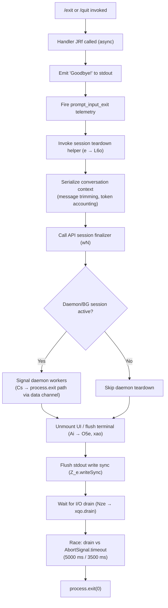

# `/exit`

> Analysis basis: CC v2.1.191 bundle.js (AST extraction + Claude interpretation)
> Minimum version: v2.1.191

---

## Overview

`/exit` (aliased as `/quit`) is a local, immediately-executing slash command that terminates the Claude Code CLI session. When invoked, the handler emits a "Goodbye!" farewell message, triggers session-end telemetry, tears down active UI components, flushes pending I/O, and calls `process.exit` to cleanly shut down the Node.js process.

---

## Registration

| Field | Value |
|---|---|
| type | `local-jsx` |
| name | `exit` |
| description | *(null — not set)* |
| aliases | `["quit"]` |
| immediate | `true` |
| module_id | `V4l` |
| load_inline | `true` |
| loc_byte | `12790043` |
| loc_byte_end | `12790239` |
| loc_line | `8624` |
| arbor_handler.name | `JRf` |
| arbor_handler.fqn | `claude-2.1.191::JRf` |
| arbor_handler.kind | `AsyncFunction` |
| arbor_handler.resolution_path | `module_id` |
| arbor_handler.n_hits | `1` |

Analysis basis: CC v2.1.191 bundle.js:+12790043

---

## Input Branching

The command has a predominantly linear flow upon invocation, with a small branch around whether a background (daemon) session is active during teardown. Two distinct sub-paths are present.



Analysis basis: CC v2.1.191 bundle.js:+12789302, +12789314, +12789318, +12789335, +12789349, +12789379, +12789462, +12789475

---

## Behavioral Spec

### 1. Entry Point — Handler `JRf`

```
async function exitCommandHandler(context):
    // Step 1: Output farewell
    emitToTerminal("Goodbye!")                  // literal at bundle.js:+12789266

    // Step 2: Emit session-end telemetry
    fireEvent("prompt_input_exit")              // literal at bundle.js:+12789480

    // Step 3: Invoke conversation context flush helper
    await flushSessionContext(context)          // calls sessionContextFlusher (e)

    // Step 4: Invoke API session finalizer
    await apiSessionFinalizer(context)          // calls apiSessionFinalizer (wN)

    // Step 5: Render final JSX output (farewell UI)
    renderJSX(farewellComponent)               // q4l.jsx call at bundle.js:+12789379

    // Step 6: Trigger deferred exit coordinator
    await exitCoordinator(context)             // calls exitCoordinator (Ai)
```

Analysis basis: CC v2.1.191 bundle.js:+12789302–12789475

---

### 2. Session Context Flush (`e` / `sessionContextFlusher`)

Serializes the current conversation state before exit. Trims the message list to a bounded window, accounts for token usage, and writes session metadata.

```
function sessionContextFlusher(sessionState):
    messages = sessionState.messages
    trimmedMessages = trimMessageWindow(messages, maxMessages=30)   // literal at bundle.js:+16668949

    for each message in trimmedMessages:
        if message.role == "user":                                  // literal at bundle.js:+16668982
            processUserMessage(message)
        elif message.role == "assistant":                           // literal at bundle.js:+16668999
            processAssistantMessage(message)

    tokenSummary = computeTokenUsage(trimmedMessages)               // calls wN (apiSessionFinalizer)
    contextOutput = buildContextOutput(tokenSummary)                // calls S4, usm, hsm
    return contextOutput
```

Analysis basis: CC v2.1.191 bundle.js:+16668916, +16668949, +16668982, +16668999, +16670698

---

### 3. Conversation Message Processor (`L6o` / `messageWindowProcessor`)

Operates on each message block, handling `text`, `tool_result`, and `tool_use` content types. Applies a 1000 ms debounce constant and a 300-character truncation threshold.

```
function messageWindowProcessor(messages, options):
    result = []
    tokenMap = new Map()

    for each message in messages.slice(0, 30):           // limit: bundle.js:+16668949
        contentBlocks = message.content

        for each block in contentBlocks:
            if block.type == "text":                     // literal at bundle.js:+16669206
                result.push(block)
            elif block.type == "tool_result":            // literal at bundle.js:+16669266
                truncated = block.content.slice(0, 300)  // threshold: bundle.js:+16669651
                result.push(truncated)
            elif block.type == "tool_use":               // literal at bundle.js:+16669676
                result.push(encodeToolCall(block))
            elif block.type == "tool":                   // literal at bundle.js:+16669446
                if block.isError:
                    result.push(block.content + " (error)")  // literal at bundle.js:+16669486

        tokenMap.set(message.id, computeAutoClassifierInput(message))

    joined = result.join(...)
    return joined
```

Analysis basis: CC v2.1.191 bundle.js:+16668916, +16669122, +16669138, +16669206, +16669266, +16669446, +16669486, +16669651, +16669676, +16669749, +16669769

---

### 4. Daemon/BG Session Finalizer (`Cs` / `daemonChannelFinalizer`)

Invoked when a background worker session is open. Logs a `cli_error` event if teardown is unclean, then unconditionally calls `process.exit(1)`.

```
function daemonChannelFinalizer(channel):
    sendData("data", payload, size=1024)       // literals at bundle.js:+17267623, +17267676

    if channel.hasError:
        logTelemetry("cli_error")              // literal at bundle.js:+13196572
        process.exit(1)                        // exit code 1: bundle.js:+13196598
    else:
        // channel closed gracefully
        process.exit(1)                        // always exits: bundle.js:+13196585
```

Analysis basis: CC v2.1.191 bundle.js:+13196562, +13196572, +13196585, +13196598, +17267623, +17267633, +17267676

---

### 5. Exit Coordinator (`Ai` / `exitCoordinator`)

The central shutdown orchestrator. Unmounts the UI, writes final terminal output, drains I/O, saves performance/telemetry data, and calls `process.exit`.

```
async function exitCoordinator(context):
    // Unmount active UI components
    terminalCleanup()                           // calls O5e: unmounts Ink UI, writes sync

    // Write goodbye to alt screen and restore cursor
    writeSync(Z_e, farewellText)               // bundle.js:+7346051
    restoreCursorPosition()                     // ANSI escape ESC-8 at bundle.js:+3882275

    // Save startup perf report if enabled
    flushStartupPerf()                          // calls TTt → P7o → kbe (file sync write)

    // Tear down MCP / background sessions
    shutdownAllConnections()                    // calls fUn, ks, xAt

    // Launch deferred teardown in parallel
    launchDeferredTeardown()                    // calls d (sessionFileWriter)

    // Race I/O drain against two timeouts
    timeoutA = 5000   // ms — bundle.js:+7345580
    timeoutB = 3500   // ms — bundle.js:+7345587

    result = await Promise.race([
        drainIO(),                              // calls Nze → xqo.drain at bundle.js:+67605
        AbortSignal.timeout(timeoutA),
        AbortSignal.timeout(timeoutB)
    ])                                          // bundle.js:+7345700, +7345865

    // Fire session_end telemetry
    fireEvent("session_end")                    // literal at bundle.js:+7345977

    // Optional: clear timeout guards
    clearTimeout(...)                           // bundle.js:+7345777

    process.exit(0)                             // via Rao at bundle.js:+7343148
```

Analysis basis: CC v2.1.191 bundle.js:+7342483, +7342561, +7342771, +7342940, +7343067, +7343100, +7343148, +7345483, +7345534, +7345551, +7345557, +7345563, +7345571, +7345580, +7345587, +7345596, +7345676, +7345700, +7345754, +7345765, +7345777, +7345825, +7345865, +7345901, +7345914, +7345926, +7345937, +7345974, +7346051

---

### 6. Terminal UI Unmount (`O5e` / `uiUnmounter`)

Writes a sync byte to the output descriptor, retrieves the active Ink render instance from the global registry, calls `.unmount()`, and invokes `IF` (the internal frame finalizer).

```
function uiUnmounter():
    writeSync(outputDescriptor, finalFrame)     // Z_e.writeSync at bundle.js:+7342483
    inkInstance = inkRegistry.get(instanceKey)  // Su.get at bundle.js:+7342510
    if inkInstance:
        inkInstance.unmount()                   // bundle.js:+7342561
    frameFinalize()                             // IF at bundle.js:+7342595
    flushFinalOutput()                          // Pvn at bundle.js:+7342643
```

Analysis basis: CC v2.1.191 bundle.js:+7342483, +7342510, +7342561, +7342595, +7342643

---

### 7. Final Output Flusher (`Pvn` / `finalOutputFlusher`)

Writes the last rendered output to the terminal, handling tmux/screen escape sequences and terminal-specific quirks.

```
function finalOutputFlusher(output):
    // Save cursor position (ESC 7)
    writeSync(vee, "\x1b7")                    // literal at bundle.js:+3882264
    writeContent(output)
    // Restore cursor position (ESC 8)
    writeSync(vee, "\x1b8")                    // literal at bundle.js:+3882275

    if terminal is tmux:                        // literal "tmux" at bundle.js:+3527621
        escapeTmuxSequences(output)             // calls Jw → e.replaceAll at bundle.js:+3527647
        // tmux wraps ESC-ESC
        applyEscapePrefix("\x1b\x1b")          // literal at bundle.js:+3527667
    elif terminal is "screen":                  // literal at bundle.js:+3527694
        applyScreenEscaping(output)

    // Terminal-specific version checks
    if terminalId == "ghostty" and version >= "1.2.0":   // literals at bundle.js:+3604138, +3604168
        applyGhosttyWorkaround(output)
    elif terminalId == "iTerm.app" and version >= "3.6.6": // literals at bundle.js:+3604207, +3604239
        applyiTermWorkaround(output)
```

Analysis basis: CC v2.1.191 bundle.js:+3882102, +3882264, +3882275, +3882284, +3882314, +3882336, +3527608, +3527621, +3527647, +3527667, +3527694, +3604138, +3604168, +3604207, +3604239

---

### 8. Process Exit Gate (`Rao` / `processExitGate`)

The final function that calls `process.exit`. It clears any pending timeout, retrieves the terminal state, optionally kills lingering child processes, and exits.

```
function processExitGate(context):
    clearTimeout(exitGuardTimer)                // bundle.js:+7343067
    termState = inkRegistry.get(stateKey)       // Su.get at bundle.js:+7343100

    if termState and termState.hasLingeringProcess:
        process.kill(termState.pid)             // bundle.js:+7343173
    
    process.exit(0)                             // bundle.js:+7343148

    // Defensive: if reached, throw
    throw new Error("unreachable")             // literal at bundle.js:+7343221
```

Analysis basis: CC v2.1.191 bundle.js:+7343067, +7343100, +7343148, +7343173, +7343215, +7343221

---

### 9. API Session Writer (`wN` / `apiSessionWriter`)

Prepares the final API-side session record before exit. This is a large function that serializes conversation history, computes cache tokens, resolves the model provider, and emits `tengu_api_success`.

```
async function apiSessionWriter(sessionData):
    messages        = sessionData.messages.map(formatMessage)   // bundle.js:+8938311
    startTime       = Date.now()                                // bundle.js:+8938970

    // Lone-surrogate sanitization pass
    sanitized = sanitizeMessages(messages)                      // triggers tengu_lone_surrogate_sanitized

    // Model/provider resolution
    providerConfig = resolveProvider(sessionData)               // calls oW (providerConfigResolver)
    
    // Cache control
    cacheKey = computeHash(messages)                            // SHo → JVa.createHash at bundle.js:+8936317
    cacheStrategy = "1h"                                        // literal at bundle.js:+8938216
    cacheConfig = buildCacheControl(cacheKey, cacheStrategy)    // literal "cache_control" at bundle.js:+8939497

    // Structured outputs
    structuredOutputsEnabled = checkFeature("structured_outputs") // literal at bundle.js:+8937455
    
    // Side query
    isSideQuery = context.type == "side_query"                  // literal at bundle.js:+8937327

    // Emit success telemetry
    fireEvent("tengu_api_success")                              // bundle.js:+8938998

    return sessionRecord
```

Analysis basis: CC v2.1.191 bundle.js:+8937282, +8937295, +8937327, +8937388, +8937420, +8937429, +8937441, +8937449, +8937455, +8937484, +8937499, +8937516, +8937525, +8937897, +8937964, +8938021, +8938174, +8938197, +8938241, +8938284, +8938295, +8938311, +8938401, +8938537, +8938627, +8938643, +8938658, +8938672, +8938685, +8938692, +8938735, +8938785, +8938893, +8938905, +8938970, +8938983, +8939029, +8939276, +8939287, +8939316, +8939412, +8939430, +8939465, +8939497

---

### 10. Deferred Session File Writer (`d` / `deferredSessionFileWriter`)

Writes the session transcript to disk after the main UI has been unmounted, allowing persistent history across invocations.

```
async function deferredSessionFileWriter(sessionState):
    fileEntry = await statFile(sessionFile)         // YVe → _Wl.stat at bundle.js:+13067942
    if not fileEntry.isFile():                      // bundle.js:+13068014
        reject("not a file")                        // Promise.reject at bundle.js:+13067987

    maxSize = 1048576                               // 1 MB cap, literal at bundle.js:+1048576 (13068033)

    if fileSize <= maxSize:
        // Write session JSON
        contentObj = buildSessionObject(sessionState)
        writeStream.write(JSON.stringify(contentObj)) // bundle.js:+17385860

    // Update internal watcher config
    configWatcher.stop()                            // E.stop at bundle.js:+17386136
    configWatcher.updateConfig(newConfig)           // bundle.js:+17386265
    configWatcher.start()                           // bundle.js:+17386283
```

Analysis basis: CC v2.1.191 bundle.js:+13067942, +13067965, +13067987, +13068014, +13068033, +17385843, +17385860, +17386062, +17386116, +17386136, +17386145, +17386256, +17386265, +17386283

---

## State & Side Effects

| Item | Detail |
|---|---|
| Telemetry — `prompt_input_exit` | Fired immediately on command invocation (bundle.js:+12789480) |
| Telemetry — `session_end` | Fired near the end of `exitCoordinator`, just before `process.exit` (bundle.js:+7345977) |
| Telemetry — `tengu_api_success` | Fired by `apiSessionWriter` if the final API write succeeds (bundle.js:+8938998) |
| Telemetry — `tengu_scroll_summary` | Fired during scroll/summary finalization in `fUn` (bundle.js:+7344996) |
| Telemetry — `tengu_cache_eviction_hint` | Fired inside the `exitCoordinator` context when cache slots are evicted on exit (bundle.js:+7345939) |
| Telemetry — `tengu_startup_perf` | Flushed to disk as part of the startup profiling report on exit (bundle.js:+226810) |
| Telemetry — `tengu_amber_creek` | Fired via `CSd` during connection/session teardown (bundle.js:+3537252) |
| Telemetry — `tengu_pewter_brook` | Fired via `ks` during local-agent teardown (bundle.js:+3537159) |
| Telemetry — `tengu_bg_retire_pinned_low_mem` | May fire during background worker cleanup sweep (bundle.js:+17375231) |
| Telemetry — `tengu_lone_surrogate_sanitized` | Fired if lone UTF-16 surrogates are found in messages (bundle.js:+8938694) |
| UI side effect | Ink UI is fully unmounted via `O5e`; cursor position is saved/restored with ANSI `ESC 7`/`ESC 8` |
| stdout flush | `Z_e.writeSync` called synchronously before process exit (bundle.js:+7342483, +7346051) |
| I/O drain | `xqo.drain` awaited with a 5 000 ms / 3 500 ms race timeout (bundle.js:+67605, +7345580, +7345587) |
| Session file write | Last conversation state written to disk by `deferredSessionFileWriter` (bundle.js:+17385843) |
| Startup perf file | Profiling data written synchronously via `kbe` (fsync) before process exits (bundle.js:+193032–193137) |
| `process.exit` code | Exit code `0` on clean path (via `Rao`); exit code `1` on daemon-error path (via `Cs`) (bundle.js:+7343148, +13196585, +13196598) |
| Terminal escape handling | tmux, screen, Ghostty, and iTerm2 each receive product-specific final-output sequences |

---

## Version History

| Version | Change |
|---|---|
| v2.1.191 | Initial analysis |

---

## Common Mistakes

1. **Using `/exit` to abort a running tool** — `/exit` is immediate (`immediate: true`) and does not wait for in-flight tool calls to complete. If a tool is actively running, use `Ctrl-C` first, then `/exit`.
2. **Expecting a non-zero exit code on success** — The clean exit path calls `process.exit(0)`. Only the daemon-error branch exits with code `1`. Shell scripts checking `$?` should not rely on a non-zero code to detect abnormal exit.
3. **Confusing `/quit` and `/exit`** — Both aliases are identical in behavior. The registration maps `"quit"` to the same handler (`JRf`). There is no behavioral difference.
4. **Interrupting before I/O drain completes** — The exit coordinator waits up to 5 000 ms for output to drain. Forcibly killing the process during this window may truncate the session file written by `deferredSessionFileWriter`.
5. **Expecting an interactive confirmation prompt** — `/exit` has no confirmation dialog. Invocation is final and immediate.

---

## Appendix — Identifier Mapping

> For bundle debugging only. Identifiers change across versions.

| Identifier | Role |
|---|---|
| `JRf` | Main exit command handler (AsyncFunction, resolved via module_id `V4l`) |
| `Ks` | Session state accessor called at handler entry |
| `HCe` | Sub-routine called by session state accessor |
| `e` | Session context flusher (conversation serialization coordinator) |
| `L6o` | Message window processor (trims, classifies, and encodes message blocks) |
| `gsm` | Token map setter called during message processing |
| `Cs` | Daemon channel finalizer (sends data frame, calls `process.exit`) |
| `har` | Message content encoder helper |
| `hx` | Character-level string slicer used by content encoder |
| `msm` | Auto-classifier input builder for context tips |
| `ke` | JSON serializer utility |
| `wN` | API session writer (final API call before exit) |
| `xf` | Sub-call from API session writer |
| `wt` | Low-level write utility |
| `oW` | Provider configuration resolver (large function building HTTP request context) |
| `mz` | Provider meta helper |
| `p3r` | String parser for provider config |
| `Mz` | Error formatter for provider resolution |
| `GPr` | URL encoder helper for provider config |
| `T` | Request header / log-level builder |
| `rt` | String coercion utility |
| `Ng` | Report-issue URL builder |
| `XKs` | Boolean coercion wrapper |
| `_y` | Auth/token resolution orchestrator |
| `_ud` | Token utility sub-helper |
| `xr` | Token store accessor |
| `Kdn` | Proxy-auth helper resolver |
| `Iud` | HTTP request builder (handles content-type, bedrock, eventstream) |
| `PH` | Mantle/bedrock config builder |
| `G2` | Provider pair initializer |
| `fy` | Proxy-auth credential assembler |
| `Tud` | Request finalizer helper |
| `yud` | Provider subtype dispatcher (vertex, foundry, gateway, etc.) |
| `SCe` | Side-query async poller |
| `Rdr` | Timestamp recorder |
| `pMt` | Header case-normalizer |
| `dve` | SDK error/warn/info/debug logger |
| `BSn` | Native fetch dispatcher |
| `D` | Supervisor/error stream writer |
| `x` | Active-request registry manager |
| `v` | Focus/blur state tracker |
| `Ooe` | Environment capability checker |
| `nv` | Notification helper |
| `yA` | Profile-implicit auth resolver |
| `ACe` | WIF token exchange handler |
| `TZe` | WIF credentials resolver (makes fetch calls) |
| `I` | Token pagination / scroll handler |
| `h` | Stream wrapper |
| `b2e` | Request capability feature-checker |
| `ao` | Application-inference-profile resolver |
| `o1` | Inner request helper |
| `lie` | Foundry resource name resolver |
| `vOr` | Foundry URL replacer |
| `_` | Structured-output schema registry |
| `a` | Schema entry accessor |
| `CBp` | Model-matching finder |
| `SHo` | SHA-256 hash builder for cache key |
| `Ghn` | Session metadata serializer |
| `ol` | String coercion layer |
| `_r` | Internal render target reference |
| `uu` | Session store helper |
| `$hn` | Async-local-storage store getter |
| `hCe` | Context header emitter |
| `aIn` | Render target initializer |
| `aje` | Prompt-cache configuration builder |
| `To` | Cache injection helper |
| `dpr` | Cache debug printer |
| `nt` | Background task registry accessor |
| `ppr` | Cache probe utility |
| `wD` | Model/provider pair builder |
| `C3r` | Config reader for provider pair |
| `A2e` | Model alias resolver |
| `L` | Background worker sweep coordinator |
| `Nzt` | Memory threshold checker |
| `J8l` | Background retire-grace bridge |
| `I3e` | Session file reader/cleanup |
| `Le` | Log-error emitter |
| `Gn` | Utility wrapper |
| `W` | Shared state object |
| `Xer` | Background attach upgrader |
| `q` | Queue manager with backspace handling |
| `ZVa` | Message validator |
| `sp` | String replacement sanitizer |
| `XSn` | Ambient-temperature feature checker |
| `av` | Array mapper utility |
| `Txe` | Tool-call context builder |
| `P4` | Random-bytes tool ID generator |
| `Sc` | Tool scheduler |
| `etn` | Object key expander |
| `Qen` | JSON-like text tester |
| `iD` | Structured clone wrapper |
| `u7e` | Message pop helper |
| `Zen` | Replacement string builder |
| `Ve` | Render element factory |
| `eze` | Base UI element |
| `LOr` | Response header parser |
| `l7s` | MIME / header field splitter |
| `wOr` | Foundry route matcher |
| `mbe` | Model-fingerprint helper |
| `Tr` | Render tree accessor |
| `lh` | Layout helper |
| `Oo` | Output formatter |
| `H1t` | Startup-perf reporter |
| `v3i` | Perf report file locator |
| `Rot` | Perf log emitter |
| `h1t` | Perf checkpoint collector |
| `NF` | Agent-name resolver |
| `nOd` | Built-in / custom agent dispatcher |
| `xD` | `repl_main_thread` type checker |
| `kAt` | Cache-control applier |
| `S4` | Conversation output composer |
| `ev` | Output variant builder |
| `PPr` | Provider-prefix router |
| `zp` | Request pipeline entry |
| `usm` | User-message serializer |
| `csm` | Content segment mapper |
| `hsm` | History segment builder |
| `M6n` | Model name finder |
| `cSt` | Context-tip UI component |
| `Pe` | UI primitive component |
| `Re` | Response render component |
| `D6n` | Schema safe-parser |
| `we` | Warning render component |
| `Ae` | String conversion component |
| `JEe` | Detach-request handler |
| `Jhn` | Session-detach sub-handler |
| `cAl` | Background task launcher |
| `wKn` | Task queue writer |
| `An` | Background session object factory |
| `Z6` | Output stream writer for detach |
| `Hde` | Detach completion notifier |
| `Sm` | Shared model reference |
| `M7n` | Scheduled-task record builder |
| `bI` | Task bootstrap |
| `Mcf` | Task metadata formatter |
| `aP` | Cron-expression parser |
| `f` | Worker process lifecycle manager |
| `m` | Worker kill helper |
| `p` | Forced-shutdown coordinator |
| `l` | Recurrence rule matcher |
| `g` | Date computation helper |
| `K1` | Cron token parser |
| `k4d` | Cron field expander |
| `Fst` | Next-fire-time calculator |
| `c` | Date mutation helper |
| `Wi` | Duration formatter |
| `ka` | Terminal string truncator |
| `rn` | Grapheme-aware string width measurer |
| `Ds` | Display string trimmer |
| `Zy` | Ellipsis appender |
| `XRf` | Farewell UI component builder |
| `Ai` | Exit coordinator (central shutdown orchestrator) |
| `O5e` | UI unmounter (Ink `.unmount()` caller) |
| `IF` | Internal frame finalizer |
| `Pvn` | Final output flusher (terminal-escape-aware) |
| `$Be` | Terminal-version capability checker |
| `DBe` | Terminal capability applier |
| `Jw` | tmux escape-sequence wrapper |
| `up` | ANSI cursor control emitter |
| `xao` | Final terminal write coordinator |
| `Aw` | Alternate-screen writer |
| `R9` | Terminal reset helper |
| `e3t` | Runtime directory locator |
| `A2` | Worker process path resolver |
| `Hr` | Worker host resolver |
| `Gt` | Path join helper |
| `yg` | Worker config reader |
| `Fc` | Worker filesystem checker |
| `zCa` | Terminal cleanup string builder |
| `Rao` | Process exit gate (final `process.exit` caller) |
| `Nze` | stdout drain awaiter |
| `d` | Deferred session file writer |
| `YVe` | Session file existence checker |
| `dn` | Disk-write helper |
| `qs` | Async-local-storage session accessor |
| `_No` | Fallback session path resolver |
| `yWl` | Session JSON layout builder |
| `E` | Config watcher manager |
| `vSt` | BLC-backed status tracker |
| `fo` | Error string builder |
| `A` | Secondary config watcher |
| `U2t` | Watcher update dispatcher |
| `h0c` | Heartbeat manager |
| `tae` | Heartbeat tick handler |
| `iva` | Settled-promise aggregator |
| `TTt` | Startup perf flush coordinator |
| `hmr` | Perf mark recorder |
| `$7o` | Perf data aggregator |
| `P7o` | Perf report writer |
| `U7o` | Perf output path builder (startup-perf) |
| `kbe` | Synchronous file writer (fsync-safe) |
| `R7o` | Perf entry serializer |
| `O9` | Node `require` wrapper for perf_hooks |
| `F7o` | Perf secondary output path builder |
| `fUn` | Scroll/summary teardown helper |
| `KCa` | Scroll state accessor |
| `qCa` | Scroll summary finalizer |
| `WCa` | Scroll metric writer |
| `ks` | Local-agent session teardown orchestrator |
| `U2` | Agent registry checker |
| `Bk` | Sound/notification-enabled checker |
| `kGr` | Agent config reader |
| `cee` | ISd-backed session closer |
| `RGr` | Wt-based boolean flag resolver |
| `Rr` | vj-backed renderer reference |
| `CSd` | nt-backed session data flusher |
| `xAt` | Cross-platform exit cleanup |
| `U5e` | Promise-resolve wrapper for deferred shutdown |
| `cUn` | Child unmount coordinator |

---

Note: index built via Arbor fallback; some signals (telemetry, literals) may be missing — see arbor-fallback.js.