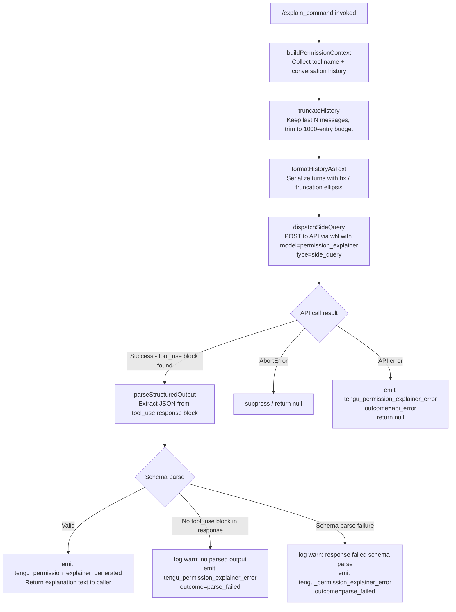

# `/explain_command`

> Analysis basis: CC v2.1.191 bundle.js (AST extraction + Claude interpretation)
> Minimum version: v2.1.191

---

## Overview

The `explain_command` tool is an internal slash command that generates a human-readable permission explanation for a given tool or command. It dispatches a side-query API call to a permission-explainer model, parses the structured output, and emits telemetry for success or failure conditions. The command is used primarily to surface policy rationale to the user when Claude Code needs to justify a permission decision.

---

## Registration

| Field | Value |
|---|---|
| type | `tool` |
| name | `explain_command` |
| description | `null` |
| loc_byte | `14690929` |
| loc_byte_end | `14690965` |
| loc_line | `11113` |
| arbor_handler.name | `_cc` |
| arbor_handler.fqn | `claude-2.1.191::_cc` |
| arbor_handler.kind | `AsyncFunction` |
| arbor_handler.resolution_path | `direct` |
| arbor_handler.n_hits | `1` |

Analysis basis: CC v2.1.191 bundle.js:+14690929

---

## Input Branching

The handler has 4+ distinct branches (conversation history assembly, API dispatch, response parse success, parse failure, abort/API error). A Mermaid flowchart is used.



---

## Behavioral Spec

### Handler Entry Point: `_cc` (AsyncFunction)

The Arbor-resolved handler is `_cc` (FQN: `claude-2.1.191::_cc`, resolved via `direct` path).

```
async function explainCommandHandler(toolInput, appContext):
    startTime = Date.now()                          // bundle.js:+14690648

    // 1. Resolve conversation history
    rawHistory = getConversationHistory(appContext) // calls U4o → kt
    truncatedHistory = truncateAndFilterHistory(rawHistory)
                                                    // calls kYf, bundle.js:+14690687

    // 2. Format history for prompt
    formattedText = formatHistoryText(truncatedHistory)
                                                    // uses hx for surrogate-safe truncation
                                                    // appends "..." sentinel at truncation point
                                                    // bundle.js:+14690416, +14690424

    // 3. Build request payload
    payload = buildPermissionExplainerPayload(
        toolName  = toolInput.name,                 // bundle.js:+14690947
        modelHint = "permission_explainer",         // bundle.js:+14690987
        history   = formattedText,
        maxTokens = 500                             // bundle.js:+14691240
    )
    payload = applyJSONStringify(payload)           // via ke → JSON.stringify, bundle.js:+14691220

    // 4. Dispatch side-query to API
    response = await dispatchAPICall(
        type    = "side_query",                     // bundle.js:+8937327
        payload = payload,
        context = appContext
    )                                               // via wN, bundle.js:+14690847

    // 5. Parse structured output
    parsed = parseToolUseBlock(response)            // via Es → E4 → Na, bundle.js:+14690834

    if parsed is absent:
        log("[context-tips] no tool_use block in response")
                                                    // bundle.js:+16671216
        emitTelemetry("tengu_permission_explainer_error",
                       outcome = "parse_failed")    // bundle.js:+14691624
        return null

    if schemaValidation(parsed) fails:
        log("[context-tips] response failed schema parse")
                                                    // bundle.js:+16671438
        emitTelemetry("tengu_permission_explainer_error",
                       outcome = "parse_failed")
        return null

    emitTelemetry("tengu_permission_explainer_generated")
                                                    // bundle.js:+14691412
    return parsed.explanationText
```

Analysis basis: CC v2.1.191 bundle.js:+14690624 (`_cc` → `U4o`), +14690669 (`_cc` → `RYf`), +14690687 (`_cc` → `kYf`), +14690834 (`_cc` → `Es`), +14690847 (`_cc` → `wN`)

---

### Sub-feature: History Collection (`U4o` → `kt`)

```
function collectHistory(appContext):
    raw = getAppStateMessages(appContext)   // kt → Gt, C2o, bundle.js:+13864113
    configGuard()                          // tEt checks config access guard
                                           // throws "Config accessed before allowed."
                                           // if called too early, bundle.js:+13867869
    files = readConfigFiles()              // tEt → r.readFileSync, encoding "utf-8"
                                           // bundle.js:+13867925, +13867952
    backups = resolveBackupDir()           // L2o → DS.basename, "backups" subdir
                                           // bundle.js:+13867437, +13867477
    return raw
```

Analysis basis: CC v2.1.191 bundle.js:+14690624, +13864113, +13867869

---

### Sub-feature: History Truncation and Filtering (`kYf`)

```
function truncateAndFilterHistory(messages):
    // Filter: retain up to 1000 most-recent entries (number literal: 1000)
    filtered = messages.filter(...)        // bundle.js:+14690205, literal 1000 at +14690193
    reversed = filtered.reverse()          // bundle.js:+14690273
    // Re-insert in reverse order, prepend "..." if truncated
    result = reversed                      // via hx surrogate-safe slicer
    result.unshift("...")                  // bundle.js:+14690432, literal "..." at +14690424
    return result.join(separator)          // bundle.js:+14690465
```

Constants:
- History entry budget: `1000` (bundle.js:+14690193)
- Truncation sentinel: `"..."` (bundle.js:+14690424)
- JSON stringify indent: `2` (bundle.js:+14690149)

Analysis basis: CC v2.1.191 bundle.js:+14690205, +14690273, +14690416, +14690432

---

### Sub-feature: Surrogate-Safe Text Slicer (`hx`)

```
function surrogateAwareSlice(str, maxLen):
    // Detect surrogate pairs via charCodeAt
    // If codepoint in range [55296, 56319] (high surrogate), skip pair
    // Return safely truncated string
    // bundle.js:+202749, +202777, +202787
    if charCodeAt(pos) >= 55296 and <= 56319:
        advance two code units
    return str.slice(0, safePos)           // bundle.js:+202734, +202793
```

Constants:
- High surrogate lower bound: `55296` (bundle.js:+202777)
- High surrogate upper bound: `56319` (bundle.js:+202787)

Analysis basis: CC v2.1.191 bundle.js:+202749, +202777, +202787

---

### Sub-feature: Side-Query API Dispatch (`wN`)

```
async function dispatchSideQuery(payload, context):
    // Determine model tier / routing
    buildAPIClientOptions(context)          // oW → sets headers:
                                            //   "User-Agent", "X-Claude-Code-Session-Id"
                                            //   "x-app", "x-claude-code-agent-id"
                                            //   bundle.js:+3025831..+3026035
    // Check OAuth / auth
    checkOAuthToken()                       // [API:auth] OAuth token check starting/complete
                                            // bundle.js:+3026414, +3026468
    // Send HTTP request
    response = await globalThis.fetch(...)  // bundle.js:+8937388
    // Handle lone surrogates in response
    sanitized = sanitizeLoneSurrogates(response)
                                            // tengu_lone_surrogate_sanitized if triggered
                                            // bundle.js:+8938694
    emitTelemetry("tengu_api_success", ...)
                                            // bundle.js:+8938998
    return sanitized
```

Analysis basis: CC v2.1.191 bundle.js:+14690847, +8937327, +8937388, +8938998

---

### Sub-feature: Permission Explainer Output Parser (`Es` → `E4` → `Na`)

```
function parsePermissionExplainerResponse(apiResponse):
    // Walk message content blocks
    for block in apiResponse.content:
        if block.type == "tool_use":
            raw = block.input
            // Parse and normalize: trim, toLowerCase where needed
            // via Qo normalizer chain (trim → toLowerCase → type routing)
            // bundle.js:+2301590, +2301601
            result = schemaValidate(raw)    // D6n → t.safeParse, bundle.js:+8934129
            if result.success:
                return result.data
    return null
```

Analysis basis: CC v2.1.191 bundle.js:+14690834, +2285395, +2281664, +8934129

---

### Sub-feature: MCP Tool Identity Check (`$i`)

```
function isMCPTool(toolName):
    if Object.hasOwn(toolDescriptor, key):
        if toolName.startsWith("mcp__"):   // bundle.js:+3307711, literal "mcp__" +3307724
            return true, category = "mcp_tool"
                                           // bundle.js:+3307743
    return false
```

Constants:
- MCP tool prefix: `"mcp__"` (bundle.js:+3307724)
- MCP category label: `"mcp_tool"` (bundle.js:+3307743)

Analysis basis: CC v2.1.191 bundle.js:+14691462, +3307711, +3307724

---

### Sub-feature: Error Categorization (`we`, `Lt`, `Ae`, `Re`)

```
function categorizeExplainerError(err):
    if err.name == "AbortError":           // bundle.js:+14692082
        return null                        // suppress silently
    else:
        emitTelemetry("tengu_permission_explainer_error",
                       outcome = "api_error")  // bundle.js:+14692153
        emitTelemetry("tengu_feature_bad")     // bundle.js:+1025792
        return null

function reportSuccess():
    emitTelemetry("tengu_feature_ok")      // bundle.js:+1025725
    emitTelemetry("tengu_permission_explainer_generated")
                                           // bundle.js:+14691412
```

Analysis basis: CC v2.1.191 bundle.js:+14691511, +14691706, +14691963, +14692082, +14692118, +14692153

---

### Sub-feature: Permission Explainer Generation Event (`we`)

```
function onPermissionExplainerGenerate(result):
    emitTelemetry("permission_explainer_generate",  // literal bundle.js:+14691514
                   result = result)
    // Also triggers "we" feature-flag check path
    // bundle.js:+14691511
```

Analysis basis: CC v2.1.191 bundle.js:+14691514

---

## State & Side Effects

| Item | Detail |
|---|---|
| Telemetry: `tengu_permission_explainer_generated` | Fired on successful parse of permission explainer output (bundle.js:+14691412) |
| Telemetry: `tengu_permission_explainer_error` | Fired on parse failure (outcome=`parse_failed`) or API error (outcome=`api_error`) (bundle.js:+14691624) |
| Telemetry: `tengu_api_success` | Fired after a successful raw API response from the side-query (bundle.js:+8938998) |
| Telemetry: `tengu_lone_surrogate_sanitized` | Fired if the API response contained lone UTF-16 surrogates that were sanitized (bundle.js:+8938694) |
| Telemetry: `tengu_feature_ok` | Fired on feature flag check passing (bundle.js:+1025725) |
| Telemetry: `tengu_feature_bad` | Fired on feature flag check failure (bundle.js:+1025792) |
| Telemetry: `tengu_feature_sad` | Fired on feature flag check error path (bundle.js:+1025873) |
| Telemetry: `tengu_config_parse_error` | Fired if config file JSON cannot be parsed (bundle.js:+13869283) |
| Telemetry: `tengu_prompt_cache_1h_config` | Fired when 1-hour prompt cache config is in effect (bundle.js:+13616098) |
| Telemetry: `tengu_bg_retire_pinned_low_mem` | Fired by background worker manager under low-memory conditions (bundle.js:+17375231) |
| Telemetry: `tengu_bg_prewarm_per_sweep` | Fired during background worker prewarm sweep (bundle.js:+17375352) |
| Telemetry: `tengu_context_tip_classifier_outcome` | Fired by context tip classifier side-query path (bundle.js:+16672225) |
| Hook registration | `_i` → `xqo.register` (bundle.js:+67562); file-watch via `$vt` → `Tps.watchFile` (bundle.js:+1144855) |
| appState changes | History read (read-only); no mutation of conversation state detected |
| Config backup | `tEt` creates backup directory (`"backups"` subdir), copies config file with `Date.now()` timestamp suffix (bundle.js:+13868852, +13868866) |
| Sound | None detected in depth-2 traversal |
| File I/O | `r.readFileSync` (UTF-8), `r.mkdirSync`, `r.readdirStringSync`, `r.copyFileSync` used by config subsystem (bundle.js:+13867925, +13868568, +13868589, +13868866) |
| Network | `globalThis.fetch` via `wN`/`oW` API client; headers include `User-Agent`, `X-Claude-Code-Session-Id`, `x-claude-code-agent-id` (bundle.js:+3025859, +3025877, +3026035) |

---

## Version History

| Version | Change |
|---|---|
| v2.1.191 | Initial analysis |

---

## Common Mistakes

1. **Calling `/explain_command` before config is initialized** — The config guard at `tEt` throws `"Config accessed before allowed."` if accessed too early in the startup sequence. Ensure the config subsystem has completed initialization before invoking this command (bundle.js:+13867869).
2. **Expecting a description in the registration** — The `description` field is `null`; do not rely on it for UI display. The command is identified solely by `name: "explain_command"`.
3. **Assuming synchronous output** — The handler is an `AsyncFunction`. Callers must `await` the result; a non-awaited call silently drops the explanation.
4. **Misinterpreting `parse_failed` telemetry** — `tengu_permission_explainer_error` with `outcome=parse_failed` can mean either (a) the API response had no `tool_use` block, or (b) the tool-use block failed schema validation. Both are reported under the same outcome key.
5. **Treating `AbortError` as a real failure** — An aborted request returns `null` silently without firing `tengu_permission_explainer_error`. Callers should treat `null` returns as a possible abort, not exclusively an error.
6. **Confusing `explain_command` with `mcp__` prefixed tools** — The `$i` guard explicitly checks `startsWith("mcp__")` for MCP tool categorization (bundle.js:+3307724). The `explain_command` tool itself is not MCP-namespaced; it is a first-party tool registered at line 11113.

---

## Appendix — Identifier Mapping

> For bundle debugging only. Identifiers change across versions.

| Identifier | Role |
|---|---|
| `_cc` | Main async handler for `explain_command` (Arbor FQN: `claude-2.1.191::_cc`) |
| `U4o` | Conversation history collector (delegates to `kt`) |
| `kt` | Core history/config accessor; dispatches to config reader (`tEt`) and watcher (`K9f`) |
| `Gt` | General-purpose getter / accessor utility |
| `C2o` | Secondary config/context reader |
| `tEt` | Config file reader with guard, backup logic, and ENOENT handling |
| `$t` | JSON parser wrapper (`JSON.parse`) |
| `n4` | String prefix stripper (`startsWith` + `slice`) |
| `dn` | Utility called during config load (role unclear at depth 2) |
| `L2o` | Backup directory resolver using `DS.basename`, `readdirStringSync`, `statSync` |
| `T` | Token/model-string normalizer (trim, toUpperCase, includes routing) |
| `R2o` | Path joiner for backup/config directories (`DS.join` + `Zn`) |
| `m` | Process/worker map iterator (`n.values`, `k.kill`) |
| `W` | Shared state writer / event emitter (called at multiple sites) |
| `K9f` | File-watch registration for config changes; calls `$vt`, `Hpe`, `_i` |
| `$vt` | File watcher setup via `Tps.watchFile` |
| `Hpe` | Hook/callback handler registered with watcher |
| `_i` | Hook registrar (`xqo.register`) |
| `RYf` | Payload builder: serializes tool name via `ke` (JSON.stringify) and `String` coercion |
| `ke` | JSON stringify wrapper |
| `kYf` | History truncation and reversal function |
| `e` | Context-tip classifier pipeline entry (side-query for tips) |
| `L6o` | Message formatter: maps history turns to text segments |
| `gsm` | Message-segment cache setter (`t.set`) |
| `har` | Token estimator / history accumulator |
| `o` | Column formatter (`s.map`, `i.padEnd`) |
| `msm` | Message segment cache getter and auto-classifier input serializer |
| `wN` | Main API dispatch function (side-query HTTP client) |
| `xf` | App-context accessor (`wt`) |
| `oW` | API HTTP client builder (headers, auth, model routing) |
| `h` | Helper/state accessor (`s`) |
| `b2e` | Model compatibility checker (claude-3-, opus-4-0, sonnet-4-0 prefix checks) |
| `lie` | Token/auth lookup via `$At`, `n.get`, `vOr` |
| `_` | Conversation accumulator array (includes/push) |
| `CBp` | Cache/context finder (`e.find`, `n.find`) |
| `SHo` | SHA-256 hash generator (`JVa.createHash`, "sha256", "hex") |
| `Ghn` | API response normalizer / session tracker |
| `aIn` | Response accumulator (`_r`) |
| `aje` | Context pruner / memory-relevance filter (repl thread, sdk, auto_mode) |
| `wD` | Token budget calculator (`C3r`, `A2e`) |
| `L` | Background worker lifecycle manager (respawn, retire, prewarm sweep) |
| `ZVa` | Structured output serializer/validator |
| `sp` | String replacer (`e.replace`) |
| `XSn` | Request-level settings builder (`sW`, `ao`, temperature) |
| `av` | Array mapper (`e.map`) |
| `Txe` | Tool-call serializer (`Ca`, `Array.isArray`, `T`, `P4`, `Sc`, `wt`, `ke`) |
| `etn` | Message tree walker (pop, push, Object.keys for turn assembly) |
| `iD` | Deep-clone utility (`structuredClone`) |
| `u7e` | Alternate message walker (`Zen`, `Qen`) |
| `Ve` | Visibility/feature flag evaluator (`eze`) |
| `LOr` | Log/output router (`_r`, `l7s`) |
| `wOr` | Cache-control validator (`vOr`, `$At`, `r.get`, `t.every`, `s.add`, `r.set`) |
| `mbe` | Performance metric recorder |
| `Tr` | Timing/render tracker (`lh`, `Ve`) |
| `Oo` | Output formatter (`eze`) |
| `H1t` | Notification or hook trigger (`v3i`, `Rot`, `h1t`) |
| `NF` | Sub-agent identity check (`nOd`, `xD`, `Le`); "subagent" literal |
| `kAt` | Cache-control tag applicator ("cache_control", "ephemeral") |
| `S4` | Event emitter wrapper (`ev`, `PPr`) |
| `ev` | Base event emitter |
| `PPr` | Pipe/propagator (`zp`) |
| `usm` | Classifier pipeline runner (`csm`) |
| `csm` | Message-to-classifier input mapper (`e.map`) |
| `hsm` | Text assembler for classifier context (`t.push`, `t.join`) |
| `M6n` | Tool-use block finder (`e.find`) |
| `cSt` | Context state writer (`W`, `Pe`) |
| `Pe` | UI state primitive (`eze`) |
| `Re` | Error-path reporter (`W`, `Pe`) |
| `D6n` | Schema validator (`t.safeParse`) |
| `we` | Feature-ok emitter path (`W`, `Pe`) |
| `Ae` | String coercion wrapper (`String`) |
| `n` | Name lowercaser (`i.toLowerCase`) |
| `i` | Stream/connection closer (`n.close`, `r.close`) |
| `s` | Resource lifetime manager (`r.add`, `i.finally`, `r.delete`) |
| `hx` | Surrogate-aware string slicer (`charCodeAt`, `slice`) |
| `Es` | Permission explainer response parser entry (`E4`, `Qo`) |
| `E4` | Parser dispatcher (`L_`, `nj`, `jo`, `Na`) |
| `L_` | Parser initialization |
| `nj` | Node/token walker |
| `Na` | Full prompt/model output normalizer (trim, toLowerCase, type routing, policy) |
| `Nwt` | Grammar/token table loader (`mgs`, `fgs`) |
| `Uwt` | Object-key enumerator and schema flattener |
| `NFe` | Field normalizer (trim, `Dk`, `Qo`) |
| `Xme` | Extended model expression parser (`_r`, `Vqu`, `kPr`) |
| `il` | String replacer/cleaner (`e.replace`) |
| `l` | Locale/region resolver (`rGl`) |
| `OFe` | Operator-set checker (`jqu.includes`) |
| `Dk` | Keyword/domain classifier (`Yme.includes`) |
| `xhn` | Nested normalizer (calls `Na` recursively) |
| `GKs` | Object-entry iterator for schema fields |
| `In` | Index/version lookup (`vln`, `z2`) |
| `PQe` | Policy entry resolver (`Rr`, `Object.entries`) |
| `BKs` | Boundary/index finder (`OFe`, `n.indexOf`) |
| `qqu` | Qualifier parser (`Dk`, `r0t`, `Qo`, `FKs`) |
| `Qo` | Central token normalizer (trim, toLowerCase, type dispatch: fable/opusplan/sonnet/haiku/opus/best) |
| `r0t` | Raw-token normalizer (toLowerCase, startsWith "claude-", `ed`, `tie`) |
| `Kqu` | Keyword-qualified parser (`Dk`, `Qo`, `$Ks`, startsWith) |
| `rH` | Response handler dispatcher (`Qo`, `Fw`) |
| `Fw` | Full response parser (`OPr`, `Phn`, `Dhn`) |
| `OPr` | Output-property resolver (To, aie, gCe, tge, ed, _r, zp, String, eCe, $w) |
| `Phn` | Property-header normalizer (extensive field walking: jo, VKs, Object.keys/entries, Qo, Na, etc.) |
| `Dhn` | Dependent-header normalizer (`Xme`, `NFe`, `Na`, `Qo`, `fA`, n.slice) |
| `$i` | MCP tool identity guard (`Object.hasOwn`, `lh`, startsWith "mcp__") |
| `lh` | Lookup helper (`eze`) |
| `eze` | Base key-value store / primitive state cell |
| `Lt` | Feature-sad / error path emitter (`W`, `Pe`) |