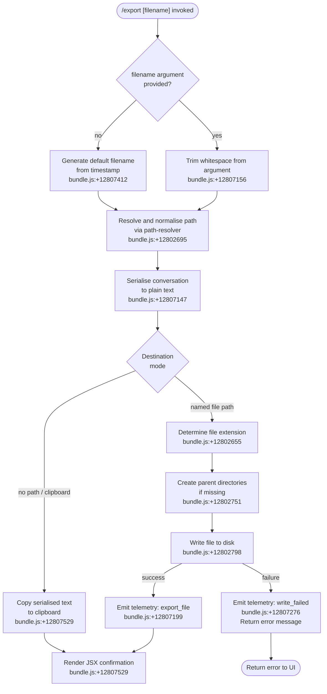

# `/export`

> Analysis basis: CC v2.1.191 bundle.js (AST extraction + Claude interpretation)
> Minimum version: v2.1.191

---

## Overview

The `/export` command serializes the current conversation to a human-readable text form and either writes it to a named file on disk or copies it to the system clipboard. It accepts an optional filename argument; when no filename is provided the command falls back to a clipboard operation. The command renders a JSX confirmation component after completing the operation.

---

## Registration

| Field | Value |
|---|---|
| type | `local-jsx` |
| name | `export` |
| description | `Export the current conversation to a file or clipboard` |
| argumentHint | `[filename]` |
| module_id | `u5l` |
| load_inline | `true` |
| loc_byte | `12807697` |
| loc_byte_end | `12807893` |
| loc_line | `8627` |
| arbor_handler.name | `pkf` |
| arbor_handler.fqn | `claude-2.1.191::pkf` |
| arbor_handler.kind | `AsyncFunction` |
| arbor_handler.resolution_path | `module_id` |
| arbor_handler.n_hits | `0` |

Analysis basis: CC v2.1.191 bundle.js:+12807697

---

## Input Branching

The command has four distinct branches based on the presence/absence of a filename argument and the success/failure of the write operation, so a Mermaid flowchart is used.



---

## Behavioral Spec

### Main Handler — `asyncExportHandler` (`pkf`)

The handler is an `AsyncFunction` resolved via `module_id → u5l` by the Arbor symbol graph.

```
async function asyncExportHandler(commandArgs, appContext):

    // 1. Parse argument
    rawArg   = commandArgs.trim()                    // +12807156
    filename = rawArg if rawArg != "" else null

    // 2. Serialise conversation
    serialisedText = buildConversationText(appContext)  // dkf → WZn → ckf path

    // 3. Resolve destination
    if filename is not null:
        resolvedPath = resolveAndNormalisePath(filename) // jZn → skf → ys
        await ensureParentDirectory(resolvedPath)        // BZn.mkdir  +12802751
        try:
            await writeFileToDisk(resolvedPath, serialisedText)  // BZn.writeFile +12802798
            emitTelemetry("export_file")                          // +12807199
            return renderSuccessJSX(resolvedPath)                 // d5l.jsx +12807529
        catch error:
            emitTelemetry("write_failed")                         // +12807276
            msg = error.message ?? "Unknown error"                // +12807357
            return renderErrorJSX(msg)
    else:
        copyToClipboard(serialisedText)
        return renderSuccessJSX(null)                             // +12807529
```

Analysis basis: CC v2.1.191 bundle.js:+12807147

---

### Conversation Serialiser — `buildConversationText` (`dkf` → `WZn` → `ckf`)

Transforms the in-memory message list into a flat, human-readable string.

```
function buildConversationText(appContext):
    lines = []

    for each message in conversationHistory:          // WZn r.push +12806118
        role   = message.role                          // "user" / "assistant" literals +16668982/+16668999
        text   = stripANSIEscapes(renderContent(message))  // mc → Bun.stripANSI +3941701
        lines.push(formatRoleBlock(role, text))

    return lines.join(separator)                       // WZn r.join +12806145
```

The inner `renderContent` function (`ckf`) handles both plain `text` blocks and `tool_use` / `tool_result` blocks (literals at +16669446, +16669676, +16669266).  Tool result entries that represent errors are suffixed with `" (error)"` (+16669486).  Tool-use entries are truncated to 300 characters (+16669651).  Analysis basis: CC v2.1.191 bundle.js:+12806100

---

### Message Content Formatter — `messageFormatter` (`L6o`)

Processes a single message's content array into a text representation.

```
function messageFormatter(message, toolResultMap):
    output = []

    for each contentBlock in message.content:
        if contentBlock.type == "text":               // +16669206
            output.push(contentBlock.text)

        else if contentBlock.type == "tool_result":   // +16669266
            toolOutput = toolResultMap.get(contentBlock.tool_use_id)
            output.push(formatToolResult(toolOutput))

        else if contentBlock.type == "tool_use":      // +16669676
            // Truncate at 300 chars                   // +16669651
            snippet = truncate(JSON.stringify(contentBlock.input), 300)
            output.push(snippet)

    // Trim runs of whitespace longer than 30 chars    // +16668949
    return collapseWhitespace(output.join(""), maxRun=30)
```

Analysis basis: CC v2.1.191 bundle.js:+16668916

---

### Path Resolver — `resolveAndNormalisePath` (`skf`)

Derives the absolute output path from the user-supplied filename string.

```
function resolveAndNormalisePath(userInput):
    ext = path.extname(userInput)           // GZn.extname +12802655
    // Validate and normalise via ys
    normalised = normalisePath(userInput)   // ys +12802695
    return normalised
```

`normalisePath` (`ys`) applies NFC Unicode normalisation (+66199/+66187), expands `~/` to the home directory (`ran.homedir` +1096034), resolves relative paths (`GO.resolve` +1096248), and rejects paths containing null bytes with a `TypeError` ("Path contains null bytes" +1095937).

Analysis basis: CC v2.1.191 bundle.js:+12802731

---

### Default Filename Generator — `timestampFilename` (`ukf`)

Generates a timestamp-based filename when no argument is supplied.

```
function timestampFilename(now: Date):
    year    = padLeft(now.getFullYear(), 4)    // +12806355
    month   = padLeft(now.getMonth() + 1, 2)  // +12806380
    day     = padLeft(now.getDate(), 2)        // +12806421
    hours   = padLeft(now.getHours(), 2)       // +12806459
    minutes = padLeft(now.getMinutes(), 2)     // +12806498
    seconds = padLeft(now.getSeconds(), 2)     // +12806539
    return "claude-" + year + month + day + "-" + hours + minutes + seconds + ".txt"
```

Analysis basis: CC v2.1.191 bundle.js:+12806355

---

### Conversation Finder / Context Extractor — `conversationFinder` (`l5l`)

Locates the active conversation object from application state before serialisation begins.

```
function conversationFinder(stateArray):
    entry = stateArray.find(matchesActiveConversation)   // +12806629
    if not entry: return null

    trimmed = entry.trim()                                // +12806745
    if Array.isArray(trimmed):
        item = trimmed.find(byId)                         // +12806786
    else:
        item = trimmed

    // Truncate label to 50 chars max                     // +12806868 (value 50)
    label = item.substring(0, 49)                         // +12806873 (value 49)
    return { item, label }
```

Analysis basis: CC v2.1.191 bundle.js:+12806629

---

### Output Mode Discriminator — `outputModeDiscriminator` (`c5l`)

Normalises the user argument to one of two canonical mode strings.

```
function outputModeDiscriminator(rawInput):
    lower = rawInput.toLowerCase()           // +12806932
    if lower == "export":  return "export"   // literal +12805777
    if lower == "prompt":  return "prompt"   // literal +12805793
    return lower  // pass-through for file paths
```

Analysis basis: CC v2.1.191 bundle.js:+12806932

---

## State & Side Effects

| Item | Detail |
|---|---|
| Telemetry: `export_file` | Emitted on successful file write (bundle.js:+12807199) |
| Telemetry: `write_failed` | Emitted when `fs.writeFile` rejects (bundle.js:+12807276) |
| Telemetry: `tengu_api_success` | Emitted by the underlying API layer during side-query calls (bundle.js:+8938998) |
| Telemetry: `tengu_lone_surrogate_sanitized` | Emitted when lone UTF-16 surrogates are found and sanitised in output text (bundle.js:+8938694) |
| File system write | Creates parent directories recursively then writes a UTF-8 text file at the resolved path (bundle.js:+12802751, +12802798) |
| Clipboard write | Copies serialised text to system clipboard when no filename is provided (bundle.js:+12807529) |
| JSX render | Returns a `local-jsx` component (`d5l.jsx`) to the UI confirming success or displaying the error message (bundle.js:+12807529) |
| appState changes | No direct appState mutation observed within depth-2 traversal; the command is read-only with respect to conversation state |
| Sound | <!-- TODO: not found in depth-2 traversal; needs --depth 4 --> |
| ANSI stripping | ANSI escape sequences are stripped from all content via `Bun.stripANSI` before serialisation (bundle.js:+3941701) |

---

## Version History

| Version | Change |
|---|---|
| v2.1.191 | Initial analysis |

---

## Common Mistakes

1. **Omitting the filename causes clipboard export, not an error.** The command silently switches to clipboard mode when no argument is provided. If the clipboard is unavailable in a headless environment, the operation may fail without an obvious error message.
2. **Relative paths are resolved against the process working directory**, not the project root. Supplying `./output.txt` will place the file in whatever directory Claude Code was launched from, which may differ from the project directory.
3. **Parent directories are created automatically.** Specifying a deeply nested path like `~/exports/2026/june/session.txt` will succeed even if intermediate directories do not yet exist — this is intentional but may surprise users who expect an error for missing directories.
4. **File extension is not enforced.** The path resolver reads the extension via `path.extname` but does not constrain it; `.md`, `.txt`, or no extension are all accepted. The content is always plain text regardless of extension.
5. **Paths containing null bytes are rejected with a TypeError.** This is an OS-level constraint surfaced explicitly by the path normaliser (`"Path contains null bytes"` at bundle.js:+1095937).
6. **ANSI escape sequences are stripped before writing.** Terminal colour codes visible during the session will not appear in the exported file; this is by design via `Bun.stripANSI` (bundle.js:+3941701).

---

## Appendix — Identifier Mapping

> For bundle debugging only. Identifiers change across versions.

| Identifier | Role |
|---|---|
| `pkf` | Main async export handler (`asyncExportHandler`) — Arbor-resolved entry point |
| `dkf` | Conversation-to-text coordinator; calls `WZn` |
| `WZn` | Text assembly loop; pushes formatted lines and joins them |
| `ckf` | Per-message content renderer; dispatches on block type |
| `akf` | Auxiliary setup called from `ckf` |
| `lkf` | Array-shape guard used in `ckf` |
| `c5l` | Output mode discriminator (`toLowerCase` normalisation) |
| `l5l` | Active conversation finder / context extractor |
| `ukf` | Timestamp-based default filename generator |
| `jZn` | File-write coordinator (mkdir + writeFile) |
| `skf` | Path resolver entry point (calls `ys` for normalisation) |
| `ys` | Path normalisation (NFC, home-dir expansion, null-byte check, `GO.resolve`) |
| `mc` | ANSI escape stripper wrapper (`Bun.stripANSI`) |
| `L6o` | Message content formatter (iterates content blocks) |
| `gsm` | Tool-result map builder (`t.set`) |
| `msm` | Tool-use input serialiser (`JSON.stringify` truncation) |
| `har` | Whitespace collapse helper |
| `hx` | Lone-surrogate detection / character-code helper |
| `ukf` | Date-component extractor for filename generation |
| `d5l` | JSX result component rendered after export completes |
| `R8` | Plan-mode / teammate guard checked before export proceeds |
| `Cdt` | Event emitter wrapper used for UI notification |
| `wN` | API pipeline / side-query orchestrator reached from the JSX layer |
| `Ld` | Label truncation helper |
| `yi` | Substring/index utility used by `Ld` |
| `Dt` | File-system utility dispatcher |
| `Gt` | Path join helper |
| `MH` | Unicode NFC normaliser wrapper |
| `GZn` | `node:path` module reference (extname, dirname) |
| `BZn` | `node:fs/promises` module reference (mkdir, writeFile) |

---

Note: index built via Arbor fallback; some signals (telemetry, literals) may be missing — see arbor-fallback.js.