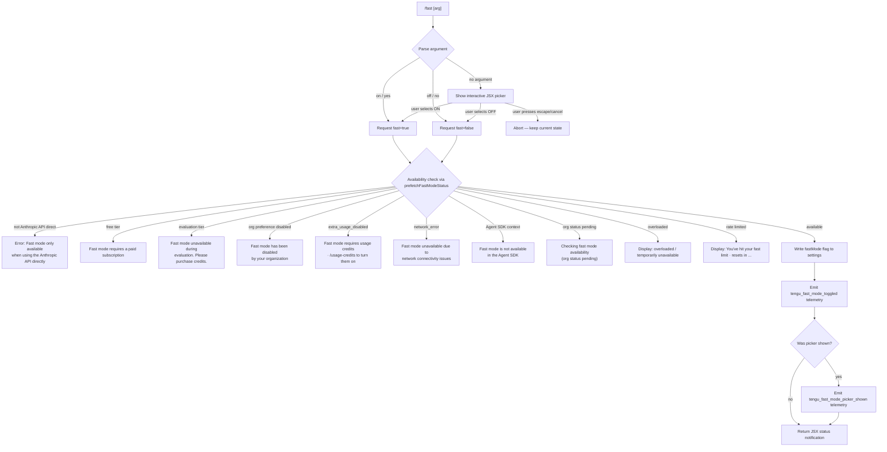

# `/fast`

> Analysis basis: CC v2.1.191 bundle.js (AST extraction + Claude interpretation)
> Minimum version: v2.1.191

---

## Overview

`/fast` toggles Claude Code's **Fast mode** (research preview), a high-throughput inference mode that uses a dedicated capacity tier. It accepts an optional `on` or `off` argument, and when invoked without a clear argument it shows an interactive JSX picker that lets the user choose the desired state. The command validates availability against the current API provider, subscription tier, and org-level policy before committing the change.

---

## Registration

| Field | Value |
|---|---|
| type | `local-jsx` |
| name | `fast` |
| description | `Toggle fast mode ( ... )` |
| argumentHint | `[on\|off]` |
| thinClientDispatch | `control-request` |
| immediate | `null` |
| isHidden | `null` |
| module_id | `v2l` |
| load_inline | `true` |
| loc_byte | `12583148` |
| loc_byte_end | `12583420` |
| loc_line | `8399` |
| arbor_handler.name | `qLf` |
| arbor_handler.fqn | `claude-2.1.191::qLf` |
| arbor_handler.kind | `AsyncFunction` |
| arbor_handler.resolution_path | `module_id` |
| arbor_handler.n_hits | `3` |

Analysis basis: CC v2.1.191 bundle.js:+12583148

---

## Input Branching

Five or more distinct branches are active in this command, so a Mermaid flowchart is used.



Analysis basis: CC v2.1.191 bundle.js:+12582158, +2268616, +2268684, +2269031, +2268267, +2268351, +2268448, +12578813

---

## Behavioral Spec

### Top-level handler (`qLf`)

```
async function fastCommandHandler(args, context):
    parsedArg = parseArgument(args)         // calls parseArg (Yl)
    status    = await fetchFastModeStatus() // calls prefetchFastModeStatus (iZe)
    slashCommandContext = buildSlashCommandContext(context) // calls Qse

    if parsedArg is explicit ("on"/"yes" or "off"/"no"):
        desiredState = (parsedArg in ["on","yes","1"])
        return applyFastModeToggle(desiredState, status, context)
    else:
        // show interactive picker (fZn / JSX component)
        emit telemetry("tengu_fast_mode_picker_shown")
        result = await showFastModePicker(status)
        if result == "cancel" or result == "escape":
            return keepCurrentState()
        return applyFastModeToggle(result, status, context)
```

Analysis basis: CC v2.1.191 bundle.js:+12582158 (qLf→Yl), +12582220 (qLf→iZe), +12582172 (qLf→Qse), +12582292 (qLf→pZn), +12582457 (qLf→LC.jsx)

---

### Argument parser (`Yl` / `parseArg`)

```
function parseArg(rawArg):
    normalized = rawArg.trim().toLowerCase()
    if normalized in ["yes", "on"]:
        return true
    if normalized in ["no", "off"]:
        return false
    return null   // triggers interactive picker path
```

Truthy literals: `"yes"` (bundle.js:+29726), `"on"` (bundle.js:+29732).
Falsy literals: `"no"` (bundle.js:+29877), `"off"` (bundle.js:+29882).

Analysis basis: CC v2.1.191 bundle.js:+12582158

---

### Fast-mode availability prefetch (`iZe` / `prefetchFastModeStatus`)

```
async function prefetchFastModeStatus(authContext):
    // If a prior prefetch is still in flight, reuse it
    if inFlightPromise exists:
        log("Fast mode prefetch in progress, returning in-flight promise")
        return inFlightPromise

    // Throttle: skip if fetched recently
    if (Date.now() - lastFetchTime) < DEBOUNCE_MS:
        log("Skipping fast mode prefetch, fetched recently")
        return cachedResult

    if no auth available:
        throw Error("No auth available")

    try:
        response = await callFastModeStatusEndpoint(authContext)
        store result in k3r map (YU)
        return parseStatusResponse(response)
    catch AxiosError where status == 401 or 403:
        handle OAuth token revocation recovery (YU)
    catch networkError:
        return { status: "network_error" }
```

Key constants:
- Debounce guard uses `Date.now()` comparison (bundle.js:+2273159).
- HTTP 401 triggers OAuth recovery path (bundle.js:+2273497).
- HTTP 403 also handled (bundle.js:+2273523).
- Auth header: `"anthropic-beta"` / `"x-api-key"` (bundle.js:+2272532, +2272554).

Analysis basis: CC v2.1.191 bundle.js:+2272850

---

### Availability gate (`Qse` / `buildSlashCommandContext` + inline checks)

```
function checkFastModeAvailability(status, providerInfo):
    if provider not in ["firstParty", "anthropic-direct"]:
        return error("Fast mode is only available when using the Anthropic API directly")

    if context is AgentSDK:
        return error("Fast mode is not available in the Agent SDK")

    switch status.reason:
        case "free":
            return error("Fast mode requires a paid subscription")
        case "evaluation":
            return error("Fast mode unavailable during evaluation. Please purchase credits.")
        case "preference":
            return error("Fast mode has been disabled by your organization")
        case "extra_usage_disabled":
            return error("Fast mode requires usage credits · /usage-credits to turn them on")
        case "network_error":
            return error("Fast mode unavailable due to network connectivity issues")
        case "pending":
            return warning("Checking fast mode availability (org status pending)")
        case "overloaded":
            return displayState("overloaded")
        default:
            return available()
```

Relevant string literals:
- `"Fast mode is only available when using the Anthropic API directly"` (bundle.js:+2268616)
- `"Fast mode is not available"` (bundle.js:+2268684)
- `"Fast mode unavailable: Fast mode is not available in the Agent SDK"` (bundle.js:+2269031)
- `"Fast mode requires a paid subscription"` (bundle.js:+2268135)
- `"Fast mode unavailable during evaluation. Please purchase credits."` (bundle.js:+2268176)
- `"Fast mode has been disabled by your organization"` (bundle.js:+2268267)
- `"Fast mode requires usage credits · /usage-credits to turn them on"` (bundle.js:+2268351)
- `"Fast mode unavailable due to network connectivity issues"` (bundle.js:+2268448)
- `"Fast mode is currently unavailable"` (bundle.js:+2268527)
- `"Checking fast mode availability"` (bundle.js:+2269272)
- `"Fast mode unavailable: Checking fast mode availability (org status pending)"` (bundle.js:+2269193)

Provider values checked: `"firstParty"` (bundle.js:+2134663), `"bedrock"` (bundle.js:+2134446), `"foundry"` (bundle.js:+2134496), `"vertex"` (bundle.js:+2134654).

Analysis basis: CC v2.1.191 bundle.js:+2268584 (Qse→Yl), +2268810 (Qse→DFe), +2268616

---

### Settings persistence (`pZn` / `applyFlagSettings` + `dZn`)

```
function applyFastModeToggle(desiredState, status, context):
    if desiredState == false:
        // Turn OFF unconditionally
        writeSetting("fastMode", false)    // via dZn → OPe
        emit telemetry("tengu_fast_mode_toggled", { value: false })
        return notification("Fast mode OFF")

    // Turn ON path — re-validate
    if not status.available:
        return displayError(status)

    writeSetting("fastMode", true)
    emit telemetry("tengu_fast_mode_toggled", { value: true })
    return notification("Fast mode ON")
```

Setting key literal: `"fastMode"` (bundle.js:+12577610).
Notification string `"Fast mode OFF"` (bundle.js:+12578813).
Telemetry event `"tengu_fast_mode_toggled"` (bundle.js:+12578542).
Persistence path goes through `dZn` (bundle.js:+12578531) → `OPe` (bundle.js:+12578260) and eventually serialises via `"apply_flag_settings"` (bundle.js:+12578173).

Analysis basis: CC v2.1.191 bundle.js:+12582292

---

### Interactive picker component (`fZn` / FastModePickerComponent)

```
JSXComponent FastModePickerComponent(props):
    [localFastMode, setLocalFastMode] = useState(currentFastModeValue)

    keyBindings:
        escape  → dispatch("cancel")
        tab     → dispatch("confirm:toggle")    // cycles ON/OFF
        enter   → dispatch("confirm")           // commits selection
        "on"    → dispatch("confirm:yes")

    render:
        header: " Fast mode (research preview)"
        row: label="Fast mode"  value = localFastMode ? "ON " : "OFF"
        if status == "overloaded":
            show "Fast mode overloaded and is temporarily unavailable"
        if status == "rate_limited":
            show "You've hit your fast limit · resets in <countdown>"
        footer: link to "https://code.claude.com/docs/en/fast-mode"
```

Key literals:
- Header text: `" Fast mode (research preview)"` (bundle.js:+12580479)
- ON label: `"ON "` (bundle.js:+12581197), OFF label: `"OFF"` (bundle.js:+12581203)
- Overloaded message: `"Fast mode overloaded and is temporarily unavailable"` (bundle.js:+12581370)
- Rate-limit message: `"You've hit your fast limit"` (bundle.js:+12581424) + `" · resets in "` (bundle.js:+12581453)
- Docs URL: `"https://code.claude.com/docs/en/fast-mode"` (bundle.js:+12581639)
- Picker shown telemetry: `"tengu_fast_mode_picker_shown"` (bundle.js:+12582398)
- Confirm key tokens: `"confirm:yes"` (bundle.js:+12580106), `"confirm:toggle"` (bundle.js:+12580204), `"confirm"` (bundle.js:+12580786), `"cancel"` (bundle.js:+12580680)

Analysis basis: CC v2.1.191 bundle.js:+12578603 (pZn→PPe), +12579067 (fZn→C2l.useState), +12580433 (fZn→LC.jsxs)

---

### Cooldown / sunset logic (`IPr` / `fastModeCooldownHandler`)

```
function fastModeCooldownHandler(state):
    if state.cooldownExpiresAt <= Date.now():
        log("Fast mode cooldown expired, re-enabling fast mode")
        emit EKs event
        clearCooldown()

    // Opus 4.6 sunset gate (tengu_sunset_penguin_opus46)
    if currentModel matches opus-4-6 family AND deprecationFlag set:
        // force Fast mode OFF during deprecation window
        // deprecation deadline: "2026-06-29" (bundle.js:+2270177)
        applyDeprecationBlock()
```

Cooldown literal `"cooldown"` (bundle.js:+2270376).
Sunset event `"tengu_sunset_penguin_opus46"` (bundle.js:+2270147).
Deprecation deadline: `"2026-06-29"` (bundle.js:+2270177).
Feature flag key: `"opus46-fast-mode-deprecation"` (bundle.js:+12577928).

Analysis basis: CC v2.1.191 bundle.js:+2270388 (IPr→Date.now), +2270416 (IPr→Yl), +2270489 (IPr→EKs.emit)

---

## State & Side Effects

| Item | Detail |
|---|---|
| Telemetry: `tengu_fast_mode_toggled` | Fired on every successful ON/OFF toggle (bundle.js:+12578542) |
| Telemetry: `tengu_fast_mode_picker_shown` | Fired when the interactive JSX picker is rendered (bundle.js:+12582398) |
| Telemetry: `tengu_penguins_off` | Fired when the org-level fast-mode ("penguin mode") is detected as disabled (bundle.js:+2268722) |
| Telemetry: `tengu_org_penguin_mode_fetch_failed` | Fired on network failure while fetching org fast-mode status (bundle.js:+2274358) |
| Telemetry: `tengu_sunset_penguin_opus46` | Fired when Opus 4.6 fast-mode sunset gate is triggered (bundle.js:+2270147) |
| Settings mutation | Writes `fastMode` boolean to user/project flag settings via `dZn` → `OPe` |
| Auth side-effect | Prefetch (`iZe`) reads OAuth token / API key; may trigger OAuth 401 recovery |
| appState changes | Fast mode status is read through `Ht`/`N8r` (Zustand `useSyncExternalStore`); toggling causes reactive re-render across subscribers |
| Sound | None observed in depth-2 traversal |
| thinClientDispatch | Dispatches `"control-request"` when running in thin-client mode |

---

## Version History

| Version | Change |
|---|---|
| v2.1.191 | Initial analysis — interactive JSX picker, org-level availability gating, Opus 4.6 sunset logic, cooldown timer |

---

## Common Mistakes

1. **Providing an unrecognised argument** — only `on`, `yes`, `off`, `no` (case-insensitive) are treated as explicit. Any other token falls through to the interactive picker rather than returning an error.
2. **Expecting Fast mode on non-Anthropic providers** — Bedrock, Vertex AI, Foundry, and Mantle providers all fail the availability gate with "Fast mode is only available when using the Anthropic API directly".
3. **Using `/fast on` inside an Agent SDK session** — the Agent SDK context check fires before the toggle; the command returns an error and writes nothing to settings.
4. **Toggling while org status is `pending`** — the command displays a warning and does not enable Fast mode; the pending state resolves asynchronously and requires a retry.
5. **Assuming immediate activation when overloaded** — even if the setting is written, the display correctly shows "overloaded / temporarily unavailable" until capacity recovers.
6. **Forgetting the Opus 4.6 deprecation deadline** — models in the `opus-4-6` family have Fast mode blocked after `2026-06-29` by the sunset gate, regardless of subscription or org settings.

---

## Appendix — Identifier Mapping

> For bundle debugging only. Identifiers change across versions.

| Identifier | Role |
|---|---|
| `qLf` | Top-level async handler for `/fast` command |
| `Yl` | Argument parser (parses `on`/`off`/`yes`/`no`) |
| `_r` | Internal result/error wrapper utility |
| `rt` | String coercion / type conversion helper |
| `L6o` | Conversation context builder (message slice + token helpers) |
| `gsm` | Token-map setter utility |
| `Cs` | Data-channel / IPC frame handler |
| `har` | Unicode-aware character counter |
| `hx` | Surrogate-pair character slicer |
| `msm` | Auto-classifier input builder |
| `ke` | JSON serialisation wrapper (JSON.stringify) |
| `wN` | Main API request orchestrator |
| `xf` | HTTP transport initialiser |
| `wt` | User-agent string builder |
| `oW` | Full API call pipeline |
| `mz` | URL base resolver |
| `p3r` | HTTP header line parser |
| `Ks` | Background-context store accessor |
| `Mz` | Error message formatter (GitHub issues link) |
| `GPr` | URL encoder |
| `T` | Model-string normaliser / router |
| `Ng` | Token-refresh utility |
| `XKs` | Boolean coercion wrapper |
| `_y` | Auth-mode dispatcher |
| `_ud` | Zustand state updater |
| `xr` | Request-context reader |
| `Kdn` | Proxy-auth helper |
| `Iud` | Streaming response handler |
| `PH` | IPC send/recv bridge |
| `G2` | Idle-state checker |
| `fy` | Retry / back-off scheduler |
| `Tud` | Streaming parser |
| `yud` | Side-effect coordinator for API calls |
| `SCe` | Request deduplicator |
| `Rdr` | Rate-limit timer |
| `pMt` | Header normaliser (toLowerCase) |
| `dve` | SDK error logger |
| `BSn` | Network-status classifier |
| `D` | Supervisor process write helper |
| `x` | Pending-request registry |
| `v` | Focus/blur state tracker |
| `Ooe` | Provider prefix classifier |
| `nv` | Notification renderer |
| `yA` | Auth credential resolver |
| `ACe` | WIF token-exchange handler |
| `TZe` | WIF credentials resolver |
| `h` | Streaming reader |
| `b2e` | Model-capability checker |
| `ao` | Prompt-prefix builder |
| `o1` | IPC reply helper |
| `lie` | Auth-header injector |
| `vOr` | Foundry resource ID normaliser |
| `CBp` | Cache-hit finder |
| `SHo` | SHA-256 hash helper |
| `Ghn` | User-agent construction pipeline |
| `ol` | String padding utility |
| `uu` | Context-store reader |
| `$hn` | AsyncLocalStorage store accessor |
| `aIn` | Result accumulator |
| `aje` | Main-thread conversation loop |
| `To` | Tool-call dispatcher |
| `nt` | Tool result normaliser |
| `wD` | Request context builder |
| `C3r` | Context-reset helper |
| `A2e` | Context read utility |
| `L` | Background-worker sweep scheduler |
| `Nzt` | Memory pressure checker |
| `J8l` | Worker retirement orchestrator |
| `I3e` | Cache file pruner |
| `Le` | Log-error reporter |
| `Gn` | Worker spawner |
| `ZVa` | Token counter |
| `sp` | URL-safe string replacer |
| `XSn` | Temperature-setting checker |
| `av` | Message mapper |
| `Txe` | Tool schema builder |
| `P4` | Tool-use ID generator |
| `Sc` | Tool-call state manager |
| `etn` | Cache-control injector |
| `Qen` | Cache breakpoint classifier |
| `iD` | Deep-clone wrapper (structuredClone) |
| `u7e` | User-message cache injector |
| `Ve` | Event-emitter wrapper |
| `LOr` | OAuth token validator |
| `l7s` | Tool-list parser |
| `wOr` | Pending-tool-call tracker |
| `Tr` | Stream-timing wrapper |
| `Oo` | Event emitter base |
| `H1t` | REPL history manager |
| `v3i` | History file reader |
| `Rot` | Log writer |
| `h1t` | History compactor |
| `NF` | Built-in agent dispatcher |
| `nOd` | Agent prefix parser |
| `xD` | Repl-main-thread classifier |
| `S4` | Side-query request builder |
| `ev` | Side-query result handler |
| `PPr` | Side-query pipeline |
| `zp` | Side-query auth injector |
| `usm` | Context-tip classifier builder |
| `csm` | Tip message mapper |
| `hsm` | Tip string assembler |
| `M6n` | Tip-tool-use finder |
| `cSt` | Tip renderer |
| `Pe` | React element (Ink component) |
| `Re` | React element (ok state) |
| `D6n` | Tip schema validator |
| `we` | React element (warning state) |
| `Ae` | String coercion element |
| `Qse` | Slash-command context builder |
| `Na` | Model-string normaliser / router (full) |
| `Nwt` | Settings filter builder |
| `mgs` | Settings filter helper |
| `fgs` | Flag-settings assembler |
| `Uwt` | Policy-settings assembler |
| `WTe` | Remote-settings reader |
| `z2` | Full settings object builder |
| `xse` | Settings key extractor |
| `Dwt` | Default-settings merger |
| `NFe` | Model name sanitiser |
| `il` | Inline-expansion helper |
| `Dk` | Deprecated-value guard |
| `Qo` | Full model resolution pipeline |
| `Xme` | Settings mutation helper |
| `Vqu` | Settings Set adder |
| `kPr` | Array-safe settings writer |
| `rGl` | Remote config cache reader |
| `OFe` | Forbidden-value checker |
| `xhn` | Model-alias resolver |
| `r0t` | Model string normaliser (startsWith) |
| `GKs` | Object-entries settings reader |
| `In` | Policy-aware settings merger |
| `vln` | Remote-settings merger |
| `PQe` | Permission-string builder |
| `Rr` | Role resolver |
| `BKs` | Settings index-of helper |
| `qqu` | Full model lookup pipeline |
| `FKs` | Model-name indexOf searcher |
| `Kqu` | Model-startsWith resolver |
| `DFe` | Flag settings deserialiser |
| `_b` | Settings-branch builder |
| `ege` | Error-result wrapper |
| `nge` | Pro-tier gating helper |
| `wi` | Vs/rB state emitter |
| `Es` | Extended model settings evaluator |
| `E4` | Model metadata builder |
| `L_` | Model list filter |
| `nj` | Model name joiner |
| `rH` | Model routing helper |
| `Fw` | Model capability checker |
| `YS` | Subscription status reader |
| `Vu` | Subscription object accessor |
| `Dm` | Model-string dispatch helper |
| `Lze` | VS Code context reader |
| `Ihn` | Result-type narrower |
| `iZe` | Fast-mode status prefetcher |
| `vPr` | Fast-mode request builder |
| `kt` | Config read/write pipeline |
| `Gt` | Config file path resolver |
| `tEt` | Config save with lock |
| `K9f` | Config watcher |
| `Yi` | Essential-traffic classifier |
| `ncs` | Network flag reader |
| `rv` | Capability flag reader |
| `Dqu` | OAuth token accessor |
| `xs` | Scope validator |
| `YU` | Fast-mode status cache (k3r map operations) |
| `cdd` | OAuth 401 recovery handler |
| `aF` | Token-store accessor |
| `stt` | OAuth timestamp checker |
| `Pj` | OAuth token file reader |
| `Wl` | Uzs auth-store wrapper |
| `uQ` | OAuth token updater |
| `XAt` | Keychain reader |
| `ldd` | Keychain token extractor |
| `ami` | OAuth retry delay calculator |
| `uo` | Settings-load pipeline |
| `sg` | Settings-path resolver |
| `VTe` | Settings file path builder |
| `EIr` | Settings-load orchestrator |
| `Yms` | Settings file reader |
| `Cj` | Settings parser |
| `Kms` | Settings schema validator |
| `VC` | Config-file reader |
| `WQ` | JSON settings file reader |
| `vn` | File path normaliser |
| `wTr` | Settings-load timestamp recorder |
| `GUe` | Settings path → z2 router |
| `Iln` | Settings path resolver |
| `Rvt` | Atomic file write helper |
| `jd` | Real-path resolver |
| `hXe` | fsync error handler |
| `ius` | File write property definer |
| `kH` | Cache-clear helper (sZt/Zcr) |
| `Yps` | Gitignore-aware file writer |
| `Dt` | Git info resolver |
| `uTr` | Git command runner |
| `Ran` | Git check-ignore runner |
| `BHu` | Home-dir path resolver |
| `Kps` | Git ls-files runner |
| `c4` | `.claude` dir path builder |
| `Hr` | ux helper |
| `Lt` | Warning-state renderer |
| `vj` | Settings-load event emitter |
| `cx` | Settings-load timer |
| `ia` | Memory-usage tracker |
| `SIr` | Full settings-load observer |
| `gn` | Global config save pipeline |
| `U7t` | Config-save with lock (global) |
| `kzs` | Config object merger |
| `nEt` | Config backup creator |
| `R2o` | Backup path builder |
| `v2o` | Config entries iterator |
| `O7t` | Config timestamp recorder |
| `P7t` | Config save entry |
| `Xnr` | Config-save atomic writer |
| `pZn` | Fast-mode toggle applicator |
| `dZn` | Flag-settings writer |
| `OPe` | Flag-settings type coercer |
| `PPe` | Theme/settings picker builder |
| `q4` | Theme resolver |
| `vBe` | Theme colour map |
| `qIn` | Theme list checker |
| `V4` | Theme name parser |
| `fc` | Global-config legacy reader |
| `vk` | Permission-set builder |
| `DIr` | Settings path → sg router |
| `Lo` | Foreground-colour style resolver |
| `iwe` | ANSI colour string builder |
| `XU` | Number formatter (toFixed) |
| `xKs` | Integer-check wrapper |
| `aZe` | Yl-based toggle helper |
| `GPo` | Feature-flag getter |
| `_Ks` | Feature-flag date parser |
| `fZn` | Fast-mode JSX picker component |
| `Ht` | Zustand state accessor |
| `N8r` | AppState context reader |
| `Ii` | Interactive input hook |
| `Ac` | App-state selector (Ac) |
| `Co` | App-state selector (Co) |
| `ws` | Clock context reader |
| `LLd` | Key-binding reducer |
| `rNi` | Input fold handler |
| `SOt` | Input state syncer |
| `IPr` | Fast-mode cooldown handler |
| `An` | App background-session label |
| `Uo` | Global key-handler registrar |
| `iS` | Focus context reader |
| `Wi` | Countdown timer formatter |

---

Note: index built via Arbor fallback; some signals (telemetry, literals) may be missing — see arbor-fallback.js.