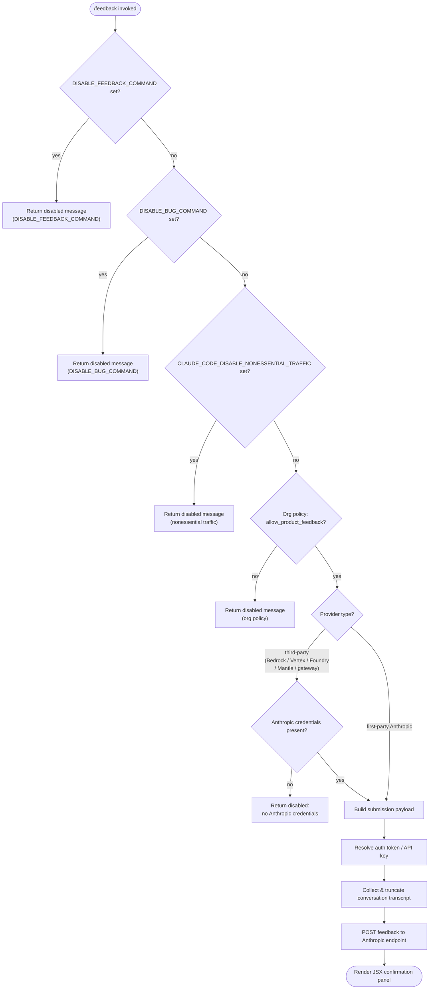

# `/feedback`

> Analysis basis: CC v2.1.191 bundle.js (AST extraction + Claude interpretation)
> Minimum version: v2.1.191

---

## Overview

The `/feedback` command (also accessible via `/share` and `/bug`) allows users to submit feedback, report bugs, or share their current conversation with Anthropic. Before opening any submission UI, the command performs a multi-step eligibility check: it consults environment variable flags and organisational policy to decide whether feedback is permitted, then inspects the active API provider to determine how to authenticate the submission request.

---

## Registration

| Field | Value |
|---|---|
| type | `local-jsx` |
| name | `feedback` |
| description | `Submit feedback, report a bug, or share your conversation` |
| aliases | `share`, `bug` |
| argumentHint | `[report]` |
| module_id | `uSl` |
| load_inline | `true` |
| loc_byte | `11264331` |
| loc_byte_end | `11264554` |
| loc_line | `6951` |
| arbor_handler.name | `Vlf` |
| arbor_handler.fqn | `claude-2.1.191::Vlf` |
| arbor_handler.kind | `AsyncFunction` |
| arbor_handler.resolution_path | `module_id` |
| arbor_handler.n_hits | `0` |

Analysis basis: CC v2.1.191 bundle.js:+11264331

---

## Input Branching

The command implements five distinct early-exit paths (environment-variable gates, organisation policy gate, provider-credential gate, third-party provider block, and the happy path that renders the JSX submission panel), making a Mermaid flowchart the appropriate representation.



---

## Behavioral Spec

### Eligibility Gate — Environment Variable Checks

Before any UI is shown, the handler (resolved as `Vlf` via `module_id` path) delegates to an inner eligibility function (`A8e` → `Yi`/`ncs` chain) that reads three environment variables in sequence.

```
async function checkFeedbackEligibility(context):
    if env("DISABLE_FEEDBACK_COMMAND") is set:
        return Error("/feedback has been disabled via the DISABLE_FEEDBACK_COMMAND environment variable")

    if env("DISABLE_BUG_COMMAND") is set:
        return Error("/feedback has been disabled via the DISABLE_BUG_COMMAND environment variable")

    if env("CLAUDE_CODE_DISABLE_NONESSENTIAL_TRAFFIC") is set:
        return Error("/feedback has been disabled via the CLAUDE_CODE_DISABLE_NONESSENTIAL_TRAFFIC environment variable")

    return OK
```

Analysis basis: CC v2.1.191 bundle.js:+11241534, +11241552, +11241693, +11241811

The telemetry/traffic-level check consults an internal mode value; recognised traffic-level strings include `"essential-traffic"`, `"no-telemetry"`, and `"default"`.

Analysis basis: CC v2.1.191 bundle.js:+1054867, +1054926, +1055000

### Eligibility Gate — Organisational Policy Check

After the environment-variable gates pass, the handler reads the `allow_product_feedback` feature flag from the active organisational configuration (via the `vs`/`Qge` call chain).

```
function checkOrgPolicy(orgConfig):
    if not orgConfig.featureEnabled("allow_product_feedback"):
        return Error("/feedback has been disabled by your organization's policy")
    return OK
```

Analysis basis: CC v2.1.191 bundle.js:+3356909, +11241975

### Provider Resolution and Credential Check

The command identifies the active provider (`_r` call, which returns one of `"firstParty"`, `"third_party_provider"`, `"custom_base_url"`, or provider-specific labels). Human-readable provider names are resolved at this stage:

| Internal value | Display name |
|---|---|
| `bedrock` | Amazon Bedrock |
| `vertex` | Vertex AI |
| `foundry` | Microsoft Foundry |
| `anthropicAws` | Claude Platform on AWS |
| `mantle` | Amazon Bedrock (Mantle) |
| `gateway` | an API gateway |

Analysis basis: CC v2.1.191 bundle.js:+11242107, +11242182, +11242253, +11242337, +11242420, +11242505

For third-party providers, the handler checks whether Anthropic-issued credentials (OAuth token or API key) are separately available via the `cW` auth resolution chain. If none are found, a `"no_creds"` / `"no Anthropic credentials"` error is returned.

```
function resolveCredentialsForFeedback(providerInfo, authState):
    if providerInfo.type == "third_party":
        creds = resolveAnthropicCredentials(authState)   // cW → To → _y
        if creds == null:
            return Error("no Anthropic credentials")
        return creds
    else:
        return resolveFirstPartyAuth(authState)           // standard OAuth / API-key path
```

Analysis basis: CC v2.1.191 bundle.js:+11242075, +11242090, +11242582, +11242599, +3097418, +3097480

### Conversation Transcript Collection and Truncation

The handler collects the current conversation transcript via the `e` / `L6o` family of functions. Transcript assembly applies several limits:

- Message slice window: 30 messages maximum (Analysis basis: CC v2.1.191 bundle.js:+16668949)
- Per-turn token budget: 1 000 tokens per turn (Analysis basis: CC v2.1.191 bundle.js:+16669144)
- Tool-call output cap: 300 characters per tool result (Analysis basis: CC v2.1.191 bundle.js:+16669651)
- Auto-classifier input: up to 512 tokens (Analysis basis: CC v2.1.191 bundle.js:+16671099)
- Timestamp: `Date.now()` is captured at collection time (Analysis basis: CC v2.1.191 bundle.js:+16670769)

Message roles recognised during serialisation: `"user"`, `"assistant"`. Content block types handled: `"text"`, `"tool_use"`, `"tool_result"`.

Analysis basis: CC v2.1.191 bundle.js:+16668982, +16668999, +16669206, +16669266, +16669676

```
function collectTranscript(conversation):
    messages = conversation.slice(-30)           // max 30 turns
    result   = []
    for msg in messages:
        turn = { role: msg.role, content: [] }
        for block in msg.content:
            if block.type == "text":
                turn.content.append(truncate(block.text, 1000))
            elif block.type == "tool_use":
                turn.content.append(summariseTool(block, 300))
            elif block.type == "tool_result":
                turn.content.append(truncate(block.content, 300))
        result.append(turn)
    return result
```

Analysis basis: CC v2.1.191 bundle.js:+16668940, +16669122, +16669424

### Feedback POST Request

The payload is submitted via the `wN` network layer (HTTP POST). Key request construction details:

- Method: `"post"` (Analysis basis: CC v2.1.191 bundle.js:+11242639)
- Auth header: `"x-api-key"` for API-key auth (Analysis basis: CC v2.1.191 bundle.js:+3097906)
- User-Agent includes `"@anthropic-ai/claude-code"` and version `"2.1.191"` (Analysis basis: CC v2.1.191 bundle.js:+3095730, +3095820)
- Session header: `"X-Claude-Code-Session-Id"` (Analysis basis: CC v2.1.191 bundle.js:+3025877)
- Application header: `"x-app"` set to `"cli"` (Analysis basis: CC v2.1.191 bundle.js:+3026001, +3025853)
- Feedback visibility: `"public"` (Analysis basis: CC v2.1.191 bundle.js:+11264137)

```
async function postFeedback(payload, credentials):
    headers = buildStandardHeaders(credentials)   // wN → oW → Ghn
    headers["x-api-key"] = credentials.apiKey
    response = await httpPost(feedbackEndpoint, payload, headers)
    return response
```

Analysis basis: CC v2.1.191 bundle.js:+11242639, +3097906, +3025877

### JSX Panel Rendering

On success the handler delegates to `cSl` → `dSl.jsx` to render a React-based confirmation/submission panel. The `lSl` helper captures `Date.now()` for display purposes.

Analysis basis: CC v2.1.191 bundle.js:+11263954, +11263711

---

## State & Side Effects

| Item | Detail |
|---|---|
| Telemetry — `tengu_api_success` | Fired on successful API call through the `wN` network layer (bundle.js:+8938998) |
| Telemetry — `tengu_lone_surrogate_sanitized` | Fired when surrogate characters are sanitised from transcript content (bundle.js:+8938694) |
| Telemetry — `tengu_prompt_cache_1h_config` | Fired during prompt-cache configuration used by background API calls (bundle.js:+13616098) |
| Telemetry — `tengu_bg_retire_grace_bridged_min` | Background worker lifecycle event (bundle.js:+13163592) |
| Telemetry — `tengu_bg_retire_pinned_low_mem` | Background worker low-memory retirement event (bundle.js:+17375231) |
| Telemetry — `tengu_bg_attach_upgrade` | Background worker attach-upgrade event (bundle.js:+13163664) |
| Telemetry — `tengu_bg_prewarm_per_sweep` | Background worker prewarm sweep event (bundle.js:+17375352) |
| Telemetry — `tengu_context_tip_classifier_outcome` | Context tip classifier result (bundle.js:+16672225) |
| Telemetry — `tengu_feature_ok` / `tengu_feature_bad` | Feature flag evaluation outcome (bundle.js:+1025725, +1025792) |
| appState changes | None directly; command renders JSX panel as output |
| Hook registration | None observed in depth-2 traversal |
| Sound | None observed in depth-2 traversal |
| Environment variables read | `DISABLE_FEEDBACK_COMMAND`, `DISABLE_BUG_COMMAND`, `CLAUDE_CODE_DISABLE_NONESSENTIAL_TRAFFIC` |
| Org policy flag read | `allow_product_feedback` |
| Network I/O | One outbound HTTPS POST to Anthropic feedback endpoint |

---

## Version History

| Version | Change |
|---|---|
| v2.1.191 | Initial analysis |

---

## Common Mistakes

1. **Expecting `/feedback` to work on third-party providers without Anthropic credentials.** Even when using Bedrock, Vertex AI, or another third-party provider, the command requires separately available Anthropic OAuth or API-key credentials. If none are found the command exits with a `"no Anthropic credentials"` error rather than silently proceeding.

2. **Setting only one of the two disable variables.** The command checks `DISABLE_FEEDBACK_COMMAND` *and* `DISABLE_BUG_COMMAND` as separate gates. Setting only one still blocks the matching alias; both aliases (`/share` and `/bug`) are affected by both variables.

3. **Assuming `/share` and `/bug` are separate commands.** All three invocation names (`feedback`, `share`, `bug`) resolve to the same registration object and the same handler (`Vlf`). There is no behavioural difference between them.

4. **Expecting feedback to be submitted even when `CLAUDE_CODE_DISABLE_NONESSENTIAL_TRAFFIC` is set.** This environment variable, typically used in enterprise environments to restrict outbound traffic, also silently blocks feedback submission.

5. **Assuming long conversations are sent in full.** The transcript is capped at 30 messages, with per-turn and per-tool-block character limits applied before submission.

---

## Appendix — Identifier Mapping

> For bundle debugging only. Identifiers change across versions.

| Identifier | Role |
|---|---|
| `Vlf` | Main handler (`AsyncFunction`) for `/feedback`; Arbor-resolved entry point |
| `cSl` | Top-level command renderer; calls eligibility checks and JSX factory |
| `A8e` | Eligibility check orchestrator; reads env-var disable flags and org policy |
| `Yi` | Environment variable reader utility |
| `ncs` | Traffic-mode resolver (maps env vars to `essential-traffic` / `no-telemetry` / `default`) |
| `rt` | Low-level string/value coercion helper |
| `vs` | Provider/feature-flag resolver; reads `allow_product_feedback` org setting |
| `Hvi` | Provider type classifier sub-routine |
| `G4` | Provider classification helper (firstParty / third_party / custom_base_url) |
| `gF` | Provider detail builder |
| `DDt` | Auth provider descriptor (firstParty, third_party_provider, custom_base_url, no_auth, etc.) |
| `Qge` | Org config feature-flag reader |
| `_r` | Provider identity resolver (returns bedrock, vertex, foundry, etc.) |
| `cW` | Credential resolver for third-party provider path |
| `Dz` | Auth type discriminator |
| `jl` | OAuth token accessor |
| `To` | Anthropic-first-party auth resolver |
| `_y` | Credential builder (API key / OAuth / apiKeyHelper) |
| `rB` | Array inclusion check helper |
| `nv` | Auth header builder |
| `iH` | API key resolution and validation |
| `e` | Transcript/payload assembly orchestrator |
| `L6o` | Conversation message serialiser |
| `gsm` | Message-map setter helper |
| `har` | Surrogate-pair / character boundary helper |
| `hx` | UTF-16 surrogate handling utility |
| `msm` | Auto-classifier input builder |
| `ke` | JSON serialisation helper |
| `wN` | Network request layer (HTTP POST, headers, retry) |
| `xf` | Request factory |
| `wt` | Low-level HTTP transport |
| `oW` | Full Anthropic API client / request orchestrator |
| `mz` | Base-URL resolver |
| `p3r` | URL path parser |
| `Ks` | HTTP client configuration builder |
| `Mz` | Retry / error handling strategy |
| `GPr` | URL encoder for query parameters |
| `T` | Header value formatter / debug logger |
| `Ng` | OAuth token refresh orchestrator |
| `XKs` | Boolean coercion helper |
| `e_` | Async event emitter / abort-signal helper |
| `_ud` | Token expiry / Zod-validation helper |
| `xr` | Token store accessor |
| `Kdn` | Proxy auth helper invoker |
| `Iud` | Streaming response / UUID session manager |
| `PH` | Response parser |
| `G2` | Environment info collector |
| `fy` | Proxy configuration resolver |
| `Tud` | Streaming-format detector |
| `yud` | Background worker state accessor |
| `SCe` | Response caching layer |
| `Rdr` | Request timestamp recorder |
| `pMt` | Header normaliser (lower-case) |
| `dve` | SDK error logger |
| `BSn` | Model / provider capability resolver |
| `D` | Output stream writer |
| `x` | Request-ID tracker / cache map |
| `v` | Token-window / focus-blur tracker |
| `w` | Worker reference |
| `Ooe` | Model prefix detector |
| `yA` | Auth mode selector (profile-implicit, user_oauth, etc.) |
| `ACe` | WIF token-exchange handler |
| `TZe` | WIF credentials resolver (fetches via Anthropic API) |
| `I` | Rate-limit / token bucket |
| `h` | Async queue / scheduler |
| `b2e` | Bedrock inference-profile handler |
| `ao` | Application-inference-profile string builder |
| `o1` | Response wrapper |
| `lie` | Foundry resource name resolver |
| `$At` | Cache store reference |
| `vOr` | Foundry URL normaliser |
| `_` | MCP server registry |
| `a` | MCP server entry accessor |
| `CBp` | Capability finder |
| `SHo` | SHA-256 hash helper |
| `Ghn` | User-Agent string builder |
| `ol` | String padding / version formatter |
| `uu` | User-Agent cache store |
| `$hn` | AsyncLocalStorage store accessor |
| `hCe` | Header assembler |
| `aIn` | Lone-surrogate sanitiser |
| `aje` | Prompt-cache configuration builder |
| `dpr` | Cache-duration parser |
| `nt` | Background worker task dispatcher |
| `ppr` | Prompt-cache policy evaluator |
| `wD` | Model-specific request transformer |
| `C3r` | Request body normaliser |
| `A2e` | Model-version adapter |
| `L` | Background worker sweep / lifecycle manager |
| `V` | Worker pool |
| `Nzt` | Memory-pressure detector |
| `J8l` | Worker retirement bridge |
| `I3e` | Checkpoint file manager |
| `Le` | Log emitter |
| `U` | Active worker set |
| `Gn` | Task scheduler |
| `W` | React/Ink render helper |
| `j` | Sub-worker handle |
| `Xer` | Worker attach-upgrade handler |
| `q` | Input event handler (prewarm) |
| `ZVa` | Token-usage accumulator |
| `sp` | Text sanitiser (special character replacement) |
| `XSn` | Model-temperature override resolver |
| `av` | Content-block mapper |
| `Txe` | Tool definition serialiser |
| `P4` | Tool call ID generator |
| `Sc` | Tool schema validator |
| `etn` | Tool-call tree encoder |
| `Qen` | JSON path validator |
| `iD` | Structured-clone wrapper |
| `u7e` | Tool-result tree encoder |
| `Zen` | Special character replacement in tool results |
| `Ve` | React element factory |
| `eze` | React/Ink base component |
| `LOr` | API error response parser |
| `l7s` | HTTP header language parser |
| `wOr` | Capability-check cache |
| `mbe` | Metrics batch emitter |
| `Tr` | Timing recorder |
| `lh` | Ink layout component |
| `Oo` | Ink output renderer |
| `H1t` | Conversation-tree snapshot builder |
| `v3i` | Snapshot file writer |
| `Rot` | Snapshot layout component |
| `h1t` | Snapshot metadata builder |
| `NF` | Agent-type classifier |
| `nOd` | Built-in / custom agent prefix parser |
| `xD` | Agent thread-type identifier |
| `kAt` | Cache-control header builder |
| `S4` | Conversation export formatter |
| `ev` | Export serialiser |
| `PPr` | Export wrapper |
| `zp` | Export schema builder |
| `usm` | Context-tip request builder |
| `csm` | Context-tip message mapper |
| `hsm` | Context-tip prompt assembler |
| `M6n` | Model capability finder |
| `cSt` | Context-tip classifier |
| `Pe` | Ink `<Box>` layout component |
| `Re` | Ink `<Text>` component |
| `D6n` | Zod schema safe-parser |
| `we` | Ink text wrapper |
| `Ae` | String coercion helper |
| `lSl` | Timestamp capture helper for JSX panel |