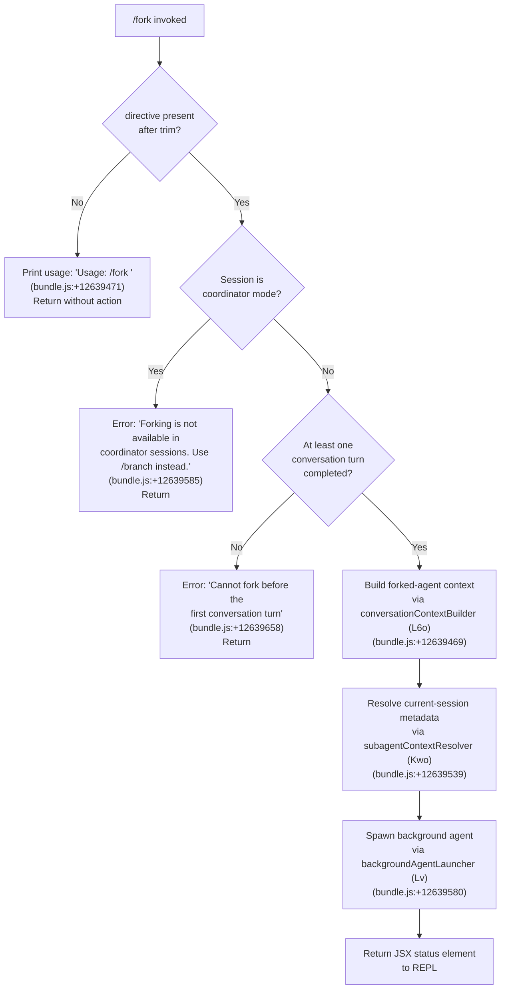

# `/fork`

> Analysis basis: CC v2.1.191 bundle.js (AST extraction + Claude interpretation)
> Minimum version: v2.1.191

---

## Overview

`/fork` spawns a background agent that inherits the full current conversation context, then follows a user-supplied directive. The command clones the live session state — including message history, tool permissions, and environment — into a new independent subagent process, which runs asynchronously. It is unavailable in coordinator sessions and requires at least one completed conversation turn before it can be invoked.

---

## Registration

| Field | Value |
|---|---|
| type | `local-jsx` |
| name | `fork` |
| description | `Spawn a background agent that inherits the full conversation` |
| argumentHint | `<directive>` |
| module_id | `xBl` |
| load_inline | `true` |
| loc_byte | `12639888` |
| loc_byte_end | `12640091` |
| loc_line | `8497` |
| arbor_handler.name | `Sxf` |
| arbor_handler.fqn | `claude-2.1.191::Sxf` |
| arbor_handler.kind | `AsyncFunction` |
| arbor_handler.resolution_path | `module_id` |
| arbor_handler.n_hits | `0` |

Analysis basis: CC v2.1.191 bundle.js:+12639888

---

## Input Branching

Four distinct cases are handled before the subagent is launched, warranting a Mermaid flowchart.



Analysis basis: CC v2.1.191 bundle.js:+12639447 through +12639580

---

## Behavioral Spec

### 1. Directive Validation

```
async function forkCommandHandler(directive, sessionContext):
    trimmed = directive.trim()                      # bundle.js:+12639447
    if trimmed is empty:
        display("Usage: /fork <directive>")         # bundle.js:+12639471
        return

    if sessionContext.mode == "coordinator":        # bundle.js:+12639585
        error("Forking is not available in coordinator sessions. Use /branch instead.")
        return

    if no prior conversation turn exists:           # bundle.js:+12639658
        error("Cannot fork before the first conversation turn")
        return
```

Analysis basis: CC v2.1.191 bundle.js:+12639447

### 2. Conversation Context Serialisation (`conversationContextBuilder` / `L6o`)

The handler invokes the conversation-context builder to produce a serialised snapshot of the current message history.

```
function buildConversationContext(messages):
    # Slice recent history (up to 30 messages, bundle.js:+16668949)
    sliced = messages.slice(...)
    for each message in sliced:
        role = message.role            # "user" | "assistant" (bundle.js:+16668982, +16668999)
        process content blocks:
            "text"          -> include text (bundle.js:+16669206)
            "tool_use"      -> include with label (bundle.js:+16669676)
            "tool_result"   -> include (bundle.js:+16669266)
        # Token budget: max 1000 tokens per block (bundle.js:+16669144)
        # Truncate content blocks longer than 300 chars (bundle.js:+16669651)
    build summary string
    return context
```

Analysis basis: CC v2.1.191 bundle.js:+16668916

### 3. Subagent Context Resolution (`subagentContextResolver` / `Kwo`)

Collects all runtime state needed to configure the forked agent.

```
async function resolveSubagentContext(session, directive):
    # Telemetry: emit "subagent_launch" (bundle.js:+11223746)
    # Emit "subagent_fork_coordinator_mode" flag (bundle.js:+11223764)

    if directive missing:
        # Emit "subagent_fork_prompt_missing" (bundle.js:+11223888)
        return error

    agentType = "fork"                          # bundle.js:+11223937
    launchMode = "spawn"                        # bundle.js:+11224782

    # Collect REPL contexts (bundle.js:+11223977)
    replContexts = session.getReplContexts()

    # Build context items: working_directory, allowed_tools,
    #   disallowed_tools, avoid_prompts, permission_mode,
    #   session, effort, model, max_thinking_tokens, flag_settings
    #   (bundle.js:+10899808 through +10900487)

    # Trim directive and replace template tokens (bundle.js:+11224113)
    # Slice to 50 chars for ID generation seed (bundle.js:+11224153)

    # Generate session ID via randomBytes (bundle.js:+27987)
    #   Format: 63 chars (bundle.js:+27977), chunk size 8 (bundle.js:+28003)

    # Capture current timestamp (bundle.js:+11224210)
    timestamp = Date.now()

    # Initialise subagent runner (igt) (bundle.js:+11224246)
    # Register AbortController (bundle.js:+10563643)

    return { agentType, directive, replContexts, timestamp, ... }
```

Analysis basis: CC v2.1.191 bundle.js:+11223731

### 4. Subagent Launch (background agent spawner / `Lv`)

```
async function launchBackgroundAgent(context):
    # Set x-app header to "bg" (bundle.js:+2313006)
    # Set cli-bg variant header (bundle.js:+3025844)
    # Include x-claude-code-agent-id header (bundle.js:+3026035)
    # Include x-claude-code-parent-agent-id header (bundle.js:+3026098)

    agentMode = "background"                    # bundle.js:+9025165
    launchType = "local_agent"                  # bundle.js:+10563278

    # Spawn process via backgroundProcessSpawner (Aw)
    process = spawn(agentConfig)

    # Register in active-subagent registry (bundle.js:+10563643)
    # Set initial status to "pending" (bundle.js:+13438896)
    # Transition to "running" (bundle.js:+10563323)
    agentKind = "general-purpose"               # bundle.js:+10563441

    return agentHandle
```

Analysis basis: CC v2.1.191 bundle.js:+5085966

### 5. Fork-Specific Context Storage (`fork-context-ref`)

The forked agent's context reference is stored with the key `"fork-context-ref"` (bundle.js:+13351561). This allows the parent session to retrieve progress or results from the background agent via the subagent registry.

Analysis basis: CC v2.1.191 bundle.js:+13351561

### 6. Background Agent Execution Loop (`backgroundAgentRunner` / `gje`)

Once spawned, the background agent runs a standard query loop:

```
async function backgroundAgentLoop(agentState):
    mode = "responding"                         # bundle.js:+9025407

    loop:
        send API request with inherited context
        stream response events
        execute tool calls
        on stall timeout (stream watchdog):
            emit "watchdog_stall" (bundle.js:+9025971)
            abort
        on completion:
            emit "subagent_complete" (bundle.js:+9026630)
            break
        on stall timeout:
            emit "subagent_stall_timeout" (bundle.js:+9026650)
            break
```

Analysis basis: CC v2.1.191 bundle.js:+9025180

### 7. Background Agent Lifecycle Events

| Phase | Literal / Event | loc_byte |
|---|---|---|
| Agent spawned | `"spawn"` | +11224782 |
| Agent mode | `"background"` | +9025165 |
| Initial status | `"pending"` | +13438896 |
| Running status | `"running"` | +10563323 |
| Subagent complete | `"subagent_complete"` | +9026630 |
| Stall timeout | `"subagent_stall_timeout"` | +9026650 |
| Async error | `"subagent_async_errored"` | +9030659 |
| Agent terminated | `tengu_agent_tool_terminated` | +9030062 |

---

## State & Side Effects

| Item | Detail |
|---|---|
| Telemetry — launch | `tengu_async_agent_stall_timeout` (bundle.js:+9026390) |
| Telemetry — stall | `tengu_async_agent_stranded_tools_cleared` (bundle.js:+9027350) |
| Telemetry — agent tool | `tengu_agent_tool_completed` (bundle.js:+9022196) |
| Telemetry — agent tool terminated | `tengu_agent_tool_terminated` (bundle.js:+9030062) |
| Telemetry — default turns exceeded | `tengu_forked_agent_default_turns_exceeded` (bundle.js:+10898554) |
| Telemetry — subagent shale finch | `tengu_shale_finch` (bundle.js:+9017649) |
| Telemetry — quartz heron | `tengu_quartz_heron` (bundle.js:+9034557) |
| Telemetry — slim subagent claudemd | `tengu_slim_subagent_claudemd` (bundle.js:+9293257) |
| Telemetry — summary skipped | `tengu_agent_summary_skipped` (bundle.js:+8931832) |
| Telemetry — bg dispatch low mem | `tengu_bg_dispatch_low_mem` (bundle.js:+17371142) |
| Telemetry — daemon bg session create | `"daemon_bg_session_create"` literal (bundle.js:+17370857) |
| Subagent registry | Adds handle to active-subagent registry on spawn; removes on termination |
| appState changes | Sets agent mode to `"background"`; updates subagent status through `"pending"` → `"running"` → `"completed"` / `"failed"` |
| HTTP headers | Adds `x-app: bg`, `cli-bg`, `x-claude-code-agent-id`, `x-claude-code-parent-agent-id` to outgoing API requests |
| Fork context ref | Stored under key `"fork-context-ref"` (bundle.js:+13351561) |
| Process spawning | Uses `eq.spawn` (bundle.js:+17372296) for the background process; SIGTERM sent on cancellation (bundle.js:+17372489); SIGKILL escalation tracked via `tengu_bg_dispatch_sigkill_escalate` |
| Sound | None detected |

---

## Version History

| Version | Change |
|---|---|
| v2.1.191 | Initial analysis |

---

## Common Mistakes

1. **Invoking `/fork` without an argument** — The command requires a `<directive>` argument. Calling `/fork` with no text results in a usage message and no agent is spawned.

2. **Invoking `/fork` in coordinator mode** — When the current session is a coordinator session, the command refuses with an explicit error and suggests `/branch` instead.

3. **Invoking `/fork` before the first turn** — The fork mechanism requires at least one completed exchange. Running it immediately after startup will produce the "Cannot fork before the first conversation turn" error.

4. **Expecting synchronous output** — The forked agent runs in the background. Results do not appear in the current conversation; they must be retrieved via the subagent registry or a follow-up command.

5. **Confusing `/fork` with `/branch`** — `/branch` is the correct command for coordinator sessions; `/fork` is for standard interactive sessions.

---

## Appendix — Identifier Mapping

> For bundle debugging only. Identifiers change across versions.

| Identifier | Role |
|---|---|
| `Sxf` | Main fork command handler (`AsyncFunction`; arbor_handler) |
| `L6o` | Conversation context builder (serialises message history for fork) |
| `gsm` | Context map setter utility |
| `har` | History accumulator / roller |
| `hx` | Character-code / surrogate-pair utility |
| `msm` | Message-summary mapper |
| `ke` | JSON stringify wrapper |
| `wN` | Background agent API request orchestrator |
| `xf` | API request factory |
| `wt` | HTTP transport primitive |
| `ux` | Low-level I/O utility |
| `oW` | Full-session API client / request builder |
| `mz` | Session metadata resolver |
| `p3r` | Header parser / splitter |
| `Ks` | OAuth token checker |
| `Mz` | User-agent builder |
| `GPr` | URL encoder |
| `T` | Model/config resolver |
| `rt` | String coercion utility |
| `Ng` | Random-id generator |
| `XKs` | Boolean coercion wrapper |
| `_y` | Auth environment resolver |
| `_ud` | Auth delegation helper |
| `Kdn` | Proxy-auth helper executor |
| `Iud` | Request identity/session store |
| `PH` | Mantle header injector |
| `G2` | Model capability checker |
| `fy` | Auth flow orchestrator |
| `Tud` | Request tracker |
| `yud` | BSN session resolver |
| `SCe` | API call scheduler |
| `Rdr` | Request-start timestamp recorder |
| `pMt` | Header normaliser |
| `dve` | SDK error logger |
| `BSn` | Backend session negotiator |
| `Ooe` | Model prefix classifier |
| `yA` | Provider/model context builder |
| `ACe` | WIF token-exchange helper |
| `TZe` | WIF credential resolver (makes fetch to Anthropic API) |
| `Kwo` | Subagent context resolver (key orchestration function for fork) |
| `Lv` | Background agent launcher |
| `Aw` | Background process spawner |
| `sa` | Session attachment helper |
| `flf` | App-state snapshot collector |
| `Ur` | Working-directory / context resolver |
| `zKn` | Working-directory extractor |
| `YKn` | Tool-permission extractor |
| `AB` | Permission-mode resolver |
| `$R` | System-prompt builder (large prompt assembly function) |
| `e$o` | Environment info builder |
| `Dt` | Renderer / display helper |
| `Dzn` | Plugin section builder |
| `Rr` | React/JSX renderer |
| `fve` | Pewter-owl tool config |
| `J$f` | Send-user-msg section builder |
| `Q$f` | ZFo section builder |
| `Z$f` | Nfi/ZFo section builder |
| `qSn` | Fable identity prefix checker |
| `Gj` | Identity label helper |
| `uvi` | xDt helper |
| `o$o` | Additive/compact context builder |
| `x2f` | o$o wrapper |
| `f2f` | Schedule/routine section builder |
| `oPt` | Memory/CLAUDE.md loader |
| `A2f` | Env-info static section builder |
| `S2f` | Env-info simple section builder |
| `T2f` | Worktree/tmp path builder |
| `Ejn` | PJ/XSe section builder |
| `C2f` | Brief-mode section builder |
| `L2f` | Flag-settings injector |
| `h2f` | Sparrow-ledger section builder |
| `r2f` | Heron-brook section builder |
| `o2f` | Amber-sextant section builder |
| `c2f` | Verified-vs-assumed section builder |
| `u2f` | o$o delegator |
| `d2f` | SV section builder |
| `m2f` | SV delegator |
| `Gzl` | Vzn/mA/Jy section assembler |
| `k6` | Main-thread agent memory loader |
| `io` | Module initialiser |
| `iVn` | REPL context injector |
| `dzp` | REPL context array validator (Array.isArray) |
| `pzp` | REPL context pzp validator |
| `uzp` | REPL context filter |
| `ssl` | SSL/context filter helper |
| `fzp` | Context filter with n.some |
| `REl` | Directive trimmer |
| `sD` | Random-bytes session-ID generator |
| `igt` | Subagent initialiser / runner registrar |
| `xEe` | Subagent filesystem setup |
| `Qtr` | In-flight tracker |
| `bFo` | Subagent workspace directory creator |
| `Em` | Subagent path joiner |
| `Ipt` | Subagent file opener |
| `uL` | Subagent socket/path resolver |
| `A2` | ux wrapper |
| `Hr` | ux wrapper (header) |
| `Pu` | Process utility |
| `Z1` | AbortController manager |
| `Ml` | Listener-count setter |
| `p7i` | Signal registration helper |
| `_C` | Subagent directory timestamp tracker |
| `cs` | ux/Pu helper |
| `hne` | System prompt / CLAUDE.md assembler |
| `Z0` | Main prompt builder |
| `Na` | Prompt-section normaliser |
| `NFe` | Prompt filter/hash helper |
| `Xme` | Prompt Vqu/kPr helper |
| `Qo` | Prompt-section renderer |
| `il` | String replace utility |
| `Kmn` | ARN / Anthropic-prefix classifier |
| `aWu` | ARN startsWith / lastIndexOf helper |
| `QIe` | Jkr/replace helper |
| `Jkr` | e.startsWith wrapper |
| `dja` | Tool category name lowercaser |
| `uja` | jj/_b/nH/ev helper |
| `jj` | ege/ao/Fhn/o1/PH combiner |
| `nH` | ege helper |
| `gje` | Background agent query/execution loop |
| `nEe` | Agent state updater |
| `mje` | Speculation aborter / state patcher |
| `TIo` | Timestamp recorder |
| `Sqn` | Agent completion signal sender |
| `bH` | Event flusher |
| `Tft` | Turn updater |
| `gft` | Transcript updater |
| `dce` | Spinner/state dispatcher |
| `z0e` | W_e.setState / RR helper |
| `rct` | Rr router |
| `WVa` | Tool-permission classifier |
| `_Ho` | Tool-set filter |
| `qx` | Streaming event processor |
| `Dn` | UUID generator wrapper |
| `qVa` | Agent state patcher |
| `OHo` | Sub-turn handler |
| `Kx` | findLast helper |
| `eu` | Event emitter helper |
| `aHe` | aHe/g1t helper |
| `h3p` | R6n / k6n helper |
| `Mqa` | Agent turn state updater |
| `UHo` | Agent-output classifier / handoff checker |
| `Cqa` | RHo/bqa/Iqa handler |
| `k6t` | Streaming chunk handler |
| `G6n` | Zl filter helper |
| `Zl` | Filter utility |
| `q6n` | cl lookup helper |
| `cl` | Config-lookup cache |
| `j6n` | Turn-completion recorder |
| `V6n` | zWe delegation helper |
| `zWe` | Search/read command gate |
| `kqa` | Transcript updater |
| `M6t` | FHo delegation |
| `FHo` | Tool-drain helper |
| `_3p` | M6t/Sft helper |
| `Sft` | ZT/timestamp helper |
| `K6n` | Tool-use output tracker |
| `dWe` | Tool completion dispatcher |
| `bft` | r.startsWith tool helper |
| `D6t` | UUID for tool-use block |
| `PVa` | v6n.delete helper |
| `W3` | Full session orchestrator (spawns and manages background agent turns) |
| `rEe` | nt/b3p helper |
| `b3p` | Pqa slice/indexOf helper |
| `yJi` | QQr.set helper |
| `AOn` | OHa/PHa/EOn/Qsp helper |
| `OHa` | Iro get/set helper |
| `PHa` | Math.abs / yTe helper |
| `Qsp` | bro.push helper |
| `qHe` | i3 / load / dump helper |
| `he` | MCP-tools refresh / session hook dispatcher |
| `ue` | Full session UI renderer |
| `Tn` | jt/Le helper |
| `xt` | z.push / Ue helper |
| `$r` | Plugin filter/cleanup |
| `WEa` | MCP connection/capability refresher |
| `vne` | Tool-registry diffing / worker manager |
| `DHo` | Tool filter / status checker |
| `PHo` | Tool set updater |
| `MHo` | Tool-output splitter |
| `vv` | K9/ol/rt/nt helper |
| `og` | Q_u/wk/Z_u/J_u string helper |
| `Tx` | Split/join helper |
| `fme` | Ij helper |
| `mC` | rt/hdr helper |
| `Jl` | Jl helper |
| `xqa` | nt helper |
| `De` | HDt / O.setTimeout helper |
| `HDt` | Worker-thread dispatch helper |
| `b6p` | getSystemPrompt / gGt helper |
| `gGt` | E2f/Gzl helper |
| `I6p` | Ejn / includes / Rc helper |
| `hGt` | Agent start helper (md/AC/randomUUID) |
| `md` | Agent model/config dispatcher |
| `AC` | Full agent coordinator (main per-turn handler) |
| `mt` | T / _t.abort helper |
| `_t` | GX/qne/hE/vne/Jl helper |
| `ti` | UUID / timestamp helper |
| `Bje` | TS / ReferenceError / sort helper |
| `TS` | Tool scheduler |
| `yn` | Plugin/command prompt getter |
| `h8` | .mcpb / .dxt endsWith helper |
| `ie` | Enqueue / wt helper |
| `k$t` | MCPB archive extractor |
| `nn` | ie / Math.min / Math.max helper |
| `jt` | OSe/zSe/VA/xe/Mfe session runner |
| `OSe` | Plugin refresh orchestrator |
| `zSe` | T2 / filter helper |
| `VA` | Tool-list diff/filter |
| `xe` | i7t / Math.max / Promise.resolve helper |
| `Mfe` | Object.assign helper |
| `y6p` | Full subagent context assembler |
| `Dct` | Kao helper |
| `Ql` | hl/ad helper |
| `hl` | rt/QZt helper |
| `E3` | Db/oS/k4e enterprise-config helper |
| `Lot` | oHe/Cve helper |
| `B5` | Object.entries / Kle / push helper |
| `it` | W/Pe/Tr/Pm/qZ/Oo helper |
| `Pm` | lh/Ve helper |
| `qZ` | lh/lH helper |
| `Kt` | Full session starter (_e.start, le.connect, etc.) |
| `_e` | de.has/add / ln / aM / W / Ve / Ho.then / cr / a4 / l / vR helper |
| `b3o` | Bridge/worker event stream handler |
| `hzt` | e.replace path normaliser |
| `vt` | Math.min / U.slice / gt.writeMessages helper |
| `Jt` | a / hE / Tn.map / ue.map / Ho.has / Yle / SEe / CSo helper |
| `gEe` | lP/V7/YMe/xvo helper |
| `lP` | uUt/T/_r/uu helper |
| `V7` | toLowerCase / c5d / includes helper |
| `YMe` | e.some / Jl helper |
| `xvo` | Deferred-tools pool manager |
| `C6n` | kx/ao/entries/includes helper |
| `kx` | kt/M7t/Object.hasOwn/ovi helper |
| `Hjn` | Z1/getAppState/qHe/setAppState/KKn/sD/randomUUID helper |
| `yjn` | Full MCP-tools / tool-list manager |
| `P8t` | T2/hL/filter/Ltr helper |
| `D8t` | filter/t.has/t.add helper |
| `PX` | Ltr/add/filter/has/T helper |
| `Ale` | filter/some/wql helper |
| `__l` | M8t.get/set / WEe.has / r.add / filter / r.has helper |
| `mA` | Rfi/E3r/kfi helper |
| `Jy` | ux helper |
| `tXr` | Tool-name / context-reduce helper |
| `nje` | kt/Date.now/Math.pow/Math.max jitter helper |
| `gA` | Qo/il/ao/tKu.has helper |
| `Z` | Voice / recording session manager |
| `Jsr` | GOe.push / Date.now helper |
| `Uuc` | Math.sqrt / Math.min audio helper |
| `He` | c/I/ie helper |
| `X` | Drr helper |
| `Aze` | toLowerCase / dqo.has / t.split locale helper |
| `C7o` | Intl.DateTimeFormat helper |
| `Ner` | Voice-stream WebSocket manager |
| `me` | le.some / it.indexOf helper |
| `ge` | Voice session event loop |
| `ye` | yg/wt/he helper |
| `fo` | Error/String helper |
| `Q4o` | dc/J4o.basename/t.add/M_/Muc/NXf helper |
| `Ryo` | Fc/fork-context-ref helper |
| `Fc` | _i helper |
| `Mue` | Fc/m8e fork-context retriever |
| `m8e` | filter/ktr/Vtr/NFf fork metadata helper |
| `Due` | Gql/fl.mkdir/writeFile/ke/Fc metadata writer |
| `Gql` | uL helper |
| `Cr` | Kn.abort helper |
| `Kn` | wn helper |
| `$6` | Hof/Jqn/we/Re subagent slot manager |
| `Hof` | Full background agent state machine |
| `Jqn` | qWt/J6/Xqn/delete subagent exit handler |
| `kyo` | $Va/R_o/JSON.stringify/k_o streaming delta processor |
| `$Va` | yBp.has helper |
| `R_o` | x_o.clear helper |
| `k_o` | Lue/x_o.get/set/Date.now/YKa streaming cache |
| `Dnr` | Math.ceil token estimator |
| `cit` | Math.round token helper |
| `Aue` | GA/_Bp/filter/s.has/push active-agent filter |
| `GA` | Active-agent set helper |
| `_Bp` | e.find helper |
| `My` | s3f/n.get/v7t/i3f agent-message builder |
| `s3f` | v7t helper |
| `i3f` | v7t/SKt/Dn helper |
| `Sjn` | o/r helper |
| `fmt` | My/Yne/Pgt/wt/rt/Date.now/mWt skill-progress builder |
| `Yne` | t.trim helper |
| `Pgt` | Array.isArray/cl/Jue/push helper |
| `SXa` | t.get/El/Qne helper |
| `UVa` | Object.values/t.all helper |
| `hEe` | wt/FP/Kx/Zl/szl/izl/md/uL/AC/randomUUID agent-session builder |
| `FP` | EF/d_/k9/C2 helper |
| `szl` | Object.values/Wb/iNe/push helper |
| `izl` | bI/e.map/iNe helper |
| `cY` | zXi helper |
| `tJi` | i8.delete/W9e helper |
| `W9e` | YXi/XXi/ke/jXi.then/uMn.mkdir/$F/writeFile helper |
| `xyo` | M8t.delete helper |
| `W4e` | EOn.delete/Iro.delete helper |
| `s_a` | w0e.get/setAttribute/q4e/e.end/x0e span-end helper |
| `q4e` | e.setStatus helper |
| `x0e` | ZF/C_e.enterWith helper |
| `EJi` | QQr.delete helper |
| `FVa` | Object.entries/t.all/rI/T/Qye/Oxe helper |
| `rI` | rI helper |
| `Qye` | t.update/rI/T/Le/clearTimeout/Date.now/om/bH helper |
| `EUt` | EUt helper |
| `oRe` | oRe helper |