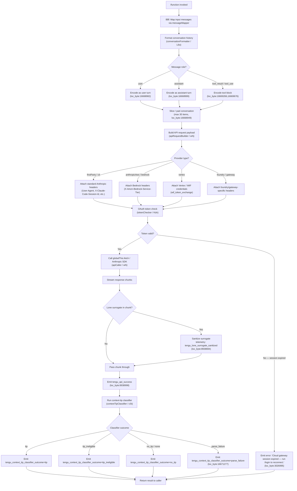

# `/function`

> Analysis basis: CC v2.1.191 bundle.js (AST extraction + Claude interpretation)
> Minimum version: v2.1.191

---

## Overview

The `/function` command is registered as a `"command"` type slash command in Claude Code. Based on the call graph analysis, it initiates a pipeline that processes conversation history (mapping messages, classifying context, generating API requests, and emitting streamed responses) rather than operating as a simple prompt-type command. The handler (`B$f`) delegates to a broad set of subsystems including conversation formatting, API communication, background worker management, and context-tip classification.

---

## Registration

| Field | Value |
|---|---|
| type | `command` |
| name | `function` |
| description | `null` |
| loc_byte | `13530856` |
| loc_byte_end | `13530889` |
| loc_line | `10025` |
| arbor_handler.name | `B$f` |
| arbor_handler.fqn | `claude-2.1.191::B$f` |
| arbor_handler.kind | `Function` |
| arbor_handler.resolution_path | `direct` |
| arbor_handler.n_hits | `1` |

Analysis basis: CC v2.1.191 bundle.js:+13530856

---

## Input Branching

The handler involves more than three distinct execution paths (API provider selection, context classification, background worker lifecycle, surrogate sanitization, cache-control configuration), so a Mermaid flowchart is used.



---

## Behavioral Spec

### 1. Handler Entry (`B$f`)

```
function commandHandler(inputMessages, context):
    mapped = inputMessages.map(messageMapper)       // e.map, loc_byte:13530537
    result = buildAndSendRequest(mapped, context)   // delegates to apiRequestPipeline
    sideQueryResult = xSe(result)                   // xSe called from B$f, loc_byte:13530608
    return result
```

Analysis basis: CC v2.1.191 bundle.js:+13530537, +13530608

---

### 2. Conversation Formatter (`conversationFormatter` / `L6o`)

```
function conversationFormatter(messages):
    MAX_MESSAGES = 30                               // literal, loc_byte:16668949
    sliced = messages.slice(-MAX_MESSAGES)          // L6o → e.slice, loc_byte:16668940

    formatted = []
    for msg in sliced:
        role = msg.role                             // "user" | "assistant", loc_byte:16668982,16668999
        if role == "user" or role == "assistant":
            formatted.push(encodeTextBlock(msg))    // r.push, loc_byte:16669122
        elif msg.type == "tool_result":             // loc_byte:16669266
            formatted.push(encodeToolResult(msg))
        elif msg.type == "tool_use":               // loc_byte:16669676
            encoded = encodeToolUse(msg)
            if msg.isError:
                encoded.suffix = " (error)"        // literal, loc_byte:16669486
            formatted.push(encoded)

    // Token estimation guard: items > 1000 trimmed  // literal, loc_byte:16669144
    formatted = trimToTokenBudget(formatted, limit=300)  // literal, loc_byte:16669651

    // Build classifier input
    classifierInput = buildAutoClassifierInput(formatted)  // msm → n.toAutoClassifierInput, loc_byte:16669905

    return formatted.join(separator)               // r.join, loc_byte:16669769
```

Analysis basis: CC v2.1.191 bundle.js:+16668940, +16668949, +16668982, +16668999, +16669122, +16669144, +16669266, +16669446, +16669486, +16669651, +16669676, +16669769, +16669905

---

### 3. API Request Builder (`apiRequestPipeline` / `wN`)

```
function apiRequestPipeline(formattedMessages, context):
    timestamp = Date.now()                          // wN → Date.now, loc_byte:8938970
    provider = detectProvider(context)             // oW subsystem

    headers = buildBaseHeaders(provider)
    // Standard headers always attached:
    //   User-Agent, x-app, X-Claude-Code-Session-Id
    //   x-claude-remote-container-id, x-client-app
    //   x-claude-code-agent-id, x-anthropic-additional-protection
    //   (loc_byte range 3025831–3026368)

    if provider == "anthropicAws":
        headers["X-Amzn-Bedrock-Service-Tier"] = ...  // loc_byte:3027489
    elif provider == "vertex":
        credentials = resolveWifCredentials()      // TZe → wif_credentials_resolve, loc_byte:2350113
    elif provider == "foundry":
        resourceId = resolveFoundryResource()      // vOr → unknown-foundry-resource fallback, loc_byte:2354121

    token = oauthTokenCheck(context)               // Kdn subsystem, loc_byte:3026626
    if tokenExpired(token):
        raise Error("Cloud gateway session expired — run /login to reconnect.")  // loc_byte:3026995

    // Prompt cache configuration
    cacheWindow = "1h"                             // literal, loc_byte:8938216
    if cacheEnabled:
        headers["cache_control"] = buildCacheControl()  // kAt, loc_byte:8939465

    payload = assemblePayload(formattedMessages, headers, context)
    response = globalThis.fetch(endpoint, payload)  // loc_byte:8937388

    return streamResponse(response)
```

Analysis basis: CC v2.1.191 bundle.js:+3025831, +3026368, +3026626, +3026995, +3027489, +8937388, +8938216, +8938970, +8939465

---

### 4. OAuth Token Checker (`oauthTokenChecker` / `Kdn`)

```
function oauthTokenCheck(context):
    log("[API:auth] OAuth token check starting")   // literal, loc_byte:3026414

    if proxyAuthHelperConfigured AND NOT trustAccepted:
        log("warn", "proxyAuthHelper configured ... skipping")  // loc_byte:1865645
        return null

    token = fetchToken(context)
    TIMEOUT_MS = 30000                             // literal, loc_byte:1865944

    if elapsed > TIMEOUT_MS:
        reportError("timed out")                   // literal, loc_byte:1866138
    if token == null:
        reportError("did not return a value")      // literal, loc_byte:1866182

    log("[API:auth] OAuth token check complete")   // literal, loc_byte:3026468
    return token
```

Analysis basis: CC v2.1.191 bundle.js:+3026414, +3026468, +1865645, +1865944, +1866138, +1866182

---

### 5. Background Worker Manager (`backgroundWorkerManager` / `L`)

```
function backgroundWorkerSweep(workers, memoryState):
    now = Date.now()                               // L → Date.now, loc_byte:17374617
    
    // Shift grace clocks forward
    V.shiftGraceClocksForward(workers)             // loc_byte:17374676

    // Memory check via system monitor
    freemem = X8l.freemem()                        // Nzt → X8l.freemem, loc_byte:13163551
    retireGraceMs = 480                            // literal, loc_byte:13163628

    // Low-memory fallback: retire pinned settled workers
    if lowMemoryPersists:
        log("bg: low memory persists after shedding non-pinned — retiring pinned settled workers as a last resort")
        // loc_byte:17375120
        emit("tengu_bg_retire_pinned_low_mem")     // loc_byte:17375231

    // Respawn idle/stale workers
    V.respawnIfIdleStale(workers)                  // loc_byte:17374847

    // Prewarm workers
    emit("tengu_bg_prewarm_per_sweep", count)      // loc_byte:17375352
    prewarmWorkerCount = 12                        // literal, loc_byte:17375386

    // Retire settled workers
    V.retireIfSettled(workers)                     // loc_byte:17374938
    j.retireIfSettled(workers)                     // loc_byte:17375283

    return Promise.all(tasks)                      // loc_byte:17374901
```

Analysis basis: CC v2.1.191 bundle.js:+17374617, +17374676, +17374847, +17374901, +17374938, +17375120, +17375231, +17375283, +17375352, +17375386, +13163551, +13163628

---

### 6. Context-Tip Classifier (`contextTipClassifier` / `cSt`)

```
function contextTipClassifier(apiResponse):
    MAX_TOKENS = 512                               // literal, loc_byte:16671099
    modelHint = "context_tip_classifier"           // literal, loc_byte:16671138

    toolUseBlock = findToolUseBlock(apiResponse)
    if toolUseBlock == null:
        log("[context-tips] no tool_use block in response")  // loc_byte:16671216
        emit("tengu_context_tip_classifier_outcome", {outcome: "tips_context_classify_no_tool_use"})
        return "no_tip"

    parsed = responseSchema.safeParse(toolUseBlock)  // D6n → t.safeParse, loc_byte:8934129
    if parsed.error:
        log("[context-tips] response failed schema parse")  // loc_byte:16671438
        emit("tengu_context_tip_classifier_outcome", {outcome: "tips_context_classify_parse_failed"})
        return "parse_failure"

    outcome = parsed.data.outcome
    // outcome ∈ {"tip", "tip_ineligible", "no_tip", "none"}  // loc_byte:16671782–16671838

    emit("tengu_context_tip_classifier_outcome", {
        outcome: "tips_context_classify",           // loc_byte:16671339
        result: outcome
    })
    return outcome
```

Analysis basis: CC v2.1.191 bundle.js:+16671099, +16671138, +16671216, +16671277, +16671339, +16671363, +16671438, +16671584, +16671782, +16671788, +16671805, +16671838, +16672143

---

### 7. Surrogate Sanitizer (`surrogateHandler` / `u7e` / `etn`)

```
function sanitizeLoneSurrogates(chunk):
    // Check each character code for surrogate range
    // Surrogate high range: 55296–56319  // loc_byte:202777, 202787
    if containsLoneSurrogate(chunk):
        sanitized = replaceSurrogates(chunk)       // Zen → e.replace, loc_byte:203026
        emit("tengu_lone_surrogate_sanitized")     // loc_byte:8938694
        return sanitized
    return chunk
```

Analysis basis: CC v2.1.191 bundle.js:+202742, +202777, +202787, +203026, +8938694

---

## State & Side Effects

| Item | Detail |
|---|---|
| Telemetry: `tengu_prompt_cache_1h_config` | Emitted when prompt cache with 1-hour window is configured (loc_byte:13616098) |
| Telemetry: `tengu_bg_retire_grace_bridged_min` | Emitted during background worker grace-period retirement (loc_byte:13163592) |
| Telemetry: `tengu_bg_retire_pinned_low_mem` | Emitted when low memory forces retirement of pinned settled workers (loc_byte:17375231) |
| Telemetry: `tengu_bg_attach_upgrade` | Emitted when a background worker attach is upgraded (loc_byte:13163664) |
| Telemetry: `tengu_bg_prewarm_per_sweep` | Emitted each background sweep reporting prewarm count (loc_byte:17375352) |
| Telemetry: `tengu_lone_surrogate_sanitized` | Emitted when a lone Unicode surrogate is detected and replaced in a response chunk (loc_byte:8938694) |
| Telemetry: `tengu_api_success` | Emitted on successful API response completion (loc_byte:8938998) |
| Telemetry: `tengu_context_tip_classifier_outcome` | Emitted with classifier outcome label after each context-tip classification run (loc_byte:16672225) |
| Telemetry: `tengu_feature_bad` | Emitted when a feature flag check fails / feature is bad (loc_byte:1025792) |
| Telemetry: `tengu_feature_ok` | Emitted when a feature flag check passes (loc_byte:1025725) |
| OAuth side effect | Calls token refresh (marked `"refreshed"`, loc_byte:3076964) and logs start/complete of token check |
| Background workers | Spawns, respawns, retires, and prewarms background workers on each sweep cycle |
| Prompt cache | Writes `cache_control` header / cache-control block when 1h cache is configured |
| Console error | `dve` and `Kdn` may emit `console.error` on SDK errors or proxy auth failure (loc_byte:3025354, 1866233) |
| Session ID | Attaches `X-Claude-Code-Session-Id` and `x-claude-remote-session-id` headers to outbound requests |
| `process.exit` | `Cs` subsystem calls `process.exit(1)` on `cli_error` condition (loc_byte:13196585, 13196598) |

---

## Version History

| Version | Change |
|---|---|
| v2.1.191 | Initial analysis |

---

## Common Mistakes

1. **Expecting a visible UI prompt**: `/function` has `description: null` and is a `"command"` type (not `"prompt"` type), so it does not present a natural-language prompt body to the user. Invoking it without understanding its pipeline role will produce unexpected behavior.
2. **Assuming simple linear execution**: The handler orchestrates at least six major subsystems (conversation formatter, API builder, OAuth checker, background worker manager, context-tip classifier, surrogate sanitizer). Debugging requires tracing through all of them.
3. **Ignoring the 30-message conversation cap**: The conversation formatter silently slices to the last 30 messages (loc_byte:16668949). Content beyond this window is dropped without warning.
4. **Not handling the session-expired error path**: If the OAuth token is expired or the cloud gateway session has lapsed, the command emits a hard error ("Cloud gateway session expired — run /login to reconnect.", loc_byte:3026995) and does not fall back to a retry automatically.
5. **Misinterpreting context-tip classifier outcomes**: The classifier returns one of four labels (`"tip"`, `"tip_ineligible"`, `"no_tip"`, `"none"`), not a boolean. Treating any non-`"tip"` outcome as a failure is incorrect; `"tip_ineligible"` and `"no_tip"` are normal non-error paths.
6. **Overlooking the proxyAuthHelper trust requirement**: If a proxy authentication helper is configured in project/local settings but workspace trust has not been accepted, the auth helper is silently skipped (loc_byte:1865645), which can cause silent auth failures.

---

## Appendix — Identifier Mapping

> For bundle debugging only. Identifiers change across versions.

| Identifier | Role |
|---|---|
| `B$f` | Main handler for the `/function` command (arbor_handler, direct resolution) |
| `L6o` | Conversation formatter — maps and slices message history |
| `gsm` | Token-budget map setter within conversation formatter |
| `msm` | Auto-classifier input builder — calls `toAutoClassifierInput` |
| `har` | Character/surrogate utility used in conversation and classifier input encoding |
| `hx` | Low-level character-code slice helper (surrogate detection) |
| `ke` | JSON stringification utility |
| `wN` | API request pipeline orchestrator |
| `xf` | Sub-utility called from API pipeline (initialization) |
| `wt` | HTTP transport layer wrapper |
| `oW` | Full API client implementation (headers, auth, fetch, retry) |
| `mz` | Internal module reference within API client |
| `p3r` | String splitter/trimmer for header processing |
| `Ks` | Header construction helper |
| `Mz` | Error/issue reporter (links to GitHub issues) |
| `GPr` | URL encoder / path replacer |
| `T` | Generic request transformer / header attacher |
| `rt` | String coercion utility |
| `Ng` | OAuth token refresh dispatcher |
| `XKs` | Boolean coercion utility |
| `_y` | Authentication config resolver |
| `_ud` | Credential/token utility |
| `xr` | Cross-request state reference |
| `Kdn` | OAuth token checker with timeout and trust guard |
| `Iud` | Session/UUID manager (randomUUID, session map) |
| `PH` | Mantle/provider handler |
| `G2` | Provider-specific sub-router |
| `fy` | Auth flow executor (OAuth steps, proxy auth) |
| `Tud` | Token descriptor builder |
| `yud` | Provider-specific flow (anthropicAws, vertex, foundry, gateway) |
| `SCe` | Streaming response handler |
| `Rdr` | Request timestamp / rate-limit recorder |
| `pMt` | Header normalization (lowercases entry keys) |
| `dve` | Anthropic SDK error/warn/info/debug logger |
| `BSn` | Base streaming node (NI, Es, ao) |
| `D` | Supervisor output writer / error emitter |
| `x` | Request-expiry cache manager (60000 ms TTL, loc_byte:16683677) |
| `v` | Focus/blur state tracker (blurred/focused, 3600000 ms, 0.8 threshold) |
| `w` | Internal shared state reference |
| `Ooe` | Model prefix checker (PPc.find, startsWith) |
| `nv` | Input handler hook |
| `yA` | Agent session initializer / profile-implicit auth |
| `ACe` | WIF token exchange handler |
| `TZe` | WIF credentials resolver (fetches from API endpoint) |
| `I` | Pagination / token-count state controller |
| `h` | Stream chunk consumer |
| `b2e` | Model compatibility checker (claude-3-*, claude-opus-4-0, etc.) |
| `ao` | Application-inference-profile resolver |
| `o1` | Secondary provider handler |
| `lie` | Auth header injector |
| `$At` | Auth token store reference |
| `vOr` | Foundry resource resolver (unknown-foundry-resource fallback) |
| `_` | Feature flag registry |
| `a` | Feature flag evaluator / store accessor |
| `CBp` | Model finder (e.find, n.find) |
| `SHo` | SHA-256 hash builder (JVa.createHash) |
| `Ghn` | User-agent / session-header assembler |
| `ol` | String coercion helper |
| `_r` | Internal resolver / registry reference |
| `uu` | Ymn-based utility |
| `$hn` | Async-local-store accessor (YKs.getStore) |
| `hCe` | Header completion helper |
| `aIn` | Additional-input resolver |
| `aje` | Prompt-cache configuration handler (1h window) |
| `To` | Cache-control token builder |
| `dpr` | Cache-control descriptor |
| `nt` | Background worker node (IDt, CDt, RTn, gW) |
| `ppr` | Cache-policy param builder |
| `wD` | HIPAA-mode adapter |
| `C3r` | HIPAA resolver |
| `A2e` | HIPAA-mode transport wrapper |
| `L` | Background worker sweep manager |
| `V` | Worker pool controller (shiftGraceClocksForward, respawnIfIdleStale, retireIfSettled) |
| `Nzt` | Memory monitor (X8l.freemem, Yer) |
| `J8l` | Worker grace-clock bridger |
| `I3e` | Cache file reader/cleaner (lstat, rm, readFile) |
| `Le` | Worker lifecycle logger (GQ.logError) |
| `U` | Worker existence set |
| `Gn` | Worker group iterator |
| `W` | Shared state / event bus |
| `j` | Secondary worker pool |
| `Xer` | Worker attach upgrader |
| `q` | Backspace-key / worker-respawn handler |
| `ZVa` | Response validator |
| `sp` | Text replacement utility |
| `XSn` | Temperature/model-option setter |
| `av` | Array mapper utility |
| `Txe` | Tool-execution wrapper |
| `P4` | Random-bytes / tool-id generator |
| `Sc` | Tool scheduler |
| `etn` | Message array stack manager (tool-use normalization) |
| `Qen` | Message validator (Jen, ANc.test) |
| `iD` | Structured-clone utility |
| `u7e` | Lone-surrogate replacement handler |
| `Zen` | Surrogate-string replacer (i7o, e.replace) |
| `Ve` | Event emitter wrapper (eze) |
| `eze` | Core event-emitter primitive |
| `LOr` | Response-header parser |
| `l7s` | Header-value splitter/trimmer/validator |
| `wOr` | Tool-permission checker (web_search, "and" combinator) |
| `mbe` | Metrics buffer emitter |
| `Tr` | Telemetry recorder (lh, Ve) |
| `lh` | Low-level telemetry emitter (eze) |
| `Oo` | Output formatter (eze) |
| `H1t` | Output rendering orchestrator (v3i, Rot, h1t) |
| `v3i` | Output path router (rOd, Le) |
| `Rot` | Output sink (lh) |
| `h1t` | Output line handler (Rot, g1t) |
| `NF` | Agent-name resolver (agent:builtin:, agent:custom:, agent:) |
| `nOd` | Agent prefix stripper (startsWith, slice) |
| `xD` | Thread-type checker (repl_main_thread) |
| `kAt` | Cache-control writer |
| `S4` | Side-query dispatcher (ev, PPr) |
| `ev` | Side-query event emitter |
| `PPr` | Side-query payload builder (zp) |
| `zp` | Payload assembler (P1e, T4s, A4s, bxt, _r) |
| `usm` | Conversation summary builder (csm) |
| `csm` | Message-list mapper (e.map) |
| `hsm` | Summary string joiner (t.push, t.join) |
| `M6n` | Model capability finder (e.find) |
| `cSt` | Context-tip classifier orchestrator |
| `Pe` | Classifier event emitter (eze) |
| `Re` | Classifier result recorder (W, Pe) |
| `D6n` | Schema-safe parser (t.safeParse) |
| `we` | Classifier outcome dispatcher (W, Pe) |
| `Ae` | String coercion for classifier output |
| `xSe` | Post-handler side-effect runner (called from B$f) |
| `Cs` | CLI error handler (nqe, fT, process.exit) |

---

Note: index built via Arbor fallback; some signals (telemetry, literals) may be missing — see arbor-fallback.js.