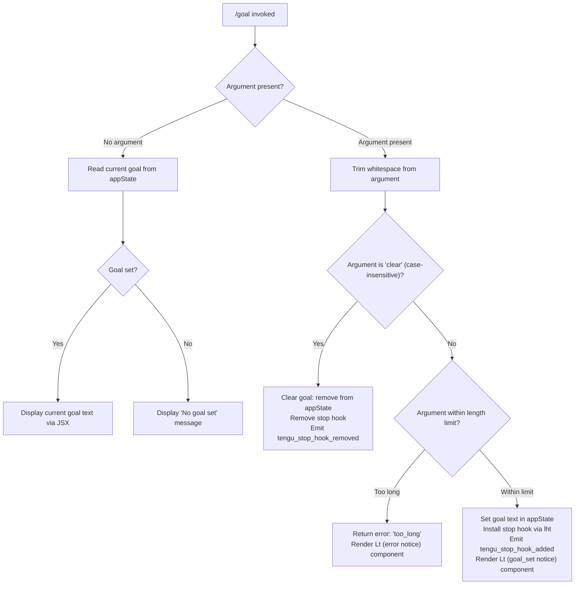

# `/goal`

> Analysis basis: CC v2.1.191 bundle.js (AST extraction + Claude interpretation)
> Minimum version: v2.1.191

---

## Overview

`/goal` lets the user set a persistent completion condition that Claude checks before stopping at the end of each agentic turn. When a goal is active, Claude evaluates whether the stated condition has been met and continues working if it has not. Issuing `/goal clear` removes any previously set goal.

---

## Registration

| Field | Value |
|---|---|
| type | `local-jsx` |
| name | `goal` |
| description | `Set a goal Claude checks before stopping` |
| argumentHint | `[<condition> \| clear]` |
| immediate | `true` |
| module_id | `r8l` |
| load_inline | `true` |
| loc_byte | `13111416` |
| loc_byte_end | `13111602` |
| loc_line | `8779` |
| arbor_handler.name | `n1f` |
| arbor_handler.fqn | `claude-2.1.191::n1f` |
| arbor_handler.kind | `AsyncFunction` |
| arbor_handler.resolution_path | `module_id` |
| arbor_handler.n_hits | `0` |

Analysis basis: CC v2.1.191 bundle.js:+13111416

---

## Input Branching

Four distinct logical paths exist depending on the argument supplied to `/goal`, so a Mermaid flowchart is used.



Analysis basis: CC v2.1.191 bundle.js:+13110029, +13110055, +13110131, +13110145, +13110253, +13110379

---

## Behavioral Spec

### Handler Entry Point (`goalCommandHandler`)

The primary handler is the async function `n1f` (Arbor resolution: `module_id` path from registration `r8l`).

```
async function goalCommandHandler(argument, context):
    trimmedArg = argument.trim()                        // → n.trim at +13110029

    if trimmedArg is empty:
        // Display mode: show current goal or "No goal set"
        currentGoal = readGoalFromAppState(context)
        if currentGoal exists:
            return renderGoalDisplay(currentGoal)       // JSX via o8l.jsx at +13110055
        else:
            return renderNoGoalMessage()                // literal "No goal set" at +13110170

    if isLiteralClear(trimmedArg):                     // → mKn at +13110131
        clearGoalAndHook(context)                       // → cht at +13110145
        return

    if trimmedArg exceeds maximum length:
        return renderErrorNotice("too_long")            // → Lt with "too_long" at +13110267

    setGoalAndInstallHook(trimmedArg, context)          // → lht at +13110379
    return renderSuccessNotice("goal_set")              // → Lt with "goal_set" at +13110256
```

Analysis basis: CC v2.1.191 bundle.js:+13110029

---

### Clear Detection (`isClearKeyword`)

Checks whether the user's trimmed argument equals the keyword `"clear"` using a case-insensitive comparison.

```
function isClearKeyword(input):
    normalised = input.toLowerCase()               // → e.toLowerCase at +10758290
    return goalKeywordSet.has(normalised)           // → Bnf.has at +10758282
```

Analysis basis: CC v2.1.191 bundle.js:+13110131

---

### Clear Goal and Remove Stop Hook (`clearGoalAndHook`)

```
async function clearGoalAndHook(context):
    currentState = context.getAppState()           // → e.getAppState at +10759487
    newState = removeGoalFromState(currentState)   // via wt / aht at +10759476
    context.setAppState(newState)                  // → e.setAppState at +10759616
    context.applyMessageOp({                       // → e.applyMessageOp at +10759685
        type: "append",
        role: "system",
        content: clearNotice
    })
    unregisterStopHook(context)                    // fires tengu_stop_hook_removed
    emitTelemetry("tengu_stop_hook_removed")       // +10759742
    renderComponent(W, Ve)                         // JSX commit at +10759740, +10759773
```

Analysis basis: CC v2.1.191 bundle.js:+13110145, +10759616, +10759742

---

### Set Goal and Install Stop Hook (`setGoalAndInstallHook`)

```
async function setGoalAndInstallHook(goalText, context):
    // Resolve hook gate: hooks_gate and trust_gate flags checked
    hookGate = resolvePolicyHookGate(context)      // LCo → TB → "hooks_gate" +10758880
    trustGate = resolveTrustGate(context)          // LCo → iae → "trust_gate" +10758934

    currentState = context.getAppState()           // → t.getAppState at +10759069
    timestamp   = Date.now()                       // +10759233
    updatedState = applyGoalToState(              // via wt / aht
                      currentState, goalText)

    // Persist goal text and timestamp
    context.setAppState(updatedState)              // → t.setAppState at +10759271

    // Append a system-role message reflecting the new goal
    context.applyMessageOp({                       // → t.applyMessageOp at +10759313
        type: "append",
        role: "system",
        kind: "goal",
        content: goalText,
        attachment: generateAttachmentId()         // lgl → sgl.randomUUID at +10759836
    })

    // Register stop hook: Claude will evaluate goalText before each stop
    registerStopHook({                             // → iy at +10759258
        kind: "goal_status",                       // literal "goal_status" +10759905
        condition: goalText
    })
    emitTelemetry("tengu_stop_hook_added")         // +10759370

    // Render confirmation notice
    renderComponent(W, Ve, we)                     // +10759368, +10759421, +10759434
```

Analysis basis: CC v2.1.191 bundle.js:+13110379, +10759271, +10759370, +10759836, +10759905

---

### Stop Hook Registration Infrastructure

The stop hook registered by `/goal` plugs into the broader stop-hook subsystem (`cht` / `lht`). Each registered hook is assigned a UUID, stored as a `"goal_status"` kind entry, and evaluated before the agent yields control. The hook check uses the `outputTokens` counter (literal at +48285) and an `Object.values` pass over active hooks (via `iy` at +10759258).

```
function registerStopHook(hookDescriptor):
    hookId = generateUUID()                 // sgl.randomUUID +10759836
    hookStore.set(hookId, {
        kind:      hookDescriptor.kind,     // "goal_status"
        condition: hookDescriptor.condition
    })
    // Hook evaluated inside iy() which checks Object.values(hookStore)
    // and calls Eze if any hook is unsatisfied (+48252)
```

Analysis basis: CC v2.1.191 bundle.js:+10759836, +10759905, +48252

---

### JSX Rendering (`renderGoalStatus`)

The command renders its feedback via `o8l.jsx` (called from `n1f` at +13110055). The JSX component receives one of three string tokens — `"goal_set"`, `"too_long"`, or `"No goal set"` — and selects the appropriate visual treatment. The `"system"` role literal (+13110214) is used to style the notice as a system-level message.

Analysis basis: CC v2.1.191 bundle.js:+13110055, +13110170, +13110214, +13110256, +13110267

---

## State & Side Effects

| Item | Detail |
|---|---|
| Telemetry | `tengu_stop_hook_added` (+10759370), `tengu_stop_hook_removed` (+10759742) |
| Telemetry (indirect) | `tengu_api_success` (+8938998), `tengu_feature_ok/bad/sad` (+1025725/+1025792/+1025873), `tengu_context_tip_classifier_outcome` (+16672225) |
| Stop hook registration | Adds a `"goal_status"` kind hook entry (UUID-keyed) to the hook store when a goal is set; removes it on `clear` |
| appState changes | `setAppState` called to store or remove the goal text and associated timestamp |
| Message log | A `"system"` role message with kind `"goal"` and type `"append"` is appended to the conversation on both set and clear |
| JSX rendering | `o8l.jsx` used to render command output inline in the REPL |
| Hook gating | `hooks_gate` and `trust_gate` policy flags consulted before hook installation |
| Sound | <!-- TODO: not found in depth-2 traversal; needs --depth 4 --> |

---

## Version History

| Version | Change |
|---|---|
| v2.1.191 | Initial analysis |

---

## Common Mistakes

1. **Forgetting `clear` removes the hook entirely.** If you set a goal and later want Claude to stop normally, you must explicitly run `/goal clear`; simply setting a new goal replaces the condition text but the hook remains registered.
2. **Argument length limit.** Goal text that exceeds the internal length threshold returns a `"too_long"` error without setting the goal. Keep conditions concise.
3. **Case-sensitivity of `clear`.** The keyword is matched after `toLowerCase()`, so `Clear`, `CLEAR`, and `clear` all work — but any other value (even `""` after trim) is treated as a new goal condition.
4. **No-argument invocation is read-only.** Running `/goal` with no argument displays the current goal (or "No goal set") but does not modify state.
5. **Hook is session-scoped.** The stop hook persists only for the current session; it is not saved across restarts and must be re-set after reloading Claude Code.

---

## Appendix — Identifier Mapping

> For bundle debugging only. Identifiers change across versions.

| Identifier | Role |
|---|---|
| `n1f` | Main goal command handler (AsyncFunction; Arbor-resolved via module_id `r8l`) |
| `mKn` | `isClearKeyword` — checks if argument matches the `"clear" keyword |
| `cht` | `clearGoalAndHook` — removes goal from appState and unregisters stop hook |
| `lht` | `setGoalAndInstallHook` — writes goal to appState and registers stop hook |
| `aht` | `applyGoalToState` — mutates app state object with goal data |
| `cMe` | Internal state map setter used during goal application |
| `YYa` | Array mapper used when building state update |
| `lgl` | UUID generator wrapper (calls `sgl.randomUUID`) |
| `LCo` | Policy gate resolver (checks hooks_gate and trust_gate) |
| `TB` | `hooks_gate` policy flag evaluator |
| `iae` | `trust_gate` policy flag evaluator |
| `Md` | Sub-resolver called by `LCo` for policy settings |
| `G9f` | Deep policy-settings resolver |
| `iy` | Stop hook evaluator (checks `Object.values` of hook store, calls `Eze`) |
| `Lt` | JSX notice component for goal_set / too_long feedback |
| `gKn` | Tail helper called at end of `n1f` (role unknown at depth-2) |
| `wN` | API call orchestrator (used by `e`) |
| `e` | Context-tip classifier side-query function |
| `L6o` | Conversation-history formatter |
| `gsm` | Token-count setter within history formatting |
| `msm` | Auto-classifier input builder |
| `har` | Surrogate-sanitising string helper |
| `hx` | Low-level character-code slice utility |
| `Cs` | Process exit wrapper (emits `"cli_error"`, calls `process.exit`) |
| `oW` | Anthropic SDK HTTP client factory |
| `Kdn` | OAuth / proxy-auth header builder |
| `Iud` | Request-ID and streaming response manager |
| `PH` | Mantle authentication handler |
| `TZe` | WIF credentials resolver (calls `fetch`) |
| `ACe` | WIF token-exchange handler |
| `wt` | App-state read/write utility |
| `rt` | String coercion utility |
| `_r` | Internal reference/pointer helper |
| `ol` | String builder utility |
| `uu` | YAML/config formatter |
| `$hn` | AsyncLocalStorage store accessor (`YKs.getStore`) |
| `Ghn` | User-agent string builder |
| `xf` | Low-level HTTP transport |
| `Ng` | OAuth token refresher |
| `_y` | Environment / credential resolver |
| `_ud` | Token validator |
| `Mz` | Issue-URL formatter |
| `GPr` | URL encoder helper |
| `T` | HTTP-header builder |
| `aje` | Agent-invocation builder |
| `To` | Agent thread manager |
| `nt` | Background worker scheduler |
| `ppr` | <!-- TODO: not found in depth-2 traversal; needs --depth 4 --> |
| `dpr` | <!-- TODO: not found in depth-2 traversal; needs --depth 4 --> |
| `wD` | HIPAA-mode handler |
| `C3r` | HIPAA reference resolver |
| `A2e` | HIPAA string builder |
| `L` | Background worker sweep loop |
| `Nzt` | Memory-pressure monitor |
| `J8l` | Grace-clock bridge helper |
| `I3e` | Stale-file remover |
| `Le` | Worker lifecycle manager |
| `Gn` | Worker group helper |
| `Xer` | Worker attach-upgrade helper |
| `SCe` | Promise-based delay/timer utility |
| `Rdr` | Timestamp delta recorder |
| `pMt` | Header normaliser (lowercases keys) |
| `BSn` | Stream-event dispatcher |
| `dve` | SDK error logger |
| `yud` | Provider-routing helper |
| `Ooe` | Model-prefix classifier |
| `nv` | Output-token counter |
| `yA` | Profile / OAuth session manager |
| `G2` | IMU / device-id helper |
| `fy` | Proxy-auth helper |
| `Tud` | Streaming response finaliser |
| `b2e` | Foundry / Bedrock model selector |
| `ao` | Application-inference-profile builder |
| `o1` | Reference resolver used by `b2e` |
| `lie` | Cache-control header builder |
| `$At` | Cache-control constants holder |
| `vOr` | Foundry resource name normaliser |
| `CBp` | Structured-output schema finder |
| `SHo` | SHA-256 hash helper |
| `aIn` | Anonymous reference used by `wN` |
| `ZVa` | <!-- TODO: not found in depth-2 traversal; needs --depth 4 --> |
| `XSn` | Temperature-setting applicator |
| `av` | Message mapper |
| `Txe` | Cache-annotation injector |
| `P4` | Random-bytes nonce generator |
| `Sc` | Cache-annotation state manager |
| `etn` | Tool-result message builder |
| `Qen` | Tool-result normaliser |
| `u7e` | User-message builder |
| `Zen` | User-message normaliser |
| `iD` | Structured-clone wrapper |
| `Ve` | Event-emitter wrapper |
| `eze` | Core event-emitter |
| `LOr` | Locale/language resolver |
| `l7s` | Locale string parser |
| `wOr` | Allowed-tool set manager |
| `mbe` | <!-- TODO: not found in depth-2 traversal; needs --depth 4 --> |
| `Tr` | Trace/log writer |
| `lh` | Low-level log helper |
| `Oo` | Output formatter |
| `H1t` | Hook-chain runner |
| `v3i` | Hook-chain resolver |
| `Rot` | Hook-chain logger |
| `h1t` | Hook-chain state tracker |
| `NF` | Built-in / custom agent dispatcher |
| `nOd` | Agent-prefix stripper |
| `xD` | `repl_main_thread` identity check |
| `kAt` | Cache-control epoch annotator |
| `S4` | Side-query runner |
| `ev` | Side-query event emitter |
| `PPr` | Side-query prompt builder |
| `zp` | Side-query request assembler |
| `usm` | Conversation-context summariser |
| `csm` | Conversation-context mapper |
| `hsm` | Conversation-context joiner |
| `M6n` | Tool-use block finder |
| `cSt` | Context-tip classifier orchestrator |
| `Pe` | Feature-flag evaluator (ok path) |
| `Re` | Feature-flag evaluator (tips path) |
| `D6n` | Schema safe-parse wrapper |
| `we` | Feature-flag evaluator (third path) |
| `Ae` | String coercion for feature results |