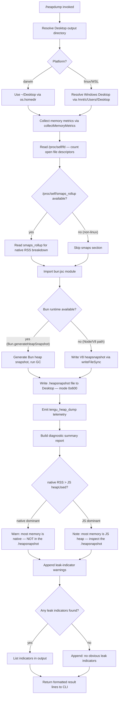

# `/heapdump`

> Analysis basis: CC v2.1.191 bundle.js (AST extraction + Claude interpretation)
> Minimum version: v2.1.191

---

## Overview

`/heapdump` is a hidden, non-interactive diagnostic command that captures a JavaScript heap snapshot and a rich set of process memory metrics, then writes both to the user's Desktop directory. It is intended for memory-leak investigation: the resulting `.heapsnapshot` file can be loaded directly into Chrome DevTools → Memory → Load, and the companion JSON report contains warnings when native memory significantly exceeds the JS heap.

---

## Registration

| Field | Value |
|---|---|
| type | `local` |
| name | `heapdump` |
| description | `Dump the JS heap to ~/Desktop` |
| supportsNonInteractive | `true` |
| isHidden | `true` |
| module_id | `M9l` |
| load_inline | `true` |
| loc_byte | `12739345` |
| loc_byte_end | `12739773` |
| loc_line | `8619` |
| arbor_handler.name | `j0f` |
| arbor_handler.fqn | `claude-2.1.191::j0f` |
| arbor_handler.kind | `AsyncFunction` |
| arbor_handler.resolution_path | `module_id` |
| arbor_handler.n_hits | `0` |

Analysis basis: CC v2.1.191 bundle.js:+12739345

---

## Input Branching

The command has 3+ distinct execution branches (Bun runtime vs. Node/V8 runtime for heap snapshot generation; macOS `/proc` smaps availability; native-vs-JS memory dominance diagnostic). A Mermaid flowchart is used.



---

## Behavioral Spec

### Handler Entry — `heapDumpCommandHandler` (bundle ident: `j0f`)

The Arbor-resolved handler is an `AsyncFunction` reached via `module_id → M9l`.

```
async function heapDumpCommandHandler(commandContext):
    lines = []
    lines.push("Open the .heapsnapshot in Chrome DevTools → Memory → Load to inspect retainers.")

    outputPath = resolveDesktopOutputPath()        // aus → rbr.homedir + "Desktop"
    memMetrics  = collectMemoryMetrics()           // R9l
    snapPath    = writeHeapSnapshot(outputPath)    // G0f
    emitTelemetry("tengu_heap_dump")               // W, loc_byte 12737466

    summary = buildDiagnosticSummary(memMetrics)   // W0f
    lines.push(...summary)
    lines.push(...formatOutput())                  // t.push / t.join

    return lines.join("\n")
```

Analysis basis: CC v2.1.191 bundle.js:+12738214, +12738333, +12738360, +12738482

---

### Desktop Path Resolution — `resolveDesktopPath` (bundle ident: `aus`)

```
function resolveDesktopPath():
    home = os.homedir()                        // rbr.homedir, loc_byte 1106407
    platform = detectPlatform()                // Wt

    if platform is "linux" and /mnt/c/Users exists:
        // WSL: walk /mnt/c/Users, skip "Public", "Default", "Default User", "All Users"
        windowsUser = firstRealUserDir("/mnt/c/Users")
        return path.join("/mnt/c/Users", windowsUser, "Desktop")
    else:
        return path.join(home, "Desktop")      // vf.join + "Desktop", loc_byte 1106453
```

Analysis basis: CC v2.1.191 bundle.js:+12737172, +1106407, +1106443, +1106453

---

### Memory Metrics Collection — `collectMemoryMetrics` (bundle ident: `R9l`)

```
function collectMemoryMetrics():
    result = {}

    // Node.js built-in process metrics
    result.memoryUsage    = process.memoryUsage()           // loc_byte 12734377
    result.heapStats      = v8.getHeapStatistics()          // RZn.getHeapStatistics, loc_byte 12734401
    result.resourceUsage  = process.resourceUsage()         // loc_byte 12734427
    result.uptime         = process.uptime()                // loc_byte 12734453
    result.heapSpaces     = v8.getHeapSpaceStatistics()     // RZn.getHeapSpaceStatistics, loc_byte 12734478
    result.activeHandles  = process._getActiveHandles()     // loc_byte 12734520
    result.activeRequests = process._getActiveRequests()    // loc_byte 12734557

    // Linux-only: open file descriptor count
    try:
        fds = fs.readdir("/proc/self/fd")                   // z_t.readdir, loc_byte 12734608
        result.openFdCount = fds.length
    catch:
        result.openFdCount = null

    // Linux-only: smaps_rollup for native RSS
    try:
        smaps = fs.readFile("/proc/self/smaps_rollup", "utf8")  // z_t.readFile, loc_byte 12734670
        result.smaps = parseSmaps(smaps)                        // y → PGe, loc_byte 12734781
    catch:
        result.smaps = null

    // Thresholds used in analysis:
    //   FD warning threshold: 3600 open file descriptors (loc_byte 12734909)
    //   RSS unit divisor: 1048576 (bytes → MB) (loc_byte 12734914)
    //   Leak ratio threshold: 100 % native-over-heap (loc_byte 12735061)

    // Format RSS values using .toFixed() (loc_byte 12735270)

    return result
```

Analysis basis: CC v2.1.191 bundle.js:+12734377 – +12735270

---

### Heap Snapshot Writer — `writeHeapSnapshot` (bundle ident: `G0f`)

```
function writeHeapSnapshot(desktopDir):
    snapshotPath = path.join(desktopDir, timestampedFilename)

    if typeof Bun !== "undefined" and Bun.generateHeapSnapshot:
        // Bun runtime path
        snapshot = Bun.generateHeapSnapshot()               // loc_byte 12737914
        Bun.gc(/* aggressive */ true)                       // loc_byte 12737971
        fs.writeFileSync(snapshotPath, snapshot,
            { encoding: "arraybuffer" })                    // x9l.writeFileSync, loc_byte 12737894
                                                            // encoding literal "arraybuffer", loc_byte 12737944
    else:
        // Node / V8 path — the "v8" label is present in literals (loc_byte 12737939)
        v8.writeHeapSnapshot(snapshotPath)

    // File is written with mode 0o600 (decimal 384) (loc_byte 12737359)
    return snapshotPath
```

Analysis basis: CC v2.1.191 bundle.js:+12737894, +12737914, +12737939, +12737971, +12737359

---

### Diagnostic Summary Builder — `buildDiagnosticSummary` (bundle ident: `W0f`)

```
function buildDiagnosticSummary(metrics):
    lines = []
    heapUsedMB   = metrics.memoryUsage.heapUsed  / 1_048_576
    rssMB        = metrics.memoryUsage.rss        / 1_048_576
    nativeMB     = Math.max(rssMB - heapUsedMB, 0)   // Math.max, loc_byte 12738589

    // Memory dominance branch
    if nativeMB > heapUsedMB:
        lines.push("— most memory is native (NOT in the .heapsnapshot)")  // loc_byte 12738717
    else:
        lines.push("— most memory is JS heap (inspect the .heapsnapshot)") // loc_byte 12738657

    // Leak indicators via leakIndicatorChecker (Y_t), loc_byte 12738901
    indicators = leakIndicatorChecker(metrics)
    if indicators.length == 0:
        lines.push("  (no obvious leak indicators)")   // loc_byte 12738854
    else:
        lines.push(...indicators)

    // 1 GiB boundary note (1073741824 bytes, loc_byte 12739263)
    // formatted with precision 8 (loc_byte 12738989)

    return lines
```

Analysis basis: CC v2.1.191 bundle.js:+12738589, +12738657, +12738717, +12738854, +12738901, +12739263

---

### Native Memory Leak Warning — inside `collectMemoryMetrics` (bundle ident: `R9l`)

When the ratio of native RSS to JS heap usage exceeds 100 % (threshold literal `100`, loc_byte 12735061) the following advisory is appended to the output:

> "Native memory > heap - leak may be in native addons (node-pty, sharp, etc.)"
> (literal, loc_byte 12735147)

When no indicators are found:

> "No obvious leak indicators. Check heap snapshot for retained objects."
> (literal, loc_byte 12736266)

Platform guard: the string `"macos"` (loc_byte 12736001) and `"darwin"` (loc_byte 12736420) appear in the metric-collection path, gating macOS-specific metric sources. The RSS unit divisor `1024` (loc_byte 12736011) is used on that platform branch.

Analysis basis: CC v2.1.191 bundle.js:+12735061, +12735147, +12736001, +12736011, +12736266, +12736420

---

### Result Formatting — main handler `j0f`

The handler aggregates result lines via repeated `t.push` (loc_byte 12738360) calls and joins them with `t.join` (loc_byte 12738482) before returning the final string to the CLI renderer. The introductory instruction line is:

> "Open the .heapsnapshot in Chrome DevTools → Memory → Load to inspect retainers."
> (literal, loc_byte 12738370)

Analysis basis: CC v2.1.191 bundle.js:+12738360, +12738370, +12738482

---

## State & Side Effects

| Item | Detail |
|---|---|
| Telemetry | `tengu_heap_dump` (loc_byte 12737466) — fired after successful snapshot write |
| Telemetry (transitive, background attach layer) | `tengu_bg_proto_mismatch`, `tengu_bg_dispatch_stale_drop`, `tengu_bg_attach_legacy_autorespawn`, `tengu_bg_attach`, `tengu_bg_attach_stall_gave_up`, `tengu_bg_attach_stall_respawn`, `tengu_bg_attach_kick` |
| Telemetry (transitive, API layer) | `tengu_api_success`, `tengu_lone_surrogate_sanitized`, `tengu_context_tip_classifier_outcome`, `tengu_feature_ok`, `tengu_feature_bad` |
| File written | `<Desktop>/<timestamp>.heapsnapshot` — mode `0o600` (owner read/write only) |
| File written (companion) | JSON memory report written alongside snapshot via `z_t.writeFile` (loc_byte 12737324) |
| GC triggered | `Bun.gc(true)` called immediately after Bun snapshot generation (loc_byte 12737971) |
| Process introspection | Calls `process._getActiveHandles()` and `process._getActiveRequests()` — these are private Node.js APIs |
| `/proc` reads | Reads `/proc/self/fd` (directory listing) and `/proc/self/smaps_rollup` (text) on Linux; silently skipped on other platforms |
| appState changes | None detected within depth-2 traversal |
| Sound | None detected |
| Hook registration | `_i → xqo.register` (loc_byte 67562) reached transitively; direct hook involvement in this command is <!-- TODO: not found in depth-2 traversal; needs --depth 4 --> |

---

## Version History

| Version | Change |
|---|---|
| v2.1.191 | Initial analysis |

---

## Common Mistakes

1. **Expecting output on the terminal.** The primary artifact is a file on the Desktop, not inline CLI output. The command prints a short summary but the actual heap data lives in `~/Desktop/<timestamp>.heapsnapshot`.
2. **Running on a headless server without a Desktop directory.** The path resolver targets `~/Desktop` (or the WSL Windows Desktop). If neither exists, the file write will fail. Pre-create the directory or run the command on a developer workstation.
3. **Ignoring the "native memory" warning.** When the summary reports that native memory dominates, the `.heapsnapshot` file will not contain the leaked memory. Investigate native addons (e.g., `node-pty`, `sharp`) separately.
4. **Using the snapshot with a non-Chromium DevTools.** The `.heapsnapshot` format is a V8/Bun-specific binary/JSON format. Only Chrome DevTools (or compatible Chromium-based tooling) can parse the retainer graph.
5. **Assuming the command is interactive.** `isHidden: true` means `/heapdump` does not appear in the slash-command picker. It must be typed explicitly. It also supports non-interactive mode (`supportsNonInteractive: true`), so it can be invoked from scripts.
6. **Running repeatedly in quick succession.** Each invocation triggers `Bun.gc(true)` (an aggressive garbage-collection pass) and writes a potentially large snapshot file. On a memory-constrained host this may cause transient slowdowns.

---

## Appendix — Identifier Mapping

> For bundle debugging only. Identifiers change across versions.

| Identifier | Role |
|---|---|
| `j0f` | Main async handler for `/heapdump` (Arbor-resolved entry point) |
| `hOo` | Orchestration function — coordinates path resolution, metric collection, snapshot writing, and result assembly |
| `wt` | Utility: platform/environment detection helper |
| `ux` | Sub-utility called by platform detection |
| `R9l` | `collectMemoryMetrics` — gathers `process.memoryUsage`, V8 heap stats, resource usage, uptime, heap spaces, FD count, smaps |
| `y` | smaps / proc file parser dispatcher |
| `PGe` | TeammateMailbox `markMessagesAsRead` (transitive — unrelated to heapdump core) |
| `H` | Buffer accumulation / IPC stream helper (transitive, background protocol layer) |
| `h` | Stream chunk helper (transitive) |
| `m` | Process map / signal helper (transitive) |
| `yp` | Stream end / flush helper (transitive) |
| `Opm` | Background protocol message dispatcher (transitive) |
| `Ae` | String conversion utility |
| `T` | Log/output formatter — formats structured messages for the CLI renderer |
| `wNc` | Sub-formatter or renderer helper |
| `kqo` | Formatter sub-utility |
| `e` | Context-tips classification pipeline entry (transitive) |
| `L6o` | Conversation history truncation helper (transitive) |
| `o` | Column padding / table formatter (transitive) |
| `wN` | API request builder / side-query executor (transitive) |
| `S4` | Schema validation helper (transitive) |
| `usm` | Context summary builder (transitive) |
| `hsm` | Output line builder (transitive) |
| `M6n` | Tool-use block finder (transitive) |
| `cSt` | Feature-flag checker (transitive) |
| `Re` | Feature-flag checker variant (transitive) |
| `D6n` | Zod safe-parse wrapper (transitive) |
| `we` | Feature-flag checker variant B (transitive) |
| `ke` | `JSON.stringify` wrapper / serializer |
| `t` | Output line accumulator array (local to handler) |
| `Dc` | Path/string formatter — directory and filename manipulation |
| `h7o` | Filename component mapper |
| `r` | String/path segment helper |
| `n` | String normalization helper |
| `a7e` | Stream write adapter |
| `s7o` | Low-level stream write helper |
| `kNc` | Log rotation / append-file writer (transitive) |
| `Oze` | Debounce / batch-write scheduler (transitive) |
| `Rfe` | Log-file path builder (transitive) |
| `Gt` | `fs.mkdir` / directory ensure helper |
| `Noe` | Directory-entry filter (EISDIR guard) |
| `y7o` | Log file path joiner |
| `nmr` | Log file rotation checker (stat + rename + unlink) |
| `RNc` | Log file append writer (mkdir + appendFile + rotate) |
| `_i` | Hook/listener registration dispatcher (`xqo.register`) |
| `aus` | `resolveDesktopPath` — resolves `~/Desktop` (or WSL Windows Desktop) |
| `G0f` | `writeHeapSnapshot` — generates and writes the `.heapsnapshot` file (Bun or V8) |
| `W` | Telemetry emission helper |
| `fo` | Error construction helper (`new Error(String(...))`) |
| `up` | Result post-processor or output renderer |
| `Le` | Structured logger / error logger (`GQ.logError`) |
| `rt` | String coercion utility |
| `Yi` | Log queue flusher |
| `ncs` | Log queue formatter |
| `Rmu` | Log ring-buffer manager (`Oin.shift` / `Oin.push`) |
| `W0f` | `buildDiagnosticSummary` — computes native vs JS memory dominance and assembles human-readable summary lines |
| `Y_t` | `leakIndicatorChecker` — evaluates collected metrics and returns an array of human-readable leak-indicator strings |

---

Note: index built via Arbor fallback; some signals (telemetry, literals) may be missing — see arbor-fallback.js.