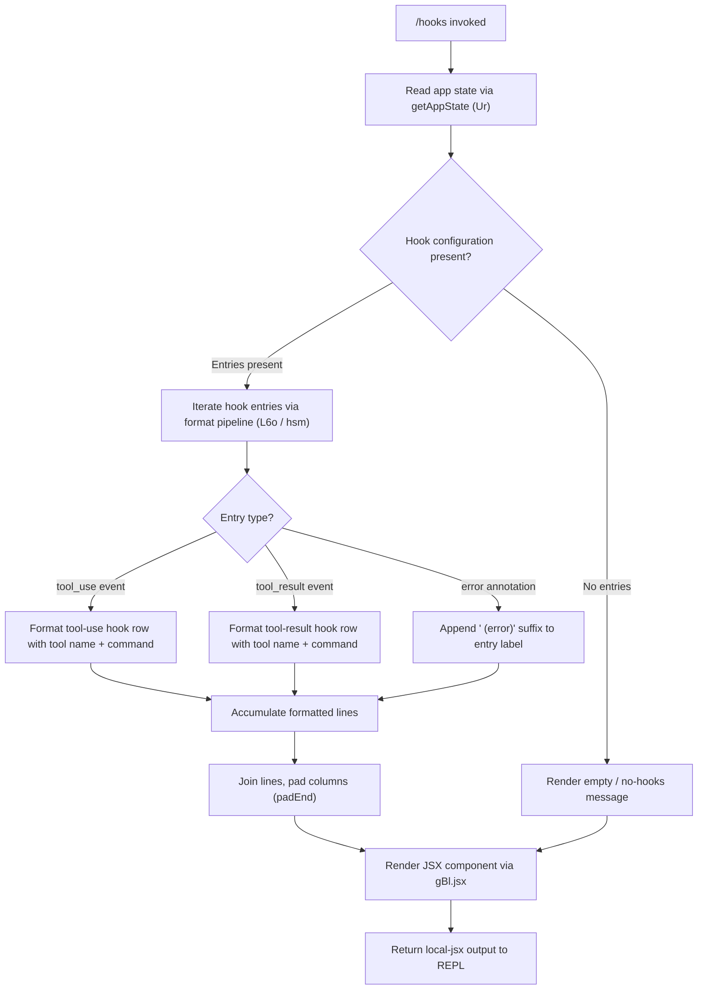

# `/hooks`

> Analysis basis: CC v2.1.191 bundle.js (AST extraction + Claude interpretation)
> Minimum version: v2.1.191

---

## Overview

The `/hooks` command displays the currently active hook configurations for tool events in Claude Code. It reads hook settings from application state, formats them into a human-readable table or list view, and renders the result inline as a JSX component in the REPL. The command is immediate (no round-trip to the model is needed) and is read-only with respect to hook configuration.

---

## Registration

| Field | Value |
|---|---|
| type | `local-jsx` |
| name | `hooks` |
| description | `View hook configurations for tool events` |
| loc_byte | `12629873` |
| loc_byte_end | `12630023` |
| loc_line | `8497` |
| immediate | `true` |
| module_id | `mBl` |
| load_inline | `true` |
| arbor_handler.name | `pxf` |
| arbor_handler.fqn | `claude-2.1.191::pxf` |
| arbor_handler.kind | `AsyncFunction` |
| arbor_handler.resolution_path | `module_id` |
| arbor_handler.n_hits | `0` |

Analysis basis: CC v2.1.191 bundle.js:+12629873

---

## Input Branching

The command accepts no user arguments. The branching is driven entirely by internal state — specifically whether hook configuration entries exist, whether each hook has associated tool-event entries, and whether any entry produces display content. Three or more distinct display paths exist, so a flowchart is used.



Analysis basis: CC v2.1.191 bundle.js:+12629681, +12629715, +12629753

---

## Behavioral Spec

### Handler Entry Point

The Arbor-resolved handler is `pxf` (AsyncFunction, resolved via `module_id` path). It is the effective main handler for `/hooks`.

```
async function hooksCommandHandler(context):
    emit telemetry("tengu_hooks_command")
    appState = readAppState(context)           // via getAppState
    hookConfig = extractHookConfig(appState)   // via state accessor (Ur)
    formattedOutput = formatHookDisplay(hookConfig)
    return renderJSX(formattedOutput)          // via gBl.jsx
```

Analysis basis: CC v2.1.191 bundle.js:+12629681, +12629683, +12629715, +12629723, +12629753

---

### App State Reading (`Ur`)

The state reader function resolves the most-recently active working context. It uses `findLast` over the conversation/session state to locate the relevant entry and extracts the following named fields for display:

- `working_directory` — the active working directory (bundle.js:+10899808)
- `allowed_tools` — tools permitted in the current session (bundle.js:+10899863)
- `disallowed_tools` — tools explicitly blocked (bundle.js:+10899918)
- `avoid_prompts` — prompts to skip (bundle.js:+10899979)
- `permission_mode` — current permission enforcement mode (bundle.js:+10900081)
- `bypassPermissions` — whether bypass is active (bundle.js:+10900112)
- `session`, `effort`, `model`, `max_thinking_tokens`, `flag_settings` — supplementary session metadata (bundle.js:+10900411–+10900487)

```
function readHookState(appState):
    entry = appState.findLast(item => item has hook config)
    return extractFields(entry, [
        "working_directory", "allowed_tools", "disallowed_tools",
        "avoid_prompts", "permission_mode", "bypassPermissions",
        "session", "effort", "model", "max_thinking_tokens", "flag_settings"
    ])
```

Analysis basis: CC v2.1.191 bundle.js:+10899703, +10899783, +10899808–+10900487

---

### Hook Entry Formatting (`L6o` / `hsm`)

The formatting pipeline iterates hook configuration entries and constructs display rows. Key behaviors:

- Slices the entry collection to at most **30** items before processing (bundle.js:+16668949).
- Classifies each entry by message role: `"user"` (bundle.js:+16668982) or `"assistant"` (bundle.js:+16668999).
- Checks entry content type: `"text"` (bundle.js:+16669206), `"tool_use"` (bundle.js:+16669676), `"tool_result"` (bundle.js:+16669266).
- Entries with an error condition append the suffix `" (error)"` to the label (bundle.js:+16669486).
- Column alignment is performed with `padEnd` using two-space padding (`"  "`, bundle.js:+17397162).
- The limit of **1000** entries applies to an inner data structure (bundle.js:+16669144).
- Tool-use entries with a display limit cap at **300** characters (bundle.js:+16669651).
- Data buffer size for content items is capped at **1024** bytes (bundle.js:+17267676).

```
function formatHookEntries(hookEntries):
    sliced = hookEntries.slice(0, 30)
    rows = []
    for entry in sliced:
        label = entry.toolName or entry.eventType
        if entry.isError:
            label = label + " (error)"
        if entry.type == "tool_use":
            row = formatToolUseRow(label, entry.command, maxLen=300)
        elif entry.type == "tool_result":
            row = formatToolResultRow(label, entry.output)
        elif entry.type == "text":
            row = formatTextRow(label, entry.content)
        rows.push(row.padEnd(columnWidth, "  "))
    return rows.join("\n")
```

Analysis basis: CC v2.1.191 bundle.js:+16668916, +16668940, +16668949, +16669122, +16669138, +16669161, +16669206, +16669266, +16669414, +16669446, +16669486, +16669651, +16669676

---

### JSX Rendering (`VP` → display components)

After the text formatting pipeline completes, the handler delegates to `VP` (the display component builder), which assembles the final output node using several sub-components:

- `vv` — wraps the formatted hook list as a styled block.
- `cTo` / `uTo` — layout containers (column/row) using `io` as the primitive renderer.
- `qne` — filters entries for display eligibility (e.g., `"blocked"` entries are excluded, bundle.js:+10339864).
- `Y3` — the top-level output node compositor.
- `fu` / `J1` — row and item component constructors.
- Feature flag check via `dl.isEnabled` and `c.isEnabled` (bundle.js:+10340754, +10340884).
- MCP server status check via `o.some` and `n.has` before rendering server-linked hooks (bundle.js:+10340703, +10340731).

```
function buildHooksDisplay(formattedRows, appState):
    filtered = filterDisplayEligible(formattedRows)  // excludes "blocked"
    if featureFlagEnabled("hooks_display"):
        layout = buildColumnLayout(filtered)
    else:
        layout = buildFallbackLayout(filtered)
    return compositeOutputNode(layout)
```

Analysis basis: CC v2.1.191 bundle.js:+10340368, +10340440, +10340455, +10340469, +10340491, +10340506, +10340518, +10340578, +10340685, +10340703, +10340731, +10340743, +10340754, +10340830, +10340845, +10340873, +10340884, +10340926, +10340971

---

### MCP Server Integration (via `rGl` / daemon status)

The hook display checks whether any hook is associated with an MCP server. This involves reading the daemon status file (`daemon.status.json`, bundle.js:+12894435) and querying the local MCP registry.

```
function checkMCPServerHooks(hookList):
    daemonStatus = readDaemonStatus("daemon.status.json")
    for hook in hookList:
        if hook.serverName present:
            serverEntry = lookupMCPRegistry(hook.serverName)
            annotateHookWithServerStatus(hook, serverEntry)
    return annotatedHookList
```

Analysis basis: CC v2.1.191 bundle.js:+12894421, +12894430, +12894435, +12894532, +12894547, +12894579, +12894596, +12894602

---

## State & Side Effects

| Item | Detail |
|---|---|
| Telemetry | `tengu_hooks_command` (bundle.js:+12629683) — fired once on command invocation |
| Telemetry (incidental, depth-2) | `tengu_api_success`, `tengu_context_tip_classifier_outcome`, `tengu_daemon_config_reload`, `tengu_daemon_control`, `tengu_daemon_yield`, `tengu_disable_bypass_permissions_mode`, `tengu_feature_bad`, `tengu_feature_ok`, `tengu_lone_surrogate_sanitized`, `tengu_prompt_cache_1h_config`, `tengu_bg_retire_pinned_low_mem`, `tengu_bg_prewarm_per_sweep`, `tengu_slate_harbor`, `tengu_workflows_enabled`, `tengu_cobalt_ridge` |
| Hook registration | None — `/hooks` is a read-only viewer; it does not register or modify hooks |
| appState changes | None — reads app state via `getAppState` but makes no mutations |
| Immediate flag | `true` — command executes without invoking the AI model |
| JSX render | Outputs a `local-jsx` component directly to the REPL terminal |
| File I/O | Reads `daemon.status.json` (via `rGl`) to annotate MCP server-linked hooks |
| Sound | None detected in depth-2 traversal |

---

## Version History

| Version | Change |
|---|---|
| v2.1.191 | Initial analysis |

---

## Common Mistakes

1. **Expecting model output**: `/hooks` is `immediate: true` and renders a JSX component locally. It does not send a prompt to Claude and produces no AI-generated text.
2. **Modifying hooks via this command**: `/hooks` is purely a viewer. To add, remove, or modify hook configurations, edit the appropriate configuration file or use the settings interface — `/hooks` will reflect the updated state on next invocation.
3. **Assuming all hook entries appear**: The formatting pipeline slices to the first **30** entries (bundle.js:+16668949). If more than 30 hooks are configured, only the first 30 are displayed.
4. **Missing MCP-linked hooks**: Hook entries associated with MCP servers require the daemon to be running and `daemon.status.json` to be readable. If the daemon is stopped, those hook rows may not render with full server-status annotations.
5. **Confusing the display cap with a configuration limit**: The 300-character display truncation (bundle.js:+16669651) applies to the rendered command string in tool-use hook rows only; it does not truncate the underlying stored configuration.

---

## Appendix — Identifier Mapping

> For bundle debugging only. Identifiers change across versions.

| Identifier | Role |
|---|---|
| `pxf` | Main handler for `/hooks` command (AsyncFunction, Arbor-resolved) |
| `W` | Utility / logging helper called at handler entry |
| `Ur` | App-state reader; extracts hook-relevant session fields via `getAppState` |
| `L6o` | Hook entry formatting pipeline (slices, classifies, formats rows) |
| `gsm` | Inner state setter used during formatting |
| `har` | Sub-formatter helper called within `L6o` and `msm` |
| `msm` | Auto-classifier input formatter; calls `toAutoClassifierInput` |
| `VP` | Display component builder; assembles the JSX output tree |
| `vv` | Styled block wrapper for formatted hook list |
| `cTo` | Column layout container component |
| `uTo` | Row layout container component |
| `io` | Primitive JSX renderer node |
| `qne` | Display eligibility filter (excludes "blocked" entries) |
| `cWt` | Permission/tool-narrowing classifier used within filter |
| `CV` | Tool-deny classifier component |
| `C$o` | Tool-narrowing component with MCP awareness |
| `w$o` | Supplementary narrowing helper |
| `Y3` | Top-level output compositor node |
| `fu` | Row component constructor |
| `J1` | Item component constructor |
| `lP` | Layout primitive / padding utility |
| `uUt` | Column-width computation helper |
| `_r` | Renderer utility for terminal output |
| `uu` | Additional renderer utility |
| `rGl` | MCP daemon status reader (reads `daemon.status.json`) |
| `HZ` | Daemon status file path resolver |
| `ozt` | Path joiner for daemon status file |
| `d` | Display writer / MCP server manager within VP subtree |
| `YVe` | File stat checker for hook-related assets |
| `yWl` | Column-width max calculator |
| `h0c` | Heartbeat / MCP server config reload handler |
| `tae` | Heartbeat timer helper |
| `E` | MCP connection state machine (connected/failed/stopped) |
| `vSt` | MCP transport state initializer |
| `Le` | MCP error logger / retry helper |
| `fo` | Error string formatter |
| `A` | MCP server lifecycle controller (start/stop/updateConfig) |
| `u` | Daemon lifecycle handler (stop/restart sequence) |
| `BG` | Daemon graceful shutdown orchestrator |
| `ohe` | Shutdown signal emitter |
| `fhe` | Timeout clearer for daemon shutdown |
| `jn` | Abort/timeout primitive |
| `wN` | Side-query API execution engine (used for context around hook display) |
| `xf` | API stream initializer |
| `oW` | API request builder with auth headers |
| `b2e` | Model-compatibility checker (structured outputs) |
| `lie` | OAuth token retrieval helper |
| `CBp` | Session-state lookup helper |
| `SHo` | SHA-256 hash utility (session fingerprinting) |
| `Ghn` | User-agent / session header builder |
| `aIn` | Additional request renderer |
| `aje` | Thread-label / context-key resolver |
| `wD` | API response decoder |
| `sp` | String sanitizer / replacer |
| `XSn` | Temperature / structured-output injector |
| `av` | Result mapper |
| `Txe` | API error type classifier |
| `etn` | Message tree node pop/push utility |
| `iD` | Structured clone helper |
| `u7e` | Alternate message tree pop/push utility |
| `Ve` | Feature-gate evaluator |
| `LOr` | Locale / language resolver |
| `wOr` | Permission cache checker |
| `mbe` | Metrics buffer emitter |
| `Tr` | Telemetry record emitter |
| `Oo` | Output formatter |
| `H1t` | Notification / sound trigger |
| `NF` | Subagent mode detector |
| `kAt` | Cache-control annotator |
| `S4` | Ephemeral message builder |
| `ev` | Event emitter primitive |
| `PPr` | Prompt builder helper |
| `usm` | Conversation summary builder |
| `csm` | Conversation mapper |
| `hsm` | Hook display line assembler (push + join) |
| `M6n` | Tool-use block finder in response |
| `T` | Content-block type classifier / formatter |
| `wNc` | Path-aware content classifier |
| `ke` | JSON serializer wrapper |
| `Dc` | Redaction / path trimmer |
| `a7e` | String segment helper |
| `kNc` | File-size-aware context builder |
| `cSt` | Conversation state tracker |
| `Pe` | State primitive (eze-based) |
| `Re` | Retry/recovery state wrapper |
| `D6n` | Schema safe-parser (Zod-style) |
| `we` | Feature-ok state emitter |
| `Ae` | String coercion utility |
| `n` | Message collection / locale helper |
| `i` | Stream/connection close helper |
| `s` | Resource set manager (add/delete/finally) |
| `zKn` | Hook event namespace resolver (ns-based) |
| `YKn` | Alternate hook event namespace resolver |
| `AB` | Bypass-permissions disabler |
| `nt` | Notification dispatch / dedup system |
| `IDt` | Notification ID tracker |
| `CDt` | Notification cooldown tracker |
| `B4` | Notification batch helper |
| `RTn` | Notification dedup set manager |
| `kt` | Notification emit with timestamp |
| `K9` | Boolean yes/no renderer |
| `ol` | String coercer |
| `rt` | Terminal string renderer |
| `dn` | Error code extractor |
| `qs` | Async store getter |
| `_No` | No-op / null handler |
| `E` | MCP transport state machine |
| `U2t` | MCP stop signal emitter |
| `An` | Background session label |
| `l` | Daemon log reader / rGl wrapper |
| `Jlt` | Local-agent session type builder |
| `mC` | Session type row formatter |
| `DA` | Display adapter / ol wrapper |
| `ygt` | Column-gap calculator |
| `Gcl` | Gap column layout helper |
| `Jl` | Layout join helper |
| `c` | MCP enabled-check proxy |
| `ZVa` | Batch size / pagination helper |
| `L` | Background worker sweep scheduler |
| `dsm` | Diff/state merge helper |

---

Note: index built via Arbor fallback; some signals (telemetry, literals) may be missing — see arbor-fallback.js.