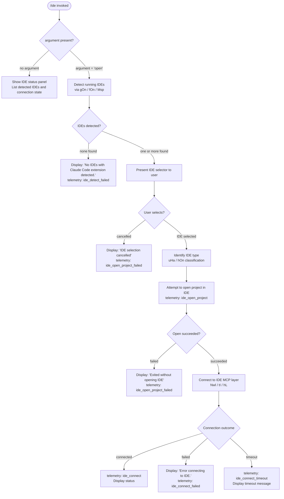

# `/ide`

> Analysis basis: CC v2.1.191 bundle.js (AST extraction + Claude interpretation)
> Minimum version: v2.1.191

---

## Overview

`/ide` manages IDE integrations for Claude Code: it detects running IDEs that have the Claude Code extension installed, optionally opens the current project in a selected IDE, and displays live connection status. When invoked with the `open` sub-command argument, it additionally attempts to launch or focus the chosen IDE and establish an active connection session.

---

## Registration

| Field | Value |
|---|---|
| type | `local-jsx` |
| name | `ide` |
| description | `Manage IDE integrations and show status` |
| argumentHint | `[open]` |
| module_id | `Uwl` |
| load_inline | `true` |
| loc_byte | `11697973` |
| loc_byte_end | `11698129` |
| loc_line | `7232` |
| arbor_handler.name | `tHf` |
| arbor_handler.fqn | `claude-2.1.191::tHf` |
| arbor_handler.kind | `AsyncFunction` |
| arbor_handler.resolution_path | `module_id` |
| arbor_handler.n_hits | `0` |

Analysis basis: CC v2.1.191 bundle.js:+11697973

---

## Input Branching

The command has 4+ distinct branches based on argument value, IDE detection results, and connection outcome.



---

## Behavioral Spec

### 1. Command Entry — Handler `tHf`

The primary async handler (Arbor symbol `tHf`, module `Uwl`) is the top-level async function for this command.

```
async function ideCommandHandler(context, args):
    emit telemetry event "tengu_ext_ide_command"  // bundle.js:+11694170

    subCommand = args[0] if args else null

    if subCommand == "open":
        await openIdeFlow(context)
    else:
        renderIdeStatusPanel(context)
```

Analysis basis: CC v2.1.191 bundle.js:+11694168 – +11694290

---

### 2. IDE Detection — `gOn` / `fOn` / `Msp`

When the `open` subcommand is present, the handler invokes the IDE detection subsystem.

```
async function detectIDEs(context):
    // Enumerate connected IDE session ports (Hr / Dt / Gin)
    connectedPorts = getConnectedIDESessions()

    // For each candidate path, call Msp to probe filesystem markers
    candidates = await Promise.all(
        portList.map(port => probeIDEInstallation(port))
    )

    // Also probe via process listing (Rsp / jPr / Kr)
    // On Linux: runs shell command matching known IDE process names
    // (bundle.js:+6798901)
    processMatches = await scanRunningProcesses()

    // Merge, deduplicate, and filter
    allIDEs = merge(candidates, processMatches)
        .filter(ide => hasClaudeExtension(ide))

    return allIDEs
```

Key detection strings found in literals:
- Process scan pattern includes: `code`, `cursor`, `windsurf`, `devin-desktop`, `idea`, `pycharm`, `webstorm`, `phpstorm`, `rubymine`, `clion`, `goland`, `rider`, `datagrip`, `dataspell`, `aqua`, `gateway`, `fleet`, `android-studio` (bundle.js:+6798901)
- Platform branch for `linux` at bundle.js:+6798875
- WSL home path prefix `/mnt/c/Users` at bundle.js:+6792142

Analysis basis: CC v2.1.191 bundle.js:+6794136 – +6795533

---

### 3. IDE Type Classification — `uHa` / `hOn`

```
function classifyIDEType(ideNameRaw):
    name = ideNameRaw.toLowerCase()

    if name includes "windsurf":   return "windsurf"   // +6797001
    if name includes "devin":      return "devin"      // +6797025
    if name includes "cursor":     return "cursor"     // +6797065
    if name includes "insiders":   return "insiders"   // +6797105
    if name includes "vscode"
       or "vs code"
       or "visual studio code":    return "vscode"     // +6797130–6797175
    if name includes "vscodium"
       or "code - oss"
       or "codium":                return "vscodium"   // +6797209–6797452
    // JetBrains IDEs detected via "jetbrains" marker  // +6790316

    return "unknown"
```

The `hOn` function additionally resolves the executable path, appending `.cmd` on Windows (bundle.js:+6797584) and checking `Gt` (stat) to confirm existence.

Analysis basis: CC v2.1.191 bundle.js:+6796971 – +6797567

---

### 4. Open-Project Flow

```
async function openProjectInIDE(selectedIDE, context):
    emit telemetry "ide_open_project"             // +11694703
    // Determine if worktree or standard project  // +11694737, +11694748

    try:
        result = await launchIDEWithPath(selectedIDE, projectPath)
        if not result.success:
            emit telemetry "ide_open_project_failed"  // +11694810
            display "Exited without opening IDE"      // +11695100
            return
    catch error:
        emit telemetry "ide_open_project_failed"
        display error details

    // Proceed to connection phase
    await connectToIDE(context, selectedIDE)
```

Analysis basis: CC v2.1.191 bundle.js:+11694700 – +11694810

---

### 5. IDE Connection — React Component `Nwl`

The status/connection UI is rendered by the JSX component `Nwl`, which uses React hooks (`useState`, `useRef`, `useEffect`, `useCallback`) and subscribes to app state changes via `yd` / `Ht`.

```
function IDEStatusComponent(props):
    [connectionState, setConnectionState] = useState(null)
    ideRef = useRef(null)

    useEffect(() => {
        // Subscribe to IDE connection events
        // Filter for "mcp__ide__" prefixed tool entries  // +11696790
        // On connect:
        //   emit "ide_connect"                           // +11696200
        // On fail:
        //   emit "ide_connect_failed"                   // +11696287
        //   display "Error connecting to IDE."          // +11696512
        // On timeout:
        //   emit "ide_connect_timeout"                  // +11696394
    }, [deps])

    useEffect(() => {
        // Monitor for ide_disconnect events             // +11696893
        // Track ws: connection type                     // +11697010
    }, [deps])

    return renderIDEStatusJSX(connectionState)
```

Connection transport types observed in literals:
- `"sse-ide"` (bundle.js:+11692209)
- `"ws-ide"` (bundle.js:+11692229)

Analysis basis: CC v2.1.191 bundle.js:+11695983 – +11697189

---

### 6. Status Panel — No-Argument Rendering

When `/ide` is called without arguments, the handler renders a status view showing currently connected IDE integrations and their MCP tool status. The component `Nwl` renders with available IDE session data.

```
function renderIdeStatusPanel(context):
    ideList = getConnectedIDESessions()      // via Dt / Gin / Hr
    if ideList is empty:
        display "No IDEs with Claude Code extension detected."  // +11694385

    for each ide in ideList:
        display ide name (bold via St.bold)   // +11694764
        display connection status
        display active MCP tools prefixed "mcp__ide__"
```

Analysis basis: CC v2.1.191 bundle.js:+11694383 – +11694445

---

### 7. IDE Install-Extension Callback

The handler registers a callback `t.onInstallIDEExtension` (bundle.js:+11695277), allowing the UI to prompt the user to install the Claude Code extension if no installed extension is detected. The `Dte` helper is invoked subsequently (bundle.js:+11695304), and an instruction literal `"restart your IDE"` is surfaced to the user (bundle.js:+11695369).

---

### 8. Workspace Detection via `Msp`

`Msp` resolves IDE-related workspace paths by:
1. Joining the `.claude` subdirectory marker (bundle.js:+6791935) under the IDE root.
2. Using `iHa.homedir()` to anchor paths (bundle.js:+6791921).
3. Skipping WSL paths matching `/mnt/c/Users/{Public,Default,Default User,All Users}` (bundle.js:+6792142 – +6792300).
4. Checking `i.isDirectory()` and `i.isSymbolicLink()` before accepting an entry.
5. Calling `oHa.realpath()` to canonicalize, then deduplicating via a `Set`.

Analysis basis: CC v2.1.191 bundle.js:+6791844 – +6792668

---

## State & Side Effects

| Item | Detail |
|---|---|
| Telemetry: `tengu_ext_ide_command` | Fired on every invocation of `/ide` (bundle.js:+11694170) |
| Telemetry: `ide_detect` | Fired when IDE scan succeeds (literal at +11695491 via `gOn`→`we`) |
| Telemetry: `ide_detect_failed` | Fired when no IDE with extension is found (bundle.js:+6795555) |
| Telemetry: `ide_open_project` | Fired when open-project attempt starts (bundle.js:+11694703) |
| Telemetry: `ide_open_project_failed` | Fired on failure to open project or user cancellation (bundle.js:+11694810) |
| Telemetry: `ide_connect` | Fired on successful IDE MCP connection (bundle.js:+11696200) |
| Telemetry: `ide_connect_failed` | Fired on connection failure (bundle.js:+11696287) |
| Telemetry: `ide_connect_timeout` | Fired on connection timeout (bundle.js:+11696394) |
| Telemetry: `ide_disconnect` | Fired when an IDE disconnects (bundle.js:+11696893) |
| Telemetry: `tengu_mcp_skills` | Fired during MCP tool enumeration via `hL` (bundle.js:+6756547) |
| MCP tool prefix | IDE tools registered under `"mcp__ide__"` prefix (bundle.js:+11696790) |
| appState changes | IDE connection state written via `useSetAppState` / `Ht` hooks; subscription via `Pwe.useSyncExternalStore` |
| Hook registration | `t.onInstallIDEExtension` callback registered (bundle.js:+11695277) |
| Process scan (Linux) | Spawns `ps aux \| grep -E "..."` shell command on Linux (bundle.js:+6798901) via `jPr` / `Kr` |
| Sound | None observed |
| File I/O | Reads `.claude` directory markers; uses `iHa.homedir`, `oHa.realpath`, `Gt` (stat) for workspace probing |

---

## Version History

| Version | Change |
|---|---|
| v2.1.191 | Initial analysis |

---

## Common Mistakes

1. **Calling `/ide open` when no IDE has the Claude Code extension installed** — The command will report "No IDEs with Claude Code extension detected." and exit. Install the Claude Code extension in your IDE first, then retry.
2. **Expecting `/ide` (no argument) to open an IDE** — Without the `open` argument, the command only shows status. Use `/ide open` to trigger IDE launch/connection.
3. **WSL path pitfalls** — Workspace detection skips standard Windows system user paths under `/mnt/c/Users` (Public, Default, All Users). Ensure your project is in a user-owned directory.
4. **Connection timeouts** — If `ide_connect_timeout` fires, the IDE extension may not yet be listening. Restart the IDE or reinstall the extension (`"restart your IDE"` is the suggested recovery literal at bundle.js:+11695369).
5. **Multiple IDEs open simultaneously** — The selector presents all detected IDEs; selecting the wrong one will attempt to open the project there. Ensure only the intended IDE is running to avoid ambiguity.

---

## Appendix — Identifier Mapping

> For bundle debugging only. Identifiers change across versions.

| Identifier | Role |
|---|---|
| `tHf` | Primary async handler for `/ide` command (Arbor-resolved) |
| `Nwl` | React JSX component rendering IDE status panel |
| `gOn` | IDE detection orchestrator (port + process scan) |
| `fOn` | Filesystem-based IDE probe (per-port) |
| `Msp` | Workspace path resolver (`.claude` dir, WSL filtering, dedup) |
| `Rsp` | Process-listing IDE scanner |
| `jPr` | Shell command executor for process listing |
| `Kr` | Shell command runner with timeout |
| `uHa` | IDE type classifier (primary, string matching) |
| `hOn` | IDE executable path resolver and type classifier |
| `HL` | IDE display-name formatter |
| `Bsp` | IDE detection result builder / extension checker |
| `KC` | IDE connection initiator |
| `wUe` | IDE connection transport handler |
| `Hro` | IDE open-project flow coordinator |
| `aRo` | Argument parser / path normaliser for command input |
| `Dt` | IDE session state getter |
| `Gin` | Store accessor for IDE session map |
| `Hr` | IDE connection-record accessor |
| `tI` | MCP tool registration / cleanup for IDE |
| `wlt` | MCP tool hash/fingerprint computation |
| `y0e` | MCP tool schema hashing helper |
| `hL` | MCP skills loader (fires `tengu_mcp_skills`) |
| `Nn` | IDE name renderer (display + bold) |
| `Ht` | App-state hook (useSyncExternalStore wrapper) |
| `N8r` | App-state context accessor |
| `Co` | App-state setter hook |
| `yd` | Render-context hook (useContext / useRef / useMemo) |
| `Yhf` | IDE filter helper (post-detection list filtering) |
| `Dte` | Install-extension prompt helper |
| `pOn` | IDE status row renderer |
| `QF` | Formatted output helper used in status display |
| `Lt` | Warning/error display component |
| `Le` | Logging / error-reporting helper |
| `Sm` | IDE session manager reference |
| `aHa` | Process kill helper (process.kill wrapper) |
| `dHa` | IDE name string sanitizer (replace calls) |
| `zFi` | Path pattern matcher for IDE executable |
| `Gt` | Filesystem stat wrapper |
| `zo` | Permission error handler (EACCES/EPERM etc.) |
| `Pe` | UI primitive component (eze-based) |
| `Re` | UI styled component (W/Pe wrapper) |
| `we` | UI plain component (W/Pe wrapper) |
| `W` | Base layout/box primitive |

---

Note: index built via Arbor fallback; some signals (telemetry, literals) may be missing — see arbor-fallback.js.