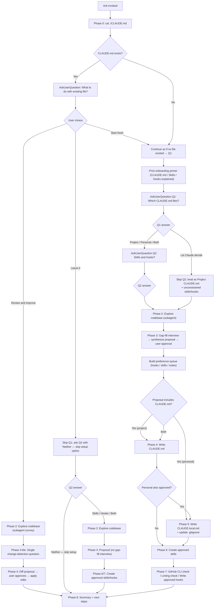

# `/init`

> Analysis basis: CC v2.1.191 bundle.js (AST extraction + Claude interpretation)
> Minimum version: v2.1.191

---

## Overview

The `/init` command bootstraps a project's Claude Code configuration by generating one or more `CLAUDE.md` files and, optionally, skills and hooks. It operates as a multi-phase guided workflow: the agent explores the codebase, interviews the user, proposes a set of artifacts, and then writes only what the user approves. Because the entire instruction set is delivered as a prompt to the agent (rather than being hard-coded in the CLI), `/init` is classified as a `prompt`-type command whose behavior is fully described by the prompt body sent via `getPromptForCommand`.

---

## Registration

| Field | Value |
|---|---|
| type | `prompt` |
| name | `init` |
| description | `Initialize new CLAUDE.md file(s) and optional skills/hooks with codebase documentation \| Initialize a new CLAUDE.md file with codebase documentation` |
| loc_byte | `11721312` |
| loc_byte_end | `11721705` |
| loc_line | `7474` |
| handler_method | `getPromptForCommand` |
| handler_method_start | `11721628` |
| handler_method_end | `11721704` |
| prompt_body.length | `22519` characters |
| prompt_body.trace | `conditional; identifier→sHf (var template, 20920 chars); identifier→oHf (var template, 1592 chars)` |
| arbor_handler.name | `getPromptForCommand` |
| arbor_handler.kind | `Method` |
| arbor_handler.resolution_path | `direct` |
| arbor_handler.fqn | `claude-2.1.191::getPromptForCommand` |
| arbor_handler.n_hits | `2` |

Analysis basis: CC v2.1.191 bundle.js:+11721312

The registration block spans bytes `(11721312, 11721705)`. The handler is an inline `ObjectMethod` named `getPromptForCommand` located at bytes `(11721628, 11721704)`. The prompt body is assembled conditionally from two template variables (`sHf` at 20920 chars and `oHf` at 1592 chars), producing a total of 22519 characters at invocation time. Analysis basis: CC v2.1.191 bundle.js:+11721628

---

## Input Branching

The command has more than three distinct top-level branches driven by Phase 0's file-existence check and the user's Q1/Q2 responses. A Mermaid flowchart is used.



Analysis basis: CC v2.1.191 bundle.js:+11721312 (prompt body Phase 0–8 routing logic)

---

## Behavioral Spec

### Phase 0 — Existing File Detection

```
function checkForExistingClaudeMd():
    content = readFile("./CLAUDE.md")   // project root only
    if content exists:
        return FOUND
    else:
        return NOT_FOUND
```

The agent reads only the project-root `CLAUDE.md`; it does not traverse subdirectories at this stage. The result gates the entire Phase 1 question set. Analysis basis: CC v2.1.191 bundle.js:+11721312

### Phase 1 — Interactive Setup Questions

```
function askSetupQuestions(phase0Result):
    printPrimer()   // explains CLAUDE.md, Skills, Hooks to first-time users

    if phase0Result == FOUND:
        answer = askUserQuestion(Q_EXISTING_FILE)
        // Options: "Review and improve" | "Leave it, set up other things" | "Start fresh"
        route according to answer (see flowchart)
    else:
        q1Answer = askUserQuestion(Q1_WHICH_FILES)
        // Options: "Project CLAUDE.md" | "Personal CLAUDE.local.md"
        //          | "Both project + personal" | "Let Claude decide"
        if q1Answer != LET_CLAUDE_DECIDE:
            q2Answer = askUserQuestion(Q2_SKILLS_AND_HOOKS)
            // Options: "Skills + hooks" | "Skills only" | "Hooks only"
            //          | "Neither, just CLAUDE.md"
        return (q1Answer, q2Answer)
```

**Key constraint**: `AskUserQuestion` is called with **only Q1** in the first call; Q2 is a separate, subsequent call. "Let Claude decide" skips Q2 entirely and is treated as project `CLAUDE.md` with unconstrained skills/hooks. Q2 is a hint to Phase 3, not a hard filter. Analysis basis: CC v2.1.191 bundle.js:+11721312

### Phase 2 — Codebase Exploration (Subagent)

```
function exploreCodbase():
    launch subagent to read:
        manifestFiles   = [package.json, Cargo.toml, pyproject.toml, go.mod, pom.xml, ...]
        readmeAndBuild  = [README, Makefile, CI configs]
        existingAiRules = [CLAUDE.md, .claude/rules/, AGENTS.md,
                           .cursor/rules, .cursorrules,
                           .github/copilot-instructions.md,
                           .devin/rules/, .windsurf/rules/, .windsurfrules,
                           .clinerules, .mcp.json]

    detect:
        buildTestLintCommands   // especially non-standard ones
        languagesFrameworks
        projectStructure        // monorepo vs single project
        codeStyleDiffs          // deviations from language defaults
        gotchasEnvVars
        existingSkillsRules     // .claude/skills/, .claude/rules/
        formatterConfig         // prettier, biome, ruff, black, gofmt, rustfmt, etc.
        gitWorktrees            // run `git worktree list` (relevant for CLAUDE.local.md)

    recordUnresolvableItems()   // becomes Phase 3 interview questions
```

Analysis basis: CC v2.1.191 bundle.js:+11721312

### Phase 3 — Gap-Fill Interview and Proposal Synthesis

```
function gapFillAndPropose(q1Answer, phase2Findings):
    if q1Answer includes PROJECT or LET_CLAUDE_DECIDE:
        askAboutCodebasePractices()
        // non-obvious commands, branch/PR conventions, testing quirks, env setup
        // do NOT mark options as "recommended"

    if q1Answer includes PERSONAL:
        askAboutUser()
        // role, familiarity, sandbox URLs, worktree layout, communication prefs
        // do NOT mark options as "recommended"

    proposal = synthesizeProposal(phase2Findings, gapFillAnswers)
    // classify each item as: hook | skill | note | file

    if userQ2HintDeviatesFromProposal:
        printDeviationNotice()   // one line at top of proposal

    printProposal()   // plain assistant text, one bullet per artifact

    approval = askUserQuestion("Does this look right?",
                               options=["Looks good — proceed", "Drop the hook",
                                        "Drop the skill", ...])

    preferenceQueue = buildQueue(approval)
    // each entry: { type, description, targetFile, phase2Details }
    return preferenceQueue
```

The `preferenceQueue` is consumed by Phases 4, 5, 6, and 7. Analysis basis: CC v2.1.191 bundle.js:+11721312

**"Review and improve" lite path**: only one question is asked — whether anything has changed since the file was written — before jumping to Phase 4's diff flow.

### Phase 4 — Writing CLAUDE.md

```
function writeProjectClaudeMd(phase2Findings, preferenceQueue, isReviewPath):
    if isReviewPath:
        existing = readFile("./CLAUDE.md")
        diffs = computeDiffs(existing, phase2Findings)
        printDiffs()
        approval = askUserQuestion("Apply these edits?",
                                   ["Apply all", "Let me pick which", "Skip"])
        if approval == SKIP: return
        applySelectedDiffs(existing, approval)
    else:
        content = buildMinimalContent(phase2Findings)
        // include: non-obvious build/test/lint commands, code style deviations,
        //          testing quirks, repo etiquette, env vars, gotchas,
        //          important parts from existing AI tool rule files
        // exclude: file-by-file structure, standard conventions, generic advice,
        //          frequently-changing info (use @path/to/import instead),
        //          commands obvious from manifest files

        consumeNoteEntries(preferenceQueue, target="CLAUDE.md")
        // appends team-level behavior notes to relevant sections

        prefix = "# CLAUDE.md\n\nThis file provides guidance to Claude Code..."
        writeFile("./CLAUDE.md", prefix + content)

    if multipleSubdirectoriesDetected:
        offerSubdirClaudeMdFiles()
    if multipleConcernsDetected:
        suggestDotClaudeRulesOrganization()
```

Every included line must satisfy: "Would removing this cause Claude to make mistakes?" Analysis basis: CC v2.1.191 bundle.js:+11721312

The literal file name `CLAUDE.md` is confirmed at bundle byte +4124979. Analysis basis: CC v2.1.191 bundle.js:+4124979

### Phase 5 — Writing CLAUDE.local.md

```
function writePersonalClaudeMd(phase2Findings, preferenceQueue):
    if worktreesAreExternalOrSiblings:
        actualContent = buildPersonalContent(phase2Findings)
        writeFile("~/.claude/<project-name>-instructions.md", actualContent)
        stub = "@~/.claude/<project-name>-instructions.md"
        writeFile("./CLAUDE.local.md", stub)
        // NEVER put this import in project CLAUDE.md
    else:
        content = buildPersonalContent(phase2Findings)
        consumeNoteEntries(preferenceQueue, target="CLAUDE.local.md")
        writeFile("./CLAUDE.local.md", content)

    appendToGitignore("CLAUDE.local.md")

    if fileAlreadyExists("./CLAUDE.local.md"):
        proposeAdditionsOnly()   // do NOT silently overwrite
```

Analysis basis: CC v2.1.191 bundle.js:+11721312

### Phase 6 — Skills Creation

```
function createSkills(preferenceQueue):
    // First: consume queued skill preferences
    for skillEntry in preferenceQueue where type == "skill":
        name = deriveNameFromPreference(skillEntry)
        body = composeFromUserWordsAndPhase2Data(skillEntry)
        if mapsToExistingBundledSkill(name):
            notifyUserBundledStillExists()
        if underspecified(skillEntry):
            askFollowUpQuestion()
        writeFile(".claude/skills/" + name + "/SKILL.md",
                  yamlFrontmatter(name, description) + body)

    // Then: suggest additional skills from codebase analysis
    for opportunity in detectAdditionalSkillOpportunities(phase2Findings):
        proposeSkill(opportunity.name, opportunity.purpose, opportunity.rationale)

    // Protect existing skills
    if dotClaudeSkillsExists:
        reviewExistingSkills()
        proposeOnlyComplementaryNewSkills()
```

Skills with side effects should include `disable-model-invocation: true` and use `$ARGUMENTS`. Analysis basis: CC v2.1.191 bundle.js:+11721312

### Phase 7 — Additional Optimizations (GitHub CLI, Linting, Hooks)

```
function suggestOptimizations(preferenceQueue, phase2Findings):
    // GitHub CLI check
    ghPresent = runShell("which gh")   // or "where gh" on Windows
    if not ghPresent and projectUsesGitHub(gitRemoteV):
        askUserQuestion("Install GitHub CLI?")

    // Linting check
    if not lintConfigFound(phase2Findings):
        askUserQuestion("Set up linting?")

    // Hooks from preference queue
    hookEntries = preferenceQueue where type == "hook"
    if not hookEntries and formatterFound(phase2Findings):
        offerFormatOnEditHook()   // fallback

    for hookEntry in hookEntries:
        targetFile = resolveTargetFile(q1Answer)
        // project → .claude/settings.json
        // personal → .claude/settings.local.json
        // ask only if q1Answer == "both" or ambiguous

        event, matcher = mapPreferenceToEvent(hookEntry)
        // "after every edit"         → PostToolUse / Write|Edit
        // "when Claude finishes"     → Stop
        // "before running bash"      → PreToolUse / Bash
        // "before committing"        → NOT a CC hook; route to git pre-commit

        if isFirstHookThisRun:
            invokeSkillTool("update-config",
                            "[hooks-only] " + oneLineSummary)

        followHookConstructionFlow:
            dedupCheck → construct → pipeTestRaw → wrap →
            writeJSON → jqValidate → liveProof → cleanup → handoff

    actOnEachYesBeforeMovingOn()
```

Analysis basis: CC v2.1.191 bundle.js:+11721312

### Phase 8 — Summary and Next Steps

```
function summarizeAndSuggest(writtenArtifacts, phase2Findings):
    recapWrittenFiles()
    remindUserFilesAreStartingPoint()
    remindUserCanRunInitAgain()

    todoList = []

    if frontendFrameworkDetected(phase2Findings):
        todoList.add("/plugin install frontend-design@claude-plugins-official")
        todoList.add("/plugin install playwright@claude-plugins-official")

    if phase7GapsRejectedByUser:
        todoList.add(missingGitHubCLI)
        todoList.add(missingLinting)

    if testsMissingOrSparse(phase2Findings):
        todoList.add(suggestTestFramework)

    // Always included:
    todoList.add("/plugin install skill-creator@claude-plugins-official")
    todoList.add("Browse official plugins with /plugin")

    sortByImpact(todoList)
    printFormattedTodoList(todoList)
```

Analysis basis: CC v2.1.191 bundle.js:+11721312

### Handler Dispatch (getPromptForCommand)

The handler `getPromptForCommand` (Arbor FQN: `claude-2.1.191::getPromptForCommand`, resolved via `direct` path at n_hits=2) assembles the prompt conditionally from two template variables before returning it to the agent runtime.

```
function getPromptForCommand(context):
    // Conditional template selection observed in prompt_body.trace:
    //   identifier→sHf  (primary template, ~20920 chars)
    //   identifier→oHf  (secondary/fallback template, ~1592 chars)
    if usePrimaryTemplate(context):
        promptText = sHf   // full 8-phase guided workflow
    else:
        promptText = oHf   // shorter variant (legacy / fallback path)

    return promptText   // delivered to agent as the session prompt
```

The call graph shows `__handler_init` → `getPromptForCommand` at byte +11721634, followed by `rot` at +11721663 and `rHf` at +11721688. Analysis basis: CC v2.1.191 bundle.js:+11721634

### Post-Invocation Side Effect — Onboarding Event

After `/init` completes, the call chain `rot` → `we` emits the string `"onboarding_project_complete"` (literal at byte +4125491). This is the primary side effect distinguishing a successful `/init` run from an aborted one. Analysis basis: CC v2.1.191 bundle.js:+4125491

The literal `"claudemd"` at byte +4125138 and the display hint `"Run /init to create a CLAUDE.md file with instructions for Claude"` at byte +4125154 are used by the workspace empty-state UI to surface `/init` to new users. Analysis basis: CC v2.1.191 bundle.js:+4125138

---

## State & Side Effects

| Item | Detail |
|---|---|
| Telemetry: `tengu_config_parse_error` | Fired when config JSON cannot be parsed during a config read within the `/init` handler call chain (bundle.js:+13869283) |
| Telemetry: `tengu_config_lock_contention` | Fired when config file lock acquisition exceeds the expected threshold (100 ms, literal at +13865455); warning: "Lock acquisition took longer than expected — another Claude instance may be running" (literal at +13865461) (bundle.js:+13865550) |
| Telemetry: `tengu_config_stale_write` | Fired when a stale config write is detected (bundle.js:+13865686) |
| Telemetry: `tengu_config_auto_repaired` | Fired on auto-repair of a corrupt config under lock (relates to GH #3117 guard, literal at +13865935) (bundle.js:+13866063) |
| Telemetry: `tengu_config_auth_loss_prevented` | Fired when a write that would wipe auth from `~/.claude.json` is refused (GH #3117 guard, literal at +13866241) (bundle.js:+13866393) |
| Telemetry: `tengu_lone_surrogate_sanitized` | Fired when lone Unicode surrogates are removed from API response text (bundle.js:+8938694) |
| Telemetry: `tengu_api_success` | Fired on a successful API call made during the init flow (bundle.js:+8938998) |
| Telemetry: `tengu_context_tip_classifier_outcome` | Fired by the context-tip classifier invoked during the agent turn (bundle.js:+16672225) |
| Telemetry: `tengu_feature_bad` / `tengu_feature_ok` | Feature flag evaluation results (bundle.js:+1025792 / +1025725) |
| Telemetry: `tengu_config_fallback_write` | Fired when the fallback write path is used for project config (bundle.js:+13865166) |
| Telemetry: `tengu_slate_harbor_experiment` | A/B experiment tracking fired during the init handler (`nt` call chain, bundle.js:+11698203) |
| Onboarding event | String `"onboarding_project_complete"` emitted via `rot` → `we` path (bundle.js:+4125491) |
| Config file writes | `U7t` (write-with-lock helper) writes project config; uses atomic rename via `Rvt` (temp file + `renameSync`) with `fsyncSync` for durability (bundle.js:+13865277, +13864987) |
| Config backup rotation | Up to 5 backup copies (literal `5` at +13866854) in a `backups/` subdirectory (literal at +13867437); backup files named with `.backup.` prefix (literal at +13866715) and a `Date.now()` timestamp. Lock timeout: 60000 ms (literal at +13866599) (bundle.js:+13866854) |
| File permission mode | Temp files created with mode `384` (octal `0600`) (literal at +13867136) before being fsynced and renamed into place (bundle.js:+13867136) |
| A/B experiment: Slate Harbor | `RTn` → `w5r` path (bundle.js:+11698203) tracks experiment assignment; emits `"growthbook_experiment"` event (literal at +3330144) and `"GrowthbookExperimentEvent"` type (literal at +3329693) |
| appState changes | Project config (`save_project` literal at +13870373) is persisted after the agent writes files; `IA` calls `P7t` and `Xnr` to save and persist (bundle.js:+13870071) |
| Sound | <!-- TODO: not found in depth-2 traversal; needs --depth 4 --> |
| Hook registration | No persistent hook registration by the CLI on behalf of `/init` itself; hooks written to `.claude/settings.json` or `.claude/settings.local.json` are artifacts produced by the agent, not registered by the CLI command handler |

---

## Version History

| Version | Change |
|---|---|
| v2.1.191 | Initial analysis. Command type `prompt`; handler `getPromptForCommand`; 8-phase guided workflow (22519-char prompt); `onboarding_project_complete` event emitted on completion; Slate Harbor A/B experiment active |

---

## Common Mistakes

1. **Running `/init` in a subdirectory**: Phase 0 checks only `./CLAUDE.md` relative to the working directory. If the agent is launched in a subdirectory, the project-root `CLAUDE.md` is not found even if it exists, causing the command to behave as if no file is present.
2. **Expecting Q1 and Q2 in a single prompt**: The command is explicitly designed to ask Q1 and Q2 in separate `AskUserQuestion` calls. Tools or wrappers that batch input will desynchronize the phase routing.
3. **Treating Q2 as a filter**: Q2 ("Skills + hooks", "Skills only", etc.) is a *hint* to Phase 3, not a hard filter. The proposal may deviate from the hint if the codebase evidence does not support the requested artifact type; a one-line notice explains any deviation.
4. **Using "before committing" as a hook trigger**: The prompt explicitly states that matchers cannot filter `Bash` by command content, so there is no way to target only `git commit` with a CC hook. The correct approach is a `git pre-commit` hook (`.git/hooks/pre-commit`, husky, or similar).
5. **Putting personal imports in project CLAUDE.md**: The `@~/.claude/<project-name>-instructions.md` stub is only ever written to `CLAUDE.local.md`. Placing it in the team-shared `CLAUDE.md` would expose personal references to all contributors.
6. **Not re-running `/init` after structural changes**: The prompt reminds users that generated files are a starting point and that `/init` can be re-run anytime to re-scan the codebase.
7. **Overwriting existing skills**: Phase 6 explicitly checks `.claude/skills/` before writing and proposes only complementary new skills. Manual invocations that skip this check may silently overwrite customized skills.

---

## Appendix — Identifier Mapping

> For bundle debugging only. Identifiers change across versions.

| Identifier | Role |
|---|---|
| `__handler_init` | Synthetic BFS entry point for the `/init` command handler; not a real bundle symbol |
| `rot` | Post-completion side-effect dispatcher; emits `onboarding_project_complete` and calls the workspace update helpers |
| `ag` | Config access / project config reader; calls the file-read and watch functions |
| `kt` | Config watcher / file-watch lifecycle manager |
| `Gt` | Logger / debug output utility |
| `C2o` | Config schema validator or type checker |
| `tEt` | Config file reader with backup rotation logic; handles `ENOENT`, reads with `utf-8` encoding, manages `.backup.` copies |
| `K9f` | File unwatch / cleanup handler; calls `_Xl.unwatchFile` |
| `b$i` | Workspace empty-state hint builder; produces the `"claudemd"` / `"Run /init to create…"` hint literals |
| `wVr` | Workspace context resolver; reads `CLAUDE.md` path and workspace type |
| `Dt` | Directory or path resolver helper |
| `sus` | Secondary path / URL utility |
| `IA` | Project config save orchestrator; calls `U7t`, `P7t`, `Xnr`, `nEt`, `dOe`, `O7t` |
| `U7t` | Config write-with-lock implementation; handles `mkdirSync`, `statSync`, `copyFileSync`, backup rotation, lock contention, auth-loss guard |
| `t` | Generic utility / context carrier (highly overloaded short identifier) |
| `s` | File-system async set with `add`/`delete`/`finally` lifecycle |
| `kzs` | Config merge helper; calls `Object.assign` and `hOr` |
| `T` | String formatter / log message builder; handles `toUpperCase`, `trim`, `Dc`, `MO` |
| `W` | Warning/info logger utility |
| `dn` | Error normalizer or code extractor |
| `nEt` | Secondary config persistence helper called from `IA` |
| `n` | String lowercaser utility |
| `ke` | JSON serializer wrapper around `JSON.stringify` |
| `R2o` | Backup directory path builder; joins path with `"backups"` segment |
| `w` | File-path string with `startsWith` usage (backup file filter) |
| `y` | Version string splitter using `split` and `Number` |
| `I` | Slice / pagination math utility using `Math.max`, `Math.floor` |
| `Rvt` | Atomic file write utility: temp-file creation, `fchmodSync`, `fsyncSync`, `renameSync`, symlink resolution, in-place fallback |
| `i` | Stream/handle closer with `n.close` / `r.close` |
| `e` | Context-tip classifier and API call orchestrator (large function covering API fetch, response parsing, telemetry) |
| `L6o` | Conversation message formatter; handles `user`/`assistant`/`tool_result`/`tool_use` message types |
| `o` | Column/row formatter using `padEnd` |
| `wN` | Primary API network call function; handles `globalThis.fetch`, retries, structured outputs, lone-surrogate sanitization, `tengu_api_success` |
| `S4` | Token/usage stats accumulator |
| `usm` | Context compression or summarization helper calling `csm` |
| `hsm` | Message buffer builder using `push`/`join` |
| `M6n` | Tool-use block finder using `Array.find` |
| `cSt` | Schema-validated response writer calling `W` and `Pe` |
| `Re` | Response emitter calling `W` and `Pe` |
| `D6n` | Zod/schema safe-parse wrapper |
| `we` | Feature-flag evaluator emitting `tengu_feature_ok` / `tengu_feature_bad`; also used as post-completion event emitter in `rot` path |
| `Ae` | String coercion helper wrapping `String()` |
| `dOe` | Config diff / staleness checker |
| `O7t` | Timestamp recorder using `Date.now` |
| `P7t` | Project config persistence entry point; calls `tEt` and `Tk` |
| `Xnr` | Project config file writer; calls `Rvt` for atomic writes, `ke` for serialization, `_T` for transformation |
| `Pe` | React/UI render helper calling `eze` |
| `rHf` | Slate Harbor experiment initializer; calls `rt` (string helper) and `nt` (experiment runner) |
| `rt` | Simple string-to-boolean converter (`"yes"` / `"on"` literals at +29726, +29732) |
| `nt` | Experiment assignment engine; uses `IDt`, `CDt`, `B4`, `xve`, `RTn`, `bDt`, `gW`, `kt` |
| `IDt` | Experiment ID table lookup |
| `CDt` | Experiment config/definition loader |
| `B4` | Experiment bucket selector calling `$4` |
| `$4` | Hash/bucket computation calling `yB` |
| `RTn` | Experiment run-once gate; checks `x5r` set, calls `w5r` on first run |
| `w5r` | Growthbook experiment event emitter; emits `"GrowthbookExperimentEvent"` / `"growthbook_experiment"`, calls `KZ.emit` |
| `P5r` | Experiment result handler; calls `ag`, `kt`, and queues result via `Tmi`, `Rr`, `jCi`, `U2` |

---

Note: index built via Arbor fallback; some signals (telemetry, literals) may be missing — see arbor-fallback.js.