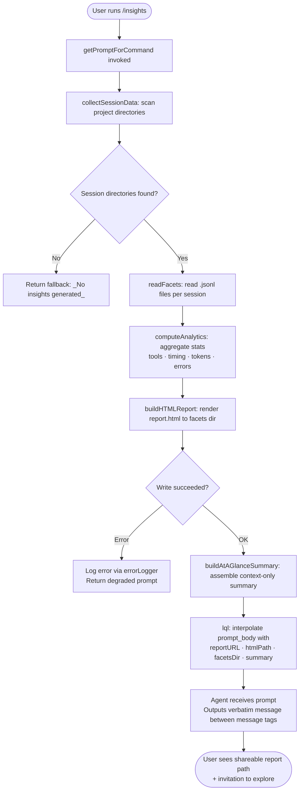

# `/insights`

> Analysis basis: CC v2.1.191 bundle.js (AST extraction + Claude interpretation)
> Minimum version: v2.1.191

---

## Overview

The `/insights` command generates a shareable HTML usage-analytics report by scanning the user's local Claude Code session data, computing aggregated statistics and facets, and then instructing the agent to deliver a single fixed-form response containing a ready-to-share report URL and an invitation to explore the results further. The entire data-collection and report-rendering pipeline runs locally before the prompt is sent to the model; the model itself only echoes a pre-composed message that was assembled by the handler.

---

## Registration

| Field | Value |
|---|---|
| type | `prompt` |
| name | `insights` |
| description | `Generate a report analyzing your Claude Code sessions` |
| loc_byte | `13312545` |
| loc_byte_end | `13313849` |
| loc_line | `9922` |
| handler_method | `getPromptForCommand` |
| handler_method_start | `13312719` |
| handler_method_end | `13313848` |
| prompt_body.length | `513` |
| prompt_body.trace | `call→lql(...) (1 literals)` |
| arbor_handler.name | `getPromptForCommand` |
| arbor_handler.fqn | `claude-2.1.191::getPromptForCommand` |
| arbor_handler.kind | `Method` |
| arbor_handler.resolution_path | `direct` |
| arbor_handler.n_hits | `1` |

Analysis basis: CC v2.1.191 bundle.js:+13312545

---

## Input Branching

The command has 3+ distinct execution paths depending on whether session data exists, whether the data-collection pipeline completes successfully, and whether an HTML report can be written to disk. A Mermaid flowchart is therefore used.



Analysis basis: CC v2.1.191 bundle.js:+13312718 (handler entry), +13313751 (lql call), +13313616 (fallback literal)

---

## Behavioral Spec

### 1. Handler Entry — `getPromptForCommand`

The handler is an inline `ObjectMethod` on the registration object, resolved via Arbor's `direct` path. It is the sole entry point for `/insights`.

```
async function getPromptForCommand(context):
    rawData = await collectAndAnalyzeSessions(context)
    if rawData is empty or null:
        return FALLBACK_MESSAGE           // "_No insights generated_"
    summary = buildAtAGlanceSummary(rawData)
    reportPaths = await writeHTMLReport(rawData)
    prompt = interpolatePromptTemplate(rawData, reportPaths, summary)
    return prompt
```

Analysis basis: CC v2.1.191 bundle.js:+13312719

---

### 2. Session Directory Discovery — `collectAndAnalyzeSessions` (bundle: `aql`)

`aql` is the primary data-collection orchestrator called immediately from the handler (bundle.js:+13312818).

```
async function collectAndAnalyzeSessions(context):
    projectDirs = await listProjectDirectories()   // readdir on projects root
    // Up to 50 most-recent dirs are selected; sorted by mtime descending
    // Maximum batch size for parallel read: 200
    selectedDirs = projectDirs
                    .filter(isDirectory)
                    .sort(byModifiedTimeDescending)
                    .slice(0, MAX_PROJECTS)         // literal 50 @ +13299496

    sessions = await Promise.all(
        selectedDirs.map(dir => loadSessionData(dir))
    )
    return sessions.filter(nonEmpty)
```

- Project root path is assembled via path-join utilities (`YV.join`, `n7t`).
- Directory listing uses `J$.readdir` (bundle.js:+13299104).
- `setImmediate` is used to yield the event loop between directory scans (bundle.js:+13299384).
- Sort is applied before the slice to ensure recency (bundle.js:+13299408).
- Maximum parallel reads in a single `Promise.all` batch: 200 (literal @ bundle.js:+13299501).

Analysis basis: CC v2.1.191 bundle.js:+13299477

---

### 3. Facets Directory Scan — `scanFacetsDirectory` (bundle: `Oyt`)

For each project directory, `Oyt` scans for `.jsonl` facet files.

```
async function scanFacetsDirectory(projectDir):
    facetsPath = join(projectDir, "facets")        // literal "facets" @ +13238361
    entries = await fs.readdir(facetsPath)
    files = entries
              .filter(entry => entry.isFile())
              .filter(entry => hasExtension(entry, ".jsonl"))  // literal @ +13400284
    results = []
    for file in files:
        basename = path.basename(file)
        stat = await fs.stat(join(facetsPath, basename))
        results.push({ name: basename, stat })
    return results
```

- Only `.jsonl` files are processed (bundle.js:+13400284).
- `oD` is used to test the extension pattern against a compiled regex (`lPc.test`, bundle.js:+27890).
- File metadata (mtime, size) is captured via `fl.stat` for recency ordering.

Analysis basis: CC v2.1.191 bundle.js:+13299262

---

### 4. Session Metadata Loading — `loadSessionMetadata` (bundle: `TUf` → `IUo` → `n7t`)

```
async function loadSessionMetadata(sessionDir):
    usageDataPath = join(sessionDir, "usage-data")      // literal @ +13238311
    metaPath      = join(sessionDir, "session-meta")    // literal @ +13238407
    raw = await fs.readFile(usageDataPath, "utf-8")     // encoding literal @ +13244460
    parsed = JSON.parse(raw)                            // via $t @ +193264
    return parsed
```

- Two distinct sub-directories are accessed: `usage-data` and `session-meta`.
- Parsing is performed by the shared JSON-safe wrapper `$t` which delegates to `JSON.parse`.

Analysis basis: CC v2.1.191 bundle.js:+13244393

---

### 5. Analytics Aggregation — `computeSessionFacets` (bundle: `Atr`)

`Atr` aggregates raw JSONL records across all loaded sessions into a structured facet map that feeds the HTML renderer.

```
function computeSessionFacets(sessions, transcripts):
    facetMap = {}

    for session in sessions:
        chain = buildChain(session)            // Uye: timestamp-ordered message chain
        normalizedRecords = normalizeRecords(chain)   // rKl: dedup + sort

        for record in normalizedRecords:
            category = classifyRecord(record)  // T: type detection (tool / user / assistant)
            facetMap[category].push(record)

    toolStats    = aggregateToolStats(facetMap)     // ypt: per-tool counts
    timingStats  = aggregateTimingStats(facetMap)   // sql: response-time distribution
    tokenStats   = aggregateTokenStats(facetMap)    // wUf / iql
    errorStats   = aggregateErrorStats(facetMap)    // iFo / SFf / AFf

    return { toolStats, timingStats, tokenStats, errorStats, raw: facetMap }
```

- Response-time buckets (bundle.js:+13255647–13255707):
  - `2-10s`, `10-30s`, `30s-1m`, `1-2m`, `2-5m`, `5-15m`, `>15m`
- Time-of-day buckets (bundle.js:+13256495–13256648):
  - Morning (6–12), Afternoon (12–18), Evening (18–24), Night (0–6)
- Chain cycle detection emits telemetry `tengu_chain_parent_cycle` and `tengu_chain_timestamp_fallback` (bundle.js:+13363561, +13363710).
- Parallel-transcript recovery emits `tengu_chain_parallel_tr_recovered` (bundle.js:+13365576).
- Phantom-parent detection emits `tengu_transcript_phantom_parent` (bundle.js:+13385000).

Analysis basis: CC v2.1.191 bundle.js:+13300080, +13401043, +13401077

---

### 6. HTML Report Generation — `generateHTMLReport` (bundle: `DUf`)

`DUf` is the largest sub-routine, rendering an HTML string from the aggregated facets.

```
function generateHTMLReport(facets):
    sections = []

    // Tool usage section
    toolRows = renderTableRows(facets.toolStats)     // KSe: per-tool table
    sections.push(toolSection(toolRows))

    // Response time histogram
    timingChart = renderTimingChart(facets.timingStats, TIMING_BUCKETS)
    sections.push(timingSection(timingChart))

    // Time-of-day heatmap
    todChart = renderTimeOfDayChart(facets.timingStats)
    sections.push(todSection(todChart))

    // Error breakdown
    errorRows = renderErrorRows(facets.errorStats)   // colors: #dc2626 / #16a34a / #eab308
    sections.push(errorSection(errorRows))

    // Token usage
    tokenSection = renderTokenSection(facets.tokenStats)
    sections.push(tokenSection)

    html = assembleDocument(sections)                // header + CSS + body
    return html
```

Key constants observed in the renderer:
- Report output file: `report.html` (literal @ bundle.js:+13301734)
- Maximum token context for report data: 4096 characters (literal @ bundle.js:+13246342)
- Warmup-minimal threshold identifier: `warmup_minimal` (literal @ bundle.js:+13301292)
- Chart colours (hex literals): `#2563eb`, `#0891b2`, `#10b981`, `#8b5cf6` (bundle.js:+13293312–13293765); error colours `#dc2626`, `#16a34a`, `#eab308` (bundle.js:+13297028–13297770).
- Empty-state placeholders: `"<p class=\"empty\">No data</p>"` (bundle.js:+13255138), `"<p class=\"empty\">No response time data</p>"` (bundle.js:+13255595), `"<p class=\"empty\">No tool errors</p>"` (bundle.js:+13297039).
- Markdown-to-HTML helper `Xd` escapes `&amp;`, `&lt;`, `&gt;`, `&quot;`, `&apos;` (bundle.js:+5384666–5384806) and applies bold via `<strong>$1</strong>` (bundle.js:+13257353).
- Bullet prefix substitution `• ` and `<br>` line-break conversion (bundle.js:+13257396, +13257426).
- An "Add to CLAUDE.md" affordance label is embedded in at least one report section (literal @ bundle.js:+13260991).
- `Math.round` is used throughout for percentage and duration formatting (bundle.js:+13295421).

Analysis basis: CC v2.1.191 bundle.js:+13301456

---

### 7. Report File Write — `writeReportFile` (bundle: `IUf`, `bUf`)

```
async function writeReportFile(reportDir, htmlContent):
    await fs.mkdir(reportDir, { recursive: true })
    outPath = join(reportDir, "report.html")        // "report.html" @ +13301734
    await fs.writeFile(outPath, htmlContent, "utf-8")
    return outPath
```

- `IUf` handles the primary write with error logging via `Le` (bundle.js:+13245188).
- `bUf` handles an alternate/incremental write path with its own `mkdir` + `writeFile` pair (bundle.js:+13244220).
- On write failure, `Le` logs to the error stream and the handler falls back gracefully.

Analysis basis: CC v2.1.191 bundle.js:+13300318, +13301155

---

### 8. Prompt Assembly — `interpolatePromptTemplate` (bundle: `lql`)

`lql` is the final step in the handler (called at bundle.js:+13313751). It receives the assembled report data and interpolates a 513-character prompt template.

```
function interpolatePromptTemplate(insightsData, reportPaths, summary):
    // The template instructs the agent to:
    //   1. Acknowledge the /insights invocation context
    //   2. Embed the full insights data payload
    //   3. Provide reportURL, htmlFilePath, facetsDir as context variables
    //   4. Provide an at-a-glance summary (model context only — not shown to user yet)
    //   5. Output ONLY the text between <message>…</message> tags verbatim,
    //      omitting nothing
    prompt = template
               .replace("{insightsData}", ke(insightsData))   // JSON-stringify
               .replace("{reportURL}",    reportPaths.url)
               .replace("{htmlFile}",     reportPaths.htmlPath)
               .replace("{facetsDir}",    reportPaths.facetsDir)
               .replace("{summary}",      summary)
    return prompt
```

Critical behavioral contract imposed by the prompt (bundle.js:+13312719–13313848):
- The model **must** output the `<message>…</message>` block verbatim as its **entire** response.
- The at-a-glance summary is injected into the model's context only; the user has not seen it before the model responds.
- The closing message invites the user to explore any section or act on suggestions.
- Fallback text `_No insights generated_` (literal @ bundle.js:+13313616) is substituted when data collection yields nothing.

Analysis basis: CC v2.1.191 bundle.js:+13313751 (lql call), +13313769 (ke call), +13312719 (handler_method_start)

---

### 9. At-a-Glance Summary Construction — `buildAtAGlanceSummary` (bundle: `wUf`)

```
function buildAtAGlanceSummary(facets):
    // Key literal: "at_a_glance" @ +13252674
    lines = []
    lines.push(topToolsSummary(facets.toolStats))
    lines.push(tokenUsageSummary(facets.tokenStats))    // Math.round @ +13251593
    lines.push(sessionCountSummary(facets.sessions))
    lines.push(errorHighlights(facets.errorStats))
    if lines is empty:
        return "None captured"                           // literal @ +13252008
    return lines.join("\n")
```

Analysis basis: CC v2.1.191 bundle.js:+13301445

---

## State & Side Effects

| Item | Detail |
|---|---|
| Telemetry | `tengu_transcript_phantom_parent` (bundle.js:+13385000) — phantom parent reference detected in transcript chain |
| Telemetry | `tengu_transcript_parent_cycle` (bundle.js:+13389092) — cycle in transcript parent chain |
| Telemetry | `tengu_chain_parent_cycle` (bundle.js:+13363561) — cycle detected during chain build |
| Telemetry | `tengu_chain_timestamp_fallback` (bundle.js:+13363710) — timestamp fallback during chain ordering |
| Telemetry | `tengu_chain_parallel_tr_recovered` (bundle.js:+13365576) — parallel-transcript recovery |
| Telemetry | `tengu_relink_walk_broken` (bundle.js:+13361784) — broken link during relink walk |
| Telemetry | `tengu_mcp_skills` (bundle.js:+6756547) — MCP skills enumeration (reachable from session-data path) |
| Disk reads | Scans `~/.claude/projects/` subdirectories; reads `usage-data`, `session-meta`, and `*.jsonl` facet files |
| Disk writes | Writes `report.html` to the session's `facets/` directory (bundle.js:+13301734) |
| Hook registration | None observed in depth-2 traversal |
| appState changes | None observed directly; MCP state traversal (`s5e`, `hGo`, `Gar`) is read-only from this command's perspective |
| Sound | None |
| Error logging | `Le` / `GQ.logError` used on write failures (bundle.js:+13245188, +1056586) |
| Fallback output | `_No insights generated_` returned when no session data is found (bundle.js:+13313616) |

---

## Version History

| Version | Change |
|---|---|
| v2.1.191 | Initial analysis |

---

## Common Mistakes

1. **Expecting model-generated analysis**: The model does not independently analyse session data. All statistics and charts are computed client-side before the prompt is sent; the model's sole job is to reproduce a pre-formed `<message>` block verbatim.
2. **Running in a directory with no prior sessions**: If `~/.claude/projects/` contains no directories with `.jsonl` facet files, the command silently returns `_No insights generated_` rather than an error.
3. **Expecting interactive data exploration in the same turn**: The prompt closes with an invitation to ask follow-up questions, but the initial response is fully scripted; follow-ups start a new conversational turn.
4. **Assuming the HTML file is served remotely**: The "report URL" embedded in the message is a local file-system path or `file://` URI, not a hosted web URL. Sharing requires manually sending the `report.html` file.
5. **Large session history causing truncation**: The handler caps project directory scanning at 50 most-recent directories (literal @ bundle.js:+13299496) and parallel reads at 200 (literal @ bundle.js:+13299501), so very old sessions are silently excluded.
6. **Modifying the `facets/` directory between sessions**: The `.jsonl` extension filter is strict; any non-`.jsonl` file in the facets directory is silently skipped.

---

## Appendix — Identifier Mapping

> For bundle debugging only. Identifiers change across versions.

| Identifier | Role |
|---|---|
| `__handler_insights` | Synthetic BFS entry point representing the `getPromptForCommand` method body |
| `aql` | Primary data-collection and analytics orchestrator |
| `OUf` | Project directory listing and filtering |
| `uY` | Directory path assembly helper |
| `Oyt` | Facets directory scanner (`.jsonl` file enumeration) |
| `oD` | File extension predicate (regex test via `lPc`) |
| `TUf` | Session data loader (reads `usage-data` file) |
| `IUo` | Intermediate path resolver for session data |
| `n7t` | Base path builder (joins project root segments) |
| `oql` | Session data parser helper |
| `$t` | JSON-safe parse wrapper (`JSON.parse`) |
| `s5e` | MCP connection/skill state aggregator (read path) |
| `S3` | MCP server state machine |
| `mL` | MCP debug logger bridge |
| `Gn` | Generic async utility / scheduler |
| `U2t` | MCP update applier |
| `vEa` | MCP facet collector |
| `xAn` | Timing/latency aggregator |
| `wAn` | Worker-state reader |
| `ln` | MCP debug log emitter |
| `ZPn` | MCP connection status handler |
| `$2t` | MCP reconnection logic |
| `Xno` | MCP server notification handler |
| `hL` | MCP skill registry lookup |
| `Dno` | Include-filter for data records |
| `Xc` | MCP error log emitter |
| `kEa` | General config reader (GW) |
| `xlt` | Integer parser (radix-3) |
| `l1n` | Integer parser (radix-20) |
| `Gar` | MCP apply-connection-result handler |
| `o5e` | MCP pending-state resolver |
| `tI` | MCP connection cleanup handler |
| `w_a` | Worker-adopt helper |
| `Fro` | Fork-context reader |
| `rGl` | Session record reader with timestamp |
| `hGo` | MCP server-map enumerator |
| `UPn` | Permission-set membership checker |
| `jn` | Async timeout/abort wrapper |
| `wlt` | MCP slot-state writer |
| `Atr` | Session facet aggregator (main analytics reducer) |
| `due` | Transcript/conversation state manager |
| `oFf` | Transcript open/read helper |
| `R6` | Record deduplication utility |
| `u7e` | JSONL record parser (array + object forms) |
| `GA` | Global analytics accumulator |
| `kFf` | Binary JSONL file reader (sync, with index) |
| `MFf` | Sync metadata file reader |
| `Mql` | Chain link manager / session relink |
| `RFf` | Raw JSONL buffer parser |
| `RTe` | Record-type classifier (XHu/JHu/ZHu/QHu variants) |
| `zo` | Error-code classifier |
| `Le` | Error logger with sXe push and `GQ.logError` |
| `se` | Tool-name normaliser |
| `ne` | Record-category membership checker |
| `K` | Attribution snapshot handler |
| `z` | MCP update dispatcher |
| `J` | MCP bulk-update processor |
| `rKl` | Chain record normaliser (dedup + sort) |
| `Uye` | Chain builder (timestamp-ordered) |
| `yFf` | NaN-safe numeric validator |
| `EFf` | Parallel-transcript merger |
| `HFf` | Chain-head extractor |
| `ypt` | Per-tool usage mapper |
| `rFo` | Record content formatter |
| `bKt` | Message-body extractor |
| `iFo` | Error-pattern classifier |
| `SFf` | Single-pattern error test |
| `AFf` | Multi-pattern error test |
| `Otr` | Facet output builder (get/set) |
| `Ntr` | Facet value enumerator |
| `hUf` | NaN guard for numeric inputs |
| `vUo` | Session statistics computer |
| `rql` | Tool-call record classifier |
| `t7t` | Tool-name canonicaliser |
| `gUf` | File-extension extractor |
| `vxe` | Diff utility wrapper (`DXi.diff`) |
| `au` | Array index-search helper |
| `Sg` | Rounding helper for statistics |
| `CUo` | Chart data formatter |
| `IUf` | Report file writer (primary: mkdir + writeFile) |
| `ke` | JSON serialiser (`JSON.stringify`) |
| `AUf` | Report cleanup / stale-file remover |
| `Str` | Report directory path builder |
| `cql` | Stale-report pruner |
| `CUf` | HTML report orchestrator |
| `SUf` | Section assembler |
| `_Uf` | Per-section data slicer |
| `dgt` | HTML document builder |
| `Rc` | HTML escape / template renderer |
| `uzn` | Agent listing delta processor |
| `Dn` | UUID generator for report |
| `UVe` | Assistant-message extractor |
| `O0` | Output formatter |
| `px` | Process-level utility |
| `C1` | CSS/style injector |
| `nql` | Path resolver (`c_`) |
| `c_` | Config directory resolver |
| `xf` | File-system config loader |
| `wt` | Config parse entry (main) |
| `Zl` | Array filter utility |
| `fo` | Error constructor wrapper |
| `bUf` | Report file writer (alternate path) |
| `NUf` | Object-key enumerator for report metadata |
| `iql` | Per-session statistics aggregator |
| `Pyt` | Object-entries reducer for stats |
| `yi` | String index/slice helper |
| `sql` | Response-time distribution calculator |
| `wUf` | At-a-glance summary builder + token stats |
| `tql` | Section renderer (calls dgt + Rc) |
| `dUf` | Config path helper |
| `DUf` | HTML report renderer (full document) |
| `Xd` | Markdown-to-HTML converter (escaping + bold) |
| `Bl` | HTML entity replacer |
| `Etr` | Extended text renderer |
| `MUf` | JSON-stringify wrapper for report data |
| `KSe` | Tool-usage table renderer |
| `RUf` | Max-value calculator for chart scaling |
| `kUf` | Chart bar renderer |
| `lql` | Prompt template interpolator (final step) |

---

Note: index built via Arbor fallback; some signals (telemetry, literals) may be missing — see arbor-fallback.js.