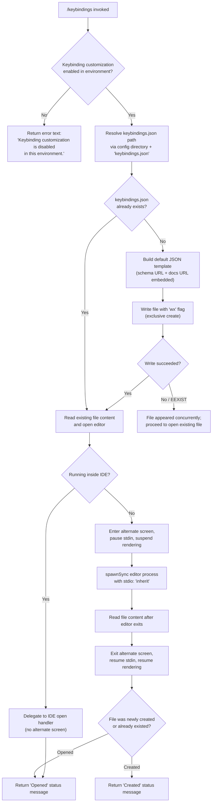

# `/keybindings`

> Analysis basis: CC v2.1.191 bundle.js (AST extraction + Claude interpretation)
> Minimum version: v2.1.191

---

## Overview

`/keybindings` opens the user's keyboard shortcuts configuration file (`keybindings.json`) for editing in an external editor. If the file does not yet exist, the command creates it with a default template (including a JSON Schema reference) before launching the editor. The command is disabled when keybinding customization is not permitted in the current environment.

---

## Registration

| Field | Value |
|---|---|
| type | `local` |
| name | `keybindings` |
| description | `Open your keyboard shortcuts file` |
| supportsNonInteractive | `false` |
| module_id | `Xwl` |
| load_inline | `true` |
| loc_byte | `11733140` |
| loc_byte_end | `11733317` |
| arbor_handler.name | `cHf` |
| arbor_handler.fqn | `claude-2.1.191::cHf` |
| arbor_handler.kind | `AsyncFunction` |
| arbor_handler.resolution_path | `module_id` |
| arbor_handler.n_hits | `0` |

Analysis basis: CC v2.1.191 bundle.js:+11733140

---

## Input Branching

The command has three or more distinct execution branches (environment check, file-exists vs. file-create, editor-open vs. IDE fallback, write-flag errors), so a Mermaid flowchart is used.



---

## Behavioral Spec

### 1. Environment Guard

Before any file I/O, the handler (`cHf`) calls the keybinding-release check (`PW` → `nt`).

```
function checkKeybindingRelease(context):
    result = queryFeatureRelease(context)   // PW → nt
    if result is disabled:
        emit telemetry: tengu_keybinding_customization_release
        return { type: "text",
                 text: "Keybinding customization is disabled in this environment." }
```

The literal error string `"Keybinding customization is disabled in this environment."` is returned as a `text`-type response when the guard fails.

Analysis basis: CC v2.1.191 bundle.js:+11732407 (cHf→PW), +11732424 (type:"text"), +11732437 (error string)

### 2. Config Path Resolution

`cHf` calls `Bhe` to compute the absolute path of the keybindings file.

```
function resolveKeybindingsPath():
    configDir = getConfigDirectory()     // Bhe → dwn.join
    return path.join(configDir, "keybindings.json")
```

The filename constant is `"keybindings.json"`.

Analysis basis: CC v2.1.191 bundle.js:+11732504 (cHf→Bhe), +3970468 (dwn.join), +3970482 ("keybindings.json")

### 3. Default File Template Construction

`cHf` calls `qwl` → `lHf` to build the default JSON content when the file does not yet exist.

```
function buildDefaultKeybindingsContent(existingBindings):
    // lHf maps over all known action keys (AOt.map)
    // Filters actions not yet represented in the current binding set (t.has)
    // Serializes via ke → JSON.stringify with indent level 2
    schema = "https://www.schemastore.org/claude-code-keybindings.json"
    docs   = "https://code.claude.com/docs/en/keybindings"
    template = {
        "$schema": schema,
        // docs URL embedded as a comment or property
        "keybindings": [ /* default entries derived from AOt mapping */ ]
    }
    return JSON.stringify(template, null, 2)
```

The indentation constant is `2`.

Analysis basis: CC v2.1.191 bundle.js:+11732574 (cHf→qwl), +11732280 (qwl→lHf), +11731924 (lHf→AOt.map), +11732307 (indent:2), +11732160 (schema URL), +11732225 (docs URL)

### 4. Exclusive File Write

```
function writeNewKeybindingsFile(filePath, content):
    try:
        fs.writeFile(filePath, content, flag: "wx")   // exclusive create
        created = true
    catch err:
        if err.code == "EEXIST":
            created = false   // race condition; file appeared between check and write
        else:
            throw err
    return created
```

The `"wx"` flag ensures the write is atomic — if the file already exists the call throws `EEXIST`, which is caught and handled gracefully.

Analysis basis: CC v2.1.191 bundle.js:+11732558 (zwl.writeFile), +11732603 ("wx"), +11732630 ("EEXIST")

### 5. Editor Launch

`cHf` delegates to `PV`, which handles terminal management and editor invocation.

```
async function openInEditor(filePath, terminalRenderer):
    editor = resolveEditorCommand()   // PV → HL → detects IDE or $EDITOR/$VISUAL

    if runningInIDE(editor):
        // IDE path: delegate to IDE open handler, no alternate screen
        ideOpenFile(filePath)
        return

    // Terminal path
    terminalRenderer.enterAlternateScreen()
    terminalRenderer.pause()
    terminalRenderer.suspendStdin()

    parts   = editor.split(" ")
    program = parts[0]
    args    = parts.slice(1) + [filePath]

    spawnSync(program, args, { stdio: "inherit" })

    content = fs.readFileSync(filePath)

    terminalRenderer.exitAlternateScreen()
    terminalRenderer.resumeStdin()
    terminalRenderer.resume()

    return content
```

The `stdio: "inherit"` constant ensures the editor process shares the parent's terminal handles.

Analysis basis: CC v2.1.191 bundle.js:+11732669 (cHf→PV), +11672473 (enterAlternateScreen), +11672503 (pause), +11672513 (suspendStdin), +11672552 (s.split), +11672577 (i.slice), +11672595 (spawnSync), +11672627 ("inherit"), +11672897 (readFileSync), +11672975 (exitAlternateScreen), +11673004 (resumeStdin), +11673020 (resume)

### 6. Editor Detection (`HL`)

```
function resolveEditorCommand(editorEnvValue):
    normalized = editorEnvValue.toLowerCase()
    if normalized contains "IDE":
        return IDE_HANDLER
    // Otherwise extract basename and match against known editor list ($4e)
    base = path.basename(editorEnvValue)
    return matchKnownEditor(base)   // HL → $4e
```

The string `"IDE"` is used as the sentinel for IDE-mode detection.

Analysis basis: CC v2.1.191 bundle.js:+11672695 (PV→HL), +6799795 (toLowerCase), +6799740 ("IDE"), +6799853 (_P.basename)

### 7. Result Message

After the editor closes (or is delegated to the IDE), the handler returns a `dn`-formatted result with the status `"Opened"` if the file pre-existed, or `"Created"` if the command created it.

```
function buildResultMessage(wasCreated):
    status = wasCreated ? "Created" : "Opened"
    return formatResult(status)   // dn → hl → rt / QZt
```

Analysis basis: CC v2.1.191 bundle.js:+11732622 (cHf→dn), +11732716 ("Opened"), +11732725 ("Created")

### 8. Config File Parsing (Sub-routine `tEt`)

The config subsystem (`kt` → `tEt`) handles reading and migrating the config file that backs the keybindings store. It guards against access before initialization and handles file-not-found (`ENOENT`) gracefully by treating it as an empty config.

```
function readConfigFile(configPath):
    if accessNotYetAllowed():
        throw Error("Config accessed before allowed.")

    try:
        raw = fs.readFileSync(configPath, "utf-8")
    catch err:
        if err.code == "ENOENT":
            return emptyConfig()
        raise err

    parsed = parseJSON(raw)
    // Migration: copy files with timestamp into backup dir if needed
    // (r.mkdirSync, r.copyFileSync, Date.now used for backup naming)
    // Track already-migrated paths in I2o set
    return parsed
```

Error constant: `"Config accessed before allowed."`. Encoding constant: `"utf-8"`.

Analysis basis: CC v2.1.191 bundle.js:+13867863 (tEt→Error), +13867869 ("Config accessed before allowed."), +13867925 (readFileSync), +13867952 ("utf-8"), +13868135 ("ENOENT"), +13868852 (Date.now), +13868866 (copyFileSync)

---

## State & Side Effects

| Item | Detail |
|---|---|
| Telemetry | `tengu_keybinding_customization_release` (bundle.js:+3969968) — fired during feature-release check |
| Telemetry | `tengu_config_parse_error` (bundle.js:+13869283) — fired if config JSON fails to parse |
| File created | `keybindings.json` in config directory, only when it does not already exist |
| File written | Default JSON template with `$schema` and docs URL on first creation |
| File read | File content read after editor exits (terminal path) |
| Terminal state | Alternate screen entered/exited; stdin suspended/resumed around editor spawn |
| Editor process | `spawnSync` with `stdio: "inherit"` — blocks until editor closes |
| IDE delegation | When running inside IDE, file open is delegated without terminal manipulation |
| Config migration | Backup copies of config files written to dated subdirectory (via `tEt`) |
| Deduplication set | `I2o` tracks already-migrated config paths to avoid repeat copies |
| Hook / event | `KZ.emit` called during Growthbook experiment event dispatch (`w5r`) |
| appState changes | Feature-release check result cached; keybinding store updated after file write |
| Sound | None observed in traversal |

---

## Version History

| Version | Change |
|---|---|
| v2.1.191 | Initial analysis |

---

## Common Mistakes

1. **Running in a restricted environment**: If the operator has disabled keybinding customization, `/keybindings` returns an error text immediately. No file is created or opened. Check environment configuration before expecting this command to work.
2. **Expecting an in-REPL editor**: The command spawns an external editor process and temporarily suspends the Claude Code TUI. The REPL appears frozen until the editor is closed.
3. **Concurrent invocations**: A race between two simultaneous `/keybindings` calls could both attempt to create the file. The `"wx"` exclusive-write flag means only one wins; the other silently falls back to opening the existing file.
4. **`supportsNonInteractive: false`**: This command cannot be used in non-interactive (piped / scripted) sessions. Attempting to do so will fail at the command dispatch layer.
5. **Assuming the file path**: The config directory is resolved at runtime from the application's config store, not hardcoded. Do not assume `~/.claude/keybindings.json` without verifying the actual config directory in use.
6. **Schema URL as live validator**: The `$schema` field in the generated file points to `https://www.schemastore.org/claude-code-keybindings.json` for editor autocompletion, not for runtime validation by Claude Code itself.

---

## Appendix — Identifier Mapping

> For bundle debugging only. Identifiers change across versions.

| Identifier | Role |
|---|---|
| `cHf` | Main handler for `/keybindings` (AsyncFunction; arbor_handler) |
| `PW` | Feature/release check dispatcher for keybinding customization |
| `nt` | Feature-release eligibility evaluator |
| `IDt` | Feature-release sub-check A (called from `nt`) |
| `CDt` | Feature-release sub-check B (called from `nt`) |
| `B4` | Feature-release sub-check C (called from `nt`) |
| `$4` | Lower-level feature flag resolver |
| `RTn` | Release-check caching and deduplication wrapper |
| `w5r` | Growthbook experiment event dispatcher |
| `P5r` | Experiment result processor / reporter |
| `kt` | Config file open/read orchestrator |
| `Gt` | Config directory path resolver |
| `C2o` | Config schema or type constant provider |
| `tEt` | Config file reader with migration and ENOENT handling |
| `K9f` | Config file watcher / unwatch manager |
| `Bhe` | Keybindings file path builder (configDir + filename) |
| `qs` | Async-local-storage store accessor |
| `qwl` | Default keybindings content builder (calls `lHf` + `ke`) |
| `lHf` | Action-to-keybinding mapping generator |
| `s3e` | String trimmer / normalizer for binding entries |
| `ke` | JSON serializer wrapper (`JSON.stringify`) |
| `dn` | Result/message formatter |
| `PV` | Editor launch orchestrator (terminal management + spawnSync) |
| `uG` | Ink renderer instance accessor |
| `Yh` | Ink renderer store key |
| `Lhf` | File stat and existence checker |
| `Z0o` | Config directory scanner / file filter |
| `owl` | Individual config file entry normalizer |
| `HL` | Editor command resolver (detects IDE vs. terminal editor) |
| `yi` | String index/slice utility (used in editor name extraction) |
| `hl` | Safe-mode / restart message formatter |
| `rt` | String coercion utility |
| `QZt` | Safe-mode flag constant provider |
| `lb` | Safe-mode restart suggestion formatter |

---

Note: index built via Arbor fallback; some signals (telemetry, literals) may be missing — see arbor-fallback.js.