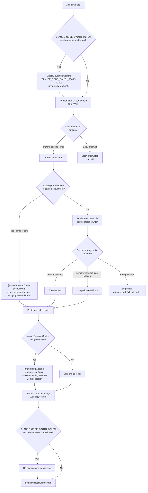

# `/login`

> Analysis basis: CC v2.1.191 bundle.js (AST extraction + Claude interpretation)
> Minimum version: v2.1.191

---

## Overview

The `/login` command allows users to switch Anthropic accounts or sign in with an Anthropic account from within the Claude Code REPL. It renders an interactive JSX-based authentication UI, orchestrates the OAuth token acquisition flow, persists credentials, and — upon completion — resets relevant application state including any active Remote Control bridge sessions.

---

## Registration

| Field | Value |
|---|---|
| type | `local-jsx` |
| name | `login` |
| description | `Switch Anthropic accounts \| Sign in with your Anthropic account` |
| loc_byte | `11739914` |
| loc_byte_end | `11740134` |
| loc_line | `7716` |
| module_id | `AKa` |
| load_inline | `true` |
| arbor_handler.name | `aLl` |
| arbor_handler.fqn | `claude-2.1.191::aLl` |
| arbor_handler.kind | `Function` |
| arbor_handler.resolution_path | `direct` |
| arbor_handler.n_hits | `2` |

Analysis basis: CC v2.1.191 bundle.js:+11739914

---

## Input Branching

The command renders a multi-step interactive UI with five or more distinct branches (credential environment check, OAuth flow execution, token persistence paths, success/interrupt outcomes, and account-change side-effects). A Mermaid flowchart is used.



Analysis basis: CC v2.1.191 bundle.js:+9060415, +9061071, +9061338, +9061742, +9062163, +9062182

---

## Behavioral Spec

### 1. Command Entry and UI Rendering

The top-level handler (Arbor-resolved as `aLl`; runtime component graph entry `V3p` → `Qke`) mounts a React-based login UI into the REPL's JSX rendering layer.

```
function loginCommandHandler(context):
    if CLAUDE_CODE_OAUTH_TOKEN in process.env:
        displayWarning(
            "Warning: CLAUDE_CODE_OAUTH_TOKEN is set in your environment "
            "and will override this login token at runtime. After logging in, "
            "unset that variable for your new credentials to take effect."
        )
    render LoginComponent(
        onDone: handleLoginComplete,
        onInterrupt: handleLoginInterrupt
    )
```

Analysis basis: CC v2.1.191 bundle.js:+9060415, +9061742, +9062228

---

### 2. OAuth Flow Execution

The inner component (`jA` → `Ije`) drives the OAuth exchange. It subscribes to a global auth-state event emitter and uses React's `useReducer`/`useEffect` pattern to coordinate async token acquisition.

```
function oauthFlowComponent(props):
    [state, dispatch] = useReducer(authReducer, initialState)

    useEffect():
        subscription = authStateEmitter.subscribe(handleAuthStateChange)
        return () => subscription.unsubscribe()

    useMemo():
        derivedAuthState = computeAuthState(globalConfig)

    onUserConfirm():
        initiateOAuthExchange()

    onUserCancel():
        dispatch({ type: "confirm:no" })
        props.onDone(null)
```

Analysis basis: CC v2.1.191 bundle.js:+9053390, +9053424, +9053442, +9062562

---

### 3. Credential Persistence

Upon successful token acquisition, the credential writer (`Wl` → `Uzs`) attempts secure storage first, then falls back to plaintext. It emits telemetry for each path.

```
function persistCredential(tokenPayload):
    try:
        result = secureStorage.write(tokenPayload)
        if result == "primary_transient_skip_fallback":
            plaintextFallback.write(tokenPayload)
            emitTelemetry("plaintext_fallback_used")
        else:
            emitTelemetry("secure_storage_credentials_write")
    catch:
        emitTelemetry("primary_and_fallback_failed")
        logError()
```

Analysis basis: CC v2.1.191 bundle.js:+2341025, +2341123, +2341272, +2341375

---

### 4. Trusted-Device Enrollment Check

After token write, the trusted-device enrollment flow (`BBt`) is conditionally triggered. Several skip conditions are evaluated in priority order:

```
function maybeEnrollTrustedDevice(session, oauthToken):
    if CLAUDE_TRUSTED_DEVICE_TOKEN in process.env:
        log("[trusted-device] CLAUDE_TRUSTED_DEVICE_TOKEN env var is set, "
            "skipping enrollment (env var takes precedence)")
        return

    if networkProfile == "essential-traffic":
        log("[trusted-device] Essential traffic only, skipping enrollment")
        return

    if oauthToken == null:
        log("[trusted-device] No OAuth token, skipping enrollment")
        return

    if isSameAccountOrgRelogin(session):
        log("[trusted-device] Same account+org re-login with existing token, "
            "skipping re-enrollment")
        return

    enrollDevice(oauthToken)
        .onSuccess(response):
            if response.statusCode == 201 and response.device_token:
                storeDeviceToken(response.device_token)
                emitTelemetry("bridge_trusted_device_enroll")
            else if response.device_token is missing:
                log("[trusted-device] Enrollment response missing device_token field")
                emitTelemetry("missing_token")
        .onHttpError():
            emitTelemetry("http_error")
        .onStorageFailure():
            emitTelemetry("storage_failed")
```

Analysis basis: CC v2.1.191 bundle.js:+9061338, +7329839, +7330153, +7330266, +7330662, +7330945

---

### 5. Post-Login Account-Change Side Effects

The main handler (`Jke`) drives post-login side-effects after token persistence completes.

```
function handlePostLogin(newAuthState, prevAuthState):
    # Disconnect Remote Control bridge if account changed
    if remoteBridgeSession.isActive():
        log("[bridge:repl] Account changed via /login — disconnecting "
            "Remote Control session")
        remoteBridgeSession.disconnect()

    # Refresh remote managed settings
    remoteSettings.refresh()

    # Refresh policy limits
    policyLimits.refresh()

    # Reset feature flags tied to old account
    featureFlagSystem.reload(newAuthState)

    # Update global app state
    appState.set({ auth: newAuthState })
```

Analysis basis: CC v2.1.191 bundle.js:+9061071, +9060986, +9061159

---

### 6. Environment Override Warning Logic

```
function checkOAuthTokenEnvOverride():
    if "CLAUDE_CODE_OAUTH_TOKEN" in process.env:
        displayMessage(
            "Warning: CLAUDE_CODE_OAUTH_TOKEN is set in your environment "
            "and will override this login token at runtime. After logging in, "
            "unset that variable for your new credentials to take effect."
        )
```

Analysis basis: CC v2.1.191 bundle.js:+9061742

---

### 7. Login Outcome Rendering

The UI component (`Qke`) renders the final state after login completes or is interrupted.

```
function renderLoginOutcome(result):
    if result == "success":
        display("Login successful")
    elif result == "interrupted":
        display("Login interrupted")
    display("Press [Esc] to continue or [cancel] to abort")
```

Constants observed:
- Success message: `"Login successful"` (bundle.js:+9062163)
- Interrupt message: `"Login interrupted"` (bundle.js:+9062182)

---

## State & Side Effects

| Item | Detail |
|---|---|
| Telemetry | `tengu_api_success` (bundle.js:+8938998), `tengu_config_auth_loss_prevented` (+13862444), `tengu_remote_settings_401_force_refresh_retry` (+7381375), `tengu_managed_settings_security_dialog_shown` (+7376858), `tengu_managed_settings_security_dialog_accepted` (+7376542), `tengu_managed_settings_security_dialog_rejected` (+7376592), `tengu_policy_limits_fetch` (+13845006), `tengu_disable_bypass_permissions_mode` (+13727473), `tengu_auto_mode_config` (+13725264), `tengu_daemon_control` (+17408260) |
| Secure storage | Writes OAuth token; emits `secure_storage_credentials_write`, `plaintext_fallback_used`, or `primary_and_fallback_failed` |
| Remote Control bridge | Disconnects active Remote Control (bridge) session when account changes (bundle.js:+9061071) |
| appState changes | Sets auth state via `e.setAppState` (bundle.js:+9061159); reads prior state via `e.getAppState` (bundle.js:+9060986) |
| Feature flags | Reloads `BCi` / `GCi` feature flag caches on account change (bundle.js:+3337938, +3337968) |
| Remote settings | Triggers background remote-settings pull and policy-limits pull after auth change (bundle.js:+7384186, +13846961) |
| Trusted-device enrollment | Conditionally POSTs enrollment request; stores `device_token` in secure/plaintext storage |
| Sound | <!-- TODO: not found in depth-2 traversal; needs --depth 4 --> |
| Hook registration | `_i` registers a handler via `xqo.register` (bundle.js:+67562) — likely the REPL lifecycle hook |

---

## Version History

| Version | Change |
|---|---|
| v2.1.191 | Initial analysis |

---

## Common Mistakes

1. **Leaving `CLAUDE_CODE_OAUTH_TOKEN` set in the environment after `/login`.** The CLI warns about this explicitly: the environment variable takes precedence over the freshly stored OAuth token at runtime, so the new credentials will not be used until the variable is unset.
2. **Expecting `/login` to survive an active Remote Control (bridge) session unchanged.** Any active Remote Control session is disconnected when the account changes, requiring the caller to re-establish the bridge.
3. **Assuming secure storage always succeeds.** The command has a plaintext fallback path. If both paths fail (`primary_and_fallback_failed`), credentials are not persisted and subsequent API calls will fail.
4. **Re-invoking `/login` on the same account to force trusted-device re-enrollment.** If the existing OAuth token belongs to the same account and organisation, the re-enrollment step is skipped silently.
5. **Not accounting for remote-settings and policy-limits refresh latency.** Both are triggered asynchronously after login completes; policy changes may not be reflected immediately on the next command.

---

## Appendix — Identifier Mapping

> For bundle debugging only. Identifiers change across versions.

| Identifier | Role |
|---|---|
| `aLl` | Arbor-resolved top-level handler for `/login` (registered as `local-jsx` command) |
| `V3p` | Outer login wrapper React component (call-graph handler entry point) |
| `Qke` | Inner login UI React component (renders form, success/interrupt states) |
| `Jke` | Post-login side-effect orchestrator (API key change, relaunch, app-state mutation) |
| `jA` | Authentication state React hook component |
| `Ije` | OAuth flow reducer/effect component |
| `Bz` | Auth-state event emitter subscription helper |
| `BBt` | Trusted-device enrollment orchestrator |
| `fF` | Feature-flag evaluation for login context |
| `RTn` | Feature-flag runtime evaluator (reads `xve` / `x5r` maps) |
| `WCi` | Feature-flag conditional check with policy integration |
| `w5r` | Feature-flag experiment emitter (emits `GrowthbookExperimentEvent`) |
| `Wl` | Credential persistence coordinator |
| `Uzs` | Secure-storage read/write driver |
| `JFe` | Async secure-storage reader |
| `Hao` | Post-login app-state reset initiator |
| `aRe` | App-lifecycle notification helper (notifies daemon) |
| `iH` | Auth-context builder (resolves API key, OAuth token, env vars) |
| `cR` | Auth config reader |
| `yA` | OAuth profile builder |
| `TZe` | WIF (Workload Identity Federation) credential resolver |
| `ACe` | Provider-aware auth configuration builder |
| `oW` | Anthropic SDK client factory / API-request dispatcher |
| `wN` | Main API call executor (handles retries, caching, streaming) |
| `L6o` | Conversation context formatter (message windowing, truncation) |
| `gsm` | Token/message setter utility |
| `har` | Character-code utility (surrogate-pair handling) |
| `hx` | Low-level string slice helper (surrogate boundary) |
| `Cs` | CLI error handler (emits `cli_error`, calls `process.exit`) |
| `Kdn` | Proxy-auth helper executor (with 30 000 ms timeout) |
| `Iud` | HTTP request builder (sets content-type, request ID, etc.) |
| `SCe` | Response stream handler |
| `fy` | Proxy agent builder |
| `_y` | Environment variable auth resolver |
| `_ud` | Token refresh scheduler |
| `Ng` | OAuth token refresher |
| `PH` | Mantle credential resolver |
| `G2` | Additional credential source resolver |
| `MTn` | Feature-flag payload loader (clears + repopulates `xve`, `gW`) |
| `BCi` | Feature-flag cache writer |
| `GCi` | Feature-flag snapshot builder |
| `gKa` | Global config reader |
| `vK` | Feature-allowed set checker (`Fdu`) |
| `Mft` | Combined permission/feature checker |
| `B3p` | Object-entries permission evaluator |
| `$3p` | Set-based feature gate evaluator |
| `KBi` | Permission key uppercaser and set-membership checker |
| `zBi` | Feature deny-list checker |
| `BLt` | API key / proxy config loader (reads env, requires `undici`) |
| `lMs` | API key file reader |
| `tz` | Proxy URL parser and classifier |
| `V6t` | Policy-limits orchestrator |
| `p2o` | Policy-limits cache checker |
| `che` | Policy-limits applicability tester |
| `hKs` | Feature-event emitter (`gKs.emit`) |
| `Fnr` | Policy-limits fetch scheduler |
| `gF` | Policy-limits data-file accessor |
| `DDt` | Policy-limits display component |
| `fXl` | Policy-limits HTTP fetcher and cache writer |
| `dXl` | Cache file mtime evaluator |
| `T9f` | Policy-limits content hasher |
| `I9f` | Policy-limits auth-type classifier |
| `C9f` | Policy-limits retry scheduler (with jitter, via `VY`) |
| `VY` | Exponential-backoff jitter calculator |
| `mXl` | Policy-limits background poll loop |
| `x9f` | Policy-limits incremental poll step |
| `Bnr` | Policy-limits poll manager |
| `PDt` | Policy-limits file reader (sync) |
| `Zie` | Cleanup / teardown orchestrator (clears `xve`, `xTn`, `bDt`, `x5r`, `gW`) |
| `Ztt` | Global reset executor (removes process listeners, clears all caches) |
| `N5r` | Interval + process-listener cleaner |
| `B6t` | Auto-mode gate notification handler |
| `fGn` | Auto-mode disable-bypass-permissions checker |
| `O5r` | Bypass-permissions availability tester |
| `o3t` | Permission-update message dispatcher |
| `HH` | Permission-mode setter |
| `Ur` | Session-init parameter resolver |
| `zKn` | Working-directory session-init resolver |
| `YKn` | Allowed-tools session-init resolver |
| `AB` | Session-init final assembler |
| `G6t` | Auto-mode configuration loader |
| `j6t` | Auto-mode eligibility evaluator |
| `jz` | Auto-mode feature-flag reader (`kTn` → `WCi`) |
| `Es` | Model-tier resolver |
| `E4` | Model name builder |
| `Qo` | Model alias resolver (maps `sonnet`, `haiku`, `opus`, etc.) |
| `rH` | Model alias with plan context resolver |
| `Gge` | Gateway/provider selector |
| `iHe` | Hook-system event emitter for `permission_mode_changed` |
| `eu` | Hook event dispatcher |
| `tAe` | Permission-set batch updater |
| `Hao` | Trusted-device enrollment entry point |
| `io` | React context initializer |
| `BBt` | Trusted-device enrollment orchestrator (see above) |
| `xs` | URL/hostname normaliser |
| `Nns` | Network-profile classifier |
| `qin` | Trusted-device POST request builder |
| `Yi` | Network-profile accessor |
| `ncs` | Network-profile string extractor |
| `pGn` | App-state teardown / cleanup initiator |
| `mKa` | Output cache clearer (`o_o.clear`) |
| `SOt` | Trusted-device token checker |
| `HKa` | Auth-change hook invoker |
| `Sc` | Spinner / status-line component |
| `cSt` | Context-tip classifier coordinator |
| `usm` | Token-usage summariser |
| `csm` | Per-message token counter |
| `hsm` | Formatted usage string builder |
| `M6n` | Model-availability finder |
| `D6n` | Schema-safe parser for model responses |
| `dsm` | Context-tip data summariser |
| `W5e` | Session lifecycle manager |
| `WY` | Session state machine |
| `RUn` | Session-state notifier |
| `ulo` | Remote-settings load gate (defers until consent dialog) |
| `lwa` | Remote-settings pre-fetch helper |
| `plo` | Remote-settings parallel loader |
| `flo` | Remote-settings main fetch+apply loop |
| `cwa` | Remote-settings HTTP fetcher |
| `bgp` | Remote-settings cache writer |
| `nwa` | Remote-settings security-dialog initiator |
| `gN` | Security-dialog result handler |
| `rwa` | Remote-settings schema validator |
| `awa` | Remote-settings atomic file writer |
| `pwa` | Remote-settings background poll scheduler |
| `Igp` | Remote-settings incremental poll step |
| `WTn` | Interval manager (setInterval/clearInterval wrapper) |
| `MW` | File-write utility (write/x8r) |
| `ggp` | Security-dialog requester queue |
| `Lva` | Settings diff/patch builder |
| `Pct` | Settings field uppercaser |
| `hUn` | Settings key enumerator |
| `ewa` | Settings approval state handler |
| `iwa` | Settings field change detector |
| `jTe` | Settings mutation event emitter |
| `Sva` | Settings content hasher |
| `qao` | Recursive settings object serialiser |
| `FXe` | Cache-clear on settings reset |
| `kH` | Dual-cache clear (`sZt`, `Zcr`) |
| `xc` | Settings category classifier |
| `dwa` | Daemon-pipe writer for settings |
| `_i` | REPL lifecycle hook registrar |
| `Fjo` | Background session file manager |
| `ic` | Session directory path resolver |
| `yR` | Session state-file path resolver |
| `Bi` | Session roster file reader/writer |
| `vn` | Error logger for file ops |
| `$t` | JSON.parse wrapper |
| `bh` | Session active-state checker |
| `$x` | Session state reader (`Vae`) |
| `eLe` | Roster entry parser |
| `BPd` | Roster filter/patch helper |
| `Od` | Session state atomic writer |
| `Rm` | Atomic file rename writer |
| `by` | Session cache-entry deleter |
| `bHt` | Session file sync helper |
| `MV` | Session file validator |
| `vgf` | Session directory creator |
| `lqt` | Session lock-file path resolver |
| `oSe` | PTY-PID file path resolver |
| `Y8e` | PTY state-file path resolver |
| `zR` | PTY error-file path resolver |
| `cvl` | PTY late-file builder |
| `zN` | PTY-PID roster builder |
| `D0o` | Background-process PID file reader |
| `AHt` | PTY-PID file path helper |
| `PM` | PTY consolidated state builder |
| `f` | Daemon process lifecycle manager |
| `Yer` | Memory/OS metrics sampler |
| `Mjo` | Daemon socket claim sender |
| `K2o` | Daemon working-directory initialiser |
| `aqt` | Daemon socket path resolver |
| `iqt` | Daemon socket base-path builder |
| `Ipm` | Daemon claim-frame timeout manager |
| `Cpm` | Daemon socket connector |
| `Tpm` | Daemon claim-frame builder |
| `VR` | Binary frame serialiser (Buffer) |
| `Gd` | Async error logger |
| `d` | Daemon writer/output stream manager |
| `YVe` | Daemon file stat checker |
| `yWl` | Daemon output column formatter |
| `E` | MCP server process manager |
| `A` | Secondary MCP server lifecycle |
| `h0c` | Daemon heartbeat initiator |
| `M` | Daemon idle-exit timer |
| `c` | Daemon write-stream wrapper |
| `L` | Background worker sweep manager |
| `Nzt` | Memory-pressure sampler |
| `J8l` | Worker retire-grace evaluator |
| `I3e` | Conversation history file cleaner |
| `Le` | Error logger with stack capture |
| `Xer` | Worker attach-upgrade handler |
| `p` | Forced-shutdown executor |
| `fo` | Error formatter (Error + String) |
| `pGn` | App-state teardown initiator (duplicate row omitted) |
| `In` | React component reconciler anchor |
| `vln` | Virtual-DOM node lookup |
| `VVo` | Component store getter (`sZt`) |
| `EIr` | Component effect runner |
| `qVo` | Component store setter (`sZt`) |
| `z2` | Component context binder |
| `Hr` | Component hook initialiser |
| `Lwt` | Component state machine builder |
| `LOr` | API auth-header builder |
| `l7s` | Bearer-token format validator |
| `wOr` | Per-request auth-scope validator |
| `vOr` | Foundry resource-ID normaliser |
| `lie` | Auth header injector |
| `$At` | Auth header base builder |
| `Ghn` | User-agent string builder |
| `ol` | String coercion utility |
| `_r` | Logger / trace emitter |
| `uu` | Structured log formatter |
| `$hn` | AsyncLocalStorage store getter |
| `hCe` | HTTP client log decorator |
| `aIn` | Request-ID injector |
| `T` | Telemetry / logging dispatcher |
| `rt` | Timestamp utility |
| `SHo` | Request fingerprint hasher (SHA-256) |
| `CBp` | Tool-use block finder |
| `wD` | Response post-processor |
| `C3r` | Response error mapper |
| `A2e` | Response schema validator |
| `mbe` | Token-usage accumulator |
| `Tr` | Streaming response tracker |
| `lh` | Line-height / layout helper |
| `Oo` | Output formatter |
| `H1t` | Thinking-block processor |
| `v3i` | Reasoning block renderer |
| `Rot` | Block output writer |
| `h1t` | Heading block handler |
| `NF` | Agent-name resolver |
| `nOd` | Agent-prefix stripper |
| `xD` | Thread-type classifier |
| `kAt` | Cache-control annotation injector |
| `S4` | System-prompt builder |
| `ev` | Environment variable inserter |
| `PPr` | Project-context formatter |
| `zp` | Base system-prompt assembler |
| `usm` | Token-usage summariser (duplicate) |
| `csm` | Per-message token counter (duplicate) |
| `hsm` | Usage string builder (duplicate) |
| `cSt` | Context-tip classifier (duplicate) |
| `Re` | Warning/error renderer |
| `we` | Inline warning renderer |
| `Ae` | String coercion wrapper |
| `Cze` | Timestamp factory (`Date.now`) |