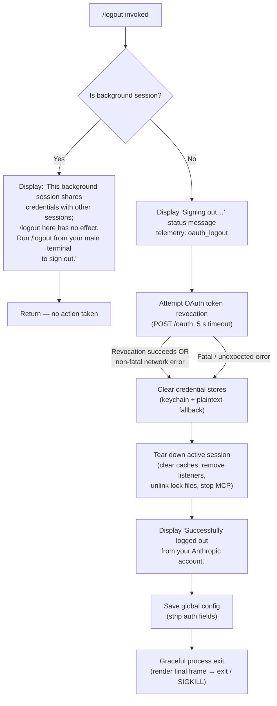

# `/logout`

> Analysis basis: CC v2.1.191 bundle.js (AST extraction + Claude interpretation)
> Minimum version: v2.1.191

---

## Overview

The `/logout` command signs the user out of their Anthropic account by revoking the active OAuth token, clearing all locally stored credentials, tearing down the active session, and then exiting the CLI process. It handles background-session detection, token revocation via HTTP, credential store cleanup, and a graceful process shutdown sequence.

---

## Registration

| Field | Value |
|---|---|
| type | `local-jsx` |
| name | `logout` |
| description | Sign out from your Anthropic account |
| module_id | `mfo` |
| load_inline | `true` |
| loc_byte | `11740195` |
| loc_byte_end | `11740479` |
| arbor_handler.name | `PDp` |
| arbor_handler.fqn | `claude-2.1.191::PDp` |
| arbor_handler.kind | `AsyncFunction` |
| arbor_handler.resolution_path | `module_id` |
| arbor_handler.n_hits | `0` |

Analysis basis: CC v2.1.191 bundle.js:+11740195

---

## Input Branching

The command has four distinct execution paths, determined by session context and the outcome of token revocation:



---

## Behavioral Spec

### 1. Background-session guard

```
function isBackgroundSession(sessionContext):
    if sessionContext.isBackground == true:
        renderSystemMessage(
            "This background session shares credentials with other sessions; "
            "/logout here has no effect. Run /logout from your main terminal to sign out."
        )
        return EARLY_EXIT
```

Analysis basis: CC v2.1.191 bundle.js:+8284162

If the caller is running inside a background (`bg`) or daemon worker session the command prints an advisory message and returns immediately without touching credentials.

---

### 2. Status display and telemetry emission

```
function beginLogout():
    render JSX status element with text "Signing out…"
    emit telemetry event "oauth_logout"
```

Analysis basis: CC v2.1.191 bundle.js:+8283835 (telemetry event), +8284513 (status string)

---

### 3. OAuth token revocation

Implemented by the `tokenRevokeRequest` helper (obfuscated: `i1`), which calls the token-revocation endpoint via an HTTP POST.

```
async function revokeOAuthToken(authState):
    endpoint = buildOAuthEndpoint(authState)   // resolves prod / staging / local
    response = await httpPost(endpoint, {
        data: { token_type: "refresh_token" },
        headers: { "Content-Type": "application/json" },
        timeout: 5000
    })
    if isAxiosError(response):
        if errorCategory(response) == "network":
            // treat as non-fatal; proceed with local cleanup anyway
            logWarning(...)
        else:
            logError(...)
    emit telemetry "oauth_token_revoke" (inside HTTP layer)
    return
```

Analysis basis: CC v2.1.191 bundle.js:+2146494 (`i1` call), +2146554 ("refresh_token" literal), +2146624 ("application/json" literal), +2146652 (5000 ms timeout), +2146662 ("oauth_token_revoke" literal)

Network failures (`ECONNABORTED`, `ECONNREFUSED`, `ENOTFOUND`) are treated as non-fatal: local credential cleanup proceeds regardless.

---

### 4. Credential store cleanup

Implemented by `credentialClear` (obfuscated: `uwa`), which removes both the primary keychain entry and any plaintext fallback file.

```
async function credentialClear():
    // Primary store: OS keychain (keychainService "claude-code-user")
    try:
        unlinkKeychainEntry()      // Uct.unlink
    catch err:
        log("Failed to delete keychain entry")

    // Plaintext fallback: join config dir with credential file path, then unlink
    fallbackPath = joinPath(configDir, credentialFileName)   // Gan + Zn
    try:
        fs.unlink(fallbackPath)
    catch:
        pass   // ENOENT is silently ignored
```

Analysis basis: CC v2.1.191 bundle.js:+7382181 (`uwa`), +7382245 (`Uct.unlink`), +2160811 ("Failed to delete keychain entry" literal), +1196865 (path join helper `Gan`)

---

### 5. Session teardown

Implemented by `sessionCleanup` (obfuscated: `p4t`), which coordinates several sub-teardown steps:

```
function sessionCleanup(sessionState):
    // 5a. Clear in-memory caches
    clearCacheMap()          // jge → Kfi.clear
    clearVolatileState()     // $Z, ZNn, _ve

    // 5b. Remove process event listeners and intervals
    processEventCleanup()    // Ztt:
        clearInterval(heartbeatInterval)
        process.removeListener(...)
        process.off("exit", ...)
        process.off("beforeExit", ...)
        xve.clear(); xTn.clear(); bDt.clear(); x5r.clear(); gW.clear()

    // 5c. Emit session-end event
    sessionEventBus.emit("session_end")          // Qtt.emit

    // 5d. Stop MCP connections
    stopAllMcpConnections()  // via Zie → Le, fo

    // 5e. Remove lock / PID files
    removeLockFile()         // gfo → Hqe.unlink, p2o → clearTimeout
    removePidFile()          // Pve → hvi.join + Zn

    // 5f. Write final config (strip auth)
    saveGlobalConfig()       // gn → Xnr → Rvt (atomic write)
```

Analysis basis: CC v2.1.191 bundle.js:+8282577 (`p4t`), +3052634 (`Kfi.clear`), +3337301 (`Zie`), +3338188 (`clearInterval`), +3338223 (`process.removeListener`), +3337444 (`process.off`), +13847044 (`Hqe.unlink`), +8284020 (`gfo`)

---

### 6. Success message rendering (JSX)

```
function renderSuccessMessage():
    return JSX <system> element containing:
        "Successfully logged out from your Anthropic account."
```

Analysis basis: CC v2.1.191 bundle.js:+8284338 (JSX render call `V2a.jsx`), +8284358 (success string literal), +8284316 ("system" message type)

---

### 7. Graceful process exit

Implemented by `gracefulExit` (obfuscated: `xc` → `Ai`):

```
async function gracefulExit():
    // Render final terminal frame, flush stdout
    finalRender()            // O5e → Z_e.writeSync, e.unmount
    printFinalOutput()       // xao → Z_e.writeSync, St.dim

    // Race: clean shutdown vs. hard kill timeout
    await Promise.race([
        shutdownCleanly(),   // iva → Promise.allSettled + Array.from
        timeout(max(3500, 2000), () => {
            process.kill(process.pid, "SIGKILL")
        })
    ])
    process.exit(0)
```

Analysis basis: CC v2.1.191 bundle.js:+8284422 (`setTimeout`), +8284438 (`xc`), +7343148 (`process.exit`), +7343173 (`process.kill`), +7343198 ("SIGKILL" literal), +7345587 (3500 ms literal), +7345700 (`Promise.race`)

The process kills itself with `SIGKILL` if clean shutdown does not complete within the allowed window, ensuring the CLI always terminates.

---

### 8. HTTP status check (200 guard)

```
function checkRevocationResponse(response):
    if response.status != 200:
        logWarning(...)
    // Continue regardless — non-200 does not abort local cleanup
```

Analysis basis: CC v2.1.191 bundle.js:+8284454 (200 literal)

---

## State & Side Effects

| Item | Detail |
|---|---|
| Telemetry: `oauth_logout` | Emitted at the start of logout (bundle.js:+8283835) |
| Telemetry: `tengu_api_success` | Emitted on successful HTTP call inside API layer (bundle.js:+8938998) |
| Telemetry: `tengu_config_lock_contention` | Emitted if config lock is slow during final config save (bundle.js:+13865550) |
| Telemetry: `tengu_config_stale_write` | Emitted if config re-read detects a stale state (bundle.js:+13865686) |
| Telemetry: `tengu_config_auth_loss_prevented` | Emitted if auth-loss safeguard fires during config save (bundle.js:+13866393) |
| Telemetry: `tengu_config_auto_repaired` | Emitted if config parse error is auto-repaired (bundle.js:+13866063) |
| Telemetry: `tengu_config_fallback_write` | Emitted if config must use fallback write path (bundle.js:+13865166) |
| Telemetry: `tengu_daemon_config_reload` | Emitted after daemon config is reloaded during teardown (bundle.js:+17386661) |
| Telemetry: `tengu_scroll_summary` | Emitted during final terminal render (bundle.js:+7344996) |
| Telemetry: `tengu_cache_eviction_hint` | Emitted during session cleanup cache eviction (bundle.js:+7345939) |
| Telemetry: `tengu_pewter_brook` | Emitted in terminal mode detection path (bundle.js:+3537159) |
| Hook registration | Process `exit`, `beforeExit` listeners are **removed** during teardown (bundle.js:+3337502, +3338246) |
| Keychain / credential store | Primary keychain entry (service: `claude-code-user`) is deleted; plaintext fallback file is unlinked (bundle.js:+7382245, +2160052) |
| Lock file | Session lock file is unlinked via `Hqe.unlink` (bundle.js:+13847044) |
| In-memory caches | `Kfi`, `xve`, `xTn`, `bDt`, `x5r`, `gW` Maps/Sets are all `.clear()`-ed (bundle.js:+3052634 – +3337618) |
| Global config | Auth fields stripped and config written to disk atomically before exit (bundle.js:+13862562, save_global telemetry key) |
| MCP connections | All active MCP server connections are stopped and cleaned up (bundle.js:+3337323) |
| Process | `process.exit(0)` is called; `SIGKILL` fallback if shutdown exceeds timeout (bundle.js:+7343148, +7343198) |
| Sound | None detected in depth-2 traversal |

---

## Version History

| Version | Change |
|---|---|
| v2.1.191 | Initial analysis |

---

## Common Mistakes

1. **Running `/logout` in a background or daemon session**: The command detects `bg` / `daemon` / `daemon-worker` session types and refuses to act, printing an advisory instead. Users must run `/logout` from the main (foreground) terminal session.

2. **Expecting immediate re-authentication**: The command calls `process.exit(0)` after cleanup; the entire CLI process terminates. There is no "soft" logout that returns to a login prompt within the same session.

3. **Network errors blocking logout**: Token revocation uses a hard 5-second HTTP timeout. If the Anthropic endpoint is unreachable, the revocation is skipped but all local credential cleanup and process exit still proceed normally — network connectivity is not required for a successful local logout.

4. **Config corruption safety**: The config save on logout includes a guard that refuses to write a config that is missing auth fields present in the in-memory cache (GH #3117 safeguard). If this guard triggers (`tengu_config_auth_loss_prevented`), the on-disk file is not overwritten, which may leave a stale `~/.claude.json` after logout.

5. **Hard-kill race condition**: If any shutdown hook takes longer than the `SIGKILL` timeout (approximately 3500 ms), the process is forcibly killed. Any buffered writes that have not yet been flushed may be lost.

---

## Appendix — Identifier Mapping

> For bundle debugging only. Identifiers change across versions.

| Identifier | Role |
|---|---|
| `PDp` | Main async handler for `/logout` command (Arbor-resolved) |
| `ODp` | Outer wrapper / render coordinator that delegates to `PDp` and `bdt` |
| `bdt` | Core logout execution function (token revoke, session teardown, config save) |
| `p4t` | Session teardown coordinator (clears caches, listeners, lock files, MCP) |
| `uwa` | Credential store clear (keychain + plaintext fallback unlink) |
| `gfo` | Lock / PID file removal coordinator |
| `Ks` | Session context reader (detects background session type) |
| `HCe` | Background session type resolver |
| `Zie` | Session event bus / MCP connection stopper |
| `Ztt` | Process listener cleanup (clears intervals, process.off calls) |
| `N5r` | Interval / process-removeListener helper |
| `jge` | Cache map clear helper (`Kfi.clear`) |
| `ZNn` | Volatile state clear helper |
| `$Z` | Additional state reset helper |
| `_ve` | Supplementary state clear helper |
| `i1` | OAuth token revocation HTTP request helper |
| `xs` | OAuth endpoint URL builder |
| `Nns` | OAuth environment config resolver |
| `jXc` | OAuth endpoint selector |
| `r` | CLI error renderer / error output helper |
| `Cs` | Error output handler (console.error + colored output + exit) |
| `nqe` | Colored error string formatter (`St.red`) |
| `fT` | Config file writer (`$oe.writeFileSync`) |
| `gn` | Global config save function |
| `Xnr` | Atomic config write helper |
| `Rvt` | Atomic file write with fsync and rename |
| `U7t` | Config lock acquisition and save-with-lock function |
| `tEt` | Config read helper |
| `R2o` | Config backup path builder |
| `nEt` | Config lock file namer |
| `O7t` | Config timestamp helper |
| `P7t` | Config write sub-routine |
| `v2o` | Config object entries iterator |
| `p2o` | Lock file clear timeout handler |
| `m2o` | Lock file state helper |
| `che` | Lock file conditional check |
| `Pve` | PID file path resolver |
| `a3t` | Credential file path builder |
| `Mfs` | Credential path segment constant |
| `Gan` | Credential file path joiner |
| `cme` | Config directory resolver |
| `Le` | MCP connection lifecycle manager / log-error recorder |
| `fo` | Error factory helper |
| `rt` | String coercion utility |
| `Yi` | Essential-traffic queue helper |
| `Rmu` | Request queue shift/push manager |
| `Wl` | Storage read/write coordinator |
| `Uzs` | Secure storage read/write/delete dispatcher |
| `JFe` | Secure storage async read helper |
| `VKu` | AsyncLocalStorage-backed credential store accessor |
| `Lt` | Storage write result emitter (`tengu_feature_sad`) |
| `We` | Storage write result emitter (`tengu_feature_ok`) |
| `Re` | Storage write result emitter (`tengu_feature_bad`) |
| `Pe` | Telemetry event emitter base |
| `W` | Telemetry event builder |
| `_r` | Auth provider type resolver (bedrock / foundry / vertex / etc.) |
| `z3r` | Config identity/profile hasher |
| `imi` | Profile hash computation helper |
| `q4s` | SHA-256 config hash helper |
| `a1` | Path normalizer + hash builder |
| `KC` | Key-wrapping helper (`wUe`) |
| `ID` | OS user info resolver (`pgn.userInfo`) |
| `xc` | Graceful exit launcher (wraps `Ai`) |
| `Ai` | Core graceful exit implementation (render, race, exit) |
| `O5e` | Final terminal frame renderer (unmounts Ink app) |
| `IF` | Ink instance finalizer |
| `Pvn` | Terminal cursor-save/restore writer |
| `xao` | Final output printer (dim text, writeSync) |
| `Rao` | Hard-exit enforcer (process.exit / SIGKILL) |
| `Nze` | stdout drain awaiter |
| `iva` | Graceful shutdown promise coordinator (`Promise.allSettled`) |
| `TTt` | Startup profiling reporter |
| `hmr` | Profiling log writer |
| `P7o` | Profiling file writer (JSON.stringify + writeSync) |
| `fUn` | Session metrics recorder |
| `qCa` | Session duration calculator |
| `KCa` | Session metrics store accessor |
| `ks` | Terminal/renderer initializer |
| `xAt` | Cache eviction hint emitter |
| `Ve` | Telemetry event emitter (wraps `eze`) |
| `Tr` | Telemetry event emitter variant |
| `lh` | Telemetry helper (wraps `eze`) |
| `eze` | Telemetry event dispatch base |
| `U5e` | Exit promise resolver |
| `cUn` | Exit completion notifier |
| `d` | MCP daemon reload / supervisor config updater |
| `YVe` | File stat / validation helper |
| `yWl` | File write layout calculator |
| `E` | MCP connection stop + cleanup (SDK path) |
| `A` | MCP connection stop + update + restart |
| `h0c` | Daemon heartbeat helper |
| `S4` | Context tip classifier |
| `M6n` | Context tip response finder |
| `D6n` | Context tip schema safe-parser |
| `T` | Model/message type dispatcher |
| `Ae` | String coercion helper |
| `wN` | Main API request executor |
| `L6o` | Message list formatter |
| `usm` | Conversation serializer |
| `hsm` | Message content builder |
| `e3t` | Working-directory stat checker |
| `yg` | Config/feature flag file checker |
| `R3e` | Config initializer for session |
| `KS` | Config key stringifier |
| `eu` | Session event emitter / config publisher |
| `x3e` | OTEL metrics attribute builder |
| `P4` | Session ID generator |
| `wt` | Terminal mode detector (`ux`) |
| `oxn` | Identity source builder |
| `E1t` | String padding helper |
| `U2` | Allowlist checker (`Udu.has`) |
| `Sc` | Metric scope builder |
| `mOd` | JWT base64url decoder |
| `D3i` | OTEL dimension helpers |
| `pbt` | Session publish helper |
| `Zur` | Session routing helper |
| `a` | MCP server manager / event dispatcher |
| `s5e` | MCP server connection executor |
| `Gar` | MCP connection result applier |
| `w_a` | MCP proxy forwarder |
| `l` | MCP client list iterator |
| `hGo` | MCP server group reconnection manager |
| `edr` | Session config diff emitter |
| `B1e` | Supplementary session state cleaner |
| `hHn` | Config profile helper |
| `dOe` | Config directory initializer |