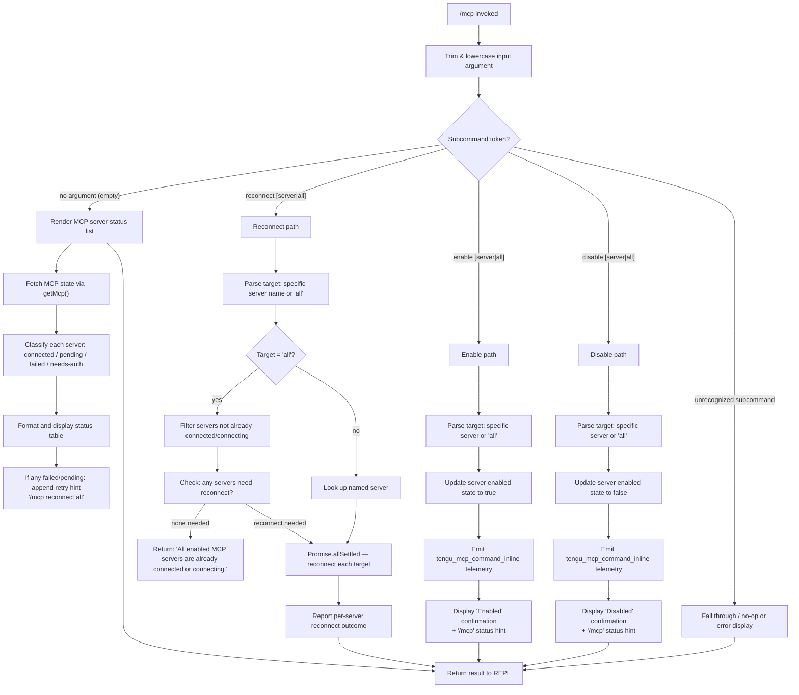

# `/mcp`

> Analysis basis: CC v2.1.191 bundle.js (AST extraction + Claude interpretation)
> Minimum version: v2.1.191

---

## Overview

The `/mcp` slash command is the primary interface for managing Model Context Protocol (MCP) server connections within an active Claude Code session. It allows users to view server statuses, reconnect failed or pending servers, and enable or disable individual servers or all servers at once. The command dispatches to different code paths based on the subcommand token (or absence thereof) provided after `/mcp`.

---

## Registration

| Field | Value |
|---|---|
| type | `local` |
| name | `mcp` |
| description | `Manage MCP servers` |
| argumentHint | `[reconnect\|enable\|disable [<server>\|all]]` |
| supportsNonInteractive | `true` |
| module_id | `Oxl` |
| load_inline | `true` |
| loc_byte | `12082702` |
| loc_byte_end | `12082894` |
| loc_line | `7946` |
| arbor_handler.name | `FHf` |
| arbor_handler.fqn | `claude-2.1.191::FHf` |
| arbor_handler.kind | `AsyncFunction` |
| arbor_handler.resolution_path | `module_id` |
| arbor_handler.n_hits | `0` |

Analysis basis: CC v2.1.191 bundle.js:+12082702

---

## Input Branching

The command has 5+ distinct dispatch paths based on the subcommand argument (or its absence). A Mermaid flowchart is used.



Analysis basis: CC v2.1.191 bundle.js:+11816697, +11817303, +11817403, +11817416, +11817433, +11817447

---

## Behavioral Spec

### Top-Level Handler: mcpCommandHandler

The Arbor-resolved handler `FHf` is an `AsyncFunction` reached via module `Oxl`.

```
async function mcpCommandHandler(context):
    rawArg = context.argument.trim()                      // +11816697
    mcpState = context.getMcp()                           // +11816708

    subcommand = rawArg.toLowerCase()                     // +11816757

    if subcommand is in ["ide", ...non-interactive sources]:
        // suppress or reroute for non-terminal callers    // +11816780
        return early result

    if no argument / empty:
        return renderStatusView(mcpState)

    tokens = subcommand.split(" ")
    verb   = tokens[0]   // "reconnect" | "enable" | "disable"
    target = tokens[1]   // server name or "all" or undefined

    if verb == "reconnect":
        return handleReconnect(mcpState, target)

    if verb == "enable" or verb == "disable":
        return handleEnableDisable(mcpState, verb, target)

    // fallback: display status
    return renderStatusView(mcpState)
```

Analysis basis: CC v2.1.191 bundle.js:+11816697, +11816708, +11816757, +11816780, +11816820

---

### Sub-feature: Status View (no-argument path)

```
function renderStatusView(mcpState):
    servers = mcpState.servers

    if servers is empty:
        return "No MCP servers are configured. Add one with `claude mcp add`."
                                                           // +11817669

    if terminal not ready / alternate view active:
        return "MCP controls aren't available right now…"  // +11817868

    for each server in servers:
        status = classify(server):
            "connected"    -> show connected indicator
            "pending"      -> show pending indicator
            "failed"       -> show failed indicator        // +11816988
            "needs-auth"   -> show needs-auth indicator    // +11817007
            "needs-approval" -> ...                        // +11816106

    if any server in [failed, pending]:
        append hint: " Reply `/mcp reconnect all` here to retry."  // +11817198

    return formatted table
```

Analysis basis: CC v2.1.191 bundle.js:+11816922, +11816956, +11816988, +11817007, +11817198, +11817669, +11817868

---

### Sub-feature: Reconnect Path

```
async function handleReconnect(mcpState, target):
    if target == "all" or target is undefined:             // +11817403
        candidates = servers.filter(s => not already connected/connecting)
                                                           // +11817607
        if candidates is empty:
            return "All enabled MCP servers are already connected or connecting."
                                                           // +11818610
    else:
        candidates = [lookupServerByName(target)]

    results = await Promise.allSettled(
        candidates.map(server => reconnectServer(server))
    )                                                      // +11818686

    for each result in results:
        if result.status == "fulfilled":                   // +11818751
            report success with server name
        else:
            report failure

    if any server needs-auth:
        append: "Authenticate with `/mcp` in the terminal."  // +11818896

    if any server has config error:
        append: "Check its config with `/mcp` in the terminal."  // +11818940

    return formatted reconnect summary
```

Analysis basis: CC v2.1.191 bundle.js:+11817403, +11817416, +11817607, +11818610, +11818686, +11818751, +11818896, +11818940

---

### Sub-feature: Enable / Disable Path

```
async function handleEnableDisable(mcpState, verb, target):
    // verb = "enable" or "disable"                        // +11817433, +11817447

    if target == "all":                                    // +11817403
        affected = all configured servers
    else:
        affected = [lookupServerByName(target)]

    for each server in affected:
        server.enabled = (verb == "enable")

    emit telemetry: tengu_mcp_command_inline               // +11817546

    label = (verb == "enable") ? "Enabled" : "Disabled"   // +11820058, +11820068

    return label + ". Run `/mcp` in the terminal to see status."
                                                           // +11820893
```

Analysis basis: CC v2.1.191 bundle.js:+11817433, +11817447, +11817546, +11820058, +11820068, +11820893

---

### Sub-feature: Server Reconnect Worker (reconnectServer)

The reconnect operation for individual servers (reachable via `IRo` → `eVe`) handles the low-level reconnect lifecycle.

```
async function reconnectServer(server):
    // called per-server during Promise.allSettled fanout   // +11818033
    closeExistingTransport(server)                          // +11818391 (l.filter)
    initializeNewConnection(server)
    await waitForConnectionResult()
    return connectionStatus
```

Analysis basis: CC v2.1.191 bundle.js:+11818033, +11818391

---

### Sub-feature: MCP Status Formatter

The status line for each server is assembled by a helper chain (`usm` → `csm`, `hsm`).

```
function formatServerStatusLine(server):
    parts = []
    parts.push(server.name.padEnd(columnWidth))            // +16670228
    parts.push(statusLabel(server.status))
    if server has tools:
        parts.push(toolCountSummary(server))
    return parts.join(separator)                           // +16670615
```

Analysis basis: CC v2.1.191 bundle.js:+16670228, +16670615, +16670837, +16670960

---

### Sub-feature: MCP Server Metadata Classifier

Used when rendering status; inspects each server's transport and tool list.

```
function classifyServer(server):
    transport = server.type   // "stdio" | "http" | "sse"   // +17198260, +17198277
    permission = server.permission  // "allow" | "dynamic"  // +17198153, +17198357

    toolCount = Object.keys(server.tools)                   // +17198199

    return {
        transport,
        permission,
        toolCount,
        status: server.connectionStatus
    }
```

Analysis basis: CC v2.1.191 bundle.js:+17198153, +17198199, +17198260, +17198277, +17198357

---

## State & Side Effects

| Item | Detail |
|---|---|
| Telemetry | `tengu_mcp_command_inline` (emitted on enable/disable actions, bundle.js:+11817546) |
| Telemetry (indirect) | `tengu_api_success` (+8938998), `tengu_bg_retire_pinned_low_mem` (+17375231), `tengu_bg_prewarm_per_sweep` (+17375352), `tengu_daemon_control` (+17408260) — reachable via reconnect sub-paths |
| MCP state mutation | `server.enabled` toggled to `true` or `false` on enable/disable subcommands |
| Connection lifecycle | Reconnect subcommand closes existing transport and opens a new connection per targeted server |
| Promise.allSettled fanout | Reconnect operations run concurrently; all results collected before reporting (+11818686) |
| appState changes | MCP server map updated via `getMcp()` accessor; reconnect writes back into the shared server registry |
| Sound | None identified in depth-2 traversal |
| Error logging | `console.error` emitted by `dve` (+3025354) for Anthropic SDK-level errors surfaced during reconnect |
| Non-interactive support | `supportsNonInteractive: true` — command may be invoked headlessly; IDE-sourced calls detected and short-circuited (+11816780) |

---

## Version History

| Version | Change |
|---|---|
| v2.1.191 | Initial analysis |

---

## Common Mistakes

1. **Omitting the target after `reconnect`/`enable`/`disable`**: Without a server name or `all`, the subcommand may silently fall through to the status view rather than acting on servers. Always specify a target.
2. **Using `/mcp reconnect` when servers are already connected**: The command returns `"All enabled MCP servers are already connected or connecting."` — this is not an error but may be mistaken for one.
3. **Expecting synchronous results from reconnect**: Reconnect is async (`Promise.allSettled`). In non-interactive mode, the caller must await the result before inspecting server state.
4. **Running enable/disable in a non-terminal context**: The command requires a live REPL terminal. Alternate-view or startup states produce the `"MCP controls aren't available right now"` message.
5. **Confusing `disable` with removal**: `disable` only toggles `server.enabled = false`; it does not remove the server from configuration. Use `claude mcp remove` for permanent removal.
6. **Assuming `needs-auth` resolves after reconnect**: Servers in `needs-auth` state require explicit authentication (e.g., OAuth flow). `/mcp reconnect` alone will not complete authentication; the user must follow the hint to authenticate separately.

---

## Appendix — Identifier Mapping

> For bundle debugging only. Identifiers change across versions.

| Identifier | Role |
|---|---|
| `FHf` | Main MCP command handler (`AsyncFunction`, Arbor-resolved) |
| `e` | Outer shell / context object passed to handler; also used as lambda param in several helpers |
| `L6o` | Conversation/context formatting utility (slices messages, handles tool results) |
| `gsm` | Context map setter helper |
| `Cs` | CLI error reporter (calls `process.exit` with code 1 on fatal errors) |
| `har` | Surrogate-pair / character encoding helper |
| `hx` | Unicode code-unit slicer (handles surrogate bounds 55296–56319) |
| `msm` | Auto-classifier input builder (calls `toAutoClassifierInput`) |
| `ke` | JSON serialization utility (`JSON.stringify` wrapper) |
| `wN` | API request executor (side query, fetch, structured outputs pipeline) |
| `xf` | Request pre-processor / transformer |
| `wt` | HTTP transport wrapper |
| `oW` | Anthropic SDK client core (handles auth, retries, streaming) |
| `mz` | SDK module initializer |
| `p3r` | Header parser (splits, trims, indexes raw HTTP header strings) |
| `Ks` | Background-context helper (`HCe` delegation) |
| `Mz` | Error message formatter (references issue tracker URL) |
| `GPr` | URL encoder helper (`encodeURIComponent` wrapper) |
| `T` | HTTP response/request builder (handles content-type, method normalization) |
| `rt` | String coercion utility |
| `Ng` | Token refresh scheduler |
| `XKs` | Boolean coercion utility |
| `_y` | Agent runner / task executor |
| `e_` | Environment/config accessor |
| `_ud` | Token acquisition helper (delegates to `uT`, `Zet`) |
| `xr` | Session/context identifier resolver |
| `Kdn` | Proxy auth helper (30 s timeout, trust-check gated) |
| `Iud` | API request builder (UUID generation, content-type negotiation, Bedrock/SSE routing) |
| `PH` | Mantle transport handler |
| `G2` | Dual-provider lookup helper |
| `fy` | OAuth token fetch / refresh flow |
| `Tud` | Streaming finalizer / response writer |
| `yud` | Provider-type dispatcher (anthropicAws, vertex, foundry, gateway, firstParty) |
| `SCe` | Request deduplication / cache layer (`Promise.resolve` + timestamp) |
| `Rdr` | Rate-limit / retry delay timer (`Date.now`) |
| `pMt` | Header normalization (lowercases authorization header keys) |
| `dve` | SDK error logger (`console.error`) |
| `BSn` | Stream event aggregator (NI, Es, ao, dUe) |
| `D` | Output stream writer / supervisor message emitter |
| `x` | Connection cache map (get/set/delete with 60 s TTL) |
| `v` | Focus-state tracker (blurred/focused, 3 600 000 ms window, 0.8 threshold) |
| `Ooe` | Model prefix classifier (checks `startsWith` against known model prefixes) |
| `nv` | Notification/interrupt handler |
| `yA` | Agent session lifecycle manager (profile-implicit, user_oauth) |
| `ACe` | WIF token exchange executor |
| `TZe` | WIF credentials resolver (fetches from `https://api.anthropic.com`, 10 s timeout) |
| `I` | Token bucket / rate limiter (Math.max/floor, preventDefault) |
| `h` | Stream state machine |
| `b2e` | Model eligibility checker (claude-3-, claude-opus-4-0, claude-sonnet-4-0) |
| `ao` | Application-inference-profile classifier |
| `o1` | Request wrapper |
| `lie` | Foundry resource resolver |
| `vOr` | Foundry resource name normalizer |
| `_` | Includes-check accumulator |
| `a` | MCP tool registry accessor (s.get, s.values, hGo) |
| `CBp` | Tool-list finder (e.find, n.find) |
| `SHo` | SHA-256 hash utility (JVa.createHash, "hex") |
| `Ghn` | User-agent / session-header builder |
| `ol` | String coercion helper |
| `_r` | React/UI renderer (delegates to `rt`) |
| `uu` | Session metadata holder |
| `$hn` | AsyncLocalStorage store reader (YKs.getStore) |
| `hCe` | Header continuation handler |
| `aIn` | Input sanitizer |
| `aje` | Streaming message assembler (handles repl_main_thread*, sdk, auto_mode, memdir_relevance) |
| `To` | Task output collector |
| `dpr` | Delta processor |
| `nt` | Background-session worker (IDt, CDt, B4, RTn, gW map) |
| `ppr` | Post-processor |
| `wD` | Request dispatcher |
| `C3r` | Request context builder |
| `A2e` | Response accumulator |
| `L` | Background worker sweep manager (respawn, retire, prewarm logic) |
| `V` | Worker pool controller (shiftGraceClocksForward, respawnIfIdleStale, retireIfSettled) |
| `Nzt` | Memory monitor (X8l.freemem) |
| `J8l` | Worker retire-grace bridge |
| `I3e` | Cache-file lifecycle manager (lstat, rm, readFile, utf-8) |
| `Le` | MCP server connection manager (fo, Yi, Rmu, GQ.logError) |
| `U` | Worker active-set tracker |
| `Gn` | Generic task resolver |
| `W` | UI rendering primitive |
| `j` | Worker instance |
| `Xer` | Worker attach/upgrade handler |
| `q` | Keyboard event / backspace handler for worker |
| `ZVa` | Side-query result aggregator |
| `sp` | URL sanitizer (e.replace) |
| `XSn` | Temperature/sampling config resolver |
| `av` | Array mapper utility |
| `Txe` | Tool execution dispatcher (Ca, Array.isArray, P4, Sc) |
| `P4` | Tool invocation builder (randomBytes, 32-byte nonce) |
| `Sc` | Tool executor wrapper |
| `etn` | Message stack push helper (Object.keys, Array.isArray) |
| `Qen` | Message validation helper (Jen, ANc.test) |
| `iD` | Deep clone utility (structuredClone) |
| `u7e` | Message stack pop helper (Zen, Object.keys) |
| `Zen` | Message content replacer (i7o, e.replace) |
| `Ve` | Rendering context factory |
| `eze` | Core rendering primitive |
| `LOr` | OAuth token validator (l7s checks, regex tests) |
| `l7s` | Token-format parser (match, split, trim, every, a7s/dzu regex tests) |
| `wOr` | Token store manager (vOr, $At, r.get/set, t.every, o.has, s.add) |
| `mbe` | Metrics / breadcrumb emitter |
| `Tr` | Trace/log formatter |
| `lh` | Log handler |
| `Oo` | Spinner / progress renderer |
| `H1t` | Context-tip classifier runner (v3i, Rot, h1t) |
| `v3i` | Classifier model invoker |
| `Rot` | Classifier result renderer (lh) |
| `h1t` | Classifier retry scheduler |
| `NF` | Agent-name resolver (agent:builtin:, agent:custom:, agent: prefixes) |
| `nOd` | Agent sub-name extractor (startsWith, slice, QLn, n5r, xD) |
| `xD` | Thread-type classifier (repl_main_thread prefix check) |
| `kAt` | Cache-control annotator (cache_control) |
| `S4` | Side-query prompt builder (ev, PPr) |
| `ev` | Event emitter binding |
| `PPr` | Prompt renderer |
| `zp` | Prompt assembler (P1e, T4s, A4s, bxt, _r) |
| `usm` | MCP server status list builder |
| `csm` | Server list mapper (e.map) |
| `hsm` | Status line accumulator (t.push / t.join) |
| `M6n` | Tool-list finder (e.find) |
| `cSt` | Context-tip display renderer (W, Pe) |
| `Pe` | UI box renderer |
| `Re` | UI row renderer |
| `D6n` | Schema safe-parser |
| `we` | UI warning renderer |
| `Ae` | String coercion wrapper |
| `ZR` | MCP state accessor helper |
| `TXn` | Reconnect target resolver |
| `kxl` | Server filter for reconnect eligibility |
| `IRo` | Individual server reconnect executor |
| `eVe` | MCP server connection initializer (needs-approval gated) |
| `l` | MCP server list (used in filter/some operations) |
| `rGl` | Daemon status reader (daemon.status.json, ke, qs, ozt) |
| `HZ` | Connection state resolver |
| `rge` | Connection string trimmer |
| `qs` | AsyncLocalStorage store getter (EWu.getStore) |
| `ozt` | Daemon status path resolver (nGl.join, Zn) |
| `A` | Reconnect result set (U2t, vSt) |
| `U2t` | Result metadata holder |
| `vSt` | Result classifier (BLc) |
| `BLc` | Tool-key enumerator (Object.keys) |
| `c` | Background-session component renderer |
| `An` | Background-session UI element |
| `p` | Forced-shutdown initiator (oT, process.exit, u.abort) |
| `oT` | Shutdown signal emitter |
| `u` | Daemon lifecycle controller (we, Re, pF, BG) |
| `pF` | Process/event emitter registration ($4, $z.push, eBe, v5r) |
| `$4` | Event queue initializer |
| `eBe` | Event bus binder (Vw) |
| `v5r` | Event payload builder (ITn, randomUUID, ptt, P4, e.emit) |
| `BG` | Daemon graceful-stop orchestrator (Promise.race + Promise.all, 500 ms forced exit) |
| `ohe` | Daemon shutdown invoker (rhe.shutdown) |
| `fhe` | Shutdown timeout clearer (clearTimeout, O2o) |
| `jn` | Timed-abort helper (setTimeout/clearTimeout, "aborted"/"abort" error, s.unref) |

---

*Note: index built via Arbor fallback; some signals (telemetry, literals) may be missing — see arbor-fallback.js.*