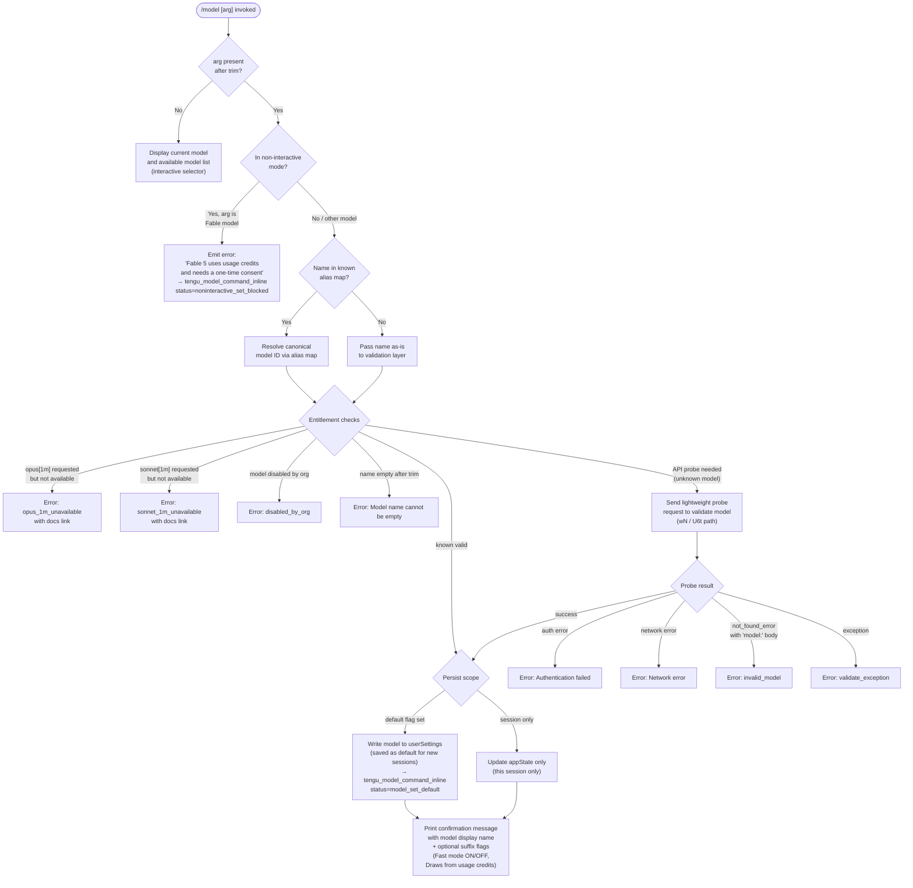

# `/model`

> Analysis basis: CC v2.1.191 bundle.js (AST extraction + Claude interpretation)
> Minimum version: v2.1.191

---

## Overview

The `/model` command sets the AI model used by Claude Code for the current session or persistently as the user default. It accepts a model identifier string, performs validation against available models (including API probe for unknown names), enforces account-level entitlements (e.g. 1M-context availability, Fable consent), and writes the resolved model into application state and/or persisted settings.

---

## Registration

| Field | Value |
|---|---|
| type | `local` |
| name | `model` |
| description | `Set the AI model for Claude Code` |
| argumentHint | `<model>` |
| supportsNonInteractive | `true` |
| module_id | `g5l` |
| load_inline | `true` |
| loc_byte | `12845311` |
| loc_byte_end | `12845485` |
| loc_line | `8633` |
| arbor_handler.name | `mkf` |
| arbor_handler.fqn | `claude-2.1.191::mkf` |
| arbor_handler.kind | `AsyncFunction` |
| arbor_handler.resolution_path | `module_id` |
| arbor_handler.n_hits | `0` |

Analysis basis: CC v2.1.191 bundle.js:+12845311

---

## Input Branching

The command has 5+ distinct paths depending on argument presence, model name validity, Fable consent state, entitlement checks, and interactive vs. non-interactive context.



Analysis basis: CC v2.1.191 bundle.js:+12807968, +12808051, +12808071, +12808116, +12808199, +12808254, +12808276, +12808498

---

## Behavioral Spec

### Entry Point — Handler `mkf`

```
async function modelCommandHandler(args, context):
    rawArg = args.trim()                         // +12807968

    // Inline non-interactive Fable consent gate
    if isFableModel(rawArg) AND context.isNonInteractive():
        emitTelemetry("tengu_model_command_inline",
                      {status: "noninteractive_set_blocked"})   // +12808298
        return error("Fable 5 uses usage credits and needs "    // +12808347
                     "a one-time consent · pick Fable from "
                     "/model in an interactive session to set it up")

    // Inline model command telemetry event
    emitTelemetry("tengu_model_command_inline", ...)            // +12808118

    // Alias expansion (gsm/gse lookup)
    if rawArg in knownAliasSet:                                 // +12807984
        resolvedName = expandAlias(rawArg)
    else:
        resolvedName = rawArg

    // Fetch current application state
    appState = context.getAppState()                            // +12808007

    // Entitlement & policy check
    result = checkModelSwitch(resolvedName, appState)           // $7n → +12808051
    if result.status != "ok":
        return displayError(result)

    // Validation (possibly involves API probe)
    validated = await validateModelName(resolvedName, appState) // RVt → +12808199
    if validated.error:
        return displayError(validated.error)

    // Fable consent flow (interactive only)
    consentResult = await handleFableConsent(resolvedName, context) // rJ → +12808254
    if consentResult.blocked:
        return displayError(consentResult.message)

    // Write and confirm
    await applyModelSelection(resolvedName, appState, context)  // F7n → +12808498
```

Analysis basis: CC v2.1.191 bundle.js:+12807968

---

### Sub-feature: Alias Expansion (`gse` / `gsm` lookup)

Short human-friendly aliases are mapped to canonical model IDs before any other processing. Known alias examples found in literals:

| Alias | Resolves toward |
|---|---|
| `sonnet` | current sonnet-4-x series |
| `haiku` | current haiku-4-x series |
| `opus` | current opus-4-x series |
| `best` | current best-tier model |
| `fable` | `claude-fable-5` |
| `opusplan` | Opus in plan mode, else Sonnet |
| `sonnet[1m]` | sonnet with 1M context window |
| `sonnet-4-6[1m]` | claude-sonnet-4-6 with 1M context |

Hyphen/underscore variant aliases also accepted (e.g. `fable-5` / `fable_5`, `opus-4-8` / `opus_4_8`, `sonnet-4-6` / `sonnet_4_6`, etc.).

Analysis basis: CC v2.1.191 bundle.js:+16668916, +9056210–+9056687, +2301667–+2301902

---

### Sub-feature: Entitlement & Policy Check (`$7n` → `RM` / `RVt`)

```
function checkModelSwitch(modelName, appState):
    // 1. Check org-level policy block
    if orgPolicyDenies(modelName):
        return {status: "denied_by_entitlement",     // +11326917
                reason: "not_allowed"}                // +11327098

    // 2. Opus 1M availability gate
    if isOpus1MVariant(modelName) AND NOT account.hasOpus1M():
        return {status: "opus_1m_unavailable",        // +11327245
                message: "Opus with 1M context is not available..."}

    // 3. Sonnet 1M availability gate
    if isSonnet1MVariant(modelName) AND NOT account.hasSonnet1M():
        return {status: "sonnet_1m_unavailable",      // +11327462
                message: "Sonnet 4.6 with 1M context is not available..."}

    // 4. Org-disabled model
    if orgDisabledModel(modelName):
        return {status: "disabled_by_org"}            // +11327730

    // 5. Fable availability / probe failure tracking
    // fable_unavailable, fable_probe_failed          // +11327981, +11328001

    return {status: "ok"}
```

Analysis basis: CC v2.1.191 bundle.js:+11326902, +11327213, +11327430, +11327661, +11327891

---

### Sub-feature: Model Name Validation with API Probe (`U6t` / `wN`)

```
async function validateModelName(modelName, appState):
    trimmed = modelName.trim()                       // +9054855
    if trimmed == "":
        return {error: "Model name cannot be empty"} // +9054892

    // Lower-case comparison for known-bad tiers
    lc = trimmed.toLowerCase()                       // +9055040
    if lc in rejectedTierList:                       // Yme.includes +9055059
        return {error: "..."}

    // Check probe cache before making network call
    if probeCache.has(trimmed):                      // o_o.has +9055161
        return probeCache.get(trimmed)

    // Perform API probe (lightweight "Hi" message)  // +9055325
    try:
        response = await apiCall(trimmed, "Hi")      // wN → +9055206
        probeCache.set(trimmed, {valid: true})        // o_o.set +9055369
        return {valid: true}
    catch authError:
        return {error: "Authentication failed. Please check your API credentials."} // +9055628
    catch networkError:
        return {error: "Network error. Please check your internet connection."}     // +9055730
    catch apiError:
        if apiError.type == "not_found_error"         // +9055849
           AND apiError.message.startsWith("model:"): // +9055931
            return {error: "invalid_model",
                    status: "model_validation"}        // +9055256
        return {error: "validate_exception"}           // +11328373
```

Analysis basis: CC v2.1.191 bundle.js:+9054855, +9055206, +9055256

---

### Sub-feature: Fable Consent Gate (`rJ` / `KUt`)

```
async function handleFableConsent(modelName, context):
    if NOT isFableModel(modelName):
        return {blocked: false}

    // In interactive mode — prompt for one-time consent
    consentAlreadyGiven = checkConsentFlag(context)    // model_fable_consent +12808276
    if consentAlreadyGiven:
        return {blocked: false}

    // Show interactive consent prompt (kle / WGd / jGd path)
    accepted = await showConsentPrompt()               // KUt → +11330153
    if NOT accepted:
        return {blocked: true, message: "...consent declined..."}

    return {blocked: false}
```

Analysis basis: CC v2.1.191 bundle.js:+12808254, +12808276

---

### Sub-feature: Apply Model Selection & Confirm (`F7n` / `kVt`)

```
async function applyModelSelection(modelName, appState, context):
    shouldPersist = context.flags.default OR context.isFirstUse()

    if shouldPersist:
        // Write to userSettings on disk
        await saveToUserSettings({model: modelName})  // kVt → uo path
        suffix = " and saved as your default for new sessions"  // +11328630
        emitTelemetry("model_set_default")            // +11328988
    else:
        // Update in-memory session state only
        appState.model = modelName
        suffix = " for this session only"             // +11328676

    displayName = resolveDisplayName(modelName)

    // Build confirmation suffix
    extraFlags = ""
    if hasFastMode(modelName):
        extraFlags += " · Fast mode ON"               // +11328794
    if drawsFromCredits(modelName):
        extraFlags += " · Draws from usage credits"   // +11328845

    // Print styled confirmation
    print(bold(displayName) + suffix + extraFlags)

    // If managed settings are in effect, show advisory
    if managedSettingsActive():
        print("Managed settings" + ...)               // +11329197
```

Analysis basis: CC v2.1.191 bundle.js:+11328477, +11328570, +11328619, +11328630, +11328676

---

### Sub-feature: Available Model List Display (no-arg path)

When invoked with no argument, the command builds and displays a list of available models for the user to choose from. The list is assembled via `RM` (model registry) and presented through the interactive selector component (`PDe` / `KLo` path). Known model identifiers in the registry at this version:

`claude-fable-5`, `claude-mythos-5`, `claude-opus-4-8`, `claude-opus-4-7`, `claude-opus-4-6`, `claude-opus-4-5`, `claude-opus-4-1`, `claude-opus-4-0`, `claude-sonnet-4-6`, `claude-sonnet-4-5`, `claude-sonnet-4-0`, `claude-haiku-4-5`, `claude-3-7-sonnet`, `claude-3-5-sonnet`, `claude-3-5-haiku`, `claude-3-opus`, `claude-3-sonnet`, `claude-3-haiku`

Display names are mapped (e.g. `claude-opus-4-0` → `"Opus 4"`, `claude-sonnet-4-6` → `"Sonnet 4.6"`, etc.).

Analysis basis: CC v2.1.191 bundle.js:+2300690–+2301274, +2300043

---

## State & Side Effects

| Item | Detail |
|---|---|
| Telemetry: `tengu_model_command_inline` | Fired on every invocation with arg; carries status codes (`model_set_default`, `noninteractive_set_blocked`, `model_switch`, `denied_by_entitlement`, etc.) — CC v2.1.191 bundle.js:+12808118 |
| Telemetry: `tengu_api_success` | Fired after successful API probe during model validation — CC v2.1.191 bundle.js:+8938998 |
| Telemetry: `tengu_config_lock_contention` | Fired if config file lock is slow to acquire during persistence — CC v2.1.191 bundle.js:+13865550 |
| Telemetry: `tengu_config_stale_write` | Fired on config stale-write detection — CC v2.1.191 bundle.js:+13865686 |
| Telemetry: `tengu_config_auto_repaired` | Fired if config auto-repair triggers — CC v2.1.191 bundle.js:+13866063 |
| Telemetry: `tengu_config_auth_loss_prevented` | Fired if write would have wiped auth from config — CC v2.1.191 bundle.js:+13866393 |
| Telemetry: `tengu_config_fallback_write` | Fired on fallback write path — CC v2.1.191 bundle.js:+13865166 |
| Telemetry: `tengu_feature_ok` / `tengu_feature_bad` / `tengu_feature_sad` | Feature health metrics emitted around model switch confirmation — CC v2.1.191 bundle.js:+1025725 |
| appState changes | `appState.model` updated to new canonical model ID for the active session |
| Persistent settings | When saving as default: writes `model` key to `~/.claude.json` (userSettings) via locked atomic write — CC v2.1.191 bundle.js:+13865277 |
| Probe cache | In-memory cache `o_o` keyed by model name string to avoid redundant API probes within session — CC v2.1.191 bundle.js:+9055161 |
| Fable consent flag | On accepted Fable consent, `model_fable_consent` flag persisted to settings — CC v2.1.191 bundle.js:+12808276 |
| Sound | None observed in depth-2 traversal |
| Hook registration | None observed in depth-2 traversal |

---

## Version History

| Version | Change |
|---|---|
| v2.1.191 | Initial analysis |

---

## Common Mistakes

1. **Using a short alias in non-interactive (`--print`) mode for Fable**: The command explicitly blocks `claude-fable-5` (and variants) in non-interactive mode because the one-time consent screen cannot be shown; use `/model fable` first in an interactive session.
2. **Expecting instant validation for unknown model names**: For any name not in the built-in registry, the command fires a real API probe request. On slow or restricted networks this adds latency and can return a `Network error` even if the model name is correct.
3. **Confusing session-only vs. persistent selection**: Without the default-persistence flag, the model change only applies to the current session. Reopening Claude Code reverts to the previously persisted model.
4. **Underscore vs. hyphen aliases**: Short aliases accept both forms (e.g. `sonnet_4_6` and `sonnet-4-6`), but the canonical IDs stored in config use hyphens. Passing an underscore form to another tool expecting the canonical ID will fail.
5. **Assuming 1M-context variants are universally available**: `sonnet[1m]` and `opus[1m]` aliases are gated on account entitlements; the command returns a specific error with a documentation link if the account is not provisioned for extended context.
6. **Omitting the argument expecting a simple status printout**: Invoking `/model` with no argument opens the interactive model picker — it does not silently print the current model and return in non-interactive mode.

---

## Appendix — Identifier Mapping

> For bundle debugging only. Identifiers change across versions.

| Identifier | Role |
|---|---|
| `mkf` | Main async handler for `/model` command (arbor_handler) |
| `e` | Top-level model-command execution function (called by `mkf`) |
| `L6o` | Conversation message truncation / context window helper |
| `gsm` | Map setter used in alias table construction |
| `Cs` | CLI error exit helper (emits `cli_error`, calls `process.exit`) |
| `har` | Unicode surrogate-pair / character-code helper |
| `hx` | Character slice / surrogate detection helper |
| `msm` | Auto-classifier input builder for model context |
| `ke` | JSON serialization utility wrapper |
| `wN` | Main API call / inference request dispatcher |
| `xf` | Request builder helper |
| `wt` | HTTP transport layer |
| `oW` | Anthropic SDK client factory / configuration builder |
| `mz` | Version/user-agent string builder |
| `p3r` | HTTP header parser |
| `Ks` | Background-context header helper |
| `Mz` | SDK metadata / error-report URL builder |
| `GPr` | URL encoding helper |
| `T` | Request header assembly function |
| `rt` | Boolean / string coercion helper |
| `Ng` | OAuth token refresh helper |
| `XKs` | Boolean coercion wrapper |
| `_y` | Auth credential resolver (ANTHROPIC_API_KEY / apiKeyHelper) |
| `_ud` | API key helper timeout wrapper |
| `Kdn` | Proxy auth helper dispatcher |
| `Iud` | HTTP response stream handler / request executor |
| `PH` | Mantle auth provider helper |
| `G2` | Cloud auth token retrieval |
| `fy` | Proxy configuration builder |
| `Tud` | Stream finalizer helper |
| `yud` | Provider-specific request adapter (anthropicAws / vertex / foundry / gateway / firstParty) |
| `SCe` | Session expiry / cloud gateway check |
| `Rdr` | Request retry / date timestamp helper |
| `pMt` | Authorization header normalizer |
| `dve` | SDK error logger |
| `BSn` | Provider-type selector (NI / Es / ao) |
| `D` | Response stream writer / supervisor |
| `x` | Request deduplication cache |
| `v` | Focus/blur-aware token refresh scheduler |
| `Ooe` | Provider prefix matcher (`application-inference-profile` check) |
| `nv` | Nested view / spinner helper |
| `yA` | Session-context assembler (profile-implicit / user_oauth) |
| `ACe` | WIF token exchange helper |
| `TZe` | WIF credentials resolver (fetches from HTTPS endpoint) |
| `I` | Token scroll/pagination helper |
| `h` | Side-query helper |
| `b2e` | Bedrock / model-capability check |
| `ao` | Model tier / application-inference-profile helper |
| `o1` | Mantle request helper |
| `lie` | Foundry resource name resolver |
| `$At` | Foundry auth token store |
| `vOr` | Foundry resource URL transformer |
| `_` | Active model list accessor |
| `a` | Model registry map reader |
| `CBp` | Request hash finder |
| `SHo` | SHA-256 hash builder for request deduplication |
| `Ghn` | User-agent / cache-control header builder |
| `ol` | String coercion helper |
| `_r` | React/Ink render helper |
| `uu` | Ink component mount helper |
| `$hn` | AsyncLocalStorage store accessor |
| `hCe` | Cache-control header builder |
| `aIn` | Render abort helper |
| `aje` | Main REPL thread message loop helper |
| `To` | Session context renderer |
| `dpr` | Debug/profiling helper |
| `nt` | Background worker dispatch helper |
| `ppr` | Message post-processor |
| `wD` | Request wrapper (C3r / A2e) |
| `C3r` | Request body renderer |
| `A2e` | Request metadata renderer |
| `L` | Background worker sweep / memory manager |
| `V` | Worker pool manager |
| `Nzt` | Memory pressure detector |
| `J8l` | Background retire helper |
| `I3e` | Cache file cleanup helper |
| `Le` | Tool error log helper |
| `U` | Active worker set |
| `Gn` | Worker task launcher |
| `W` | Ink component / UI primitive |
| `j` | Worker instance |
| `Xer` | Worker upgrade-attach helper |
| `q` | Keyboard-event worker |
| `ZVa` | Structured-output schema helper |
| `sp` | String replace / sanitize helper |
| `XSn` | Temperature / model-setting applicator |
| `av` | Message map helper |
| `Txe` | Tool-use message assembler |
| `P4` | Random bytes / tool ID generator |
| `Sc` | Tool scheduler |
| `etn` | Message stack push helper |
| `Qen` | Message type validator |
| `iD` | Structured clone wrapper |
| `u7e` | Message stack pop helper |
| `Zen` | Text replacement helper |
| `Ve` | Ink render root |
| `eze` | Ink element factory |
| `LOr` | API response header extractor |
| `l7s` | Header field parser |
| `wOr` | Tool-availability cache |
| `mbe` | Token count helper |
| `Tr` | Render wrapper |
| `lh` | Ink box element |
| `Oo` | Ink text element |
| `H1t` | Config persistence orchestrator |
| `v3i` | Config read/write with rotation helper |
| `Rot` | Config write helper |
| `h1t` | Config lock step helper |
| `NF` | Agent-type resolver (builtin / custom / general) |
| `nOd` | Agent prefix stripper |
| `xD` | Repl-main-thread type checker |
| `kAt` | Cache-control flag setter |
| `S4` | Model capability check wrapper |
| `ev` | Model feature flag evaluator |
| `PPr` | Provider-specific model config builder |
| `zp` | Model config struct factory |
| `usm` | Context summary builder |
| `csm` | Message map for context summary |
| `hsm` | Display string assembler |
| `M6n` | Model finder in registry |
| `cSt` | Context-tip status renderer |
| `Pe` | Ink passive element |
| `Re` | Response renderer |
| `D6n` | Schema-safe parse helper |
| `we` | Warning/info renderer |
| `Ae` | String coercion output helper |
| `$7n` | Model-switch entitlement check orchestrator |
| `RM` | Model registry and config loader |
| `l0t` | Model registry initializer |
| `bp` | Model display-name / property builder |
| `Qo` | Canonical model name normalizer |
| `Fw` | Full model metadata resolver |
| `OPr` | Model object builder |
| `Phn` | Model policy / admin-mapping resolver |
| `Dhn` | Model fallback chain builder |
| `Dd` | Config hash helper |
| `RVt` | Model validation + entitlement enforcement orchestrator |
| `NFe` | Model name normalizer (trim / lowercase) |
| `il` | String replace helper |
| `Dk` | Model tier membership checker |
| `Xme` | Model availability matrix builder |
| `Vqu` | Model set tracker |
| `Wqu` | Model set add helper |
| `kPr` | Model permission resolver |
| `kt` | Telemetry event emitter |
| `Na` | Model display-config builder (full metadata) |
| `Nwt` | Settings loader |
| `mgs` | Settings filter |
| `fgs` | Settings file reader |
| `Uwt` | Settings aggregator |
| `JVo` | Settings format version checker |
| `Rse` | Settings schema validator |
| `Dln` | Settings merge helper |
| `WTe` | Remote managed settings loader |
| `z2` | Settings store builder |
| `xse` | Settings path helper |
| `Dwt` | Settings write helper |
| `QVo` | Settings cleanup helper |
| `l` | Rate-limit / request-log helper |
| `rGl` | Request log writer |
| `OFe` | Model exclusion list checker |
| `xhn` | Model alias chain resolver |
| `r0t` | Model display-name formatter |
| `GKs` | Model entry enumerator |
| `In` | Settings index resolver |
| `vln` | Settings virtual-layer resolver |
| `PQe` | Settings entry provider |
| `Rr` | Settings value reader |
| `BKs` | Model block-list index resolver |
| `qqu` | Model tier query helper |
| `FKs` | Model tier index finder |
| `Kqu` | Model tier prefix matcher |
| `$Ks` | Tier prefix start-checker |
| `zLo` | Sonnet-1M entitlement gater |
| `fte` | Entitlement feature-flag checker |
| `ege` | Ink text renderer |
| `y7i` | Entitlement telemetry emitter |
| `_b` | Entitlement error display helper |
| `nge` | Entitlement error renderer |
| `wi` | Ink styled text component |
| `YLo` | Sonnet-4-6-1M entitlement gater |
| `YHe` | Sonnet variant entitlement helper |
| `pCe` | Model object constructor (full property set) |
| `l_` | Model ID include/replace helper |
| `Qme` | Model capabilities array builder |
| `iie` | Model inner-config builder |
| `Jme` | Model feature includes checker |
| `pz` | Model 1M-context suffix helper |
| `Mhn` | Model extended-config builder |
| `dZe` | Extended-config feature includes checker |
| `uZe` | Model uZe config extension |
| `U6t` | Model validation entry point (trim → probe → cache) |
| `O3p` | Probe response parser |
| `N3p` | Probe error classifier |
| `BAl` | Model lowercase tier matcher |
| `VRe` | API bootstrap model discovery orchestrator |
| `hfo` | Model list fetch helper |
| `U2` | Auth state checker for bootstrap |
| `Es` | Model list entry builder |
| `UDp` | Gateway /v1/models fetcher |
| `$Dp` | Gateway model fetch inner helper |
| `Yi` | Essential-traffic gate for bootstrap |
| `K2a` | Bootstrap auth header assembler |
| `Lt` | Bootstrap result renderer |
| `xs` | OAuth endpoint validator |
| `rv` | Model list includes helper |
| `uR` | API error classifier (401/403/revoked) |
| `q2a` | Bootstrap cache hash helper |
| `$Tn` | Cache fingerprint builder |
| `gn` | Global config saver |
| `U7t` | Config file writer with lock and rotation |
| `dOe` | Config directory initializer |
| `v2o` | Config entry enumerator |
| `O7t` | Config timestamp helper |
| `P7t` | Config metadata builder |
| `nEt` | Config new-entry helper |
| `Xnr` | Config rotation helper |
| `rvi` | Config entry transformer |
| `nvi` | Config entry normalizer |
| `t_` | Config post-write helper |
| `rJ` | Fable consent check + interactive flow launcher |
| `fA` | Model consent flag accessor |
| `Gj` | Consent flag reader |
| `KUt` | Interactive consent prompt orchestrator |
| `kle` | Consent prompt display helper |
| `WGd` | Consent prompt enterprise-mode handler |
| `jGd` | Consent prompt rendering helper |
| `UJr` | Consent prompt input handler |
| `qUt` | Consent prompt state machine |
| `Exe` | Consent prompt execution helper |
| `WF` | Consent prompt form renderer |
| `XHe` | Consent prompt result handler |
| `F7n` | Model confirmation message builder and appState writer |
| `Roe` | Model Roe check helper |
| `kVt` | Persistent-save orchestrator (calls `uo`) |
| `uo` | Settings write dispatcher |
| `sg` | Settings section writer |
| `Gt` | File system Gt helper |
| `EIr` | Settings EIr loader |
| `VC` | Settings validation chain |
| `vn` | fs path normalizer |
| `wTr` | Settings timestamp recorder |
| `GUe` | Settings GUe write helper |
| `Rvt` | Atomic file write with temp + rename |
| `kH` | Settings cache clear helper |
| `Yps` | Gitignore / file-tracking helper |
| `c4` | `.claude/settings.json` path builder |
| `Hr` | Process uid helper |
| `vj` | Settings load-from-disk helper |
| `Yl` | Ink dim-text renderer |
| `uCe` | uCe model property helper |
| `Dm` | Model Dm resolver |
| `PDe` | Interactive model list renderer |
| `rH` | Model rH display helper |
| `nH` | Model nH name helper |
| `KLo` | Interactive model list builder (with managed-settings note) |
| `_me` | Model list entry builder |
| `vk` | Model visibility tracker |
| `fz` | Model fz entry builder |

---

Note: index built via Arbor fallback; some signals (telemetry, literals) may be missing — see arbor-fallback.js.