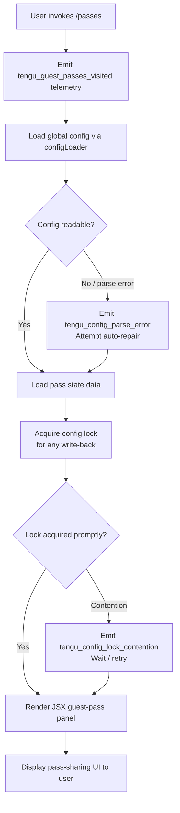

# `/passes`

> Analysis basis: CC v2.1.191 bundle.js (AST extraction + Claude interpretation)
> Minimum version: v2.1.191

---

## Overview

The `/passes` command allows a Claude Code user to share a free week of Claude Code access with friends by displaying a guest-pass management UI rendered as a JSX component. The command is a `local-jsx` type, meaning it renders an interactive React/JSX panel rather than issuing a text prompt to the agent. On invocation it fires a telemetry event and then presents the pass-sharing interface.

---

## Registration

| Field | Value |
|---|---|
| type | `local-jsx` |
| name | `passes` |
| description | `Share a free week of Claude Code with friends` |
| loc_byte | `12588080` |
| loc_byte_end | `12588402` |
| loc_line | `8399` |
| isHidden | `null` (not hidden) |
| module_id | `P2l` |
| load_inline | `true` |
| arbor_handler.name | `XLf` |
| arbor_handler.fqn | `claude-2.1.191::XLf` |
| arbor_handler.kind | `AsyncFunction` |
| arbor_handler.resolution_path | `module_id` |
| arbor_handler.n_hits | `2` |

Analysis basis: CC v2.1.191 bundle.js:+12588080

---

## Input Branching

The handler's top-level flow is essentially linear — it fires telemetry, invokes the config-loading pipeline, and then renders a JSX view. There are no user-supplied arguments that branch differently. Two branches occur internally based on config and pass-state data, but from the user perspective the command always proceeds to rendering.

1. User types `/passes`.
2. Handler `XLf` (AsyncFunction) is invoked.
3. Telemetry event `tengu_guest_passes_visited` is emitted.
4. Config subsystem is consulted (via `configLoader` → `saveConfigWithLock` pipeline).
5. Pass-state data is loaded or derived.
6. JSX component is rendered via `O2l.jsx`, displaying available passes.



Analysis basis: CC v2.1.191 bundle.js:+12587773, +12587807, +12587813, +12587911, +12587962

---

## Behavioral Spec

### Handler Entry Point (`XLf`)

```
async function passesCommandHandler(context):
    emitTelemetry("tengu_guest_passes_visited")

    configData   = await loadConfig(context)          // via configLoader
    passState    = await loadPassState(configData)    // via passStateLoader
    renderOutput = renderJSX(GuestPassPanel, passState)

    return renderOutput
```

Analysis basis: CC v2.1.191 bundle.js:+12587773, +12587807, +12587813, +12587962

---

### Config Loading (`configLoader`)

The config subsystem used here is the same global-config pipeline shared across multiple commands.

```
async function configLoader(context):
    acquireLock()                      // saveConfigWithLock entry
    rawBytes = filesystem.readFileSync(configPath, "utf-8")

    try:
        parsed = JSON.parse(rawBytes)
    catch ParseError:
        emitTelemetry("tengu_config_parse_error")
        // Auto-repair: fall back to cached in-memory config
        // See GH #3117 — avoids wiping ~/.claude.json
        parsed = cachedConfig
        emitTelemetry("tengu_config_auto_repaired")

    if parsed is missing auth fields that cache has:
        emitTelemetry("tengu_config_auth_loss_prevented")
        // Refuse to write; preserve cached auth
        return cachedConfig

    return parsed
```

Error constant: `"Config accessed before allowed."` — thrown when config is read before the subsystem is initialised (bundle.js:+13867869).

Config file guard note: `"saveConfigWithLock: re-read config is missing auth that cache has; refusing to write to avoid wiping ~/.claude.json. See GH #3117."` (bundle.js:+13866241)

Analysis basis: CC v2.1.191 bundle.js:+13867863, +13867869, +13867925, +13867972, +13869283

---

### Config Lock Acquisition (`saveConfigWithLock`)

```
async function saveConfigWithLock(writeFn):
    startTime = Date.now()
    lock = acquireFileLock(configPath)

    if (Date.now() - startTime) > LOCK_SLOW_THRESHOLD:
        emitTelemetry("tengu_config_lock_contention")
        log("Lock acquisition took longer than expected - another Claude instance may be running")

    result = writeFn(lock)

    if staleWriteDetected:
        emitTelemetry("tengu_config_stale_write")

    releaseLock(lock)
    return result
```

Lock warning message: `"Lock acquisition took longer than expected - another Claude instance may be running"` (bundle.js:+13865461).

Analysis basis: CC v2.1.191 bundle.js:+13864203, +13865461, +13865550, +13865686

---

### Pass State Loader (`passStateLoader`)

```
async function passStateLoader(config):
    passDir      = path.join(configBaseDir, "backups")   // "backups" literal at +13867437
    ensureDir(passDir)

    entries      = filesystem.readdirStringSync(passDir)
    validPasses  = entries
                     .filter(e => !e.startsWith(".backup."))  // filter sentinel files
                     .map(parseSinglePass)

    return {
        passes    : validPasses,
        timestamp : Date.now(),
    }
```

Backup sentinel string: `".backup."` (bundle.js:+13866715).
Maximum backup copies retained: `5` (bundle.js:+13866854).
File encoding: `"utf-8"` (bundle.js:+13867952).

Analysis basis: CC v2.1.191 bundle.js:+13867437, +13867510, +13867545, +13867952, +13866715, +13866854

---

### JSX Render (`guestPassPanel`)

```
function renderGuestPassPanel(passState):
    return jsx(GuestPassPanelComponent, {
        passes    : passState.passes,
        timestamp : passState.timestamp,
        onAction  : handlePassAction,
    })
```

The JSX call is made via `O2l.jsx` at bundle.js:+12587962. The component is a local-jsx type, so output is rendered directly in the CLI UI layer rather than being sent to the AI model.

Analysis basis: CC v2.1.191 bundle.js:+12587962

---

### Filesystem Backup / Copy Utilities

The call graph reaches deep filesystem helpers used when passes are copied or written:

```
function atomicFileWrite(targetPath, content, permissions):
    // Uses temp-file + rename pattern for atomicity
    tmpPath = targetPath + "." + randomHex(6) + ".tmp"
    writeFileSync(tmpPath, content)
    fchmodSync(tmpPath, permissions)    // preserve original permissions
    fsyncSync(tmpPath)                  // flush to disk
    renameSync(tmpPath, targetPath)     // atomic swap

    // Error codes handled: ELOOP, ENOTDIR, EINVAL, ENOTSUP,
    //                      EPERM, ENOSYS, EACCES, EEXIST
```

Random bytes for temp suffix: 6 bytes → 12 hex chars (bundle.js:+1101340, +1101356, +1101368).
Permission constant: `384` (octal `0600`) applied to temp file (bundle.js:+13867136).
Log message on permission application: `"Applied original permissions to temp file"` (bundle.js:+1101871).

Analysis basis: CC v2.1.191 bundle.js:+1101340, +1101512, +1101788, +1101850, +1101929, +1101997, +1102328, +13867136

---

### Config Status Enum

The config subsystem tracks an installation/auth status using the following string enum values found in the implementation:

| Value | Meaning |
|---|---|
| `"unknown"` | Status not yet determined |
| `"local"` | Local-only installation |
| `"migrated"` | Config migrated from earlier version |
| `"native"` | Native installation |
| `"installed"` | Fully installed |
| `"disabled"` | Feature or auth disabled |
| `"enabled"` | Feature or auth enabled |
| `"no_permissions"` | Insufficient permissions |
| `"not_configured"` | Not yet configured |
| `"global"` | Global-scope config |

Analysis basis: CC v2.1.191 bundle.js:+13862793, +13862855, +13862868, +13862886, +13862900, +13862919, +13862933, +13862945, +13862959, +13862980, +13862999

---

## State & Side Effects

| Item | Detail |
|---|---|
| Telemetry — `tengu_guest_passes_visited` | Fired immediately on command invocation (bundle.js:+12587913) |
| Telemetry — `tengu_config_parse_error` | Fired when `~/.claude.json` cannot be parsed (bundle.js:+13869283) |
| Telemetry — `tengu_config_lock_contention` | Fired when config file lock is slow to acquire (bundle.js:+13865550) |
| Telemetry — `tengu_config_stale_write` | Fired when a stale write is detected after lock (bundle.js:+13865686) |
| Telemetry — `tengu_config_auto_repaired` | Fired when config auto-repair from cache succeeds (bundle.js:+13866063) |
| Telemetry — `tengu_config_auth_loss_prevented` | Fired when a write that would erase auth is blocked (bundle.js:+13866393) |
| Telemetry — `tengu_config_fallback_write` | Fired when config falls back to a global write path (bundle.js:+13865166) |
| Telemetry — `tengu_daemon_yield` | Fired if background daemon yields to foreground during pass operation (bundle.js:+17391071) |
| Telemetry — `tengu_daemon_control` | Fired on daemon start/stop control events (bundle.js:+17408260) |
| Config file writes | `saveConfigWithLock` may write back to `~/.claude.json`; blocked if auth would be lost |
| Filesystem — pass directory | Reads/writes pass files under config backup directory; creates directory if absent |
| Filesystem — atomic writes | Uses temp-file + rename + fsync pattern for all file mutations |
| Hook registration | `xqo.register` is called via `_i` during config watcher setup (bundle.js:+67562) |
| File watcher | `Tps.watchFile` is registered during config init; `_Xl.unwatchFile` tears it down (bundle.js:+1144855, +13863952) |
| appState changes | Pass state and config data updated in memory; no direct UI store mutation observed at depth ≤ 2 |
| Sound | None observed |

---

## Version History

| Version | Change |
|---|---|
| v2.1.191 | Initial analysis |

---

## Common Mistakes

1. **Expecting a text/AI response**: `/passes` is a `local-jsx` command. It renders a UI panel directly and does not send any prompt to the Claude model. No AI-generated text will appear.
2. **Running while another Claude instance holds the config lock**: If a second Claude Code process is active, the command may stall on lock acquisition and log `"Lock acquisition took longer than expected - another Claude instance may be running"`. Closing the other instance resolves this.
3. **Corrupted `~/.claude.json`**: If the config file is not valid JSON, the command will attempt auto-repair from the in-memory cache. If the cache is also absent (e.g. fresh process), the command may fail to load pass data. Manual repair of `~/.claude.json` may be required.
4. **Auth fields missing after external edit**: If `~/.claude.json` is hand-edited and auth keys are removed, the subsystem will refuse to write the modified file back (to prevent losing credentials) and emit `tengu_config_auth_loss_prevented`. Passes UI may still display but save operations will be blocked.
5. **Pass directory permissions**: The backup/pass directory requires `0600` permissions on individual files. If permissions differ, the atomic-write step will attempt to replicate original permissions; failures here are non-fatal but are logged.

---

## Appendix — Identifier Mapping

> For bundle debugging only. Identifiers change across versions.

| Identifier | Role |
|---|---|
| `XLf` | Main async handler for `/passes` command |
| `kt` | Config load/save orchestrator |
| `Gt` | General-purpose guard / assertion utility |
| `C2o` | Config context object or accessor |
| `tEt` | Config file read-and-parse function |
| `Cs` | CLI error exit helper (calls `process.exit`) |
| `$t` | JSON parse wrapper |
| `n4` | String prefix check helper (`startsWith` + `slice`) |
| `dn` | Logging / debug output utility |
| `L2o` | Directory listing and backup file locator |
| `R2o` | Config base path resolver (`DS.join` + `Zn`) |
| `T` | Message/content formatter (handles `debug`, `toUpperCase`, `trim`) |
| `wNc` | Content block constructor |
| `ke` | JSON stringify wrapper |
| `Dc` | String redaction/sanitiser (`[REDACTED]`) |
| `a7e` | Auxiliary string processor |
| `kNc` | HTTP request builder (uses `Buffer.byteLength`, `omr`, `rtn.then`) |
| `W` | React/JSX render or UI update dispatcher |
| `K9f` | File watcher and config-change subscriber |
| `$vt` | File watch registration helper (`Tps.watchFile`) |
| `Le` | Auth token / credential loader |
| `Hpe` | Config change notification handler |
| `_i` | Hook/event registrar (`xqo.register`) |
| `cQn` | Secondary config accessor called from handler |
| `Sc` | Compound config + lock initialiser |
| `_y` | Auth provider / profile resolver |
| `ad` | Runtime identifier / git bare-flag helper |
| `yA` | OAuth profile builder |
| `jl` | First-party auth classifier |
| `uT` | Token/credential holder or context passer |
| `iH` | Full authentication orchestrator |
| `CMt` | Config mutation helper |
| `ltt` | Config read-only accessor |
| `gn` | Guest-pass state machine / pass manager |
| `U7t` | Config save-with-lock implementation |
| `s` | Async resource-set manager (add/delete/finally) |
| `i` | Connection/stream closer |
| `kzs` | Object-assign-based config merger |
| `hOr` | Config merge sub-helper |
| `nEt` | New-pass creation helper |
| `w` | Pass entry or filename filter |
| `y` | Pass list processor / splitter |
| `PGe` | Teammate-mailbox mark-as-read handler |
| `I` | Scroll/selection index calculator |
| `A` | UI action dispatcher |
| `Rvt` | Atomic file write (temp+rename+fsync) |
| `jd` | Realpath resolver |
| `u` | Daemon state object |
| `vn` | Error-code logger |
| `hXe` | Fallback write error handler |
| `ius` | `Object.defineProperty` wrapper for module exports |
| `dOe` | Pass data deserialiser |
| `v2o` | Object-entries iterator for pass map |
| `O7t` | Timestamp recorder (`Date.now`) |
| `P7t` | Pass-state initialiser |
| `Xnr` | Pass file copy/sync utility |
| `Pe` | Promise/async micro-utility |
| `eze` | Base async primitive |

Note: index built via Arbor fallback; some signals (telemetry, literals) may be missing — see arbor-fallback.js.