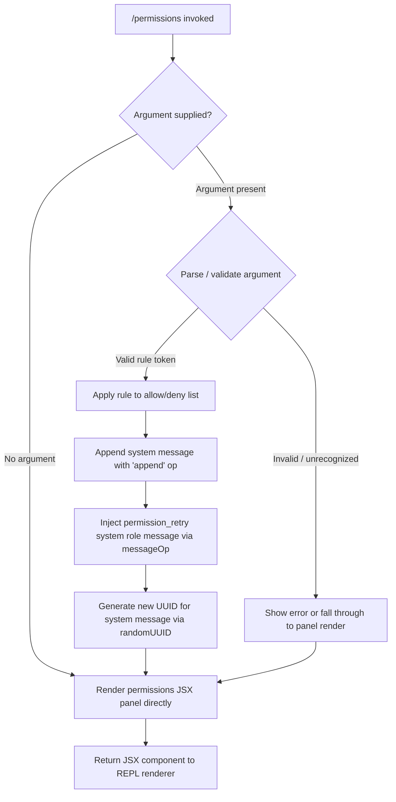

# `/permissions`

> Analysis basis: CC v2.1.191 bundle.js (AST extraction + Claude interpretation)
> Minimum version: v2.1.191

---

## Overview

The `/permissions` command (also accessible as `/allowed-tools`) presents an interactive JSX-rendered panel for managing tool permission rules within the current Claude Code session. It allows the user to view, add, and remove entries from both the allow-list and deny-list that govern which tools the agent may invoke without additional prompts. Internally it appends a system-role message to the conversation and renders a dedicated UI component to drive the permission workflow.

---

## Registration

| Field | Value |
|---|---|
| type | `local-jsx` |
| name | `permissions` |
| description | `Manage allow and deny tool permission rules` |
| aliases | `["allowed-tools"]` |
| module_id | `f2l` |
| load_inline | `true` |
| loc_byte | `12574420` |
| loc_byte_end | `12574592` |
| loc_line | `8399` |
| arbor_handler.name | `NLf` |
| arbor_handler.fqn | `claude-2.1.191::NLf` |
| arbor_handler.kind | `AsyncFunction` |
| arbor_handler.resolution_path | `module_id` |
| arbor_handler.n_hits | `0` |

Analysis basis: CC v2.1.191 bundle.js:+12574420

---

## Input Branching

The handler exhibits three distinct execution paths based on the presence and nature of the user-supplied argument, combined with a secondary branch that determines whether to inject a `permission_retry` system message or simply render the UI component directly.



Analysis basis: CC v2.1.191 bundle.js:+12574249 (JSX render call), +12574292 (`applyMessageOp`), +12574334 (`h2l` rule helper), +13804730 (`permission_retry` literal), +13804857 (`randomUUID`)

---

## Behavioral Spec

### Top-Level Handler — `permissionsCommandHandler` (`NLf`)

The handler is an `AsyncFunction` resolved by Arbor via the `module_id` path (`f2l`).

```
async function permissionsCommandHandler(args, appState):
    if args contains a rule specification:
        updatedRules = applyPermissionRules(args, appState.currentRules)
        appendSystemMessage(appState, {
            role: "system",
            type: "permission_retry",
            content: buildRetryMessage(updatedRules)
        })
        newMsgId = generateRandomUUID()   // crypto.randomUUID()
        store new message with newMsgId
    return renderPermissionsPanel(appState)  // returns JSX element
```

Analysis basis: CC v2.1.191 bundle.js:+12574249, +12574292, +12574334, +13804857

---

### Rule Application — `applyPermissionRules` (`h2l`)

This helper processes the parsed rule tokens and mutates the in-memory allow/deny lists. It also generates a UUID for the resulting system message entry.

```
function applyPermissionRules(ruleTokens, currentRules):
    joined = ruleTokens.join(" ")       // bundle.js:+13804768
    newId  = crypto.randomUUID()        // bundle.js:+13804857
    for each token in ruleTokens:
        if token starts with "-":
            add to denyList
        else:
            add to allowList
    return { allowList, denyList, messageId: newId }
```

Analysis basis: CC v2.1.191 bundle.js:+13804768, +13804857

---

### Message Operation — `appendMessageOp` (`t.applyMessageOp`)

When a rule change occurs, the handler calls the conversation state's `applyMessageOp` with an `"append"` operation to insert a new system-role message of sub-type `permission_retry`.

```
function appendPermissionMessage(conversationState, ruleResult):
    op = {
        kind:    "append",          // bundle.js:+12574315
        role:    "system",          // bundle.js:+13804713
        subtype: "permission_retry",// bundle.js:+13804730
        id:      ruleResult.messageId,
        content: ruleResult.summary
    }
    conversationState.applyMessageOp(op)
```

Analysis basis: CC v2.1.191 bundle.js:+12574292, +12574315, +13804713, +13804730

---

### Context-Tip Classifier Side Path — `contextTipClassifier` (`usm` / `csm`)

The call graph reveals that the permissions handler participates in a broader side-query pipeline (`wN`) which invokes a context-tip classification routine. This routine:

1. Sends a `side_query` (literal at bundle.js:+8937327) with a compact conversation summary (max 512 tokens, bundle.js:+16671099) to a `context_tip_classifier` endpoint (bundle.js:+16671138).
2. Expects a structured output (literal `"structured_outputs"` at bundle.js:+8937455) response.
3. Classifies the outcome as one of: `tip`, `tip_ineligible`, `no_tip`, or `none` (bundle.js:+16671782, +16671788, +16671805, +16671838).
4. Emits a `tengu_context_tip_classifier_outcome` telemetry event on completion (bundle.js:+16672225).

```
async function runContextTipClassifier(conversationSnapshot):
    compactSummary = buildCompactSummary(conversationSnapshot, maxTokens=512)
    response = await sideQuery({
        type: "context_tip_classifier",
        input: compactSummary,
        useStructuredOutputs: true
    })
    if response has no tool_use block:
        log("[context-tips] no tool_use block in response")
        emit("tips_context_classify_no_tool_use")
        return "no_tip"
    parsed = schema.safeParse(response.tool_use)
    if parsed fails:
        log("[context-tips] response failed schema parse")
        emit("tips_context_classify_parse_failed")
        return "no_tip"
    emit("tengu_context_tip_classifier_outcome", { outcome: parsed.result })
    return parsed.result   // one of: tip | tip_ineligible | no_tip | none
```

Analysis basis: CC v2.1.191 bundle.js:+16671099, +16671138, +16671216, +16671277, +16671339, +16671363, +16671438, +16671584, +16671782, +16672143, +16672225

---

### Conversation Compactor — `buildCompactConversation` (`L6o`)

Used to prepare a trimmed message sequence for the classifier side-query. Key constants:

- Sliding window: last **30** messages (bundle.js:+16668949)
- Per-tool-result text truncation threshold: **1000** characters (bundle.js:+16669144)
- Tool-use display cap: **300** characters per block (bundle.js:+16669651)
- Column padding width: **2** spaces (`"  "` at bundle.js:+17397162); column width **1024** (bundle.js:+17267676)

```
function buildCompactConversation(messages):
    window = messages.slice(-30)               // last 30 messages
    result = []
    for each msg in window:
        if msg.role == "user":
            result.push({ role: "user", ... })
        elif msg.role == "assistant":
            result.push({ role: "assistant", ... })
        elif msg.type == "tool_result":
            text = truncate(msg.content, 1000) // cap at 1000 chars
        elif msg.type == "tool_use":
            text = truncate(msg.input, 300)    // cap at 300 chars
            if error: append " (error)"        // bundle.js:+16669486
    return result
```

Analysis basis: CC v2.1.191 bundle.js:+16668940, +16668949, +16668982, +16668999, +16669144, +16669206, +16669266, +16669446, +16669486, +16669651, +16669676

---

### API Side-Query Pipeline — `sideQueryDispatcher` (`wN`)

The permissions command triggers a side-query call when context classification is needed. The pipeline:

1. Checks model compatibility (`claude-3-`, `claude-opus-4-0`, `claude-sonnet-4-0`, and newer variants: `claude-opus-4-1/4-5/4-6`, `claude-sonnet-4-5/4-6`, `claude-haiku-4-5`) (bundle.js:+3047495–+3047850).
2. Hashes a cache key via SHA-256 (bundle.js:+8936332) using hex encoding (bundle.js:+8936359) with a 3-character prefix (bundle.js:+8936374).
3. Enforces a prompt-cache TTL of **`"1h"`** (bundle.js:+8938216).
4. Limits retry depth to **2** attempts (bundle.js:+8937154).
5. Marks the sub-call as `"side_query"` context (bundle.js:+8937327).
6. Caps parallel requests with `Math.min` / `Math.max` guards.
7. Records `tengu_lone_surrogate_sanitized` if the response text required surrogate-pair sanitization (bundle.js:+8938694).
8. Records `tengu_api_success` on a clean API round-trip (bundle.js:+8938998).

```
async function sideQueryDispatcher(payload, appState):
    if not modelSupportsStructuredOutputs(appState.model):
        return null
    cacheKey = sha256(payload.input).slice(0, 3)
    headers = buildRequestHeaders(appState)   // includes x-app, User-Agent, session IDs, etc.
    attempt = 0
    while attempt < MAX_RETRIES (2):
        response = await globalThis.fetch(endpoint, { headers, body: payload })
        if lone surrogates detected in response:
            sanitize(response)
            emit("tengu_lone_surrogate_sanitized")
        if success:
            emit("tengu_api_success")
            return response
        attempt++
    return null
```

Analysis basis: CC v2.1.191 bundle.js:+8937154, +8937282, +8937295, +8937327, +8937388, +8937420, +8937429, +8937455, +8937484, +8937499, +8937516, +8937525, +8938694, +8938970, +8938983, +8938998

---

### Feature Flag Telemetry — `featureFlagReporter` (`we` / `Re`)

Two telemetry probes fire during the permissions session to track feature flag state:

- `tengu_feature_ok` — the feature flag evaluated successfully (bundle.js:+1025725).
- `tengu_feature_bad` — the feature flag evaluation encountered an error (bundle.js:+1025792).

Analysis basis: CC v2.1.191 bundle.js:+1025725, +1025792

---

## State & Side Effects

| Item | Detail |
|---|---|
| Telemetry — `tengu_prompt_cache_1h_config` | Fired when the `"1h"` prompt-cache TTL is applied to a side-query request (bundle.js:+13616098) |
| Telemetry — `tengu_lone_surrogate_sanitized` | Fired when a lone surrogate pair is detected and sanitized in an API response (bundle.js:+8938694) |
| Telemetry — `tengu_api_success` | Fired on a successful API round-trip within the side-query path (bundle.js:+8938998) |
| Telemetry — `tengu_context_tip_classifier_outcome` | Fired with the classifier result (`tip`, `tip_ineligible`, `no_tip`, `none`) after classification (bundle.js:+16672225) |
| Telemetry — `tengu_feature_ok` | Fired when a feature flag check succeeds (bundle.js:+1025725) |
| Telemetry — `tengu_feature_bad` | Fired when a feature flag check fails (bundle.js:+1025792) |
| Telemetry — `tengu_bg_retire_pinned_low_mem` | Background worker lifecycle event fired under low-memory conditions during permission session (bundle.js:+17375231) |
| Telemetry — `tengu_bg_prewarm_per_sweep` | Background worker pre-warm event fired per sweep cycle (bundle.js:+17375352) |
| Conversation state mutation | A new system message of sub-type `permission_retry` is appended via `applyMessageOp("append")` when rules change (bundle.js:+12574292, +12574315) |
| UUID generation | `crypto.randomUUID()` is called to assign an ID to every newly appended permission system message (bundle.js:+13804857) |
| JSX render | Returns a `local-jsx` component (`m2l.jsx`, bundle.js:+12574249) to the REPL renderer; no direct stdout/stderr side effect |
| Allow/Deny list mutation | The in-memory tool permission lists are mutated by `applyPermissionRules` (`h2l`); changes persist for the lifetime of the session |
| Hook registration | <!-- TODO: not found in depth-2 traversal; needs --depth 4 --> |
| Sound | None observed in traversal |

---

## Version History

| Version | Change |
|---|---|
| v2.1.191 | Initial analysis |

---

## Common Mistakes

1. **Using `/permissions` expecting persistent cross-session rules** — allow/deny rules set through this command are session-scoped. They are not written to a config file automatically; users who want permanent rules must edit their Claude Code configuration directly.
2. **Confusing `/permissions` with `/allowed-tools`** — both aliases invoke the same handler (`NLf`). There is no behavioral difference; use whichever is more memorable.
3. **Supplying malformed rule tokens** — if the argument cannot be parsed as a valid tool rule specification, the handler falls through to the UI panel render without applying changes and without an explicit error message in all paths. Verify the tool name syntax before invoking.
4. **Expecting the command to work identically across all model variants** — the context-tip classifier side-query is gated on model compatibility. Older `claude-3-*` snapshots and newer `claude-opus-4-*` / `claude-sonnet-4-*` / `claude-haiku-4-*` variants have different side-query support; on unsupported models the classifier path is skipped silently.
5. **Assuming rule changes are reflected immediately in ongoing tool calls** — the `permission_retry` system message is appended to the conversation, but any in-flight tool invocation that was already past the permission check will not be affected.

---

## Appendix — Identifier Mapping

> For bundle debugging only. Identifiers change across versions.

| Identifier | Role |
|---|---|
| `NLf` | Top-level permissions command handler (`AsyncFunction`) |
| `h2l` | Permission rule application helper (processes allow/deny tokens, generates UUID) |
| `e` | Module-level context-tip classifier orchestrator |
| `L6o` | Compact conversation window builder (last-30 message slicer) |
| `gsm` | Conversation state setter used inside compact builder |
| `har` | Auxiliary rule/header formatter within compact pipeline |
| `msm` | Auto-classifier input transformer (`toAutoClassifierInput` caller) |
| `wN` | Side-query API dispatcher (main API call orchestrator) |
| `xf` | API request initializer (calls `wt`) |
| `oW` | HTTP request builder (sets all request headers: `x-app`, `User-Agent`, session IDs, auth) |
| `b2e` | Model compatibility checker for structured outputs |
| `lie` | OAuth/auth token lookup helper |
| `CBp` | Cache-key finder (searches allow/deny entry arrays) |
| `SHo` | SHA-256 cache-key hasher (`JVa.createHash`) |
| `Ghn` | Session / tracing header builder |
| `aIn` | Internal request logger (`_r` caller) |
| `aje` | Prompt-cache TTL configurator (`"1h"`, `repl_main_thread*` patterns) |
| `wD` | API response decoder (`C3r`, `A2e`) |
| `L` | Background worker sweep manager (prewarm / retire lifecycle) |
| `ZVa` | Response post-processor (unknown, depth-2 leaf) |
| `sp` | String sanitizer (`e.replace` wrapper) |
| `XSn` | Temperature / structured-output guard for side queries |
| `av` | Array-map helper (message array transformer) |
| `Txe` | Tool-call response schema validator |
| `etn` | Conversation message stack push/pop utility |
| `iD` | Deep-clone utility (`structuredClone` wrapper) |
| `u7e` | Alternate conversation message stack utility (push/pop with `Zen`/`Qen`) |
| `W` | Shared state container referenced across multiple paths |
| `Ve` | React/UI wrapper initializer (`eze` caller) |
| `LOr` | Logging / observability router (`_r`, `l7s`) |
| `wOr` | Permission cache read/write helper (Map-based allow-set tracker) |
| `mbe` | Metrics / timing accumulator |
| `Tr` | Logging helper (`lh`, `Ve`) |
| `Oo` | UI output formatter (`eze` caller) |
| `H1t` | Sub-agent launcher (`v3i`, `Rot`, `h1t`) |
| `NF` | Agent mode detector (`nOd`, `xD`, `Le`; detects `"subagent"` mode) |
| `kAt` | Prompt cache annotation injector (`cache_control` field setter) |
| `S4` | Feature-flag evaluation entry point (`ev`, `PPr`) |
| `PPr` | Feature-flag resolver (`zp`) |
| `usm` | Context-tip classifier entry point (delegates to `csm`) |
| `csm` | Compact message mapper for classifier input |
| `hsm` | Classifier prompt builder (`t.push`, `t.join`) |
| `M6n` | Tool-use block finder in classifier response |
| `T` | Structured tool-call dispatcher / response parser |
| `wNc` | Tool input schema resolver (`kO`, `Qfr`, `kqo`) |
| `ke` | JSON serialiser (`JSON.stringify` wrapper) |
| `Dc` | Path / content redactor (`[REDACTED]` injector) |
| `a7e` | String formatter helper (`s7o`) |
| `kNc` | File-read context injector (reads files up to `Buffer.byteLength` limit, 100-char cap at +214725) |
| `cSt` | UI panel state container (holds `W`, `Pe` refs) |
| `Pe` | React component primitive (`eze` caller) |
| `Re` | Feature-ok telemetry emitter (`tengu_feature_ok`) |
| `D6n` | Zod schema safe-parser wrapper (`t.safeParse`) |
| `we` | Feature-ok telemetry reporter (alternate path, `tengu_feature_ok`) |
| `Ae` | String coercion utility (`String` wrapper) |
| `r` | Message result accumulator / push target (contains `Cs` data structure) |
| `o` | Padded-column formatter (`s.map`, `i.padEnd`) |
| `_` | Deduplication set for seen tool names (`a` lookup) |

---

Note: index built via Arbor fallback; some signals (telemetry, literals) may be missing — see arbor-fallback.js.