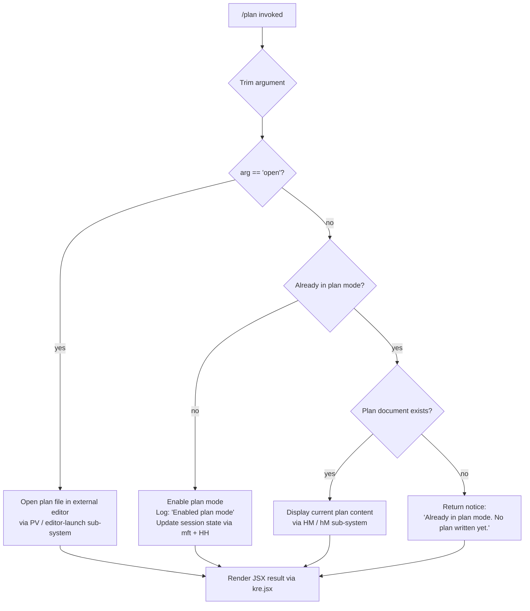

# `/plan`

> Analysis basis: CC v2.1.191 bundle.js (AST extraction + Claude interpretation)
> Minimum version: v2.1.191

---

## Overview

The `/plan` command enables **plan mode** for the current Claude Code session, or opens the existing session plan document in an external editor when the argument `open` is provided. When plan mode is first activated, the agent logs the transition; if the session is already in plan mode, it reports either the current plan content or a notice that no plan has been written yet. The command is implemented as an async handler (`$Lf`) resolved via the module `E2l`.

---

## Registration

| Field | Value |
|---|---|
| type | `local-jsx` |
| name | `plan` |
| description | Enable plan mode or view the current session plan |
| argumentHint | `[open\|<description>]` |
| module_id | `E2l` |
| load_inline | `true` |
| loc_byte | `12576230` |
| loc_byte_end | `12576429` |
| loc_line | `8399` |
| arbor_handler.name | `$Lf` |
| arbor_handler.fqn | `claude-2.1.191::$Lf` |
| arbor_handler.kind | `AsyncFunction` |
| arbor_handler.resolution_path | `module_id` |
| arbor_handler.n_hits | `0` |

Analysis basis: CC v2.1.191 bundle.js:+12576230

---

## Input Branching

Four distinct execution paths exist, depending on (a) whether the argument is `"open"`, (b) whether plan mode is already active, and (c) whether a plan document has been written — requiring a Mermaid flowchart.



Analysis basis: CC v2.1.191 bundle.js:+12575617 (trim), +12575636 (`"open"` literal), +12575555 (`"Enabled plan mode"`), +12575575 (`"Already in plan mode."`), +12575795 (`"Already in plan mode. No plan written yet."`)

---

## Behavioral Spec

### 1. Entry Point — Main Handler

```
async function planCommandHandler(context, args):
    rawArg = args  // passed from CLI dispatcher
    trimmedArg = rawArg.trim()                       // +12575617

    if trimmedArg == "open":                         // +12575636
        return openPlanInEditor(context)

    alreadyInPlanMode = queryPlanModeState(context)  // via pfe +12575399

    if not alreadyInPlanMode:
        enablePlanMode(context)                      // mft +12575452
        logInfo("Enabled plan mode")                 // +12575555
        updatePermissionsAndSession(context)         // HH +12575449
    else:
        planDocument = readCurrentPlan(context)      // hM +12575753

        if planDocument exists and has content:
            displayPlan(context, planDocument)       // HM +12575746
        else:
            return notice("Already in plan mode. No plan written yet.")  // +12575795

    return renderJSXResult(context)                  // kre.jsx +12576014
```

Analysis basis: CC v2.1.191 bundle.js:+12575350

---

### 2. Plan Mode Activation — `enablePlanMode`

Delegates to the session-mutation subsystem (`mft`, resolved at +12575452). Internally this function:

```
function enablePlanMode(context):
    sessionConfig = buildSessionConfig(context)      // j$o +13728779
    applySessionFlags(sessionConfig)                 // EC +13728708
    notifyToolAllowList(sessionConfig)               // tAe +13728881
    updateToolGatingRules(sessionConfig)             // kG +13728975
    broadcastModeChange(context, mode="plan")        // T +13729003
    logTransition(level="info")                      // "info" literal +13729077
```

Analysis basis: CC v2.1.191 bundle.js:+13728779

---

### 3. Permissions / Session-Mode Gate — `updatePermissionsAndSession`

This subsystem (`HH`, called at +12575449) guards mode transitions including `bypassPermissions` rejection:

```
function updatePermissionsAndSession(context):
    if requestedMode == "bypassPermissions":
        if bypassPermissions unavailable:
            // Logs the rejection notice (literal at +5370636)
            logIgnoredPermissionUpdate()
            return

    applySetMode(context, mode)                      // "setMode" +5370548
    updateAllowRules(rules)                          // "alwaysAllowRules" +5371105
    updateDenyRules(rules)                           // "alwaysDenyRules" +5371144
    updateAskRules(rules)                            // "alwaysAskRules" +5371162
    manageDirectories(rules)                         // "addDirectories" +5371571
    flushRuleDeltas(context)                         // n.set +5371830, n.delete +5372529
```

Analysis basis: CC v2.1.191 bundle.js:+5370634

---

### 4. Plan File Read & Display — `readCurrentPlan` / `displayPlan`

```
function readCurrentPlan(context):
    planPath = resolvePlanFilePath(context)           // wt +13409197, O_t +12575699
    rawBytes = filesystem.readFileSync(planPath, encoding="utf-8")  // "utf-8" +13409443
    return rawBytes

function displayPlan(context, content):
    lines = splitIntoLines(content)                  // BMe +13409286
    formatted = joinWithSeparator(lines)             // XV.join +13409091
    renderToOutput(formatted)                        // T +13409499
    logErrors(errors)                                // Le +13409552
```

Analysis basis: CC v2.1.191 bundle.js:+12575746, +12575753

---

### 5. Open Plan in External Editor — `openPlanInEditor`

```
async function openPlanInEditor(context):
    planPath = resolvePlanFilePath(context)           // O_t +12575699
    editorBinary = resolveEditor(context)             // uG +12575980, HL +12575989

    pauseInkRendering(context)                       // n.pause +11672503
    enterAlternateScreen()                           // n.enterAlternateScreen +11672473
    suspendStdin()                                   // n.suspendStdin +11672513

    // Launch editor synchronously
    editorArgs = buildEditorArgs(planPath)           // s.split +11672552, i.slice +11672577
    result = spawnSync(editorBinary, editorArgs,
                       stdio="inherit")              // "inherit" +11672627

    // Restore terminal state
    exitAlternateScreen()                            // n.exitAlternateScreen +11672975
    resumeStdin()                                    // n.resumeStdin +11673004
    resumeOutput()                                   // n.resume +11673020

    updatedContent = filesystem.readFileSync(planPath)  // t.readFileSync +11672897
    return renderJSXWithContent(updatedContent)
```

Analysis basis: CC v2.1.191 bundle.js:+12575896 (PV entry), +11672595 (spawnSync)

---

### 6. Error Handling

```
function handleFilesystemError(err):
    switch err.code:
        case "ENOENT":   handleMissing()        // +183598
        case "EACCES":   handlePermDenied()     // +184053
        case "EPERM":    handlePermDenied()     // +184067
        case "EISDIR":   handleIsDirectory()    // +183638
        case "ENOTDIR":  handleNotDir()         // +184080
        case "ELOOP":    handleSymlinkLoop()    // +184095
        case "ENAMETOOLONG": handleNameTooLong() // +184108
        case "EROFS":    handleReadOnly()       // +184128
        default:         logError(err)          // GQ.logError via Le
```

Analysis basis: CC v2.1.191 bundle.js:+182491 (error construction), +183598–+184128 (error code literals)

---

### 7. JSX Rendering of Result

The final output is rendered as a JSX component (`kre.jsx`, called at +12576014). Terminal output is captured via a streaming adapter (`sBa` → `Cdt` at +12576010), which subscribes to data events (`o.on` at +8298832), collects output (`i.toString` at +8298869), and strips ANSI codes via `Bun.stripANSI` (+3941701) before returning the rendered string.

Analysis basis: CC v2.1.191 bundle.js:+12576010, +12576014

---

## State & Side Effects

| Item | Detail |
|---|---|
| Telemetry | `tengu_lone_surrogate_sanitized` (+8938694), `tengu_api_success` (+8938998), `tengu_context_tip_classifier_outcome` (+16672225), `tengu_feature_ok` (+1025725), `tengu_feature_bad` (+1025792) |
| Plan mode flag | Session plan-mode state toggled via `mft` subsystem (+12575452) |
| Session tool-gating rules | Allow/deny/ask rule sets updated via `HH` (+12575449); `alwaysAllowRules`, `alwaysDenyRules`, `alwaysAskRules`, `addDirectories`, `removeRules`, `removeDirectories` |
| Permission guard | `bypassPermissions` requests rejected with a log warning when the mode is unavailable (+5370636) |
| File I/O | Plan file read synchronously (`readFileSync`); append/write path managed by `kNc`/`RNc` subsystem (+214141–+214750) |
| Log rotation | Plan file rotated/renamed if it reaches size threshold via `nmr` (+213712); `.txt` suffix managed (+213816) |
| Terminal state | On `open`: alternate screen entered, stdin suspended, editor spawned synchronously, then terminal restored (+11672473–+11673020) |
| Ink rendering | Ink instance paused/resumed around editor launch (+11672320 error literal if Ink not found) |
| Sound | <!-- TODO: not found in depth-2 traversal; needs --depth 4 --> |
| appState changes | Session mode transitioned to plan; tool-gating state refreshed in session map via `n.set` (+5371830) and `n.delete` (+5372529) |

---

## Version History

| Version | Change |
|---|---|
| v2.1.191 | Initial analysis |

---

## Common Mistakes

1. **Passing a description instead of `open`**: The argument hint `[open|<description>]` suggests a description is accepted, but the literal check at +12575636 only branches on the exact string `"open"`. Any other non-empty string will fall through to the plan-mode-enable path rather than opening an editor or setting a named plan description.
2. **Running `/plan open` with no plan written yet**: If plan mode has not been activated in the session, the `open` path may attempt to open a file that does not yet exist; the handler resolves the plan path via `O_t` but filesystem errors (e.g. `ENOENT`) are caught and logged rather than surfaced to the user clearly.
3. **Expecting `/plan` to disable plan mode**: There is no evidence in the depth-2 traversal of a toggle or disable path. Invoking `/plan` when already in plan mode only displays the current plan (or the "no plan written" notice); it does not exit plan mode.
4. **Assuming terminal restoration is guaranteed**: If the Ink instance is missing when `/plan open` is invoked, the error literal `"Ink instance not found - cannot pause rendering"` (+11672320) is produced but the editor launch may still proceed, leaving terminal state potentially inconsistent.
5. **Confusing `bypassPermissions` mode gating**: Attempting to set `bypassPermissions` mode via the plan command's session-mutation path will be silently rejected if the session was not launched in that mode, with only a log warning emitted (+5370636).

---

## Appendix — Identifier Mapping

> For bundle debugging only. Identifiers change across versions.

| Identifier | Role |
|---|---|
| `$Lf` | Main async handler for `/plan` command (Arbor-resolved entry point) |
| `r` | Data-event streaming helper (called from `$Lf` at +12575350) |
| `Cs` | CLI error reporter / process-exit coordinator |
| `nqe` | Error formatter that writes to stderr via `St.red` |
| `fT` | File write helper using `$oe.writeFileSync` |
| `pfe` | Plan-mode state query function |
| `o` | Column-padding / display mapping helper |
| `s` | Async set-tracking wrapper (add/delete/finally lifecycle) |
| `i` | Stream close / connection manager |
| `n` | Lowercase normaliser for stream identifiers |
| `HH` | Permissions and session-mode update orchestrator |
| `T` | Mode-string formatter / router (called from `HH`, `kG`, `mft`) |
| `wNc` | API call orchestrator sub-module |
| `kqo` | API parameter builder (`MPc`/`DPc`) |
| `e` | Context-tip classifier entry function |
| `L6o` | Conversation context builder / message slicer |
| `wN` | Fetch-based API request dispatcher |
| `S4` | Side-query executor (`ev`, `PPr`) |
| `usm` | Context summary utility |
| `hsm` | Context string builder (push/join pattern) |
| `M6n` | Tool-use block finder (`e.find`) |
| `cSt` | Context-tip positive-result handler |
| `Re` | Context-tip ok-event emitter |
| `D6n` | Schema safe-parse wrapper |
| `we` | Context-tip feature-ok telemetry emitter |
| `Ae` | String coercion utility |
| `ke` | JSON stringify helper |
| `t` | Generic loop variable / schema object |
| `Dc` | Path/string redaction formatter (`[REDACTED]`) |
| `h7o` | INc map transformer |
| `a7e` | Stdout write wrapper via `s7o` |
| `s7o` | Raw `e.write` stream adapter |
| `kNc` | Append-log writer / log-rotation controller |
| `Oze` | Debounce/batch flush utility (setTimeout/setImmediate) |
| `Rfe` | Log file path builder (`xfe.join`, `Zn`, `wt`) |
| `Gt` | Global settings accessor |
| `Noe` | Directory-node resolver via `dn` |
| `y7o` | File-path join utility (`xfe.join`, `wt`) |
| `nmr` | Log-file rotation and rename handler |
| `RNc` | Append-file writer with mkdir and rotation |
| `_i` | Hook/signal registrar (`xqo.register`) |
| `qp` | Permission-string escape formatter |
| `X_u` | String `replaceAll` escape helper |
| `mft` | Plan-mode activation and session-config mutator |
| `j$o` | Session config builder (`u4`, `EC`, `$Ir`) |
| `u4` | Config value extractor |
| `EC` | Session state applicator (`U$o`, `Gge`, `Es`) |
| `U$o` | Session field setter via `jo` |
| `Gge` | Model-family capability guard (claude-3/4 checks) |
| `Es` | Event emitter wrapper (`E4`, `Qo`, `rH`) |
| `$Ir` | Settings-layer resolver (`In`) |
| `In` | Multi-layer settings reader (`vln`, `z2`) |
| `I2` | Intermediate config transformer |
| `tAe` | Tool allow-list updater (`Object.entries`, `HH`, `o.map`) |
| `kG` | Tool-gating rule compiler (`Object.entries`, `og`, `D$o`, `cYl`) |
| `og` | Rule-string parser (`Q_u`, `wk`, `Z_u`, `J_u`) |
| `Q_u` | Rule prefix extractor |
| `wk` | `Object.hasOwn` ownership check utility |
| `Z_u` | Rule suffix extractor |
| `J_u` | Rule `replaceAll` sanitiser |
| `D$o` | Tool-gating rule applier (`Qje`, `M$o`) |
| `Qje` | Tool cache getter/setter (`Uel`) |
| `M$o` | Allowed-tool inclusion checker (`AT.includes`, `sg`, path relative) |
| `cYl` | Session-rule map manager (`VBf`, `r.get/set`, `HH`) |
| `VBf` | Rule `K2.includes` validator |
| `a` | Async state machine / session-values iterator |
| `YS` | Output render dispatcher (`Vu`) |
| `Vu` | Render pipeline entry (`W1e`) |
| `W1e` | Low-level render primitive |
| `O_t` | Plan file path resolver (`_be`, `wt`) |
| `_be` | Base path config reader |
| `wt` | File-path join utility (wraps `ux`) |
| `ux` | Underlying path-join implementation |
| `HM` | Plan display orchestrator (`hM`, `Gt`, `vn`, `zo`, `T`, `Le`) |
| `hM` | Plan content loader (`BMe`, `wt`, `XV.join`, `Dy`) |
| `BMe` | Plan file reader and formatter |
| `F5r` | String replacement sanitiser |
| `ent` | Inline text encoder via `wDt` |
| `OTn` | Alternate text encoder via `wDt` |
| `vn` | ENOENT-safe file accessor (via `dn`) |
| `dn` | Low-level filesystem node helper |
| `zo` | Permission-error file accessor (via `dn`) |
| `Le` | Error logging aggregator (`fo`, `rt`, `Yi`, `Rmu`, `GQ.logError`) |
| `fo` | Error object constructor helper |
| `rt` | String coercion for error messages |
| `Yi` | Error queue manager (`ncs`) |
| `ncs` | Normalised error record builder (`rt`) |
| `Rmu` | Rotating error queue (Oin shift/push) |
| `PV` | External editor launcher (spawnSync, terminal state management) |
| `uG` | Editor binary resolver (`Yh`, `vhf`) |
| `Yh` | Editor environment variable reader |
| `Lhf` | Editor path validator (`Z0o`) |
| `Z0o` | File-type classifier (`owl`, `bhf.find`) |
| `owl` | Filename/extension analyser |
| `HL` | Platform-aware editor argument builder |
| `yi` | String index/slice argument helper |
| `sBa` | JSX output capture wrapper (`Cdt`, `mc`) |
| `Cdt` | Stream-to-string collector (`o.on`, `i.toString`, `Idt.jsx`) |
| `MW` | Ink render bridge (`_8r`, `x8r`, `wee`) |
| `x8r` | React element creator (`z1i.createElement`) |
| `wee` | Ink component wrapper (`Bk`, `Iwe`, `y8r`) |
| `mc` | ANSI-strip post-processor (`Bun.stripANSI`) |

---

Note: index built via Arbor fallback; some signals (telemetry, literals) may be missing — see arbor-fallback.js.