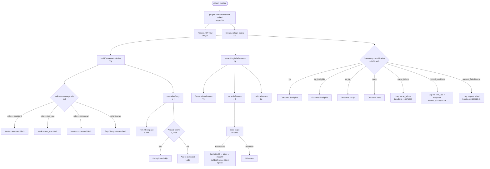

```markdown
---
type: feature-spec
feature: "plugin"
cc_version: "2.1.191"
updated: "2026-06-25"
tags: ["plugin", "commands", "slash-commands"]
source: "bundle-analysis"
bundle_verified: true
analysis_basis: "CC v2.1.191 bundle.js (AST extraction + Claude interpretation)"
author: "ryujaeuk <ryujaeuk@gmail.com>"
repository: "https://github.com/MyLittleLuckyDog/cc-gnothi"
license: "AGPL-3.0-only"
---

# `/plugin`

> Analysis basis: CC v2.1.191 bundle.js (AST extraction + Claude interpretation)
> Minimum version: v2.1.191

---

## Overview

The `/plugin` command (also accessible as `/plugins` or `/marketplace`) opens an interactive JSX-rendered panel for managing Claude Code plugins. It is dispatched immediately upon invocation and delegates its core rendering to an async handler that builds a JSX view and initialises the plugin listing infrastructure.

---

## Registration

| Field | Value |
|---|---|
| type | `local-jsx` |
| name | `plugin` |
| description | `Manage Claude Code plugins` |
| aliases | `["plugins", "marketplace"]` |
| immediate | `true` |
| load_inline | `true` |
| module_id | `c9l` |
| loc_byte | `12727731` |
| loc_byte_end | `12728021` |
| loc_line | `8610` |
| arbor_handler.name | `T0f` |
| arbor_handler.fqn | `claude-2.1.191::T0f` |
| arbor_handler.kind | `AsyncFunction` |
| arbor_handler.resolution_path | `module_id` |
| arbor_handler.n_hits | `0` |

Analysis basis: CC v2.1.191 bundle.js:+12727731

---

## Input Branching

The command's internal flow encompasses three or more distinct structural paths: validation of message-role types (`"assistant"`, `"tool_use"`, `"command"`), extraction/parsing of plugin references, and classification of the resulting tip eligibility outcome (`"tip"`, `"tip_ineligible"`, `"no_tip"`, `"none"`). A Mermaid flowchart is therefore used below.



---

## Behavioral Spec

### 1. Command Entry — Async Plugin Handler

The registered module `c9l` exposes an async function (Arbor-resolved as `T0f`) as the command's handler. Because `load_inline` is `true`, the handler is loaded via an inline `Promise.resolve` wrapping rather than a dynamic import.

```
async function pluginCommandHandler(context):
    jsxOutput = renderPluginView(context)          // u9l.jsx
    pluginState = initialisePluginListing(context) // Xxl
    return jsxOutput
```

Analysis basis: CC v2.1.191 bundle.js:+12724899, +12724982

---

### 2. Plugin Listing Initialisation

`initialisePluginListing` (obfuscated: `Xxl`) orchestrates two sub-routines:

1. **Conversation index construction** — scans conversation history and categorises each message block by role.
2. **Plugin reference extraction** — identifies structured plugin references within the conversation.

```
function initialisePluginListing(context):
    index = buildConversationIndex(context.messages)   // Tqt
    refs  = extractPluginReferences(context.messages)  // Iqt
    return { index, refs }
```

Analysis basis: CC v2.1.191 bundle.js:+11869156, +11869173

---

### 3. Conversation Index Construction

`buildConversationIndex` (obfuscated: `Tqt`) iterates over message entries, delegates role validation to a helper, normalises each entry, and accumulates the result into a set.

```
function buildConversationIndex(messages):
    resultSet = new Set()
    for each entry in messages:
        if isValidRole(entry):           // Yxl — checks "assistant", "tool_use", "command"
            normalised = normaliseEntry(entry)  // s_f
            resultSet.add(normalised)           // t.add
    return resultSet
```

Analysis basis: CC v2.1.191 bundle.js:+11868493, +11868507, +11868519

---

### 4. Role Validation

`isValidRole` (obfuscated: `Yxl`) decides whether a conversation entry should be processed based on its role field.

```
function isValidRole(entry):
    if Array.isArray(entry):
        return false                          // bundle.js:+11868230
    allowed = ["assistant", "tool_use", "command"]
    return allowed.includes(entry.role)       // bundle.js:+11868307, +11868389; X1.includes at +11868319
```

Role string constants observed:
- `"assistant"` — Analysis basis: CC v2.1.191 bundle.js:+11868217
- `"tool_use"` — Analysis basis: CC v2.1.191 bundle.js:+11868307
- `"command"` — Analysis basis: CC v2.1.191 bundle.js:+11868389

---

### 5. Entry Normalisation and Deduplication

`normaliseEntry` (obfuscated: `s_f`) trims whitespace from the entry's text content and checks whether it has already been seen in a persistent seen-set (`o_f`).

```
function normaliseEntry(entry):
    trimmed = entry.text.trim()               // bundle.js:+11868889
    if seenSet.has(trimmed):                  // o_f.has, bundle.js:+11868967
        return null                           // deduplicate
    return trimmed
```

Analysis basis: CC v2.1.191 bundle.js:+11868889, +11868967

---

### 6. Plugin Reference Extraction

`extractPluginReferences` (obfuscated: `Iqt`) re-validates roles (same `isValidRole` helper) and then applies a regex-based parser to pull structured plugin references out of qualifying entries.

```
function extractPluginReferences(messages):
    referenceSet = new Set()
    for each entry in messages:
        if isValidRole(entry):               // Yxl, bundle.js:+11868809
            ref = parseReference(entry)      // r_f, bundle.js:+11868829
            if ref != null:
                referenceSet.add(ref)        // t.add, bundle.js:+11868836
    return referenceSet
```

Analysis basis: CC v2.1.191 bundle.js:+11868809, +11868829, +11868836

---

### 7. Reference Parsing

`parseReference` (obfuscated: `r_f`) uses a compiled regular expression (`zxl`) to locate plugin reference markers within an entry's text, then slices the string to extract name and boundary information.

```
function parseReference(entry):
    match = pluginRefRegex.exec(entry.text)     // zxl.exec, bundle.js:+11868604
    if match == null:
        return null
    // Use match group 1 as anchor (+11868633)
    lastSep = entry.text.lastIndexOf(...)        // bundle.js:+11868652
    body    = entry.text.slice(lastSep, ...)     // bundle.js:+11868683
    pos     = body.indexOf(...)                  // bundle.js:+11868702
    result  = buildReferenceObject(body, pos)
    references.push(result)                      // t.push, bundle.js:+11868747
    return result
```

Analysis basis: CC v2.1.191 bundle.js:+11868604, +11868652, +11868683, +11868702, +11868747

---

### 8. Context-Tip Classification (Support Path)

Several literals and call edges in the depth-2 traversal originate from a shared context-tip classification subsystem (`cSt` / `e`) reachable from the plugin listing initialisation path. This subsystem sends a limited conversation window (maximum 512 tokens — Analysis basis: CC v2.1.191 bundle.js:+16671099) to a classifier tool, parses the response for a `tool_use` block, and maps the result to one of four outcome labels.

```
async function contextTipClassifier(messages):
    window = messages.slice(0, MAX_WINDOW)        // value 0 at +16670721; max 512 at +16671099
    request = buildClassifierRequest(window,
                  toolName="context_tip_classifier",  // +16671138
                  maxTokens=512)
    response = await sendRequest(request)         // L6o, wN, S4, usm path

    if response lacks tool_use block:
        log("[context-tips] no tool_use block in response")   // +16671216
        emit("tips_context_classify_no_tool_use")             // +16671363
        return "none"

    parsed = parseSchema(response.tool_use)
    if parse fails:
        log("[context-tips] response failed schema parse")    // +16671438
        emit("tips_context_classify_parse_failed")            // +16671584
        return "parse_failure"                                // +16671277

    outcome = parsed.outcome   // one of: "tip", "tip_ineligible", "no_tip", "none"
    emit("tips_context_classify")                             // +16671339
    return outcome

    on request error:
        log("error")                                          // +16672071
        emit("tips_context_classify_request_failed")          // +16672143
```

Observed outcome string constants (Analysis basis: CC v2.1.191 bundle.js):
- `"tip"` — +16671782
- `"tip_ineligible"` — +16671788
- `"no_tip"` — +16671805
- `"none"` — +16671838

Message-role constants used by this subsystem:
- `"text"` — +16670825
- `"ephemeral"` — +16670866
- `"user"` — +16670923
- `"tool"` — +16671071

Data literal `"data"` (used in stream framing): CC v2.1.191 bundle.js:+17267623  
Maximum context window constant: **1024** characters (Analysis basis: CC v2.1.191 bundle.js:+17267676)

---

## State & Side Effects

| Item | Detail |
|---|---|
| Telemetry | No `tengu_*` telemetry events were found in the depth-2 traversal for this command. The context-tip classification subsystem emits internal string labels (`"tips_context_classify"`, `"tips_context_classify_no_tool_use"`, `"tips_context_classify_parse_failed"`, `"tips_context_classify_request_failed"`) but these are not `tengu_*` events. |
| JSX render | `u9l.jsx` is invoked unconditionally on handler entry (bundle.js:+12724899). |
| Plugin index set | A de-duplicated `Set` of normalised conversation entries is built in memory (bundle.js:+11868519). |
| Plugin reference set | A separate `Set` of parsed plugin references is built in memory (bundle.js:+11868836). |
| Seen-set (`o_f`) | A persistent deduplication store (`o_f`) is consulted on every `normaliseEntry` call to prevent duplicate processing (bundle.js:+11868967). |
| Context-tip API call | The classification subsystem may issue an outbound API request carrying a truncated conversation window; outcome is one of `"tip"` / `"tip_ineligible"` / `"no_tip"` / `"none"` / `"parse_failure"`. |
| Hook registration | <!-- TODO: not found in depth-2 traversal; needs --depth 4 --> |
| appState changes | <!-- TODO: not found in depth-2 traversal; needs --depth 4 --> |
| Sound | <!-- TODO: not found in depth-2 traversal; needs --depth 4 --> |

---

## Version History

| Version | Change |
|---|---|
| v2.1.191 | Initial analysis |

---

## Common Mistakes

1. **Using `/plugin` as an alias check**: The canonical name is `plugin`; the aliases `plugins` and `marketplace` are fully equivalent at dispatch time. Code that pattern-matches on the command name for routing purposes must account for all three strings.
2. **Expecting synchronous return**: The handler `T0f` is an `AsyncFunction` (Arbor kind). Callers that do not await the result will miss the initialised plugin state and JSX output.
3. **Assuming no deduplication**: The `o_f` seen-set persists across `normaliseEntry` calls within a session. Restarting a plugin scan without clearing `o_f` will silently suppress re-processing of previously seen entries.
4. **Misinterpreting the 512-token limit**: The constant `512` (bundle.js:+16671099) governs the classifier's `maxTokens` response budget, not the number of conversation messages fed to it. The conversation window constant is `1024` (bundle.js:+17267676).
5. **Conflating role strings**: The role validator (`isValidRole`) only accepts `"assistant"`, `"tool_use"`, and `"command"`. Entries with role `"user"`, `"tool"`, `"text"`, or `"ephemeral"` — all of which appear in adjacent code — are **rejected** by the validator and will not appear in the plugin index or reference set.

---

## Appendix — Identifier Mapping

> For bundle debugging only. Identifiers change across versions.

| Identifier | Role |
|---|---|
| `T0f` | Main async plugin command handler (entry point, Arbor-resolved via `module_id`) |
| `Xxl` | Plugin listing initialisation orchestrator |
| `Tqt` | Conversation index construction (`buildConversationIndex`) |
| `Yxl` | Role validation predicate (`isValidRole`) |
| `s_f` | Entry normalisation and deduplication (`normaliseEntry`) |
| `Iqt` | Plugin reference extraction (`extractPluginReferences`) |
| `r_f` | Regex-based reference parser (`parseReference`) |
| `e` | Context-tip classification subsystem (classifier request/response handler) |
| `t` | Accumulator variable (used as both index Set and reference Set target across call sites) |
| `r` | String input variable within `parseReference`; also used in stream-framing path (`Cs`) |

---

Note: index built via Arbor fallback; some signals (telemetry, literals) may be missing — see arbor-fallback.js.
```