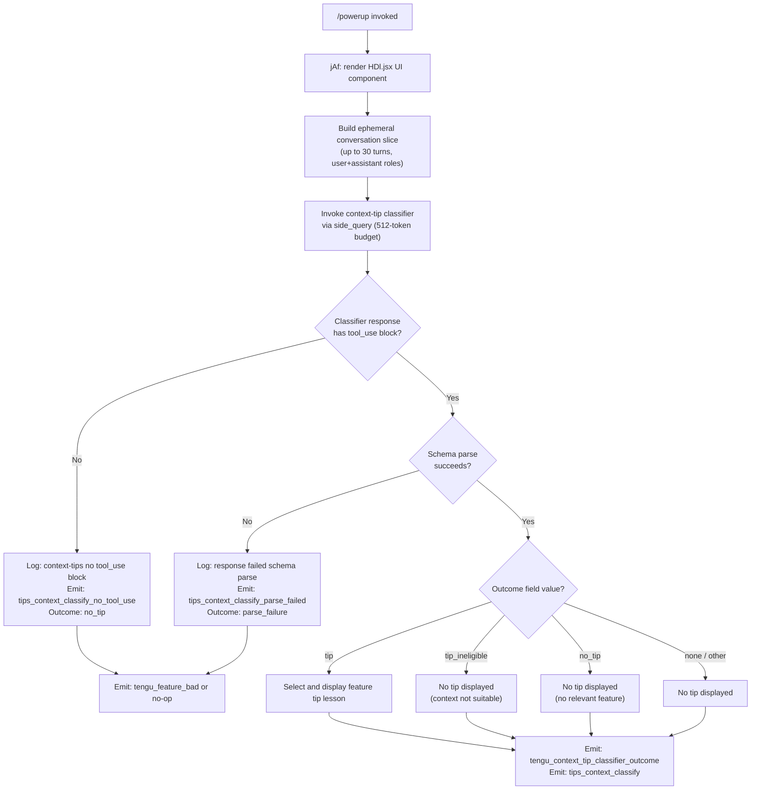

# `/powerup`

> Analysis basis: CC v2.1.191 bundle.js (AST extraction + Claude interpretation)
> Minimum version: v2.1.191

---

## Overview

`/powerup` is an interactive educational command that surfaces Claude Code features through quick, focused lessons delivered in the terminal. When invoked, the handler (`jAf`) renders a JSX-based UI component (`HDl.jsx`) and initiates a side-query classification pipeline that selects and presents a contextually relevant feature tip to the user. The command is designed as a lightweight discovery mechanism, not a full conversational turn.

---

## Registration

| Field | Value |
|---|---|
| type | `local-jsx` |
| name | `powerup` |
| description | `Discover Claude Code features through quick interactive lessons` |
| module_id | `hDl` |
| load_inline | `true` |
| loc_byte | `12165941` |
| loc_byte_end | `12166121` |
| loc_line | `8014` |
| arbor_handler.name | `jAf` |
| arbor_handler.fqn | `claude-2.1.191::jAf` |
| arbor_handler.kind | `AsyncFunction` |
| arbor_handler.resolution_path | `module_id` |
| arbor_handler.n_hits | `0` |

Analysis basis: CC v2.1.191 bundle.js:+12165941

---

## Input Branching

The command exhibits 4+ distinct execution paths based on the context-tip classifier outcome. A Mermaid flowchart is used.



---

## Behavioral Spec

### Handler Entry — Async Function

The primary handler (`jAf`) is an `AsyncFunction` resolved via `module_id` path to module `hDl`.

```
async function powerupHandler(commandContext):
    renderComponent(PowerupJsxComponent)          // HDl.jsx at +12165826
    result = await runContextTipClassifier(commandContext)
    return result
```

Analysis basis: CC v2.1.191 bundle.js:+12165826, +12165851

---

### Conversation Slice Builder

Before sending the side query, the pipeline builds a trimmed conversation representation from recent session turns.

```
function buildConversationSlice(conversationHistory):
    MAX_TURNS = 30                               // literal at +16668949
    slice = conversationHistory.slice(-MAX_TURNS)
    result = []
    for each turn in slice:
        role = turn.role                         // "user" (+16668982) or "assistant" (+16668999)
        if turn contains text content:
            append { role, content_type: "text" }   // +16669206
        if turn contains tool_result content:
            append { role, content_type: "tool_result" }  // +16669266
        if turn contains tool_use content:
            label = tool.name
            if tool.is_error:
                label = label + " (error)"       // literal at +16669486
            append { role, content_type: "tool_use", label }  // +16669676
        if turn is too long:
            truncate to 1000 chars               // literal at +16669144
        if content is tool-type:
            truncate to 300 chars                // literal at +16669651
    return result.join(separator)
```

Analysis basis: CC v2.1.191 bundle.js:+16668916, +16668940, +16669122

---

### Context-Tip Classifier (Side Query)

The classifier is invoked as a lightweight `side_query` call with a constrained token budget.

```
async function runContextTipClassifier(context):
    MODEL_TOKEN_BUDGET = 512                     // literal at +16671099
    QUERY_TYPE = "side_query"                    // literal at +8937327
    CLASSIFIER_NAME = "context_tip_classifier"  // literal at +16671138

    conversationSlice = buildConversationSlice(context.history)
    systemMessage = buildClassifierSystemPrompt()  // role "system" at +12165864
    userMessage = buildClassifierUserMessage(conversationSlice)

    response = await apiCall({
        type: QUERY_TYPE,
        messages: [systemMessage, userMessage],
        max_tokens: MODEL_TOKEN_BUDGET
    })

    // Inspect response for tool_use block
    toolUseBlock = findToolUseBlock(response)    // M6n at +16671182
    if toolUseBlock is null:
        log("[context-tips] no tool_use block in response")   // +16671216
        emitTelemetry("tips_context_classify_no_tool_use")    // +16671363
        return { outcome: "no_tip" }

    // Parse tool_use against expected schema
    parsed = schemaParser.safeParse(toolUseBlock)  // D6n at +16671410
    if parsed.failure:
        log("[context-tips] response failed schema parse")    // +16671438
        emitTelemetry("tips_context_classify_parse_failed")   // +16671584
        return { outcome: "parse_failure" }

    outcome = parsed.data.outcome
    // outcome is one of: "tip", "tip_ineligible", "no_tip", "none"

    emitTelemetry("tips_context_classify")        // +16671339
    emitTelemetry("tengu_context_tip_classifier_outcome", { outcome })  // +16672225

    if outcome == "tip":
        tip = parsed.data.tip                     // "tip" field at +16671782
        return displayFeatureTip(tip)
    else:
        return { outcome }
```

Analysis basis: CC v2.1.191 bundle.js:+16671099, +16671182, +16671338, +16672225

---

### Feature Tip Display

When the classifier returns outcome `"tip"`, the tip content is rendered through the JSX component.

```
function displayFeatureTip(tipData):
    // Rendered inside HDl.jsx component already mounted
    // tipData contains the lesson content
    updateComponentState(PowerupJsxComponent, { tip: tipData })
    emitTelemetry("tengu_feature_ok")      // +1025725
    // On render failure or bad data:
    //   emitTelemetry("tengu_feature_bad")   // +1025792
```

Analysis basis: CC v2.1.191 bundle.js:+1025725, +1025792

---

### Classifier Message Assembly

The pipeline assembles conversation history into a format suitable for the side-query classifier.

```
function buildClassifierUserMessage(conversationSlice):
    parts = []
    for each item in conversationSlice:
        parts.push(formatTurnItem(item))      // hsm at +16670228, +16670615
        parts.join(joiner)
    return parts

function mapConversationItems(rawMessages):
    return rawMessages.map(normalizeMessage)   // e.map at +16670740
    timestamp = Date.now()                     // +16670769
    // ephemeral marker applied to message context
    // "ephemeral" literal at +16670866
```

Analysis basis: CC v2.1.191 bundle.js:+16670740, +16670769, +16670866

---

### API Side-Query Layer

The actual HTTP request is routed through the standard API client (`wN`) as a `side_query` type, sharing the same authentication and header infrastructure as regular turns.

```
async function invokeSideQuery(payload):
    headers = buildStandardHeaders()     // oW at +3025805
    // includes: User-Agent, X-Claude-Code-Session-Id, x-app, x-client-app
    authToken = await acquireToken()     // oW → TZe → fetch at +2350623
    response = await globalThis.fetch(endpoint, {
        method: "POST",
        headers,
        body: JSON.stringify(payload),
        signal: AbortSignal.timeout(timeoutMs)
    })
    return parseResponse(response)
```

Analysis basis: CC v2.1.191 bundle.js:+8937327, +8937388, +8937420

---

## State & Side Effects

| Item | Detail |
|---|---|
| Telemetry: `tengu_context_tip_classifier_outcome` | Emitted after every completed classifier run; carries `outcome` field (bundle.js:+16672225) |
| Telemetry: `tips_context_classify` | Emitted on successful schema parse of classifier response (bundle.js:+16671339) |
| Telemetry: `tips_context_classify_no_tool_use` | Emitted when classifier response lacks a `tool_use` block (bundle.js:+16671363) |
| Telemetry: `tips_context_classify_parse_failed` | Emitted when schema parsing of the tool_use block fails (bundle.js:+16671584) |
| Telemetry: `tips_context_classify_request_failed` | Emitted when the underlying API call fails entirely (bundle.js:+16672143) |
| Telemetry: `tengu_feature_ok` | Emitted on successful tip render (bundle.js:+1025725) |
| Telemetry: `tengu_feature_bad` | Emitted on tip render failure or bad tip data (bundle.js:+1025792) |
| Telemetry: `tengu_api_success` | Emitted on successful API response from the side-query call (bundle.js:+8938998) |
| Telemetry: `tengu_lone_surrogate_sanitized` | Emitted if lone surrogate characters are sanitized in response text (bundle.js:+8938694) |
| Telemetry: `tengu_prompt_cache_1h_config` | Emitted when 1-hour prompt cache configuration is applied (bundle.js:+13616098) |
| JSX component | `HDl.jsx` mounted as local-jsx render target for the tip UI (bundle.js:+12165826) |
| Conversation history read | Reads up to 30 most recent turns from session history; no writes to session history |
| API call | One `side_query` network call to the configured Anthropic endpoint; uses ephemeral message context |
| appState changes | None observed at depth-2 traversal |
| Sound | None observed at depth-2 traversal |
| Hook registration | None observed at depth-2 traversal |

---

## Version History

| Version | Change |
|---|---|
| v2.1.191 | Initial analysis |

---

## Common Mistakes

1. **Expecting a conversational response**: `/powerup` does not open a full agent turn. It fires a bounded `side_query` internally and renders output via a JSX component, so the normal message pipeline is not invoked.
2. **Assuming tips always appear**: The classifier may return `"no_tip"`, `"tip_ineligible"`, or fail to produce a `tool_use` block, in which case no lesson is displayed and the command silently completes.
3. **Running `/powerup` with no prior context**: The classifier scores tips against conversation history (up to 30 turns). In a fresh session with no history, the classifier is likely to return `"no_tip"` or `"none"` because there is no context to classify.
4. **Confusing `/powerup` with `/help`**: `/powerup` is discovery-oriented (proactive, context-aware lesson selection), not a reference listing of all commands.
5. **Expecting deterministic output**: The tip selected depends on the language model's classification of your session context; the same session state may not always yield the same tip.

---

## Appendix — Identifier Mapping

> For bundle debugging only. Identifiers change across versions.

| Identifier | Role |
|---|---|
| `jAf` | Primary async handler for `/powerup` command (Arbor-resolved, module_id path) |
| `e` | Main pipeline orchestration function; coordinates classifier invocation and result handling |
| `L6o` | Conversation slice builder; trims and formats history turns for classifier input |
| `gsm` | Turn serializer; calls `t.set` to store formatted turn data |
| `har` | Text encoding/surrogate-pair handler; delegates to `hx` |
| `hx` | Low-level character-code inspection for surrogate pairs (charCodeAt, slice) |
| `msm` | Auto-classifier input mapper; converts turns to classifier schema via `toAutoClassifierInput` |
| `ke` | JSON serializer utility (calls `JSON.stringify`) |
| `wN` | API side-query dispatcher; handles fetch, token acquisition, response parsing |
| `xf` | API client factory; creates the HTTP client instance |
| `wt` | HTTP transport layer |
| `oW` | Full API client implementation; manages headers, auth, retry, streaming |
| `mz` | API base configuration object |
| `p3r` | User-agent string builder (split, trim, indexOf, slice) |
| `Ks` | Header assembly helper |
| `Mz` | Error reporting/version metadata provider |
| `GPr` | URL encoding utility (replace, encodeURIComponent) |
| `T` | Request builder / HTTP method formatter (includes, toUpperCase, trim) |
| `rt` | String coercion utility |
| `Ng` | OAuth token refresh coordinator; delegates to `rAn` |
| `XKs` | Boolean coercion utility |
| `_y` | Authentication state machine; coordinates token sources |
| `_ud` | Token validation helper |
| `Kdn` | Proxy auth helper executor; enforces trust check before running helper |
| `Iud` | Request identity and session UUID manager |
| `PH` | Mantle/platform header injector |
| `G2` | Provider detection utility |
| `fy` | OAuth flow handler (token exchange, refresh) |
| `Tud` | Request finalization helper |
| `yud` | Provider-specific configuration resolver (anthropicAws, vertex, foundry, gateway) |
| `SCe` | Response streaming controller |
| `Rdr` | Request duration recorder |
| `pMt` | Header normalization (Object.entries, toLowerCase) |
| `dve` | SDK error logger |
| `BSn` | Response body parser |
| `D` | Streaming write handler; manages supervisor/error/mtime-changed events |
| `x` | Request deduplication / cache-key manager (Date.now, v.get/set/delete) |
| `v` | Focus/blur session timer (blurred, focused, 3600000ms window, 0.8 threshold) |
| `Ooe` | Environment prefix resolver (startsWith, JZt) |
| `nv` | UI notification helper |
| `yA` | Session profile manager (profile-implicit, user_oauth) |
| `ACe` | WIF token exchange handler (wif_token_exchange) |
| `TZe` | WIF credential resolver; performs fetch with AbortSignal.timeout(10000) |
| `I` | Input event handler (Math.max/floor, preventDefault) |
| `h` | Stream reader wrapper |
| `b2e` | Model compatibility checker (claude-3-, claude-opus-4-0, claude-sonnet-4-0) |
| `ao` | Application-inference-profile detector |
| `o1` | Request metadata helper |
| `lie` | Foundry resource ID resolver |
| `vOr` | Foundry resource name normalizer (replace, COr) |
| `_` | Tool/feature flag registry lookup |
| `a` | Tool registry entry accessor (s.get, s.values, T) |
| `CBp` | Model capability finder (e.find, n.find) |
| `SHo` | SHA-256 hash utility (JVa.createHash, "sha256", "hex") |
| `Ghn` | User-agent string composer |
| `ol` | String padding/coercion helper |
| `_r` | Core render/output primitive |
| `uu` | Output formatting utility |
| `$hn` | AsyncLocalStorage store accessor (YKs.getStore) |
| `hCe` | HTTP header canonicalizer |
| `aIn` | Abort/interrupt signal handler |
| `aje` | Main API request executor; manages retries, cache control, mode flags |
| `To` | Request options assembler (_y, rB, Vs) |
| `dpr` | Debug/trace printer |
| `nt` | Background worker task scheduler |
| `ppr` | Prompt construction helper |
| `wD` | HIPAA-mode request wrapper |
| `C3r` | HIPAA header injector |
| `A2e` | HIPAA response sanitizer |
| `L` | Background worker sweep loop; manages retire/respawn/prewarm lifecycle |
| `Nzt` | Memory pressure checker (X8l.freemem) |
| `J8l` | Worker grace-clock bridging helper |
| `I3e` | Disk cache file manager (lstat, rm, readFile) |
| `Le` | Worker lifecycle event emitter (Yi, Rmu, GQ.logError) |
| `Gn` | Worker tick/heartbeat function |
| `W` | Shared worker state object |
| `j` | Sub-worker handle (retireIfSettled) |
| `Xer` | Worker attachment upgrade helper |
| `q` | Prewarm worker handle (respawnIfIdleStale, backspace-key guard) |
| `ZVa` | Token counting utility |
| `sp` | String sanitizer (replace) |
| `XSn` | Temperature/sampling config injector |
| `av` | Message array mapper |
| `Txe` | Tool-use block builder (Ca, Array.isArray, P4, Sc) |
| `P4` | Random-bytes tool ID generator (x2o.randomBytes, 32 bytes) |
| `Sc` | Tool schema compiler (_y, kt) |
| `etn` | Message content block normalizer (pop, push, Qen) |
| `Qen` | Content block validator (Jen, ANc.test) |
| `iD` | Deep-clone utility (structuredClone) |
| `u7e` | Alternate content normalizer (pop, push, Zen) |
| `Zen` | Text content cleaner (i7o, replace) |
| `Ve` | Value wrapper (eze) |
| `eze` | Core primitive value type |
| `LOr` | OAuth token loader (_r, l7s) |
| `l7s` | Token format parser (match, split, trim, every, a7s.test, dzu.test) |
| `wOr` | OAuth token cache manager (vOr, r.get/set, s.add, t.every, o.has) |
| `mbe` | Metrics/timing batch emitter |
| `Tr` | Terminal renderer (lh, Ve) |
| `lh` | Terminal layout primitive (eze) |
| `Oo` | Output overlay component (eze) |
| `H1t` | Tip display controller (v3i, Rot, h1t) |
| `v3i` | Tip content renderer (rOd, Le) |
| `Rot` | Tip rotation/selection logic (lh) |
| `h1t` | Tip history tracker (Rot, g1t) |
| `NF` | Agent name resolver (nOd, xD, Le) |
| `nOd` | Built-in agent name parser (startsWith "agent:builtin:", slice offset 14) |
| `xD` | Thread-type classifier (startsWith "repl_main_thread") |
| `kAt` | Cache-control header builder ("cache_control" at +8939497) |
| `S4` | Side-query message packager (ev, PPr) |
| `PPr` | Side-query payload builder (zp) |
| `zp` | Message envelope constructor (P1e, T4s, A4s, bxt, _r) |
| `usm` | Conversation history aggregator (csm) |
| `csm` | Raw message mapper (e.map) |
| `hsm` | Message string assembler (t.push, t.join) |
| `M6n` | Tool-use block finder in response (e.find) |
| `cSt` | Tip state controller (W, Pe) |
| `Re` | Tip render result (W, Pe) |
| `D6n` | Schema safe-parse wrapper (t.safeParse) |
| `we` | Tip display output (W, Pe) |
| `Ae` | String coercion for tip content (String) |

---

Note: index built via Arbor fallback; some signals (telemetry, literals) may be missing — see arbor-fallback.js.