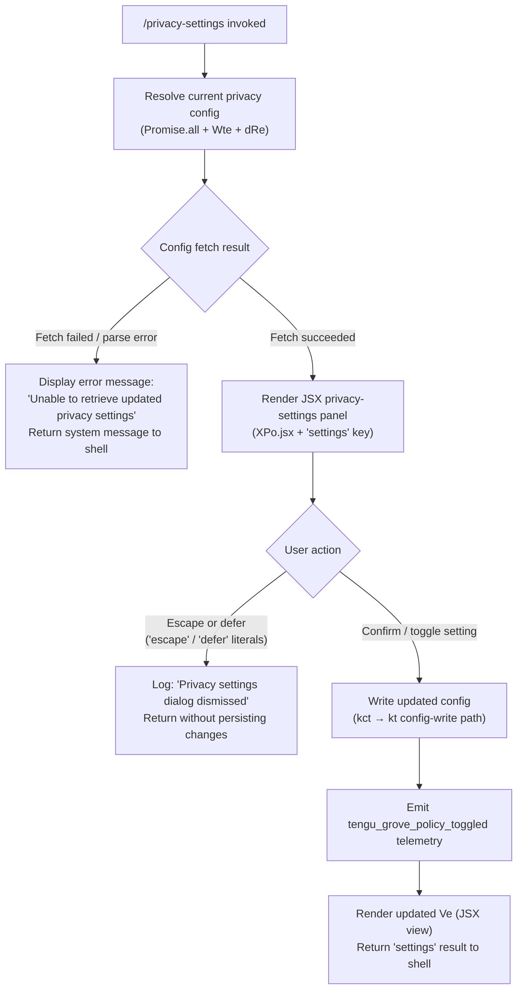

# `/privacy-settings`

> Analysis basis: CC v2.1.191 bundle.js (AST extraction + Claude interpretation)
> Minimum version: v2.1.191

---

## Overview

`/privacy-settings` is a local JSX command that opens an interactive dialog allowing users to view and modify their privacy preferences within Claude Code. The command reads the current privacy configuration, renders a JSX-based settings panel, and persists any user changes back to the global config store. A Grove policy toggle telemetry event is emitted whenever the user changes a setting.

---

## Registration

| Field | Value |
|---|---|
| type | `local-jsx` |
| name | `privacy-settings` |
| description | `View and update your privacy settings` |
| module_id | `B2l` |
| load_inline | `true` |
| loc_byte | `12598757` |
| loc_byte_end | `12598940` |
| loc_line | `8409` |
| arbor_handler.name | `txf` |
| arbor_handler.fqn | `claude-2.1.191::txf` |
| arbor_handler.kind | `AsyncFunction` |
| arbor_handler.resolution_path | `module_id` |
| arbor_handler.n_hits | `0` |

Analysis basis: CC v2.1.191 bundle.js:+12598757

---

## Input Branching

The handler has three distinct paths depending on whether the config fetch succeeds, the user dismisses the dialog, or the user confirms a setting change. A Mermaid flowchart is used accordingly.



Analysis basis: CC v2.1.191 bundle.js:+12597827 (config fetch), +12597932 (escape literal), +12597946 (defer literal), +12597957 (dismiss log literal), +12598084 (error message literal), +12598424 (JSX render call), +12598313 (telemetry emit)

---

## Behavioral Spec

### 1. Handler Entry — `txf` (privacySettingsHandler)

The Arbor-resolved handler is `txf` (AsyncFunction, resolved via `module_id` → `B2l`).

```
async function privacySettingsHandler(commandContext):
    // 1. Parallel config resolution
    [currentConfig, remoteConfig] = await Promise.all([
        fetchWritableConfig(commandContext),    // Wte
        fetchRemoteConfig(commandContext)       // dRe
    ])

    // 2. Error guard
    if fetchFailed(currentConfig, remoteConfig):
        return systemMessage("Unable to retrieve updated privacy settings")
        // literal at bundle.js:+12598084

    // 3. Render settings panel
    panelResult = await renderJSXPanel(
        currentConfig,
        remoteConfig,
        key = "settings"       // literal at bundle.js:+12598377
    )

    // 4. Branch on user action
    match panelResult.action:
        case "escape" | "defer":               // literals at +12597932, +12597946
            log("Privacy settings dialog dismissed")  // literal at +12597957
            return

        case "confirm":
            updatedConfig = panelResult.newConfig
            await writeConfig(updatedConfig)   // kct path
            emitTelemetry("tengu_grove_policy_toggled")  // +12598313
            return renderSettingsView(updatedConfig)     // Ve + XPo.jsx
```

Analysis basis: CC v2.1.191 bundle.js:+12597768 (`txf`→`kct`), +12597808 (Promise.all), +12597821 (Wte), +12597827 (dRe)

---

### 2. Config Fetch — `configLoader` (kct)

`kct` is the primary config-loading sub-function called from `txf`. It orchestrates three sub-operations:

```
async function configLoader(context):
    // a. Read current settings from disk
    rawConfig = await readSettingsFromDisk(context)    // x2e → wi → _y
    // b. Parse and validate schema
    parsedConfig = parseAndValidate(rawConfig)         // Sc → kt
    // c. Start background refresh if stale
    if isStale(parsedConfig):
        triggerBackgroundRefresh(context)              // hva

    return {
        config: parsedConfig,
        timestamp: Date.now()
    }
```

Cache-staleness strings encountered in the call graph:
- `"Grove: No cache, fetching config in background (dialog skipped this session)"` — bundle.js:+7352215
- `"Grove: Cache stale, returning cached data and refreshing in background"` — bundle.js:+7352335
- `"Grove: Using fresh cached config"` — bundle.js:+7352441

Analysis basis: CC v2.1.191 bundle.js:+7352100 (kct→x2e), +7352121 (kct→Sc), +7352160 (kct→kt), +7352295 (kct→hva)

---

### 3. Config Read Path — `settingsReader` (x2e → wi → `_y`)

```
function settingsReader(context):
    rawData = readRawConfigFile(context)     // wi → hMr (file read), gMr (parse)
    config = buildConfigObject(rawData)     // _y

    // _y inspects known fields including:
    //   ANTHROPIC_API_KEY  (literal at +3058346)
    //   apiKeyHelper       (literal at +3058371)
    //   index 0 sentinel   (literal at +3058228)

    // Subscription tier checks:
    //   "max" (literal at +3083126)
    //   "pro" (literal at +3083137)

    return config
```

Analysis basis: CC v2.1.191 bundle.js:+3083164 (x2e→wi), +3080507 (wi→hMr), +3080520 (wi→gMr), +3080530 (wi→_y), +3058066 (_y→ad)

---

### 4. Config Write Path — `configWriter` (kt / saveConfigWithLock)

When the user confirms a settings change, the write path through `kt` is invoked. This path includes lock-file management, auto-repair logic, and auth-loss prevention.

```
async function saveConfigWithLock(newConfig, context):
    lockAcquired = await acquireLock()     // Gt, C2o
    if lockContention:
        emitTelemetry("tengu_config_lock_contention")

    try:
        reRead = readFileSync(configPath, "utf-8")   // tEt, literal +13867952
        if parseError(reRead):
            // Auto-repair from in-memory cache
            emitTelemetry("tengu_config_auto_repaired")
            // logs: "saveConfigWithLock: re-read hit a parse error..." (+13865935)

        if authLostInReRead(reRead, cachedConfig):
            emitTelemetry("tengu_config_auth_loss_prevented")
            // logs: "saveConfigWithLock: re-read config is missing auth..." (+13866241)
            return   // refuse to write

        if reReadIsStale:
            emitTelemetry("tengu_config_stale_write")

        // Write with backup rotation (up to 5 backups, +13866854)
        // Backup suffix: ".backup." + Date.now() (+13866715)
        // Lock timeout: 60000 ms (+13866599)
        writeConfigAtomic(newConfig)

    finally:
        releaseLock()

    // Watch file for external changes
    registerFileWatcher(configPath)    // K9f → _Xl.unwatchFile
```

Key literals:
- `"Config accessed before allowed."` — bundle.js:+13867869 (guard error)
- `"ENOENT"` — bundle.js:+13868135 (missing-file handling)
- `"EEXIST"` — bundle.js:+13866576 (lock contention)
- Lock timeout: 60000 ms — bundle.js:+13866599
- Max backup copies: 5 — bundle.js:+13866854

Analysis basis: CC v2.1.191 bundle.js:+13864113 (kt→Gt), +13864127 (kt→Tk), +13864150 (kt→tEt), +13867863 (tEt→Error), +13867925 (tEt→readFileSync)

---

### 5. Background Refresh — `backgroundRefresher` (hva)

If the cached config is stale, `hva` triggers a background refresh without blocking the UI:

```
async function backgroundRefresher(context):
    freshConfig = await readSettingsFromDisk(context)    // kt path
    timestamp = Date.now()
    persistFreshConfig(freshConfig, context)             // gn (saveGlobalConfig)
    renderUpdate(freshConfig)                            // T
```

Analysis basis: CC v2.1.191 bundle.js:+7352531 (hva→dRe), +7352587 (hva→kt), +7352639 (hva→Date.now), +7352674 (hva→gn), +7352785 (hva→T)

---

### 6. JSX Panel Render — `settingsViewRenderer` (Ve / XPo.jsx)

The final render is produced via a JSX factory call with `key = "settings"`:

```
function renderSettingsView(config):
    return XPo.jsx(
        PrivacySettingsPanel,
        {
            config: config,
            key: "settings"       // literal at +12598377
        }
    )
    // Ve wraps eze (the underlying JSX element factory) at bundle.js:+3779
```

Analysis basis: CC v2.1.191 bundle.js:+12598374 (txf→Ve), +12598424 (txf→XPo.jsx), +3779 (Ve→eze)

---

## State & Side Effects

| Item | Detail |
|---|---|
| Telemetry: `tengu_grove_policy_toggled` | Emitted when the user changes a privacy setting (bundle.js:+12598313) |
| Telemetry: `tengu_config_lock_contention` | Emitted when config-lock acquisition takes longer than expected (bundle.js:+13865550) |
| Telemetry: `tengu_config_stale_write` | Emitted when a stale-read is detected before write (bundle.js:+13865686) |
| Telemetry: `tengu_config_auto_repaired` | Emitted when a parse error triggers auto-repair from cache (bundle.js:+13866063) |
| Telemetry: `tengu_config_auth_loss_prevented` | Emitted when a write is refused to prevent auth data loss (bundle.js:+13866393) |
| Telemetry: `tengu_config_fallback_write` | Emitted on fallback write path (bundle.js:+13865166) |
| Telemetry: `tengu_config_parse_error` | Emitted on config JSON parse failure (bundle.js:+13869283) |
| Telemetry: `tengu_api_success` | Emitted by the API layer on successful background fetches (bundle.js:+8938998) |
| Telemetry: `tengu_mcp_skills` | Emitted by MCP skill-count tracking reachable from MCP init (bundle.js:+6756547) |
| Telemetry: `tengu_lone_surrogate_sanitized` | Emitted when lone surrogates are found in API responses (bundle.js:+8938694) |
| Telemetry: `tengu_feature_ok` / `tengu_feature_bad` | Feature-flag check outcome tracking (bundle.js:+1025725, +1025792) |
| Telemetry: `tengu_context_tip_classifier_outcome` | Context-tip classifier result (bundle.js:+16672225) |
| Telemetry: `tengu_daemon_config_reload` | Daemon detects config change (bundle.js:+17386661) |
| Telemetry: `tengu_daemon_yield` | Daemon yields to foreground process (bundle.js:+17391071) |
| Telemetry: `tengu_bg_retire_pinned_low_mem` | Background worker retired under memory pressure (bundle.js:+17375231) |
| Telemetry: `tengu_bg_prewarm_per_sweep` | Background prewarm sweep count (bundle.js:+17375352) |
| Config file write | Atomic write with backup rotation to `~/.claude.json` via `tEt` / `kt` |
| File watcher registration | `_i` → `xqo.register` registers a watcher on the config file after write (bundle.js:+67562) |
| File watcher removal | `K9f` → `_Xl.unwatchFile` removes watcher on cleanup (bundle.js:+13863952) |
| Backup file creation | Up to 5 rotated backups with suffix `".backup." + timestamp` (bundle.js:+13866715, +13866854) |
| Dialog dismiss | Logs `"Privacy settings dialog dismissed"` with no config write (bundle.js:+12597957) |
| appState changes | Privacy policy toggle stored in global config; MCP state may be updated transitively via `s5e` / `Gar` paths |
| Sound | <!-- TODO: not found in depth-2 traversal; needs --depth 4 --> |

---

## Version History

| Version | Change |
|---|---|
| v2.1.191 | Initial analysis |

---

## Common Mistakes

1. **Dismissing with Escape thinking it saves** — pressing Escape or deferring the dialog logs a dismissal message and exits without persisting any changes. The policy toggle telemetry is only emitted on an explicit confirm action.
2. **Assuming the config is written synchronously** — the write path goes through a lock-acquisition step (`kt` / `tEt`) with a 60-second timeout. If another Claude instance holds the lock, the write may be delayed or fall back to a secondary write path.
3. **Ignoring auth-loss protection** — if the in-memory cache has authentication data that the on-disk re-read does not, the write is refused entirely to prevent wiping credentials. Users should not manually edit `~/.claude.json` while Claude Code is running.
4. **Expecting immediate MCP effect** — privacy settings changes may affect MCP server permissions, but MCP connections are managed asynchronously via `s5e` / `Gar` / `hGo`; changes are not guaranteed to propagate to running MCP clients before the next connection cycle.
5. **Running two Claude Code instances concurrently** — lock-contention telemetry (`tengu_config_lock_contention`) and the log message `"Lock acquisition took longer than expected - another Claude instance may be running"` indicate that parallel instances can interfere with config saves.

---

## Appendix — Identifier Mapping

> For bundle debugging only. Identifiers change across versions.

| Identifier | Role |
|---|---|
| `txf` | Privacy-settings handler (AsyncFunction, Arbor-resolved entry point) |
| `kct` | Config loader / Grove cache orchestrator |
| `x2e` | Settings reader (top-level dispatcher) |
| `wi` | Raw config file reader |
| `hMr` | Config file parse helper A |
| `gMr` | Config file parse helper B |
| `_y` | Config object builder / field extractor |
| `To` | Config field transformer |
| `rB` | Array membership check helper |
| `umi` | Config supplementary loader |
| `Sc` | Config schema parser / validator entry |
| `kt` | `saveConfigWithLock` — atomic config writer |
| `Gt` | Lock-file acquire helper |
| `C2o` | Lock-file path resolver |
| `tEt` | Inner write routine (readFileSync, mkdirSync, copyFileSync) |
| `K9f` | Config file watcher manager |
| `T` | Logger / trace emitter |
| `wNc` | Logging transport dispatcher |
| `kqo` | Log-level filter |
| `e` | Main agent loop / top-level event handler |
| `L6o` | Conversation message formatter |
| `o` | Generic iteration helper |
| `wN` | API request executor (fetch + retry) |
| `S4` | Stream event processor |
| `usm` | Usage/cost summariser |
| `hsm` | Human-readable message builder |
| `M6n` | Tool-use block finder |
| `cSt` | Context-tip send helper |
| `Re` | `tips_context_classify` telemetry emitter |
| `D6n` | Schema safe-parse wrapper |
| `we` | Feature-ok telemetry emitter |
| `Ae` | String coercion / error formatter |
| `ke` | `JSON.stringify` wrapper |
| `Dc` | Log-line path redactor |
| `h7o` | Path segment mapper |
| `a7e` | Stdout write helper |
| `s7o` | Raw stream write wrapper |
| `kNc` | Append-log writer (with rotation) |
| `Oze` | Debounced flush scheduler (setTimeout/setImmediate) |
| `Rfe` | Log file rotate helper |
| `Noe` | Directory-not-exist guard |
| `y7o` | Log file path builder |
| `nmr` | Log file rename/unlink helper |
| `RNc` | Async append-and-rotate writer |
| `_i` | File-watcher registrar |
| `hva` | Background config refresher |
| `gn` | `saveGlobalConfig` — global config persister |
| `U7t` | Config save-with-lock (main body) |
| `dOe` | Config diff helper |
| `v2o` | Config entry iterator |
| `O7t` | Config timestamp stamper |
| `P7t` | Config pre-write validator |
| `nEt` | Config field normaliser |
| `W` | Generic warning / info logger |
| `Xnr` | Config atomic-rename helper |
| `a` | MCP manager / connection orchestrator |
| `s5e` | MCP server initialiser |
| `S3` | MCP server slot processor |
| `zat` | MCP server auth-state resolver |
| `bY` | MCP server connector (per-server) |
| `B5` | MCP server SDK-kind lister |
| `kPn` | MCP config error reporter |
| `Vat` | MCP server SSE/HTTP transport builder |
| `XF` | MCP capability object factory |
| `d` | Daemon / supervisor write channel |
| `mL` | MCP client registry accessor |
| `ag` | MCP client lifecycle manager |
| `Pno` | MCP pending-connection tracker |
| `Gn` | Generic async task runner |
| `U2t` | MCP connection filter |
| `vEa` | MCP server hash / fingerprint builder |
| `Koo` | MCP cache-key builder |
| `y0e` | Config hash function (SHA-256) |
| `LAn` | Config object key hasher |
| `xAn` | Config composite hasher |
| `PT` | Hash update helper |
| `wAn` | Watcher list manager |
| `Wl` | File-change debouncer |
| `ln` | MCP debug logger |
| `ZPn` | MCP OAuth/transport connection factory |
| `xr` | MCP transport selector |
| `Cop` | MCP OAuth connection handler |
| `vop` | MCP OAuth callback handler |
| `$2t` | MCP needs-auth cache writer |
| `qs` | Async-local-storage store accessor |
| `a1n` | MCP cache file path builder |
| `Xno` | MCP connection pre-checker |
| `m` | Background worker supervisor |
| `k` | Worker write-channel helper |
| `hL` | MCP skill count tracker |
| `nt` | MCP skill registration router |
| `Dno` | MCP server include/exclude filter |
| `v` | Background worker pool manager |
| `t7` | Worker task dispatcher |
| `L` | Worker pool sweep/prewarm scheduler |
| `w` | Worker health monitor |
| `Hyc` | Worker history accessor |
| `_yc` | Worker state machine |
| `Xc` | MCP error logger |
| `kEa` | MCP result mapper (GW wrapper) |
| `GW` | Async iterable mapper |
| `xlt` | MCP port parser (parseInt, radix 10) |
| `l1n` | MCP port parser variant (parseInt, radix 20) |
| `Gar` | MCP connection result applier |
| `o5e` | MCP orphan-connection checker |
| `tI` | MCP cleanup coordinator |
| `wlt` | MCP connection config equality checker |
| `w_a` | MCP Fro-transport builder |
| `Fro` | MCP Fro transport implementation |
| `s` | Connection slot set manager |
| `i` | Connection close handler |
| `l` | Daemon status logger (rGl) |
| `rGl` | Daemon status file writer |
| `HZ` | Daemon status JSON builder |
| `ozt` | Daemon status file path resolver |
| `hGo` | MCP per-server update applier |
| `UPn` | MCP server permission checker |
| `jn` | Timeout-with-abort helper |
| `c` | Abort signal wrapper |
| `Ve` | JSX element wrapper (settings view) |
| `eze` | JSX element factory (underlying) |

---

Note: index built via Arbor fallback; some signals (telemetry, literals) may be missing — see arbor-fallback.js.