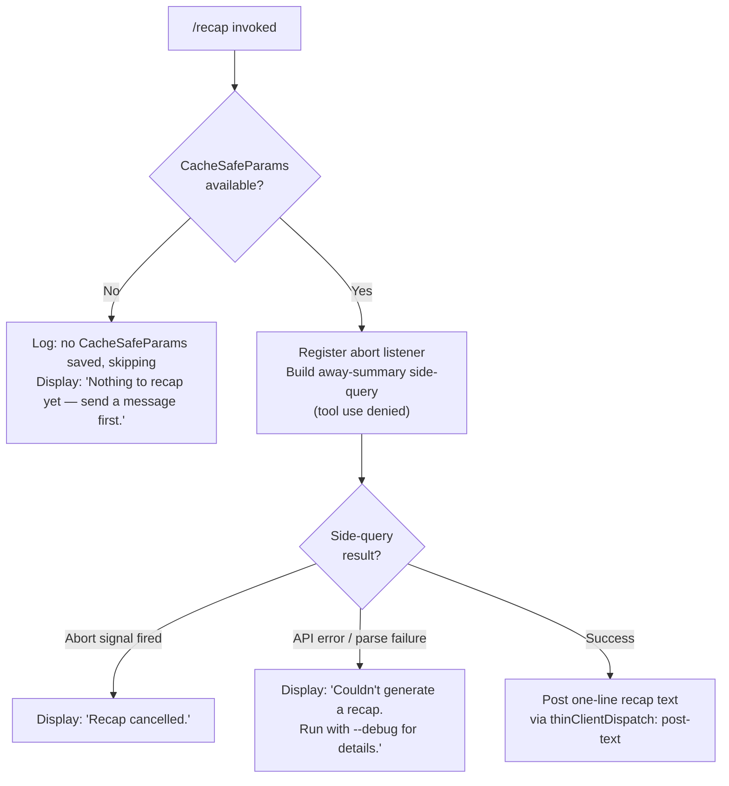

# `/recap`

> Analysis basis: CC v2.1.191 bundle.js (AST extraction + Claude interpretation)
> Minimum version: v2.1.191

---

## Overview

`/recap` generates an on-demand one-line summary of the current Claude Code session. It is implemented as an async "away summary" flow: the handler checks for cached session parameters, spawns a side-query call to the model (tool use disabled), then posts the resulting text back to the UI. If the session has no prior turns, or the operation is cancelled or fails, one of three distinct user-facing strings is displayed instead.

---

## Registration

| Field | Value |
|---|---|
| type | `local` |
| name | `recap` |
| description | `Generate a one-line session recap now` |
| loc_byte | `13106307` |
| loc_byte_end | `13106523` |
| loc_line | `8778` |
| supportsNonInteractive | `false` |
| thinClientDispatch | `post-text` |
| load_inline | `true` |
| load_ident | `JOf` |
| arbor_handler.name | `JOf` |
| arbor_handler.fqn | `claude-2.1.191::JOf` |
| arbor_handler.kind | `AsyncFunction` |
| arbor_handler.resolution_path | `load_ident` (followed inline `Promise.resolve({call: JOf})`) |
| arbor_handler.n_hits | `0` |

Analysis basis: CC v2.1.191 bundle.js:+13106307

---

## Input Branching

Four distinct outcomes exist depending on session state and operation result, requiring a Mermaid flowchart.



Analysis basis: CC v2.1.191 bundle.js:+13106057 (empty-session literal), +13106149 (cancel literal), +13106207 (error literal), +7186308 (skip-log literal)

---

## Behavioral Spec

### 1. Handler Entry — `recapCommandHandler` (`JOf`)

```
async function recapCommandHandler(context):
    result = await awayQueryOrchestrator(context)
    // result carries the recap string or a sentinel
    return result
```

The handler is an `AsyncFunction` resolved via `load_ident` path. It delegates immediately to the away-summary orchestrator.

Analysis basis: CC v2.1.191 bundle.js:+13105915 (call edge `JOf` → `gBt`)

---

### 2. Away-Summary Orchestrator — `awaySummaryOrchestrator` (`gBt`)

```
async function awaySummaryOrchestrator(context):
    // Step 1: resolve model parameters
    params = resolveModelParams(context)          // fce → Es
    if params is null:
        log("[awaySummary] no CacheSafeParams saved, skipping")
        return earlyExit("no-turn")

    // Step 2: create an AbortController; wire abort on context signal
    controller = new AbortController()
    context.signal.addEventListener("abort", () => controller.abort())

    // Step 3: run the side query
    outcome = await runSideQuery(context, params, controller.signal)   // qx

    // Step 4: emit result via flatMap consolidation
    combined = consolidateTurns(outcome)           // MTa → e.flatMap

    return combined
```

Analysis basis: CC v2.1.191 bundle.js:+7186308 (skip-log string), +7186366 (`no-turn`), +7186403 (addEventListener), +7186434 (abort), +7186501 (consolidate), +7186843 (r.find), +7186932 (MTa call)

---

### 3. Model Parameter Resolution — `resolveModelParams` (`fce` / `Es`)

```
function resolveModelParams(context):
    // Es: look up current model tier string
    tier = lookupModelTier()                      // E4 → L_, nj, jo, Na
    // Qo: normalise model alias
    alias = normaliseModelAlias(tier):
        trimmed = tier.trim()
        lower   = trimmed.toLowerCase()
        // match against known tier strings:
        // "fable", "[1m]", "opusplan", "sonnet", "haiku", "opus", "best"
        canonical = dispatchAlias(lower)           // nH, il, Dk, UFe, ev, oz, $w, S4, $j, c_, WKs
    // rH: build request params from alias
    params = buildRequestParams(alias)             // Qo, Fw
    return params
```

Tier alias literals found in implementation:
- `"fable"` (bundle.js:+2301667)
- `"[1m]"` (bundle.js:+2301718)
- `"opusplan"` (bundle.js:+2301734)
- `"sonnet"` (bundle.js:+2301779)
- `"haiku"` (bundle.js:+2301822)
- `"opus"` (bundle.js:+2301864)
- `"best"` (bundle.js:+2301902)

Analysis basis: CC v2.1.191 bundle.js:+2285395 (`Es`), +2285431 (`Qo`), +2285444 (`rH`), +2301590–2302017 (normalise chain)

---

### 4. Side-Query Execution — `runSideQuery` (`qx`)

```
async function runSideQuery(context, params, abortSignal):
    startTime = Date.now()                         // +10896897

    // Build session state snapshot
    sessionState = buildSessionState(context)      // Hjn

    // Tool-use policy: deny all tools for this call
    toolPolicy = "deny"                            // +7186599
    // log: "Away summary cannot use tools"        // +7186614

    // Check for duplicate / in-flight recap requests
    isDuplicate = checkDuplicate(context)          // _jn
    sessionId   = generateSessionId()             // sD (randomUUID / randomBytes)

    // Filter eligible tool contexts
    eligible = filterEligibleTools(context)        // Mue → m8e

    // Invoke the main query loop
    queryResult = await queryApiLoop(              // $6 → Hof
        params, sessionState, eligible, abortSignal
    )

    // Inspect result type
    switch queryResult.status:
        case "abort":
            return { kind: "cancelled", text: "Recap cancelled." }
        case "api-error":
            return { kind: "error",     text: "Couldn't generate a recap. Run with --debug for details." }
        case "ok":
            return { kind: "success",   text: queryResult.recapLine }
        case "other":
            return { kind: "error",     text: "Couldn't generate a recap. Run with --debug for details." }
```

Status string literals: `"abort"` (+7186422), `"api-error"` (+7186915), `"ok"` (+7186976), `"other"` (+7186667), `"away_summary"` (+7186682).

Analysis basis: CC v2.1.191 bundle.js:+10896897 (`Date.now`), +10897020 (`Hjn`), +10897289 (`_jn`), +10897307 (`sD`), +10897331 (`Mue`), +10897482 (`$6`)

---

### 5. Session-State Builder — `buildSessionState` (`Hjn`)

```
async function buildSessionState(context):
    // Load conversation history via getAppState
    appState = context.getAppState()               // +10893829

    // Attempt cache-load of prior params
    cacheParams = loadCacheParams(context)         // qHe → i3, t.load, e.dump

    // Build context-tip classifier signal         // Cxe
    tipClassifier = computeTipClassifier()         // pha

    // Write appState update (avoid_prompts flag)  // +10894059
    context.setAppState(updatedState)              // +10894993

    // Generate request UUID
    uuid = Qhl.randomUUID()                        // +10896276

    return { appState, cacheParams, tipClassifier, uuid }
```

Analysis basis: CC v2.1.191 bundle.js:+10893726 (`Z1`), +10893829 (`getAppState`), +10894572 (`qHe`), +10894746 (`Cxe`), +10894852 (`pha`), +10894993 (`setAppState`), +10895092 (`Object.assign`), +10895702 (`KKn`), +10895978 (`sD`)

---

### 6. Conversation Serialiser — `conversationSerialiser` (`L6o`)

```
function conversationSerialiser(messages, cache):
    // Truncate to at most 30 messages              // +16668949
    slice = messages.slice(0, 30)
    result = []
    for msg in slice:
        role = msg.role                             // "user" / "assistant"
        if role == "user":
            // include text and tool_result blocks
        if role == "assistant":
            // include text and tool_use blocks
            // label tool errors with " (error)"   // +16669486
        // Limit individual content items to 1000 chars  // +16669144
        // Pad/truncate tool name columns to fixed width
        result.push(formatted)

    // Join with cache-safe separator
    joined = result.join(", ")                     // +16670268
    return joined
```

Key constants:
- Maximum messages serialised: **30** (bundle.js:+16668949)
- Per-item character limit: **1000** (bundle.js:+16669144)
- Token budget for side query: **512** (bundle.js:+16671099)

Analysis basis: CC v2.1.191 bundle.js:+16668916–16669769

---

### 7. API Transport — `apiTransport` (`wN`)

```
async function apiTransport(requestParams):
    // Configure with side_query intent            // +8937327
    // Max tokens: 1024                            // +8937136
    // Cache control: "1h"                         // +8938216
    // Prompt caching enabled (ephemeral)          // +16670866

    response = await globalThis.fetch(endpoint)   // +8937388

    // Handle structured_outputs flag              // +8937455
    // Emit tengu_api_success on completion        // telemetry
    // Emit tengu_lone_surrogate_sanitized if needed

    return response
```

Analysis basis: CC v2.1.191 bundle.js:+8937282–8939465

---

### 8. Context-Tips Classifier Side-Effect — `contextTipClassifier` (`cSt` / `usm`)

As part of processing the side-query response the implementation also runs a context-tip classifier that:
- calls the model with intent tag `"context_tip_classifier"` (bundle.js:+16671138)
- emits telemetry `tengu_context_tip_classifier_outcome` on completion
- produces outcomes: `"tip"`, `"tip_ineligible"`, `"no_tip"`, `"none"`, `"error"`, `"parse_failure"` (bundle.js:+16671277–16672071)

This is a background side-effect of the query pipeline and does not affect the recap text returned to the user.

Analysis basis: CC v2.1.191 bundle.js:+16671138, +16672225

---

## State & Side Effects

| Item | Detail |
|---|---|
| Telemetry emitted (direct path) | `tengu_api_success` (+8938998), `tengu_lone_surrogate_sanitized` (+8938694), `tengu_context_tip_classifier_outcome` (+16672225) |
| Telemetry emitted (query loop) | `tengu_fork_agent_query`, `tengu_forked_agent_default_turns_exceeded`, `tengu_query_error`, `tengu_auto_compact_succeeded`, `tengu_auto_compact_rapid_refill_breaker`, `tengu_ptl_surfaced_to_user`, and many others via `Hof` |
| Tool use | Explicitly denied for the recap side-query (`"deny"`, +7186599); logged as `"Away summary cannot use tools"` (+7186614) |
| AbortController | Registered on context signal; fires `"abort"` sentinel (+7186422) |
| appState changes | `avoid_prompts` flag written to appState during session-state build (+10894059); `setAppState` called (+10894993) |
| thinClientDispatch | `"post-text"` — result text is posted to the thin-client render pipeline |
| Sound | `<!-- TODO: not found in depth-2 traversal; needs --depth 4 -->` |
| Hook registration | `_i` → `xqo.register` (+67562) called within the transcript-writer path (`kNc`); this is a general logging hook, not recap-specific |
| Session UUID | Generated via `Qhl.randomUUID` (+10896276) and `sD` (randomBytes, +27987) |

---

## Version History

| Version | Change |
|---|---|
| v2.1.191 | Initial analysis |

---

## Common Mistakes

1. **Running `/recap` with no prior messages**: if no conversation turns exist, the command silently exits with `"Nothing to recap yet — send a message first."` — this is expected behaviour, not a bug.
2. **Expecting tool results in the recap**: the recap side-query explicitly denies all tool use; tool call history is serialised as plain text, not re-executed.
3. **Assuming `/recap` works non-interactively**: `supportsNonInteractive: false` — the command must be invoked from an interactive REPL session.
4. **Confusing `thinClientDispatch: "post-text"` with streaming**: the recap result is posted as a single text event, not streamed incrementally.
5. **Interpreting a debug-mode error as a crash**: `"Couldn't generate a recap. Run with --debug for details."` is a graceful fallback for API errors; re-running with `--debug` provides the underlying cause.

---

## Appendix — Identifier Mapping

> For bundle debugging only. Identifiers change across versions.

| Identifier | Role |
|---|---|
| `JOf` | `recapCommandHandler` — async entry point for `/recap` (Arbor-resolved handler) |
| `gBt` | `awaySummaryOrchestrator` — top-level away-summary coordinator |
| `fce` | `modelParamResolver` — resolves model parameters for the side-query |
| `Es` | `modelTierLookup` — retrieves current model tier |
| `E4` | `tierComponents` — decomposes model tier into sub-fields |
| `L_` | `tierSubField0` — tier component accessor |
| `nj` | `tierSubField1` — tier component accessor |
| `jo` | `tierSubField2` — tier component accessor |
| `Na` | `tierSubField3` — tier component accessor |
| `Qo` | `modelAliasNormaliser` — trims and lowercases tier string, dispatches to canonical alias |
| `rH` | `requestParamsBuilder` — builds final request params from canonical alias |
| `Fw` | `requestParamsFinisher` — completes request params struct |
| `T` | `transcriptFormatter` — formats conversation turns for the prompt |
| `wNc` | `transcriptWriter` — writes formatted transcript |
| `kqo` | `transcriptWriterHelper` — helper for transcript writer |
| `e` | `mainSideQueryFunction` — drives the overall side-query lifecycle |
| `L6o` | `conversationSerialiser` — serialises conversation history (max 30 messages, 1000 chars/item) |
| `o` | `paddingFormatter` — pads column-aligned tool names |
| `wN` | `apiTransport` — HTTP fetch wrapper for model API calls |
| `S4` | `modelAliasDispatcher` — dispatches normalised alias to model selector |
| `usm` | `contextTipClassifierEntry` — invokes the context-tip classifier side-query |
| `csm` | `contextTipClassifierCore` — core classifier logic |
| `hsm` | `recapStringBuilder` — assembles recap text parts via push/join |
| `M6n` | `toolUseBlockFinder` — finds tool_use block in response |
| `cSt` | `featureOkReporter` — reports successful feature outcome |
| `Re` | `featureBadReporter` — reports failed feature outcome |
| `D6n` | `schemaSafeParser` — runs Zod safeParse on classifier response |
| `we` | `featureOkEmitter` — emits `tengu_feature_ok` event |
| `Ae` | `stringCoercer` — coerces value to String |
| `ke` | `jsonStringifier` — wraps `JSON.stringify` |
| `Dc` | `modelNameNormaliser` — normalises raw model name string |
| `h7o` | `modelNameMapHelper` — maps over known model name prefixes |
| `a7e` | `transcriptWriteDispatcher` — dispatches write call |
| `s7o` | `rawStreamWriter` — low-level `e.write` wrapper |
| `kNc` | `transcriptFileWriter` — writes transcript to file (mkdir, appendFile, rotate) |
| `Oze` | `debouncedFlusher` — debounced flush with clearTimeout/setTimeout/setImmediate |
| `Rfe` | `filePathBuilder` — builds transcript file path |
| `Gt` | `transcriptDirResolver` — resolves transcript directory |
| `Noe` | `dirNameHelper` — filesystem directory-name helper |
| `y7o` | `joinPathHelper` — path.join wrapper |
| `nmr` | `fileRotator` — renames/unlinks old transcript files |
| `RNc` | `appendAndRotate` — mkdir + appendFile + rotate |
| `_i` | `hookRegistrar` — registers hooks via `xqo.register` |
| `qx` | `runSideQuery` — executes the recap side-query including session-state build |
| `Hjn` | `buildSessionState` — assembles appState snapshot for side-query |
| `Z1` | `messageLookup` — looks up message list from state |
| `qHe` | `cacheParamLoader` — loads/dumps cache-safe params |
| `Cxe` | `contextTipSignalComputer` — computes context-tip classifier input signal |
| `pha` | `avoidPromptsFlag` — sets `avoid_prompts` in appState |
| `a` | `appStateAccessor` — reads/writes app state fields |
| `KKn` | `sessionStateAssembler` — assembles final session state object |
| `sD` | `idGenerator` — generates IDs via randomBytes/randomUUID |
| `_jn` | `duplicateChecker` — checks for duplicate in-flight recap requests |
| `Mue` | `eligibleToolFilter` — filters tool contexts eligible for side-query |
| `Fc` | `toolContextRegistrar` — registers tool context |
| `m8e` | `toolEligibilityFilter` — filters by `ant` prefix and eligibility flags |
| `$6` | `queryApiLoopEntry` — entry point for the main API query loop |
| `Hof` | `queryApiLoop` — full query/streaming/tool-drain/fallback loop |
| `Jqn` | `subagentExitHandler` — handles subagent exit signals |
| `O0` | `stateResetHelper` — resets ephemeral state |
| `ije` | `sideQueryFlagChecker` — checks `SBp` flag set for side queries |
| `nre` | `noRetryGuard` — prevents retry in specific conditions |
| `XKn` | `contextWindowManager` — manages context window sizing |
| `BVa` | `sideQueryValidator` — validates side-query prerequisites |
| `f` | `daemonDispatcher` — background session dispatcher |
| `W` | `warningEmitter` — emits warning messages |
| `D` | `daemonProcess` — low-level daemon process manager |
| `jn` | `timeoutWrapper` — setTimeout/clearTimeout wrapper |
| `Yer` | `macosNotifier` — macOS-specific notification helper |
| `I3e` | `tempFileCleaner` — lstat/rm/readFile for temp file cleanup |
| `Le` | `errorLogger` — logs errors via `GQ.logError` |
| `F` | `retireSettledHelper` — retires settled background tasks |
| `nt` | `taskRegistry` — manages registered background tasks |
| `Mjo` | `daemonSpawner` — spawns daemon via `eq.spawn` / socket |
| `Fjo` | `sessionLifecycleManager` — manages session state.json lifecycle |
| `s` | `sessionStateWriter` — writes session state (shares edges with Fjo) |
| `p` | `shutdownHandler` — handles forced shutdown / `process.exit` |
| `dn` | `directoryEnsurer` — ensures directory exists |
| `Pe` | `errorPresenter` — renders errors to UI |
| `Aue` | `toolSetFilter` — filters active tool sets |
| `GA` | `toolSetRegistry` — registry of available tool sets |
| `_Bp` | `toolSetFinder` — finds tool set by predicate |
| `kof` | `recapResultPresenter` — presents recap result to the thin-client |
| `Tr` | `nonconformingResponseHandler` — handles non-conforming model responses |
| `Dn` | `sideQueryUUIDGenerator` — generates UUID for side-query session |
| `_` | `statePartialUpdater` — applies partial state updates |
| `y` | `teammateMailboxDispatcher` — dispatches to teammate mailbox |
| `PGe` | `teammateMailboxMarkRead` — marks mailbox messages as read (locking) |
| `MTa` | `turnConsolidator` — consolidates multi-turn results via flatMap |

---

Note: index built via Arbor fallback; some signals (telemetry, literals) may be missing — see arbor-fallback.js.