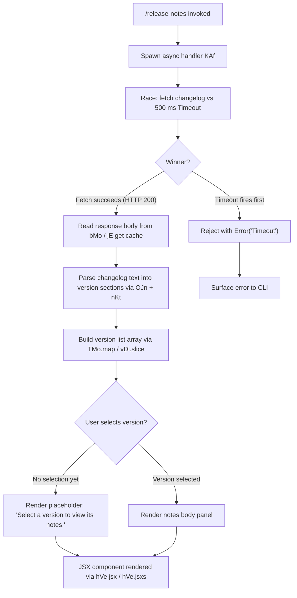

# `/release-notes`

> Analysis basis: CC v2.1.191 bundle.js (AST extraction + Claude interpretation)
> Minimum version: v2.1.191

---

## Overview

The `/release-notes` command opens an interactive release-notes viewer within the Claude Code CLI terminal UI. It fetches or reads the `changelog.md` file, parses it into per-version sections, renders a two-panel JSX component (version list on the left, notes body on the right), and races the fetch operation against a 500 ms timeout to keep the UI responsive.

---

## Registration

| Field | Value |
|---|---|
| type | `local-jsx` |
| name | `release-notes` |
| description | `View release notes` |
| loc_byte | `12171205` |
| loc_byte_end | `12171346` |
| loc_line | `8019` |
| module_id | `LDl` |
| load_inline | `true` |
| arbor_handler.name | `KAf` |
| arbor_handler.fqn | `claude-2.1.191::KAf` |
| arbor_handler.kind | `AsyncFunction` |
| arbor_handler.resolution_path | `module_id` |
| arbor_handler.n_hits | `0` |

Analysis basis: CC v2.1.191 bundle.js:+12171205

---

## Input Branching

The command has three or more distinct execution paths (timeout race, successful fetch/parse, and render state transitions), so a Mermaid flowchart is used.



Analysis basis: CC v2.1.191 bundle.js:+12169521 (setTimeout/race), +12169571 (Promise.race), +12169585 (bMo fetch), +12170515 (placeholder string)

---

## Behavioral Spec

### 1. Top-Level Async Handler (`KAf`)

```
async function releaseNotesHandler(context):
    timeoutPromise = new Promise((_, reject) =>
        setTimeout(() => reject(new Error("Timeout")), 500)
    )
    fetchPromise = fetchChangelog(context)           // bMo
    result = await Promise.race([fetchPromise, timeoutPromise])
    versionData = parseChangelog(result)             // OJn
    return renderReleaseNotesJSX(versionData)        // hVe.jsx
```

Analysis basis: CC v2.1.191 bundle.js:+12169521, +12169539, +12169557, +12169571

Timeout constant: **500 ms** (bundle.js:+12169557)

---

### 2. Changelog Fetch (`bMo`)

```
async function fetchChangelog(context):
    configPath = resolveConfigPath(context)          // xr
    cacheKey   = "cache"                             // literal "cache"
    fileName   = "changelog.md"                     // literal "changelog.md"
    cached = jE.get(cacheKey)
    if cached and response.status == 200:            // 200 literal
        return cached
    dirName = eKt.dirname(configPath)
    timestamp = Date.now()
    rawText = readChangelogFile(dirName, fileName)   // gn (config-store writer / reader)
    return rawText
```

Analysis basis: CC v2.1.191 bundle.js:+12166406 (xr), +12166160 ("cache"), +12166168 ("changelog.md"), +12166451 (jE.get), +12166475 (status 200), +12166540 (eKt.dirname), +12166590 (Date.now)

---

### 3. Changelog Parsing (`OJn` + `nKt`)

```
function parseChangelog(rawText):
    sections = {}
    lines = splitAndTrim(rawText)                   // nKt: e.split, r.trim
    currentVersion = null
    for line in lines:
        header = extractVersionHeader(line)          // yi: indexOf + slice
        if header:
            currentVersion = header
            sections[currentVersion] = []
        elif currentVersion:
            bullet = parseBulletLine(line)           // " - " separator, "- " prefix
            sections[currentVersion].push(bullet)
    filteredKeys = Object.keys(sections).filter(...)
    return { keys: filteredKeys, sections }
```

Analysis basis: CC v2.1.191 bundle.js:+12167484 (OJn/PJn), +12167501 (nKt), +12166845 (e.split), +12166894 (r.trim), +12166971 (yi), +12167515 (Object.keys), +12167615 (o.filter), +12166976 (" - "), +12167054 ("- ")

---

### 4. Version List Preparation (`TMo` / `vDl`)

```
function buildVersionList(parsedSections):
    allVersions = parsedSections.keys.map(formatVersionEntry)  // TMo: t.map
    visible = allVersions.slice(startIndex, endIndex)          // vDl: e.slice
    return { allVersions, visible, totalCount: allVersions.length }
```

"Show all" toggle string is present in literals.
Analysis basis: CC v2.1.191 bundle.js:+12169321 (TMo / t.map), +12169396 (vDl / e.slice), +12169422 (SA reference), +12169893 ("Show all")

---

### 5. JSX Render Component (`wDl`)

```
function ReleaseNotesComponent(props):
    { versions, sections } = props
    [selectedVersion, setSelectedVersion] = useState(null)

    // Left panel: version list
    leftPanel = versions.map(v =>
        <VersionEntry key={v} onClick={() => setSelectedVersion(v)} />
    )                                                           // wDl: n.map

    // Right panel: notes body
    if selectedVersion == null:
        rightPanel = <Text>"Select a version to view its notes."</Text>
    else:
        noteLines = sections[selectedVersion]
        rightPanel = <NoteBody lines={noteLines} />            // wDl: n.find

    return (
        <Box flexDirection="column">           // "column" layout
            <Text bold>"Release notes"</Text>  // header
            <Box>
                {leftPanel}
                {rightPanel}
            </Box>
        </Box>
    )
```

Layout direction: `"column"` (bundle.js:+12170450)
Header label: `"Release notes"` (bundle.js:+12170866)
Placeholder text: `"Select a version to view its notes."` (bundle.js:+12170515)

Analysis basis: CC v2.1.191 bundle.js:+12169814 (CDl.c), +12169991 (n.map), +12170096 (vDl), +12170136 (n.find), +12170216 (TMo), +12170383 (Symbol.for), +12170425 (hVe.jsx), +12170847 (hVe.jsxs)

---

### 6. Traffic / Priority Classification (`Yi` / `ncs`)

```
function classifyRequestTraffic(request):
    if request matches "essential-traffic" tag:    // "essential-traffic"
        return priorityEssential
    if request matches "no-telemetry" tag:         // "no-telemetry"
        return noTelemetryMode
    return default
```

These tags appear in the call path through `bMo → Yi → ncs`.
Analysis basis: CC v2.1.191 bundle.js:+12166421 (Yi), +1055031 (ncs), +1054867 ("essential-traffic"), +1054926 ("no-telemetry")

---

## State & Side Effects

| Item | Detail |
|---|---|
| Telemetry | No `tengu_*` events were found scoped directly to the `/release-notes` handler path within depth-2 traversal. General platform events (e.g., `tengu_api_success`, `tengu_config_lock_contention`) may fire if underlying config/fetch utilities are exercised. |
| Cache | Response is cached under the key `"cache"` (literal at bundle.js:+12166160) inside the `jE` map; HTTP 200 responses are stored and returned on subsequent invocations. |
| File I/O | Reads `changelog.md` via `eKt.dirname` + config-store path resolution (`gn` / `U7t`); no writes. |
| Hook registration | <!-- TODO: not found in depth-2 traversal; needs --depth 4 --> |
| appState changes | Selected-version state is local to the rendered JSX component; no global `appState` mutations observed. |
| Sound | None detected. |
| Timeout | A 500 ms hard timeout (`Promise.race`) is applied to the changelog fetch; exceeding it raises `Error("Timeout")`. |
| React memo cache | `Symbol.for("react.memo_cache_sentinel")` used in render component (bundle.js:+12170394), indicating React compiler memoization. |

---

## Version History

| Version | Change |
|---|---|
| v2.1.191 | Initial analysis |

---

## Common Mistakes

1. **Expecting real-time network data**: The changelog is read from a bundled or cached local file (`changelog.md`), not fetched from a live URL at runtime. Users expecting the latest online notes may see an older cached copy.
2. **Invoking in non-interactive (pipe/CI) environments**: The command renders a JSX/Ink component that requires a TTY. Running it in a non-TTY context (e.g., `echo "/release-notes" | claude`) will likely produce garbled output or an error.
3. **Slow filesystem causing timeout**: The fetch/read operation is raced against a **500 ms** timeout. On very slow network drives or containers with high I/O latency, the command may silently fail with a `Timeout` error before the changelog is read.
4. **Assuming all versions are immediately visible**: The version list uses `slice` to limit the initially displayed entries. Selecting "Show all" is required to see the complete history.

---

## Appendix — Identifier Mapping

> For bundle debugging only. Identifiers change across versions.

| Identifier | Role |
|---|---|
| `KAf` | Top-level async handler for `/release-notes` (arbor_handler) |
| `bMo` | Changelog fetch / cache-read helper |
| `AMo` | Config path joiner (`eKt.join`) |
| `tKt` | Secondary path resolver used by handler |
| `OJn` | Changelog text parser (top-level) |
| `PJn` | Inner changelog section builder |
| `nKt` | Line splitter / trimmer for changelog parsing |
| `yi` | Version header extractor (indexOf + slice) |
| `TMo` | Version list mapper (`t.map`) |
| `vDl` | Version list slicer (`e.slice`) |
| `wDl` | Release-notes JSX render component |
| `SA` | Shared state / signal accessor used by parser and renderer |
| `Yi` | Request traffic classifier |
| `ncs` | Traffic tag constants helper |
| `qs` | AsyncLocalStorage context store accessor (`EWu.getStore`) |
| `gn` | Config-store file writer/reader (used to read changelog) |
| `U7t` | Low-level config file I/O with lock and backup logic |
| `tEt` | File read helper with parse and copy logic |
| `R2o` | Backup directory path builder |
| `Rvt` | Atomic file-write utility (rename + fsync) |
| `T` | HTTP header / request builder utility |
| `xr` | Config path resolver |
| `ke` | JSON.stringify wrapper |
| `wN` | API call orchestrator (side-query path) |
| `oW` | Anthropic SDK HTTP client builder |
| `hVe` | JSX/React runtime (`jsx`, `jsxs`) |
| `Le` | Logging / error-reporting helper |
| `fo` | Error constructor wrapper |
| `rt` | String conversion utility |
| `_r` | React component base / render helper |
| `eze` | Ink/React component primitive |
| `Pe` | Ink Box/Text primitive wrapper |
| `Ooe` | Node-type / agent-kind classifier |
| `L6o` | Conversation context formatter |
| `gsm` | Context map setter |
| `msm` | Auto-classifier input builder |
| `har` | Unicode / surrogate-pair handler |
| `hx` | Character-code surrogate detector |
| `Cs` | CLI error exit handler (`process.exit`) |

---

Note: index built via Arbor fallback; some signals (telemetry, literals) may be missing — see arbor-fallback.js.