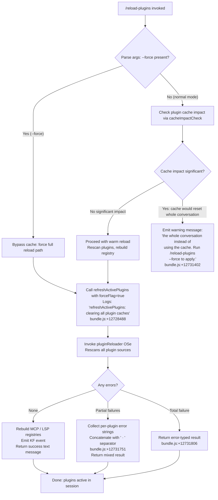

# `/reload-plugins`

> Analysis basis: CC v2.1.191 bundle.js (AST extraction + Claude interpretation)
> Minimum version: v2.1.191

---

## Overview

`/reload-plugins` activates pending plugin changes in the current session by rescanning all plugin sources, rebuilding the plugin registry, and reconnecting MCP servers — without requiring a full session restart. It optionally accepts `--force` to bypass the plugin cache and force a cold reload of the entire conversation context.

---

## Registration

| Field | Value |
|---|---|
| type | `local` |
| name | `reload-plugins` |
| description | `Activate pending plugin changes in the current session` |
| argumentHint | `[--force]` |
| supportsNonInteractive | `false` |
| thinClientDispatch | `control-request` |
| module_id | `S9l` |
| load_inline | `true` |
| loc_byte | `12732819` |
| loc_byte_end | `12733063` |
| loc_line | `8612` |
| arbor_handler.name | `P0f` |
| arbor_handler.fqn | `claude-2.1.191::P0f` |
| arbor_handler.kind | `AsyncFunction` |
| arbor_handler.resolution_path | `module_id` |
| arbor_handler.n_hits | `0` |

Analysis basis: CC v2.1.191 bundle.js:+12732819

---

## Input Branching

The command has 4+ distinct paths based on the `--force` flag and the current plugin/cache state. A Mermaid flowchart is used.



Analysis basis: CC v2.1.191 bundle.js:+12731517, +12731535, +12731613, +12731903, +12731939, +12731954, +12732017, +12732177, +12732249

---

## Behavioral Spec

### Main handler (`P0f`)

```
async function reloadPluginsHandler(context):
    // 1. Parse the raw argument string
    trimmedArgs = context.args.trim()                  // bundle.js:+12731903

    // 2. Detect --force flag
    forceFlag = trimmedArgs includes "--force"          // literals: "--force" @ +12731939
                                                       //           "force"   @ +12731954

    // 3. Retrieve current session app state
    appState = context.getAppState()                   // bundle.js:+12732017

    // 4. Check cache impact of a warm reload
    cacheImpactResult = checkReloadCacheImpact(appState)  // y9l @ +12731971

    // 5. Emit telemetry for cache impact
    emit tengu_reload_plugins_cache_impact(cacheImpactResult)  // +12730811

    // 6. If cache would clear the whole conversation AND --force not set:
    if cacheImpactResult.significant AND NOT forceFlag:
        return warningMessage(
            "the whole conversation instead of using the cache. " +
            "Run /reload-plugins --force to apply."              // +12731402
        )

    // 7. Perform the reload
    reloadResult = await refreshActivePlugins(appState, forceFlag)  // OSe @ +12732249
    // OSe logs "refreshActivePlugins: clearing all plugin caches"  // +12728488

    // 8. Build plugin state update (dSe)
    pluginStateUpdate = await buildPluginState(appState)  // dSe @ +12732281

    // 9. Collect any per-plugin errors/warnings (Kae)
    errorSummary = assembleErrorSummary(reloadResult)  // Kae @ +12732324

    // 10. Format and return result
    if errorSummary is empty:
        return { type: "text", content: successMessage }  // "text" @ +12731881
    else:
        joinedErrors = errorSummary.join(" · ")           // " · " @ +12731751
        if allFailed:
            return { type: "error", content: joinedErrors }  // "error" @ +12731806
        else:
            return { type: "text", content: joinedErrors }
```

Analysis basis: CC v2.1.191 bundle.js:+12731517, +12731535, +12731613, +12731903, +12731939, +12731954, +12732017, +12732123, +12732177, +12732249, +12732281, +12732324

---

### Cache impact assessment (`y9l`)

```
function checkReloadCacheImpact(appState):
    // Inspect current plugin fingerprints vs loaded state
    // Checks t.has / n.has for plugin registry membership   // +12730585, +12730624
    // Evaluates version vectors via lP (uUt, HXr)           // +12730668
    // Determines if reload would invalidate caches          // +12730674 (V7)

    // Returns object with:
    //   - significant: boolean (would wipe whole-conversation cache)
    //   - affectedPlugins: list of changed plugin identifiers
```

Analysis basis: CC v2.1.191 bundle.js:+12730535, +12730585, +12730624, +12730668, +12730674, +12730695

---

### Warm/forced plugin refresh (`OSe` — `refreshActivePlugins`)

```
async function refreshActivePlugins(appState, force):
    if force:
        clearAllPluginCaches()   // lyl: "Cleared installed plugins cache" @ +12728488, +11090620
        clearSkillIndexCache()   // s6.clearSkillIndexCache @ +13319529

    // Rescan plugin root directories
    pluginEntries = await loadPluginManifests(appState)   // xte @ +12728792

    // Resolve skill/agent/MCP plugin subsets
    skillPlugins  = filterByKind(pluginEntries, "skill")   // "skill"  @ +12731664
    agentPlugins  = filterByKind(pluginEntries, "agent")   // "agent"  @ +12731692
    mcpPlugins    = filterByKind(pluginEntries, "plugin")  // "plugin" @ +12731633

    // Parallel load
    results = await Promise.all([
        loadMcpPlugins(mcpPlugins),     // Bno/Nwo/Owo @ callGraph
        loadSkillPlugins(skillPlugins),
        loadAgentPlugins(agentPlugins),
    ])

    // Emit plugin state change event
    appStateEmitter.emit(KF_event)      // KF.emit @ +12729595

    return assemblePluginLoadResult(results)
```

Analysis basis: CC v2.1.191 bundle.js:+12728486, +12728488, +12728540, +12728546, +12728551, +12728569, +12728574, +12728595, +12728608, +12728614, +12728617, +12728792, +12729595, +13319529

---

### Plugin state builder (`dSe`)

```
async function buildPluginState(appState):
    // Read marketplace registry (wM/Bf)         // +11874671, +11061813
    marketplaceData = await readMarketplaceFile()

    // Walk installed plugins (D3e, In, z2)      // +11874694
    installedPlugins = scanInstalledPluginEntries()

    // Build per-plugin hook/LSP registrations   // nI, J2t @ +11874811
    hookRegistrations = assembleHooks(installedPlugins)
    lspRegistrations  = assembleLspServers(installedPlugins)

    // Resolve dependency graph (Z8t subtree)    // +11875346
    depGraph = resolveDependencyGraph(installedPlugins)

    // Detect blocked-by-policy entries           // "blocked-by-policy" @ +11109611
    // Detect version conflicts
    // Return consolidated state
    return { hookRegistrations, lspRegistrations, depGraph, errors }
```

Analysis basis: CC v2.1.191 bundle.js:+11874509, +11874545, +11874567, +11874671, +11874678, +11874694, +11874698, +11874746, +11874778, +11874788, +11874811, +11874828, +11875049, +11875291, +11875329, +11875346

---

### Error summary assembly (`Kae`)

```
function assembleErrorSummary(loadResult):
    // Maps each per-plugin error to a human-readable string
    errorLines = loadResult.errors.map(err => formatPluginError(err))  // +4338073
    // Uses "as" helper for scope checking                               // +4338084
    return errorLines.join(" · ")                                       // +4338110 (r.join)
```

Analysis basis: CC v2.1.191 bundle.js:+12732324, +4338073, +4338084, +4338110, +4338126, +4338178

---

### Plugin load orchestration (`Nwo`)

```
async function loadAllMcpPlugins(mcpServerDefs):
    // Initialise sets: loaded (f), pending (h), failed (d)
    results = await Promise.all(mcpServerDefs.map(loadOneMcpServer))
    // Filter ineffective-disable cases           // "ineffective-disable" @ +11167427
    // Collect telemetry strings:
    //   "plugin_load_all"           @ +11167542
    //   "plugin_load_total_failure" @ +11167560
    //   "plugin_load_partial_failures" @ +11167629
    // Guard against stale early-kick:
    //   "assemblePluginLoadResult: originalCwd changed mid-scan; skipping..." @ +11167695
    return assemblePluginLoadResult(results)
```

Analysis basis: CC v2.1.191 bundle.js:+11166221, +11166553, +11166802, +11167387, +11167427, +11167500, +11167542, +11167560, +11167629, +11167695

---

### Dependency resolution (`Z8t` subtree)

The handler validates plugin dependency graphs at reload time.

```
function resolveDependencyGraph(plugins):
    for each plugin in plugins:
        validateSemverConstraints(plugin.dependencies)   // uxn, T1t
        checkCrossMarketplaceRefs(plugin)                // q3i "cross-marketplace" @ +4334870
        detectCycles(plugin)                             // q3i "cycle" @ +4334954
        checkBlockedByPolicy(plugin)                     // "dependency-blocked-by-policy" @ +11110976
    return resolved

// Error codes produced (literals found in callGraph):
//   "resolution-failed"                     @ +11110857
//   "dependency-blocked-by-policy"          @ +11110976
//   "dependency-marketplace-blocked-by-policy" @ +11111090
//   "range-conflict"                        @ +11113288
//   "no-matching-tag"                       @ +11113585
//   "installed-unsatisfied"                 @ +11115287
```

Analysis basis: CC v2.1.191 bundle.js:+11109576, +11110091, +11110636, +11110685, +11110857, +11110976, +11111090, +11113288, +11113363, +11113585, +11115287

---

## State & Side Effects

| Item | Detail |
|---|---|
| Telemetry | `tengu_reload_plugins_cache_impact` (+12730811) — fired once per invocation with cache impact details |
| Telemetry | `tengu_plugin_state_file_error` (+11090799) — fired when plugin state file read fails |
| Cache clear | When `--force` used or warm reload proceeds: installed-plugin cache and skill-index cache are cleared (`lyl` logs "Cleared installed plugins cache" @ +11090620; `s6.clearSkillIndexCache` @ +13319529) |
| AppState changes | `KF.emit` (+12729595) broadcasts plugin registry update to live session; MCP server slots are reconnected (`he`/`WEa` path) |
| Hook registration | Plugin hooks re-registered after reload via `nI`/`J2t` path (+11874811) |
| LSP servers | LSP configurations rebuilt via `Z8t`→`Q8t`→`Uht` path (+11875346); old LSP processes retired |
| Plugin MCP server | MCP connections re-established for "plugin MCP server" entries ("plugin MCP server" @ +12731724) |
| Hook registration for LSP | Logged as "hook" (+12732498) and "plugin LSP server" (+12732557) in result messages |
| Non-interactive | Not supported (`supportsNonInteractive: false`) |
| Thin client | Dispatched as `control-request` to the background daemon |

---

## Version History

| Version | Change |
|---|---|
| v2.1.191 | Initial analysis |

---

## Common Mistakes

1. **Omitting `--force` when plugin files changed on disk but the cache reports no diff.** The warm reload checks cache impact first; if the impact analysis decides the change is modest, it may silently skip a full reload. Use `--force` to guarantee a cold rescan.
2. **Running `/reload-plugins` in non-interactive (script) mode.** The command sets `supportsNonInteractive: false`; it will not execute in headless pipelines.
3. **Expecting immediate LSP server startup.** LSP servers are re-initialised asynchronously after the reload; tool calls that require LSP may fail transiently for a short period after the command returns.
4. **Ignoring the cache-impact warning.** If the command replies with a warning that reloading would reset the whole conversation cache, the reload is intentionally blocked until `--force` is supplied.
5. **Assuming partial-failure means complete failure.** The command returns a `text`-type response even when some plugins fail (separated by " · "); only a *total* failure produces an `error`-type response.

---

## Appendix — Identifier Mapping

> For bundle debugging only. Identifiers change across versions.

| Identifier | Role |
|---|---|
| `P0f` | Main handler (`reloadPluginsHandler`), async |
| `YS` | Argument parser / input validator |
| `Vu` | Inner arg parsing utility |
| `W1e` | Character-level arg tokeniser |
| `TJ` | Reload context builder |
| `An` | Session/context accessor |
| `L6o` | Conversation history serialiser |
| `gsm` | Cache token-set builder |
| `msm` | Auto-classifier input converter |
| `wN` | Core API request executor |
| `oW` | HTTP client / request builder |
| `y9l` | Cache impact assessment |
| `lP` | Plugin version vector loader |
| `uUt` | Plugin version parser |
| `HXr` | `auto:` version-range parser |
| `V7` | Plugin kind classifier |
| `c5d` | Installed-plugin enumerator |
| `E9l` | App-state snapshot accessor |
| `O0f` | Argument splitter (n.split) |
| `OSe` | `refreshActivePlugins` — full rescan orchestrator |
| `lyl` | Plugin-cache clearer ("Cleared installed plugins cache") |
| `Qg` | Plugin registry assembler |
| `Xif` | Plugin-slot resolver |
| `xv` | Plugin slot state machine |
| `IR` | Skill-index reload coordinator |
| `s6` | Skill-index cache flush |
| `L5` | M8t cache clear |
| `xte` | Manifest loader / plugin-root walker |
| `h8` | File-extension detector (`.mcpb` / `.dxt`) |
| `Cno` | Plugin config file reader |
| `k$t` | MCPB archive extractor and manifest parser |
| `cga` | Plugin-status aggregator |
| `a5e` | LSP config loader (`.lsp.json`) |
| `icp` | LSP config parser / path validator |
| `f1n` | LSP extension-conflict detector |
| `M0f` | Skill-plugin filter |
| `D0f` | Agent-plugin filter |
| `rGl` | Daemon-status aggregator |
| `dSe` | Plugin state builder |
| `wM` | Marketplace file reader |
| `Bf` | Known-marketplaces.json reader |
| `qzn` | Ad.join path helper |
| `D3e` | Installed plugin entry enumerator |
| `In` | Plugin transport factory |
| `vln` | Plugin transport initialiser |
| `z2` | Plugin runtime context builder |
| `Xk` | Managed-scope guard |
| `as` | Scope string parser |
| `nI` | Hook registration assembler |
| `WAa` | Git URL parser |
| `J2t` | Hook dispatcher builder |
| `N1n` | Hook list resolver |
| `T8` | Plugin transport "In" alias |
| `zAa` | Hook validation router |
| `rG` | Marketplace.json reader |
| `j8t` | Plugin root path builder |
| `Swo` | Marketplace schema validator |
| `LR` | Full plugin loader (bwo + Bf path) |
| `bwo` | Settings-local plugin reader |
| `d_f` | Plugin dependency filter |
| `Z8t` | Dependency graph resolver and plugin state machine |
| `_L` | Plugin transport "In" alias (policy check) |
| `n7n` | Policy-check decorator (as + nI) |
| `Awt` | Local-source path guard ("./") |
| `vM` | Plugin disk state loader |
| `Two` | Plugin config readFileSync |
| `Iwo` | Plugin entry iterator |
| `K8t` | Plugin cache updater |
| `Dt` | Context store accessor (Bin.getStore) |
| `Gin` | Store retriever |
| `vk` | Flag-settings registry manager |
| `JD` | Scope/Bx dependency validator |
| `uxn` | Semver constraint validator (v7) |
| `T1t` | Semver range resolver |
| `Zqr` | Semver range formatter |
| `Zzn` | Git-subdir plugin loader |
| `Lwo` | fLe sub-source loader |
| `X8t` | Lwo alias |
| `t7n` | npm/git tag resolver |
| `Nn` | Plugin runtime initialiser (Kr + Dt) |
| `e7n` | Source replace / patch transformer |
| `Q8t` | Plugin install/update orchestrator |
| `Uht` | Plugin archive installer |
| `zzn` | Gvt commit-hash resolver |
| `dde` | Package hash calculator |
| `GN` | i7n/Iv manifest accessor |
| `Jzn` | Plugin directory reader |
| `CDe` | GN alias |
| `$zn` | Plugin cleanup (qif, Fzn, WR.rm) |
| `Cwo` | Plugin slot updater |
| `Bno` | MCP plugin bundle loader |
| `Nwo` | MCP plugin load orchestrator |
| `Owo` | MCP per-entry loader |
| `bY` | Plugin set assembler (Ql, Db, Kle, …) |
| `Ql` | Plugin list builder (hl, ad) |
| `XF` | Object.create-based plugin factory |
| `Db` | Plugin path scanner (E_e.parse / dirname) |
| `Kle` | Plugin-marketplace resolver |
| `oS` | Plugin scope filter |
| `RAn` | Plugin transport type router (http/dynamic/…) |
| `Ty` | Plugin dependency checker (pH) |
| `vPn` | Plugin config loader (xte, Lrp, Rrp) |
| `mL` | Plugin "ag/Pno" post-processor |
| `bga` | Plugin slot change detector |
| `Fno` | Plugin load result assembler |
| `pbe` | Plugin base entry builder |
| `lyl` | Plugin cache clearer |
| `iy` | Object.values enumerator for plugin map |
| `Kae` | Error summary assembler |
| `y9l` | Cache impact assessment (also listed above) |
| `OSe` | refreshActivePlugins (also listed above) |
| `dSe` | Plugin state builder (also listed above) |
| `Vu` | Arg-parse inner utility (also listed above) |
| `YS` | Argument parser (also listed above) |

Note: index built via Arbor fallback; some signals (telemetry, literals) may be missing — see arbor-fallback.js.