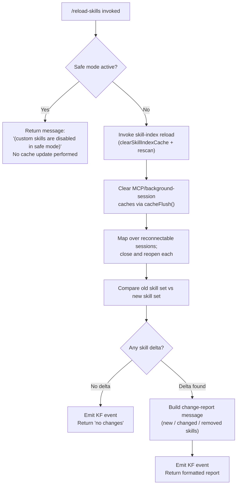

# `/reload-skills`

> Analysis basis: CC v2.1.191 bundle.js (AST extraction + Claude interpretation)
> Minimum version: v2.1.191

---

## Overview

`/reload-skills` is a local slash command that rescans the disk for any custom skill definitions that were added or modified during the current session, refreshes the in-memory skill index cache, and reports back which skills are new, changed, or unchanged. It is designed to be invoked without ending or restarting the session, giving users a live hot-reload path for skills development.

---

## Registration

| Field | Value |
|---|---|
| type | `local` |
| name | `reload-skills` |
| description | `Pick up skills added or changed on disk during this session` |
| supportsNonInteractive | `true` |
| thinClientDispatch | `post-text` |
| module_id | `T9l` |
| load_inline | `true` |
| loc_byte | `12733655` |
| loc_byte_end | `12733872` |
| loc_line | `8612` |
| arbor_handler.name | `U0f` |
| arbor_handler.fqn | `claude-2.1.191::U0f` |
| arbor_handler.kind | `AsyncFunction` |
| arbor_handler.resolution_path | `module_id` |
| arbor_handler.n_hits | `0` |

Analysis basis: CC v2.1.191 bundle.js:+12733655

---

## Input Branching

The command exhibits four distinct top-level branches based on safe-mode status and the comparison between the previously known skill set and the freshly loaded skill set. A Mermaid flowchart is used accordingly.



Analysis basis: CC v2.1.191 bundle.js:+12733135, +12733148, +12733184, +12733242, +12733392, +12733405, +12733420, +12733425

---

## Behavioral Spec

### 1. Safe-Mode Guard

Before any reload work begins, the handler checks whether the CLI is running in safe mode. The safe-mode flag is read via a helper (`--safe-mode` sentinel literal observed at bundle.js:+69780). If safe mode is active, the command returns immediately with the message `" (custom skills are disabled in safe mode)"` (literal at bundle.js:+12733425) without touching any cache or session.

```
function safeModeLiteral():
    # Literal: " (custom skills are disabled in safe mode)"
    # Located at bundle.js:+12733425
    return SAFE_MODE_MESSAGE
```

Analysis basis: CC v2.1.191 bundle.js:+12733420, +12733425

---

### 2. Config & Session Resolution

When safe mode is not active, the handler calls `resolveConfig` (mapped from `Dt`), which in turn calls `getStoreValue` (mapped from `Gin → Bin.getStore`) to read persistent configuration, and `resolveHeuristics` (mapped from `Hr → ux`) to apply any heuristic overrides.

```
function resolveConfig():
    store = getStoreValue()           # Gin → Bin.getStore (bundle.js:+1061052)
    heuristics = applyHeuristics()   # Hr → ux (bundle.js:+46603)
    return mergedConfig(store, heuristics)
```

Analysis basis: CC v2.1.191 bundle.js:+12733135, +1061103, +1061052, +1061073, +1061122

---

### 3. Skill-Index Cache Invalidation and Rescan

The core reload step is performed by `reloadSkillIndex` (mapped from `IR → s6`). It executes three operations in sequence:

1. Resolves a `Promise.resolve` baseline (bundle.js:+13319477).
2. Calls `resolveEmbeddingProvider` (mapped from `ERo`) to prepare embedding infrastructure (bundle.js:+13319507).
3. Calls `e.clearSkillIndexCache()` to drop the existing in-memory index (bundle.js:+13319529), then calls the skill-index rebuild logic (`e`, mapped from `L6o` and related helpers) which reads CLAUDE.md / skill files from disk, slices content, builds entries, joins paths, and writes the new index.

```
async function reloadSkillIndex():
    await Promise.resolve()                       # bundle.js:+13319477
    embeddingProvider = resolveEmbeddingProvider() # bundle.js:+13319507
    clearSkillIndexCache()                         # bundle.js:+13319529
    newIndex = buildSkillIndexFromDisk(
        slice_limit  = 30,    # bundle.js:+16668949
        token_limit  = 1024,  # bundle.js:+17267676
        chunk_size   = 1000,  # bundle.js:+16669144
        cache_ttl    = 300    # bundle.js:+16669651
    )
    return newIndex
```

Additional sub-helpers called during the index build include: context message formatting (`L6o`), API side-query dispatch (`wN` → `globalThis.fetch`), schema parse validation (`D6n → t.safeParse`), context-tip classification (`e → M6n`, `usm`, `hsm`), and response formatting (`hsm → t.push / t.join`).

Analysis basis: CC v2.1.191 bundle.js:+13319576, +13319477, +13319507, +13319529, +16668916, +16668940, +16669122, +17267676, +16668949, +16669144, +16669651

---

### 4. MCP Cache Flush

After the skill-index cache is cleared, `mcpCacheFlush` (mapped from `L5`) is called to clear any MCP-level caches (`M8t.clear`, bundle.js:+11022641). This ensures stale MCP tool registrations are not served from a previous cache state.

```
function mcpCacheFlush():
    mcpRegistry.clear()   # M8t.clear — bundle.js:+11022641
```

Analysis basis: CC v2.1.191 bundle.js:+12733189, +11022641

---

### 5. Background Session Reconnection

After the cache flush, the handler maps over all active background/MCP sessions (`s.map` at bundle.js:+12733222). For each session, it:

1. Registers the session in a tracking set (`r.add`, bundle.js:+17376639).
2. Closes the existing connection (`n.close`, bundle.js:+17383218; `r.close`, bundle.js:+17383228).
3. Reopens / re-initialises the session (`s`, bundle.js:+17383368).
4. Removes it from the tracking set upon completion (`r.delete`, bundle.js:+17376662) via a `finally` block.

Session labels are normalised to lowercase (bundle.js:+17399062); the `"background session"` literal (bundle.js:+17408137) and `"stopped"` sentinel (bundle.js:+17408094) are used during state checks.

```
async function reconnectSessions(sessions):
    for session in sessions:
        activeSet.add(session)
        try:
            await session.close()
            await session.reconnect()
        finally:
            activeSet.delete(session)
```

Analysis basis: CC v2.1.191 bundle.js:+12733222, +17376639, +17376648, +17376662, +17383218, +17383228, +17383368, +17408137

---

### 6. Skill Delta Computation and Output

After the reload, the handler checks the old skill-name set (`o.has`, bundle.js:+12733269) against the new skill-name set (`i.has`, bundle.js:+12733297). Skills that appear in one set but not the other are collected into the change list (`c.push`, bundle.js:+12733324). The resulting array is joined into a human-readable message (`c.join`, bundle.js:+12733392).

- If the change list is empty, the literal `"no changes"` (bundle.js:+12733405) is used as the output message.
- If changes are found, the skill type label `"skill"` (bundle.js:+12733542) is used when formatting each entry, and the final message is printed via `printResult` (mapped from `hl → rt / QZt`, bundle.js:+12733420, +69737).

A `KF.emit` event is fired after the delta is computed (bundle.js:+12733242), and `Gn` (a translation/localisation helper, bundle.js:+12733258) is used to wrap any displayed strings.

```
function computeAndDisplayDelta(oldSkills, newSkills):
    changes = []
    for name in union(oldSkills, newSkills):
        if name not in oldSkills OR name not in newSkills:
            changes.push(formatEntry(name, label="skill"))
    
    eventBus.emit()                    # KF.emit — bundle.js:+12733242
    
    if changes is empty:
        message = "no changes"         # bundle.js:+12733405
    else:
        message = changes.join(", ")   # bundle.js:+12733392
    
    printResult(message)               # hl → rt/QZt — bundle.js:+12733420
```

Analysis basis: CC v2.1.191 bundle.js:+12733269, +12733297, +12733324, +12733392, +12733405, +12733420, +12733542

---

### 7. Error Handling Path

If a CLI error is encountered during the rescan (for example, a malformed skill file), `handleCliError` (mapped from `Cs → nqe`) logs the error to stderr via `console.error` with red ANSI colouring (`St.red`, bundle.js:+13196531), writes a `"cli_error"` record to disk via `writeErrorFile` (`fT → $oe.writeFileSync`, bundle.js:+200554), and exits with code `1` (`process.exit(1)`, bundle.js:+13196598).

```
function handleCliError(err):
    console.error(St.red(err.message))        # bundle.js:+13196517, +13196531
    writeErrorFile("cli_error", err)           # fT — bundle.js:+200554
    process.exit(1)                            # bundle.js:+13196598
```

Analysis basis: CC v2.1.191 bundle.js:+13196562, +13196517, +13196531, +13196572, +13196585, +13196598, +200554

---

## State & Side Effects

| Item | Detail |
|---|---|
| Telemetry: `tengu_lone_surrogate_sanitized` | Fired when API response strings contain lone Unicode surrogates that must be sanitised (bundle.js:+8938694) |
| Telemetry: `tengu_api_success` | Fired on successful API call during skill-index rebuild (bundle.js:+8938998) |
| Telemetry: `tengu_context_tip_classifier_outcome` | Fired after context-tip classification completes during index rebuild (bundle.js:+16672225) |
| Telemetry: `tengu_feature_bad` | Fired when a feature flag check fails (bundle.js:+1025792) |
| Telemetry: `tengu_feature_ok` | Fired when a feature flag check succeeds (bundle.js:+1025725) |
| Skill index cache | Cleared via `e.clearSkillIndexCache()` then rebuilt from disk (bundle.js:+13319529) |
| MCP cache | Cleared via `M8t.clear()` (bundle.js:+11022641) |
| Background sessions | Each active session is closed and reconnected (bundle.js:+17376639–17376662) |
| Event bus | `KF.emit` fires once after the delta is computed (bundle.js:+12733242) |
| stdout output | Either `"no changes"` or a comma-joined list of changed skill names is printed (bundle.js:+12733392, +12733405) |
| process.exit | Called with code `1` only on unrecoverable CLI error (bundle.js:+13196598) |
| Safe mode | When `--safe-mode` is active, no state changes occur; message returned immediately (bundle.js:+12733425) |
| Error file | Written synchronously on CLI error via `$oe.writeFileSync` (bundle.js:+200554) |

---

## Version History

| Version | Change |
|---|---|
| v2.1.191 | Initial analysis |

---

## Common Mistakes

1. **Running in safe mode and expecting skills to reload.** When `--safe-mode` is active, `/reload-skills` exits immediately with a notice that custom skills are disabled. No cache clearing or reconnection occurs.
2. **Expecting instant visibility of API-backed skill embeddings.** The rebuild may issue a side-query to the embeddings API (`globalThis.fetch` via `wN`); on slow connections this can take perceptibly longer than a pure disk rescan.
3. **Assuming a `"no changes"` result means files were not found.** The message indicates the skill set is identical to what was loaded at session start — not that the disk scan failed. Check that file names and skill markers match the expected format.
4. **Not accounting for session reconnection latency.** Each background/MCP session is closed and reopened synchronously in the map loop; with many sessions this can add noticeable delay before the result message is displayed.
5. **Ignoring the error file on failure.** When the command exits with code 1, a `"cli_error"` file is written to disk (`$oe.writeFileSync`). Inspecting this file is the fastest way to diagnose a failed reload.

---

## Appendix — Identifier Mapping

> For bundle debugging only. Identifiers change across versions.

| Identifier | Role |
|---|---|
| `U0f` | Main async handler for `/reload-skills` (arbor_handler) |
| `Dt` | Config resolution orchestrator |
| `Gin` | Config store reader (calls `Bin.getStore`) |
| `Kq` | Config key/value resolver |
| `Hr` | Heuristics resolver |
| `ux` | Heuristics application helper |
| `Cs` | CLI error handler (logs, writes error file, exits) |
| `nqe` | Error formatter / stderr logger |
| `fT` | Error file writer (`$oe.writeFileSync`) |
| `IR` | Skill-index reload orchestrator |
| `s6` | Core skill-index rescan function (`clearSkillIndexCache` + rebuild) |
| `e` | Skill-index builder (disk reader, context builder) |
| `L6o` | Context message formatter for skill index |
| `wN` | API fetch dispatcher (side-query / embeddings) |
| `S4` | Feature flag evaluator |
| `usm` | Context summariser helper |
| `hsm` | Response message assembler (`t.push / t.join`) |
| `M6n` | Tool-use block finder in API response |
| `T` | String normaliser / language formatter |
| `cSt` | Context-tip classify request builder |
| `Re` | Feature-ok/bad telemetry emitter (tips path) |
| `D6n` | Schema-safe-parse wrapper |
| `we` | Feature-ok telemetry helper |
| `Ae` | String coercion utility |
| `Nzn` | Post-reload notification helper |
| `D_l` | Reload completion state updater |
| `VWe` | Skill-watcher registration helper |
| `wWt` | Watcher cache lookup (`hqn.get`) |
| `CWt` | Watcher cache writer |
| `L5` | MCP cache flush (`M8t.clear`) |
| `s` | Session reconnection closure |
| `i` | Individual session reconnect/close handler |
| `n` | Session name normaliser (toLowerCase) |
| `Gn` | Localisation / string wrapping helper |
| `t` | Translation lookup table |
| `c` | Change-list accumulator array |
| `An` | Background session status checker |
| `hl` | Output printer orchestrator |
| `rt` | String result renderer |
| `QZt` | Safe-mode suffix appender |

---

Note: index built via Arbor fallback; some signals (telemetry, literals) may be missing — see arbor-fallback.js.