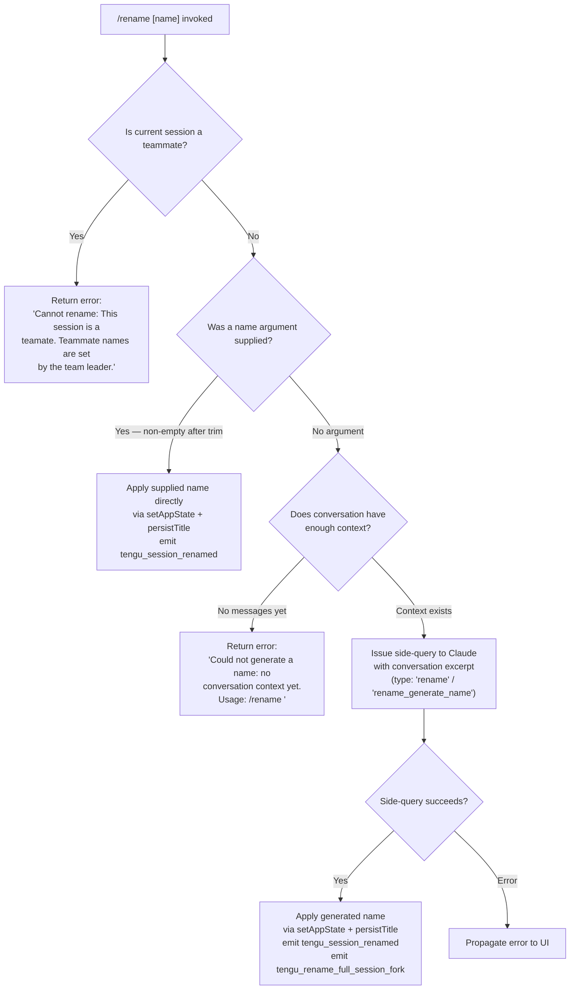

# `/rename`

> Analysis basis: CC v2.1.191 bundle.js (AST extraction + Claude interpretation)
> Minimum version: v2.1.191

---

## Overview

The `/rename` command (alias: `/name`) renames the current conversation session. When called with an explicit name argument the title is applied immediately; when called without an argument it invokes a side-query to Claude to auto-generate a name from the conversation history, then persists the result via the session-state mechanism and emits a `tengu_session_renamed` telemetry event.

---

## Registration

| Field | Value |
|---|---|
| type | `local-jsx` |
| name | `rename` |
| description | `Rename the current conversation` |
| argumentHint | `[name]` |
| immediate | `true` |
| aliases | `["name"]` |
| module_id | `NDl` |
| load_inline | `true` |
| loc_byte | `12177569` |
| loc_byte_end | `12177768` |
| loc_line | `8043` |
| arbor_handler.name | `ebf` |
| arbor_handler.fqn | `claude-2.1.191::ebf` |
| arbor_handler.kind | `AsyncFunction` |
| arbor_handler.resolution_path | `module_id` |
| arbor_handler.n_hits | `0` |

Analysis basis: CC v2.1.191 bundle.js:+12177569

---

## Input Branching

Four distinct execution branches exist: teammate guard, explicit name provided, auto-generate with context, and auto-generate with no context. A Mermaid flowchart is used.



Analysis basis: CC v2.1.191 bundle.js:+12176713 (handler `$Jn`), +12176733 (teammate error literal), +12176944 (no-context error literal), +12174921 (rename type literal), +12174945 (rename\_generate\_name literal)

---

## Behavioral Spec

### Top-level Handler (`ebf`)

The Arbor-resolved handler `ebf` is an `AsyncFunction` that acts as the command entry point. It delegates immediately to three collaborators: the outer UI orchestrator (`$Jn`), a conversation context accessor (`e`), and a session-list accessor (`FJn`).

Analysis basis: CC v2.1.191 bundle.js:+12177265 (`ebf → $Jn`), +12177281 (`ebf → e`), +12177323 (`ebf → FJn`)

### Teammate Guard (`$Jn` early path)

```
async function renameCommandHandler(appContext, rawArgument):
    sessionInfo = getSessionStore(appContext)          // pf → Lx → KPr.getStore
    if sessionInfo.isTeammate:
        return errorResult(TEAMMATE_ERROR_MESSAGE)    // literal: bundle.js:+12176733
    trimmedArg = rawArgument.trim()
    ...
```

Analysis basis: CC v2.1.191 bundle.js:+12176832 (`e.trim`), +12176713 (`$Jn`)

### Explicit-Name Path

When the trimmed argument is non-empty, the handler:

1. Retrieves baseline title metadata via `lS` (which uses `Ay.basename` / `wt`).
2. Updates the app state via `t.setAppState` to reflect the new title.
3. Calls `jae` to persist the title to disk (invoking `ic`/`yR` for path resolution, `Bi` for file I/O with `wb.readFile` / `wb.lstat`, and `Od`/`Rm` for atomic write using `xK.writeFile` + `xK.rename`).
4. Triggers `tengu_session_renamed` telemetry.

```
function applyExplicitName(appContext, name):
    baseName = resolveBaseName(name)           // lS
    appContext.setAppState({ title: name })    // t.setAppState
    persistTitleToDisk(appContext, name)       // jae → ic, yR, Bi, Od, Rm
    emit("tengu_session_renamed")
```

Analysis basis: CC v2.1.191 bundle.js:+12177072 (`t.setAppState`), +12177114 (`jae`), +12177118 (`lS`), +13372267 (`tengu_session_renamed`)

### Auto-Generate Name Path (with context)

When no argument is given and the conversation has messages, the handler:

1. Builds a conversation excerpt via `NJn`, which trims messages to a representable slice (`n.slice`, `t.join`) and filters by `isMeta` / `origin` fields.
2. Uses `c_t` to orchestrate a **side-query** of type `"rename"` / `"rename_generate_name"` (literals at +12174921, +12174945) against the Claude API. The side-query uses `ZAf` which sets up an `AbortController` (`e.addEventListener`, `n.abort`) and runs `qx` (the core query executor calling `Hjn` for app-state access, `sD` for sanitization, `Mue` for model selection, `kof` for formatting output).
3. The side-query uses `deny` permission mode (`"deny"` literal at +12174827) and carries the annotation `"Session name generation cannot use tools"` (+12174842).
4. The JSON-schema response is validated with `D6n` → `t.safeParse`.
5. On success, the generated name is applied via `setAppState` and `jae`.
6. Emits `tengu_rename_full_session_fork` (+12175385) and `tengu_session_renamed` (+13372267).

```
async function autoGenerateName(appContext, conversationMessages):
    excerpt = buildConversationExcerpt(conversationMessages)  // NJn
    abortCtrl = new AbortController()
    queryResult = await runSideQuery({                         // c_t → ZAf → qx
        type: "rename",
        subType: "rename_generate_name",
        context: excerpt,
        toolPermissions: "deny",
        schema: "json_schema"                                  // literal +12175757
    })
    parsed = validateSchema(queryResult)                       // D6n → t.safeParse
    if parsed.success:
        applyName(appContext, parsed.name)                     // t.setAppState + jae
        emit("tengu_rename_full_session_fork")
        emit("tengu_session_renamed")
    else:
        propagateError(queryResult)
```

Analysis basis: CC v2.1.191 bundle.js:+12175494 (`NJn`), +12175442 (`ZAf`), +12175535 (`g$`), +12175552 (`Rc`), +12176866 (`c_t`), +12176011 (`xf`), +12176050 (`ODl`), +12175757 (literal `json_schema`)

### No-Context Guard

```
function checkContext(conversationMessages):
    if conversationMessages.length == 0:
        return errorResult(
            "Could not generate a name: no conversation context yet. Usage: /rename <name>"
        )  // literal bundle.js:+12176944
```

Analysis basis: CC v2.1.191 bundle.js:+12176944

### Conversation Excerpt Builder (`NJn`)

```
function buildConversationExcerpt(messages):
    result = []
    for msg in messages:
        if msg.isMeta: continue          // "isMeta" literal +12171785
        if not msg.origin: continue      // "origin" literal +12171820
        result.push(formatMessage(msg))
    joined = result.slice(0, N).join()  // n.slice, t.join
    return joined
```

Analysis basis: CC v2.1.191 bundle.js:+12171835 (`hte`), +12171905 (`t.push`), +12172021 (`t.join`), +12172053 (`n.slice`)

### Title Persistence (`jae` / `lS`)

- `lS` resolves the display base name using `Ay.basename` and the internal `wt` render helper (bundle.js:+4281149).
- `jae` orchestrates file I/O: path resolution via `ic` → `yR` → `Ay.join`; file existence check via `Bi` → `wb.lstat`; atomic write via `Od` → `Rm` → `xK.writeFile` + `xK.rename`. Deletion of stale cache entries is handled by `by` → `$ee.delete`. Numeric metadata (order, stateOrder) is preserved.

Analysis basis: CC v2.1.191 bundle.js:+4284871 (`jae → ic`), +4284929 (`jae → by`), +4285006 (`jae → Od`), +1061313 (`Rm → xK.writeFile`), +1061366 (`Rm → xK.rename`)

### Session List Refresh (`FJn`)

`FJn` retrieves the current session list (`b7n`) and calls `Qv` to propagate UI state. The `b7n` helper performs HTML-entity unescaping (`e.replaceAll`) on session titles using the entity map: `&amp;`, `&lt;`, `&gt;`, `&#13;`, `&#10;` (literals at bundle.js:+13782103–13782198).

Analysis basis: CC v2.1.191 bundle.js:+12176581 (`FJn → b7n`), +12176595 (`FJn → Qv`), +13782086 (`b7n → e.replaceAll`)

---

## State & Side Effects

| Item | Detail |
|---|---|
| Telemetry — `tengu_rename_full_session_fork` | Fired when auto-generate name path completes; bundle.js:+12175385 |
| Telemetry — `tengu_session_renamed` | Fired on every successful rename (explicit or auto-generated); bundle.js:+13372267 |
| Telemetry — `tengu_agent_name_set` | Fired when agent-name metadata is updated on the persisted record; bundle.js:+13376724 |
| `appState` changes | `t.setAppState` updates the in-memory session title; bundle.js:+12177072 |
| Disk persistence | `jae` writes updated title to the session file using atomic rename; bundle.js:+4285006 |
| Cache invalidation | `by` → `$ee.delete` removes stale cached file-stat entries; bundle.js:+4284929 |
| Side-query API call | Auto-generate path issues a controlled Claude side-query via `ZAf` / `qx`; bundle.js:+12175442 |
| AbortController | Side-query registers an `abort` listener (`e.addEventListener`, literal `"abort"` at +12174650) so the request can be cancelled if the session is torn down mid-flight |
| Tool use | Explicitly denied during name generation; literal `"deny"` at +12174827, annotation at +12174842 |
| Sound | None detected in depth-2 traversal |
| Hook registration | None detected in depth-2 traversal |

---

## Version History

| Version | Change |
|---|---|
| v2.1.191 | Initial analysis |

---

## Common Mistakes

1. **Calling `/rename` in a teammate session** — The command immediately returns the teammate-guard error. Only the team leader may set teammate names; there is no workaround within the command itself.
2. **Calling `/rename` with no argument before any conversation has started** — Without prior messages, there is no context for the auto-generator and the command returns the no-context error. Supply an explicit name argument instead: `/rename MySession`.
3. **Assuming the command is synchronous** — When no argument is provided the command issues an async side-query to Claude. Downstream code that inspects `appState.title` immediately after issuing the command may observe the old title until the side-query resolves.
4. **Expecting the alias `/name` to behave differently** — `/name` is registered as a direct alias and follows the identical code path.
5. **Long names with HTML entities** — The session-list reader (`b7n`) unescapes HTML entities in stored titles. Names that include literal `&`, `<`, `>`, or carriage-return / line-feed characters will be stored in escaped form and unescaped on read; do not double-escape when constructing names programmatically.

---

## Appendix — Identifier Mapping

> For bundle debugging only. Identifiers change across versions.

| Identifier | Role |
|---|---|
| `ebf` | Top-level async handler for `/rename` (Arbor-resolved entry point) |
| `$Jn` | Inner command orchestrator; enforces teammate guard, dispatches explicit vs. auto path |
| `FJn` | Session-list accessor; refreshes UI after rename |
| `b7n` | Session title fetcher; performs HTML-entity unescaping on titles |
| `c_t` | Side-query coordinator; manages full auto-name generation flow |
| `ZAf` | Side-query executor; sets up AbortController and calls API query |
| `qx` | Core query runner; manages streaming, app-state access, model selection |
| `Hjn` | App-state reader within side-query |
| `NJn` | Conversation excerpt builder (filters meta/origin, slices, joins) |
| `jae` | Title persistence orchestrator (path resolution + atomic file write) |
| `ic` | Path resolver (joins session directory) |
| `yR` | Path resolver helper |
| `Bi` | File I/O handler (lstat, readFile, writeFile, cache management) |
| `Od` | Atomic write dispatcher |
| `Rm` | Low-level atomic file writer (randomBytes temp name, writeFile, rename) |
| `by` | Cache-entry invalidator (`$ee.delete`) |
| `lS` | Display base-name resolver (`Ay.basename` + `wt`) |
| `D6n` | JSON-schema response validator (`t.safeParse`) |
| `pf` | Session-store accessor (`Lx → KPr.getStore`) |
| `Lx` | Store getter wrapper |
| `sD` | String sanitizer (random-bytes replacement for special chars) |
| `Mue` | Model selector for side-query |
| `kof` | Output formatter for side-query result |
| `ODl` | Message content extractor (`Ca`, `r4 → e.trim`) |
| `Zl` | Message filter (used after side-query) |
| `xf` | Render/display helper |
| `Qv` | UI state propagator |
| `wN` | API call orchestrator (broad; used inside side-query path) |
| `oW` | HTTP request builder (headers, auth, model routing) |
| `L6o` | Conversation-to-API-messages normalizer |
| `gsm` | Message segment setter |
| `msm` | Auto-classifier input builder |
| `hte` | Individual message formatter used by excerpt builder |
| `g$` | Session persistence layer (`Rc`, `uzn`, `lL`) |
| `uzn` | Low-level session file writer (`jEe.writeFile`, `jEe.mkdir`) |
| `lL` | Session record builder / merger |
| `kvo` | Session list updater |
| `UVe` | Session context validator |
| `I7l` | Full agent query handler (large; reached via side-query path) |
| `FEe` | Logger / event emitter orchestrator (hook, custom-title, ai-title) |
| `Q6` | Structured log writer (appends to log file, emits p7t events) |
| `YSe` | File-append log backend (`n.appendFileSync`, `n.mkdirSync`) |
| `s8e` | Agent-name metadata writer (`agent-name` field) |
| `hz` | Config read/write helper (`_0t`) |
| `_0t` | Atomic config file updater (`tF.readFile`, `tF.writeFile`) |
| `nt` | Session initialization / forking entry |
| `kt` | Session config loader (`tEt`) |
| `tEt` | Config file reader with migration (`r.readFileSync`, `r.mkdirSync`) |
| `K9f` | Config file watcher / unwatcher |
| `RTn` | Session dedup and fork dispatcher |
| `w5r` | New session creator (UUID, `KZ.emit`) |
| `P5r` | Session state initializer |
| `Hvo` | Session start timer |
| `Es` | Model name resolver |
| `Qo` | Model alias resolver (sonnet, haiku, opus, best, etc.) |
| `E4` | Model metadata builder |
| `rH` | Model resolver wrapper |
| `RAt` | Session activity recorder |
| `Le` | Structured error logger (`GQ.logError`, `sXe.push`) |
| `fo` | Error formatter |
| `rt` | String coercer |
| `Yi` | Log-entry normalizer |
| `Rmu` | Log ring-buffer manager (shift/push) |
| `_r` | Internal render/display primitive |
| `uu` | UI update scheduler |
| `ev` | Event emitter primitive |
| `ke` | JSON.stringify wrapper |
| `T` | Message-type classifier / formatter |
| `wNc` | Tool-use block formatter |
| `Dc` | Content-block display renderer |
| `kNc` | File-content tool renderer |
| `a7e` | Auxiliary content renderer |
| `Pe` | React/UI render primitive |
| `Re` | UI component (alternate render) |
| `we` | UI component (base render) |
| `Ae` | String-cast utility |
| `cSt` | Composite state renderer |
| `S4` | Session snapshot builder |
| `PPr` | Snapshot serializer |
| `usm` | Message-list utility |
| `csm` | Conversation-message mapper |
| `hsm` | History string builder (push + join) |
| `M6n` | Command finder (`e.find`) |
| `Rc` | Session record cache |
| `px` | Tiny utility (`ux`) |
| `NI` | Session identity builder |
| `FPr` | Key-type classifier (`sk-ant-` prefix check) |
| `C1` | Context initializer |
| `wt` | Low-level display/render primitive |
| `GR` | Global render helper |
| `Nf` | Formatted output builder |
| `A2` | Display node builder |
| `Hr` | Heading renderer |
| `Fc` | File-content cache (`_i`) |
| `ere` | Logging emitter |
| `vE` | Visibility/state helper |
| `Kue` | Cleanup utility |
| `zue` | Secondary cleanup utility |
| `Vu` | Volatile state holder |
| `W1e` | Volatile state initializer |
| `x7n` | Object-key lister |
| `Gn` | Generic iteration helper |
| `ln` | MCP debug logger (`GQ.logMCPDebug`) |
| `Xc` | MCP error logger (`GQ.logMCPError`) |
| `s5e` | MCP server connector/manager |
| `Gar` | MCP update applier |
| `hGo` | MCP client manager (per-server) |
| `UPn` | MCP permission checker |
| `wlt` | MCP connection state checker |
| `tI` | MCP cleanup runner |
| `vEa` | MCP connection result handler |
| `o5e` | MCP status updater |
| `w_a` | MCP config watcher |
| `rGl` | Rate-limit tracker |
| `jn` | Timeout/retry scheduler |
| `sD` | String sanitizer (also used for ID generation via `rZt.randomBytes`) |
| `Dn` | Random-UUID session-ID generator |
| `y` | Promise-based state accessor |
| `r4` | Text trimmer |
| `Dt` | Data decoder |
| `$t` | JSON parser |
| `EHl` | Session hash updater |
| `dn` | Debug/no-op logger |
| `f` | Background worker process manager |
| `Aue` | Active-session filter |
| `BVa` | Tombstone checker |
| `ije` | Message-type guard (`SBp.has`) |
| `nre` | Retry notifier |
| `XKn` | Session-key normalizer |
| `$6` | Sub-agent exit handler |
| `O0` | Overflow/overflow-state accessor |
| `_jn` | Internal junction handler |
| `kof` | Turn formatter / output builder |
| `msf` | Message-stream formatter |
| `lzn` | Stream chunk accumulator |
| `gsf` | Stream finisher |
| `czn` | Conversation-state initializer |
| `Oo` | Overlay/status renderer |
| `H1t` | Hook-manager entry |
| `NF` | Node feature detector |
| `kAt` | Keyboard / attention handler |
| `LOr` | Log output router |
| `wOr` | Write-output router |
| `mbe` | Memory/buffer estimator |
| `Tr` | Trace/timing recorder |
| `Ve` | Version/env accessor |
| `W` | Global state store |
| `ZVa` | Zero-value accumulator |
| `sp` | String replacer |
| `XSn` | Auth-token validator |
| `av` | Array value mapper |
| `Txe` | Tool-execution handler |
| `etn` | Event-tree node pusher |
| `iD` | Deep-clone utility (`structuredClone`) |
| `u7e` | Undo-event utility |
| `CBp` | Command-by-prefix finder |
| `SHo` | Session-hash computer (`JVa.createHash`) |
| `Ghn` | Global header builder |
| `aIn` | API-input normalizer |
| `aje` | Argument-joiner / context extractor |
| `wD` | Write-dispatcher |
| `b2e` | Beta-feature checker |
| `lie` | Login-info extractor |
| `_` | Global array accumulator |
| `L` | Background-worker lifecycle manager |

---

Note: index built via Arbor fallback; some signals (telemetry, literals) may be missing — see arbor-fallback.js.