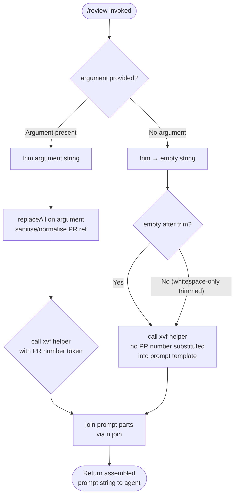

# `/review`

> Analysis basis: CC v2.1.191 bundle.js (AST extraction + Claude interpretation)
> Minimum version: v2.1.191

---

## Overview

The `/review` command initiates an automated GitHub pull request review by delegating to the agent via a structured prompt. It accepts an optional PR number as its argument, constructs a review prompt that instructs the agent to gather PR metadata and diff via the `gh` CLI, and presents a human-readable findings report ordered by severity. It is distinct from `/code-review`, which operates on the local working-tree diff rather than a remote PR.

---

## Registration

| Field | Value |
|---|---|
| type | `prompt` |
| name | `review` |
| description | `Review a GitHub pull request; for your working diff use /code-review` |
| argumentHint | `[pr number]` |
| handler_method | `getPromptForCommand` |
| handler_method_start | `12388694` |
| handler_method_end | `12388852` |
| loc_byte | `12388465` |
| loc_byte_end | `12388853` |
| loc_line | `8188` |
| prompt_body.length | `824` characters |
| prompt_body.trace | `conditional; call→xvf(...) (1 literals); identifier→Lvf (unresolved)` |
| arbor_handler.name | `getPromptForCommand` |
| arbor_handler.kind | `Method` |
| arbor_handler.resolution_path | `direct` |
| arbor_handler.fqn | `claude-2.1.191::getPromptForCommand` |
| arbor_handler.n_hits | `1` |

Analysis basis: CC v2.1.191 bundle.js:+12388465

---

## Input Branching

The handler has 3 distinct execution paths based on the presence and content of the PR number argument:



Analysis basis: CC v2.1.191 bundle.js:+12388694 (handler_method_start), +12388738 (e.trim), +12388762 (t.replaceAll), +12388827 (xvf call), +12388833 (n.join)

---

## Behavioral Spec

### Argument Normalisation

The handler first trims whitespace from the raw argument string before any further processing.

```
function normaliseArgument(rawArg):
    trimmed = rawArg.trim()                    // loc_byte +12388738
    if trimmed is empty:
        return null
    sanitised = trimmed.replaceAll(...)        // loc_byte +12388762
    return sanitised
```

Analysis basis: CC v2.1.191 bundle.js:+12388738, +12388762

### Prompt Assembly (getPromptForCommand)

The Arbor-resolved handler `getPromptForCommand` assembles the final prompt string from a template. The template body references a conditional helper call (`xvf`) that interpolates the PR number token into specific positions within the prompt, and a separately resolved identifier (`Lvf`, currently unresolved at depth-2) that may supply additional context segments.

```
function getPromptForCommand(argument):
    prNumber = normaliseArgument(argument)     // loc_byte +12388700
    promptParts = []

    // Conditional interpolation of PR number
    // xvf injects prNumber into the review-target line
    // and into gh subcommand arguments
    targetSegment = xvf(prNumber)              // loc_byte +12388827

    promptParts.push(targetSegment)

    // Lvf segment: unresolved at depth-2
    // <!-- TODO: not found in depth-2 traversal; needs --depth 4 -->

    finalPrompt = promptParts.join(...)        // loc_byte +12388833
    return finalPrompt
```

Analysis basis: CC v2.1.191 bundle.js:+12388694, +12388827, +12388833

### Prompt Content — What the Agent Is Instructed to Do

The assembled prompt (824 characters) instructs the agent to perform the following sequential workflow:

1. **Identify the review target** — the prompt opens by declaring the GitHub pull request (with the interpolated PR number) as the review scope. Fragment citation: `"Review target: GitHub pull request"` (bundle.js:+12388465).

2. **Gather PR context via `gh pr view`** — the agent is told to run `gh pr view <pr> --json title,body,author,baseRefName,headRefName,state,additions,deletions,changedFiles,labels` to retrieve structured metadata.

3. **Gather the unified diff via `gh pr diff`** — the agent is directed to run `gh pr diff <pr>` for the full unified diff. Local `git diff` is explicitly **excluded** from scope.

4. **Scope constraint** — local working-tree changes are declared out of scope. If surrounding code context is needed, the agent may read files from the checkout only when the checkout matches the PR's branch; otherwise it must fetch via `gh`.

5. **Review phases** — the prompt contains one or more intermediate analysis phases (elided in the extraction; content omitted per copyright constraint) that process the diff and metadata into structured findings.

6. **Present the review** — after all phases complete, the agent must **not** emit the raw JSON findings array. Instead it must produce:
   - A 2–3 sentence overview of what the PR does.
   - Surviving findings sorted most-severe first, each formatted as `file:line — summary (failure scenario)`.
   - Or a statement that nothing survived verification if no findings remain.

Analysis basis: CC v2.1.191 bundle.js:+12388465 (prompt_body trace), extracted prompt body (PROMPT_BODY content block)

---

## State & Side Effects

| Item | Detail |
|---|---|
| Telemetry | `tengu_api_success` (bundle.js:+8938998) — fired on successful API round-trip; `tengu_prompt_cache_1h_config` (bundle.js:+13616098) — prompt-cache configuration telemetry; `tengu_lone_surrogate_sanitized` (bundle.js:+8938694) — fired when lone Unicode surrogates are sanitised from content; `tengu_context_tip_classifier_outcome` (bundle.js:+16672225) — context-tip classification result; `tengu_feature_ok` (bundle.js:+1025725) / `tengu_feature_bad` (bundle.js:+1025792) — feature-gate success/failure; `tengu_bg_prewarm_per_sweep` (bundle.js:+17375352); `tengu_bg_retire_pinned_low_mem` (bundle.js:+17375231); `tengu_bg_retire_grace_bridged_min` (bundle.js:+13163592); `tengu_bg_attach_upgrade` (bundle.js:+13163664) |
| Hook registration | No command-specific hook registration detected at depth-2 |
| appState changes | No direct appState mutations detected within the handler itself; side effects (if any) are deferred to the agent execution pipeline triggered by the returned prompt |
| Sound | No sound effects detected at depth-2 |
| `gh` CLI dependency | The prompt body hard-requires the `gh` CLI to be available on `PATH`; absence will cause the agent's tool invocations to fail |
| Prompt caching | Cache-control headers (`cache_control` literal, bundle.js:+8939497) are applied to prompt content in the wider API pipeline, consistent with the `tengu_prompt_cache_1h_config` event and the `1h` literal (bundle.js:+8938216) |

---

## Version History

| Version | Change |
|---|---|
| v2.1.191 | Initial analysis |

---

## Common Mistakes

1. **Passing a PR URL instead of a PR number** — the argument hint is `[pr number]`. Passing a full GitHub URL may cause `xvf` interpolation to produce a malformed `gh` subcommand. Use only the numeric PR identifier (e.g. `1234`).
2. **Confusing `/review` with `/code-review`** — `/review` targets a GitHub PR diff fetched via `gh`; `/code-review` targets the local working-tree diff. The description explicitly calls this out: `"for your working diff use /code-review"`.
3. **Missing `gh` CLI** — the prompt body requires `gh` to be authenticated and on `PATH`. If `gh` is absent or unauthenticated, all data-gathering steps will fail and the agent will have no diff to review.
4. **Expecting raw JSON output** — the prompt explicitly forbids the agent from returning the raw JSON findings array. The output is always a human-readable formatted report.
5. **Invoking without a PR number on a repo with many open PRs** — the handler accepts an empty argument (falls through to the `null` path), in which case the interpolated PR reference in the prompt will be absent. The agent may prompt for clarification or fail to construct valid `gh` commands.

---

## Appendix — Identifier Mapping

> For bundle debugging only. Identifiers change across versions.

| Identifier | Role |
|---|---|
| `__handler_review` | Synthetic BFS entry point for the `/review` command handler (not a real bundle symbol; Arbor resolves to `getPromptForCommand`) |
| `xvf` | PR-number interpolation helper called inside `getPromptForCommand`; injects the normalised PR token into the prompt template at specific positions |
| `Lvf` | Unresolved identifier referenced in the prompt_body trace; likely supplies an additional prompt segment — not resolved at depth-2 |
| `L6o` | Conversation/message buffer management function; slices and assembles message history |
| `gsm` | Map setter utility within message buffer handling |
| `msm` | Auto-classifier input transformer; calls `toAutoClassifierInput` on message nodes |
| `ke` | JSON serialisation helper (calls `JSON.stringify`) |
| `har` | String/token helper used in message assembly and auto-classification |
| `hx` | Character-code-level string slicer (handles surrogate pairs via `charCodeAt`) |
| `wN` | Main agent execution orchestrator; coordinates API call, streaming, and post-processing |
| `xf` | Entry sub-function of `wN`; delegates to `wt` |
| `wt` | Low-level initialisation helper; calls `ux` |
| `oW` | Full agent-run pipeline: auth, API dispatch, response handling, tool execution |
| `mz` | Sub-utility within `oW` |
| `p3r` | Line-splitting and trimming utility (splits on newlines, trims, finds/slices by index) |
| `Ks` | Agent header builder; calls `HCe` |
| `Mz` | Error/issue-report URL builder; references `$hn` |
| `GPr` | URL path encoder; calls `encodeURIComponent` |
| `T` | HTTP request dispatch helper; handles method, headers, JSON serialisation |
| `rt` | String coercion utility (calls `String()`) |
| `Ng` | Token-refresh handler; calls `rAn` |
| `XKs` | Boolean coercion helper |
| `_y` | Auth credential resolver; calls `ad`, `yA`, `jl`, `jo`, `uT`, `iH`, `CMt`, `ltt` |
| `_ud` | Auth token utility; calls `uT` and `Zet` |
| `Kdn` | Proxy-auth helper executor with 30 000 ms timeout; calls `_Ou`, `jU`, `KC` |
| `Iud` | Request-ID / UUID manager; uses `yfi.randomUUID`, `a.has/set/get` |
| `PH` | "Mantle" provider handler; calls `Sxt`, `lWu`, `_r`, `IFe` |
| `G2` | Sub-dispatch helper; calls `Imu`, `dUe` |
| `fy` | Proxy/forwarding request builder; calls `rt`, `ol`, `jU`, `tz`, `iJe`, `uMs`, `Mxr`, `Oxr` |
| `Tud` | Tool-use dispatcher helper; calls `Sfi`, `_fi`, `_r` |
| `yud` | Agent state/flow controller; calls `BSn`, `dUe`, `Fze`, `Ooe`, `COr`, `e_`, `xs` |
| `SCe` | Session/cache controller; calls `e_`, `Ddr`, `ezu`, `wZt` |
| `Rdr` | Timestamp recorder (calls `Date.now`) |
| `pMt` | Header normaliser; lowercases header keys via `Object.entries` |
| `dve` | SDK error/warning logger; calls `console.error` |
| `BSn` | Message-role classifier; calls `NI`, `Es`, `ao`, `dUe` |
| `D` | Output renderer/writer; calls `y0c`, `up`, `T`, `Le`, `tfm`, `d.write` |
| `x` | Request deduplication/cache with 60 000 ms TTL; uses `eR`, `v.delete/get/set` |
| `v` | Focus/blur-aware token-budget manager; tracks `blurred`/`focused` states, 3 600 000 ms window, 0.8 ratio |
| `Ooe` | Environment/path prefix resolver; checks `PPc.find`, `e.startsWith`, calls `JZt` |
| `nv` | Sub-helper calling `iH` |
| `yA` | OAuth/profile credential builder; calls `ogn`, `ad`, `ltt`, `Pj`, `cR`, `rt`, `Dj`, `Vs`, `rB`, `wFe`, `emi`, `tmi` |
| `ACe` | Workload identity federation token-exchange handler; calls `TZe`, `we`, `Re`, `izu` |
| `TZe` | WIF credentials resolver with `fetch` and `AbortSignal.timeout(10000)` |
| `I` | Rate-limit / backpressure input handler; calls `Math.max`, `Math.floor`, `k.preventDefault` |
| `b2e` | Model-compatibility checker; validates against `claude-3-*`, `claude-opus-4-0`, `claude-sonnet-4-0` |
| `ao` | Application-inference-profile URL builder; calls `PQe`, `l_`, `ubt`, `sp` |
| `o1` | Sub-helper calling `_r` |
| `lie` | `$At` lookup + `vOr` path resolver |
| `vOr` | Foundry resource path replacer; calls `e.replace`, `COr`; uses `"unknown-foundry-resource"` |
| `_` | Tool/feature registry accessor |
| `a` | Tool registry map accessor; calls `s5e`, `Gar`, `w_a`, `s.get`, `T`, `s.values`, `hGo` |
| `CBp` | Tool-list finder; calls `e.find`, `n.find` |
| `SHo` | SHA-256 hash helper; calls `JVa.createHash` |
| `Ghn` | User-agent / request-header assembler; calls `ol`, `_r`, `uu`, `$hn`, `hCe`, `T` |
| `ol` | String coercion wrapper (calls `String()`) |
| `_r` | Request-building core |
| `uu` | Header-value builder; calls `Ymn` |
| `$hn` | AsyncLocalStorage store reader; calls `YKs.getStore` |
| `aIn` | Sub-utility calling `_r` |
| `aje` | Tool-call executor/dispatcher; calls `rt`, `_r`, `To`, `dpr`, `nt`, `ppr` |
| `To` | Tool execution context builder; calls `_y`, `rB`, `Vs` |
| `nt` | Background-worker scheduler gate; checks `IDt`, `CDt`, `B4`, `xve.has`, `RTn`, `bDt.add`, `gW.has/get`, `kt` |
| `wD` | HIPAA-mode request wrapper; calls `C3r`, `A2e` |
| `C3r` | HIPAA request sub-helper calling `_r` |
| `A2e` | HIPAA response handler; calls `rt`, `mZ` |
| `L` | Background worker sweep controller; manages `V.shiftGraceClocksForward`, `V.respawnIfIdleStale`, `V.retireIfSettled`, `j.retireIfSettled`, `q.respawnIfIdleStale`, `Nzt`, `J8l`, `I3e`, `Le`, `Gn`, `W`, `Xer`, `nt` |
| `Nzt` | Memory monitor; calls `Yer`, `X8l.freemem` |
| `J8l` | Worker grace-bridge timer; calls `nt` |
| `I3e` | Stale-file pruner; calls `wb.lstat`, `wb.rm`, `wb.readFile`, `$t`, `vn`, `VPd` |
| `Le` | Log/error reporter; calls `fo`, `rt`, `Yi`, `Rmu`, `sXe.push`, `GQ.logError` |
| `Gn` | Sub-helper calling `t` |
| `j` | Worker retirement helper; calls `i`, `F` |
| `Xer` | Worker attach-upgrade helper; calls `nt` |
| `q` | Keyboard-event / worker respawn handler; calls `K.preventDefault`, `F` |
| `ZVa` | <!-- TODO: not found in depth-2 traversal; needs --depth 4 --> |
| `sp` | URL string replacer; calls `e.replace` |
| `XSn` | Tool-list resolver with includes check; calls `sW`, `ao`, `n.includes` |
| `av` | Array mapper; calls `e.map` |
| `Txe` | Tool schema builder/validator; calls `Ca`, `Array.isArray`, `T`, `P4`, `Sc`, `wt`, `ke` |
| `P4` | Random-bytes tool-ID generator; calls `kt`, `x2o.randomBytes`, `gn`, `T` |
| `Sc` | Tool execution context initialiser; calls `_y`, `kt` |
| `etn` | Message-stack push helper (uses `t.pop`, `Array.isArray`, `Qen`, `t.push`, `Object.keys`) |
| `Qen` | Message-content validator; calls `Jen`, `ANc.test` |
| `iD` | Deep-clone utility; calls `structuredClone` |
| `u7e` | Message-stack pop helper (uses `n.pop`, `Array.isArray`, `Qen`, `Zen`, `n.push`, `Object.keys`) |
| `Zen` | Text-replacement helper; calls `i7o`, `e.replace` |
| `Ve` | Event-emitter wrapper; calls `eze` |
| `eze` | Core event-emitter primitive |
| `LOr` | OAuth/OIDC token response parser; calls `_r`, `l7s` |
| `l7s` | Token-field extractor; splits, trims, tests with `a7s` and `dzu` regexes |
| `wOr` | Permission/scope checker; calls `vOr`, `$At`, `r.get`, `t.every`, `o.has`, `s.add`, `r.set`, `T` |
| `mbe` | <!-- TODO: not found in depth-2 traversal; needs --depth 4 --> |
| `Tr` | Response-stream trailer handler; calls `lh`, `Ve` |
| `lh` | Event emitter sub-helper; calls `eze` |
| `Oo` | Output formatter; calls `eze` |
| `H1t` | Streaming response handler; calls `v3i`, `Rot`, `h1t` |
| `v3i` | Stream chunk processor; calls `rOd`, `Le` |
| `Rot` | Stream-close handler; calls `lh` |
| `h1t` | Stream-state machine; calls `Rot`, `g1t` |
| `NF` | Agent/sub-agent type dispatcher; calls `nOd`, `xD`, `Le` |
| `nOd` | Agent-prefix parser; resolves `agent:builtin:` (offset 14), `agent:custom:` (offset 13), `agent:` prefixes; calls `QLn`, `n5r`, `xD` |
| `xD` | Thread-type checker; checks `e.startsWith("repl_main_thread")` |
| `kAt` | <!-- TODO: not found in depth-2 traversal; needs --depth 4 --> |
| `S4` | Ephemeral-context builder; calls `ev`, `PPr` |
| `PPr` | Prompt-part resolver; calls `zp` |
| `zp` | Prompt segment assembler; calls `P1e`, `T4s`, `A4s`, `bxt`, `_r` |
| `usm` | Context-tip pipeline entry; calls `csm` |
| `csm` | Context-tip classifier mapper; calls `e.map` |
| `hsm` | Findings formatter; pushes formatted strings and joins them — produces the `file:line — summary` output |
| `M6n` | Tool-use block finder; calls `e.find` |
| `cSt` | Context-tip state handler; calls `W`, `Pe` |
| `Pe` | UI primitive; calls `eze` |
| `Re` | Response renderer; calls `W`, `Pe` |
| `D6n` | Schema-safe-parse validator; calls `t.safeParse` |
| `we` | Output writer; calls `W`, `Pe` |
| `Ae` | String coercion wrapper; calls `String()` |

---

Note: index built via Arbor fallback; some signals (telemetry, literals) may be missing — see arbor-fallback.js.