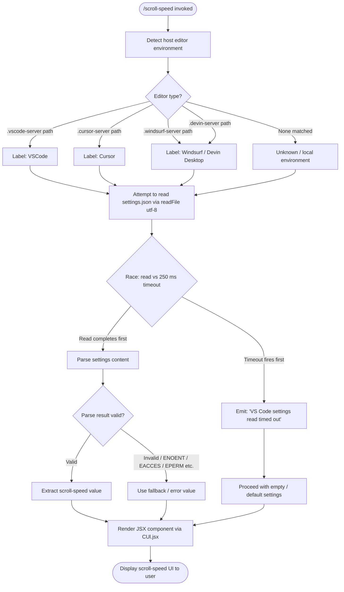

# `/scroll-speed`

> Analysis basis: CC v2.1.191 bundle.js (AST extraction + Claude interpretation)
> Minimum version: v2.1.191

---

## Overview

`/scroll-speed` is a local JSX command that adjusts the mouse wheel scroll speed within the Claude Code terminal UI. It reads the host editor's settings (VS Code, Cursor, Windsurf, or Devin Desktop variants), applies a timeout guard when reading those settings, and renders a JSX component that presents the resulting scroll-speed configuration to the user.

---

## Registration

| Field | Value |
|---|---|
| type | `local-jsx` |
| name | `scroll-speed` |
| description | Adjust mouse wheel scroll speed |
| loc_byte | `12396781` |
| loc_byte_end | `12397028` |
| loc_line | `8189` |
| module_id | `IUl` |
| load_inline | `true` |
| arbor_handler.name | `Vvf` |
| arbor_handler.fqn | `claude-2.1.191::Vvf` |
| arbor_handler.kind | `AsyncFunction` |
| arbor_handler.resolution_path | `module_id` |
| arbor_handler.n_hits | `0` |

Analysis basis: CC v2.1.191 bundle.js:+12396781

---

## Input Branching

The command has 3+ distinct paths: settings read succeeds, settings read times out (250 ms guard), and the host environment is detected as one of multiple supported editors (VSCode / Cursor / Windsurf / Devin Desktop). A Mermaid flowchart is used.



Analysis basis: CC v2.1.191 bundle.js:+12396554, +12396563, +12396567, +4133040, +4133087, +4133376

---

## Behavioral Spec

### 1. Handler Entry Point (`Vvf`)

The async handler `Vvf` is the top-level entry for this command (resolved via `module_id → IUl`). It orchestrates two main sub-operations in sequence: a timed settings read (`readEditorSettings`) and a JSX render (`renderScrollSpeedComponent`).

```
async function handleScrollSpeed(context):
    settingsData = await Promise.race([
        readEditorSettings(context),
        timeoutAfter(250)   // 250 ms guard constant
    ])
    if settingsData is timeout sentinel:
        log("VS Code settings read timed out")
        settingsData = defaultSettings()
    return renderScrollSpeedComponent(settingsData)
```

Analysis basis: CC v2.1.191 bundle.js:+12396554, +12396557, +12396563, +12396567, +12396625

---

### 2. Timed Promise Guard (`timeoutAfter` / `$c`)

A utility wraps `setTimeout` and `clearTimeout` inside a `Promise.race` to enforce the 250 ms deadline. The numeric literal `0` at byte +2348725 is used as the resolved value sentinel for `clearTimeout` cleanup.

```
function timeoutAfter(ms):
    return new Promise((resolve) =>
        id = setTimeout(() => resolve(TIMEOUT_SENTINEL), ms)
    )
    // winner cancels loser via clearTimeout
```

- Timeout constant: **250 ms** (bundle.js:+12396563)
- Timeout message literal: `"VS Code settings read timed out"` (bundle.js:+12396567)

Analysis basis: CC v2.1.191 bundle.js:+2348649, +2348680, +2348727

---

### 3. Editor Environment Detection (`zwn`)

The environment detector checks whether known remote-server directory names appear in the current working path or home path. The detection is purely string-based (`includes`).

```
function detectEditorEnvironment(pathString):
    if pathString.includes(".vscode-server"):
        return { id: "vscode",   label: "VSCode" }
    if pathString.includes(".cursor-server"):
        return { id: "cursor",   label: "Cursor" }
    if pathString.includes(".windsurf-server"):
        return { id: "windsurf", label: "Devin Desktop" }
    if pathString.includes(".devin-server"):
        return { id: "windsurf", label: "Devin Desktop" }
    return { id: null, label: null }
```

Known server-path literals (bundle.js):
- `".vscode-server"` at +4128922
- `".cursor-server"` at +4128952
- `".windsurf-server"` at +4128982
- `".devin-server"` at +4129014

Corresponding display-name literals:
- `"VSCode"` / `"vscode"` at +4133391 / +4133376
- `"Cursor"` / `"cursor"` at +4133419 / +4133404
- `"Devin Desktop"` / `"windsurf"` at +4133449 / +4133432

Analysis basis: CC v2.1.191 bundle.js:+4128911, +4129032, +4133040, +4133053

---

### 4. Settings File Read (`readEditorSettings` / `BVr`)

Reads `settings.json` (UTF-8) using `Sv.readFile`, assembling the path via `kF.join`. On success, the raw content is forwarded to `parseSettingsContent`. On filesystem errors, the error code is matched against known POSIX codes and handled gracefully.

```
async function readEditorSettings(editorEnv):
    path = joinPath(configDir, "settings.json")
    try:
        raw = await fs.readFile(path, "utf-8")
        return parseSettingsContent(raw)
    catch err:
        if err.code in [ENOENT, EACCES, EPERM, ENOTDIR, ELOOP, ENAMETOOLONG, EROFS]:
            return defaultSettings()
        logError(err)
        return defaultSettings()
```

- Settings filename: `"settings.json"` (bundle.js:+4133120)
- Encoding: `"utf-8"` (bundle.js:+4133147)
- Handled error codes: `ENOENT`, `EACCES`, `EPERM`, `ENOTDIR`, `ELOOP`, `ENAMETOOLONG`, `EROFS` (bundle.js:+184039–+184128)

Analysis basis: CC v2.1.191 bundle.js:+4133087, +4133099, +4133113, +4133159, +4133168, +4133274, +4133280

---

### 5. Settings Content Parsing (`parseSettingsContent` / `ewt`, `$Vr`)

Transforms raw file text into a structured object. Handles both array-shaped and object-shaped JSON, normalizing before use.

```
function parseSettingsContent(rawText):
    parsed = safeParse(rawText)      // via $Vr → Array.isArray branch
    if Array.isArray(parsed):
        return flattenArraySettings(parsed)
    return parsed ?? defaultSettings()
```

Analysis basis: CC v2.1.191 bundle.js:+4132996, +1189958, +1189962, +1189346, +1189369

---

### 6. JSX Render (`renderScrollSpeedComponent`)

After settings resolution, the handler calls `CUl.jsx` to produce the React element displayed in the Claude Code UI. The rendered output communicates the current scroll speed and (optionally) editor source.

```
function renderScrollSpeedComponent(settings):
    return CUl.jsx(ScrollSpeedView, {
        currentSpeed: settings.scrollSpeed,
        editorLabel:  settings.editorLabel
    })
```

Analysis basis: CC v2.1.191 bundle.js:+12396625

---

## State & Side Effects

| Item | Detail |
|---|---|
| Telemetry — `tengu_feature_ok` | Emitted when a feature flag check passes (bundle.js:+1025725) |
| Telemetry — `tengu_feature_bad` | Emitted when a feature flag check fails (bundle.js:+1025792) |
| Telemetry — `tengu_api_success` | Emitted on successful API call within deep call graph (bundle.js:+8938998) |
| Telemetry — `tengu_lone_surrogate_sanitized` | Emitted when lone Unicode surrogates are sanitized in API response text (bundle.js:+8938694) |
| Telemetry — `tengu_context_tip_classifier_outcome` | Emitted by the context-tip classifier reached via the deep call graph (bundle.js:+16672225) |
| Filesystem read | Reads `settings.json` from the detected editor's config directory (bundle.js:+4133087) |
| Timeout side effect | `setTimeout` / `clearTimeout` pair with 250 ms deadline; no persistent timer state left after resolution (bundle.js:+2348649, +2348727) |
| Hook registration | <!-- TODO: not found in depth-2 traversal; needs --depth 4 --> |
| appState changes | <!-- TODO: not found in depth-2 traversal; needs --depth 4 --> |
| Sound | None detected |
| Error logging | Unexpected filesystem errors forwarded to `GQ.logError` (bundle.js:+1056586) |

---

## Version History

| Version | Change |
|---|---|
| v2.1.191 | Initial analysis |

---

## Common Mistakes

1. **Assuming the timeout is longer than 250 ms.** The settings read is hard-capped at 250 ms (bundle.js:+12396563). If the editor's `settings.json` is on a slow network mount or the filesystem is busy, the command silently falls back to default scroll speed without user-visible error beyond the timeout message.
2. **Expecting settings from unsupported editors.** Only `.vscode-server`, `.cursor-server`, `.windsurf-server`, and `.devin-server` path fragments are detected. Any other editor (including native local VS Code without a server) will produce no editor label and likely a fallback scroll-speed value.
3. **Treating the Windsurf and Devin Desktop entries as distinct.** Both `.windsurf-server` and `.devin-server` paths resolve to the same `"windsurf"` internal identifier and `"Devin Desktop"` display label (bundle.js:+4133432, +4133449).
4. **Ignoring POSIX error codes.** Filesystem errors other than `ENOENT`, `EACCES`, `EPERM`, `ENOTDIR`, `ELOOP`, `ENAMETOOLONG`, and `EROFS` are not silently swallowed; they are logged via the error logger and may surface upstream.
5. **Expecting this command to persist settings.** The command is read-only with respect to `settings.json`; it reads and displays the current scroll speed but does not write changes back.

---

## Appendix — Identifier Mapping

> For bundle debugging only. Identifiers change across versions.

| Identifier | Role |
|---|---|
| `Vvf` | Main async handler for `/scroll-speed` (arbor_handler; AsyncFunction resolved via module_id `IUl`) |
| `$c` | Timed promise helper — wraps `setTimeout` / `Promise.race` / `clearTimeout` for the 250 ms settings-read deadline |
| `BVr` | Editor settings reader — detects environment, reads `settings.json`, dispatches parse |
| `UMd` | Sub-utility called during settings read setup (role: <!-- TODO: not found in depth-2 traversal; needs --depth 4 -->) |
| `zwn` | Editor environment detector — performs `includes` checks against known server-path fragments |
| `L6o` | Conversation/context serializer reached through the deep call graph (message role handling, tool_result, tool_use) |
| `wN` | API call executor — handles `globalThis.fetch`, lone-surrogate sanitization, structured outputs, token math |
| `S4` | Feature-flag evaluator — calls `ev` and `PPr` |
| `usm` | Utility calling `csm` (role: <!-- TODO: not found in depth-2 traversal; needs --depth 4 -->) |
| `hsm` | String builder — accumulates and joins segments via `t.push` / `t.join` |
| `M6n` | Finder utility — performs `e.find` on an array |
| `T` | Text normalizer / classifier — handles `toUpperCase`, `trim`, debug mode, locale conversion |
| `cSt` | Context state accessor — calls `W` and `Pe` |
| `Re` | Resource entry helper — calls `W` and `Pe` |
| `D6n` | Schema validator — delegates to `t.safeParse` (Zod-style) |
| `dsm` | Utility with unknown role at depth-2 traversal |
| `we` | Another resource/state helper — calls `W` and `Pe` |
| `Ae` | String coercion wrapper — calls `String()` |
| `ewt` | Settings content parser — delegates to `Pan`, `n4`, `T`, `String` |
| `n4` | String slicer — handles `startsWith` / `slice` normalization |
| `$Vr` | Array/object shape discriminator — calls `Array.isArray` |
| `zo` | Error code handler — routes POSIX error codes via `dn` |
| `dn` | POSIX error code matcher (`ENOENT`, `EACCES`, etc.) |
| `Le` | Error logging orchestrator — calls `fo`, `rt`, `Yi`, `Rmu`, `sXe.push`, `GQ.logError` |
| `fo` | Error object factory — constructs from `Error` and `String` |
| `rt` | String coercion utility used in error paths |
| `Yi` | Error chain helper — calls `ncs` |
| `ncs` | Inner chain helper — calls `rt` |
| `Rmu` | Rotating error log manager — uses `Oin.shift` / `Oin.push` (bounded queue) |

---

Note: index built via Arbor fallback; some signals (telemetry, literals) may be missing — see arbor-fallback.js.