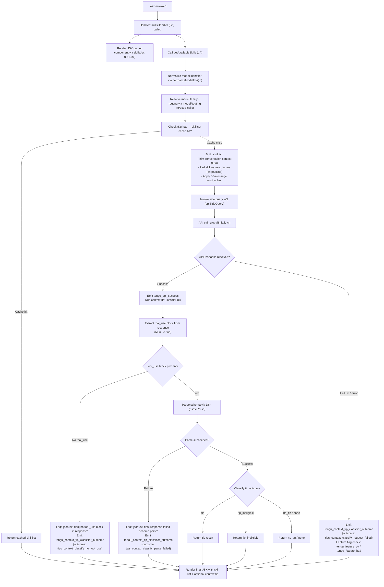

# `/skills`

> Analysis basis: CC v2.1.191 bundle.js (AST extraction + Claude interpretation)
> Minimum version: v2.1.191

---

## Overview

The `/skills` command is an immediately-executed local JSX command that enumerates and displays the skills (capabilities/tools) currently available to Claude Code in the active session. When invoked, it resolves available skills via its async handler, formats them for display, and renders the result inline without requiring any user-provided arguments.

---

## Registration

| Field | Value |
|---|---|
| type | `local-jsx` |
| name | `skills` |
| description | `List available skills` |
| immediate | `true` |
| module_id | `PUl` |
| load_inline | `true` |
| loc_byte | `12403904` |
| loc_byte_end | `12404036` |
| loc_line | `8189` |
| arbor_handler.name | `Jvf` |
| arbor_handler.fqn | `claude-2.1.191::Jvf` |
| arbor_handler.kind | `AsyncFunction` |
| arbor_handler.resolution_path | `module_id` |
| arbor_handler.n_hits | `0` |

Analysis basis: CC v2.1.191 bundle.js:+12403904

---

## Input Branching

The `/skills` command itself accepts no free-form user input — it is an `immediate` command. However, its handler (`Jvf`) has non-trivial internal branching: it collects available skills, processes conversation context for a context-tip classifier side-query, and then renders results. There are 4+ distinct internal paths (skill collection, classifier request success, classifier parse failure, classifier request failure). A Mermaid flowchart is used below.



---

## Behavioral Spec

### Top-Level Handler: `skillsHandler` (Jvf)

Analysis basis: CC v2.1.191 bundle.js:+12403717

```
async function skillsHandler(context):
    // Render JSX output shell first (immediate display)
    outputElement = renderSkillsJsx(context)          // OUl.jsx, loc:+12403717

    // Collect available skills for this session
    skillList = await getAvailableSkills(context)     // gA, loc:+12403781

    return outputElement(skillList)
```

---

### Skill Collection: `getAvailableSkills` (gA)

Analysis basis: CC v2.1.191 bundle.js:+2299433, +2299441, +2299444, +2299479

```
async function getAvailableSkills(context):
    // Normalize model identifier string
    modelId = normalizeModelId(context.model)         // Qo, loc:+2299433

    // Resolve routing/family info
    routingInfo = resolveModelRouting(modelId)        // ao, loc:+2299444

    // Check if skill set is already cached
    if skillCache.has(context.sessionKey):            // tKu.has, loc:+2299479
        return skillCache.get(context.sessionKey)

    // Check routing for application-inference-profile
    // Literal: "application-inference-profile", loc:+2299315
    if routingInfo.includes("application-inference-profile"):
        // loc:+2299304
        applyInferenceProfileRouting()

    // Build raw skill list (depth-4 detail not fully available)
    rawSkills = buildSkillList(context, routingInfo)

    // Trim conversation context window (max 30 messages, loc:+16668949)
    trimmedContext = trimContextWindow(rawSkills, maxMessages=30)

    return trimmedContext
```

---

### Model Identifier Normalization: `normalizeModelId` (Qo)

Analysis basis: CC v2.1.191 bundle.js:+2301590, +2301601, +2301619

```
function normalizeModelId(rawModelString):
    // Trim whitespace
    s = rawModelString.trim()                         // e.trim, loc:+2301590
    s = s.toLowerCase()                               // t.toLowerCase, loc:+2301601

    // Detect provider/platform prefix
    provider = detectProvider(s)                      // nH, loc:+2301619
    // Providers detected: "bedrock", "foundry", "anthropicAws", "vertex"
    // loc:+2134446, +2134496, +2134552, +2134654

    // Strip provider prefix characters
    s = stripProviderPrefix(s)                        // il, loc:+2301629

    // Check for unsupported/reserved model family markers
    if isBlocklisted(s):                              // Dk, loc:+2301647
        // Yme.includes check, loc:+2280038
        applyBlocklistHandling(s)

    // Apply family alias normalization
    // Known family aliases (literals found in traversal):
    //   "fable"     loc:+2301667
    //   "[1m]"      loc:+2301718
    //   "opusplan"  loc:+2301734
    //   "sonnet"    loc:+2301779
    //   "haiku"     loc:+2301822
    //   "opus"      loc:+2301864
    //   "best"      loc:+2301902
    s = applyFamilyAliasMap(s)                        // UFe/$w/c_, loc:+2301682/2301755/2301886

    // Replace residual punctuation/special chars
    s = cleanModelString(s)                           // $j, loc:+2301883
    s = t.replace(s)                                  // loc:+2302017

    return s
```

---

### Context Window Trimmer: `contextWindowTrimmer` (L6o)

Analysis basis: CC v2.1.191 bundle.js:+16668916, +16668940, +16668949, +16669122, +16669161, +16669424, +16669687

```
function trimContextWindow(messages, maxMessages=30):
    // Trim conversation array to at most 30 most-recent messages
    // loc:+16668949
    window = messages.slice(-maxMessages)             // e.slice, loc:+16668940

    result = []
    cacheMap = new Map()

    for message in window:
        role = message.role                           // "user" / "assistant", loc:+16668982/16668999
        contentItems = []

        for item in message.content:
            if item.type == "text":                   // loc:+16669206
                contentItems.push(item)
            elif item.type == "tool_result":          // loc:+16669266
                // Truncate tool_result content if over 1000 chars
                // loc:+16669144
                truncated = truncateToolResult(item, maxLen=1000)
                contentItems.push(truncated)
            elif item.type == "tool_use":             // loc:+16669676
                contentItems.push(item)
            elif item.type == "tool":                 // loc:+16669446
                // Append " (error)" suffix if applicable, loc:+16669486
                contentItems.push(annotateToolError(item))

        // Cache tool_use entries (max 300 chars), loc:+16669651
        if Array.isArray(message.content):           // loc:+16669161
            cacheKey = computeCacheKey(message)
            if not cacheMap.has(cacheKey):           // o.get, loc:+16669424
                cacheMap.set(cacheKey, contentItems) // o.set, loc:+16669687

        result.push({ role, content: contentItems }) // r.push, loc:+16669122

    return result.join(...)                          // r.join, loc:+16669769
```

---

### API Side Query: `apiSideQuery` (wN)

Analysis basis: CC v2.1.191 bundle.js:+8937282, +8937327, +8937388, +8937455, +8937549, +8937632, +8938174, +8938241, +8938785

```
async function apiSideQuery(payload, options):
    // Mark as side_query type, loc:+8937327
    requestType = "side_query"

    // Apply structured_outputs if feature-flagged, loc:+8937455
    useStructuredOutputs = checkFeatureFlag("structured_outputs")

    // Build request with token budget
    // Max tokens: 1024 (loc:+8937136), budget multiplier: 2 (loc:+8937154)
    tokenBudget = Math.min(computedBudget, MAX_TOKENS)  // Math.min, loc:+8938174

    // Cache duration: "1h", loc:+8938216
    cacheSettings = { ttl: "1h", type: "ephemeral" }    // loc:+16670866

    // Make fetch request
    response = await globalThis.fetch(endpoint, {       // loc:+8937388
        headers: buildHeaders(),                        // xf/oW, loc:+8937282/8937295
        body: JSON.stringify(payload)
    })

    // Parse response; sanitize lone surrogates if needed
    // Emits: tengu_lone_surrogate_sanitized, loc:+8938694

    // Record timing metrics
    startTime = performance.now()                       // loc:+8938785
    endTime = Date.now()                                // loc:+8938970

    // On success emit telemetry
    // Emits: tengu_api_success, loc:+8938998

    // If error occurs, log issue URL:
    // "report the issue at https://github.com/anthropics/claude-code/issues"
    // loc:+8937549

    return parsedResponse
```

---

### Context Tip Classifier: `contextTipClassifier` (e — inner handler)

Analysis basis: CC v2.1.191 bundle.js:+16670698, +16670796, +16670806, +16670837, +16670960, +16671099, +16671182, +16671214, +16671264, +16671336, +16671410, +16672002

```
async function contextTipClassifier(conversationContext, sessionState):
    // Build trimmed context (max 512 tokens for classifier, loc:+16671099)
    trimmedCtx = buildClassifierContext(conversationContext, maxTokens=512)

    // Label: "context_tip_classifier", loc:+16671138

    // Issue side query via apiSideQuery (wN), loc:+16670796
    // Uses Date.now() for request timestamping, loc:+16670769
    response = await apiSideQuery(trimmedCtx, {
        cacheType: "ephemeral",                         // loc:+16670866
        label: "context_tip_classifier"
    })

    // Collect session state (S4), loc:+16670806
    sessionInfo = getSessionState()

    // Build context summary string (usm), loc:+16670837
    contextSummary = buildContextSummary(sessionInfo)

    // Format skill entries with column padding (hsm), loc:+16670960
    // Separator: ", " (loc:+16670268)
    formattedSkills = formatSkillEntries(skillList, separator=", ")

    // Extract tool_use block from response (M6n / e.find), loc:+16671182
    toolUseBlock = response.content.find(block => block.type == "tool_use")
                                                        // loc:+8934012

    if toolUseBlock is null:
        // Log warning, loc:+16671216
        // "[context-tips] no tool_use block in response"
        logDebug("[context-tips] no tool_use block in response")

        // Emit telemetry (Re), loc:+16671336
        emitTelemetry("tips_context_classify_no_tool_use")
                                                        // loc:+16671363
        return null

    // Validate response against schema (D6n / t.safeParse), loc:+16671410
    parseResult = schema.safeParse(toolUseBlock.input) // loc:+8934129

    if not parseResult.success:
        // Log "[context-tips] response failed schema parse", loc:+16671438
        logDebug("[context-tips] response failed schema parse")

        // Emit: tips_context_classify_parse_failed, loc:+16671584
        emitTelemetry("tips_context_classify_parse_failed",
                      { outcome: "parse_failure" })     // loc:+16671277

        // dsm called for cleanup, loc:+16671416
        cleanupOnParseFailure()

        return null

    classification = parseResult.data

    // Determine outcome
    if classification.result == "tip":                  // loc:+16671782
        outcome = "tip"
    elif classification.result == "tip_ineligible":    // loc:+16671788
        outcome = "tip_ineligible"
    elif classification.result == "no_tip":            // loc:+16671805
        outcome = "no_tip"
    else:
        outcome = "none"                                // loc:+16671838

    // Check session state for eligibility (o.some), loc:+16671726
    isEligible = sessionState.some(checkEligibility)

    // Emit outcome telemetry (cSt), loc:+16671264
    emitTelemetry("tengu_context_tip_classifier_outcome", {
        outcome: outcome
    })

    // On error path (we/Re): loc:+16671909/16671336
    // Emit: tengu_feature_ok or tengu_feature_bad, loc:+1025725/1025792

    // Format final output (Ae / String coercion), loc:+16672002
    return String(classification)
```

---

### Skill Entry Formatter: `formatSkillEntry` (o — column padder)

Analysis basis: CC v2.1.191 bundle.js:+17397128, +17397141, +17397162

```
function formatSkillEntry(skillRecord):
    // Map sub-fields for each skill
    parts = skillRecord.map(field => field.map(...))   // s.map, loc:+17397128

    // Pad skill name to fixed column width
    // Padding character: "  " (two spaces), loc:+17397162
    paddedName = skillRecord.name.padEnd(columnWidth, "  ")
                                                       // i.padEnd, loc:+17397141

    return paddedName + parts.join(", ")
```

---

## State & Side Effects

| Item | Detail |
|---|---|
| Telemetry: `tengu_lone_surrogate_sanitized` | Fired when the API response contains lone Unicode surrogates that require sanitization (bundle.js:+8938694) |
| Telemetry: `tengu_api_success` | Fired on a successful API response from the side-query (bundle.js:+8938998) |
| Telemetry: `tengu_context_tip_classifier_outcome` | Fired with the classifier outcome field; possible values: `tips_context_classify`, `tips_context_classify_no_tool_use`, `tips_context_classify_parse_failed`, `tips_context_classify_request_failed` (bundle.js:+16672225) |
| Telemetry: `tengu_feature_bad` | Fired when a feature-flag check fails during error handling path (bundle.js:+1025792) |
| Telemetry: `tengu_feature_ok` | Fired when a feature-flag check passes during error handling path (bundle.js:+1025725) |
| Side query | Issues a `"side_query"`-typed background API request to the classifier model using `globalThis.fetch` (bundle.js:+8937327, +8937388) |
| Skill cache | Reads from and writes to an in-process Map (`tKu`) keyed by session identifier (bundle.js:+2299479) |
| Context window trimming | Trims conversation to last 30 messages before building the classifier payload (bundle.js:+16668949) |
| Token budget | Classifier side-query capped at 1024 tokens with multiplier 2 (bundle.js:+8937136, +8937154); inner classifier context capped at 512 tokens (bundle.js:+16671099) |
| Cache TTL | Side-query responses cached with `"ephemeral"` type and `"1h"` TTL (bundle.js:+8938216, +16670866) |
| JSX render | Renders result inline as a JSX component via `OUl.jsx` (bundle.js:+12403717) |
| appState changes | <!-- TODO: not found in depth-2 traversal; needs --depth 4 --> |
| Sound | <!-- TODO: not found in depth-2 traversal; needs --depth 4 --> |
| Hook registration | <!-- TODO: not found in depth-2 traversal; needs --depth 4 --> |

---

## Version History

| Version | Change |
|---|---|
| v2.1.191 | Initial analysis |

---

## Common Mistakes

1. **Expecting argument input**: `/skills` is registered with `immediate: true` and takes no user-provided arguments. Passing text after the command has no defined effect on skill resolution.
2. **Assuming synchronous output**: The handler (`Jvf`) is an `AsyncFunction`. The JSX shell renders immediately, but the skill list and any context-tip classifier result arrive asynchronously via a side query.
3. **Misinterpreting the context-tip classifier outcome**: The classifier result (`tip`, `tip_ineligible`, `no_tip`, `none`) describes whether a contextual hint should be shown — it does not affect which skills are listed.
4. **Cache invalidation confusion**: Skill results are cached per session key in `tKu`. Restarting a session or changing the model may produce a different skill set; invoking `/skills` multiple times in the same session will hit the cache after the first call.
5. **Token budget misreading**: The side-query uses a 1024-token limit at the API call layer; the inner classifier context is separately capped at 512 tokens. These are independent limits.
6. **Model alias ambiguity**: The model normalization pipeline (`Qo`) collapses many aliases (`"fable"`, `"sonnet"`, `"haiku"`, `"opus"`, `"best"`, `"opusplan"`, `"[1m]"`) into canonical identifiers. Debug logging should use the normalized form.

---

## Appendix — Identifier Mapping

> For bundle debugging only. Identifiers change across versions.

| Identifier | Role |
|---|---|
| `Jvf` | Top-level async handler for `/skills` command (`skillsHandler`) |
| `gA` | Skill collection function (`getAvailableSkills`) |
| `Qo` | Model identifier normalization function (`normalizeModelId`) |
| `L6o` | Conversation context window trimmer (`trimContextWindow`) |
| `wN` | API side-query executor (`apiSideQuery`) |
| `S4` | Session state collector (`getSessionState`) |
| `usm` | Context summary builder (`buildContextSummary`) |
| `hsm` | Skill entry list formatter / string builder (`formatSkillEntries`) |
| `M6n` | Tool-use block extractor from API response (`extractToolUseBlock`) |
| `T` | Log/debug utility with level check (`debugLogger`) |
| `cSt` | Telemetry emitter for classifier outcome (`emitClassifierOutcomeTelemetry`) |
| `Re` | Alternate telemetry emitter (used in no-tool-use path) (`emitNoToolUseTelemetry`) |
| `D6n` | Schema safe-parse wrapper (`safeParse`) |
| `dsm` | Parse-failure cleanup routine (`cleanupOnParseFailure`) |
| `we` | Feature-flag-gated telemetry emitter (`emitFeatureFlagTelemetry`) |
| `Ae` | String coercion / output formatter (`stringFormatter`) |
| `nH` | Provider prefix detector (`detectProvider`) |
| `ege` | Model-family resolver helper (`resolveModelFamily`) |
| `il` | Provider prefix stripper (`stripProviderPrefix`) |
| `Dk` | Model blocklist checker (`isBlocklisted`) |
| `UFe` | Family alias normalizer — "fable" path (`normalizeFableAlias`) |
| `DPr` | Sub-normalizer within fable alias path (`fableAliasSubNormalizer`) |
| `ev` | Utility — environment/context accessor (`envAccessor`) |
| `oz` | Routing config resolver (`resolveRoutingConfig`) |
| `d0t` | String replace helper for model IDs (`modelIdReplace`) |
| `$w` | Family alias normalizer — "sonnet/opusplan" path (`normalizeSonnetAlias`) |
| `khn` | Sub-normalizer for sonnet/opusplan alias path (`sonnetAliasSubNormalizer`) |
| `$j` | Punctuation/special-char cleaner for model IDs (`cleanModelIdPunctuation`) |
| `c_` | Family alias normalizer — "haiku/best" path (`normalizeHaikuAlias`) |
| `fCe` | Sub-normalizer for haiku/best alias path (`haikuAliasSubNormalizer`) |
| `WKs` | Top-level model routing resolver (`resolveModelRouting`) |
| `iie` | Routing sub-resolver (gateway path) (`resolveGatewayRouting`) |
| `Na` | Full model negotiation / policy settings resolver (`resolveModelWithPolicy`) |
| `ed` | Base routing entry resolver (`baseRoutingResolver`) |
| `_r` | Low-level routing record builder (`buildRoutingRecord`) |
| `tie` | Model inclusion checker (`isModelIncluded`) |
| `FFe` | Routing fallback handler (`routingFallback`) |
| `rt` | String coercion primitive used in routing (`routingStringCoerce`) |
| `Yqu` | Case-lowering normalizer for model IDs (`lowerCaseNormalizer`) |
| `QU` | Model family lookup (claude-fable/mythos/opus) (`lookupModelFamily`) |
| `ao` | Model routing info builder (`buildModelRoutingInfo`) |
| `PH` | Routing record assembler (`assembleRoutingRecord`) |
| `uu` | Routing utility — Ymn wrapper (`routingUtility`) |
| `o` | Skill entry column formatter (`skillEntryColumnFormatter`) |

---

Note: index built via Arbor fallback; some signals (telemetry, literals) may be missing — see arbor-fallback.js.